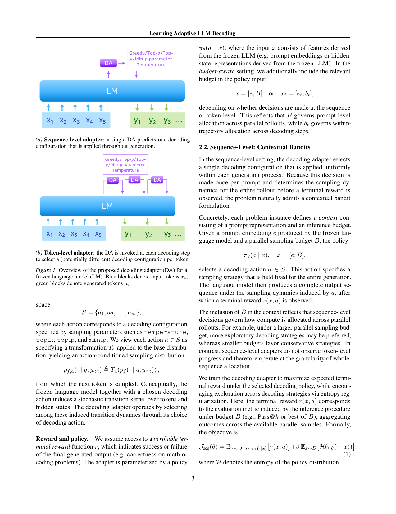
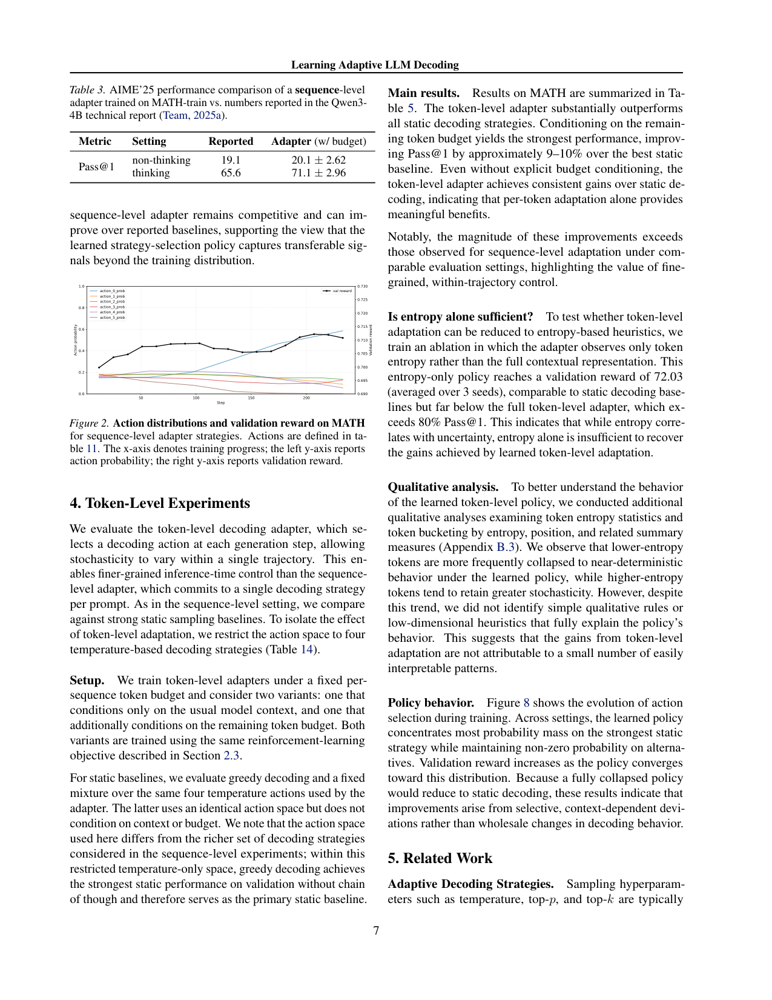

`adaptive_decoding | Learning Adaptive LLM Decoding | Harvard(Kempner Inst.) + UC Berkeley + Amazon；Chloe H. Su / Udaya Ghai 等（实习于 Amazon） | 2026-03（arXiv:2603.09065v2，preprint） | L1 免梯度·test-time（改 logits/采样策略，不改权重） | 相关性 Med-High`

> 【档位】deep（由 light 升级，补全第二层/第三层）。基于真实 PDF 正文（正文 §1–§7 全 + 附录 A 扩展相关工作 / B 额外实验，方法/实验/related 已完整覆盖；剩余为附录超参表）。三标注：【原文】/【推断】（附依据）/【待核】。

---

## ══ 第一层：一眼看懂 ══

- 🟦 **TL;DR**：【原文】LLM 解码常年用**固定**采样超参（temperature/top-p/top-k），但不同 prompt、甚至同一推理链里不同 token 的难度/不确定性差很大。本文学一个**轻量"解码适配器(DA)"在推理时动态选采样策略**、LLM 权重全程冻结，且**显式以"计算预算"为条件**训练。两个层级:① **序列级=上下文 bandit**:每个 prompt 选一个解码配置(greedy/top-k/top-p/min-p),输入=prompt embedding + 并行采样预算 B;动作集用**数据驱动的子模贪心**从大候选池选出小而互补的策略集(借鉴 AuPair);② **token 级=POMDP**:每步看内部隐状态 + 剩余 token 预算 b_t 选(主要是 temperature)动作,用 **REINFORCE**+可验证终端奖励训练。在 MATH / CodeContests(Qwen3-4B)上,token 级在固定 token 预算下 Pass@1 最高 **+10.2%**,序列级在固定并行采样下 +2–3%。
- **最巧的一步**：【原文+推断】**把"计算预算"塞进策略输入并跨预算训练**(x=[e;B] 或 x_t=[e_t;b_t]),且**只用任务正确性奖励、不用 reward model/偏好**。【推断】抽掉"预算条件化",就退化成又一个自适应采样头——论文核心反复强调:budget-conditioning 即使在固定预算下评测也一致更好(§3.2),因为它把"train-test 推理约束不匹配"显式建进训练;另一关键消融"**entropy-only**"(只给 token 熵当输入)只到 72% 验证奖励、远低于完整 token 适配器的 >80% Pass@1——说明增益**不是简单的熵阈值启发式**能复现的,必须学。【推断依据:§4"Is entropy alone sufficient?"消融 + §3.2 budget 消融】。

---

## ══ 第二层：为什么做 ══

- **研究背景**：【原文】LLM 推理已是主要算力瓶颈,而**解码**(从预测分布采样输出 token)是关键低效源:当前实践用**固定**采样超参(temperature/top-k/top-p),为整个模型或数据集静态选定(§1)。这忽略了 prompt、推理风格、甚至单个 token 之间的巨大异质性——最优解码策略常取决于 token 级不确定性或问题结构等潜在特征。近期分析(Lin 2024/Wang 2025a)指出**推理时不确定性常集中在少数高熵 token**(forking tokens)。
- **解决的具体痛点**：【原文】两个并行缺口(§1):① **现有自适应采样/置信度感知解码**(min-p/EDT/LPO/AdaDec 等)**依赖静态启发式或离线调好的参数**,不把解码决策纳入端到端学习目标。② **RLVR(可验证奖励 RL)管线里,解码策略被当作生成时的固定设置**——即便采样方法直接影响输出的 support 与 diversity。一个技术原因:top-k/nucleus 会改输出分布的 support,**给标准 policy-gradient 训练添麻烦**,所以主流开源 RLVR 框架(如 **TRL**)把这些超参当固定生成设置、而非可学组件。这造成 **train-test 推理约束不匹配**(训练在固定解码分布/预算下优化,部署在不同推理约束下)。
- **相关工作 & 各自不足**：【原文,§5+附录 A】(a) **自适应采样架构**:AutoDeco(每 token 控制头预测 temp/top-p,端到端配偏好建模)、Dhuliawala LPO、Du 2025(多温度采样+重排);不足:**多依赖学到的偏好或 reward model**。(b) **推理时决策/算力分配**:Qu 2025 meta-RL 优化 token 级算力、Cui 2025 熵感知目标、MUR(熵动量决定何时继续/停)、D-LLM(逐 token 跳层);不足:它们管"**何时/花多少**算力",不管"**怎么采样**"。(c) **controlled decoding / value guidance**(Mudgal/CARDS/Collab/IVG):用学到的 value/reward 偏置 token 选择;不足:**靠 trained reward model / preference / 事后重排**。(d) **critical/forking tokens**(Wang 2025a 的 80/20、Abdin pivotal tokens、AdaDec):证明高熵少数 token 主导成败,但**用阈值启发式**触发。
- **动机链(为什么非这样不可)**：【原文+推断】现状=解码超参固定、或用启发式/reward model 调;缺陷=静态忽略异质性、reward model 引入额外监督与噪声、阈值启发式手工脆弱;所以提出**纯用任务正确性奖励学一个轻量解码策略、且显式以算力预算为条件、base LLM 全程冻结**。【推断】为什么不直接用熵阈值启发式(便宜)?——§4 "Is entropy alone sufficient?"消融钉死:只给 token 熵当输入的 **entropy-only 策略只到 72.03% 验证奖励**、远低于完整 token 适配器的 >80% Pass@1,说明增益**不是简单熵阈值能复现的、必须学**。为什么显式建预算?——§3.2:budget-conditioning 即使在**固定预算下评测**也一致更好(把 train-test 约束不匹配显式建进训练)。
- **与最近邻(AutoDeco / Dhuliawala AdaptiveDecoder)的 Δ**：【原文,§5+A.2】AutoDeco/AdaptiveDecoder 也用轻量头逐 token 选 temp/top-p,但**用 preference 训练 / reward model**;本文 **(i) 只用 task-verifiable 正确性当奖励(无 reward model、无偏好)**,**(ii) 显式 condition 在 compute budget 上并跨预算训练**(prior adaptive decoder 未处理这一维)。【原文】另一个关键 framing 差异:把 **LLM 当 environment / stochastic transition kernel**,学一个 tabula rasa 的解码侧策略(而非把 LLM 本身当 policy 做 PPO,如 GRPO/RLVR)。【推断】这差异有用,是因为"冻结模型 + 小策略 + 只用正确性"既保 base 能力零回归、又避开 reward model 的脆弱,且预算条件化直接对治部署侧的约束漂移。

---

## ══ 第三层：怎么做 + 靠不靠谱 ══

- **方法流水线(两种粒度)**：【原文,Fig.1】把 frozen LLM f 当环境,学轻量解码适配器(DA)调采样,LLM 参数全冻。每个动作 a∈S 对应一个解码配置(temp/top-k/top-p/min-p),视作对 base 分布的变换 T_a:p_{f,a}=T_a(p_f)。
  1. **序列级(contextual bandit)**:每 prompt 选**一个**解码配置,policy 输入 x=[e; B]\(e=prompt embedding,B=并行采样预算),动作对整段生成固定;终端奖励 r=该预算下的 Pass@k/best-of-B;目标 J_seq=E[r]+β·H(π)(熵正则)(§2.2)。
  2. **动作集构造(数据驱动子模贪心)**:借鉴 **AuPair**——从大候选池(temp/top-k/top-p/min-p 组合)在 held-out 上用**子模最大化贪心**选小而互补的策略集 S(max F(S)=Σ_x max_{s∈S} R(x,s)),保证"best-of-S"覆盖高性能行为(§2.4)。
  3. **token 级(POMDP)**:每步 policy 观察 x_t=[e_t; b_t]\(e_t=该步隐状态嵌入,b_t=b−t 剩余 token 预算)、选动作(主要是 **temperature**);目标 J_tok=E[r],REINFORCE 优化(§2.3)。
  4. **训练稳定化(关键)**:naive token 级 REINFORCE 高方差不收敛,需两招——① 过滤产生稀疏/噪声奖励的 prompt;② **mask 掉 max-prob>0.95 的近确定 token**(它们贡献少学习信号却显著加方差)。【原文】"Without these adjustments, we were unable to obtain stable training"。
- **逐组件必要性(及消融)**：【原文】
  - **预算条件化**:必要——§3.2 + Table 5:token 级 w/ budget 比 w/o budget 再涨(MATH w/o CoT +6.68→+9.49pp、mix CoT +5.85→+10.23pp),且固定预算评测也更好。
  - **学(而非熵启发式)**:必要——§4 entropy-only 消融只 72.03% 验证奖励 vs 完整 >80%;且**定性分析未找到能解释策略的简单低维规则**(Appendix B.3),说明增益非少数可解释模式。
  - **子模贪心选动作集**:【推断】必要性较弱、未单独消融——它保证动作集"小而互补",但论文未做"随机选动作集 vs 子模选"的对比。
  - **熵正则**:防策略塌成单一动作——§3.4 Fig.2:学到的策略**不塌**,把概率质量集中到少数高效策略、同时对替代项保留非零概率(exploitation 与 robustness 权衡)。
- **关键机制/公式直觉**：
  - **x_t=[e_t; b_t] 把"剩余预算"塞进 token 级策略输入**:【原文+推断】直觉=预算多→该探索性采样(放开 temperature)、临近结尾→趋确定(降方差稳定 completion)。这把"何时该探索/该确定"做成**可学的、随轨迹位置变化的** stochasticity 分配,而非全局固定温度。
  - **把 LLM 当 stochastic transition kernel、DA 选 transition dynamics**:【原文】§2.1——adapter 通过选解码动作,在 frozen LLM 诱导的 token+hidden 转移核里选一条;这是"tabula rasa RL on frozen model"的形式化,区别于把 LLM 当 policy 的 GRPO/PPO。
- **实验与证据(关键实验+具体数字)**：【原文】base=**Qwen3-4B**(主),Qwen3-8B/Qwen2.5-Math-1.5B(附录);数据=**MATH**+**CodeContests**(+AIME'25 泛化)。**最关键结果**=Table 5(token 级,MATH,固定 token 预算):budget 变体 Pass@1 **80.82%(+9.49)/ 82.33%(+10.23)** vs 最佳静态;序列级(Table 1-2,固定并行采样)+2–3%(MATH)、CodeContests 因基数低相对增益大(Pass@1 11.43→14.50,+27%)。**支撑核心主张的关键实验**=§4 的 entropy-only 消融 + §3.2 的 budget 消融——前者证"非启发式可复现"、后者证"预算条件化是增益主驱动",共同回答"这是真学到了 vs 只是重参数化静态启发式"。**baseline 是否公平**:【推断】比了 BEST(最佳单一静态策略)和 MIXED(同动作集均匀混合、无学习)两个强静态基线、用同动作空间,较公平;泛化性测了 AIME'25(MATH 训→无调,thinking 65.6→71.1)和 OOD(MATH 训→CodeContests)。**看着强但没回答核心问题**:【推断】**混合域训练(math+code)增益变小**(Table 4,§3.3),说明跨域 compromise 解会稀释收益;且 token 级增益虽大但**REINFORCE 天然高方差、需两招稳定才收敛**(鲁棒性存疑)。
- **假设与失效边界**：【原文+推断】① 假设**有可验证终端奖励**(math/code 正确性)且 **base LLM 足够强**;② 失效:token 级 REINFORCE **高方差**(需过滤+mask 才稳)、**混合域训练增益变小**(§3.3)、动作空间被限在小离散集(§6 自陈"连续/更丰富解码变换会根本改变学习问题、引入新优化/样本效率挑战");③ 【推断】**完全无经验积累/记忆/防遗忘**——纯解码控制,reward 难定义的任务(对话/开放推理)未测。
- **祛魅总结**：【推断】**真贡献(硬货)**=把"在关键/高熵 token 上分配探索性"从**阈值启发式做成可学**(RL),且**只用正确性奖励(无 reward model/偏好)+ 显式预算条件化**,并给出"LLM 当 environment、学解码侧小策略"的干净 framing;token 级 +10.2pp、entropy-only 消融、budget 消融都是实打实的证据。**包装/需打折的**:① **正文未给代码链接**(待核 arXiv 主页);② 增益**主要在 token 级 + 单域 + 有可验奖励**的窄设定,混合域就明显稀释;③ "learn adaptive decoding"听起来通用,但**本质是冻结模型外训一个小 REINFORCE 策略**(不是 training-free、需训练期 RLVR rollout),且高方差需特调;④ 作者较诚实地把"连续动作空间/与 base 联合训练/早停等更丰富控制"列为 future work,未过度宣称已是通用解码控制层。

---

## ══ 结构化抽取 ══

### 🎯 机制速览 6 轴
| 维度 | 内容 |
|---|---|
| **学什么信号** | **可验证终端奖励**(math/code 正确性,RLVR 式)；**无 reward model、无偏好标注、无人工启发式**;序列级奖励=该预算下的 Pass@k/best-of-B |
| **改什么** | **解码策略/采样超参(temperature/top-p/top-k/min-p)** via 轻量适配器(序列级 MLP / token 级策略)→ 等价于对 base 分布施加变换 T_a;**LLM 权重冻结**(把 LLM 当"环境/stochastic transition kernel") |
| **何时改** | **test-time·两种粒度**:序列级=每 prompt 一次(per-episode);token 级=**每步**(in-episode per-step);均显式条件化于"剩余预算" |
| **免梯度?** | **混合**:对 base LLM 是**免梯度**(冻结);但**适配器本身用 REINFORCE 梯度训练**(不是 training-free,是"在冻结模型外训一个小策略") |
| **记忆-技能生命周期** | **不适用/极弱**:无外部记忆、无技能库、无经验积累;学到的是一个**参数化解码策略**(reusable across prompts),无"写入→检索→淘汰"生命周期 |
| **防遗忘机制** | **隔离式(不动 base 权重→base 能力零回归,可一键禁用回滚)**;适配器自身是小 MLP,无跨任务持续学习,故无显式防遗忘需求 |

### ⑦ 开源代码 + 框架/harness
- 【原文/待核】正文**未给出代码链接**〔待核:arXiv 主页是否附 release——本次仅核 PDF,正文无 link〕。
- 框架/harness:【原文】base=**Qwen3-4B**(主),Qwen3-8B / Qwen2.5-Math-1.5B(附录);训练算法 **REINFORCE(Williams 1992)** + GAE/baseline 降方差 + 熵正则;提到用 **Ray Train** 做可扩展训练。**与 TRL 对比**:作者明确指出主流 RLVR 框架(如 TRL)把解码超参当固定生成设置——本文反其道把它学出来。**非纯 training-free**(训小策略)。

### 💰 资源/成本与可扩展性
- 【原文】序列级适配器=2 层 MLP;token 级=每步调一次小策略,**额外算力相对 LLM 前向可忽略**;关键状态特征(隐状态/logits)解码时本就产生。训练稳定性需两个技巧:过滤稀疏/噪声奖励的 prompt + mask 掉 max-prob>0.95 的近确定 token(否则 REINFORCE 高方差不收敛)。【推断】部署成本极低(冻结模型+小策略),主要成本在训练期的 RLVR rollout。**未报具体 $/GPU 时**。

### 🎯 对"探索-巩固"idea 对标
- **可借组件(探索期的"在哪、用多大随机性"控制)+ 部分竞品**:这篇是**纯解码层的 test-time 控制**,与"探索-巩固"的关联点在**"如何在关键 token 上分配探索性(随机性)"**。
  - **可借组件**:① **token 级按"剩余预算 + 内部状态"分配 stochasticity**(预算多→探索性采样、临近结尾→趋确定),直接呼应"探索-巩固"里"探索期放开、巩固/收敛期收紧"的时间安排——可作 MTP foresight 触发"该探索还是该确定"的解码侧落点;② **forking/critical token** 视角(高熵少数 token 主导多步解的成败,引 Wang 2025a 80/20 规则)= 与你的"切关键步(高熵/低置信)而非换行"高度同构——本文把"在关键 token 处自适应采样"做成**可学**而非阈值启发式;③ **预算条件化**="巩固期算力/步数预算如何影响策略"的可迁移建模思路。
  - **竞品/差异维度**【推断】:它**完全不碰知识固化/经验积累/防遗忘**——只改采样分布、不改模型也不存经验。对"探索-巩固若要把探索成果固化进权重"它无贡献;但作为**探索期的低成本'how to sample'控制层**,可与"巩固进权重"正交叠加(作者自列 future work:适配器与 base 联合训练)。

### 🖼 关键图 top-2

- 这是**原文 Figure 1**(方法主图)。(a) 序列级:单个 DA 对整段生成预测一个解码配置;(b) token 级:每步调 DA 选(可不同的)解码配置(temperature)。蓝块=输入 token、绿块=生成 token。**选它**:一图说清"两种粒度的解码控制 + 冻结 LM 当环境",是 6 轴(改什么/何时改)的依据图。

- 这是**原文 Figure 2**(行为分析图,MATH)。训练中策略**不塌成单一动作**,而是把概率质量集中到少数高效策略、同时对替代项保留非零概率(exploitation 与 robustness 的权衡);右轴验证奖励随之上升。**选它**:直观展示"学到的是 selective、context-dependent 偏离而非全盘换策略"——回答"这是真学到了 vs 只是重参数化静态启发式"的核心质疑。

---

### 假设与失效边界(一句)
- 【原文+推断】假设**有可验证终端奖励(math/code)且 base LLM 足够强**;失效/边界:**token 级 REINFORCE 天然高方差**(需过滤+mask 才稳)、混合域训练增益变小(§3.3)、动作空间被限在小离散集(连续/更丰富解码变换"会根本改变学习问题",作者列 future work);且**完全无经验积累/记忆/防遗忘**——纯解码控制,reward 难定义的任务(对话/推理)未测。

### 对"探索-巩固"对标(一句)
- **可借组件为主、竞品为辅**:提供"**在关键/高熵 token 上可学地分配探索性 + 按预算条件化**"的解码侧控制层(与你的"切高熵关键步"同构),可作探索期的低成本 how-to-sample 落点;但它不碰知识固化/记忆/防遗忘,对"巩固进权重"路线正交叠加而非替代。
