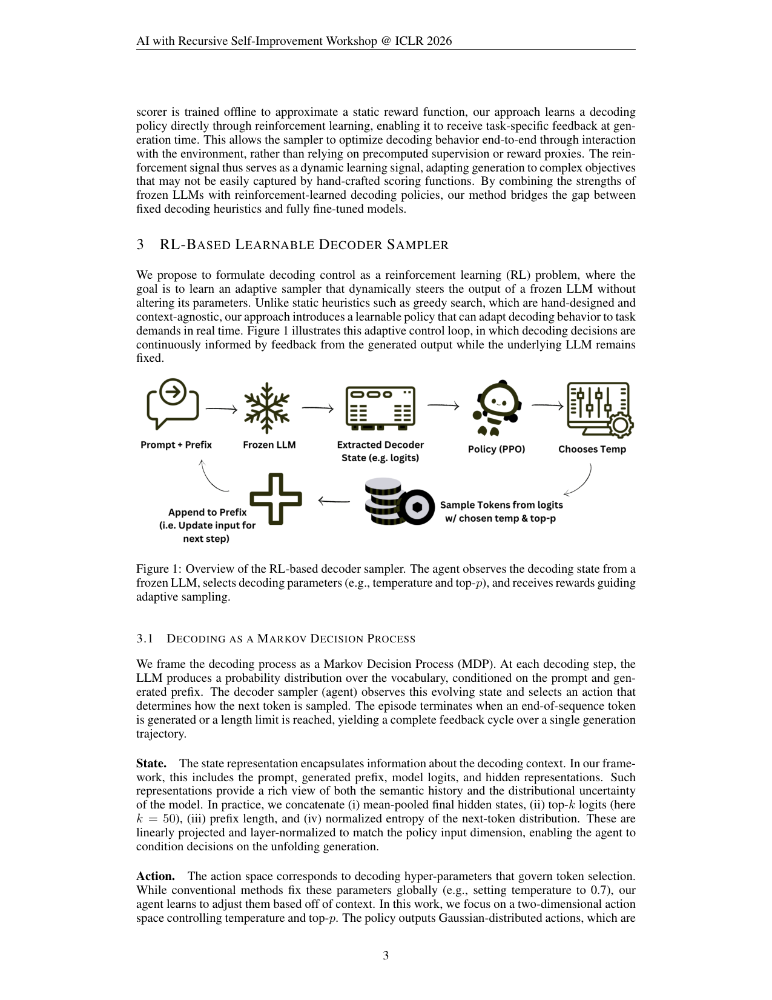
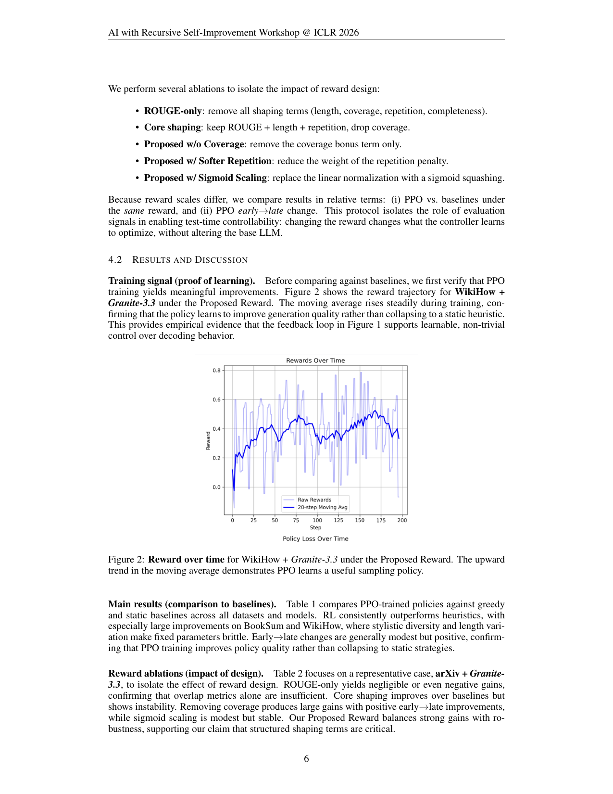

`adaptive_decoding_ttpo | Adaptive Decoding via Test-Time Policy Learning for Self-Improving Generation | UC San Diego + Plastic Labs + IBM Research（实习于 IBM Research）；Asmita Bhardwaj 等 | 2026-03（arXiv:2603.18428v1，ICLR 2026 "AI with Recursive Self-Improvement" Workshop） | L1 免梯度·test-time（改采样参数，不改权重） | 相关性 Med`

> 【档位】deep（由 light 升级，补全第二层/第三层）。基于真实 PDF 正文（9 页：正文 §1–§5 + 参考）。三标注：【原文】/【推断】（附依据）/【待核】。
> 注：与 `adaptive_decoding`（2603.09065，Harvard/Amazon）是**同主题独立工作**——本篇用 **PPO** 调 temperature/top-p、任务是**摘要**、模型更小（0.5B–2B）、奖励是**组合式人工 shaping**（非可验证正确性）。

---

## ══ 第一层：一眼看懂 ══

- 🟦 **TL;DR**：【原文】解码策略很大程度决定输出质量，但 greedy/固定 temperature 是静态且任务无关的，跨域(摘要新闻 vs 小说 vs Reddit)表现不稳。本文把**解码当序列决策(MDP)**,学一个**轻量 RL 采样器(2 层 MLP 策略)在推理时动态调 temperature/top-p**、LLM 权重冻结。状态=mean-pooled 隐状态 + top-50 logits + prefix 长度 + 下一 token 归一化熵;动作=温度/top-p(高斯,squash 到 \(T∈[0.2,1.2]\)、\(p∈[0.8,1.0]\));奖励=**组合式 shaping**(ROUGE-L 0.5 + 长度罚 0.2 + 覆盖奖 0.1 + 重复罚 + 完整性罚);用 **PPO** 训。在 BookSum/arXiv/WikiHow、Granite-3.3-2B 与 Qwen-2.5-0.5B 上,相对 greedy 最高 **+88%(BookSum,Granite)/+79%(WikiHow,Qwen)**。
- **最巧的一步**：【原文+推断】**奖励 shaping 设计 >> RL 算法本身**——这是全文反复强调的主结论。【推断】抽掉结构化 shaping 项(只留 ROUGE),消融(Table 2)显示**ROUGE-only 增益微弱甚至为负、early→late 几乎不升**,而组合奖励才稳定提升;即"会动态调温"本身不值钱,值钱的是**用多分量奖励刻画'好摘要'让策略有可学的梯度信号**。【推断依据:§4.2 Takeaway 1–3 + Table 2 五组奖励消融,作者明说"reward design is as important as the RL algorithm itself"】。

---

## ══ 第二层：为什么做 ══

- **研究背景**：【原文】解码(从模型预测分布选 token)对最终输出质量起决定作用(§1)。常规方法(greedy/top-k/nucleus/beam/contrastive/Mirostat)靠**固定启发式**,不随生成的演化 context 或不同任务需求自适应,限制了模型生成多样文本的自由度;改解码行为通常要重训/微调 LLM,贵且不可扩展。**从递归自改(RSI)视角看,解码是一个特别诱人的介入点**:它让模型能监控自身生成、评估结果、调整后续动作——**全程不改内部参数**(§1,本文投 ICLR 2026 "AI with Recursive Self-Improvement" Workshop)。
- **解决的具体痛点**：【原文】固定解码策略**跨域表现不稳**——摘要不是单一任务,摘要新闻 vs 小说章节 vs Reddit 帖各需不同的风格/结构权衡,静态启发式难以跨这些域自适应,在平衡 fluency/diversity/factual accuracy/stylistic control 等 trade-off 时常 underperform(§1,§3.1 Reward 段)。痛点具体到:既要**轻量**又要**可测**的自适应解码方法仍 underexplored。
- **相关工作 & 各自不足**：【原文,§2】(a) **传统解码**(确定性 beam/contrastive + 随机 top-k/top-p/Mirostat):hand-designed、task-agnostic,难适配下游目标或上下文偏好。(b) **可学/可控解码**(Zhang 2022 综述、Hu 2025 speculative/refinement):多靠**事后控制 token 选择或重排候选生成**。(c) **Controlled Decoding**(Mudgal 2024,学一个 prefix scorer 引导 frozen base):**最近邻**——但其 scorer **离线训练去近似一个静态 reward 函数**。本文差异:**直接用 RL 学解码策略、在生成时拿任务特定反馈**,端到端经环境交互优化(而非预计算监督/reward 代理)。
- **动机链(为什么非这样不可)**：【原文+推断】现状=解码靠固定启发式、改它要重训;缺陷=静态跨域脆弱、重训贵;所以**把解码当序列决策(MDP)、学轻量 RL 采样器在推理时动态调 temp/top-p、LLM 冻结**——三大好处(§3):① 解耦采样控制与 LLM 训练(不移底层学到的分布);② 实时自适应、跨任务/域近实时调;③ MDP 框架给"状态/动作/奖励"提供可泛化结构。【推断】为什么是 RSI 视角下的"最低风险自改面"?——§5 conclusion:推理时操作、不改参数→**避免对 base 的永久回归、禁用策略即回滚、可经奖励定义与动作边界审计**,比权重级更新低风险、可逆。
- **与最近邻的 Δ**：① 与 **Controlled Decoding(Mudgal)** 的 Δ:对方 prefix scorer **离线近似静态 reward**;本篇**在线 RL、生成时拿任务反馈**,适配难以被手工 scoring 捕捉的复杂目标(§2 末)。② 与同名 **adaptive_decoding(Harvard/Amazon)** 的 Δ【推断】:那篇用 **RLVR 可验证正确性**奖励、任务是 **reasoning(math/code)**、模型 Qwen3-4B/8B、有 budget 条件化;本篇用**组合式人工 shaping 奖励**、任务是**摘要**、模型 0.5B–2B、无 budget 维、定位 RSI workshop 的"短 horizon 可测自改踏脚石"——**更弱但更聚焦"奖励设计"这一课题**。

---

## ══ 第三层：怎么做 + 靠不靠谱 ══

- **方法流水线(把解码当 MDP)**：【原文,Fig.1,§3】frozen LLM 每步产词表分布,RL 采样器(agent)观察状态→选动作(采样参数)→影响下一 token→经 prefix 影响未来状态,EOS 或长度上限终止=一个完整反馈环。
  1. **State**:concat(① mean-pooled final hidden states,② top-k logits(k=50),③ prefix 长度,④ 下一 token 归一化熵),线性投影+layer-norm 到策略输入维(§3.1 State)。
  2. **Action**:2 维(**temperature + top-p**),策略输出高斯动作、sigmoid squash 后仿射映到 **\(T∈[0.2,1.2]\)、\(p∈[0.8,1.0]\)**;动作不仅影响当前 token、还经演化 prefix 影响未来状态(闭环递归依赖)(§3.1 Action)。
  3. **Reward(组合式 shaping)**:加权归一化组合——**ROUGE-L F1(0.5)** + **长度罚(0.2,偏离源导出理想长度)** + **覆盖奖(0.1,capped,与重要源 token >4 字符的重叠)** + **重复罚(>30% 词重复时触发)** + **完整性罚(−0.05,缺句末标点)**;raw 经 \([\text{RAW\_MIN},\text{RAW\_MAX}]\) 线性归一到 \([0,1]\)(§4.1 Rewards)。
  4. **Policy Learning(PPO)**:策略=2 层 MLP(hidden 256,GELU)→2D 动作高斯;clipped PPO(\(ε=0.2\)),GAE(\(γ=0.99,λ=0.95\)),value 系数 0.5、entropy 系数 0.01;每 dataset **100 prompt**(明确 low-resource RL),报 (i) 绝对平均奖励 + (ii) early→late 变化(证学到而非塌成静态)(§3.2,§4.1)。
- **逐组件必要性(及消融)**：【原文】**核心消融在 reward(Table 2,arXiv+Granite-3.3,5 组变体)**——
  - **ROUGE-only**(去全部 shaping):增益微弱甚至为负(+6.96% vs greedy 但 −0.59% vs static),证 overlap 单指标不够。
  - **Core shaping**(ROUGE+长度+重复,去覆盖):提绝对奖励但 early→late **负**(−4.56%),不稳。
  - **No coverage bonus**(只去覆盖):大幅增益且 early→late **正**(+24.91%)——暗示覆盖项**并非总有益、可能引入噪声**。
  - **Soft repetition penalty**:增益被抑(说明重复控制须够严)。
  - **Sigmoid scaling**:平滑但降训练敏感度、结果中等稳定。
  - **Proposed(全组合)**:平衡强增益与鲁棒,支撑"结构化 shaping 项关键"主张。**结论(§4.2 Takeaway 7)**:"reward design is as important as the RL algorithm itself"。【推断】注意:消融**只在 arXiv+Granite 一格**做,跨域/跨模型未系统消融。
- **关键机制/公式直觉**：
  - **clipped PPO \(L_{clip} = E[\min(ρ_t A_t, \text{clip}(ρ_t,1−ε,1+ε)A_t)]\)**,\(ρ_t=π_θ(a_t|s_t)/π_{θold}(a_t|s_t)\)(§3.2):【原文+推断】标准 PPO,clip 限制单步策略更新幅度、保 low-resource(100 prompt)下稳定;选 PPO 而非 REINFORCE 正因 on-policy 稳定性对样本少的设定关键。
  - **动作经 prefix 影响未来状态(闭环递归)**(§3.1):【原文+推断】这是"in-episode 自改"的极简形式——早期解码决策改变 prefix→改变后续状态分布→agent 在一个 episode 内据后果精炼策略;但本文是**单 episode 内、不跨 episode 学**。
- **实验与证据(关键实验+具体数字)**：【原文】base=**Granite-3.3-2B-Base + Qwen-2.5-0.5B**(均冻结);任务=摘要 **BookSum(长叙事)/arXiv(科学)/WikiHow(how-to)**,各 100 prompt。**主结果(Table 1,Proposed Reward)**:RL 一致超 greedy/static,相对 greedy 最高 **+88.44%(BookSum,Granite)/+78.95%(WikiHow,Qwen)**(注:BookSum-Qwen 那个 +950% 是因 greedy 基数极小 0.014→0.147,不宜直接引为"950% 提升")。**最关键支撑实验**=Fig.2 训练奖励曲线(WikiHow+Granite)**稳步上升**(证 PPO 学到非平凡策略、非塌成静态)+ Table 2 五组奖励消融(证"奖励设计 >> RL 算法"主结论)。**baseline 是否公平**:【推断】比 greedy(argmax)和 static(固定 temp=0.3)两个静态基线、同解码基础设施、训/评 prompt 不重叠,较公平;但**仅摘要单任务、0.5B–2B 小模型**。**看着强但没回答核心问题**:【推断】**early→late 改善"generally modest"且部分为负**(Table 1:WikiHow-Qwen **−43.60%**、arXiv-Granite −4.38%)——即多处训练不稳/未持续改善;且"会动态调温"本身不值钱(ROUGE-only 失效),值钱的全在 reward shaping,这本质上**把难题转移到了"怎么设计 reward"**而非解决它。
- **假设与失效边界**：【原文+推断】① 假设**任务质量可被组合式 shaping 奖励刻画**(本文仅摘要);② 失效:**奖励设计高度敏感**(ROUGE-only 失效、shaping 项配比影响稳定性,Table 2)、**部分配置 early→late 为负**(WikiHow-Qwen −43.6%)、仅 **0.5B–2B 小模型 + 摘要单任务**;③ 【原文,§5】**OOD 鲁棒性与向 dialogue/code/reasoning 迁移均未测**(reward 在那些任务更难定义),作者明确列为 future work;**不碰任何知识/记忆固化**。
- **祛魅总结**：【推断】**真贡献(硬货)**=① 给出"解码当 MDP、PPO 学 temp/top-p、frozen LLM"在**摘要**上的可测实现 + 跨 3 域 2 模型的初步证据;② **"奖励设计 >> RL 算法"这条经验教训**(对任何想用 RL 提炼/巩固信号的工作都有警示价值);③ **把 test-time 解码控制论证成"最低风险、可逆、可审计的自改面"**(§5),为 RSI 提供一个不碰权重的安全 fallback 定位。**包装/需打折的**:① **正文未给代码链接**;② **未报 $/GPU 时**(虽然小模型+100 prompt 成本本就低);③ 这是 **workshop 短文 + "initial evaluations"**(作者原话),only 摘要、小模型、单格消融,**early→late 多处为负**说明远未稳定;④ 与同名 Harvard 工作高度重叠但**更弱**(摘要 vs reasoning、shaping vs 可验证、0.5–2B vs 4–8B);作者诚实自承"短 horizon 可测自改的踏脚石、非 long-horizon 自修改",未过度宣称。

---

## ══ 结构化抽取 ══

### 🎯 机制速览 6 轴
| 维度 | 内容 |
|---|---|
| **学什么信号** | **组合式人工 shaping 奖励**(ROUGE-L + 长度/覆盖/重复/完整性罚)——**非可验证正确性、非 reward model、非人类偏好**;这是与同名 Harvard 工作(用 RLVR 正确性)的关键差异 |
| **改什么** | **解码采样参数(temperature + top-p)** via 轻量 MLP 策略;**LLM 权重冻结**(明确 "keeping LLM weights frozen") |
| **何时改** | **test-time·token 级**(每解码步观察状态选动作,influence 下一 token + 通过 prefix 影响未来状态——闭环);episode=一次完整生成 |
| **免梯度?** | **混合**:对 base LLM 免梯度(冻结);**采样策略本身用 PPO 梯度训**(2 层 MLP,hidden 256) |
| **记忆-技能生命周期** | **不适用**:无外部记忆/技能库/经验积累;学到的是参数化解码策略,无写入-检索-淘汰生命周期 |
| **防遗忘机制** | **隔离式(不动权重→base 能力零回归,禁用策略即回滚)**;作者强调这是"比权重级更新更低风险、可逆、可审计"的自改路径 |

### ⑦ 开源代码 + 框架/harness
- 【原文/待核】正文**未给出代码链接**〔待核:arXiv 主页是否附 release——本次仅核 PDF,正文无 link〕。
- 框架/harness:【原文】base=**Granite-3.3-2B-Base + Qwen-2.5-0.5B**(均冻结);算法 **PPO**(clip \(ε=0.2,γ=0.99,λ=0.95\),GAE,值/熵系数 0.5/0.01);每 dataset 100 prompts(low-resource RL)。任务=摘要(BookSum/arXiv/WikiHow)。**非纯 training-free**(训小策略)。

### 💰 资源/成本与可扩展性
- 【原文】策略=2 层 MLP(hidden 256),**每 token 算力相对 LLM 前向可忽略**;状态特征解码时本就产生、无额外前向;每 run 仅 100 prompt(明确"low-resource RL setting")。可降 top-k 特征维或隐状态输入以省资源。【推断】部署近零开销;训练成本极低(小模型+少 prompt+小策略)。**未报具体 $/GPU 时**。

### 🎯 对"探索-巩固"idea 对标
- **弱关联·可借'奖励 shaping'教训 + 低风险自改框架**:这篇定位是**摘要任务的解码控制 + RSI workshop 的"短horizon 可测自改"踏脚石**(作者自承不是 long-horizon 自修改)。
  - **可借组件**:① **"奖励设计 >> RL 算法"这条经验教训**对"探索-巩固"若要用 RL 提炼/巩固很有警示价值——巩固信号(reward)的多分量 shaping 比换算法更决定成败;② **test-time 解码控制作为"最低风险、可逆、可审计的自改面"**的论证(§5 conclusion),为"探索-巩固"提供一个**不碰权重的安全 fallback 层**定位;③ **闭环 feedback loop**(generation→reward→下步解码)是 in-episode 自改的极简范式。
  - **关系/缺口**【推断】:与同名 Harvard 工作高度重叠但更弱(摘要而非 reasoning、shaping 奖励而非可验证、0.5–2B 小模型);**完全不碰知识固化/记忆/防遗忘**;early→late 改善"generally modest"(Table 1 部分格子甚至为负如 WikiHow Qwen −43.6%),且**仅摘要任务、未测 reasoning/对话/代码**(reward 更难定义)。对"探索-巩固"主线属边缘支撑、非核心组件。

### 🖼 关键图 top-2

- 这是**原文 Figure 1**(方法主图)。Agent 观察冻结 LLM 的解码状态(隐状态/logits/熵/prefix)→选解码参数(temperature/top-p)→受奖励引导自适应采样,LLM 全程冻结,形成闭环。**选它**:一图说清"把解码当 MDP、用 RL 策略在冻结 LLM 上动态调采样",是 6 轴(改什么/何时改/免梯度)的依据图。

- 这是**原文 Figure 2**(学习证据图,WikiHow+Granite-3.3)。奖励移动平均**稳步上升**,证明 PPO 学到非平凡采样策略、而非塌成静态启发式。**选它**:这是作者用来证明"反馈环真能学"的关键支撑图,也直观呼应"奖励 shaping 让策略有可学信号"的主结论。

---

### 假设与失效边界(一句)
- 【原文+推断】假设**任务质量可被组合式 shaping 奖励刻画(本文仅摘要)**;失效/边界:**奖励设计高度敏感**(ROUGE-only 失效、shaping 项配比影响稳定性,Table 2)、**部分配置 early→late 为负**(训练不稳)、仅 0.5–2B 小模型 + 摘要单任务、**OOD 鲁棒性与向 dialogue/code/reasoning 的迁移均未测**(作者列为 future work),且不碰任何知识/记忆固化。

### 对"探索-巩固"对标(一句)
- **弱关联·边缘支撑**:主要可借的是"**奖励 shaping >> RL 算法**"这条警示(对巩固信号设计有用)与"解码控制作为最低风险、可逆自改面"的定位;它纯改采样、不碰知识固化/记忆/防遗忘,仅摘要单任务,对"探索-巩固"主线属边缘而非核心组件。
