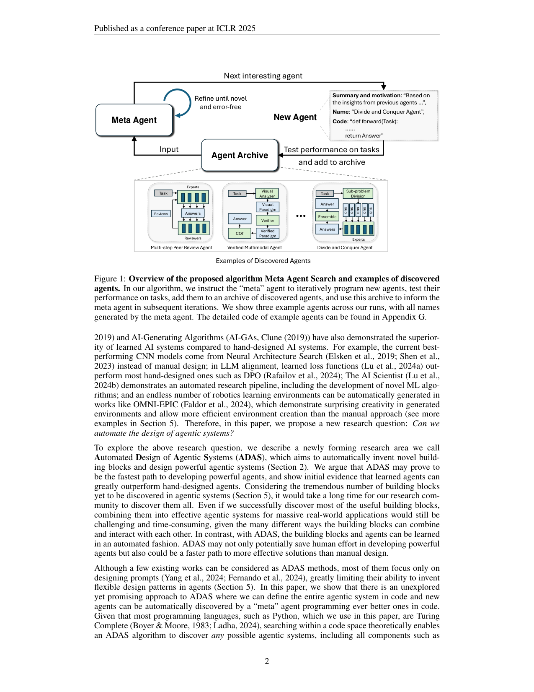
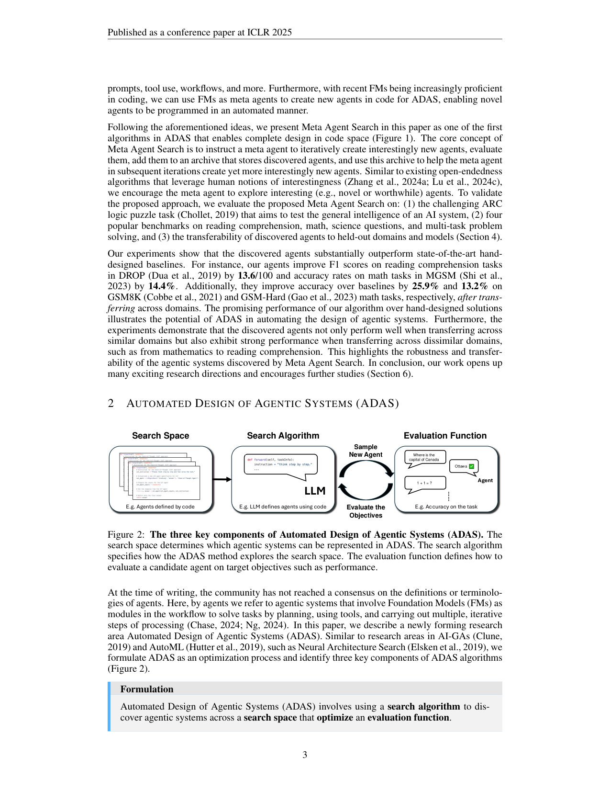

`adas | Automated Design of Agentic Systems (ADAS) | UBC · Vector Institute · CIFAR(Shengran Hu, Cong Lu, Jeff Clune) | ICLR 2025, arXiv 2408.08435v2, 2025-03-02(奠基作) | 主题线 L?(自进化 agent / 自动 agent 设计 / 代码空间搜索)· 相关性 高(自进化谱系奠基)`

> light 档笔记。基于真实 PDF 正文。三标注:【原文】【推断】【待核】。注:此为 2024-08 奠基作(自进化 agent 谱系核心源头之一,被 Gödel Agent / Darwin-Gödel-Machine 等引为对照),按时间窗作背景纳入。

══ 第一层:一眼看懂 [light] ══
- 🟦 **TL;DR**:【原文】现在 agent 的"积木"(CoT、self-reflection、tool use、记忆…)和它们的组合方式都靠人手工设计 + 领域调参,费时费力。机器学习史反复表明"手工制品终将被学习出的方案取代"。本文提出一个新研究领域 **ADAS(Automated Design of Agentic Systems)**:**自动发明新积木并设计强 agent 系统**。并指出一条尚未充分探索但有前途的路:**把整个 agent 定义为代码、让一个"元 agent"在代码空间里自动编程出越来越好的 agent**(因多数编程语言图灵完备,理论上可表达任意 agent:任意 prompt/工具/工作流及其组合)。给出简单有效的算法 **Meta Agent Search**:元 agent(GPT-4)基于一个不断增长的"发现档案(archive)"迭代编写"interestingly new"的 agent → 评测 → 入档 → 再用档案启发下一轮。结果:发现的 agent 大幅超过 SOTA 手工设计(DROP F1 +13.6、MGSM +14.4%;跨域迁移后 GSM8K +25.9%、GSM-Hard +13.2%),且**跨域/跨模型迁移仍保持优势**(甚至数学→阅读理解这类不相似域)。
- **最巧的一步**:【推断,依据 §3 + Fig1】"**把 agent 设计搬进代码空间 + 元 agent 只需写一个 `forward` 函数**(给它 ~100 行框架含 FM 查询 API),并用 archive + interestingness 做开放式探索"。抽掉"代码空间"这一选择(改成只 mutate prompt 或搜图结构),就无法表达任意工作流/积木,也用不上 FM 的编程先验——整个"发明新积木"的雄心就垮了。

══ 第二层:为什么做 ══
- **研究背景**:【原文 §1】FM(GPT/Claude)被当通用 agent;可靠解题常需"复合 agent 系统"(多组件 + 外部工具),而非单次模型查询。社区已提出大量积木:CoT 规划、记忆结构、tool use、self-reflection。
- **解决的具体痛点**:【原文 §1】这些**积木的开发与组合都靠人手工设计 + 领域专属调参**,耗费研究者/工程师大量精力。而机器学习史反复证明:手工制品终将被"学习出的更高效方案"取代(HOG→CNN、AutoML)。痛点:agent 系统设计还停在"手工特征工程"阶段,缺一个把"积木发明 + 组合"自动化的范式。
- **相关工作 & 各自不足**:【原文 §1/§2】(a) 手工积木(CoT/Reflexion/Toolformer):有效但要人设计调参;(b) prompt 优化 / 图结构搜索(DSPy/GPTSwarm 等):只在固定空间里调,**无法发明新积木或任意工作流**;(c) AutoML/NAS:思路相通(自动化设计)但针对网络结构,不针对 agentic system。差距:无人把"整个 agent 当可搜索的代码对象"来自动发明设计。
- **动机链**:【原文 §1/§3】现状=积木手工设计、组合靠人 → 缺陷=覆盖搜索空间小、错过更优设计 → 因多数编程语言图灵完备,**把 agent 定义为代码**理论上可表达任意 agent(prompt/工具/工作流及组合)→ 所以让一个"元 agent"在代码空间里自动编程出越来越好的 agent。为什么不用更简单做法(只搜 prompt 或图):表达力受限、用不上 FM 的编程先验,发明不了真正新的积木。
- **与最近邻的 Δ**:【推断,依据 §2/§3】最近邻是 prompt/图结构搜索类自动 agent 方法。关键 Δ=**搜索空间 = 图灵完备的代码**(而非 prompt 或固定图),搜索算法 = FM 元 agent 基于 archive 迭代编程 + interestingness 开放探索。这差异有用,因为代码空间能表达任意积木/工作流,且复用 FM 的编程能力与开源框架(LangChain 等)。

══ 第三层:怎么做 + 靠不靠谱 ══
- **方法流水线(Meta Agent Search)**:【原文 §3/Fig1-2】ADAS 三要素框架:**Search Space**(本文选=代码定义的 agent)/ **Search Algorithm**(FM 元 agent 迭代生成)/ **Evaluation Function**(验证集性能,也可加 cost/latency/safety)。具体闭环:① 给元 agent ~100 行框架(含查询 FM 的 API),它只需编写一个 \(forward(Task)→Answer\) 函数即可定义一个 agent;② 元 agent 基于一个**不断增长的 Agent Archive**(历史发现的 agent 代码 + 表现)+ interestingness 提示,编写"interestingly new"的下一个 agent;③ **Refine until novel and error-free**(反复精炼直到新颖且可运行);④ 在任务上**测性能**;⑤ 把新 agent + 表现**加入 archive**,启发下一轮 → 迭代 N 轮(ARC 跑 25 轮)→ 输出最优发现的 agent(可固定部署、可迁移)。
- **逐组件必要性**:① **代码空间**——没它无法表达任意工作流/发明新积木(全文根基);② **Agent Archive(stepping stones)**——元 agent 基于历史发现"踩石头"演化(如第 3 轮涌现"多 CoT 生成→精炼→集成"模式),没它就退回无记忆随机搜索;③ **interestingness**——驱动开放式探索、防早熟收敛;④ **refine-until-error-free**——保证产出可运行。注:本文**无传统消融实验**(ablation 计数=0);各组件必要性靠"vs 手工 baseline + 强迁移结果"间接支撑,**单组件 ablate 缺失**(标【推断:缺消融】)。
- **关键机制/直觉**:【原文 §3】把 agent 设计当 **FunSearch 式程序合成**——FM 既是被搜 agent 的执行引擎,又是写 agent 的"元程序员"。archive + interestingness 借开放式进化(open-endedness)思想:不只追当前最优,而是攒"有趣的踏脚石",让后续能在其上组合出更强设计。直觉=用 FM 的编程先验 + 累积档案,把"agent 设计空间搜索"变成可迭代的代码生成。
- **实验与证据**:【原文 §4/Fig3】基准=(1) ARC 逻辑谜题(测通用智能,25 轮、元 agent GPT-4、被搜 agent 与 baseline 跑 GPT-3.5 省算力);(2) 四类基准(阅读理解/数学/科学/多任务)。关键数字:**DROP F1 +13.6/100、MGSM +14.4%**(超 SOTA 手工设计);**跨域迁移后** GSM8K **+25.9%**、GSM-Hard **+13.2%**;并强调**跨域(甚至数学→阅读理解)/ 跨模型迁移仍保持优势**——这是比单任务夺冠更有说服力的"积木真有普适性"证据。baseline 覆盖手工 + 自动设计两类。"看着强但需谨慎"处:评估靠验证集准确率,有过拟合验证集风险(作者也提)。
- **假设与失效边界**:【原文 §4/§6 + Safety】① 假设 FM 编程能力足够强、验证集能可靠评估候选、发现的设计能泛化到未见数据;② **安全**:FM 生成的代码可能因能力/对齐不足而**破坏性执行**,作者用**容器化执行**等措施缓解,并强调"须安全地发展自动设计 ever-more powerful agents";③ 评估函数与真实目标错配(过拟合验证集)、搜索预算不足陷局部最优、FM 写出不可靠 agent 时优势衰减(【推断】)。
- **祛魅总结**:【推断】真贡献(硬货)=① **开创 ADAS 这一研究领域 + 三要素框架**(search space/algorithm/evaluation),给后续所有自动 agent 设计提供概念骨架;② Meta Agent Search 简单有效,且**跨域跨模型迁移**这一结果含金量高(说明发明的是真积木而非过拟合 trick);③ 全开源(ShengranHu/ADAS)。包装/边界:① **无逐组件消融**,interestingness/archive 的独立贡献未被隔离验证;② "理论上可表达任意 agent" 是图灵完备的理论上界,实际受 FM 与搜索预算限;③ 过拟合验证集与安全是真实开放问题。整体是自进化 agent 谱系的**源头奠基作**(直接催生 Gödel Agent / Darwin-Gödel-Machine),价值在范式开创与迁移性证据。

══ 机制速览 6 轴 [light] ══
| 维度 | 内容 |
|---|---|
| 学什么信号 | 【原文】评估函数信号——验证集上的性能(也可优化 cost/latency/safety);元 agent 还吸收 archive 里历史发现 + interestingness(新颖性)启发。无梯度、无 RL 训练(搜索算法 = FM 迭代生成,非 RL)。 |
| 改什么 | 【原文】改 **agent 系统的代码**(整套 agentic system:prompt/工具/工作流任意组合),由元 agent 编程产出;**不改 FM 参数**(FM 当固定模块 + 当元程序员)。 |
| 何时改 | 【原文】离线搜索循环:迭代 N 轮(ARC 实验 25 轮),每轮生成-评测-入档;搜出的 agent 之后固定部署(可迁移)。 |
| 免梯度? | 【原文】是(元 agent 编程 + 验证集评测,零梯度)。 |
| 记忆-技能生命周期 | 【原文】"记忆"=不断增长的 **agent archive**(存历史发现的 agent 代码 + 其表现),供元 agent 检索启发;"技能/积木"=被发明的新 agent 设计(如 Multi-step Peer Review、Divide-and-Conquer)。无显式遗忘/淘汰(档案累积);共享=发现的 agent 可跨域/跨模型迁移复用。 |
| 防遗忘机制 | 【原文】不适用(无参数训练→无灾难性遗忘);archive 累积 + "refine until novel and error-free"保证新 agent 可运行。 |

⑦ **开源代码 + 框架/harness**:【原文】All code open-sourced at https://github.com/ShengranHu/ADAS(p0 明示)。框架=**自研 meta-agent search**(~100 行元 agent 框架 + FM 查询 API,FunSearch 式只写 forward 函数;元 agent 用 GPT-4,被搜 agent 跑在各 FM 上);非训练框架(无梯度)。〔按 B 层只记录链接,未 clone。〕

💰 资源/成本与可扩展性:【原文】成本=纯 FM API 调用 + 验证集评测;ARC 跑 25 轮、元 agent 用 GPT-4(Fig3)。可扩展性:代码空间理论上可表达任意 agent,且能直接复用开源框架(如 LangChain)与现成积木(RAG/搜索工具);可迁移性强(跨域跨模型)。具体算力/美元成本原文未集中给出。

🎯 **对"探索-巩固"idea 对标** [light]:【推断】**自进化谱系的源头奠基作 / 竞品(免梯度·代码层进化路线)**——ADAS 是"把 agent 设计当成可搜索/可进化对象"的范式开创者,直接催生 Gödel Agent(把"可改代码"扩到"可改自改进算法本身")与 Darwin-Gödel-Machine(把代码搜索做成种群式开放进化)。它与本项目"探索-巩固=MTP 探针 + on-policy 蒸馏改参数"是**对立但互补**:ADAS 在**外层 agent 程序**做探索-巩固(archive 累积 = 巩固、interestingness = 探索),完全不碰权重。可借组件:① **archive + interestingness 的开放式探索**骨架可类比本项目"探索"阶段的候选生成;② 但 ADAS 不解决"把习得固化进模型本身/防遗忘/可复现训练"的问题,这正是本项目相对它的差异化缺口。

🖼 **关键图 top-2** [light]:

这是**原文 Figure 1**:把"元 agent 在代码空间里进化出新 agent"的闭环 + 真实发现的 agent 例子一图呈现——选它因为它就是方法主图,最能表现 ADAS 的核心机制与产物。

这是**原文 Figure 2**:给出 ADAS 这一研究领域的通用三要素框架——选它因为它是论文的概念骨架,后续所有自动 agent 设计工作都可套进这三格。

【假设与失效边界一句】[light]:【推断,依据 §2 + §3 + §6】假设"FM 编程能力足够强、验证集能可靠评估候选 agent、且发现的设计能泛化到未见数据";当评估函数与真实目标错配(过拟合验证集)、搜索预算不足陷入局部最优、或 FM 写出的 agent 不可靠时,Meta Agent Search 的优势会衰减;作者也强调需"安全地发展"(自动设计 ever-more powerful agents 的安全性是开放问题)。
