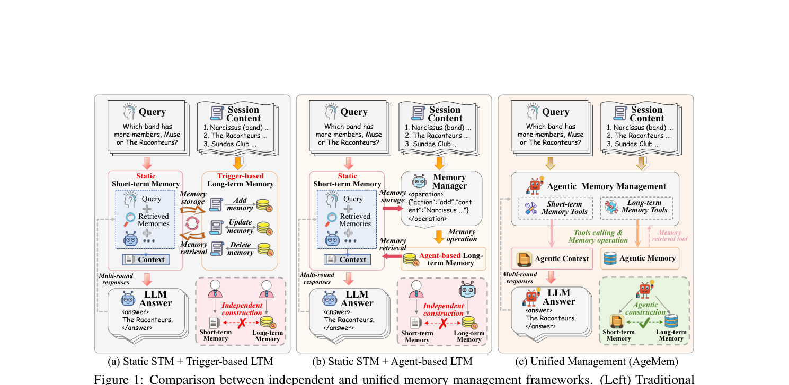
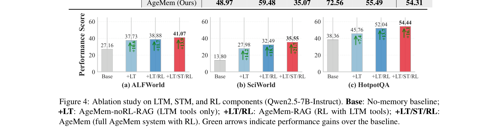

`agemem | Agentic Memory (AgeMem): Learning Unified Long-Term and Short-Term Memory Management for LLM Agents | 武汉大学 · 阿里巴巴（Yaliang Li / Alibaba Agentscope-Trinity 团队 + WHU）| 2026-01 首发·arXiv v2(2026-04-30)·cs.CL | 主题线 L?（RL 学记忆操作 = "把 LTM+STM 统一进 agent 策略、端到端 RL"线）· 相关性 High`

> 三标注约定：【原文】= 论文明说；【推断】= 我的有据判断(附依据)；【待核】= 拿不准的关键事实。

══ 第一层：一眼看懂 [light] ══

- 🟦 **TL;DR**：LLM agent 的记忆分两类——**长期记忆 LTM**(跨会话持久存的知识)和**短期记忆 STM**(当前上下文窗口里的信息)。现有做法把这两者当**相互独立的模块**分开优化、最后拼起来(要么靠触发规则、要么靠一个额外的"记忆管理器" expert LLM),导致记忆构建碎片化、还增加推理成本。AgeMem 把**两类记忆的管理都做成 agent 自己能调的"工具动作"**(LTM 三个:ADD/UPDATE/DELETE;STM 三个:RETRIEVE/SUMMARY/FILTER),直接塞进 agent 的策略里,让模型**自主决定何时/存什么/怎么管**。为了训这种统一行为,设计了**三阶段渐进式 RL**(先学 LTM 存储→再学 STM 抗干扰→最后协同两者解任务)+ **step-wise GRPO**(把终局奖励广播回前面每一步的记忆决策,解决记忆操作带来的稀疏/不连续奖励问题)。在 5 个长程基准(ALFWorld/SciWorld/PDDL/BabyAI/HotpotQA)上,两个 backbone 都超所有 baseline,且**只在 HotpotQA 训练就能 zero-shot 迁移到其余四个**。【原文 Abstract/§1/§4】
- **最巧的一步**：**step-wise GRPO 把单一终局奖励"广播"到整条三阶段轨迹的所有 token/动作**(§3.4 Eq.5→\(A_t=A_T\))。抽掉它,Stage 1 的"存储决策"和 Stage 3 的"作答结果"就脱钩——早期 ADD/UPDATE 拿不到任何学习信号(因为记忆操作本身奖励为 0,只有任务完成才有奖励)。正是"终局奖励监督每一个中间记忆决策"这一步,才让"跨阶段、跨异构动作(存/取/滤/摘)的长程信用分配"成为可能。

══ 第二层：为什么做（写透） ══

- **研究背景**：长程 agentic 任务里,LLM 受限于"任何时刻能注意到的信息"(统称 agent 的 memory)。memory 分 LTM(持久存用户/任务知识)和 STM(当前输入上下文)。高质量 LTM 支持高效检索,有效 STM 管理减少冗余、保留关键上下文——两者**联合管理**对长程推理至关重要。【原文§1】
- **解决的具体痛点**：现有研究**几乎都把 LTM 和 STM 当独立组件**。STM 主要靠 RAG(MainRAG/ReSum)扩上下文,但依赖预定义 schedule/启发式规则,可能**漏掉罕见但关键的细节、又引入噪声**;LTM 沿两条线发展——**触发型**(预定时刻执行固定记忆操作)和 **agent 型**(专门记忆管理器决定存什么),但多数仍靠**手工规则或辅助 expert 模型**,限制自适应性、增加系统复杂度。结果:LTM/STM 松耦合、各自独立优化后 ad hoc 拼接,记忆构建碎片化。【原文§1, Fig 1(a)(b)】
- **三大根本挑战(论文明确列出)**：
  - **(C1) 功能异质协调**:LTM 管"存/更新/丢",STM 管"取/摘/删上下文"——如何设计统一机制让二者协同?
  - **(C2) 训练范式冲突**:LTM 训练常用交互前的 session 级信息,STM 训练常注入 distractor 模拟长程上下文;且标准 RL 假设连续轨迹+稳定奖励,与记忆操作天然产生的**碎片化、不连续经验**冲突,端到端优化难。
  - **(C3) 部署约束**:很多系统靠辅助 expert LLM 做记忆控制,显著增加推理成本与训练复杂度。如何把统一记忆管理**直接集成进 agent、不依赖外部 expert**?
- **相关工作 & 各自不足**：
  - **LTM**:LangMem(模块化)、A-Mem(Zettelkasten 链接知识单元)、Mem0(extract-update pipeline + graph 变体)、Zep(时序知识图谱)——**靠预定义记忆结构/启发式更新规则**,随记忆增长复杂度上升、缺自适应优先级/遗忘策略。
  - **STM**:RAG 为主导,但不能根本防"上下文爆炸",可能引入干扰;ReSum 周期性压缩历史,但**摘要 schedule 仍预定义**,激进压缩会丢关键细节。
  - **RL for LLM agents**:GRPO 及变体在复杂推理上表现强,但现有 RL 系统**普遍把记忆当静态/外部组件**,不适配记忆操作的不连续碎片化轨迹。
- **与最近邻工作的 Δ**：与 **Memory-R1(Yan et al. 2025)** / **Memory-as-Action(Zhang et al. 2025a)** 最像(都把记忆操作建模为动作并用 RL 优化)。**关键差异**:那些方法**一次只优化记忆的一个方面**(把检索/摘要/STM 处理当固定启发式或单独调的模块),导致"早期存储决策"与"后期推理行为"只是**松耦合**、学习信号不显式连接二者。AgeMem 把记忆使用**formulate 成单一可学控制问题**——**一个统一策略覆盖异构记忆动作(LTM 持久操作 + STM 上下文操作),在延迟监督下端到端训练**,使存/取/滤/摘全部对同一个终局任务奖励联合优化。这差异有用是因为:统一+联合 才能让 Stage-1 的存储质量直接被 Stage-3 的成败反推改进(Table 3 显示 RL 后 ADD/UPDATE 升、RETRIEVE 降的协同变化)。【原文§2 "Positioning relative to RL-based memory agents"】

══ 第三层：怎么做 + 靠不靠谱 ══

- **方法流水线（统一工具 + 三阶段 RL + step-wise GRPO,对应 Fig 1c）**：
  1. **统一 RL 形式化(§3.1)**：状态 \(s_t=(C_t, M_t, T)\)——短期上下文 \(C_t\)、长期记忆库 \(M_t\)、任务说明 T(含 query q、上下文信息 \(I_q\)、训练时的期望答案 \(A_q\))。动作来自**混合动作空间**(语言生成 + 记忆操作),由 LLM 参数化策略 \(\pi_\theta\) 决定。累积奖励 \(R(τ)=Σ w_i R_i(τ) + P_penalty\)(Eq.1)。
  2. **六个记忆工具(§3.2, Table 1)**：**LTM** = ADD(存新知识)/UPDATE(改条目)/DELETE(删过时);**STM** = RETRIEVE(从 \(M_t\) 取 top-k 进 \(C_t\))/SUMMARY(压缩历史片段)/FILTER(删与某 criterion 语义相似度超阈值 \(\theta_f\) 的上下文)。把记忆控制从外部启发式 pipeline 变成决策的内在组件。
  3. **三阶段轨迹结构(§3.3)**：每条轨迹 \(\tau=(\tau^1,\tau^2,\tau^3)\)。**Stage 1 LTM 构建**——casual 交互中识别并存关键信息进 LTM;**Stage 2 STM 抗干扰**——**重置 \(C_t\) 但保留 \(M_t\)**,注入 distractor(像样但与目标无关的话),逼 agent 学会 filter/summarize 噪声;**Stage 3 整合推理**——给正式 query,必须从 \(M_t\) 检索 + 管理 \(C_t\) + 作答。**关键**:\(M_t\) 跨三阶段持久(早期知识影响后期),但 \(C_t\) 在 Stage 1→2 间重置(防信息泄漏,逼真检索)。
  4. **step-wise GRPO(§3.4)**：每条轨迹算终局奖励 \(r_T=R(τ)\),组内归一化得 \(A_T=(r_T−μ)/(σ+ε)\)(Eq.5),再**广播到该轨迹所有前序步 \(A_t=A_T\)**(Eq.6)——给 Stage 1/2 所有记忆+推理动作一致的学习信号,实现跨异构阶段的长程信用分配。
- **复合奖励设计(§3.5)**：\(R(τ)=w·R + P_penalty\),\(R=[R_{task}, R_{context}, R_{memory}]\)。
  - **\(R_{task}\)**:LLM-judge 打分 \(S_{judge}\in[0,1]\),主信号、占主导。
  - **R_context**(评 STM):压缩效率 + 预防性动作(早 summarize/filter 防溢出) + 信息保留(罚丢关键 query 相关内容)。
  - **R_memory**(评 LTM):存储质量(高质量可复用条目占比) + 维护(有意义的 update/delete 防陈旧) + 语义相关性(LLM 打分检索记忆 vs query)。
  - **P_penalty**:罚超对话轮数/上下文溢出。
- **逐组件必要性（消融充分）**：
  - **LTM/STM/RL 渐进消融(Fig 4,Qwen2.5-7B)**:Base → **+LT**(只 LTM 工具,无 RL):+10.6%/+14.2%/+7.4%(ALF/Sci/Hotpot) → **+LT/RL**:再升(HotpotQA +6.3%) → **+LT/ST/RL**(full):最佳,总提升 +13.9%/+21.7%/+16.1%。**加 STM 工具在 SciWorld(+3.1%)/HotpotQA(+2.4%)增益最大**,证明学习型上下文管理 > 静态 RAG。
  - **奖励函数消融(Fig 5/Table 4)**:All-Returns(完整复合奖励) vs Answer-Only(只 R_task)——前者收敛更快、J 更高(0.544 vs 0.509)、**MQ 显著更高(0.533 vs 0.479)**;虽然用更多 token(2117 vs 2078),但额外的上下文+记忆操作对推理质量有实质贡献 → 证明 R_context/R_memory 不是摆设。
  - **FILTER 阈值 \(\theta_f\)(Table 5)**:在 \([0.4,0.8]\) 稳定,不敏感;太低过度过滤丢有用上下文,太高放进边缘上下文降 MQ。
  - **工具使用统计(Table 3)**:RL 后 ADD(0.92→1.64)/UPDATE(~0→0.13) 升、**RETRIEVE 降(2.31→1.95)**——不是欠训练,而是"先把 Stage-1 存好,检索就更 selective/query-driven",检索降反而伴随任务性能和 MQ 提升。**很有说服力的协同证据**。
- **关键机制直觉**：核心是"**把记忆当 agent 自己的动作、用一个延迟的任务奖励同时教会它存取滤摘**"。直觉:与其给 LTM 和 STM 各写一套规则、再各训一个模块,不如让同一个策略在"最后答对没"的压力下,自己学到"Stage 1 该多存点好货,Stage 3 检索就能少而精"。step-wise 广播则解决"记忆操作当下没奖励、没法学"的死结。
- **实验与证据**：
  - **数据集**:ALFWorld(具身)、SciWorld(具身)、PDDL(游戏推理,用 Progress Rate)、BabyAI(具身)、HotpotQA(知识密集 QA,用 LLM-judge)。**只在 HotpotQA 训练 RL**(因其自带 question+supporting facts,天然提供 Stage 1 上下文),然后直接评所有 5 个。【原文§4.1】
  - **backbone**:Qwen2.5-7B-Instruct、Qwen3-4B-Instruct。
  - **支撑核心主张的关键实验 = Table 2 + Fig 4**:Table 2 AgeMem 两 backbone 均最高(平均 41.96% / 54.31%),超最强 baseline(Mem0/A-Mem)4.82 / 8.57 个点;**RL 贡献 8.53 / 8.72 个点**(vs AgeMem-noRL)。Fig 2 MQ 最高(0.533/0.605)。Fig 3 STM 工具比 RAG **省 token**(Qwen3 上 2191 vs 2310,−5.1%)。
  - **baseline 公平吗**:【原文】对比 LangMem/A-Mem/Mem0/Mem0g + No-Memory + AgeMem-noRL,同 backbone;STM 消融里专门对比 STM 工具 vs RAG → 较公平,且 noRL 变体很好地隔离了 RL 的贡献。
  - **"看着强但没回答核心问题"的隐患**【推断】:① **只用 HotpotQA 一个源构造三阶段轨迹**就声称跨域泛化,迁移到 ALFWorld/SciWorld 这些具身任务的提升,可能部分来自"通用工具调用能力"而非"记忆策略"本身;依据:§4.1 + Limitations 都承认只用 HotpotQA 训。② R_memory/R_context 用 **LLM-judge** 打分,既当奖励又当评测指标(MQ 也是 LLM-judge),有"自我循环"风险;依据:§3.5 + §4.1 评测都用 LLM-based evaluator。
- **假设与失效边界**：
  - 【原文 Limitations】① **固定的记忆工具集**(6 个)——清晰有效但可扩到更细粒度控制;② 评测是**相对受控**的 benchmark,非开放真实部署;持久长程对话/真人交互场景是 next step;③ **训练只依赖 HotpotQA** 作三阶段轨迹源,扩到更丰富交互结构的数据源能进一步拓宽适用性。
  - 【原文】三阶段课程"只需信息暴露与任务执行的时间分离"(不绑 QA 式监督),Stage 2 的 distractor 由 DISTRACTORGEN 合成、无需标注。
  - 【推断】依赖足够强的 base 模型(Qwen2.5-7B/Qwen3-4B)+ 一个可靠的 LLM-judge;弱模型 + 弱 judge 下奖励信号质量未验证。依据:全实验用 Qwen 系 + LLM-judge。
  - 【推断】step-wise GRPO 把同一 advantage 均布到所有步,是**粗粒度信用分配**(与 atommem 同病)——无法区分"哪一步记忆操作真正关键";依据:Eq.6 广播式赋值。
- **祛魅总结**：
  - **真贡献(硬货)**：① **首个把 LTM + STM 统一进单一可学策略、端到端联合 RL** 的框架(对 C1/C2/C3 三挑战的回应是自洽的);② **三阶段课程(LTM→STM→整合)+ step-wise GRPO 广播奖励** 是解决"记忆操作稀疏/不连续奖励"的务实方案;③ Table 3 的工具使用协同变化(ADD/UPDATE↑、RETRIEVE↓且性能↑)是有信息量的实证;④ **不依赖外部 expert LLM**(C3)——记忆控制内化进 agent 本身,降部署成本。
  - **包装/营销成分**【推断】:"unified/end-to-end/autonomous"反复强调,但**工具集写死、信用分配粗(均布)、训练源单一(HotpotQA)**;"跨域泛化"的强度受限于"只在一个 QA 数据集训"。"统一"主要体现在**共享一个策略和一个奖励**,而非真正学出 LTM/STM 之间的动态调度算法。依据:Limitations 自承 + Eq.6。
  - 作者**较诚实**地在 Limitations 标注了工具固定、受控评测、单一训练源三点(可信度加分)【推断】。

══ 结构化抽取 ══

- 🎯 **机制速览 6 轴** [light]：

| 学什么信号 | 改什么 | 何时改 | 免梯度? | 记忆-技能生命周期 | 防遗忘机制 |
|---|---|---|---|---|---|
| **环境 reward(复合:\(R_{task}\)[LLM-judge] + \(R_{context}\)[STM 质量] + \(R_{memory}\)[LTM 质量] + 罚项)** | **模型参数**(step-wise GRPO 微调 agent 策略,LTM+STM 操作均为工具调用动作) | **离线批量 RL 训练**(三阶段课程,step-wise GRPO);推理时 6 个记忆工具 **per-step 在线**调用但参数冻结 | **否**(梯度 RL:step-wise GRPO,终局 advantage 广播到全轨迹) | 写入=ADD→更新=UPDATE→检索=RETRIEVE(top-k)→压缩=SUMMARY→过滤=FILTER(STM)→淘汰=DELETE;**LTM 跨三阶段持久,STM 在阶段间重置** | **学习层面**=GRPO 的 **KL 正则**(对 \(\pi_{ref}\))防漂移;**记忆层面**=\(R_{memory}\) 的"maintenance"项奖励有意义的 UPDATE/DELETE 防陈旧 + \(R_{context}\)"信息保留"项罚丢关键内容;**无几何共识/merging/参数隔离** |

- ⑦ **开源代码 + 框架/harness**：**框架=Agentscope 1.0(构建 agent,Gao et al. 2025a,Alibaba)+ Trinity-RFT(RL 微调,Pan et al. 2025a,arXiv:2505.17826,Alibaba)**——【原文§4.1 Implementation 明写】"We build agents using the **Agentscope** framework and fine-tune AgeMem using the **Trinity** framework"。**AgeMem 自身代码仓库:本 PDF 正文/附录未给出官方链接**(附录里出现的 github 链接均为 baseline 实现:langchain-ai/langmem、WujiangXu/A-Mem、mem0ai/mem0)〔待核:严格按"PDF 没写就不编"原则,AgeMem 官方代码 URL 待 P3 用 WebSearch 快照核验后补;但所用 RL 框架 Trinity-RFT 与 Agentscope 均为阿里开源、可据此定位〕。
- 💰 **资源/成本与可扩展性**：【原文未给精确 GPU 数/训练时长】上下文长度上限 2048 token(超限罚分);**只在 HotpotQA 训练**(数据省);step-wise GRPO,B 个任务 × K 个 rollout × 平均轨迹长 T̄ 的经验集。**推理效率**:Fig 3 显示 STM 工具比 RAG 省 token(−3.1%~−5.1%);Table 3 总工具调用 4.33→4.92(noRL→GRPO,Qwen2.5)。**部署优势**:不依赖外部 expert LLM(C3),降推理成本。
- 🎯 **对"探索-巩固"idea 对标** [light]：**支撑 + 可借组件(信息量最高的对标项之一)**。支撑:① **三阶段课程"先暴露信息→注入干扰→延迟考核"** 与本项目"探索(尝试路径)→巩固(保留有用)"的时序结构高度同构,且它证明"延迟奖励能反推早期巩固决策";② **step-wise GRPO 把终局奖励广播到前序记忆决策**——正是本项目若想做"path-recovery 单点接管 + 全局成败信用分配"可直接借的机制。可借组件:① **LTM/STM 双层 + 6 工具(存/取/滤/摘/改/删)** 的动作设计,可映射到"前瞻探测(MTP)产物存哪层、何时复用/丢弃";② **R_context 的"预防性动作奖励 + 信息保留惩罚"** 这种"既要压缩又要不丢关键"的奖励工程,对"巩固时如何避免灾难遗忘"有借鉴;③ **C_t 阶段间重置防泄漏**的训练设计,逼真检索。竞品/缺口:它**信用分配仍是均布(粗)**、**工具集写死**、**不做 test-time 自进化/不结合前瞻探测**——本项目可在"per-step 前瞻信用分配 + MTP 引导的探索"上形成差异。
- 🔭 **开放问题/未来方向**：【原文 Limitations】① 扩到**更细粒度的记忆控制**(当前工具集固定);② 在**持久长程对话/真人交互**等开放真实场景评测;③ 把三阶段课程扩到 **HotpotQA 以外、交互结构更丰富的数据源**。【推断】④ 更精细的 step-wise 信用分配(区分关键记忆步);⑤ 缓解 LLM-judge 既当奖励又当评测的自循环(引入独立/可验证奖励);⑥ 与跨任务终身记忆结合(当前 LTM 仅在单任务三阶段内持久)。

- 🖼 **关键图 top-2** [light]：

· 这是**原文 Figure 1**(动机 + 架构对比主图)。表现核心 motivation 与方案:**(a) Static STM + Trigger-based LTM**(传统,LTM 靠固定触发的 Add/Update/Delete)、**(b) Static STM + Agent-based LTM**(加一个独立 Memory Manager 控 LTM,但 STM 仍静态)、**(c) Unified Management = AgeMem**(LTM 工具 + STM 工具 + 检索工具全部 agentic、由单一策略联合调度)。选它因为它一张图同时讲清"现有方法把 LTM/STM 割裂"的痛点和"AgeMem 把两者统一进 agent 策略"的解法对比——是全文 idea 的浓缩。

· 这是**原文 Figure 4**(核心证据图)。三面板(ALFWorld/SciWorld/HotpotQA)展示逐步加组件的性能阶梯:**Base(无记忆)→ +LT(只 LTM 工具,无 RL)→ +LT/RL(RL+LTM)→ +LT/ST/RL(完整 AgeMem)**,绿箭头标增益(如 ALFWorld 27.16→41.07,+13.9%)。选它因为它直接、量化地证明本文三个核心组件(LTM 工具、RL 训练、STM 工具)各自都有正贡献、且**完整统一系统最优**——是"统一管理 + 端到端 RL 必要性"主张最硬的支撑。
