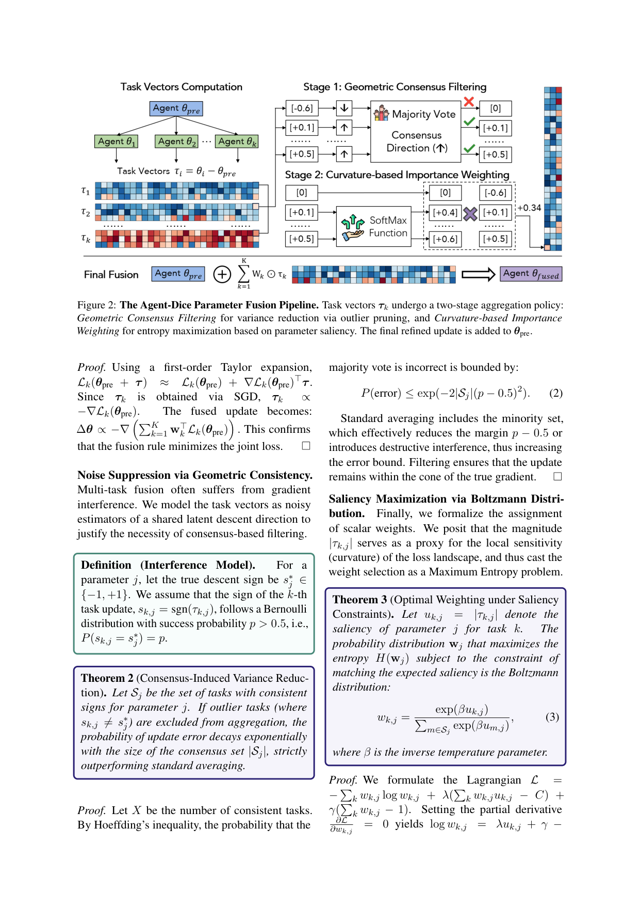
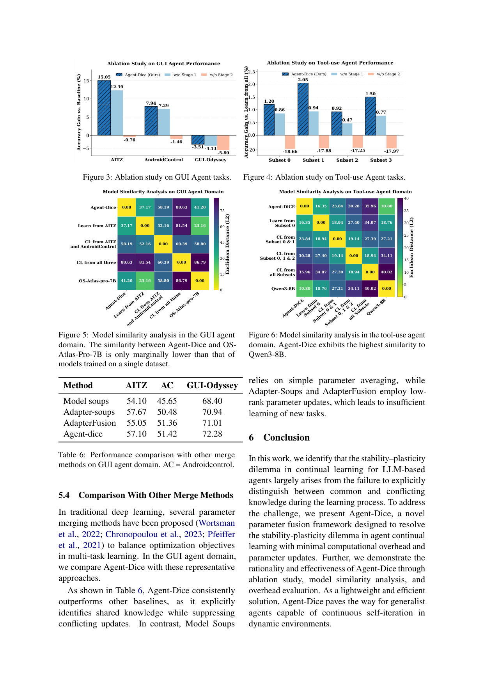

`agent_dice | Agent-Dice: Disentangling Knowledge Updates via Geometric Consensus for Agent Continual Learning | 上海交大 (Zheng Wu, Xinbei Ma, Weinan Zhang, 通讯 Zhuosheng Zhang) + OPPO 研究院 (Xingyu Lou, 通讯 Jun Wang);Wu 在 OPPO 实习期间完成 | 2026 arXiv:2601.03641v4(标注 11 Apr 2026)· 预印本 | L?·"参数融合/merging 防遗忘"主线·种子论文(几何共识巩固)·高相关`

> 三标注:【原文】=论文直述;【推断】=有据判断(附依据);【待核】=拿不准的关键事实。
> 注:本文为本调研**种子论文**(几何共识巩固 = "对标栏"基准);以下全部基于已下载真实 PDF 正文(18 页,含附录 A 完整证明 / 附录 B-D 实验细节与 case)。arXiv id=2601.03641(标注 2026-04),属时间窗内。

══ 第一层:一眼看懂 ══

- 🟦 **TL;DR**:LLM agent 连续学多个新任务(先学 GUI 任务 A,再学 B、C……)时会"学了新的忘旧的"(灾难性遗忘),这就是 stability(稳)-plasticity(可塑)两难。Agent-Dice 的核心主张:**这个两难本质上是因为没把"任务间共享的公共知识"和"任务特有、互相打架的冲突知识"分开**。它的做法是一个**纯后处理的参数融合(模型 merging)框架**:先把每个任务各自单独 SFT 得到一个"任务向量"τ_k = θ_k − θ_pre(微调后参数减去原始参数);然后**逐参数维度(element-wise)**做两步——① **几何共识过滤**:看 K 个任务在这一维上的更新符号,符号占多数的留下、少数派(冲突)直接清零(剪掉冲突梯度);② **曲率/显著度加权**:在留下的"同号阵营"里,用每个任务该维更新的绝对值 |τ_k,i| 过一个 masked Softmax 当权重(更新幅度大=该处曲率高/置信高,给更大权重)。两步加权求和后加回 θ_pre 得到融合模型。结果:在 GUI agent(AITZ/AndroidControl/GUI-Odyssey)和 tool-use agent(ToolACE 切 4 子集)上 AvgZ 最高,且**融合只花约 1 分钟 GPU / 10 分钟 CPU**,几乎零额外训练开销。【原文 摘要+§1+§3+§4】

- **最巧的一步**:**Stage 1 的"逐参数符号共识投票"**——抽掉它(消融 w/o Stage 1,Fig 3/4),agent 就学不到精确的跨任务公共知识、性能塌。它把"merging"从"无脑平均/低秩近似"升级为"先按符号选阵营再加权",直接对应它对遗忘根因的诊断(冲突=同一维不同任务符号相反,Eq.1)。注意:这一步**几乎就是 TIES-Merging 的 sign-elect 步骤**(符号占多数的方向留下),Agent-Dice 把它套到"agent 持续学习"场景并配上曲率加权 + 一套一阶泰勒/Hoeffding/最大熵的理论包装。【原文 §3.3 Stage1, §5.1, Eq.1/5】

══ 第二层:为什么做 ══

- **研究背景**:LLM agent(GUI agent 操作手机/电脑界面、tool-use agent 调 API)要在动态真实环境里**持续自我迭代**、不重头训就能适应新任务,这要求 continual learning 能力。但顺序微调天然有灾难性遗忘 → stability-plasticity 两难。【原文 §1, §2.1】

- **解决的具体痛点**:现有两条路都没"把公共知识和冲突知识分开"——
  - ① **外部记忆模块**(ReasoningBank、A-MEM 等):把新知识塞进记忆库,不动参数;但不区分共性/冲突。
  - ② **持续迭代训练**(agentic RL / 顺序 SFT):在线更参数适应新任务;但顺序更新会让新旧技能互相干扰。
  - 共同缺陷:**都没有一个显式机制去识别"哪些更新是多任务共享的公共方向(该保/该强化)、哪些是任务特有的冲突噪声(该剪)"**,于是要么信息丢失(过稳)、要么干扰(过塑)。【原文 §1, §2.3】

- **相关工作 & 各自不足**:
  - *传统 CL 三大族*:正则化(EWC/SI——约束参数/特征不漂)、回放(iCaRL/rehearsal——存旧数据重放)、架构扩展(Progress&Compress/DER——加任务专属模块)。**不足**:多为传统 LLM 任务设计,未针对"复杂动态环境里的 agent"。
  - *rehearsal-free PEFT 持续学习*(L2P/DualPrompt/HiDe——prompt 类):省参数,但 Agent-Dice 在 Table 6 论证低秩/prompt 更新"对新任务学习不充分"。
  - *agent CL 两视角*:agentic RL(在线更参数)、agentic memory(往记忆库加知识)——**都不做共性/冲突的范式级区分**。
  - *参数 merging 族(最近邻,Table 6 对比)*:**Model Soups**(纯参数平均)、**Adapter-Soups / AdapterFusion**(低秩/adapter 组合)。这是 Agent-Dice 真正的最近邻技术路线。
  - **与最近邻的 Δ**:对 Model Soups,差在"**不无脑平均、先做符号共识过滤再曲率加权**";对 Adapter-Soups/AdapterFusion,差在"**全参数 task-vector 融合而非低秩,故新任务学得更足**"。为什么有用——显式剪掉冲突方向(Eq.1 的反号维)避免破坏性干扰,这正是 Table 6 它领先的原因。【原文 §2.2, §5.4, Table 6】
  - *〔待核/局限〕*:正文**未与 TIES-Merging / DARE / Model Stock 等"带符号选举的 merging"直接对比**,而 Stage 1 与 TIES 的 sign-elect 高度相似——最近邻 merging 基线选得偏弱(只比纯平均/adapter 类)。【推断:依据=§5.4 baseline 仅 Model Soups/Adapter 系,未含 TIES/DARE】

- **动机链**:agent 要持续学 → 顺序微调遭灾难性遗忘(stability-plasticity)→ 诊断根因=同一参数维不同任务更新**符号相反**(Eq.1 冲突)→ 标准聚合(平均)把反号也算进去 → 破坏性干扰 → 所以要"先按符号选共识阵营(剪冲突,保稳),再在阵营内按显著度加权(强化公共方向,保塑)"→ 用一阶泰勒证"加权 task-vector 融合≈在代理多任务损失上走一步梯度"、用 Hoeffding 证"过滤后误差随共识集大小指数下降"、用最大熵证"幅度→Softmax 是最少偏置的权重"。为什么不用更简单的:纯平均(Model Soups)不剪冲突;低秩(Adapter)学不足;在线顺序训练成本高且遗忘。【原文 §3.1-3.3, 附录 A】

══ 第三层:怎么做 + 靠不靠谱 ══

- **方法流水线(纯后处理融合,对应 Figure 2,4 步)**:
  1. **各任务独立微调 → 任务向量**:对 K 个领域(如 GUI 的 AITZ/AC/GUI-Odyssey,或 tool-use 的 4 个子集)各自从同一 θ_pre 出发 SFT 得 θ_k,算 τ_k = θ_k − θ_pre。【原文 §3.1】
  2. **Stage 1 — 几何共识过滤(逐参数二值 mask,保稳)**:对第 i 维,令符号指示 s_k,i=1(τ_k,i≥0),正票数 V_i=Σ_k s_k,i;阈值 δ=K/2。若 V_i>δ → 活跃集 S_i={符号为正的任务};若 V_i<K−δ → S_i={符号为负的任务};否则(打平)→ 全员保留。不在 S_i 的任务该维权重强制为 0(剪掉冲突)。【原文 §3.3 Eq.5】
  3. **Stage 2 — 曲率/显著度加权(masked Softmax,保塑)**:对 S_i 内任务,w_k,i = exp(|τ_k,i|) / Σ_{j∈S_i} exp(|τ_j,i|);不在 S_i 的为 0。直觉:|τ_k,i| 大 = 该参数对任务 k 高置信/经历陡梯度(高曲率),给更大权重。【原文 §3.3 Eq.6】注:论文公式用 exp(|τ|) 未显式写温度 β,理论部分(Eq.3)才引入 β;实现里等价 β=1 的 Softmax。【推断:依据=Eq.6 vs Eq.3 形式差异】
  4. **Final Fusion**:θ_fused = θ_pre + Σ_k W_k ⊙ τ_k(Eq.4);逐维变成 Σ_{k∈S_i} w_k,i τ_k,i,冲突任务贡献被清零 → 沿多数派方向更新、步长由最强局部响应的任务自适应决定。【原文 §3.3 Eq.4】
  - **三条理论支撑(附录 A 完整证明)**:T1 一阶泰勒——在 linear mode connectivity basin 假设下,加权 task-vector 融合≈在代理损失 Σ w_k L_k 上走一步 GD;T2 Hoeffding——剪掉反号离群任务后,聚合方向出错概率 ≤ exp(−2|S_j|(p−0.5)²),随共识集大小指数衰减、严格优于含少数派的平均;T3 最大熵——在"匹配期望显著度+归一"约束下熵最大的权重分布就是 Boltzmann/Softmax(故 Softmax 最少偏置)。【原文 §3.2, 附录 A.1-A.3】

- **逐组件必要性(消融 Fig 3/4,Stage1/Stage2 分别去掉)**:
  - **w/o Stage 1**(去符号投票、改均匀权重):GUI 上仍有正增益但明显低于全 Agent-Dice(如 AITZ 全法 15.05 vs 7.94;tool-use 各子集亦降)→ 证明**共识过滤是学到精确公共知识的关键**。
  - **w/o Stage 2**(去曲率加权):性能**急剧下滑**,GUI 出现负增益(如 −3.51/−4.13/−5.80%)、tool-use 相对"learn from all"−17~−18% → 缺幅度约束后更新过大不稳。✔两阶段都有消融、都不可或缺。
  - *阈值 δ=K/2 的敏感性、温度 β 的影响*:**原文未给消融**(δ 直接设 K/2,β 未在主实验扫)。属"超参未消融"项。【推断:依据=§3.3 直接给定 δ、§5 无 β/δ 扫描】

- **关键机制直觉**:本质是"**带符号选举的多任务参数 merging**"。Stage1 解决"方向该信谁"(同号多数=公共下降方向,反号=任务特有冲突,剪掉);Stage2 解决"信多少"(幅度大=该处 loss 曲率陡/该任务对此参数最有把握,给更大步长)。两步合起来:沿多数派方向走、步长由最自信的任务定 → 既不破坏旧能力(剪冲突)、又能学足新任务(幅度加权)。这是**离线一次性算 mask+权重**,不需任何再训练或梯度回传,所以极便宜。【原文 §3.3, §5.3】

- **实验与证据**:
  - 数据集 & 设置:**GUI agent**——AITZ、AndroidControl、GUI-Odyssey;骨干 **OS-Atlas-Pro-7B**(GUI 专用)与 **Qwen3-VL-8B**(通用)。**tool-use agent**——**ToolACE** 按"最小工具重叠"贪心切 4 子集(附录 C/Algorithm 1,对角内重叠 25.8~31.8%、跨子集泄漏<3.2%);骨干 **Qwen3-8B**(原生会调工具)与 **Llama-3.1-8B**(零样本不会调工具)。训练用 **LLaMA-Factory**,lr=1e-5,3 epoch(Qwen3-VL-8B 为 2),共 1200 GPU·小时(80GB)。【原文 §4.1, 附录 B/C】
  - 指标:核心 **AvgZ**(各任务 Z-score 均值,Z=(M_i−μ_i)/σ_i,μ/σ 来自 baseline 模型)；GUI 另报 Type(动作类型准)/SR(步级成功)/TSR(轨迹成功,每步都对才算 1);tool-use 报 Func(函数名对)/Full(函数名+参数都对)。
  - **关键发现①(主表 Table 1-4)**:四组实验 Agent-Dice **AvgZ 全部第一**——GUI/OS-Atlas:0.73(优于 "CL from all three" 0.14、各单任务);GUI/Qwen3-VL:0.29;tool-use/Qwen3-8B:0.79;tool-use/Llama-3.1:0.51。且 zero-shot 的 AvgZ 普遍为负(训练确实有用)、"learn from all" 常非次优(顺序学新会伤旧)。
  - **关键发现②(merging 对比 Table 6,GUI)**:Agent-Dice(AITZ 57.10/AC 51.42/Odyssey 72.28)≥ Model Soups(54.10/45.65/68.40)、Adapter-Soups(57.67/50.48/70.94)、AdapterFusion(55.05/51.36/71.01)→ 在多数列领先(AITZ 列 Adapter-Soups 57.67 略高于它 57.10,**非全胜**)。
  - **关键发现③(开销 Table 5)**:GPU 仅 61.84~88.52s、CPU≤~1050s,相对几十小时训练可忽略 → "轻量"主张成立。
  - **关键发现④(模型相似度 Fig 5/6,L2/KL 热图)**:Agent-Dice 与原始骨干的参数距离只比"单数据集训练"略大,显著小于"CL from all"→ 用最小参数偏移拿到最好性能,佐证"只动公共方向"。
  - **baseline 公平性**:同骨干、同数据、统一训练协议;ToolACE 切分有泄漏统计支撑(Table 8)。但 **merging 对比缺 TIES/DARE 这类同机制更强基线**(见上)。【推断】
  - **看着强但需警惕**:① **核心机制≈TIES-Merging 却未与之直接比**,理论包装(泰勒/Hoeffding/最大熵)是对既有 merging 技巧的事后解释而非全新算法;② AvgZ 是相对 baseline 标准化指标,绝对 SR/Full 提升幅度需看原表(如 tool-use Full 多在 84~92%,提升相对温和);③ GUI/Qwen3-VL 上某些单任务(AndroidControl SR 41.50)反低于"learn from AndroidControl"(61.92),即融合在"专精单任务"上有损失——AvgZ 第一靠整体均衡而非每格最优。【原文 Table 1-6】

- **假设与失效边界**:
  - 【原文·Limitations】评估只覆盖"有限的代表性 agent 场景"(GUI + tool-use 两域),泛化性待更多域验证(作者自陈这是实证范围局限、非方法设计局限)。
  - 【推断·关键】**强依赖 linear mode connectivity 假设**(各任务微调落在同一线性连通 basin,τ 可线性叠加)——若 K 个任务从同一 θ_pre 出发但学到的解不在同一 basin(差异极大/学习率大/训练步多),一阶泰勒近似失效、merging 会崩。依据=§3.2 Theorem 1 前提。
  - 【推断】**所有任务必须共享同一 θ_pre 且同架构**才能算 task-vector 并逐维对齐——异构骨干/不同初始化不适用。依据=§3.1 τ_k=θ_k−θ_pre 定义。
  - 【推断】Hoeffding 界假设各任务符号 i.i.d. 且 p>0.5(多数派即真方向);若某维"少数派才对"(真公共方向是少数任务的方向),符号投票会**剪掉正确更新**。依据=§3.2 Definition/Theorem 2 的 p>0.5 假设。
  - 【推断】是**离线 batch 融合**(拿到全部 K 个任务模型后一次算),**非在线持续到来**;真正流式 CL(任务一个个来、来时不知未来任务)下需重新设计(每来一个就重融?未讨论)。依据=§4.1 评估协议是"先各自训好再融"。

- **祛魅总结**:
  - **真贡献(硬货)**:(a)**把 agent 持续学习的遗忘根因清晰归结为"逐维符号冲突"(Eq.1)并给出可操作的"符号共识过滤+曲率加权"两步**,诊断-方法对应干净;(b)**极低成本**(纯后处理、1 分钟级、无再训练)却能在 4 组 agent CL 设置上 AvgZ 全胜,工程实用性强;(c)两阶段消融干净、模型相似度分析佐证"最小参数偏移";(d)给 merging 配了一套自洽的理论解释(泰勒/Hoeffding/最大熵)。
  - **包装/可能高估**:① **方法新颖性被理论包装放大**——Stage 1 符号选举 ≈ TIES-Merging、Stage 2 幅度 Softmax 是常见显著度加权,核心积木非首创,创新更多在"迁移到 agent CL + 理论化 + 曲率加权的组合";② 标题/动机强调"continual learning",但实际是**离线多模型 merging**,不是严格意义的"任务流式持续学习"。【推断:依据=§3.3 与 TIES 的相似性 + §4.1 离线融合协议】
  - **可能低估/空白**:δ 阈值、温度 β 无敏感性分析;未与同机制 merging(TIES/DARE)对比;"少数派才对"的失效情形未讨论;在线/流式扩展未涉及。【推断】

══ 结构化抽取 ══

- 🎯 **机制速览 6 轴**:

| 学什么信号 | 改什么 | 何时改 | 免梯度? | 记忆-技能生命周期 | 防遗忘机制 |
|---|---|---|---|---|---|
| **无新训练信号**——直接用各任务**已微调好的参数差(task vector τ_k=θ_k−θ_pre)**做几何统计(符号投票 + 幅度);信号来源="各任务 SFT 留下的参数位移本身" | **backbone 参数 θ(全参数,逐维 element-wise)**——通过加权 task-vector 求和重写权重;**不改 prompt/记忆/logits、不加模块** | **离线批量**(拿到全部 K 个任务模型后**一次性后处理融合**,约 1 分钟 GPU);**非在线 per-step/per-episode** | **是(融合阶段完全免梯度)**——只做符号投票 + masked Softmax + Hadamard 加权和,无反向传播;各任务先各自 SFT(那步有梯度,但融合本身零梯度) | 无外部记忆/技能库概念;"知识"以 task vector 形式存在 → 融合时按维筛选(留共识/剪冲突)→ 写回 θ_fused;无检索/无遗忘淘汰/无跨 agent 共享 | **merging + 符号共识(本调研"几何共识巩固"的范式样本)**:① **几何共识过滤**(逐维符号多数票,剪反号冲突梯度 → 防破坏性干扰=防遗忘核心);② **曲率/显著度加权**(限制更新幅度防过大不稳)。**无 KL 投影 / 无回放 / 无参数隔离**,纯参数空间几何筛选 |

- ⑦ **开源代码 + 框架/harness**:**已开源** https://github.com/Wuzheng02/Agent-Dice(摘要+§1 明确给出链接)〔本次未 `git ls-remote`/clone 核验仓库真实可达性与文件,**完整度待核**〕。训练框架:**LLaMA-Factory**(各任务 SFT,lr=1e-5)。**融合本身为自研轻量后处理脚本**(符号投票+masked Softmax+Hadamard 加权),**不使用 veRL/TRL/OpenRLHF 等 RLHF 框架**(本方法无 RL)。【原文 摘要, §4.1】

- 💰 **资源/成本与可扩展性**:**训练**——1200×80GB GPU·小时(用于各任务 SFT,这部分是大头)。**融合**——极廉:GPU 61.84~88.52s、CPU 463~1050s(Table 5),相对训练可忽略。可扩展性:融合成本随 K 线性、随参数量线性,工程上很友好;但需为每个任务**单独存一份微调模型**(算 τ 需要),存储随 K 线性增长;流式持续学习场景的重融成本未分析。【原文 §4.1, §5.3, Table 5】

- 🎯 **对"探索-巩固"idea 对标**:**强可借组件 + 部分支撑;是本调研"几何共识巩固"路线的代表样本**。
  - *可借组件 1(高价值,直接对标项目种子思想)*:**几何共识过滤 = "逐维符号投票剪冲突梯度"**——与项目 reusable_techniques 的"forward-hard/backward-soft 解耦"在动机上同源(都要"让更新有界、保住已学结构、剔除有害方向")。**可迁移到 TSRD 巩固阶段**:把"多条 recovery/path-selection 经验"当 task vector,用符号共识只巩固"多数轨迹一致认可的方向",剪掉单条轨迹特有的噪声方向 → 一种**免梯度的 OPD 巩固后处理**。
  - *可借组件 2*:**曲率/显著度幅度加权(masked Softmax over |τ|)**——给"更新幅度大=高置信/高曲率"的维度更大权重,可借鉴到"按 MTP foresight 置信度/熵给不同 token 位置或不同技能不同巩固强度"。
  - *支撑面*:它**正面佐证"区分公共知识 vs 冲突知识"是缓解灾难性遗忘的有效抓手**,且**用参数空间几何(符号一致性)就能近似实现这一区分**——这对"探索-巩固"中"巩固阶段如何不破坏已学能力"是直接证据(merging 路线可行、便宜、有理论)。
  - *竞品/区别*:它是**纯参数 merging、离线一次性**,**不碰 on-policy 蒸馏、不做 MTP foresight、无在线持续**——与 mtp_opd"在线 OPD + MTP 前瞻探针"主线**正交**:Agent-Dice 解决"多个已训好模型怎么合",不解决"如何在线生成/选择探索轨迹并蒸馏进参数"。可作为 TSRD 的"巩固后处理插件",但替代不了核心的在线探索-蒸馏环。
  - *缺口*:符号投票假设"多数派=正确方向",对"罕见但关键的 recovery 路径"(少数派才对)会误剪——这正是 TSRD 关心的"path-recovery 单点接管"场景,需警惕几何共识把稀有但关键的恢复方向当噪声剪掉。【推断:依据=Theorem 2 的 p>0.5 假设 + 项目 survey-grpo-step 笔记的 sparse_critical 关切】

- 🔭 **开放问题/未来方向**:
  - 【原文·Limitations】扩展到更多 agent 域与任务设置,检验通用性。
  - 【推断】① 与 TIES/DARE/Model Stock 等同机制 merging 的系统对比;② δ 阈值/温度 β 的自适应化(而非固定 K/2、β=1);③ 处理"少数派才对"的情形(如按任务可靠性加权符号投票);④ 从"离线 batch 融合"升级到"在线/流式持续融合"(任务逐个到来时增量重融);⑤ 与外部记忆/RL 路线结合(参数级巩固 + 记忆级补充)。

- 🖼 **关键图 top-2**:

  
  这是**原文 Figure 2**(方法主图):从左到右展示 Task Vectors Computation(各 Agent θ_k − θ_pre 得 τ_k)→ **Stage 1 Geometric Consensus Filtering**(对每维做 Majority Vote 定共识方向、剪掉反号的 ✗ 项)→ **Stage 2 Curvature-based Importance Weighting**(对留下的同号项过 SoftMax 按 |τ| 加权)→ Final Fusion(Σ W_k⊙τ_k 加回 θ_pre 得 θ_fused)。选它因为一图说清"任务向量→符号过滤→幅度加权→融合"全链路,是理解整个方法的钥匙。

  
  这是**原文第 9 页**(核心证据集中页):左上 **Figure 3**(GUI 消融)与右上 **Figure 4**(tool-use 消融)——w/o Stage 2 出现大幅负增益(GUI −5.80%、tool-use −17~−18%)证明曲率加权不可或缺、w/o Stage 1 明显掉点证明符号共识关键;下半 **Figure 5/6** 模型相似度热图显示 Agent-Dice 与骨干的 L2 距离只比单任务训练略大(远小于 CL from all);**Table 6** 直接对比 Model Soups/Adapter-Soups/AdapterFusion,Agent-Dice 多数列领先。选它因为这一页同时支撑"两阶段都必要""最小参数偏移""优于现有 merging"三个核心主张,是全文最密集的定量依据。

──────────
**幂等状态**:本文 analysis 首次产出。机制类型 = **参数 merging / 几何共识巩固**(逐维符号多数票剪冲突 + 幅度 Softmax 加权,离线一次性、完全免梯度;Stage1≈TIES sign-elect)→ 防遗忘靠"剪掉反号冲突方向 + 限制更新幅度",无回放/无 KL/无隔离。抽到 2 图:是(Figure 2 流水线 + 第 9 页消融/相似度/Table6 证据页)。代码链接 https://github.com/Wuzheng02/Agent-Dice(未 clone 核验,完整度待核)。
