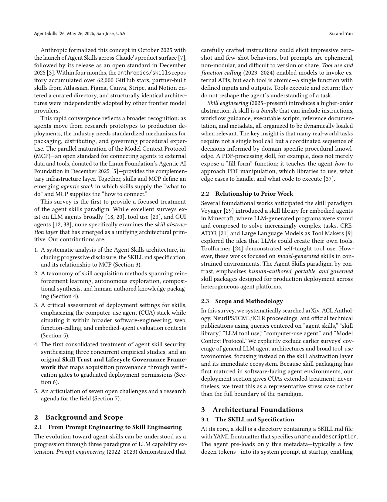
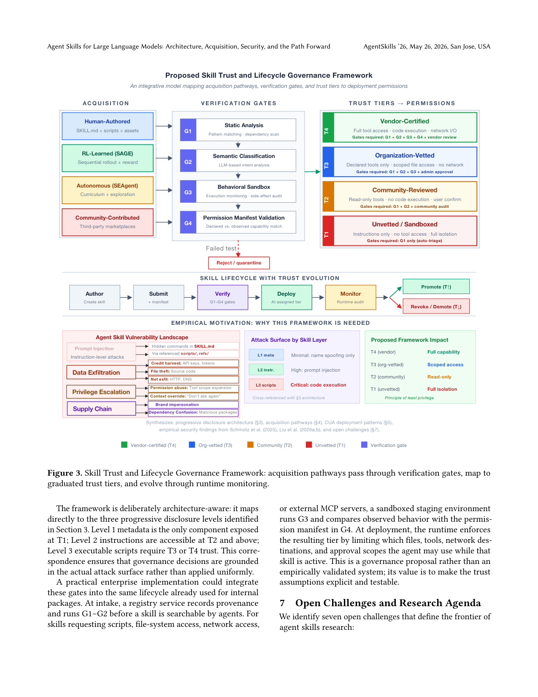

`agent_skills_arch_survey | Agent Skills for Large Language Models: Architecture, Acquisition, Security, and the Path Forward | ReDiscovery + Westlake University (Renjun Xu, Yang Yan) | 2026-06-02 v4 (AgentSkills'26 / ACM CAIS workshop) | L? 综述（Agent Skills 抽象层）·相关性 High(综述锚点)`

══ 第一层：一眼看懂 [light] ══
- 🟦 **TL;DR**：第一篇专门讲 **"Agent Skills" 抽象层**的综述（Anthropic 2025-10 提出、12 月开放标准、4 个月 anthropics/skills 仓 62k+ star）。核心论点：把"过程性专长"从模型权重里搬出来，变成**文件系统里可按需加载的 SKILL.md 包**（指令+脚本+资源），通过"渐进式披露(progressive disclosure)三级加载"省 context，与 MCP 互补（Skills 管"做什么"、MCP 管"怎么连")。沿 4 轴梳理：架构 / 习得 / 部署(CUA 为主) / 安全；并提出原创的 **Skill Trust & Lifecycle 治理框架**（应对实测 26.1% 社区技能含漏洞）。
- **最巧的一步（综述的组织主轴）**：**"渐进式披露三级"贯穿全文**——L1 元数据(~30 tok 恒载)/L2 指令(触发加载)/L3 资源(按需)。它既是架构创新，又直接映射到安全治理（L1→T1 暴露、L2→T2、L3 脚本→需 T3/T4），把"架构-攻击面-权限"对齐成一条线。抽掉这条主轴，4 轴就散了。

══ 第二层:为什么需要这篇综述 + 分类立意(写透) ══
- **领域在关心什么(讲什么)**:通用 LLM 知识广但缺真实任务要的**专用过程性专长(procedural expertise)**。三条现成路线各有不足:① **微调**——把过程知识编进权重,成本高、可组合性差;② **RAG**——提供外部知识但检索片段是被动的,**无法规定多步工作流、无法捆绑可执行代码、无法在运行时调整工具权限**;③ **纯 prompt**——无结构、不可审计。**Agent Skills** 用一个模块化、基于文件系统的抽象解此张力:技能不是模型也不是 prompt 模板,而是**自包含的包(SKILL.md 指令 + 可选脚本 + 参考文档 + 资产)**,agent 按需发现/加载/遵循。与工具的本质区别:工具"执行并返回结果",技能"通过注入过程知识、修改执行上下文、启用渐进披露来让 agent 准备好解题"。【原文 §1】
- **为何此刻需要这篇综述(动机)**:① **时效性**——Anthropic 2025-10 发布 Agent Skills、12 月开放为标准,4 个月内 anthropics/skills 仓 62k+ star、Atlassian/Figma/Canva/Stripe/Notion 等建合作技能,其他前沿厂商独立采用同构架构——产业急速收敛但缺系统梳理;② **空白**——已有综述覆盖 LLM agent / tool use / GUI agent,但**没有一篇专门审视"技能抽象层"这一新兴的统一架构原语**;③ **MCP 互补成熟**——MCP 2025-12 捐给 Linux Foundation,与 Skills 构成"Skills 管做什么、MCP 管怎么连"的新 agentic stack。所以这是**第一篇聚焦 skill abstraction layer 的综述**。【原文 §1】
- **为什么按这 4 轴分类(分类立意)**:作者选 (i) 架构 / (ii) 习得 / (iii) 部署 / (iv) 安全 四轴,是因为它们对应技能从"被定义→被获取→被部署→被治理"的完整生命周期;而**贯穿主轴是"渐进式披露三级"**——它既是架构创新(L1 元数据/L2 指令/L3 资源逐级加载省 context),又**直接映射到安全治理**(L1→T1 暴露最小、L2→T2、L3 脚本→需 T3/T4 权限),把"架构-攻击面-权限"对齐成一条线。抽掉这条主轴,4 轴就散了。这与"广撒网讲 LLM agent / tool use"的旧综述的关键 Δ=**只聚焦 skill 这一抽象层,并给出原创治理框架而非单纯罗列**。【原文 §1, §3】

══ 第三层:分类细节 + 关键发现数字 + 局限 ══
- **(i) 架构层细节**:**SKILL.md 规范**(YAML frontmatter:name+description)+ **渐进式披露三级**(L1 元数据 ~30 token 恒载 / L2 指令 200–2k token 触发加载 / L3 资源 脚本/文档/资产 按需、开销无界)+ **Skills↔MCP 正交分层**(Table 1:Skills="什么任务的程序"、MCP="连哪个外部系统");还梳理 Advanced Tool Use——Tool Search 省 token **85%**、Programmatic Tool Calling 把准确率 **79.5→88.1%**。【原文 §3】
- **(ii) 习得 6 模态(本调研最该引用的分类)**:① **Human-authored**(手写 SKILL.md,skill-creator meta-skill 脚手架);② **RL+skill library = SAGE**(GRPO+Sequential Rollout+skill-integrated reward;AppWorld **+8.9% SGC、−59% tokens**);③ **Autonomous discovery = SEAgent**(world-state model+curriculum;OSWorld 5 软件 **11.3→34.5%**);④ **Structured skill base = CUA-Skill**(参数化 execution/composition graph;WinAgentArena **57.5% SOTA**);⑤ **Compositional synthesis = Agentic Proposing**(skill library+GoT;AIME2025 **91.6%**);⑥ **Skill compilation = 多 agent→单 agent**(Li 2026,存在"库规模过大→选择精度骤降"的相变)。【原文 §4】
- **(iii) 部署层细节**:以 **CUA(computer-use agent)栈**为主——UI-TARS / UI-TARS-2(OSWorld 47.5%)、Agent S2、OpenCUA(72B 开源 45%)、UGround/Jedi/GUI-Actor 接地模型;benchmark 从个位数涨到 OSWorld-V **72.6%≈人类**(提示窄切片已饱和)。【原文 §5】
- **(iv) 安全层细节 + 关键数字(本综述最硬的实证锚点)**:3 项并发实证——① prompt injection 经 SKILL.md(Schmotz);② **SkillScan 扫 31k 技能,26.1% 含漏洞**(带脚本的风险 ×2.12);③ **157 个确证恶意技能,54.1% 出自单一产业化行为体**。据此提出**原创 Skill Trust & Lifecycle Governance 框架**:4 验证门(G1 静态分析/G2 语义意图/G3 行为沙箱/G4 权限清单)+ 4 信任层(T1 仅指令全隔离→T4 厂商认证全权限)+ 运行时升降级,攻击面 by 层(L1 微/L2 高/L3 临界)与三级架构对齐。【原文 §6】
- **7 开放挑战**:跨平台可移植 · 规模化技能选择(相变)· 技能组合编排 · 能力制权限模型 · 技能验证测试 · **持续学技能不灾难性遗忘(明确引 Shenfeld 自蒸馏=sdft_selfdistill 2601.19897)** · 评测方法学。【原文 §7】
- **局限(综述自身的失效边界)**:【原文】**治理框架是"提案而非已验证系统"**,价值在把信任假设显式化、可测,但尚未在真实部署中验证。【推断】① 视角偏 **Anthropic 生态**(SKILL.md 标准、Claude 产品、anthropics/skills 仓),对其他厂商的独立实现着墨少;② 时间窗极新(2025-10~2026-02),"benchmark 饱和""4 个月 62k star"等论断易短期失效;③ **所有性能数字均转引各原论文、未独立复现**,SAGE/SEAgent/CUA-Skill 等数据的可比性受各自设置影响;④ 6 习得模态的边界并非互斥(如 RL+library 与 compositional synthesis 有重叠),分类是组织性而非严格正交的。
- **祛魅总结**:真贡献(硬货)=**第一篇聚焦"技能抽象层"的综述 + 可作上层分类骨架的"习得 6 模态" + 三项安全实证(尤其 26.1% 漏洞)催生的原创 Trust&Lifecycle 治理框架**——后者是它区别于普通 awesome-list 的最大增量。【推断】综述的"权威性"更多来自及时整合而非原创实验;治理框架虽原创但未落地验证,实际效力待考;对"model-internal 学到的技能无法 inspect/share/govern"这一缺口的指认(呼吁桥接 acquisition↔deployment)对本调研"RL 学技能 vs SKILL.md 可审计技能"的张力很有价值。

══ 机制速览：综述分类法（A 栏抽取，替代 6 轴）[light] ══
**4 大轴 + 习得 6 模态（本调研最该引用的就是"习得模态"分类）：**

| 轴 | 内容（关键代表作 + 一句） |
|---|---|
| **(i) 架构** | SKILL.md 规范（YAML frontmatter: name+description）+ **渐进式披露三级(L1 元数据/L2 指令/L3 资源)** + Skills↔MCP 正交分层（Table 1）；Advanced Tool Use(Tool Search 省 token 85%、Programmatic Tool Calling 79.5→88.1%) |
| **(ii) 习得 6 模态** | ① **Human-authored**（手写 SKILL.md，skill-creator meta-skill 脚手架）② **RL+skill library = SAGE**（GRPO + Sequential Rollout + skill-integrated reward；AppWorld +8.9% SGC、−59% tokens）③ **Autonomous discovery = SEAgent**（world-state model + curriculum，OSWorld 5 软件 11.3→34.5%）④ **Structured skill base = CUA-Skill**（参数化 execution/composition graph，WinAgentArena 57.5% SOTA）⑤ **Compositional synthesis = Agentic Proposing**（skill library + GoT，AIME2025 91.6%）⑥ **Skill compilation = 多 agent→单 agent**（Li 2026，存在"库规模过大→选择精度骤降"的相变） |
| **(iii) 部署** | CUA 栈为主：UI-TARS/UI-TARS-2(OSWorld 47.5%)、Agent S2、OpenCUA(72B 开源 45%)、UGround/Jedi/GUI-Actor 接地；benchmark 从个位数→OSWorld-V 72.6%≈人类(窄切片饱和) |
| **(iv) 安全** | 3 项并发实证：prompt injection 经 SKILL.md(Schmotz)、**26.1% 技能含漏洞**(Liu, SkillScan 扫 31k；带脚本风险×2.12)、157 个确证恶意技能(54.1% 出自单一产业化行为体) → 原创 **Trust & Lifecycle 治理框架**(4 门 G1–G4 + 4 层 T1–T4 + 运行时升降级) |
| **7 开放挑战** | 跨平台可移植 · 规模化技能选择(相变) · 技能组合编排 · 能力制权限模型 · 技能验证测试 · **持续学技能不灾难性遗忘(引 Shenfeld 自蒸馏=sdft_selfdistill 2601.19897)** · 评测方法学(复用性/可组合性/可维护性) |

══ 关键图 top-2 [light] ══

图1（架构核心图）：用户 query→skill router→L1 元数据(~30 tok 恒载)→触发→L2 指令(200–2k tok)→按需→L3 资源(脚本/文档/资产,无界开销)，右侧"context window 消耗"递增。选它因为"渐进式披露"是整篇综述的组织主轴 + 唯一架构创新点。

图3（原创贡献图）：习得路径(human/SAGE/SEAgent/community)→4 验证门(G1 静态分析/G2 语义意图/G3 行为沙箱/G4 权限清单)→4 信任层(T1 仅指令全隔离→T4 厂商认证全权限)→运行时升降级；底部"攻击面 by 层"L1 微/L2 高/L3 临界 与三级架构对齐。选它因为这是本综述区别于普通 awesome-list 的最大原创增量。

══ 假设与失效边界（一句）[推断] ══
【原文】治理框架是"提案而非已验证系统"，价值在于把信任假设显式化可测；【推断】综述视角偏 Anthropic 生态(SKILL.md 标准、Claude 产品)，时间窗极新(2025-10~2026-02)所以"benchmark 饱和"等论断可能短期失效；性能数字均转引各原论文、未独立复现。

══ 对"探索-巩固"idea 对标（一句）[light] ══
**可借组件 + 缺口定位**：本综述给"技能积累线"提供了权威 taxonomy 锚点——其 **习得 6 模态**正好可作为本调研"技能/巩固"格子的上层分类骨架；可借观点=【技能作为可加载/可审计/可移植的外部 artifact（区别于 model-internal 学到的技能"无法 inspect/share/govern"——这正是 RL-学技能与 SKILL.md 之间的关键缺口，作者明确呼吁"桥接 acquisition↔deployment"）】；其挑战6(持续学技能不遗忘)直接点名 sdft_selfdistill，与"探索-巩固"的防遗忘子问题对齐。

══ 结构化补充 ══
- ⑦ **开源代码 + 框架/harness**：有资源合集 https://github.com/scienceaix/agentskills，但属**纯 awesome-list / 资源目录（B 层，非训练代码，不 clone）**。综述本身无训练 harness。
- 💰 资源/成本：综述无训练成本；记录生态数据(62k+ star、42,447 技能扫描等)。
- 🔭 开放问题：见上"7 开放挑战"——能力制权限、规模化技能选择相变、持续学技能防遗忘是与本调研最相关三条。
