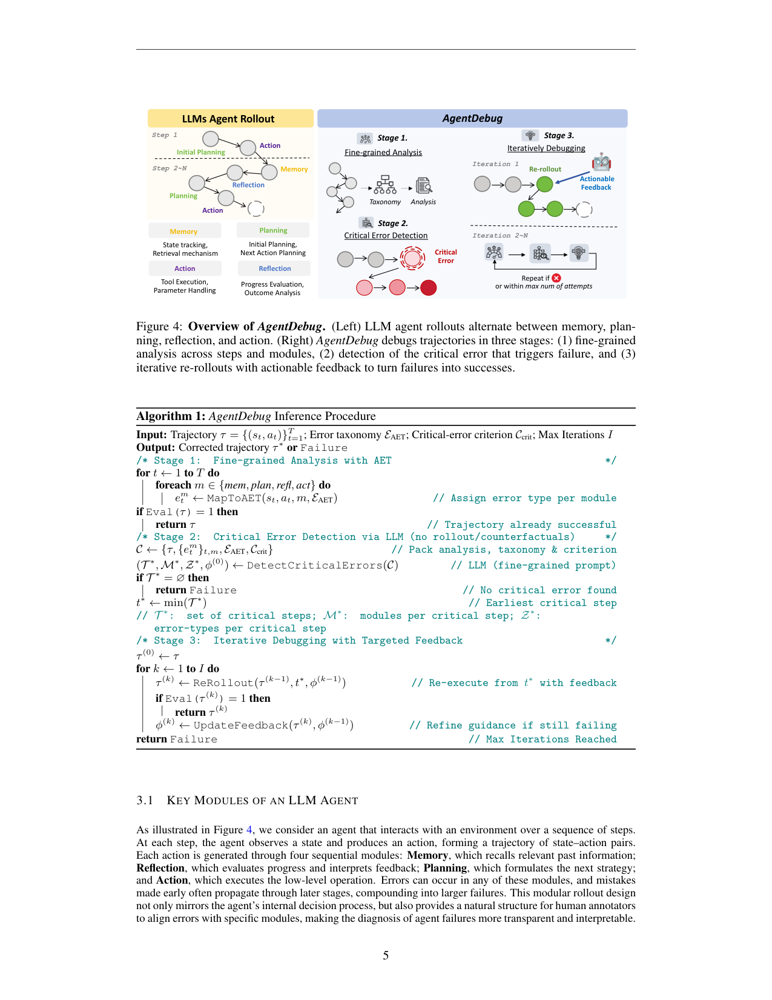
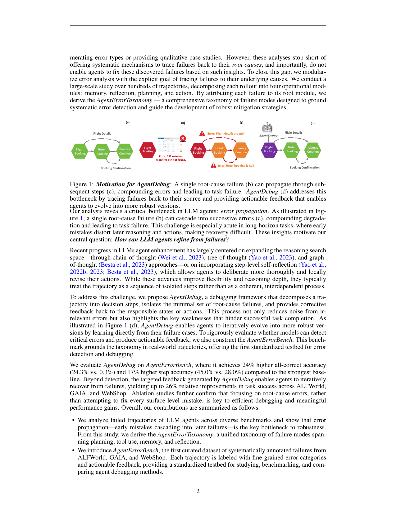

`agentdebug | Where LLM Agents Fail and How They Can Learn From Failures (AgentErrorTaxonomy / AgentErrorBench / AgentDebug) | UIUC + Stanford + AMD + OpenManus + U Toronto + Likelihood Lab (Kunlun Zhu, Jiaxuan You, James Zou, Pan Lu 等) | 2025-09 arXiv:2509.25370v1 (29 Sep 2025) · 预印本 | 主题线 L?·失败诊断 + critical-step 定位 + test-time 自纠·高相关`

> 三标注约定:【原文】=论文直述;【推断】=有据判断(附依据);【待核】=拿不准的关键事实。

══ 第一层:一眼看懂 ══

- 🟦 **TL;DR**:研究"LLM agent 到底在哪儿失败、怎么让它从失败里学"。三件套:① **AgentErrorTaxonomy**——把 agent 失败按模块分成 5 类(Memory / Reflection / Planning / Action / System),核心洞见是**错误传播(error propagation)**:一个早期根因错会沿轨迹级联放大、最终搞崩任务;② **AgentErrorBench**——首个"系统标注失败轨迹"的数据集(200 条,来自 ALFWorld/GAIA/WebShop,十位专家在 decision-step 级标错误类型 + 最小根因集);③ **AgentDebug**——一个三阶段 debug 框架:(a)逐步逐模块细粒度分析打标 →(b)定位"最早的 critical error(根因)"→(c)**从那一步重新 rollout** 并带针对性反馈,反复直到成功或耗尽预算。中心直觉:**改对一个根因错,常能把一条注定失败的轨迹翻盘**。效果:根因检测 All-Correct 比最强 baseline 高 24%(24.3% vs 0.3%),下游任务成功率最高相对 +26%。【原文 摘要+§1】

- **最巧的一步**:**只盯"最早的那个 critical/根因错",而不是去修每一个表面错**。抽掉"根因聚焦"(改成修所有表面错或从头重跑),效率与收益都垮——消融(Fig 7c)显示 Modular(根因导向)rollout 0.38 > Memory+ReAct 0.34 > Reflection 0.32 > ReAct 0.26;且 Stage 3 从 critical step 重跑而非从头,把算力集中在最有用处。为什么是它:错误传播意味着下游错多是"症状",根因才是"病灶",修症状无效还引入噪声。【原文 §1, §3.2, Fig 7c】

══ 第二层:为什么做 ══

- **研究背景**:LLM agent(集成 planning/memory/reflection/tool-use)能做复杂多步任务,但**架构越复杂越易级联失败**:单个根因错沿后续决策传播 → 任务失败。现有系统缺一个"模块化、系统化"理解 agent 错误的框架,因而也无法据此**检测并修复**这些错。【原文 摘要+§1】

- **解决的具体痛点**:① 既有"agent 失败研究"大多停在**枚举错误类型 / 定性 case study**(Cemri'25、Zhang'25 等),**没机制把失败回溯到根因**,更不能据此让 agent 自己改;② 主流增强(CoT/ToT/GoT、step-level self-reflection)把轨迹当成**孤立步骤序列**来"扩大搜索 / 局部修订",而非"相互依赖的连贯过程"——于是抓不住"早期一步错→后面全偏"的传播本质。【原文 §1】

- **相关工作 & 各自不足**:
  - *搜索扩展线*(CoT/ToT/GoT、Best-of-N):靠更多采样/分支提升覆盖,但**不定位根因**、算力散;本文 baseline 把 ToT/BoN 按 token 预算对齐后仍输给 AgentDebug。
  - *自反思线*(Reflexion、Self-Refine):agent 自己迭代改输出,但**无显式因果诊断**,容易修错地方;本文 Self-Refine baseline 被超。
  - *naive debugger*:对失败轨迹做事后泛泛纠正,**不按 taxonomy 定位 critical error**。
  - *失败分析线*:前作只枚举/定性,**无标注 benchmark、无回溯机制**——本文用 AgentErrorBench + AgentDebug 补这两个洞。【原文 §1, §4.2 Baselines】

- **动机链**:agent 不可靠的根本是**错误传播** → 要可靠就得"把失败回溯到最早根因并精准修它" → 但① 没有标注数据来量化/评测"根因定位"能力(→ 造 AgentErrorBench),② 没有模块化的错误语言(→ 立 AgentErrorTaxonomy),③ 没有"定位根因 + 从根因重跑"的方法(→ AgentDebug)。为什么不用更简单做法:Self-Refine/BoN 不定位根因 → 修症状、撒胡椒面;从头重跑 → 浪费算力且丢掉前缀正确部分。【原文 §1, §3】

- **与最近邻(Self-Refine / 朴素 debugger)的 Δ**:最像"事后改错"类方法。**关键差异**:AgentDebug 把轨迹**分解成 decision step + 4 模块**,用 taxonomy 打标后**只挑最早的 critical error**,并**精确从该 step 重跑**(而非从头/全局重写)。为什么有用:把"在哪改、改什么、从哪重跑"三件事都对齐到根因,既降噪又省算力——下游 ALFWorld 上 GPT-4o-mini 21→55、Qwen3-8B 48→74、Qwen3-Next-80B 60→84(Fig 5)。【原文 §3.2, §4.2, Fig 5】

══ 第三层:怎么做 + 靠不靠谱 ══

- **方法流水线**(Algo 1,AgentDebug 推理过程,输入失败轨迹 τ → 输出纠正后轨迹 τ* 或 Failure):
  1. **Stage 1 — 细粒度分析(MapToAET)**:对每步 t、每模块 m∈{mem,plan,refl,act},映射到一个 AgentErrorTaxonomy 错误类型,得到"模块级错误画像";若轨迹本就成功则直接返回。
  2. **Stage 2 — Critical Error Detection**:在已成功则跳过;否则**逐步做反事实测试**——在每步替换一个修正动作、看 rollout 是否会成功;**critical error = 最早的、其修正能直接防止最终失败的那一步** \(t* = min(T*)\);找不到则返回 Failure。
  3. **Stage 3 — 迭代 debug + 针对性反馈**:对 t* 生成"指明错误类型 + 可操作指导"的反馈 φ,agent **从 t* 重新 rollout**(\(ReRollout(τ, t*, φ)\));仍失败则 `UpdateFeedback` 细化反馈再来,最多 I 次(实现 N=5)。【原文 §3.2, Algo 1】
  - **AgentErrorBench 构建**(Fig 2 pipeline):收 >500 失败轨迹做人工分析立 taxonomy → 精选 200 条(ALFWorld 100 / WebShop 50 / GAIA 50)→ 10 位专家在 decision-step 级标"错误类型 + 最小根因集"(强调标**最小根因集**而非穷举表面错),三轮 pilot 校准,Cohen's κ=0.55(substantial)。【原文 §2.2】

- **逐组件必要性 / 消融**(§5.1,Fig 7):
  - *Max attempts*:✔。增加重跑次数稳定涨,小模型(GPT-4o-mini)涨幅尤大(Fig 7a:21→30→41→48→55)。
  - *检测器 base model*:✔且很敏感。GPT-4.1 远超其它(Step 42% / All-Correct 32%),Llama-3.3-70B / GPT-4o-mini / Qwen3-Next-80B 都差很多(Fig 7b)→ **AgentDebug 的根因定位强烈依赖一个强检测器 LLM**。
  - *Rollout 策略*:✔。Modular(本文,逐模块)0.38 > Memory+ReAct 0.34 > Reflection 0.32 > ReAct 0.26 > Act-only 0.10(Fig 7c)→ 模块化结构本身有贡献。
  - *根因聚焦 vs 修所有错*:作者主张"聚焦根因是关键",但**这点更多由 baseline 对比(Brute Force / Binary Search 更差)+ Modular 消融间接支撑**,而非一个"修所有错"的直接消融臂。【推断:依据=§4.1 baseline 与 Fig7c,无"fix-all-errors"专门臂】

- **关键机制直觉**:核心是把"debug"形式化成**"在最早可翻盘点做反事实干预"**。错误传播 = 病灶在前、症状在后;反事实测试("把这步换成对的,结局会不会变好")是定位病灶的天然探针;一旦定位,就把算力**全压到从 t* 重跑**(保留 t* 前的正确前缀)。这与"从头重试"或"全局自我修订"的区别就在"**最小、最早、最因果**"。【原文 §3.2】

- **实验与证据**:
  - 数据/设置:**检测**在 AgentErrorBench(200 标注失败轨迹,ALFWorld/GAIA/WebShop);**下游**在 ALFWorld/GAIA/WebShop。检测器 base = **GPT-4.1**(temp 0);下游 agent backbone = **GPT-4o-mini / Qwen3-8B / Qwen3-Next-80B**;AgentDebug 重跑上限 N=5。指标:Step / Step+Module / All-Correct(strict)三档定位精度;下游为任务成功率。【原文 §4.1, §4.2】
  - **支撑核心主张的关键实验**(检测,Table 1):AgentDebug 平均 Step 45.0% / S+M 31.3% / **All-Correct 24.3%**,对比 Direct Prompting(28.0/10.0/0.3)、Brute Force(12.0/4.3/0.0)、Binary Search(18.7/8.0/0.3);GAIA 上 Step 几乎翻倍(58 vs 30)、All-Correct 翻三倍(38 vs 12)。
  - **下游证据**(Fig 5/6):ALFWorld 三 backbone 大幅提升(见上),且**小模型相对收益最大**;GAIA/WebShop 相对最强 baseline(Self-Refine、Best-of-N)最高 +26%。**公平性**:所有 baseline 的 max attempts 按**总 token 用量**对齐 AgentDebug → 收益归因于"定向纠错"而非更多算力。【原文 §4.2】
  - *baseline 公平性*:token 预算对齐这点做得扎实(明确写了"matched by total token usage");检测对比里 Brute Force/Binary Search 是合理的"搜索定位"对照。
  - *"看着强但没回答核心"的隐患*:① **检测器强依赖 GPT-4.1**(Fig 7b 换弱模型暴跌)→ 方法的"诊断智能"很大程度外包给一个强闭源模型,泛化到弱 backbone 存疑;② AgentErrorBench 只 200 条、κ=0.55(substantial 但非高度一致),GAIA/WebShop 各仅 50 条,样本偏小;③ All-Correct 绝对值仍只 24.3%,"严格三元组全对"其实远未解决。【推断:依据=Fig7b + §2.2 规模/κ + Table1 绝对值】
  - **⚠ 一处文本内部不一致(待核)**:§3.2 Stage 2 标题写 "Critical Error Detection via **Counterfactuals**"(逐步替换修正动作做反事实测试);但 **Algorithm 1 的 Stage 2 注释写 "via LLM (no rollout/counterfactuals)"**(直接让 LLM 在打好标的画像上判 critical step,不做 rollout 反事实)。两处描述矛盾——可能正文 Stage 2 是"理想/人工标注版本",而 Algo 1 的推理实现走"LLM 直接判定"以省算力。【待核:依据=§3.2 正文 vs Algo 1 注释直接冲突,需查附录 prompt/实现确认实际跑的是哪种】

- **假设与失效边界**:
  - 【推断】方法可靠性绑定**强检测器 LLM(GPT-4.1)**;弱检测器下根因定位崩(Fig 7b)。依据=Fig 7b 数据。
  - 【推断】Stage 2 若真用反事实重跑,需环境**能从任意中间 step 重放/重跑**(与 LEAFE 同款假设);若走 Algo 1 的"LLM 直判"则不需,但定位精度受 LLM 判断力限。依据=Stage 2 两种相互冲突的描述。
  - 【原文/推断】benchmark 规模小(200)、错误传播的量化(Fig 8 热图)是**少量轨迹的可视化**而非大规模统计,结论的统计强度有限。依据=§2.2 + Fig 8/13。
  - 【推断】**纯 test-time,不更新参数**——能"当场救回失败任务",但 agent 下次遇同类任务**不会变强**(无内化);作者标题"learn from failures"实际是"test-time recover from failures",非参数级学习。依据=Algo 1 全程无权重更新。

- **祛魅总结**:
  - **真贡献(硬货)**:(a)**AgentErrorTaxonomy(5 模块)+ AgentErrorBench(首个 step 级根因标注集)** 是实打实的社区基建,可被复用;(b)"错误传播 → 只修最早根因 → 从根因重跑"这条因果 debug 思路清晰且有 token-对齐的下游验证;(c)消融把"模块化 rollout"与"重跑次数"的贡献分离清楚。
  - **包装/可能高估**:① 标题/摘要的 "learn from failures" 暗示参数级学习,实则是 **test-time 自纠(不改权重)**——读者易高估;② 24% All-Correct 的对照基线(Direct Prompting 0.3%)极低,使提升幅度看着惊人,但绝对值 24.3% 说明"严格根因定位"远未解决;③ 方法的"智能"高度外包给 GPT-4.1。【推断:依据=Algo 1 无权重更新 + Table 1 绝对值 + Fig 7b】
  - **可能低估**:AgentErrorBench 这套"step 级根因标注 + κ 校准"协议的方法论价值,可能比 AgentDebug 算法本身更长寿。【推断】

══ 结构化抽取 ══

- 🎯 **机制速览 6 轴**:

| 学什么信号 | 改什么 | 何时改 | 免梯度? | 记忆-技能生命周期 | 防遗忘机制 |
|---|---|---|---|---|---|
| 自身失败轨迹 + 按 5 模块 taxonomy 打的错误标签 + 反事实/LLM 判出的 critical step;反馈为"错误类型+可操作指导" | **harness / 当前轨迹**(从 critical step t* 重 rollout;不改参数、不存持久记忆) | **test-time per-episode**(对一条已失败轨迹做事后 debug + 重跑,最多 N=5 次) | **是**(纯 test-time,零梯度) | 无持久记忆库:反馈 φ 仅在本 episode 的迭代重跑间传递→任务结束即弃 | **不适用**(不学参数、不存跨任务记忆 → 无遗忘问题,也无跨任务变强)【推断:依据=Algo 1 无权重/无持久存储】 |

- ⑦ **开源代码 + 框架/harness**:**已开源(声明 will be available)** — GitHub **https://github.com/ulab-uiuc/AgentDebug**(摘要末句 + PDF 链接)。**无 RL/训练框架**(纯 test-time prompting 方法,veRL/TRL 等均不涉及);检测器与 agent 均走闭源/开源 LLM API(GPT-4.1 / GPT-4o-mini / Qwen3-8B / Qwen3-Next-80B),环境为 ALFWorld/GAIA/WebShop 标准 harness。【原文 摘要, §4.1】〔待核:仓内代码/数据是否已实际放出,以及 Stage 2 实现走"反事实重跑"还是"LLM 直判"——见上文内部不一致〕

- 💰 **资源/成本与可扩展性**:test-time 方法、无训练成本。主要开销 = Stage 1 对"每步×4 模块"的逐项 LLM 打标 + Stage 2 的 critical 检测(若反事实则需多次重跑)+ Stage 3 至多 N=5 次重跑。下游实验**所有 baseline 按总 token 量对齐**,说明 AgentDebug 的 token 预算与 ToT/BoN 同量级。检测器越强(GPT-4.1)越好但成本越高。具体 $/延迟原文未量化。【原文 §4.2】

- 🎯 **对"探索-巩固(探索→巩固)"idea 对标**:**强支撑(诊断侧)+ 可借组件,但缺"巩固"半边**。
  - *与 TSRD 同构处*:"细粒度分析→定位最早 critical error→从该点重跑纠正" = TSRD 的"探索→回溯到关键决策点→纠正";其 **critical-step 定位**正对应"path-selection / 该接管的关键步"。
  - **可借组件**:① **AgentErrorTaxonomy(5 模块)+ AgentErrorBench** 可直接用作"失败模式标注 / critical-step 监督"的数据与标签体系,给 TSRD 的"关键步识别"提供 ground-truth 评测;② "反事实测试找最早可翻盘点"是一个明确的 **critical-step 选取准则**,可与 MTP 前瞻探针对照/互补(MTP 预测 vs 反事实验证);③ "从 t* 重跑而非从头"= path-recovery 的单点接管思路。
  - **缺口/差异(关键)**:AgentDebug **纯 test-time、不内化**——它"救回这一局"但 agent 不变强;TSRD/mtp_opd 要的恰是把"定位+纠正"**蒸进参数**(OPD)。所以它是 TSRD **"探索→定位→纠正" 的 test-time 半成品 + 现成的关键步标注基建**,缺的是"巩固进权重"那一步(可由 LEAFE/RESD 式蒸馏补上)。【推断:依据=Algo 1 无权重更新;对照 project_core_idea(MTP foresight + OPD 内化)】

- 🔭 **开放问题/未来方向**:
  - 【原文】把"原则化 debug"作为通向更可靠/自适应 agent 的路径;扩展 taxonomy 与 benchmark 覆盖、提升根因检测精度(当前 All-Correct 仅 24.3%)。
  - 【推断】① 把 test-time debug 的"定位+纠正"**蒸馏进参数**实现跨任务变强(目前缺);② 降低对强检测器(GPT-4.1)的依赖、让弱 backbone 也能自诊断;③ 厘清并统一 Stage 2 的"反事实重跑 vs LLM 直判"实现(内部不一致);④ 扩大标注集规模、提高 κ。依据=Fig7b + Table1 绝对值 + §3.2/Algo1 冲突 + §2.2 规模。

- 🖼 **关键图 top-2**:

  
  这是**原文 Figure 4**(方法主图,同页含 Algorithm 1):左侧 LLM agent rollout 在 Memory/Reflection/Planning/Action 四模块间交替;右侧三阶段——Stage 1 细粒度分析(对齐 taxonomy)、Stage 2 critical error 检测、Stage 3 带可操作反馈从 critical step **迭代重跑**(成功或达 max attempts 即止)。选它因为一图说清"模块化诊断 + 最早根因 + 从根因重跑"的全机制。

  
  这是**原文 Figure 1**(动机图):以"订机票→订酒店→生成行程"为例,(b)一个根因错(如 CSS selector 没找到 / 航班详情为空)→(c)沿后续步骤级联放大致任务失败;(d)AgentDebug 回溯到源头给可操作反馈让 agent 进化成更稳健版本。选它因为它把全文立论根基"错误传播(error propagation)"可视化,正是"为什么要只修最早根因"的理由。

──────────
**幂等状态**:本文 analysis 首次产出。机制类型 = 失败诊断 + critical-step 定位 + **test-time 自纠(免梯度、不改参数、改 harness/重跑)**;无持久记忆、无内化。抽到 2 图:是(Figure 4 三阶段总览 + Figure 1 错误传播动机)。**代码:github.com/ulab-uiuc/AgentDebug(声明开源);无训练框架,纯 test-time。注意 §3.2 Stage2"反事实" vs Algo1"LLM直判"内部不一致,已标待核。**
