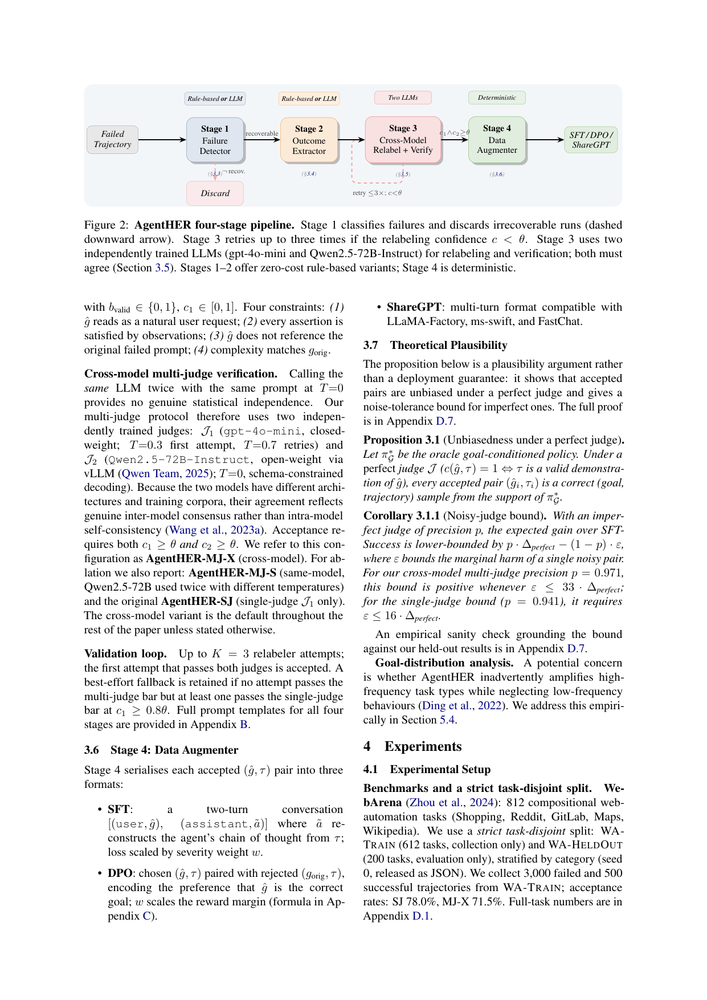
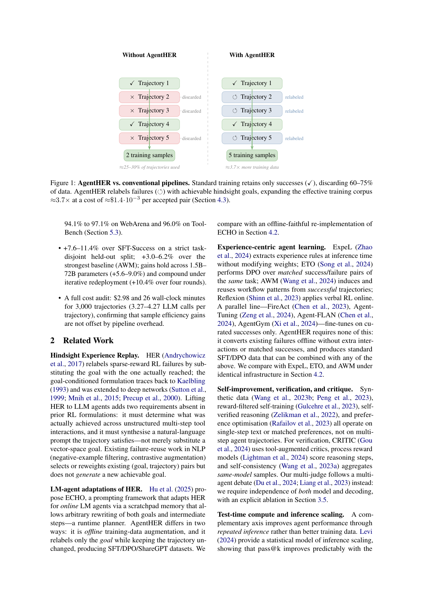

`agenther | AgentHER: Hindsight Experience Replay for LLM Agent Trajectory Relabeling | The University of Sydney (Liang Ding 单作者) | 2026-05 arXiv:2603.21357v4 (10 May 2026) · 预印本 | 主题线 L?·失败轨迹离线 hindsight 重标→SFT/DPO 数据·高相关`

> 三标注约定:【原文】=论文直述;【推断】=有据判断(附依据);【待核】=拿不准的关键事实。

══ 第一层:一眼看懂 ══

- 🟦 **TL;DR**:LLM-agent 训练流水线通常**只留成功轨迹、把 60–75% 的失败轨迹直接扔掉**(GPT-4o 在 WebArena 才 14–20%、ToolBench pass@1 <55%,失败是大头)。AgentHER 借 RL 里的 **Hindsight Experience Replay(HER)** 思想——"**一条没完成目标 A 的轨迹,往往是某个可达目标 B 的正确示范**"——做一条**离线**四阶段流水线:① 失败检测器(分类型+可恢复性+严重度权重)②结果抽取器(把轨迹真正达成了什么抽成事实清单)③**跨模型双裁判**重标(用 gpt-4o-mini + Qwen2.5-72B 两个独立模型合成一个"轨迹确实满足的新目标 ĝ",两者都通过才接受)④数据打包(导成 SFT / DPO / ShareGPT)。**只改目标、不改轨迹**,无需额外环境交互。结果:相对"只用成功的 SFT"提 +7.6–11.4%,2× 样本效率,比最强经验类基线 AWM 还高 +3.0–6.2%;整条重标 3000 条仅 **\$2.98 / ~26 分钟**。【原文 摘要+§1】

- **最巧的一步**:**跨模型(model-level)双裁判验证**——必须 gpt-4o-mini(闭源)和 Qwen2.5-72B(开源)**两个架构/语料都不同的模型都判 ĝ 对**才接受。抽掉它(退回单裁判 SJ 或同模型双裁判 MJ-S),标签噪声从 2.9% 回升、精度下降:cross-model 把人评重标精度从 94.1% 提到 97.1%(WebArena)、噪声 5.9%→2.9%;且 MJ-X 比 MJ-S 只高 +0.5% 也证明"**模型级独立性比单纯温度多样性更值钱**"。为什么是它:同一模型即便不同温度跑两次也只是"自我一致性",给不了真正的统计独立验证,挡不住"看似合理实则幻觉"的重标。【原文 §3.5, §4.6, Table 3】

══ 第二层:为什么做 ══

- **研究背景**:自主 LLM-agent 被部署在 web 导航 / API 编排 / 模拟等场景,但**实际可微调的通用模型成功率不高**(GPT-4o WebArena 14–20%、ToolBench <55%)。重度工程的多阶段 agent 能把 WebArena 推到 50–65%,但那靠**推理时拼装**(prompt stack/树搜索/workflow memory),底层训练流水线**仍在扔掉大多数轨迹**。【原文 §1】

- **解决的具体痛点 — "数据浪费"**:标准流水线(AgentTuning、FireAct、Agent-FLAN)只留成功轨迹,**浪费 60–75% 数据**。但失败不是随机噪声——它们是"在错误目标下的连贯、正确执行":一个 agent 搜了七家供应商、找到一个刚超预算的,这是**完整正确的比价过程**,对"重新定义的目标"是理想训练信号。【原文 §1】

- **相关工作 & 各自不足**:
  - *HER 本源*(Andrychowicz'17):RL 里把"想达到的目标"换成"实际达到的目标"来复用稀疏奖励失败——但那是**向量空间目标替换**;搬到 LLM agent 需"理解多步工具交互里到底达成了啥 + 合成一句轨迹真满足的自然语言 prompt"。
  - *LM-agent 版 HER*:**ECHO**(Hu'25)是**在线 prompting**框架(scratchpad 记忆,运行时可任意重写目标+中间步,是个 runtime planner);AgentHER 的两点不同——**离线训练数据增广** + **只重标目标、保持轨迹不变**,产标准 SFT/DPO/ShareGPT。(论文用"离线忠实复现的 ECHO"做对比。)
  - *经验类 agent 学习*:ExpeL(推理时抽规则不改权重)、ETO(对同任务的成功/失败配对做 DPO)、AWM(从成功轨迹归纳 workflow)、Reflexion(在线口头 RL)——AgentHER 不需匹配的成功/失败对、不需额外交互,产的是可与上述任意方法叠加的标准 SFT/DPO 数据。
  - *自改进/验证/critique*:合成数据、reward-filtered self-training、self-verified reasoning、偏好优化、CRITIC/PRM/self-consistency——**都作用于单步文本或匹配偏好,不处理多步 agent 轨迹**;本文的多裁判走"多 agent 辩论式"的模型级独立。【原文 §2】

- **动机链**:agent 成功率低 → 失败轨迹是数据大头却被丢 → 失败 ≠ 噪声,常是"错目标下的正确执行" → 用 HER 把"实际达成的"反推成"一个可达的新目标 ĝ",让失败变正样本 → 但 LLM 重标会幻觉出"轨迹其实没满足"的假目标 → 所以加**失败严重度过滤(丢重大推理缺陷的)+ 跨模型双裁判**控质量 → 产标准 SFT/DPO/ShareGPT,离线、便宜、可叠加。为什么不用更简单做法:SFT-Negative(只在失败前加"以下尝试失败了"标记)只比 SFT-Random 高 +0.4–0.8%——因为它**仍丢掉了失败里的正向内容**,而 hindsight 重标把这些内容救成正样本(AgentHER 比 SFT-Random 高 +12–18%)。【原文 §1, §3, §4.2】

- **与最近邻 ECHO / AWM 的 Δ**:
  - vs **ECHO**:ECHO 在线、可重写目标+中间步(runtime planner);AgentHER **离线、只重标目标、轨迹不动**,产可复用训练数据。差异有用:离线增广能一次性把历史失败转成可反复训练的语料,不占运行时;且"轨迹不动"保证重标对应的是真实执行过的步骤。【原文 §2】
  - vs **AWM**:AWM **只从成功轨迹**归纳 workflow 记忆;AgentHER **从失败**造数据,且不需匹配成功对。主结果 AgentHER-MJ-X 比 AWM 高 +3.0–6.2%。【原文 §2, Table 1】

══ 第三层:怎么做 + 靠不靠谱 ══

- **问题形式化**(§3.1):失败语料 \(F={(gi,τi,fi)}\)(目标、轨迹、失败标签),目标是为每条失败合成 hindsight 目标 ĝi 使 τi 成为 ĝi 的**有效正示范**。**有效 hindsight 目标定义(Def 3.1)**:(a)ĝ 蕴含的每个事实都被观测 {ot} 支持;(b)两个独立裁判 J1,J2 都给 c(ĝ,τ)≥θ。映射 Φ 把每条失败映成训练样本或拒绝(⊥);增广语料从 M 条成功最多长到 M+N。【原文 §3.1】

- **方法流水线**(Fig 2 四阶段,Algo 1 端到端):
  1. **Stage 1 失败检测器**:给每条轨迹分配失败类型 ϕ∈{INCOMPLETE, CONSTRAINT_VIOLATION, WRONG_RESULT, TOOL_ERROR, HALLUCINATION, OFF_TOPIC}、可恢复 flag r、严重度权重 w。**两种模式**:rule-based(关键词词典,零成本)或 LLM-judge(JSON schema 输出)。**MQM 式严重度加权**:major 错误(推理矛盾/幻觉观测/灾难性工具误用)w<δ=0.3 → 丢弃;minor 错误 w∈[0.3,1] → 下传,w 用来在 Stage 4 加权 DPO loss。这一步把噪声重标从 5.9% 降到 2.9%。
  2. **Stage 2 结果抽取器**:产出 REPLAYOUTCOME——"实际达成清单 + 关键观测(数字/实体/事实)",**只保留被观测证实的事实**,锚定 Stage 3 防幻觉。
  3. **Stage 3 跨模型重标+验证**:relabeler J1 据 outcome + 原 prompt 风格合成 (ĝ, b_valid, rationale, c1),四约束(读着像真用户请求 / 每个断言被观测满足 / 不引用原失败 prompt / 复杂度匹配原 g)。**跨模型双裁判**:J1=gpt-4o-mini(T=0.3 首试/0.7 重试)、J2=Qwen2.5-72B-Instruct(T=0,schema 约束,vLLM)。要 c1≥θ 且 c2≥θ 才接受;最多 K=3 次重试;若都没过双裁判但有一次过单裁判 c1≥0.8θ 则保留 best-effort 兜底。
  4. **Stage 4 数据打包(确定性)**:序列化成 **SFT**(两轮对话 [(user,ĝ),(assistant,ã)],ã 从 τ 重构 CoT,loss 按 w 缩放)/ **DPO**(chosen (ĝ,τ) vs rejected (gorig,τ),w 缩放 reward margin)/ **ShareGPT**(兼容 LLaMA-Factory / ms-swift / FastChat)。【原文 §3.2–3.6】
  - **理论可信性(§3.7)**:Prop 3.1 完美裁判下每个接受对都是 oracle 目标条件策略支持内的正确样本;Cor 3.1.1 噪声裁判精度 p 下,相对 SFT-Success 的期望增益下界 \(p·Δ_perfect − (1−p)·ε\);对 MJ-X 的 p=0.971,只要 ε≤33·Δ_perfect 就为正。作者明确说这是**plausibility argument 而非部署保证**。【原文 §3.7】

- **逐组件必要性 / 消融**(§4.6):
  - *跨模型双裁判 MJ-X*:✔。比 MJ-S(同模型双温度)+0.5%、噪声 4.4%→2.9%;比 SJ +0.8–1.6%。证明模型级独立 > 温度独立。
  - *严重度加权*:✔(降噪 5.9%→2.9% 的另一半来源)。
  - *hindsight 重标本身 vs 仅标失败*:✔。SFT-Negative 仅 +0.4–0.8%(over SFT-Random),AgentHER +12–18% → 重标"救正向内容"是关键。
  - *阈值 θ*:✔有扫描。θ*=0.5 在两变体上都最优,稳健超参(Fig 3c)。
  - *rule-based vs LLM 模式的端到端影响*:Stage1/2 提供零成本 rule-based 变体,但**正文未给"全 rule-based pipeline vs 全 LLM pipeline"的端到端质量对比**(只说 rule-based 是便宜替代)。【推断:依据=§3.2 描述两模式但 Table 1 用的是默认 LLM/MJ-X 配置】

- **关键机制直觉**:HER 的精髓 = **把"想要什么"改成"做到了什么"**,从而让失败有了正确的监督目标。LLM 版的难点全在"**做到了什么**"的判定——多步工具交互里没有现成的"达成目标向量",得靠 LLM 读轨迹反推,而这正是幻觉重灾区。AgentHER 的两道闸(outcome 抽取只留观测证实的事实 + 跨模型双裁判)就是把"反推达成"这步的噪声压住。另一直觉(§2.4):AgentHER 与 test-time scaling **正交**——它降低每个任务的固有失败概率 pi(把地板抬高),test-time compute 再在更强起点上压榨覆盖度。【原文 §3, §2 test-time 段】

- **实验与证据**:
  - 数据/设置:**WebArena**(812 任务,严格 task-disjoint 划分:WA-TRAIN 612 仅采集 / WA-HELDOUT 200 仅评测;采 3000 失败 + 500 成功)、**ToolBench**(16464 任务/49 API,G1/G2/G3;采 5000 失败 + 2000 成功)。采集器故意用**弱模型 GPT-3.5-turbo**(产更丰富失败),裁判是更强模型且不参与采集。模型:GPT-4o(OpenAI 微调 API)、Qwen2.5-72B/7B、LLaMA-3.1-8B;开源模型用 **LoRA**(rank16, α32, 3 epoch, 8×A100)。另报 GPT-4o-ICL(8 shot,不微调)作可复现替代。3 seeds,std<0.5。【原文 §4.1】
  - baseline:Base / SFT-Random(同 3k 失败、不重标,等量对照)/ Rejection-Sampling / SFT-Success(Δ 参照)/ SFT-Negative / ETO / ECHO-offline / AWM;推理时参照(权重不变):Reflexion、ExpeL。AgentHER 变体:SJ / MJ-S / MJ-X(默认)。
  - **支撑核心主张的关键实验**(Table 1):WA-HELDOUT 成功率,AgentHER-MJ-X:GPT-4o 29.9 / Qwen-72B 37.7 / Qwen-7B 26.5 / LLaMA-8B 24.8,相对 SFT-Success **+7.6–8.7%**;ToolBench pass@1 相对 SFT-Success **+7.6–11.4%**;相对最强基线 AWM **+3.0–6.2%**。**小模型收益更大**(7B/8B 在 ToolBench +10.7–11.4% > 72B +8.1% > GPT-4o +7.6%),1.5B 近翻倍(6.4→12.0)。
  - **数据效率/扩展**(Fig 3):AgentHER-SJ 用 **50% 成功示范**就达 full-SFT-Success(**2× 效率**),MJ-X 在每个数据点都更高;失败量 **log-linear 扩展**(SFT-Success 无法吃更多失败);θ*=0.5 稳健。**跨任务迁移**:WA-TRAIN 训的 MJ-X 零样本评 ToolBench 仍比 SFT-Success +9.5% → 迁移的是**规划能力**而非记住的任务描述。
  - **成本审计**(Table 2):3000 失败,MJ-X 每接受对 \$1.4·10⁻³;多裁判比单裁判 +\$1.20(+67%)/+9.7min 换 94.1→97.1% 精度。重标+LoRA 合计 \$7.18/4.8h,**LoRA 占 wall-clock 大头、API 占 $ 大头**。2× 样本效率省下"从头采集 50% 成功示范"的成本。
  - *baseline 公平性*:**SFT-Random 用同一批 3000 失败(不重标)= 严格等量对照**,这点做得很扎实;严格 task-disjoint + 环境 reset + 3 seeds,训练/测试隔离清楚。
  - *"看着强但没回答核心"的隐患*:① 采集器是 GPT-3.5-turbo,**与被微调模型(GPT-4o 等)不同源**——好处是隔离了"采集器解答泄漏",但意味着重标数据反映的是"弱模型的失败分布",对强模型是否最优可议;② 目标分布偏移(会不会放大高频任务类型)作者承认是 concern,放 §5.4 实证处理(本次未读到该节细节)。【推断:依据=§4.1 采集器设定 + §3.7 goal-distribution 段】

- **假设与失效边界**:
  - 【原文】理论保证只在**完美裁判**下成立;噪声裁判靠下界 + 高精度(97.1%)兜,是 plausibility 非保证(§3.7 自述)。
  - 【推断】**强依赖两个能力够强的裁判 LLM**;若可用裁判弱或同质,model-level 独立性失效、噪声重标会漏进 SFT/DPO。依据=§3.5 + Fig 7b 思路类比(本文核心质量阀就是裁判)。
  - 【推断】"只重标目标、轨迹不动"意味着**轨迹本身的执行必须是连贯正确的**;若失败轨迹是"步骤本身就错乱"(而非"对错目标的正确执行"),Stage1 的 recoverability/severity 会丢掉它 → 可用比例受限(WA 接受率 MJ-X 71.5%、ToolBench 75.5%)。依据=Algo1 line4 丢弃 + §4.1 接受率。
  - 【推断】**纯离线数据增广、单轮微调**——agent 不会在部署中持续自进化(与本调研"自进化"主旨是"离线 bootstrap"而非"在线终身学习")。依据=方法是 offline pipeline→SFT/DPO。

- **祛魅总结**:
  - **真贡献(硬货)**:(a)把 HER 干净地搬到自然语言 agent 轨迹(只重标目标、产标准 SFT/DPO/ShareGPT),并用**严格 task-disjoint + 等量 SFT-Random 对照**把"涨点来自重标而非更多数据"坐实;(b)**跨模型双裁判**这个降噪机制有消融(MJ-X>MJ-S>SJ)+ 人评精度 + 噪声率三重证据;(c)**罕见的全成本审计**(\$2.98/26min,LoRA vs API 成本拆分),让"样本效率 vs 系统效率"的 confound 被正面回应——这点比多数同类工作诚实。
  - **包装/可能高估**:① 单作者、v4 版,措辞略密集但结论基本由数据支撑;② 理论部分(Prop 3.1 / Cor 3.1.1)是"完美裁判"理想化,实际价值有限,作者已自标 plausibility;③ 采集器用 GPT-3.5-turbo,"对强模型也最优"未充分论证。【推断:依据=§3.7 自述 + §4.1 采集器】
  - **可能低估**:"轨迹不动只换目标"这个约束其实是**防幻觉的关键设计**(保证监督对应真实执行过的步骤),作者把它当作与 ECHO 的区别一笔带过,其方法论价值(可信 hindsight 的前提)值得更强调。【推断】

══ 结构化抽取 ══

- 🎯 **机制速览 6 轴**:

| 学什么信号 | 改什么 | 何时改 | 免梯度? | 记忆-技能生命周期 | 防遗忘机制 |
|---|---|---|---|---|---|
| 自身**失败轨迹**(被丢弃的)+ 跨模型双裁判合成的 hindsight 目标 ĝ;严重度权重 w 自失败检测器 | **参数**(用重标出的 SFT/DPO 数据微调,开源模型走 LoRA) | **离线批量**(一次性把历史失败转成训练语料 → 单轮微调;非在线) | **否**(最终是有梯度的 SFT/DPO 微调;重标 pipeline 本身免梯度) | 失败轨迹→重标为 (ĝ,τ) 训练对→打包 SFT/DPO/ShareGPT→喂微调;无运行时持久记忆库 | **不直接处理**(离线单轮微调,无显式防遗忘;靠 LoRA 低秩 + 与成功数据混合间接限制偏移)【推断:依据=方法为离线 SFT/DPO,无 KL/merging 等机制】 |

- ⑦ **开源代码 + 框架/harness**:**已开源** — GitHub **https://github.com/alphadl/AgentHER**(摘要末 + §1 + PDF 双链接,明确)。**无 RL 训练框架**(是数据增广 pipeline);微调侧开源模型用 **LoRA**;产出格式**兼容 LLaMA-Factory / ms-swift / FastChat**(ShareGPT 格式)。裁判用 gpt-4o-mini(API)+ Qwen2.5-72B-Instruct(**vLLM**, schema 约束解码);环境 WebArena / ToolBench 标准 harness。【原文 摘要, §3.5, §3.6, §4.1】〔代码仓未 clone 核验,以正文链接为准〕

- 💰 **资源/成本与可扩展性**:**成本审计是亮点**——3000 失败重标 **\$2.98 / ~26min**(3.27–4.27 次 LLM 调用/轨迹),每接受对 **\$1.4·10⁻³**;MJ-X 比 SJ 多 \$1.20/+9.7min 换精度。重标+LoRA 合计 \$7.18/4.8h(LoRA: 4.4h×8 GPU×\$1.05/h)。**2× 样本效率**省采集成本。可扩展性:失败量 log-linear 扩展;模型 1.5B–72B 均受益(小模型更甚)。【原文 §4.3, §4.4, §4.5, Table 2】

- 🎯 **对"探索-巩固(探索→巩固)"idea 对标**:**支撑(数据侧)+ 可借组件,但路线偏离子(离线、改目标而非纠动作)**。
  - *与 TSRD 的关系*:AgentHER 也是"从失败里榨监督",但**它不纠正轨迹/动作,而是给失败配一个它本就满足的新目标**——是"换目标让失败变正样本",与 TSRD 的"回溯到关键步纠正动作"是**不同的失败再利用范式**(目标重标 vs 动作纠正)。
  - **可借组件**:① **失败类型 taxonomy(6 类)+ MQM 式严重度加权**可用于 TSRD 数据清洗(过滤"重大推理缺陷"的失败,只对"可恢复"失败做 path-recovery 蒸馏);② **跨模型双裁判 + outcome-抽取防幻觉**是一套可复用的"自动标注质量阀",可给 TSRD/OPD 的"自判对错"(对照 RESD 的 reward 门控、ReasoningBank 的 LLM-as-Judge)提供更稳的双模型版本;③ **DPO loss 按严重度 w 加权**的思路可迁移到"按失败严重度调蒸馏权重"。
  - **缺口/差异**:AgentHER **离线、不内化在线经验、不做 token 级蒸馏**(产的是 SFT/DPO 数据,非 on-policy logits 监督);与 mtp_opd 的"MTP 前瞻 + OPD 在线蒸馏"路线**正交**——它更像"数据增广预处理器",可作 TSRD 训练前的失败数据清洗/扩充层,而非核心训练机制。【推断:依据=方法为离线目标重标 + SFT/DPO;对照 project_core_idea(MTP + OPD 在线)】

- 🔭 **开放问题/未来方向**:
  - 【原文】目标分布偏移(会否放大高频任务类型)的进一步处理(§5.4 已实证起步);理论从 plausibility 推向更强保证。
  - 【推断】① 用更强/更多样的裁判集成进一步降噪;② 把"采集器 = 被微调模型本身"(on-policy 采失败)以匹配目标分布;③ 与 on-policy 蒸馏(token 级)结合——AgentHER 造正样本目标、OPD 给 token 监督;④ 迭代重部署的长期稳定性(已报 4 轮 +10.4%,但更长程未测)。依据=§4.1 采集器异源 + §4.2 迭代结果。

- 🖼 **关键图 top-2**:

  
  这是**原文 Figure 2**(方法主图):Failed Trajectory → Stage1 失败检测器(rule/LLM,不可恢复则丢)→ Stage2 结果抽取器 → Stage3 跨模型重标+验证(两个独立 LLM,c<θ 重试≤3×)→ Stage4 确定性数据打包 → SFT/DPO/ShareGPT。选它因为一图说清"失败→过滤→抽达成→跨模型重标→出训练数据"的完整离线管线与两道质量闸。

  
  这是**原文 Figure 1**(动机图):左"Without AgentHER"5 条轨迹只留 2 条成功、其余丢弃(2 训练样本);右"With AgentHER"把 3 条失败 relabel 成可用样本(5 训练样本,≈3.7× 语料),每接受对成本 ≈\$1.4·10⁻³。选它因为它把全文动机"标准流水线浪费 60–75% 数据、hindsight 重标把失败救回"一图点透。

──────────
**幂等状态**:本文 analysis 首次产出。机制类型 = 失败轨迹**离线 hindsight 目标重标 → SFT/DPO 数据 → 微调内化**(**有梯度改参数、LoRA**、离线批量、无在线记忆);核心质量阀 = 跨模型双裁判 + 严重度加权。抽到 2 图:是(Figure 2 四阶段流水线 + Figure 1 数据浪费动机)。**代码:github.com/alphadl/AgentHER(已开源);数据格式兼容 LLaMA-Factory/ms-swift/FastChat;无 RL 框架。**
