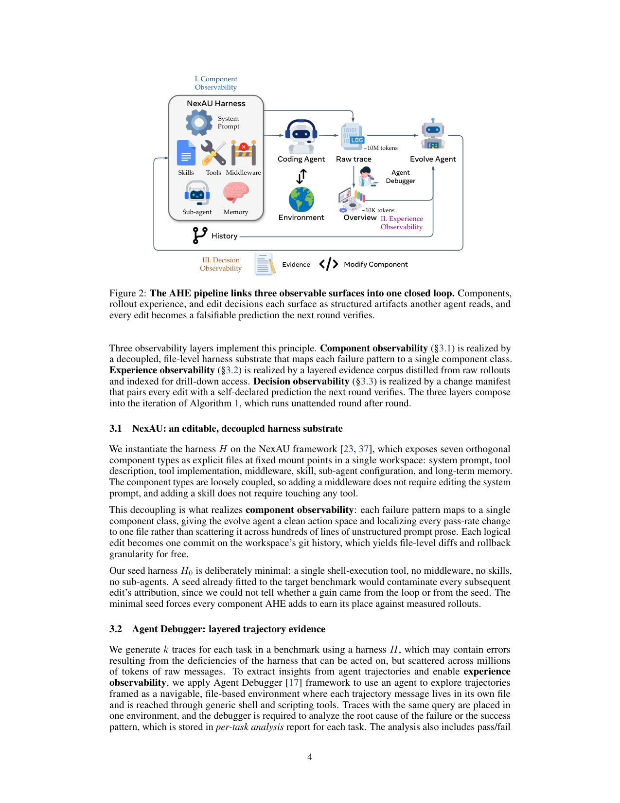
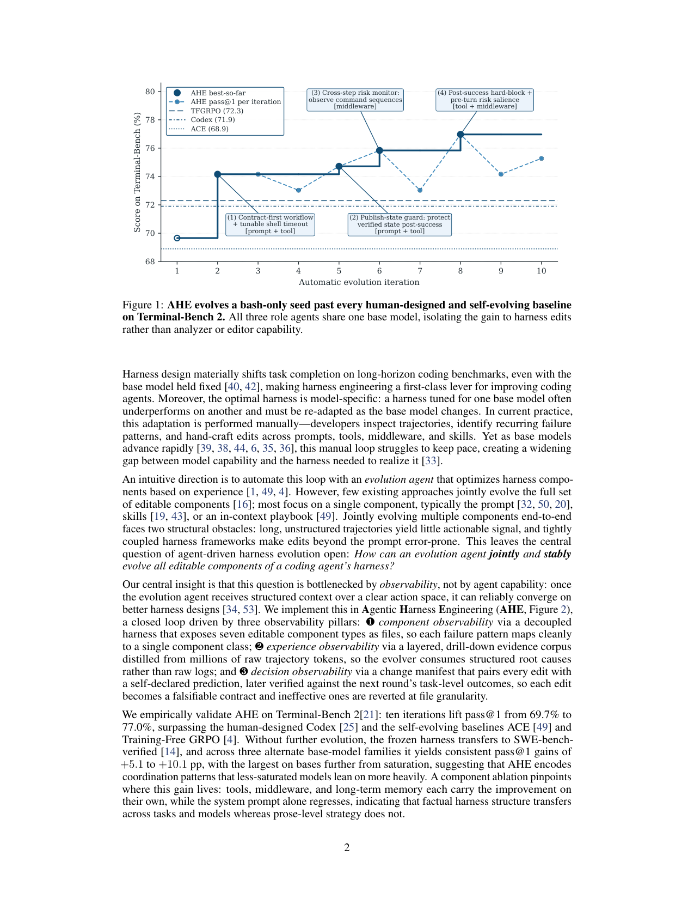

`agentic_harness_eng | Agentic Harness Engineering: Observability-Driven Automatic Evolution of Coding-Agent Harnesses (AHE) | 复旦(主) / 北大 / 上海奇迹智锋(Jiahang Lin, Shichun Liu, Chengjun Pan 等;通讯 Zhenhua Han, Tao Gui;Yu-Gang Jiang) | 2026-04·arXiv:2604.25850 v4(18 May 2026)·preprint·35页 | 主题线 L6(coding-agent harness 自进化)· 相关性 High`

> 三标注:【原文】=直接来自论文;【推断】=有据判断(附依据);【待核】=拿不准的关键事实。

---

## ══ 第一层:一眼看懂 [light] ══

- 🟦 **TL;DR**:【原文 摘要, §1】Coding agent(写代码/跑终端的智能体)的表现不只靠底层大模型,还靠它外面那套"脚手架(harness)"——系统提示、暴露文件系统/shell 的工具、控制上下文与恢复的中间件(middleware)、技能、子 agent、长期记忆等"模型外、可编辑"的组件。可这套 harness 现在还是**手工打磨**:开发者人肉看轨迹、找反复失败、手改各组件。AHE 想把这个循环**自动化**,让一个"进化 agent"端到端地联合进化全部可编辑组件。难点有三:动作空间异构(组件类型五花八门)、轨迹海量(几百万 token 把有用信号埋了)、改动效果难归因。AHE 的核心洞察:**卡点是"可观测性"而非 agent 能力**——只要给进化 agent 一个清晰动作空间 + 结构化证据,它就能稳定收敛到更好的 harness。于是三根"可观测性支柱":❶**组件可观测**(每个可编辑组件落成文件、动作空间显式可回退);❷**经验可观测**(把上百万 raw token 蒸馏成分层、可下钻的证据语料);❸**决策可观测**(每次编辑配一个自报的"预测",下一轮用真实任务结果验证——把每次编辑变成可证伪的契约,无效就按文件粒度回退)。结果:在 Terminal-Bench 2 上 10 轮把 pass@1 从 **69.7%→77.0%**,超过手写 harness Codex(71.9%)和自进化基线 ACE / Training-Free GRPO;冻结后的 harness 免再进化迁移到 SWE-bench-verified(最高总成功率 + 比种子省 12% token),跨三个不同模型家族还能 +5.1~+10.1pp。
- **最巧的一步**:【推断,依据 §3.3 + §4.4.2 Fig 4】**"决策可观测 = 每次编辑配自报预测 + 下一轮真值核验 → 可证伪契约 + 文件粒度回滚"**(change manifest)。抽掉它,整个循环就退化成"试错+自我合理化"——进化 agent 会用花言巧语给每个编辑找理由却无法被检验,坏编辑无法被识别回退。正是它把"自由代码搜索"约束成"可审计、可回滚的契约式进化"。值得注意的是 Fig 4 自己诚实暴露:这套自归因对"修复"靠谱(precision/recall 约 5× 随机),但对"回归(把别的任务搞坏)"近乎失明(仅约 2× 随机)——这成了全文最有价值的"祛魅式"发现。

---

## ══ 第二层:为什么做 ══

- **研究背景**:【原文 §1, §2.1】Coding agent 在长程软件工程任务(真实 repo 改 issue、多步终端工作流)上进展显著,但进展"同等地"依赖模型外的工程组件(=harness)。已有大量工作表明:**基座固定时,harness 设计也能显著改变任务完成率**,所以 harness 工程是改进 coding agent 的"一等杠杆"。而且**最优 harness 是模型专用的**:为一个基座调好的 harness 换基座往往就退化,基座一升级就得重适配。
- **解决的具体痛点**:【原文 §1】① 基座模型迭代飞快,手工 harness 适配的循环跟不上,造成"模型能力"与"realize 它所需 harness"之间的鸿沟越来越大。② 已有自动优化方法**极少联合进化全套可编辑组件**——多数只盯单一组件(通常是 prompt,或技能,或 in-context playbook)。③ 端到端联合进化多组件有两个结构性障碍:**长而无结构的轨迹给不出可操作信号**;**紧耦合的 harness 框架使"prompt 之外"的编辑容易出错**。
- **相关工作 & 各自不足**:【原文 §2.2】按"优化器观察什么证据、能编辑什么"分:
  - **改自身输出**(episodic critique/反思):Self-Refine、Reflexion 类。
  - **改 prompt/指令**:结构化 playbook(**ACE**)、语义优势先验(**Training-Free GRPO**)、指令-示例联合优化(MIPRO)、Pareto 前沿 trace 驱动反思(**GEPA/DSPy** 系)。不足:**只开放 prompt 这一面**。
  - **改程序结构本身**:技能库(SkillClaw)、打分的程序/agent 档案进化(ADAS、AlphaEvolve)、图结构工作流搜索。
  - **最近邻 Meta-Harness**[16]:也搜完整 harness 程序。**共同不足(作者立论)**:要么单面、要么把 harness 当无结构整体去搜导致归因混乱。
  - **AHE 的差异化**:把**整套 harness 当一个组合整体**调(让跨组件 trade-off 对优化器可见),同时**把人类先验压到最小**(方法论让优化器自己从 rollout 里发现,而非手工固定)。
- **动机链**:【原文 §1】手工 harness 适配跟不上模型迭代 → 想用进化 agent 自动化 → 但联合进化多组件被"轨迹无信号 + 框架紧耦合 + 归因难"三重卡住 → 核心洞察:这是**可观测性瓶颈**,不是 agent 能力瓶颈 → 所以分别用三根可观测性支柱解掉三个障碍(组件文件化解动作空间、轨迹蒸馏解信号、契约式 manifest 解归因)→ 进化即可自主稳定推进、不塌成试错。
- **与最近邻 Δ**:【原文 §2.2, §1】最像 **Meta-Harness**(都自动进化完整 harness)。**关键差异**:AHE 不把 harness 当"待搜的代码黑盒",而是把它拆成**七类正交、文件化、松耦合的组件 + 三层可观测性 + 契约式归因回滚**,使"每个失败模式→单一组件类、每次涨跌→定位到一个文件"。【推断,依据 §3.1, §4.4.1】这个差异有用在于:可观测+可归因让进化稳定收敛(Fig 1 单调向上),且组件级消融(Table 3)能精确说出"收益住在 tools/middleware/memory 而非 system prompt"——这是无结构搜索给不出的可解释性。与 **life_harness**(同期、互引)的 Δ:life_harness 做非 coding 的确定性域、按"交互生命周期四层"组织固定干预;AHE 做 coding 域、按"七类组件 + 可观测性"组织自由编辑(更开放、更工程化)。

---

## ══ 第三层:怎么做 + 靠不靠谱 ══

- **方法流水线**(§3, Algorithm 1):闭环外循环 = rollout → clean → 归因上一轮 manifest 并回滚被拒编辑 → 蒸馏 → 编辑 → commit,无人值守一轮接一轮:
  1. **❶ 组件可观测 / NexAU 基底**(§3.1):harness H 实例化在 **NexAU 框架**上,把七类正交组件暴露成固定挂载点的显式文件——**系统提示、工具描述、工具实现、中间件(middleware)、技能、子 agent 配置、长期记忆**。松耦合(加 middleware 不用改 prompt)。每个逻辑编辑 = workspace git 上一次 commit,免费得到文件级 diff 与回滚粒度。**种子 H0 故意极简**(只有一个 shell 执行工具,无 middleware/技能/子 agent)——若种子已为目标 benchmark 调过,会污染后续每个编辑的归因。
  2. **❷ 经验可观测 / Agent Debugger**(§3.2):对每个任务用 harness H 生成 k 条 trace(含可操作的失败信号但散在百万 token 里)。用 **Agent Debugger** 框架把轨迹当成"可导航的文件式环境"(每条消息一个文件、用通用 shell/脚本工具访问),同 query 的 trace 放一个环境,让 debugger 分析失败根因/成功模式 → 写成**每任务分析报告**(含 pass/fail 状态),再聚合成 benchmark 级 overview 当每轮入口。原始 trace 也以文件提供(raw + 轻处理)支持渐进式披露省 token。把 ~10M token 压到 ~10K token 级证据。
  3. **❸ 决策可观测 / Evolve Agent**(§3.3):每轮读分层证据语料,决定增/改/删哪些组件、应用编辑、记录每个编辑的推理。两条约束实现"决策可观测":**(a) 可控性**——Evolve Agent 只能写 harness workspace 内,runs 目录/tracer/verifier/LLM 配置只读、种子系统提示标记不可删(堵死"关掉 verifier / 换模型 / 偷偷加推理预算"等捷径,保证收益都归因于 harness 编辑);**(b) 证据驱动 + 带预测的 manifest**——每个编辑附 manifest 条目:命名失败证据、推断根因、目标修复、**预测影响(含预期修复 + 风险回归)**;下一轮把"预测修复集/预测回归集"与"观测到的任务级 delta"求交,产出每编辑判决(verdict),无效则回滚。
  - **额外**:每任务 \(k≥2\) 次 rollout(每任务带 pass-rate 信号、稳住 pass@1);归因在蒸馏之前跑(判决落进证据语料、把上轮 manifest 绑成契约);第 1 轮并行跑一个 one-shot explore agent 从 NexAU 源码 + 公开 coding-agent 参考播种少量可复用技能(无特殊保护,第 2 轮起可被增删改)。
- **逐组件必要性**(组件级消融 Table 3,每行只把一个 AHE 组件换进 NexAU0 种子):【原文 §4.4.1】
  - **+ memory only**:69.7→**75.3%**(Hard 51.7→63.3,加了 12 条边界教训,在 Hard 上甚至超过 full AHE)。
  - **+ tool only**:→**73.0%**(变成 1364 行 shell、自动从命令附近文件浮现契约提示;Medium 上离 full AHE 仅 0.9pp)。
  - **+ middleware only**:→71.9%(加 finish-hook 强制一次"evaluator 同构"的收尾检查;Easy 全清)。
  - **+ system_prompt only**:→**67.4%(唯一退化,-2.3pp)**——79 行"通用纪律"prose,其可执行性依赖其他三者,单独插入反而降。
  - **关键结论(非可加性)**:三个正向单组件增益之和 +11.1pp > full AHE 的 +7.3pp,且 memory-only 在 Hard 上超过 full——**组件非可加、会相互干扰**(memory/middleware/prompt 都推向"收尾式验证",叠加会在长程预算里浪费回合做冗余复检)。这解释了 Hard tier 上 AHE 略输 Codex(§4.2)。
- **关键机制**:【原文 §3.3】"可证伪契约"= 用"预测 vs 下一轮真值"的**集合求交**给每个编辑判生死,把"理由驱动的自辩"换成"轮间可度量契约"。直觉:像科学实验预注册——先声明"我这刀会修好 A、可能弄坏 B",下一轮拿真实结果对账,对账不上就 revert,从而避免进化滑向不可证伪的试错。
- **实验与证据**(§4):
  - **数据集/设置**:进化在 **Terminal-Bench 2** 全 89 任务(4 易/55 中/30 难,单任务超时延到 1 小时);跨 benchmark 迁移到 **SWE-bench-verified**(500 任务/7 repo)。指标:pass@1(k 次 rollout 的二元成功均值)、tokens/trial(千 token)。**三个 role agent(Code Agent / Agent Debugger / Evolve Agent)共享同一基座 GPT-5.4 high**——把收益隔离到 harness 编辑而非分析器/编辑器能力。
  - **RQ1 主结果(Table 1, Fig 1)**:AHE **77.0%** > Codex 71.9% > TF-GRPO 72.3% > NexAU0 种子 69.7% > ACE 68.9% > Terminus-2 62.9% > OpenCode 47.2%。一次 10 轮 campaign 约 32 小时。唯一例外:Hard tier 略低于 Codex(53.3 vs 56.7),归因于组件干扰而非缺能力。
  - **RQ2 迁移(核心支撑泛化)**:① **跨 benchmark**(Table 2,冻结 harness 不再进化):AHE 在 SWE-bench-verified 总成功率最高 75.6% 且比种子省 **12% token**(比 ACE 省 32%、比 TF-GRPO 省 21%);而 **ACE 和 TF-GRPO 反而跌破种子**且多花 11~29% token(它们注入的 playbook/轨迹分布是在 Terminal-Bench trace 上蒸的、骑在每次 prompt 上,换任务面只加成本不重塑策略)。② **跨模型**(Fig 3,冻结 harness):5 个基座全正增益 +2.3~+10.1pp,**跨家族 > 同家族**(deepseek-v4-flash +10.1、qwen-3.6-plus +6.3、gemini-3.1-flash-lite +5.1,均高于 GPT-5.4 medium/xhigh 的 +2.3)——离饱和越远的基座越依赖 AHE 固化在 tools/middleware/memory 里的协调模式。
  - **RQ3a(收益在哪)**:见上 Table 3。**结论:收益住在 tools / middleware / long-term memory,system prompt 单独反而退化**——"事实性 harness 结构"可跨任务/模型迁移,"散文级策略(prose)"不行。
  - **RQ3b 自归因可靠性(Fig 4,最诚实的发现)**:跨 9 轮均值——**修复**预测 precision 33.7% / recall 51.4%(约 5× 随机的 6.5%/10.6%),说明编辑是证据驱动、打在真实可预期的目标上;但**回归**预测 precision 11.8% / recall 11.1%(仅约 2× 随机的 5.6%/5.4%)——**多数即将发生的回归无法被预见**。agent 能说清"为何该有帮助",却说不清"同一刀即将弄坏哪些任务",这正是进化曲线非单调台阶的来源。
  - **baseline 公平性**:【推断,依据 §4.1, Table 1】三 role agent 同基座 + ACE/TF-GRPO/AHE 同种子 NexAU0 → 对比相当公平,把变量隔离到"自进化循环本身"。
- **假设与失效边界**:【原文 Limitations】① **Benchmark scope**:只在 Terminal-Bench 2 进化、SWE-bench-verified 探迁移;更广语言、repo 规模部署、human-in-the-loop 未测。② **进化操作点耦合**:step 预算与单任务超时是按 GPT-5.4 high 调的,跨模型迁移数字把"harness 可移植性"与"操作点耦合"混在一起(同家族跨推理档非单调)——作者明确称这是"泛化隐患"。③ **自修改治理**:虽限定 workspace + manifest 归因 + 文件级回滚,但**没有完整 guardrail 栈**;长程 harness 清理与更强滥用预防不完整,AHE 应被视为"受控研究原型"而非成熟自改进系统。④【推断】隐式假设:有可重置沙箱能反复 rollout 收 trace(§4.1 基础设施),真实有副作用环境成本/风险更高。
- **祛魅总结**:【推断】① 真贡献(硬货):把"coding-agent harness 自进化"从"prompt-only/无结构代码搜索"升级为"七组件文件化 + 三层可观测 + 契约式归因回滚"的可审计闭环,且实证拿出"超手写 Codex + 跨 benchmark/跨模型迁移 + 省 token"的扎实结果;RQ3a/RQ3b 的"收益住在 tools/middleware/memory 而非 prompt""自归因对回归失明"是两个高价值、反营销的诚实洞察。② 包装/局限:77% 是单次 campaign 的 best-so-far(Fig 1),非多 seed 均值±方差,作者也自称"高方差设置";+88.5% 这类宏大数字不属本文(那是 life_harness)。③【待核】跨模型增益与操作点耦合纠缠,真实"纯 harness 可移植性"被作者主动打折——这点作者很克制,值得肯定。

---

## ══ 结构化抽取 ══

### 🎯 机制速览 6 轴 [light]
| 维度 | 内容 |
|---|---|
| **学什么信号** | 【原文】环境反馈/任务级结果(pass@1 delta,rollout 成功失败)+ 自反思(Agent Debugger 对 trace 做根因分析)+ 经验库(分层证据语料)。无人类标注、无环境 reward shaping(只用二元 pass/fail) |
| **改什么** | 【**harness**】(本组重点)——NexAU 七类可编辑组件:**系统提示 / 工具描述 / 工具实现 / 中间件(middleware) / 技能 / 子agent 配置 / 长期记忆**。实证收益集中在 **tools + middleware + long-term memory**(prompt 单独反而退化)。**基座模型权重全程冻结**,只编辑显式 harness 文件 |
| **何时改** | 【原文】**离线批量进化**(外循环逐轮:rollout→蒸馏→编辑→commit;10 轮约 32h),进化完**冻结**迁移(SWE-bench/跨模型均"无再进化")。非在线 per-step/per-episode 学习 |
| **免梯度?** | 【原文】**是**(纯免梯度;全程不更新任何模型权重,harness 进化靠 Evolve Agent 改文件/代码)。注:被它击败的 TF-GRPO 名字带 GRPO 但本身也是 training-free 变体 |
| **记忆-技能生命周期** | 【原文】写入=Evolve Agent 把根因蒸馏成组件编辑(长期记忆加"边界教训"、技能由 explore agent 播种);检索=运行时各组件按挂载点加载(记忆=12 条边界教训注入,工具=从命令附近文件浮现契约提示);**淘汰/遗忘=契约式 manifest 判决→文件粒度 ROLLBACK 回滚无效编辑**(显式淘汰机制!);共享=冻结 harness **跨 benchmark + 跨 5 个模型基座复用** |
| **防遗忘机制** | 【原文】**隔离 + 回归守护(但承认不足)**——模型冻结无权重遗忘问题;harness 侧靠"workspace 隔离 + manifest 预测回归 + 文件级回滚"防"新编辑破坏旧能力"。但 **RQ3b(Fig 4)诚实承认对回归近乎失明(仅 2× 随机)**,故防遗忘是"有机制但不可靠"。非几何/merging/KL 类 |

### ⑦ 开源代码 + 框架/harness
- 【原文】首页脚注与作者署名处直印代码标记 **§ china-qijizhifeng/agentic-harness-engineering**(GitHub:github.com/china-qijizhifeng/agentic-harness-engineering)。【待核】本 P4 阶段未亲自 clone 验证可达性(候选清单 V1 已标"首页直印 code 标记";P3 代码核查归他人)。
- **框架/harness**:【原文 §3.1, §4.1】底层 harness 框架 = **NexAU**(Nex-AGI 的通用 agent 框架,github.com/nex-agi/NexAU,引[23,37]);轨迹分析用 **Agent Debugger** 框架(引[17],dawning-road.github.io/blog/agent-debugger)。三 role agent 基座 = **GPT-5.4 high**(进化时);跨模型测 qwen-3.6-plus / gemini-3.1-flash-lite / deepseek-v4-flash。**无 RL 训练框架(veRL/TRL/OpenRLHF 等)**——完全不训模型,属"自研 harness 工程 + 现成 agent 框架(NexAU)"类。

### 💰 资源/成本与可扩展性
- 【原文 §4.2】一次 10 轮 AHE campaign(Terminal-Bench 2 全 89 任务、每任务 \(k≥2\) rollout、单任务超时 1h)约 **32 小时**完成。【原文 §4.3, Table 2】产出物显著省 token:冻结 harness 在 SWE-bench-verified 比种子省 **12%** token、比 ACE 省 32%、比 TF-GRPO 省 21%(因为把行为编码进 tools/middleware/memory,避免 prompt-only 每次调用重推导)。
- 【原文 §3.2】Agent Debugger 把 ~10M raw token 蒸成 ~10K token 级证据,靠渐进式披露省 token。【待核】**未给出总 API 费用/GPU 时的金额**;进化期需大量 GPT-5.4 high 的 rollout + 三 role agent 调用,绝对成本应不低("原文未量化美元成本")。

### 🎯 对"探索-巩固"idea 对标 [light]
- 【推断】**竞品 + 高价值可借组件**。与 life_harness 同属"坚决不动权重、把能力固化进脚手架"阵营,是本项目"巩固进权重"的反命题。
  - 作为**竞品/对照**:AHE 主张 coding 域里把工程经验沉淀进 harness 组件即可,且证明"事实性 harness 结构可迁移、散文级 prompt 策略不可迁移"(RQ3a)——这对本项目有启发:若要"巩固进权重",应巩固**结构化/程序化能力**而非散文式策略(与 RQ3a 同构的直觉)。
  - **可借组件(强)**:① **决策可观测 = change manifest 契约式归因(预测→真值对账→文件级回滚)**——这是一套通用的"自改进可信化"机制,可迁移到本项目"每次蒸馏/接管干预是否真有效"的归因(避免凭印象判断 path-recovery 有没有用)。② **RQ3b 的"修复可预见、回归失明"**是一记警钟:本项目做"巩固进权重"时,新知识破坏旧能力(灾难性遗忘)同样难以预见——AHE 用 Fig 4 量化了这种"自归因对回归的盲区",方法论可借鉴(预测-真值 precision/recall 度量自改进可靠性)。③ **Agent Debugger 分层 trace 蒸馏**可作为"从 rollout 提取 path-selection 失败根因"的现成工具。
  - **缺口/差异**:AHE 完全不解决"如何把 harness 经验内化进模型权重",且对长程 Hard 任务因组件非可加干扰而受限——正是本项目"巩固进参数 + MTP 前瞻防退化"想补的方向。

### 🔭 开放问题/未来方向
- 【原文 §4.4.1, Limitations】① **交互感知的进化(interaction-aware evolution)**:解决组件非可加干扰(避免叠加冗余收尾检查),作者明列为未来工作。② **回归预见(regression foresight)**:闭环自归因对回归失明,作者称这是"未来自进化循环最清晰的方向"。③ 更广语言/repo 规模/human-in-the-loop 部署;解耦"harness 可移植性 vs 操作点耦合"(需多操作点重跑);更强自修改治理/guardrail。
- 【推断】把 AHE 的"可证伪契约 + 文件级回滚"推广到非 coding 域(目前与 life_harness 互补但各管一摊);以及"harness→权重"的经验回灌。

### 🖼 关键图 top-2 [light]

**这是原文 Figure 2**(§3)。表现了方法主干:左侧 NexAU Harness 把七类组件(系统提示/工具/中间件/技能/子agent/记忆)文件化;Coding Agent 在环境里跑出 ~10M token raw trace → Agent Debugger 蒸成 ~10K token 证据(经验可观测)→ Evolve Agent 读证据后"Modify Component"(组件可观测,文件级编辑可回退),每次编辑配可证伪预测(决策可观测),三层闭环。**选它因为**:一张图讲清"改什么(七组件 harness)+ 靠什么稳定进化(三根可观测性支柱)",是本组"harness 自进化"机制最精华的全景。

**这是原文 Figure 1**(§1/§4.2)。表现了头条结果 + 进化过程:bash-only 种子(NexAU0=69.7)经 10 轮逐步升到 77.0%,越过 Codex(71.9)、TF-GRPO(72.3)、ACE(68.9);图上标注每轮具体编辑并打了组件标签——(1) contract-first 工作流 + 可调 shell 超时 [prompt+tool]、(2) publish-state guard [prompt+tool]、(3) cross-step 风险监控 [middleware]、(4) post-success 硬阻断 + pre-turn 风险显著化 [tool+middleware]。三 role agent 共享一个基座,把收益隔离到 harness 编辑。**选它因为**:同时给出"赢了谁(头条数字)"和"具体改了什么类型的组件(机制落地)",直观体现"harness 侧自进化"是如何一刀一刀累积出收益的。
