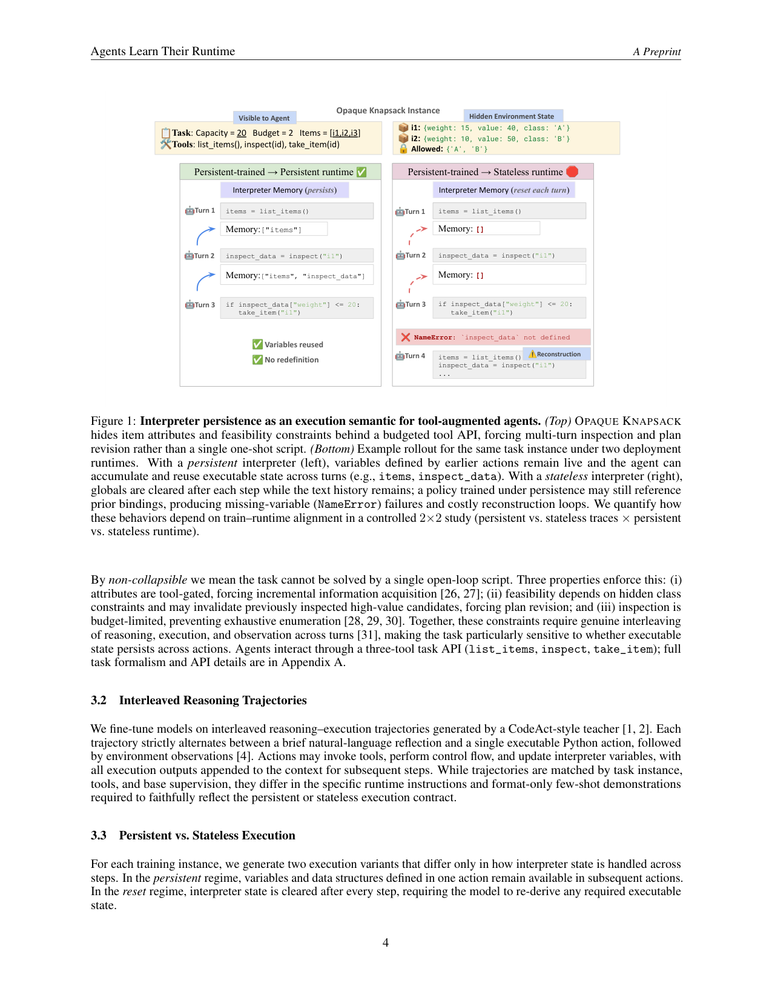
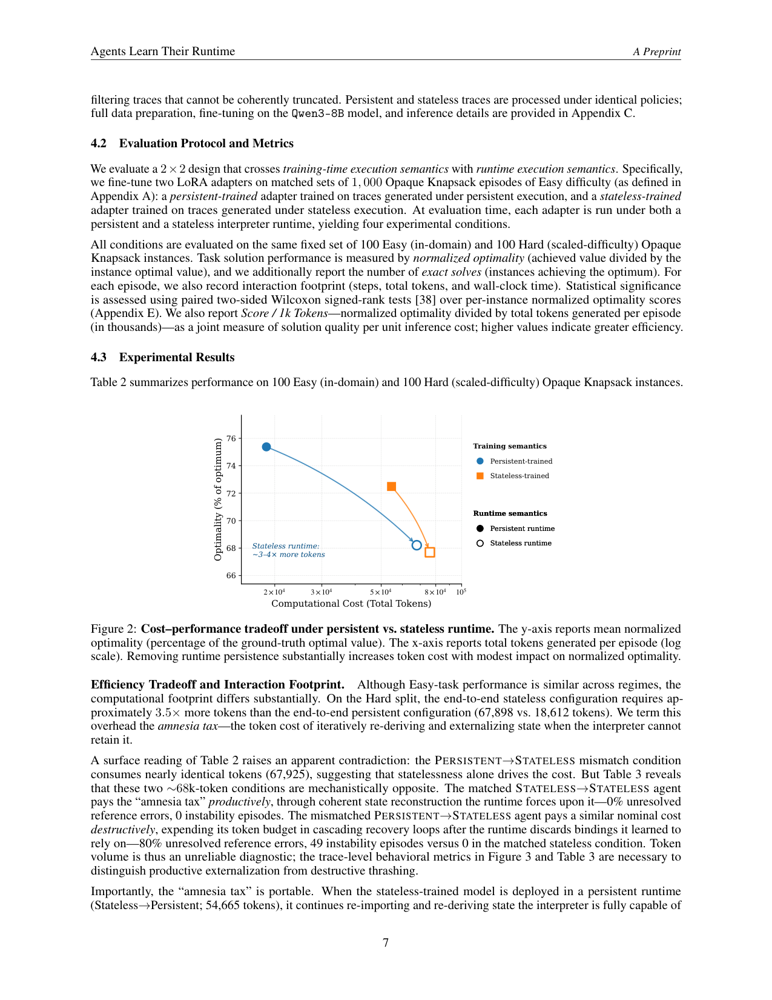

`agents_learn_runtime | Agents Learn Their Runtime: Interpreter Persistence as Training-Time Semantics | Ontocord · CMU · MPI-IS/Tübingen AI/ELLIS(Victor May 等) | Preprint, arXiv 2603.01209v2, 2026-03-05 | 主题线 L?(训练-推理对齐 / agent 微调数据语义)· 相关性 中-高`

> light 档笔记。基于真实 PDF 正文。三标注:【原文】【推断】【待核】。

══ 第一层:一眼看懂 [light] ══
- 🟦 **TL;DR**:【原文】很多 agent 框架(CodeAct 式)给模型配一个**跨轮持久的 Python 解释器**(变量会累积),但用来后训练模型的轨迹里往往没显式体现这点。本文问:解释器持久性到底只是"推理期脚手架",还是"训练数据的一种语义,会塑造模型怎么用解释器"?答案用一个干净的 **2×2 受控实验**给出:训练条件(在 persistent vs stateless 执行轨迹上 SFT)× 运行时条件(在 persistent vs stateless 解释器里评测),同一任务族、同一基座(Qwen3-8B)。提出 **OPAQUE KNAPSACK**(不可一脚本搞定的、部分可观测背包变体:属性藏在受预算限制的工具调用后)。结论:训练/运行时**错配会产生两种特征性失败**——persistent-训练却部署到 stateless 运行时 → ~80% episode 触发 missing-variable(NameError)、陷入级联恢复循环烧光 token;反向(stateless-训练→persistent 运行时)→ 交"健忘税(amnesia tax)",冗余地把状态重新写进文本,用 ~3.5×(训练数据层 >3×;eval 层 token 约 3 倍)token。关键:这些效率/稳定性代价**不伴随解的质量显著下降**(n=100 下 mean normalized optimality 无统计显著差异)——持久性塑造 agent"怎么"达到解,而非"能否"达到解。
- **最巧的一步**:【推断,依据 §2 + Fig1 + Table1/2】设计 OPAQUE KNAPSACK 这个"**non-collapsible**"环境——属性 tool-gated、可行性依赖隐藏类约束(会让先前高价值候选失效→逼迫改计划)、检查有预算上限。抽掉"不可一脚本解决"这条,任务就能被单段开环脚本搞定,持久 vs 无状态的差异被抹平,整个 2×2 对照失去敏感性。

══ 第二层:为什么做 ══
- **研究背景**:【原文 §1/§2】工具增强 LLM agent 越来越多以"自然语言推理 + 可执行 Python 动作"交替的方式解题(PAL/PoT/ToRA/CodeAct 谱系)。很多框架(CodeAct 式)给模型配一个**跨轮持久的 Python 解释器**(变量跨轮累积),但用来后训练这些模型的轨迹**往往不显式体现这一运行时假设**。
- **解决的具体痛点**:【原文 §1】模型常在"一种运行时下生成的轨迹"上微调,却被部署到"另一种运行时"。核心未解问题:解释器持久性到底只是"推理期脚手架(inference-time scaffold)",还是"训练数据的一种语义,会塑造模型怎么用解释器"?如果是后者,训练/部署运行时错配就会引入隐藏代价,而现有 pipeline 把它当"隐藏实现细节"——这是个**被忽视的训练-推理对齐缺口**。
- **相关工作 & 各自不足**:【原文 §2】(a) 可执行动作框架(PAL/PoT/ToRA/CodeAct/smolagents):证明代码动作有效,但**把解释器持久性当运行时实现细节**,不当训练变量;(b) agent 微调框架(FireAct/AgentTuning):证明在轨迹上 SFT 能灌入通用工具使用行为,但**没隔离"运行时语义"这个变量**;(c) 数据协议标准化(Agent Data Protocol):统一动作/观察 schema,仍不研究持久性的训练时语义;(d) imitation learning 文献:已知 BC 策略在分布漂移下会复合误差——本文把这条经典结论实证到"运行时分布漂移"这一具体场景。
- **动机链**:【原文 §1】现状=持久性被当运行时脚手架、训练轨迹不显式标注 → 缺陷=训练/部署运行时可能错配且无人量化后果 → 所以必须用一个**控制变量到极致的 2×2 实验**(只切换"解释器是否持久"、其余任务/prompt/工具/监督全固定)来证明"持久性是被学到的行为先验、必须对齐"。为什么不用更简单做法:观察真实 agent 轨迹无法隔离混杂因素,只有合成配对轨迹 + non-collapsible 任务才能让差异显形。
- **与最近邻的 Δ**:【推断,依据 §2】最近邻是 AgentTuning/FireAct 这类"在工具轨迹上 SFT"的工作。关键 Δ=**把"执行/状态管理语义"本身当成被研究的训练数据属性**(而非只研究任务/工具),并用配对轨迹把它从所有其他变量里抠出来。这个差异有用,因为它首次给出"persistence is learned, not zero-shot"的因果证据。

══ 第三层:怎么做 + 靠不靠谱 ══
- **方法流水线**:【原文 §2/§3】① 设计 **OPAQUE KNAPSACK**:部分可观测背包,物品属性与可行性约束藏在**预算受限的工具调用**后,每步交互有上限,逼迫迭代式信息收集 + 状态修订(non-collapsible);② **配对轨迹生成**:对每个任务实例,生成两条只在"解释器是否跨轮持久"上不同、其余(任务/prompt/工具接口/监督)全匹配的 interleaved reasoning-action 轨迹;③ **训练**:在 Easy 难度的 1,000 episodes 上各微调一个 **LoRA adapter**(persistent-trained vs stateless-trained),基座 **Qwen3-8B**;④ **2×2 交叉评测**:两个模型 × 两种运行时(persistent / stateless)= 4 组合,n=100 任务/split;⑤ 度量 normalized optimality(解质量)、token 消耗、失败模式分类。
- **逐组件必要性**:① **non-collapsible 任务设计**——没它任务可一脚本解,持久 vs 无状态差异被抹平(全文敏感性来源);② **配对轨迹(只切持久性)**——没它无法把"持久性"从任务难度/监督里隔离,因果性垮;③ **2×2 交叉**——没它只能看对齐情形、看不到错配的两种特征性失败;④ **结构化元数据均衡可观测性**——作者承认这是个混杂(见失效边界),用来让两种运行时观测性可比。本文**本身就是消融式设计**(变量隔离即消融),但作者明确未做"token-matched 训练预算"的消融(列为 limitation)。
- **关键机制/直觉**:【原文 §3】两种特征性失败的直觉:(a) **persistent-训练 → stateless-运行时**:模型学会"引用上一轮的变量绑定",但部署运行时每轮清空 → 触发 missing-variable / NameError,~80% episode 陷入"试图恢复→高错误密度循环→烧光 token 预算却无进展"(正是 imitation learning 在分布漂移下的复合误差);(b) **stateless-训练 → persistent-运行时**:模型学会"每轮把状态外化进文本重建",即便运行时本可保留也照样重算,交"健忘税"≈3.5× token。核心论断:**持久性塑造的是 how(怎么达到解),不是 whether(能否达到解)**——n=100 下解质量无统计显著差异。
- **实验与证据**:【原文 摘要/Table 1/2】训练数据层(Table 1):stateless teacher 轨迹 avg 55,516 token/episode vs persistent 18,337(>3×);eval 层(Table 2 Easy):SFT-Persistent-Persistent 19,648 token、24.8s,SFT-Stateless-Stateless 58,814 token、145.5s;Score/1k tokens 4.13 vs 1.39(对齐 persistent 效率约 3×);错配失败:persistent-训练/stateless-运行时 ~80% episode 触发 missing-variable。baseline 公平性:配对设计本身就是最公平对照(同基座同任务同监督)。"看着强但没回答核心问题"的点=**解质量差异不显著**,作者诚实把分数差异当 "directional" 而非结论。
- **假设与失效边界**:【原文 Limitations(四条)】① **评测功效不足**:n=100 足以暴露行为/效率巨变,但不足以判定绝对解质量差异;② **token 预算混杂**:训练集按 episode 而非总 token 匹配,stateless 模型见了 ~3.5× 原始文本,未做 token-matched 消融;③ **泛化范围**:单任务族 + 单基座(Qwen3-8B),跨模型/跨任务验证待补;④ **协议线索共现**:运行时提供了"上一步解释器符号"的结构化元数据来均衡可观测性,这与"纯持久性机制"未完全因子化分离。【推断】当任务可一脚本解、或模型规模/任务族改变时,"对齐只影响效率不影响质量"的结论可能不再成立。
- **祛魅总结**:【推断】真贡献(硬货)=一个干净到几乎无可挑剔的**控制变量实验 + non-collapsible 基准 + 配对轨迹 pipeline**,把"运行时语义须在训练时显式对齐"从直觉变成可量化证据(>3× / ~3.5× token、~80% 错配失败)。诚实之处:作者主动把质量差异降级为 directional、列了四条 limitation(尤其 token 混杂),不夸大。局限:**单任务族 + 单基座 + 无开源代码声明**,结论的普适性靠后续工作验证;这是一篇"精巧但范围窄"的实证 note,贡献在洞见而非可直接复用的方法。

══ 机制速览 6 轴 [light] ══
| 维度 | 内容 |
|---|---|
| 学什么信号 | 【原文】SFT 监督信号=teacher 生成的"成对轨迹"(同一任务、同 prompt/工具/监督,**仅切换解释器是否持久**);非 RL、非环境 reward。 |
| 改什么 | 【原文】改**模型参数**(对 Qwen3-8B 做 SFT,文中用 adapter/LoRA 式微调);研究对象是"训练轨迹的执行语义"这一数据属性,而非 harness 本身。 |
| 何时改 | 【原文】离线批量(SFT 后部署);本文核心恰是论证"运行时语义须在**训练时**作为显式设计选择,而非推理期隐藏实现细节"。 |
| 免梯度? | 【原文】否(SFT 微调,有梯度)。 |
| 记忆-技能生命周期 | 【原文】"记忆"=解释器持久命名空间里的变量绑定(items, inspect_data 跨轮存活);persistent 模型学会复用绑定,stateless 模型学会把状态外化进文本重建。无 skill 库/无淘汰共享机制(非本文范围)。 |
| 防遗忘机制 | 【原文】不适用(单任务族,不研究持续学习/灾难性遗忘);"健忘税"指的是无状态训练导致的**冗余重算**,非参数遗忘。 |

⑦ **开源代码 + 框架/harness**:【待核】正文/摘要页未见显式 GitHub 链接(p0–p3 无 Code: 行);属"benchmark + 训练数据生成 pipeline"贡献,代码是否开源**原文未在已读页明示**——按铁律标注未找到,不编造。训练=SFT on Qwen3-8B(具体框架原文未说明)。

💰 资源/成本:【原文】训练数据层(Table 1):stateless teacher 轨迹 avg 55,516 token/episode vs persistent 18,337(>3×);eval 层(Table 2,Easy):SFT-Persistent-Persistent 仅 19,648 token、24.8s,而 SFT-Stateless-Stateless 58,814 token、145.5s;Score/1k tokens 4.13 vs 1.39(对齐 persistent 效率约 3×)。规模:n=100 任务/split,基座 Qwen3-8B。

🎯 **对"探索-巩固"idea 对标** [light]:【推断】**支撑 + 可借视角**——它实证了"**训练时见过的执行/状态管理语义会被模型当作行为先验吸收并带到部署**"(persistence is learned, not zero-shot)。这直接呼应本项目"on-policy 蒸馏要让训练轨迹的环境语义与部署一致"的关切:若 teacher 轨迹的状态管理范式与 student 部署运行时错配,会引入 NameError 级联或健忘税。可作为"训练-推理对齐"必要性的硬证据,提醒 MTP/OPD 设计时把运行时语义当显式变量。

🖼 **关键图 top-2** [light]:

这是**原文 Figure 1**:一图说清"任务为何非一脚本可解 + 两种运行时下 rollout 的差异 + 错配如何产生 missing-variable 失败"——选它因为它把问题设定、核心机制、失败模式三合一,是理解全文的钥匙。

这是**原文 Figure 2(cost–performance tradeoff)**:核心发现的定量证据——质量不变、成本差 ~3×——选它因为它把"persistence 塑造的是 how 而非 whether"这一主张可视化。

【假设与失效边界一句】[light]:【推断,依据 §3 + Appendix E】假设结论建立在单任务族(OPAQUE KNAPSACK)+ 单基座(Qwen3-8B)+ n=100 的受控设定上,作者明确把分数差异当"directional"(无统计显著);当任务可一脚本解决、模型规模/任务族改变、或样本量不足以检出质量差异时,"对齐只影响效率不影响质量"的结论可能不再成立。
