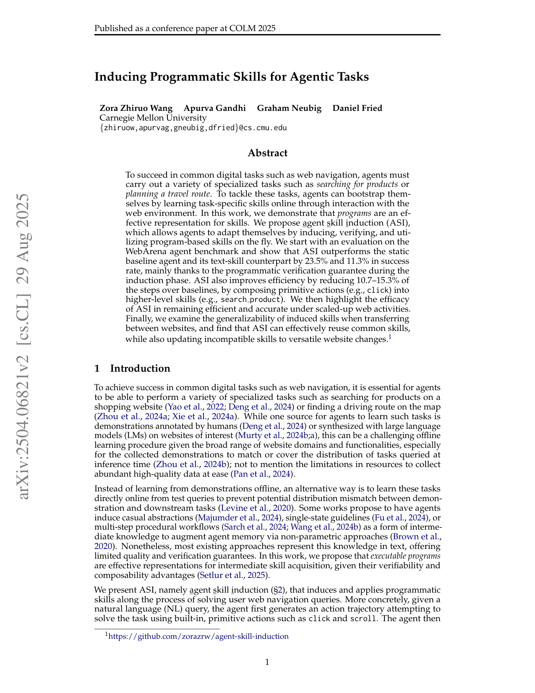
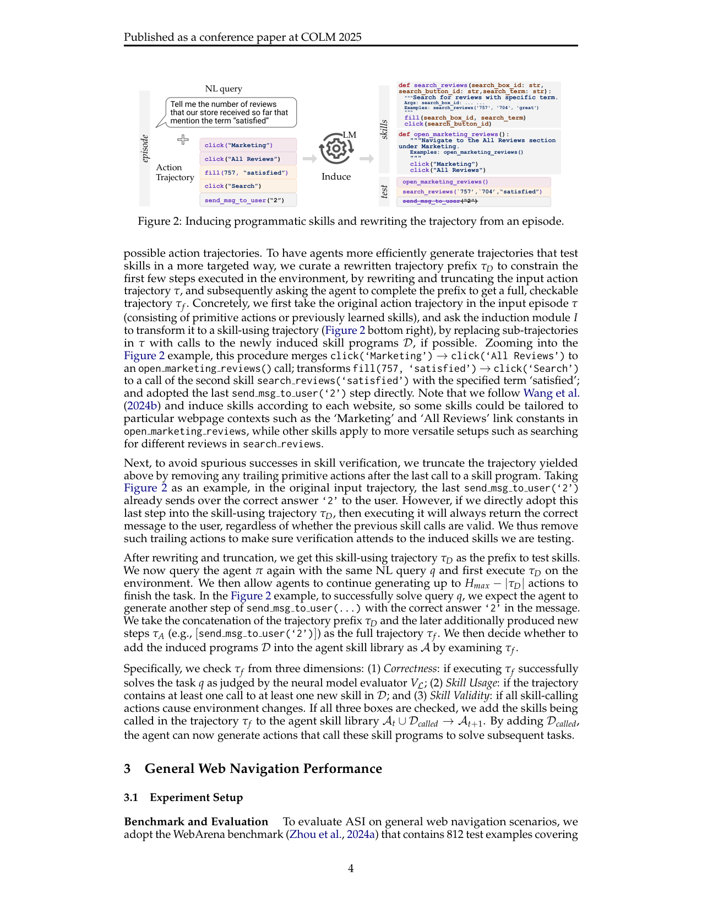

`asi_progskill | Inducing Programmatic Skills for Agentic Tasks (ASI = Agent Skill Induction) | Carnegie Mellon University (Zora Zhiruo Wang, Apurva Gandhi, Graham Neubig, Daniel Fried) | 2025-04(arXiv v2, 2504.06821, 29 Aug 2025)·COLM 2025 (conference paper)·v2 | 主题线 L?(技能归纳/在线自适应 web agent · skill 表示为可执行程序,免梯度)·相关性 High`

> 一句定位:在线 web agent 想从测试任务里"边做边学可复用技能",前人(AWM)把技能存成**自然语言文本**放进 memory 当软提示——质量参差、无法验证、无法组合。ASI 主张**技能应表示为可执行的 Python 程序**:agent 用原子动作(click/fill)解完一个任务后,把可复用片段**归纳成程序函数**(如 `search_product(box_id,query)`),并**重跑验证**(改写轨迹前缀→真执行→查 3 项:解对了吗/真调了新技能吗/技能调用真改变环境了吗),验证通过才把技能**加进动作空间**(而非 memory)供后续直接调用。可验证 + 可组合 → WebArena 成功率超 vanilla +23.5%、超文本技能 AWM +11.3%,步数省 10.7–15.3%;长程任务优势更大(+20.7–38.9%);跨站可复用通用技能、不兼容则快速改写。

---

## ══ 第一层:一眼看懂 ══

- 🟦 **TL;DR**:web agent 要完成"搜商品/规划路线"等专门任务,与其离线学人工/合成演示(易与推理时任务分布不匹配、采集贵),不如**在线**从测试 query 直接学。前人 AWM 让 agent 从成功轨迹归纳**文本工作流**塞进 memory 当参考——但文本技能**没有质量/正确性保证、粒度模糊、不能直接执行也难组合**。ASI 换了个表示:**技能 = 可执行程序**。流程:① agent 用内置原子动作(click/scroll/fill)试解 NL query 得动作轨迹;② LM 评估器判这条 episode 对不对,只在**判对的** episode 上归纳;③ 归纳模块把可复用子轨迹**包装成程序函数**(带 docstring/Args/Examples),并把原轨迹**改写成"用新技能的轨迹" τD**;④ **验证**:截断 τD(去掉最后一个技能调用之后的尾部原子动作,防"假成功")→ 用同一 query 重跑、先执行 τD 再让 agent 续完 → 查三项(Correctness/Skill Usage/Skill Validity);⑤ 三项全过 → 把被调用的技能加进**动作空间** A_t∪D→A_{t+1},后续任务可直接调。backbone 全用 claude-3.5-sonnet,框架 BrowserGym。

- **最巧的一步**:**"程序化技能 + 执行式验证(改写前缀τD→重跑→查三项)"这套验证闭环**。这是 ASI vs AWM 的命脉。消融 Table 3 把它拆开证明:在"都只放 memory"的前提下,仅仅把"未验证文本"换成"验证过的程序"(verified, program)就 +4.2 分(32.6→36.4);说明**验证带来的归纳质量提升**是真贡献。精妙在两点:(i) **程序天生可执行 → 可验证**(文本技能无从验证,只能信 LM 自报);(ii) **截断尾部原子动作**——若不截,原轨迹最后那句 `send_msg_to_user('2')` 总会把正确答案发出去,导致"不管前面技能调用对不对都判成功"的**伪成功**;截断后验证才真正考察被测技能。抽掉验证,ASI 就退化成"程序版 AWM",质量保证全失。

---

## ══ 第二层:为什么做 ══

- **研究背景**(§1):数字任务(尤其 web navigation)要 agent 会做各种专门子任务。学这些任务的一条路是**离线学演示**(人工标注 / LM 合成)——但 web 域广、功能杂,演示难覆盖推理时任务分布,且高质量数据采集贵。另一条路是**在线**从测试 query 直接学(避免分布不匹配)。在线学法多让 agent 归纳**中间知识**(因果抽象 / 单状态 guideline / 多步工作流)以**非参数**方式增广 memory。
- **解决的具体痛点**(§1–2.3):现有在线归纳法**几乎都用文本表示中间知识**——质量与验证保证有限。具体到 AWM 的文本技能(§3.3 实证,以购物站为例):① **冗余步骤多**;② **example-specific 上下文**(如某技能写死了找"game accessories",其实步骤通用);③ **任务边界模糊**(把"搜商品"和"加心愿单"混在一个技能里,问"搜商品并加购物车"时给不出最优指导)。且文本技能**无法执行 → 无法验证、无法组合复用**。
- **相关工作 & 各自不足**(§6):自适应 agent 大致两类——(a) **参数式**(SFT / 对比学习 / RL 把经验灌进参数,如 WebRL/PAE):算力大、且离线探索数据可能与下游分布不匹配;(b) **非参数式**(Reflexion 反思 / 原始经验 / AWM 工作流):省算力但**存的是文本**,质量/可验证性弱。技能发现领域有程序式(DreamCoder/TroVE/LILO 等"造工具")与具身式(Voyager/Code-as-Policies),但 web 场景多靠**离线 RL rollout 或 LM prompting 探索**,代价大。ASI 定位:**非参数 + 程序表示 + 在线、无需离线探索、无需监督数据**。
- **动机链**:在线学避免分布不匹配 → 但前人在线归纳用文本、无质量保证、不可组合 → 程序表示**可执行 → 可验证(查正确性)+ 可抽象组合(原子动作→高层函数,省步数)** → 把验证过的程序放进**动作空间**(可直接调用执行)而非 memory(只能当文本参考)→ 在线归纳-验证-复用闭环。为什么不用更简单法:文本技能(AWM)不可验证不可执行;参数式(SFT/RL)算力大且需离线探索数据。
- **与最近邻 AWM 的 Δ**(§2.2–2.3):AWM 把技能存为**自由文本**,只能 M_t∪{d}→M_{t+1}**增广 memory**(Fig.1 top);ASI 把技能存为**可执行 python 程序**,直接 A_t∪{d}→A_{t+1}**整合进动作空间**(Fig.1 bottom)。两个关键差异(§3.3 拆解):[1] 归纳结果**是否经执行验证**;[2] 技能是**只放 memory 当参考**还是**放动作空间可执行**。消融证明两者都重要(见下)。

---

## ══ 第三层:怎么做 + 靠不靠谱 ══

- **方法流水线**(§2,Fig.1/2):
  1. **问题设定**(§2.1):LM agent 策略 π_L(·|M,A)=LM 主干 L + memory M + 技能库 A(M、A 都作为输入上下文)。在线设定:一串 NL query Q={q_1..q_N},**无演示轨迹、无 ground-truth reward**。每任务生成轨迹 τ,observe-act 循环到终止或 H_max。episode e=(q,τ);跨 episode 可更新 M、A 并复用。
  2. **筛正确 episode**(§2.2):无 GT reward,用 **LM 评估器 V_L(e)→0/1** 过滤出判对的 E_V,**只在 E_V 上归纳**。
  3. **清洗输入**(§2.3):去掉执行报错的步骤(无效参数等);用 LM 把 agent 每步冗长的 thought 压成一句话(87.9→13.4 token/步),避免干扰归纳。
  4. **归纳程序技能**(§2.3,Fig.2):归纳模块 I 对清洗后的 episode 产出一个或多个**程序函数**(带 docstring/Args/Examples,如 `open_marketing_reviews()`、`search_reviews(box,btn,term)`)。**按网站归纳**——有些技能含站点专属常量('Marketing'/'All Reviews' 链接),有些更通用(search_reviews)。
  5. **改写轨迹前缀 τD**(§2.3,**验证关键**):把原轨迹中可替换的子轨迹**替换成对新技能的调用**(click(Marketing)→click(All Reviews) 合成 open_marketing_reviews();fill+click(Search) 合成 search_reviews(...));得"用技能的轨迹"。**再截断**——删掉最后一个技能调用之后的尾部原子动作(防 `send_msg_to_user('2')` 这种"总会发对答案"导致的伪成功)。
  6. **执行式验证**(§2.3):用同一 query q 重跑,**先在环境真执行 τD**,再让 agent 续生成 ≤H_max−|τD| 步补完 → 全轨迹 τ_f=τD⊕τ_A。查**三维**:(1) **Correctness**(V_L 判 τ_f 解对 q)、(2) **Skill Usage**(τ_f 至少调了 D 中一个新技能)、(3) **Skill Validity**(所有技能调用都真改变了环境)。**三项全过** → 把被调用技能 D_called 加进动作空间 A_t∪D_called→A_{t+1}。
  7. **复用 / 跨站适配**(§5):后续任务可直接调技能;到新站若技能不兼容(如 sort_listings 在 OneStopMarket 是下拉、在 Target 是侧栏),agent 多能**察觉并避开**废弃技能,并**在线改写/新建**技能(+update)。

- **逐组件必要性**(消融 Table 3,购物站 SR,4 个设置):
  - (unverified, text)=AWM 基线 **32.6**;
  - **(verified, program) 放 memory** → **36.4(+4.2)**:**仅"加执行验证"就涨**(隔离出归纳质量的贡献);
  - **(verified, text) 放 memory** → **39.0(再 +2.6)**:程序格式**不适配 memory**(agent 常想调 memory 里的程序却调不动,因 memory 不支持执行)——转成文本反而更顺;
  - **(verified, program) 放动作空间 = 完整 ASI** → **40.1**:程序**该放动作空间**(可执行)才最优。
  - 结论:**[1] 验证**(质量)与 **[2] 放动作空间可执行**(actuation)两者**都必要且互补**——文本宜 memory、程序宜动作空间。消融设计干净,正好拆解 ASI vs AWM 的两个差异维度。

- **关键机制直觉**:把"学技能"变成"**写一个经过单元测试的函数并加进 API**"。① 程序 = 高层动作接口,一次调用顶多步原子动作 → agent 规划更易、步数更少、长程任务不被低层细节绊住(Fig.3 改地址案例:vanilla 50 步耗尽、AWM 27 步、ASI 仅 4 步,缩短 85.2%)。② 执行验证 = 不信 LM 自报、用环境真跑来背书技能质量(截断尾部防伪成功是点睛)。③ 放动作空间 vs memory 的区别:memory 里的程序 agent"想调调不动",动作空间里的才真能执行——这解释了为何 verified-program 必须进动作空间。

- **实验与证据**(§3–5):
  - 数据集/设置:**WebArena**(812 任务,5 域:电商/论坛/软件开发/内容管理/旅行;**程序式评估器**给二值 0/1,功能正确性,较严格)。backbone **claude-3.5-sonnet**(策略 π/评估器 V/归纳 I 全用它);框架 **BrowserGym**(accessibility tree 作观测)。基线:vanilla Claude(静态)+ **AWM**(当前最强在线自适应,为公平也换 claude-3.5 + 同样清洗)。
  - **支撑核心主张的关键实验**:① **WebArena 主表 Table 1**——ASI SR 40.4(vanilla ~12–32.7、AWM 36.3),超 vanilla **+23.5%**、超 AWM **+11.3%**,步数 5.0(省 vanilla 15.3%、AWM 10.6%);各站(Shop/Admin/Reddit/GitLab/Maps)普遍领先。② **归纳质量拆解 Table 3**(见上)——证"验证"与"放动作空间"各自的贡献。③ **长程放大任务 Table 4**——5 域,ASI SR 远超(Shopping 100% vs AWM 68.3%、Map 100% vs 65%),步数大降(Map 6.2 vs vanilla 15.2);**全部统计显著(|t|>2, p<0.05)**;平均超 vanilla/AWM **+38.9%/+20.7%** SR。④ **跨站迁移 Table 6**——真实站(Target/Reddit/Google Maps),ASI 多数 SR/步数最优(Shopping 90%/3.4 步),+update 进一步;通用技能(search_product)可迁,不兼容技能(sort)能察觉避开并改写。
  - **baseline 公平性**:相对 AWM 做了**同 backbone + 同清洗**的公平对照,且消融把"验证/格式/放置"正交拆开——**方法学诚实度高**。**潜在不公/需注意**【推断】:(a) 长程放大任务(Table 4)是作者**自构 case scenarios**(非标准 benchmark),且数量小(每域几例),虽报了显著性但样本量有限;(b) 跨站(Table 6)每对站仅 **10 个信息检索类 query**(避隐私/不可逆操作),覆盖窄;(c) 评估器 V_L 用同一 claude-3.5,WebArena 主表用程序式评估器较可靠,但归纳筛选用的 V_L 仍是 LM,可能有偏。依据:§4 "we curate several case scenarios"、§5 "ten queries"、§3.1 程序评估器。
  - **"看着强但没答核心问题"风险**【推断】:程序技能**通过验证的比例不高**——ASI 归纳的程序仅 **15.6% 的 turn 通过验证**(AWM 文本技能 31.4% 被加入)(§3.3)。即"高门槛验证"导致**入库技能少**,ASI 是"少而精",但也意味着大量归纳尝试被丢弃(算力开销)。这点作者如实报告。依据:§3.3 "pass verification for only 15.6% of the turns"。

- **假设与失效边界**:
  - 【原文 §7】作者自列待研:**技能的合适粒度**(概念/经验上)、**在线演化过程的稳定性**、与人类专家期望相比的技能质量。
  - 【原文 §5】**技能跨站不兼容**是真实挑战(sort 在 Target 失效);靠 agent 察觉 + 在线改写缓解,但**新站初期仍需重新归纳/改写**(+update 才补回)。
  - 【推断】**非参数、能力不进参数**——技能住在动作空间(程序)+ memory,强依赖 backbone LLM 的**代码生成 + 调用能力**(故全用 claude-3.5 这种强模型);弱模型可能归纳不出可执行程序。依据:§2.2 "instead of updating parameters"、backbone 全 claude-3.5。
  - 【推断】**验证依赖环境可重跑 + 可观测状态变化**(Skill Validity 查"是否改变环境")——这套在 web(确定性 DOM、可重放)成立,在**不可重置/随机性强的环境**(真实 web 状态会变、不可逆操作)难直接套。依据:§5 明确避开"购买/改密码"等不可逆/有风险操作。

- **祛魅总结**:
  - 真贡献(硬货):① **明确论证"程序 > 文本"作为 agent 技能表示**,并用**正交消融(验证×格式×放置,Table 3)**把"为什么更好"拆得很清——这是方法学上的硬货,后续 PolySkill/SkillWeaver 等都建在此之上;② **执行式验证 + 截断防伪成功**是一个干净、可迁移的"技能质量门"机制;③ **程序技能带来真实的步数/规划收益**(Fig.3 改地址 50→4 步,长程任务 +38.9% SR),且**在线、无需离线探索/监督数据**,落地友好;④ 开源(github.com/zorazrw/agent-skill-induction)+ BrowserGym + WebArena,COLM 2025 录用,可复现性高。
  - 包装/营销成分【推断】:(a) "+23.5%"(vs vanilla)是相对**无自适应的静态基线**,真正同类对比(vs AWM)是 **+11.3%**——后者才是公平增量;(b) 长程任务"+38.9%"与跨站结论建立在**小样本自构场景**上,泛化结论需谨慎;(c) 程序验证通过率仅 15.6%,"少而精"也意味**归纳-验证的算力浪费**(大量尝试被丢),论文未量化这部分开销;(d) 全程**不改参数**,"agent 自适应/自改进"更准确说是"在线扩充可执行技能库 API",不是模型能力本身进化。依据:Table 1 vs AWM、§4–5 小样本、§3.3 15.6%、§2.2 非参数。

---

## ══ 结构化抽取 ══

- 🎯 **机制速览 6 轴**:

| 学什么信号 | 改什么 | 何时改 | 免梯度? | 记忆-技能生命周期 | 防遗忘机制 |
|---|---|---|---|---|---|
| **任务正确性**(LM 评估器 V_L 判 episode 对错,无 GT reward)+ **执行验证三维**(Correctness/Skill Usage/Skill Validity);**无人类标注/无 RL reward/无 teacher logits** | **改技能库 A**(归纳可执行程序技能并加进**动作空间**)+ 改 memory M;**LM 主干参数完全不改** | **在线 per-episode**(每个判对的 episode 后归纳-验证-入库);跨 episode 复用;新站 +update 时在线改写 | **是(纯免梯度/非参数)**——全靠 LM prompting 归纳程序 + 环境执行验证 + 检索调用,无梯度更新 | **写入**=判对 episode → 归纳程序 → 改写τD+截断 → 重跑验证三项全过 → 加入动作空间;**检索**=程序作为可调用动作放进 A 的输入上下文;**遗忘/淘汰**=几乎不删,但跨站**不兼容技能 agent 主动察觉避开** + 可在线改写(+update);**共享**=通用技能(search_product)跨站迁移,站点专属技能(含 UI 常量)需改写 | **隔离(库级/非参数)**:技能是独立程序函数,新增不覆盖旧函数;不兼容时改写/新建而非破坏旧的 → 天然抗遗忘(因不训参数,遗忘本就轻);**无参数级机制** |

- ⑦ **开源代码 + 框架/harness**:**已开源** https://github.com/zorazrw/agent-skill-induction(第 1 页脚注 1 明示;COLM 2025 录用)。**框架/harness = BrowserGym**(de Chezelles 2024,web agent 研究生态,accessibility tree 作观测,§3.1 明示),用 WebArena 默认动作空间(§A Table 7:click/fill/scroll/select_option/goto 等)。**无 RL/训练框架**(纯非参数 prompting);backbone claude-3.5-sonnet。【原文 脚注 + §3.1】

- 💰 **资源/成本与可扩展性**:**无训练成本**(非参数,不改 LM 参数)。主要成本 = claude-3.5-sonnet 的 API 调用——每 episode 含:任务执行 + episode 评估(V_L)+ episode 清洗(压 thought)+ 技能归纳(I)+ **验证重跑**(改写τD后真执行 + 续完)。**验证重跑是额外开销**,且程序通过率仅 15.6%(大量归纳被丢弃)。收益侧:步数省 10.7–15.3%(长程更多)直接降推理调用。原文未给总 token/美元成本。【原文 §3.3 + 推断】

- 🎯 **对"探索-巩固(TSRD/MTP+OPD)"idea 对标**:**可借组件 + 互补(非直接竞品;且是 polyskill 的母体)**。
  - **可借组件(核心)**:① **执行式验证三维门(Correctness/Skill Usage/Skill Validity)+ 截断防伪成功** —— 可直接迁到 TSRD 的 **path-recovery 技能巩固**:把"恢复策略"做成可验证单元,只有"真用了该恢复路径 + 真解对 + 真改变了状态"才纳入,**避免把'碰巧对'的伪恢复巩固进去**(对你"巩固阶段不能学坏"极对症)。② **改写轨迹前缀 τD 当受控验证 prefix** —— 与你 GRPO/step 切分调研里"prefix 续写正确率"的思路同构,可作"在关键步接管后验证恢复是否有效"的现成机制。③ **"程序 > 文本"的表示论 + 正交消融范式**(验证×格式×放置)——方法学上可借来论证你某设计选择的必要性。
  - **互补/缺口**:ASI **纯非参数、能力不进参数**(技能=动作空间里的程序),**无 OPD 蒸馏、无 MTP 前瞻、无参数级巩固**;你的 TSRD 核心是把能力**蒸馏进权重**(OPD)+ MTP 前瞻。所以 ASI 可作 TSRD 的**外部可验证技能层 / 巩固质量门**,而"巩固进参数"由 OPD 完成。它的"非参数防遗忘"对你不直接适用(你训参数,需真正的 KL/merge/隔离)。**谱系提示**:本批 polyskill 正是建在 ASI 的归纳-验证管线上加多态抽象——ASI 是这条"程序技能"线的奠基。

- 🔭 **开放问题/未来方向**:
  - 【原文 §7】(a) 技能的**合适粒度**(概念/经验);(b) **在线演化过程的稳定性**;(c) 技能质量 vs 人类专家期望的差距。
  - 【推断】(d) 验证通过率低(15.6%)→ 如何**降低归纳-验证的算力浪费**(更高效的技能候选生成 / 更便宜的验证);(e) 跨站不兼容技能的**自动重构/参数化**(减少新站重学,polyskill 的多态抽象正是此方向的后续);(f) 与**参数级学习结合**——把验证过的程序技能蒸馏进权重,脱离对强 backbone 的依赖、并实现真正的能力内化(连向 OPD/TSRD)。依据:§3.3 15.6%、§5 不兼容、§6 参数 vs 非参数权衡。

- 🖼 **关键图 top-2**:

  
  这是**原文 Figure 1**(第 1 页,图在右栏):对比两种在线自适应范式——**上**(AWM):从经验归纳**文本技能**加进 **memory** 当参考;**下**(ASI 本文):agent 用原子动作(fill/click)解任务 → **归纳程序函数** `def search_product(box_id,query): click;fill;keyboard_press('Enter')`(带 docstring/Examples)→ **test 验证 → add** 进**技能库/动作空间** → 后续直接 `search_product('595','Macbook')` 调用。选它因为一图说清全文最核心的范式差异:技能表示从"memory 里的文本"变成"动作空间里可执行、可验证、可组合的程序"。

  
  这是**原文 Figure 2**(第 4 页):一个真实 episode——NL query "数有多少条评论提到 satisfied" → 原子动作轨迹 click(Marketing)/click(All Reviews)/fill(757,satisfied)/click(Search)/send_msg → **Induce skills**(LM 产出 `open_marketing_reviews()` 与 `search_reviews(box,btn,term)` 两个程序函数)→ **test**:把原轨迹**改写成用技能的轨迹** open_marketing_reviews()→search_reviews(...)→send_msg。选它因为它是方法主图,具体展示"从成功轨迹归纳程序技能 + 改写轨迹以做执行验证"这一 ASI 最关键的归纳-验证步骤如何运作。
