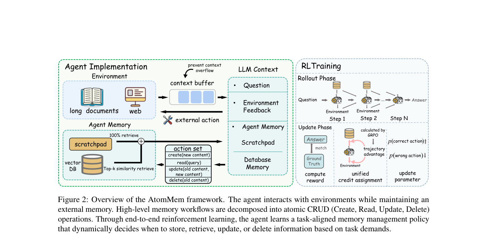
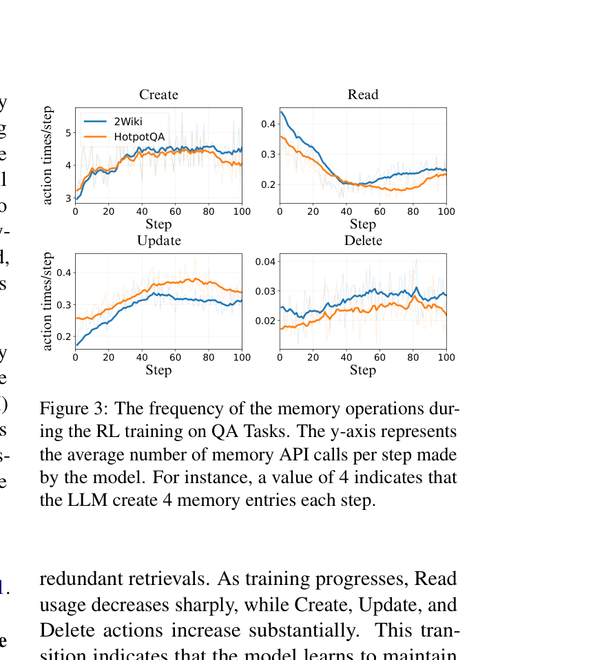

`atommem | AtomMem: Learnable Dynamic Agentic Memory with Atomic Memory Operation | 中国人民大学(RUC) · 清华大学（Yankai Lin 组）| 2026-01 首发·arXiv v3(2026-03-27)·cs.AI | 主题线 L?（RL 学记忆操作 = "把记忆管理当可学决策、用 RL 训练原子操作"线）· 相关性 High`

> 三标注约定：【原文】= 论文明说；【推断】= 我的有据判断(附依据)；【待核】= 拿不准的关键事实。

══ 第一层：一眼看懂 [light] ══

- 🟦 **TL;DR**：现有 agent 记忆机制几乎都是**专家手写的固定 workflow**(每步都更新、按预定遗忘曲线丢弃),"一刀切"——在任务 A 能保住关键信息,换到任务 B 就失效。AtomMem 把记忆管理**重构成一个序贯决策(POMDP)问题**:不给模型现成的高层记忆工具,只给**最原子的 CRUD 四个操作**(Create/Read/Update/Delete),让模型在每个环境步里**自己决定调哪些、调几次**,再用 **GRPO(纯 on-policy,只给任务级终局奖励)**端到端训练出一个"任务对齐"的记忆策略。在 3 个多跳长文 QA(HotpotQA/2Wiki/MuSiQue,200→800 文档 NIAH)+ 2 个 web(GAIA/WebWalkerQA)上,同 Qwen3-8B backbone 比静态 workflow 方法稳超约 3-8 个点,RL 后平均涨近 9 个点。【原文 Abstract/§1/§4】
- **最巧的一步**：**只暴露原子 CRUD、把所有高层记忆工具都拆成 CRUD 的组合**(§3.2),再加**"把任务级 advantage 均匀分到所有 token(含记忆操作 token)"**(§3.4 Eq.9 后)。前者保证了完备性(任何记忆状态都可达)+ 最小性(CRUD 不能再拆)+ 任务无关性;后者让"记忆操作"和"任务作答"在同一个 RL 目标里**联合优化、无需外部模块/中间奖励**。抽掉"只给原子操作"这一前提,方法就退回成"又一个手工记忆工具集";抽掉"advantage 均布到记忆 token",记忆操作就拿不到学习信号。

══ 第二层：为什么做（写透） ══

- **研究背景**：让 LLM agent 完成长程复杂任务是产学共同目标,而记忆机制是关键瓶颈。当前主流记忆机制依赖**静态、专家手写的 workflow**——记忆操作被限制在预定义 pipeline 里,不是模型自主决定。【原文§1】
- **解决的具体痛点**：核心是"**隐式的 one-size-fits-all 假设**"——固定记忆规则在通用场景能用,复杂环境就崩。例:指数遗忘 schedule 可能**过早丢掉长程推理里早期却关键的线索**(Fig 1:同一静态 workflow 在 Task A 保住了关键信息、在 Task B 却 Forget 掉了)。为 QA 设计的记忆架构很难迁移到与外部环境交互的 agent 任务。【原文§1, Fig 1】
- **相关工作 & 各自不足**(分类很清楚):
  - **静态记忆 workflow**:① 模仿型(MemoryBank 类比人类记忆、MemGPT 类比计算机内存);② 先验型(ChatDB/SCM 等专家手工 workflow)。共同短板——**workflow 被专家写死,无法按任务自适应**。
  - **RL 用于 agent 记忆**:① **摘要型**(MemAgent / Mem1 用 step-wise 覆写摘要)——覆写理论上能模拟任意原子操作,但被锁死在"每步必更新"例程,忽略信息密度、数据稀疏时也强行冗余更新;② **启发式工具型**(Memory-As-Action / AgentFold 引入 context pruning/folding 工具)——有一定动态控制,但**工具设计本身重度依赖人工先验**。
  - AtomMem 的差异:**只给最原子的 CRUD**,更纯粹地体现"memory-as-decision-making"。【原文§2】
- **动机链**：长程任务靠记忆→现有记忆是专家写死的固定 workflow→一刀切规则在复杂/变化任务上失效(过早遗忘关键线索)→所以要让模型自主决策记忆→但若给高层工具又会引入人工先验→不如**拆到最原子的 CRUD**(完备+最小+任务无关)→用 RL 让模型在交互中学到"何时 create/read/update/delete"的任务对齐策略。【原文§1/§3.2】
- **与最近邻工作的 Δ**：与 **Memory-R1(Yan et al. 2025)** 和 **MemAgent/Mem1** 最像(都用 RL 训记忆)。关键差异:① 对 MemAgent/Mem1——它们是"每步必覆写摘要"的**强制例程**,AtomMem 是**自主选择**调不调、调几次 CRUD;② 对 Memory-R1——Memory-R1 在**对话多会话**场景训 {ADD/UPDATE/DELETE/NOOP} 且**分两个 agent 分训**,AtomMem 在**长文 QA + web agent**场景、**单一 agent 端到端**学 CRUD 且**显式建模 POMDP + 任务级终局奖励均布到所有 token**。这差异有用是因为:把记忆操作和任务执行放进同一条轨迹同一个 RL 目标,能学出 read 频率随训练下降、create/update 上升的"任务对齐"模式(Fig 3),而非固定例程。【推断,依据§2 对 MemAgent 的批评 + §3.4 + Fig 3;Memory-R1 对比依据 §4.1 多问题设定引用 Yan et al. 2025】

══ 第三层：怎么做 + 靠不靠谱 ══

- **方法流水线（POMDP + GRPO,对应 Fig 2）**：
  1. **POMDP 建模(§3.1)**：状态 \(s_t=(s^{env}, s^{mem})\) 含外部环境 + 内部记忆;动作 \(a_t=(a^{env}, a^{mem})\) 联合"任务执行(如 search)"和"记忆管理(CRUD)";记忆**不完全可观测**——\(o^mem\) 取决于之前的 Read 动作(记忆访问本身是显式决策变量);记忆是"环境的一部分",每个任务开始时 reset(不跨任务积累经验)。
  2. **动作空间=原子 CRUD(§3.2-3.3)**：\(A_mem={Create, Read, Update, Delete}\)。每个决策步生成一串记忆动作(组合成单个环境步内的"宏动作"),非 Read 操作顺序执行得到组合转移 \(M_{t+1}=a^Kt∘…∘a^1(M_t)\)。
  3. **混合检索(§3.3)**：**确定性检索**——一个特殊 scratchpad 条目每步必取(存全局任务状态);**选择性检索**——agent 生成查询 q_t,按语义相似度 Top-K 取相关条目。content 按重要性分流:关键信息进 scratchpad,潜在有用的进 vector DB(FAISS)。
  4. **GRPO 优化(§3.4)**：记忆操作被实现为**词表里的结构化 token**(XML 标签),优化输出序列似然即隐式优化记忆策略。用 GRPO,**只给任务级终局奖励**(QA 用 EM,web 用 LLM-as-judge),advantage \(A_i=r_i−mean(r)\)(**跟 Dr.GRPO 一样不做标准化**),再**均匀分到轨迹所有 token(含记忆操作)**,KL 正则防漂移。**纯 on-policy:每个 rollout 只用一次更新**。
- **逐组件必要性（消融 Table 2 / Fig 4，括号为相对降幅）**：
  - **去 Update**:HotpotQA −6.4 / 2Wiki −4.9 / MuSiQue −7.2 → "选择性修订旧记忆"对维持准确紧凑表示**关键**(虽然 Update 频率绝对值低,但"critical few")。
  - **去 Delete**:仅 −0.2~−1.3 → 在当前**信息累积型、事实不冲突**的任务里删除不太重要;但附录 C 把记忆容量限到 20 条后,Update/Delete 重要性显著上升(Fig 6)——证明 Delete 的价值是**任务条件相关**的。
  - **去 scratchpad**:−6.0~−11.2;**去 storage**:−8.6~−40.4(2Wiki 暴跌 −40.4);**两者都去**:−52.2(灾难)。scratchpad-only / storage-only 变体都明显低于 full → scratchpad 与外部存储**结构性互补、不可相互替代**。
  - **超参**(Table 3):检索数 K 要匹配任务跳数(评测基准 2-4 跳,K=6 够;K=3 掉、K=12 无明显增益);chunk size 鲁棒(base 模型长上下文能力强)。**embedding**(Table 4):学习型 embedding 比随机选平均高 7.4 点,且 Qwen3-embedding 0.6B→4B→8B 单调变好(66.5/67.2/68.2)。**消融非常充分**。
- **关键机制直觉**：核心不是新算法,而是"**把记忆管理降维成 CRUD 决策 + 用任务成败这一个标量信号去训**"。直觉:与其让人猜"什么时候该忘",不如让模型在"答错就扣分"的压力下自己摸索出 read 少用、create/update 多用的节律(Fig 3)。"advantage 均布到记忆 token"= 把"这步记忆操作好不好"的信用直接绑到"整条轨迹答对没"。
- **实验与证据**：
  - **数据集**：长文 QA = HotpotQA / 2WikiMultiHopQA / MuSiQue,按 RULER 构造 NIAH 式长上下文(训练 200 文档≈28K token,测试扩到 800 文档≈112K token),并按 MEM1/Memory-R1 加"多问题同时给"难度;web = 在 **Asearcher** 数据集训练,在 **GAIA / WebWalkerQA** 评测(配 Google search + Jina Reader 两个外部工具,每任务最多 40 次 web 调用)。【原文§4.1】
  - **支撑核心主张的关键实验 = Table 1**:AtomMem avg 58.8,超 MemAgent(56.7,另一个 RL 记忆范式)、A-Mem(51.4)、Full Context(46.0)、Mem0(24.2);**800 文档(4× 训练长度外推)仍保持领先**——证明学到了抗信息过载的 content-aware 策略。**RL 净增**:AtomMem w/o RL 50.3 → 加 RL 58.8,涨 ~8.5 点。
  - **训练动态(Fig 3,论文的招牌发现)**:RL 训练中 Read 频率急降、Create/Update/Delete 升;**任务条件变了(容量受限,Fig 6)频率走势完全不同** → 证明"有效记忆控制来自学到任务对齐的模式,而非固定策略"。
  - **效率(Table 6)**:AtomMem 97.6 s/task、10.9 次 LLM 调用——比 Mem0(247.8s/12.9 calls/88.6 retrieve)、Generative Agents(416s/375 calls)、A-Mem(662s/400 calls)**快得多**(因为别的 workflow 每个输入多次串行调 LLM);比 MemAgent(49.7s)略慢(多工具 prompt 更长 + DB 组件)。
  - **baseline 公平吗**:【原文】MemAgent 用**同样超参和随机种子**重训;所有方法同 Qwen3-8B,RAG/Full-Context 实现见附录 → 较公平。
- **假设与失效边界**：
  - 【原文 Limitation】① RL 训练**算力重**——训到收敛约 **2-3 天 / 8-GPU 集群**,扩到更长程/更噪声任务会成瓶颈;② **信用分配粗**——任务级 advantage 均布到所有动作,缺"衡量每条记忆对成功贡献"的精细方法(作者明说没探索,因为给单一下游任务发明新 RL 算法没必要、且精确评估每条记忆价值非平凡)。
  - 【原文】记忆**每任务 reset、不跨任务积累经验**(§3.1 明确区分于 ExpeL/Memp 那类跨任务经验记忆)。
  - 【推断】当前结论建立在**信息累积型、事实非冲突**的任务上(所以 Delete 不重要);冲突/动态更新密集的任务上行为会变(附录 C 容量受限实验已侧证);依据:§4.6"largely information-accumulation tasks with non-conflicting facts"。
  - 【推断】依赖 Qwen3-8B 这类**强长上下文 + 强指令遵循**的 base 模型(chunk size 鲁棒性归因于此);弱 base 下未验证。依据:§4.6 对 chunk 鲁棒性的归因。
- **祛魅总结**：
  - **真贡献(硬货)**：① **POMDP + 原子 CRUD + 任务级 GRPO** 这套"memory-as-decision-making"的形式化干净且自洽(完备/最小/任务无关三性质论证有说服力);② **训练动态分析(Fig 3 + 容量受限 Fig 6)**是真正有信息量的实证发现——揭示了"任务对齐的记忆操作节律"而非只刷分;③ 效率对比(Table 6)实在,说明少调 LLM 是省时间的关键。
  - **包装/营销成分**【推断】:"learnable/dynamic/autonomous"反复强调,但**信用分配仍是最粗的任务级均布**(作者自己也承认),离"精确学每条记忆价值"还很远;"task-aligned policy"的证据主要是**操作频率曲线**,而非因果性消融到"具体哪条记忆操作救了哪道题"。依据:Limitation 自承 + Fig 3 是频率统计。
  - 作者**诚实**地标注了算力成本和信用分配局限,未过度吹嘘(可信度加分)【推断】。

══ 结构化抽取 ══

- 🎯 **机制速览 6 轴** [light]：

| 学什么信号 | 改什么 | 何时改 | 免梯度? | 记忆-技能生命周期 | 防遗忘机制 |
|---|---|---|---|---|---|
| **环境 reward(任务级终局奖励:QA=EM / web=LLM-judge,无中间奖励)** | **模型参数**(GRPO 微调 Qwen3-8B 策略,记忆操作=词表里的结构化 XML token) | **离线批量 RL 训练**(纯 on-policy,每 rollout 用一次更新);推理时 CRUD 是 **per-step 在线**执行但参数冻结 | **否**(梯度 RL:GRPO,Dr.GRPO 式不归一化 advantage,均布到所有 token) | 写入=Create→检索=Read(scratchpad 确定性 + 向量选择性 TopK)→修订=Update→淘汰=Delete;**每任务 reset,不跨任务积累** | **学习层面**=GRPO 的 KL 正则防策略漂移;**记忆层面**=无预定遗忘曲线,靠学出的 Update(修订)/Delete(去冗余)动态维持紧凑记忆;**无几何共识/merging/参数隔离** |

- ⑦ **开源代码 + 框架/harness**：【原文 论文头明写】Project: `https://github.com/RUCBM/AtomMem`。**框架=Verl(HybridFlow, Sheng et al. 2025)**——【原文 Table 7 RL 超参表明写 "Training framework: Verl"】(注:Table 7 经 pdftotext 抽取后列错位,但"Verl/A800/GRPO/Qwen3-8B/Rollout Group 16/lr 1e-6/Clip High 0.28/KL 0/entropy 0.2/seed 42"可逐项辨认还原)。底层存储用 **FAISS** 向量库,embedding 用 **Qwen3-embedding-0.6B**。〔注:本子代理仅深读抽取,未 clone 核验仓库可达性/框架文件——代码链接已记,clone 留 P3/主控〕
- 💰 **资源/成本与可扩展性**：【原文 Limitation + 附录 A/Table 6】训练到收敛 **~2-3 天 / 8-GPU 集群**(GPU=**NVIDIA A800**);RL 超参:GRPO、Rollout Group Size 16、lr 1e-6、Clip High 0.28(DAPO 式)、KL coef 0、entropy 0.2、seed 42。推理 temp 0.7、top-p 1。**推理效率优**:97.6 s/task、avg 570.5 token、10.9 次 LLM 调用、10.9 次检索(远少于 Mem0/A-Mem 的数百次调用)。长文每步 chunk 4k token、Read 时取 6 条。
- 🎯 **对"探索-巩固"idea 对标** [light]：**支撑 + 可借组件**。支撑:Fig 3/Fig 6 直接证明"**用 outcome 奖励可让模型学出何时巩固(Update 修订/Delete 去冗余) vs 何时只读取**",且"巩固节律随任务条件变化"——为"探索-巩固应是任务自适应而非固定 schedule"提供强证据。可借组件:① **原子 CRUD + advantage 均布到操作 token** 的范式,可迁移到"把 path-selection/path-recovery 也做成可学的原子动作、用轨迹级奖励联合训";② **scratchpad(确定性每步取)+ vector DB(选择性取)的混合检索**——对本项目"前瞻探测(MTP)结果该存哪、何时复用"有结构借鉴;③ **POMDP 把记忆显式当可观测性变量**的建模思路。竞品/缺口:它**每任务 reset、不跨任务积累经验**(纯任务内记忆),也**不做 test-time 自进化/不蒸馏策略进参数之外**;信用分配粗(任务级均布)——正是本项目若想做"per-step 前瞻信用分配"可补的缺口。
- 🔭 **开放问题/未来方向**：【原文 Limitation】① 更**精细的信用分配**——衡量每条记忆条目对任务成功的贡献(而非任务级均布);② 降低 RL 算力以扩到更长程/更噪声任务。【推断】③ 跨任务/终身记忆(当前每任务 reset);④ 冲突/高动态更新场景下重新评估 CRUD 各操作的作用(附录 C 已起头);⑤ 弱 base 模型下的可行性。

- 🖼 **关键图 top-2** [light]：

· 这是**原文 Figure 2**(框架主图/pipeline)。表现"咬合"全貌:**左 Environment**——agent 在长文/web 环境中交互,外部存储 = scratchpad + vector DB(Top-k 相似检索);**中 LLM Context**——动作集是 create/read/update/delete 四个原子操作;**右 RL Training**——Rollout Phase(多步轨迹 Step1…StepN)+ Update Phase(GRPO 算 advantage、unified credit assignment、更新参数)。选它因为它一张图讲清"把记忆管理拆成 CRUD、当环境一部分、用 GRPO 端到端训"的全部核心。

· 这是**原文 Figure 3**(招牌实证发现)。四个面板(Create/Read/Update/Delete)y 轴=每步平均记忆 API 调用次数:随训练步推进,**Read 频率从 ~0.45 急降到 ~0.25**,而 **Create(升到~4/步)/Update/Delete 显著上升**——模型从"过度依赖 Read、疏于维护"转向"维持紧凑、任务相关的记忆"。选它因为它是全文最有信息量的证据:不是单纯刷分,而是直观展示 RL 学到了**任务对齐的记忆操作节律**(配合附录 Fig 6"换任务条件频率走势就变"更说明非固定策略)。
