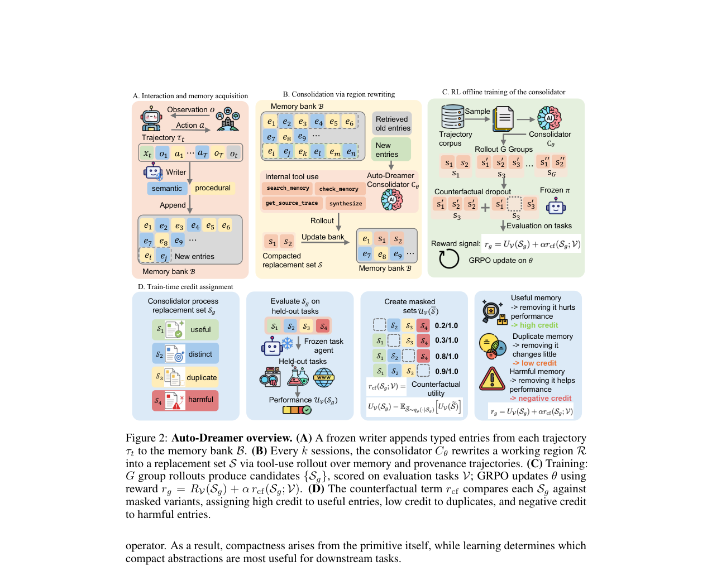
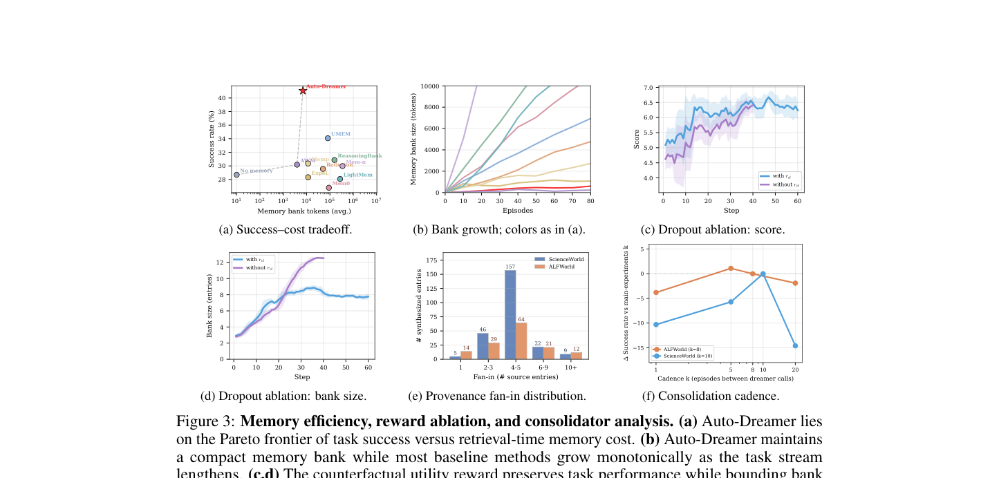

`auto_dreamer | Auto-Dreamer: Learning Offline Memory Consolidation for Language Agents | UIUC · UCSD(Jiaxuan You 组 + Julian McAuley;Chongrui Ye & Yuxiang Liu 共一) | 2026-05 首发·arXiv v1(2026-05-20)·Preprint·cs.CL | 主题线 L?("RL 学离线记忆巩固 = 在线快采集 + 离线慢巩固"线;CLS 互补学习系统启发)· 相关性 High(直击"探索-巩固"落点)`

> 三标注约定：【原文】= 论文明说；【推断】= 我的有据判断(附依据)；【待核】= 拿不准的关键事实。

══ 第一层：一眼看懂 [light] ══

- 🟦 **TL;DR**：语言 agent 现在常在"一串相关任务流"上跑,但现有记忆系统**把"采集(acquisition)"和"巩固(consolidation)"耦在同一个在线更新里**——每次更新只能看见当前这一 session 的有限证据,**没有跨 session 的全局视角**去发现重复模式、抽象共享流程、删冗余。本文受**互补学习系统(CLS)理论**(海马体快编码单条经历 + 新皮层慢提取跨经历共性)启发,提出 **Auto-Dreamer:一个"可学习的离线巩固器"**,把记忆操作**拆成两个时间尺度**:① **快**——固定的、只追加(append-only)的 per-session writer 立刻把每条轨迹的经验写进记忆库(只管 plasticity,不搜库/不比较/不重写);② **慢**——每隔 k 个 session,一个 **GRPO 训练出来的巩固器 Cθ** 对一块"工作区域 R"做**有界工具调用 rollout**(search/check/get_source_trace/synthesize),把 R 当**只读证据**,合成一个全新的**紧凑替换集 S** 去**整体取代** R。这个"区域重写(region rewriting)"语义让**抽象/去重/解矛盾/省略式遗忘变成默认行为**(旧条目默认不保留,信息只有被重新合成进 S 才存活)。训练用 **GRPO + 复合奖励**(下游任务表现 + 用随机记忆掩码估计的反事实效用项,惩罚冗余、奖励"承重"条目)。只在 ScienceWorld 轨迹上训,就在 ScienceWorld 超最强 baseline **7 个点**且活跃记忆库**小 12 倍**,并 zero-shot 迁移到 held-out 的 ALFWorld(小 6 倍)和 WebArena(领先)。【原文 Abstract/§1/§4】
- **最巧的一步**：**"区域重写 + 局部信用分配"这对组合**(§3-4.3)。把巩固的单位从"逐条目 CRUD"换成"整块区域替换",带来一个关键副产物:**每个 rollout 产出的替换集 S 是自包含的**,于是可以**把它单独放进一个只含 S 的局部库 `B*_g = S` 里直接评测、把下游任务回报直接当作这块重写的局部信用**——无需任何监督的记忆标注,就能用 GRPO 学"哪些抽象对下游最有用"。抽掉"区域替换"这一步,信用就只能落到"整个大库"上(库的表现被不是本次 rollout 产生的记忆污染),RL 信号会被稀释、学不动;正是"区域级自包含替换"让"无监督、下游驱动的巩固算子学习"成为可能。

══ 第二层：为什么做（写透） ══

- **研究背景**：语言 agent 越来越多部署在**相关任务流**上(而非孤立交互)。此时长期记忆**不只是检索缓存**,而是 agent 把原始经验转成**可复用流程/环境知识/行为先验**的机制。一个记忆系统必须同时解两个不同的问题:**(a) 快速从每条新轨迹采集有用信息;(b) 周期性把累积经验重组成紧凑、不冗余、对未来有用的形式**。【原文§1】
- **解决的具体痛点(两个 gap)**：
  - **(1) 巩固问题(consolidation)**:现有方法把采集和巩固耦进**单一在线更新**,每次只凭当前 session 的有限证据 → 难发现跨 session 的重复模式、难抽象可泛化流程、难解矛盾、难删冗余。
  - **(2) 记忆效用问题(memory-utility)**:RL 训练的记忆方法优化的是**在线构建/检索**,而**不是"在显式下游效用目标下的离线巩固"** → 它们不直接学"哪些记忆是承重的、哪些是冗余的、如何在'成功率 vs 记忆紧凑度'间权衡"。
- **相关工作 & 各自不足**(§2)：
  - **记忆架构**(A-MEM/Mem0/MemOS/SimpleMem;EverMemOS/MIRIX/Nemori/PlugMem 的 typed 记忆;Memp/Voyager 技能库;ExpeL/ReasoningBank 抽 insight/策略;ReMem test-time 记忆演化):**更新都由 prompted 启发式在 session 内/紧随其后做,无显式跨 session 巩固**。
  - **RL 训练的记忆管理器**(MEM1/MemAgent 简单文本记忆;Memory-R1[本调研 memory_r1]/Learn-to-Memorize/REMEMBER/Mem-α 复杂记忆;UMEM 用 GRPO 联训抽取+管理但**在线单步接口**;MemRL 学决策时检索对的记忆):**全部在线**——记忆更新与任务执行交织,巩固证据**限于当前 session**。
  - **离线计算/睡眠时记忆**:Sleep-time compute(查询前预计算持久上下文);**LightMem(本调研 sleepgate 同族)= 在线 writer + 周期离线巩固,但巩固是固定 prompted pipeline + 逐条目 CRUD** —— **是本文架构上最近的对照**。
  - **与最近邻(LightMem)的 Δ**：都"两时间尺度(在线写 + 离线巩固)",**关键差异 = 巩固怎么做**:LightMem 用**固定 prompt + 逐条目 CRUD 保留决策**;Auto-Dreamer 用**可学习的多步工具使用巩固器做"区域重写"**(整块替换,以可重读的源轨迹为证据,用下游任务奖励 GRPO 训)。这差异有用,因为:① 整块替换让紧凑性"结构性内生"(默认遗忘),② 可学习+下游奖励让它学到"对任务最有用的紧凑抽象",而非靠人写的 CRUD 规则。【原文§2 "Offline computation and sleep-time memory"】

══ 第三层：怎么做 + 靠不靠谱 ══

- **方法流水线(两时间尺度,对应 Fig 2 的 A→B→C→D)**：
  1. **记忆库结构(§3, Fig 1A)**：typed 持久库 B,每条目 e=(name n, body s, **provenance 链 L=指向源轨迹 T 的链接**),类型为 **semantic(事实知识)** 或 **procedural(how-to 技能)**。另有**轨迹日志 T** 存原始 session 供溯源(task agent 决策时**不检索 T**,但巩固器可用 T 当证据)。
  2. **两个互补算子(Eq.1)**：**Read**(在线,frozen task agent 用)= `Top-K_{e∈B} cos(ϕ(q), ϕ(n_e⊕s_e))`(frozen 句编码器 ϕ,按 token 预算取 top-K);**Write**(离线,巩固器学)= `(B\R) ∪ C_θ(R, T_R)` —— 把区域 R 换成合成的替换集 S。
  3. **快采集(§4.1)**：per-session **prompted writer**(固定)每个 session 后发出 typed 条目,**只追加、带 provenance、不搜库/不比较/不重写** → 偏向 plasticity,即时廉价记录。
  4. **慢巩固=区域重写(§4.1)**：给定区域 R⊆B 及其溯源轨迹 T_R,巩固器 C_θ 做**有界工具 rollout**(固定回合预算,工具 = search_memory / check_memory / get_source_trace / synthesize),每步条件于 (R, T_R) + 历史工具调用,直到 terminate 或耗尽预算 → 合成替换集 S。**区域替换语义**使 abstraction / dedup / 解矛盾 / **省略式遗忘** 成为默认(旧条目当证据,只有被重合成进 S 才存活)。
  5. **部署(§4.2)**：在线时每 k 个 session 触发一次巩固,**工作区域 R = 本区间新写入的条目 ∪ 本区间被 task agent 检索过的旧条目**(新证据 + 当前真在影响行为的旧记忆),区域外条目不动(但将来若被检索可进入未来区域)。
  6. **训练(§4.3, Algorithm 1)**：离线轨迹池上采 J 条 support 轨迹 → 组成区域 R(+provenance T_R)→ 巩固器采 **G 个 rollout**,每个产出候选 S_g → **局部评测 `B*_g=S_g`** → 算奖励 → **GRPO 更新 θ**。**只更新巩固器参数**;writer/retriever/task agent/记忆 schema/token 预算全程冻结(干净隔离巩固器的贡献)。巩固器从 **Qwen3-14B** 初始化。
- **奖励设计(§4.3, Eq.2-3,Fig 2D 的精华)**：`r_g = U_V(S_g) + α·r_cf(S_g; V)`。
  - **U_V(S)** = 下游效用 = frozen task agent 带 S 在评测任务集 V 上的平均 Return。
  - **r_cf(S_g;V)** = **反事实效用** = `U_V(S_g) − E_{Ŝ∼q_ρ(·|S_g)}[U_V(Ŝ)]`,其中 q_ρ **随机掩码掉 S_g 中固定比例 ρ 的条目**(MC 估计期望)。直觉:**掩掉承重条目→性能掉(高信用);掩掉冗余条目→几乎无变化(低信用);掩掉有害条目→性能升(负信用)**。⇒ GRPO 偏好"既提下游效用、又最小冗余"的替换集。
- **逐组件必要性(消融充分,§5.4 + Table 2)**：
  - **写-only vs untrained vs full(Table 2)**:**untrained**(同区域重写机制+工具 rollout+溯源,但**不 GRPO 训**)已拿下大部分**库体积缩减(比 writer-only 小 6-11×)** → 证明**区域重写本身是紧凑性的主因**(替换即压缩,先于学习);**GRPO 训练**再提升重写**质量与选择性**——ScienceWorld +9.7pp、WebArena +5.7pp(SR)。
  - **反事实项 r_cf(Fig 3c/3d)**:无 r_cf 时原始分仍升但**库迅速膨胀**;有 r_cf 时库**先涨后缩**、任务性能不降 → 证明 r_cf 确实"压冗余不损性能"。
  - **巩固节奏 k(Fig 3f)**:ScienceWorld 在主 cadence 最优,**太频(k=1)跨 session 证据不足、太疏(k=20)区域太大太噪超 context/工具预算**;ALFWorld 对 k 更鲁棒。
  - **provenance fan-in(Fig 3e)**:合成条目引用源条目数**峰值在 5** → 合成的是"多源抽象",非 1:1 复制。
- **关键机制直觉**：核心是"**把'记下来'和'整理成可复用知识'分到两个速度上,并让'整理'这件事由下游成败来教**"。直觉:writer 像随手记的便签(快、全、乱);巩固器像睡觉时大脑把白天的便签重写成几条精炼笔记(慢、少、抽象),而"重写得好不好"由"第二天用这些笔记办事顺不顺"来打分。"整块重写"则保证"没被重写进去的便签自动消失",天然实现遗忘/去重。
- **实验与证据**：
  - **数据集/环境**:**ScienceWorld**(文本科学实验,**唯一训练源**)、**ALFWorld**(家务指令,held-out)、**WebArena**(网页导航 shopping/admin/gitlab,held-out)。
  - **模型**:frozen task agent = Qwen3.5-9B(ALF/Sci)/ Gemini-3-flash-preview(WebArena);writer = Qwen3-14B(ALF/Sci)/ Gemini-3.1-flash-lite(WebArena);**巩固器 C_θ 从 Qwen3-14B 初始化,只在 ScienceWorld 训,三域无更新应用**(含 writer-backbone 跨越)。
  - **支撑核心主张的关键实验 = Table 1(A 连续部署 + B 固定库受控)**:**(A)** ScienceWorld 41.1% SR(超最强 baseline UMEM 34.1% **+7.0pp**,超最强 prompted ReasoningBank +10.2pp),AUC 0.353→0.411(增益贯穿全流而非只在末尾);ALFWorld 60.2%(>UMEM 58.4 / Mem-α 57.4);WebArena 52.3% 领先。**记忆成本**:ScienceWorld 6.9k tok(vs UMEM 80.9k / ReasoningBank 155.1k);WebArena 927 tok(vs LightMem 370k / Mem0 43.4k)。**(B) 受控固定库**:ALFWorld 72.7% / ScienceWorld 44.3%,均领先(但 margin 更窄,因受控去掉了累积检索竞争)。Fig 3a:Auto-Dreamer 处在"成功率 vs 检索成本"的 **Pareto 前沿**。
  - **baseline 公平吗**:【原文】10 个 baseline 跨 7 个家族(no-memory / Reflexion-ExpeL / AWM-Memp / ReasoningBank-Mem0 / **LightMem 最近架构对照** / Mem-α-UMEM RL writers),同域共享 frozen task agent,writer 用同等强的 LLM(确保 baseline 不因弱记忆 LLM 吃亏)→ **较公平**。注脚诚实说明 UMEM/Mem-α 在 WebArena 因 context window 装不下而缺值(†),未为对齐而重训。
  - **"看着强但没回答核心问题"的隐患**【推断】:① **U_V 与 r_cf 都用同一评测任务集 V 当"下游"**,且 task agent 是 frozen 的特定模型——巩固器可能**过拟合"对这个 task agent 有用的抽象"**,换 task agent 是否还成立未充分验(虽 writer-backbone 跨越验了一部分迁移)。② **只在 ScienceWorld 单源训**就声称跨域,迁移到 ALFWorld/WebArena 的增益**部分可能来自"通用去重/压缩"而非"学到的领域抽象"**——untrained 已拿下大半压缩(Table 2)正是此点的旁证。
- **假设与失效边界**：
  - 【原文 §5.4/§5.5 Pattern 3,诚实自承的失效模式】**过度抽象会丢任务特定细节**:在 ALFWorld 的 **look_at_obj_in_light**(单点位置敏感)任务族上,训练后 SR **反而下降**(位置细节被抽象掉);排除该族后 trained-vs-untrained margin 扩到 +4.9pp。⇒ **"省略式遗忘"是双刃剑:对需要精确细节的任务有害**。
  - 【原文】巩固器设计是**领域/writer 无关的**(只在 typed 文本条目 + 溯源轨迹摘录上操作,不碰环境特定状态/动作符号/writer 隐状态)——这是迁移能力的来源,也是隐含假设(若记忆必须编码环境特定结构则不适用)。
  - 【原文 §4.3 训练-部署近似】训练用**局部库 `B*_g=S_g`** 评信用,部署却是**反复合成进持久增长库**;论文用 Panel A 在线增益证明"局部训练的重写算子在检索竞争与旧记忆交互下仍有效",但这是**近似**,大库长流下的偏差未完全界定【推断】。
  - 【推断】依赖**可靠的 frozen task agent + 可评测任务集 V** 提供奖励;V 覆盖不足或 task agent 弱时,巩固器学到的"效用"可能偏。依据:Eq.3 奖励完全由 U_V 定义。
- **祛魅总结**：
  - **真贡献(硬货)**：① **CLS 启发的"两时间尺度"形式化**(快采集 vs 慢巩固),并把后者**显式建成"在累积证据上的可学习决策问题"**——概念清晰且可操作;② **"区域重写"作为诱导紧凑性的巩固原语**(整块替换 → 抽象/去重/省略遗忘成为默认),且**带 provenance grounding**(以可重读源轨迹为证据,防凭空捏造);③ **区域局部信用 + 反事实掩码奖励**——无需监督记忆标注就能用下游回报学巩固,反事实项干净地分离"承重 vs 冗余 vs 有害"记忆;④ **强且诚实的实证**(Pareto 前沿、12×/6× 记忆压缩、跨域跨 backbone 迁移、充分消融 + 自承失效模式)。
  - **包装/营销成分**【推断】:① "learned offline consolidator"的新意主要在**训练目标与重写粒度**,工具集(search/check/get_source/synthesize)和两时间尺度思想与 LightMem/sleep-time 同脉;② 跨域迁移的"硬度"被 untrained 已拿下大半压缩 这一事实**部分稀释**(说明可观增益来自机制而非学习);③ "省略式遗忘是默认行为"被宣传为优点,但对位置敏感任务**反而是缺陷**(论文诚实标了 Pattern 3)。
  - 作者**相当诚实**:专门用 §5.5 Pattern 3 报告"过度抽象丢细节"的失效、用 Table 2 区分"机制 vs 学习"的贡献、用 † 注脚说明 baseline 缺值原因(可信度加分)【推断】。

══ 结构化抽取 ══

- 🎯 **机制速览 6 轴** [light]：

| 学什么信号 | 改什么 | 何时改 | 免梯度? | 记忆-技能生命周期 | 防遗忘机制 |
|---|---|---|---|---|---|
| **环境 reward(复合:下游任务 Return U_V + 反事实效用 r_cf[随机掩码估"承重/冗余/有害"])** | **记忆库 B 的内容**(巩固器 C_θ 重写区域 R→替换集 S);**模型侧只训巩固器参数 θ**,task agent/writer/retriever 全冻结 | **慢巩固:离线/周期(每 k session 一次,batch RL 训练);快采集:在线 per-session(append-only)** | **否(巩固器训练)**:GRPO 梯度训 C_θ;**采集侧免梯度**(prompted writer);整体是"梯度训一个工具使用策略" | **写入=快 writer append→检索=frozen Read(top-K cos)→巩固=慢 C_θ 区域重写→淘汰=省略式遗忘(没被重合成进 S 即消失)+ 去重 + 解矛盾**;provenance 链全程可溯源 | **本文的"防遗忘"是反向的——刻意"可控遗忘"以求紧凑**:区域替换使遗忘/去重成为默认;**反事实项 r_cf 保护"承重"记忆不被误删**(高信用),压制冗余/有害;无几何/merging/KL 投影/参数隔离(因不动模型参数)。**注意:其"省略式遗忘"对位置敏感任务会造成有害的"细节遗忘"(Pattern 3)** |

- ⑦ **开源代码 + 框架/harness**：**框架明确(基于他人开源)**——【原文 Appendix B.3 + 脚注明写】"For our agentic RL environments, we build upon **OpenTinker**(https://github.com/open-tinker/OpenTinker,提供 ALFWorld/ScienceWorld 统一任务配置);Our training infrastructure is built on top of **verl**(https://github.com/volcengine/verl)";并称"We report verbatim text from **opentinker/memory_training/** and **opentinker/environment/**"。⇒ **训练框架 = veRL(volcengine/verl)做 GRPO + OpenTinker 提供 agentic RL 环境/任务配置**;**Auto-Dreamer 自身的训练/记忆代码看来托管在 OpenTinker 仓的 memory_training/ 与 environment/ 子目录**〔待核:OpenTinker 仓是否已公开含 Auto-Dreamer 完整实现,待 P3 用 WebSearch/clone 核验;按"PDF 写到就如实记"——框架 = veRL + OpenTinker 可定;Auto-Dreamer 专用代码 URL 以 OpenTinker 子目录为线索〕。
- 💰 **资源/成本与可扩展性**：【原文 Table 6 给训练超参(ScienceWorld GRPO run):有 rollout group size N、batch size、训练步数、学习率、采样温度/top-p,但**正文未列精确 GPU 数/时长**】。**部署侧成本极低**:这正是卖点——活跃记忆库小 6-12×(ScienceWorld 6.9k vs 155k tok;WebArena 927 vs 370k tok),**检索时上下文成本大降**;巩固是**周期性离线**(每 k session)摊销。巩固器 14B,可学习,一次训练多域复用(省再训)。
- 🎯 **对"探索-巩固"idea 对标** [light]：**最直接的"巩固落点"支撑 + 高价值可借组件(本批次与本项目 idea 最贴的一篇)**。① **它就是"在线探索→可学习离线巩固"的范本**:本项目"探索(在线 rollout/MTP 前瞻)→巩固(离线把有用经验固化)"与 Auto-Dreamer 的"快 writer 采集 → 慢 GRPO 巩固器重写"**结构同构**;它证明了"**用下游成败 RL 训一个离线巩固器**"是可行且能迁移的——为本项目"可学习巩固"提供了直接先例与基线。② **核心可借组件(可直接迁移到 MTP/OPD)**:**(a) 区域重写语义**(整块替换→遗忘/去重默认)可映射到"把一批 MTP 前瞻探索产物整块巩固成精炼策略,旧的自动淘汰";**(b) 反事实掩码效用 r_cf**——这是本项目做"巩固时判断哪条经验承重/冗余/有害"的现成、无监督奖励工程,**可与 forward-hard/backward-soft 或 per-step 信用分配结合**;**(c) 区域局部信用 `B*_g=S_g`**——把信用分配单位对齐到"产出单位",启发本项目"path-recovery 单点接管"的局部信用设计;**(d) provenance grounding**(以可重读源轨迹为证据)——防巩固阶段幻觉,可用于"巩固前回看原始探索轨迹"。③ **竞品/差异点**:它**只动记忆库、不动模型参数**(本项目 OPD 是参数侧蒸馏);它**巩固器与 task agent 解耦**(本项目可能想让探索者=被巩固者闭环);它**离线周期巩固**(本项目可探 per-step/在线巩固)。④ **关键警示(失效边界对标)**:Pattern 3 的"过度抽象丢细节"提醒本项目——**巩固/压缩必须保留"位置/细节敏感"信息**,这与 misevolution 的"坏经验巩固"、CPE 的"破坏性覆盖"共同构成"巩固三大坑"(丢细节 / 巩固错经验 / 覆盖旧能力)。
- 🔭 **开放问题/未来方向**：【原文(散见)】① 缓解"过度抽象丢细节"(Pattern 3)——按任务类型自适应抽象粒度;② 训练-部署近似的更紧界定(局部信用 vs 持久大库);③ 巩固器对 task agent 的依赖(换 agent 的泛化)。【推断】④ 把"区域选择器(region selector)"也做成可学习(当前是启发式 union);⑤ 与参数侧自进化(OPD/RL)联动,而非只动文本记忆;⑥ 在线/per-step 巩固(当前周期离线);⑦ 把反事实效用从"随机掩码"升级为"针对性掩码"(更精确定位承重条目)。

- 🖼 **关键图 top-2** [light]：

· 这是**原文 Figure 2**(方法主图,已裁剪上半 4 面板)。**(A)** frozen writer 把每条轨迹 τ_t 的 typed 条目 append 进库 B;**(B)** 每 k session,巩固器 C_θ 经工具 rollout(search/check/get_source_trace/synthesize)把区域 R 重写成替换集 S → 更新库;**(C)** 训练:G 个 group rollout 产候选 {S_g},在评测任务 V 上打分,**GRPO 用 `r_g=U_V(S_g)+α·r_cf` 更新 θ**;**(D)** 反事实项 r_cf 对比 S_g 与掩码变体,给"有用"高信用、"重复"低信用、"有害"负信用。选它因为它一张图完整讲清本文**两时间尺度 + 区域重写 + RL 训练 + 反事实信用**四件核心机制——正是"可学习离线巩固"的全貌,对本项目"探索-巩固"最具参照价值。

· 这是**原文 Figure 3**(核心证据+分析图)。**(a)** 成功率 vs 检索时记忆 token 成本——**Auto-Dreamer(红星)独占左上角 Pareto 前沿**(高成功率 + 小记忆),逼近它成功率的 baseline 都要大得多的库;**(b)** 库增长:多数 baseline 随任务流单调膨胀,**Auto-Dreamer 维持紧凑**;**(c,d)** 反事实奖励 r_cf 在保持性能的同时约束库膨胀;**(e)** provenance fan-in 峰值=5(多源抽象);**(f)** 巩固节奏 sweep。选它因为它**量化坐实了本文双主张——"既更准又更省"**,且 (b) 的"baseline 库爆炸 vs Auto-Dreamer 压平"最直观地展示"可学习巩固"对抗记忆膨胀的价值。
