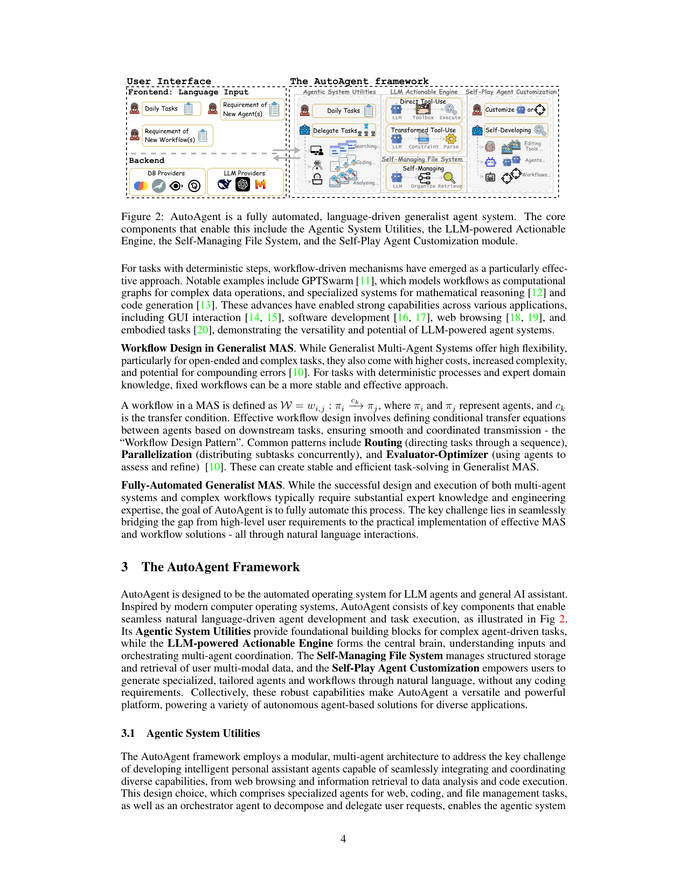
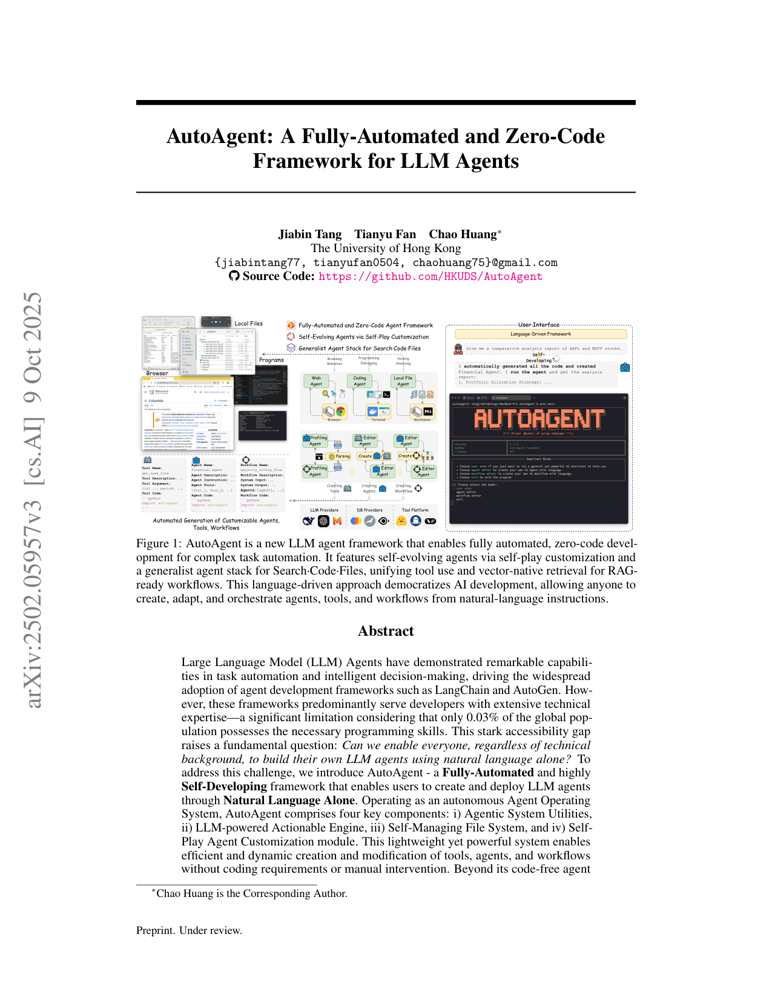

`autoagent_zerocode | AutoAgent: A Fully-Automated and Zero-Code Framework for LLM Agents | HKU (HKUDS, Jiabin Tang/Tianyu Fan/Chao Huang) | Preprint under review, arXiv 2502.05957v3, 2025-10-09 | 主题线 L?(自构建 agent 框架 / 自进化 via 自定制)· 相关性 中(harness/自构建侧,非参数学习)`

> light 档笔记。基于真实 PDF 正文。三标注:【原文】【推断】【待核】。

══ 第一层:一眼看懂 [light] ══
- 🟦 **TL;DR**:【原文】现有 agent 框架(LangChain/AutoGen/MetaGPT…)都要求用户有相当的编程与领域专长,而全球只有 ~0.03% 人会编程——这把 agent 开发挡在普通人门外。AutoAgent 问:**能否让任何人只用自然语言就造出自己的 LLM agent?** 它把自己设计成一个"**Agent 操作系统**",含四大组件:① **Agentic System Utilities**(Orchestrator/Web/Coding/Local-File 等通用 agent + 工具箱);② **LLM-powered Actionable Engine**(用 LiteLLM 统一 100+ 模型,把 action-observation 对当作"系统 RAM";支持 Direct Tool-Use 与 **Transformed Tool-Use**——把工具调用转成结构化 XML 代码生成,绕开模型原生 function-calling 依赖);③ **Self-Managing File System**(向量原生检索,RAG-ready);④ **Self-Play Agent Customization**(把自然语言需求经结构化 XML schema 转成**可执行的 agent/tool/workflow**,并通过迭代自改进自动生成优化工作流)。零代码、零手工编程。GAIA 基准上拿到**第二名**,RAG 基准上显著超过 SOTA。
- **最巧的一步**:【推断,依据 §3.2.1 + §3.4】"**Transformed Tool-Use:把工具调用降维成受约束的 XML 代码生成**"+ Self-Play 用同一套受控代码生成机制去**自造 agent/tool/workflow**。抽掉这个"受约束代码生成"内核,零代码自定制(从 NL 长出可执行组件)就无从实现,框架退回成又一个需手写的 MAS 库。

══ 第二层:为什么做 ══
- **研究背景**:【原文 §1】LLM 驱动的 agent 框架(LangChain/AutoGPT/AutoGen/CAMEL/MetaGPT)靠 role-playing、SOP、动态协调把复杂工作流自动化,成果显著。
- **解决的具体痛点**:【原文 摘要/§1】这些框架**几乎都面向有相当编程与领域专长的开发者**——要会读复杂代码库、懂 API 集成、会写 prompt engineering 模式。但全球只有 ~**0.03%** 人会编程,这把 agent 开发挡在普通人门外,形成巨大可及性鸿沟。核心问题:**能否让任何人只用自然语言就造出并部署自己的 LLM agent?**
- **相关工作 & 各自不足**:【原文 §1】(a) LangChain/AutoGen/MetaGPT 等:能力强但**需编程专长**,普通用户用不了;(b) workflow-driven 机制:对确定性步骤任务有效,但要手工设计工作流;(c) 依赖模型原生 function-calling 的工具调用:把可用模型限死在支持 FC 的那批,且对复杂工具组合脆弱。共同缺陷:**自定制(造新 agent/tool/workflow)仍要人写代码**。
- **动机链**:【原文 §1/§3】现状=agent 框架强但门槛高、自定制要编程 → 缺陷=99.97% 人被挡在外、且工具调用受限于原生 FC → 所以必须做一个"**Agent 操作系统**":用自然语言驱动、用受控代码生成把 NL 需求变成可执行组件,并绕开原生 FC 依赖。为什么不用更简单做法(直接 prompt 大模型造 agent):无结构约束的自由生成不可靠、不可执行、无法沉淀为可复用 tool/agent/workflow。
- **与最近邻的 Δ**:【推断,依据 §3.2/§3.4】最近邻是 AutoGen/MetaGPT 这类多 agent 框架。关键 Δ=**把"自定制"从"人写代码"换成"NL 需求 → 受约束 XML 代码生成 → 可执行 agent/tool/workflow + 迭代自改进"**(Self-Play Customization),且用 Transformed Tool-Use 让非 FC 模型也能用工具。这差异有用,因为它真正实现了"零代码"——任何人都能从一句话长出可运行的 agent 系统。

══ 第三层:怎么做 + 靠不靠谱 ══
- **方法流水线**:【原文 §3】输入=用户自然语言 → 四组件咬合:① **Agentic System Utilities**(Orchestrator + Web/Coding/Local-File 等通用 agent + 工具箱,Web Agent 的高层动作由 BrowserGym 低层动作组合);② **LLM-powered Actionable Engine**(LiteLLM 统一 100+ 模型;把截至 t 的全部 action-observation 对当 state s_t = "系统 RAM";两种工具调用:**Direct Tool-Use**走原生 FC,**Transformed Tool-Use** 把工具调用转成受约束 XML 代码 `<function=name><parameter=p>v</parameter></function>` 再解析,绕开原生 FC 依赖);③ **Self-Managing File System**(向量原生检索,LLM Organize/Retrieve,RAG-ready);④ **Self-Play Agent Customization**(把 NL 需求经结构化 XML schema 转成可执行 agent/tool/workflow,并迭代自改进生成优化工作流)→ 输出=运行生成组件得到的结果(如 AAPL/MSFT 对比报告)。
- **逐组件必要性**:① **Transformed Tool-Use(受控 XML 代码生成)**——没它就受限于原生 FC 模型 + 复杂工具组合脆弱(全文内核);② **Self-Play Customization**——没它就退回"手写 agent"、零代码诉求落空;③ **Self-Managing File System(向量检索)**——支撑 RAG 能力与跨步记忆;④ **action-observation 当 RAM**——提供轻量状态/检索基础。注:本文**未提供系统性逐组件消融表**(标【推断:缺消融】);组件价值靠 GAIA/RAG 主结果 + case study 支撑,而非单独 ablate。
- **关键机制/直觉**:【原文 §3.2.1】Transformed Tool-Use 的直觉=现代 LLM 代码生成能力远强于其遵守任意 JSON schema 的能力,所以把"调用工具"重述成"生成一段受约束 XML/伪代码"——既利用了模型最强的能力,又让非 FC 模型也能参与,还为 Self-Play"自造组件"提供同一套受控生成内核(造 tool/agent/workflow 本质都是受约束代码生成)。
- **实验与证据**:【原文 §4/Table1-3】① **GAIA 基准第二名**(Table 1,报 leaderboard 成绩,L1/L2/L3 分层);② **RAG 基准**(Table 2):Agent-Based AutoAgent acc 73.5% 显著超 Chunk-Based(NaiveRAG/HyDE ~53–56%)、Graph-Based(MiniRAG/LightRAG ~58%)与 LangChain(62.83%);③ **AI 生成的 Majority Voting workflow**(Table 3):pass@1 75.6 > 单模型(gpt-4o 66.4 / claude-3.5-sonnet 66.4 / deepseek-v3 74.2),作者据此提"潜在 test-time scaling law"。baseline 较全(覆盖 chunk/graph/agent 三类 RAG)。"看着强但需谨慎"处:GAIA 是第二名而非第一;Majority Voting 增益小(74.2→75.6)且属 test-time scaling 一般现象。
- **假设与失效边界**:【推断,依据 §3.4 + 全文设定;原文未设独立 Limitations 节】假设=① 现代 LLM 代码生成能力足够强;② 需求可被结构化 XML/工作流刻画;③ 浏览环境可由 BrowserGym 低层动作覆盖。当需求超出受控代码生成可表达范围、或需要深度领域正确性保证(金融/医疗合规——文中以此为动机却靠模型生成实现)时,自生成组件**无外部验证保障**可能失效——与 SkillsBench "模型自生成程序性知识平均零收益" 的发现直接对冲。
- **祛魅总结**:【推断】真贡献(硬货)=① 一个端到端可用、开源(HKUDS/AutoAgent)的"**零代码 + 自定制**" agent OS,Transformed Tool-Use 是实在的工程巧思(解 FC 依赖 + 统一自造组件内核);② GAIA 第二 + RAG 超 SOTA 是真。包装/略高估处:① "self-evolving" 实为"在 harness 层自动生成新组件",**不沉淀进权重、无参数学习**,与严格意义的"自进化"有距离;② 自生成组件质量缺外部验证(对照 SkillsBench 风险);③ 无逐组件消融,组件必要性偏论证。整体是一篇扎实的**免梯度自构建/工程**论文,卖点在可及性与自定制,而非学习方法。

══ 机制速览 6 轴 [light] ══
| 维度 | 内容 |
|---|---|
| 学什么信号 | 【原文】信号=**用户自然语言需求 + 框架当前状态(已有工具/agent/workflow)+ 执行约束/错误处理反馈**;靠 LLM 受控代码生成 + 迭代自改进,**非环境 reward、非梯度**。 |
| 改什么 | 【原文】改 **harness/系统组成**:动态创建/修改 tools、agents、workflows(代码与 XML 配置层),并维护 Self-Managing File System;**不改模型参数**,prompt 由 profiling/editor agent 动态构造。 |
| 何时改 | 【原文】test-time / 交互期:用户提需求即 per-request 生成或修改组件;Self-Play 内含 workflow 的迭代自改进。 |
| 免梯度? | 【原文】是(纯 LLM 推理 + 代码生成,无梯度训练)。 |
| 记忆-技能生命周期 | 【原文】"记忆"=action-observation 对当 RAM + Self-Managing File System(向量检索持久化文件/知识);"技能"=自生成的 tools/agents/workflows,可被后续复用与编辑(create/edit)。无显式遗忘/淘汰/跨用户共享的学习机制(原文未说明淘汰策略)。 |
| 防遗忘机制 | 【原文】不适用(无参数训练→无灾难性遗忘);组件是显式存储的代码/配置,靠文件系统与版本编辑管理。 |

⑦ **开源代码 + 框架/harness**:【原文】Source Code: https://github.com/HKUDS/AutoAgent(p0 明示)。框架=**自研 agent 框架/OS**(LiteLLM 统一模型接入、BrowserGym 实现浏览环境、Markdown Browser、XML schema 自定制);非训练框架(无梯度)。〔按 B 层只记录链接,未 clone。〕

💰 资源/成本与可扩展性:【原文】GAIA 第二名 + RAG 基准超 SOTA(Table 1/2);AI 生成的 Majority Voting workflow 对比单 LLM(Table 3,以 DeepSeek-v3)。成本=纯 API 调用 + 向量检索,无训练成本;可扩展性=高层工具由低层动作组合(如 Web Agent 10 个高层动作基于 BrowserGym 低层 action),便于扩展。具体算力/延迟数字原文未集中给出。

🎯 **对"探索-巩固"idea 对标** [light]:【推断】**竞品(免梯度自进化路线)/ 缺口**——AutoAgent 是"**自进化 = 自动生成新组件(agent/tool/workflow)**"的代表,与本项目"自进化 = 改模型参数(MTP 探针 + on-policy 蒸馏)"是**互补但不同层**的路线:它在 harness/组件层"长出新能力",不沉淀进权重。可借组件:其"NL→受控 XML 代码→可执行组件 + 迭代自改进"可作为"探索"阶段快速生成候选方案的脚手架;但它不解决"把习得固化进模型本身"的巩固问题(这正是本项目要补的缺口),也未回应 SkillsBench 指出的"模型自生成程序性知识平均零收益"风险。

🖼 **关键图 top-2** [light]:

这是**原文 Figure 2**:把"语言驱动的通用 agent 系统"四大核心模块如何咬合讲清楚——选它因为它是最清晰的方法主图,直接对应论文的四组件设计。

这是**原文 Figure 1**:用一个真实任务端到端展示"自然语言→自动生成可执行 agent/tool/workflow→产出结果"的零代码体验——选它因为它最能表现论文的核心卖点(自构建/自进化)。

【假设与失效边界一句】[light]:【推断,依据 §3.4 + 全文设定】假设"现代 LLM 的代码生成能力足够强、且需求可被结构化 XML/工作流刻画";当任务需求超出受控代码生成可表达范围、或需要深度领域正确性保证(如金融/医疗合规——文中以此为动机但靠模型生成实现)时,自生成组件的质量与可靠性无外部验证保障,可能失效(对照 SkillsBench:模型自生成程序性知识平均零收益)。
