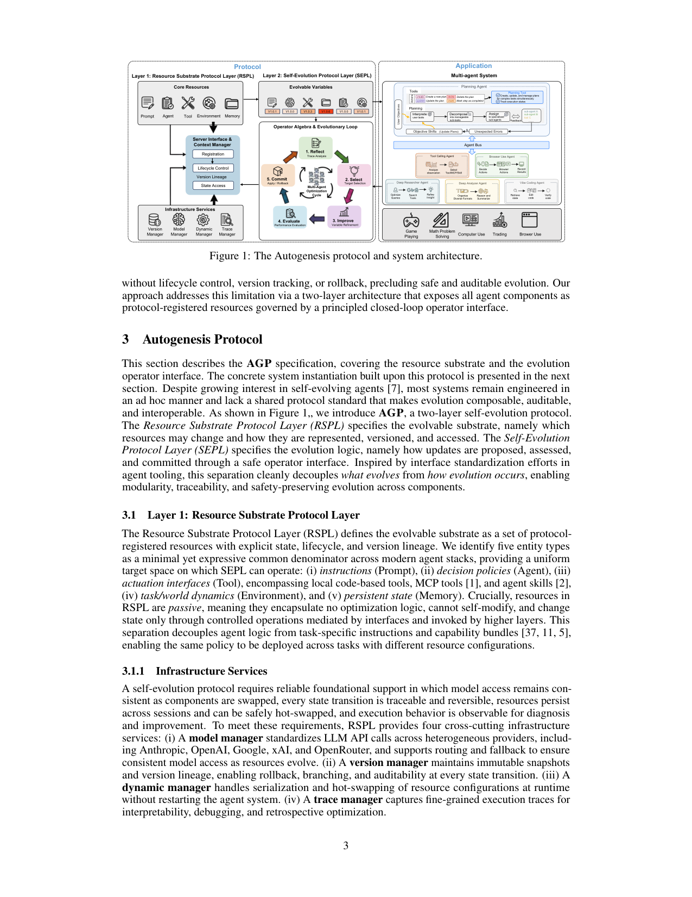
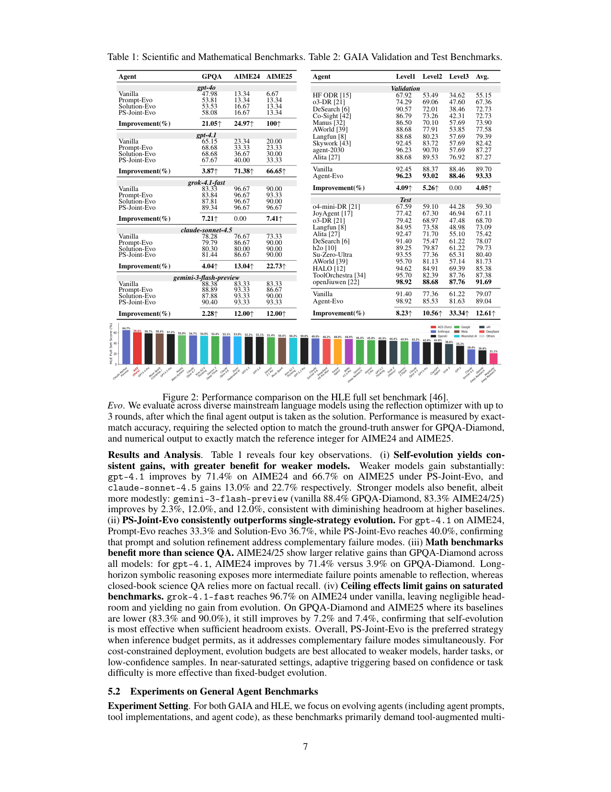

`autogenesis | Autogenesis: A Self-Evolving Agent Protocol | NTU（Wentao Zhang, Bo An）+ Stanford + Princeton（Mengdi Wang）+ CityU HK + USTC | arXiv:2604.15034v4 [cs.AI], 2026-05-19（preprint）| 主题线：自进化 Agent 协议 / 统一 harness 抽象（L? = protocol-自进化线）· 相关性 高（把"自进化"形式化为协议 + 算子代数，与 externalization_survey 的 protocol/self-evolving harness 直接对接；引用了本调研 ASI 锚 [7]=2507.21046）`

══ 第一层：一眼看懂 [light] ══

- 🟦 **TL;DR**：【原文 Abstract+§1】要解决的问题:现有 agent 协议(MCP、A2A)只管"调用"和"消息传递",**把 agent 内部资源(prompt/工具/记忆)的状态当黑箱**,没有生命周期管理、版本谱系、可控状态变更接口 → 导致自进化实现都是"东拼西凑的胶水代码",不可组合、不可审计、不可复现。核心做法:**AUTOGENESIS PROTOCOL (AGP)——一个两层自进化协议,把"进化什么"和"怎么进化"解耦**。**Layer 1 = RSPL(资源基质层)**:把 prompt、agent、tool(含本地工具/MCP/skill)、environment、memory 五类东西统一建模为"协议注册资源",赋予显式状态、生命周期、版本化接口(资源本身是**被动的**——不含优化逻辑、不能自改,只能被上层通过接口改);**Layer 2 = SEPL(自进化层)**:用控制论思路定义一套**类型化算子代数**(reflect/select/improve/evaluate/commit 的闭环),每次自改都可审计、可回滚、安全。基于 AGP 落地出 **AUTOGENESIS SYSTEM (AGS)**:一个多 agent 系统(planning agent + 多个 sub-agent 挂在 Agent Bus 上),运行时动态注册/检索/精化协议资源。在 GPQA/AIME/GAIA/HLE/自建 LeetCode 五个 benchmark 上一致超强 baseline。**开源**:github.com/DVampire/Autogenesis(已核实可达)。
- **最巧的一步**：【推断,依据 §3.2.1 variable lifting + §3.2.2 算子代数】**"变量提升(variable lifting)"——把异构的 RSPL 资源(工具代码、系统 prompt、agent 等)统一投影成"可进化变量"集合 V_evo,并用一个二元 learnability mask g_v∈{0,1} 显式圈定"可训练子空间"**。抽掉这层统一抽象,SEPL 的算子就无法"用同一套优化逻辑作用于异构组件"——正是因为 prompt/工具/agent 都被同质化成同一种"变量",同一个 reflect→commit 闭环(乃至 TextGrad/GRPO)才能无差别地优化任意组件。这是把"启发式改改 prompt"升格为"形式化优化协议"的关键。

══ 第二层：为什么做（写透） ══

- **研究背景**(§1, §2)：LLM agent 在长程任务上潜力大,但静态设计扛不住真实环境的多样性/随机性 → 自进化成为通往鲁棒自治的关键路径。但现有自进化实现"碎片化、ad hoc":prompt/工具/记忆与 agent 逻辑紧耦合,无共享标准,缺生命周期管理与安全更新接口 → 运行时不稳定。
- **解决的具体痛点**(§1)：MCP/A2A 虽标准化了"模型-工具调用"和"agent 间通信",但**只在调用与消息层面工作,内部资源状态不透明**——不提供生命周期管理、版本谱系追踪、受控状态变更,而这些恰是闭环进化系统的必备。具体缺三性质:**Decoupling**(资源作独立实体而非紧耦合代码)、**Safety & Auditability**(严格版本控制+回滚,每步可追溯可逆)、**Formalism**(标准算子 reflect/propose/verify 把启发式改动变成严谨控制环)。
- **相关工作 & 各自不足**(§2)：
  - **协议线(MCP/A2A)**:只管调用/消息,资源状态黑箱,无生命周期/版本/受控变更。
  - **免梯度优化线(TextGrad——把自然语言反馈当"梯度")**:有效但只优化窄子集(通常 prompt)。
  - **RL 线(Reinforce++/GRPO——把组件当策略用 reward 优化)**:同样窄。
  - **自进化框架线(EvoAgentX、Hermes Agent)**:自动构建/精化多 agent pipeline 或技能库,但**只优化 agent 组件的窄子集(prompt 或 workflow),无统一抽象管理全谱内部实体**,且更新**直接应用、无生命周期控制/版本追踪/回滚**,无法安全可审计地进化。
- **动机链**(§1, §3)：现状(自进化碎片化 + MCP/A2A 资源黑箱)→ 缺陷(不可组合/审计/复现,运行时不稳)→ 所以需要一个**专门协议**满足 Decoupling/Safety/Formalism 三性质 → 两层架构:RSPL 把资源标准化为有状态/生命周期/版本的对象(使其成为可系统观测与受控操纵的良定义对象),SEPL 把进化逻辑形式化为算子代数(所有状态变更经 RSPL 接口中介 → safe-by-construction)。为什么不用更简单做法(直接改 prompt/工具)?因为那样无法跨异构组件统一优化、无法保证可审计可回滚。
- **与最近邻(EvoAgentX/Hermes)的 Δ**：【原文 §2.2】最像的 EvoAgentX 也做自进化 workflow,但差在**两个关键点**:(1) EvoAgentX 只优化窄子集(prompt/workflow),AGP 提供**全谱五类资源的统一抽象**(prompt/agent/tool/env/memory);(2) EvoAgentX 的更新**无生命周期/版本/回滚**,AGP **每步进化都版本化、可回滚、可审计**。差异有用之处:它把"自进化"从"某框架的某优化技巧"提升为"任意优化算法(reflection/TextGrad/GRPO)都能即插即用的通用协议基座"——SEPL 算子接口对三种优化范式(推理时反思、文本梯度、reward 驱动策略优化)统一兼容(§4.1)。

══ 第三层：怎么做 + 靠不靠谱 ══

- **方法流水线**(§3-§4, 图1)：
  1. **RSPL 建模(进化基质)**:五类实体(PROMPT/AGENT/TOOL/ENV/MEM),每个资源 = 实体元组 e=(name, desc, 映射 φ:X→Y, 可进化标记 g, metadata) + 注册记录 c(版本串 v、实现描述符、实例化参数、LLM 交互的导出表征如 function-calling schema)。**资源被动**:不含优化逻辑、不能自改,只能经 context manager + server interface 受控变更。
  2. **四个基础设施服务**:model manager(统一多 provider API + 路由/fallback)、version manager(不可变快照 + 版本谱系 → 回滚/分支/审计)、dynamic manager(运行时序列化 + 热插拔,不重启系统)、trace manager(细粒度执行 trace → 可解释/调试/回溯优化)。
  3. **SEPL 形式化(进化逻辑)**:variable lifting 把资源投影成可进化变量集 V_evo = ∪类型实体 ∪ {y}(y=执行产物:最终输出+推理 trace,作回溯优化的观测基础);learnability mask g_v 圈定可训练子空间。**SEPL 算子** f: V_evo×P_in → V_evo×P_out 是类型化、可组合函数(P=携带 trace/假设/梯度/reward 的消息空间);进化环 = 算子序列 (f_n∘…∘f_1) 迭代至收敛/预算耗尽。
  4. **reflection optimizer 实例化(主实例)**:五算子闭环——**REFLECT**(trace+状态→因果失败假设)→**SELECT**(从假设选目标可进化实体,生成具体修改提案)→**IMPROVE**(经 RSPL 接口应用提案→候选状态)→**EVALUATE**(对目标+安全不变量打分)→**COMMIT**(条件接受或回滚)。
  5. **AGS 系统**:**Agent Bus 交互模型**——planning agent 与所有 sub-agent 作一等参与者注册到共享总线,所有 agent 间通信仅经标准总线消息(松耦合、可观测、并发) → planning agent 产出 `plan.md`(任务描述+子任务 todo+流程图+执行历史+结果摘要),分派子任务给指定 sub-agent(deep researcher / browser-use / deep analyzer / vibe coding agent),独立子任务并发、依赖串行,collect-and-replan 循环 → **自进化交织其中**:执行 trace 信号可纠正失败/次优时触发 SEPL 环,vibe coding agent 驱动 agent prompt/代码精化,进化后的 agent 注册为版本化 RSPL 资源**跨后续任务复用**。
- **逐组件必要性**：
  - **进化策略消融**(Table 1)：Prompt-Evo / Solution-Evo / **PS-Joint-Evo**(联合)三者对照——PS-Joint-Evo 一致最优(gpt-4.1 AIME24:Prompt 33.3 / Solution 36.7 / **Joint 40.0**),证明 prompt 与 solution 精化**针对互补的失败模式**。✅有受控消融。
  - **版本控制/回滚**:作为 safety 机制,但论文**未做"去掉回滚会怎样"的消融**(其必要性靠论证而非实验)。
  - **Environment/Memory 资源进化**:【原文 §6 限制】**已实现但未作为独立消融目标评估** → 这两类资源的进化必要性**尚无实验证据**(诚实披露)。
- **关键机制/直觉**：
  - **为何"被动资源 + 算子中介"能保证安全**:所有状态变更必须经 RSPL 接口(version manager 记不可变快照)→ 天然可回滚可审计("safe-by-construction");资源自己不能改自己,杜绝失控自修改。
  - **为何统一协议能兼容三种优化范式**:因为算子只读写"可进化变量+消息",reflection(LLM 反思生成提案)、TextGrad(把 NL 反馈当文本梯度编辑字符串变量)、GRPO/Reinforce++(把变量当策略用 policy gradient 优化)都只是"不同的 propose/improve 算子实例",共享同一状态操纵原语。
- **实验与证据**：
  - 数据集(三类):① **科学/数学**:GPQA-Diamond(198 STEM 选择,闭卷)、AIME24/25(各 30 竞赛数学,精确整数答案);② **通用 agent**:GAIA(Val 165 + Test 300,多步规划+工具,分 3 难度)、HLE(专家级极难,o3-mini 判分);③ **自进化代码**:**自建 LeetCode**(100 道新题减污染,5 语言 Python/C++/Java/Go/Kotlin,报 AC 率/通过率/运行效率/人类相对指标)——专为"推理时自进化能力"设计(现有代码 benchmark 只测 one-shot,测不出自进化)。
  - **支撑核心主张的关键实验**:
    - **Table 1(最干净的受控对照)**:排除工具,只比 Prompt/Solution/Joint 三策略 → **四大发现**:(i) **自进化普遍涨,弱模型涨更多**(gpt-4.1 AIME24 **+71.4%**、AIME25 +66.7%;claude-sonnet-4.5 +13.0%/+22.7%;强模型 gemini-3-flash 仅 +2.3%/+12%/+12%);(ii) PS-Joint-Evo 一致最优;(iii) **数学比科学 QA 涨更多**(gpt-4.1 AIME24 +71.4% vs GPQA +3.9%,因长程符号推理暴露更多可纠正的中间失败点,而闭卷科学 QA 靠事实回忆);(iv) **天花板效应**(grok-4.1-fast AIME24 vanilla 已 96.7% → 进化无增益,但其低基线的 GPQA/AIME25 仍 +7.2%/+7.4%)。
    - **GAIA/HLE(Table 2+图2)**:AGS GAIA Validation 达 **93.33%(榜单最佳)**、Test 89.04%;HLE 全集第二(仅次于用更强 frontier backbone 的 Claude Mythos)。**Agent-Evo 在难任务增益最大**(GAIA Test 平均 +12.6%,Level1 +8.2% → Level3 +33.3%)。
    - **LeetCode(Table 3+图3)**:Solution-Evo 5 语言 AC 率 +10.1~26.7%(C++ 解 99/100、Java 98/100),编译/运行/答案错误降到近零;**还提效**(运行时降,编译语言 -19.8~46.4%,发现更高效算法);**人类相对竞争力提升**(runtime beats +30.8%)。
  - **baseline 公平性**【推断,依据 §5.2】部分公平:作者反复强调"剩余差距主要来自 backbone 强弱而非协议本身"(openJiuwen GAIA Test 更高但用更强模型;HLE 第一的 Claude Mythos 也是更强 frontier)→ **承认未控制 backbone 变量**,但用 Vanilla vs Agent-Evo 的**同 backbone 自对照**来隔离协议贡献(这是较干净的处理)。Table 1 的三策略对照是同模型内比较,最严谨。
  - **"看着强但没回答核心问题"的隐忧**【推断】:(1) GAIA/HLE 的"登顶/第二"是**与不同 backbone 的系统横比**,AGS 自己也承认差距主要在 backbone,所以这些 SOTA 数字更多证明"AGS 不拖后腿",而非"协议本身带来 SOTA"——真正干净的协议增益是 Vanilla→Evo 的相对提升(Table 1/3 那些 %)。(2) **五类资源里只评了 prompt/solution/agent 三类**,environment/memory 进化"已实现未评估",所以"统一协议管全谱资源"的卖点**有一半未经实验验证**。
- **假设与失效边界**：
  - 【原文 §5.1 发现 iv + §6】**自进化只在有足够 headroom 时有效**:近饱和 benchmark(grok AIME24 96.7%)无增益;故最优预算应分给**弱模型/难任务/低置信样本**,近饱和时应"按置信/难度自适应触发"而非固定预算。
  - 【原文 §6】① **增加推理轮次 → 延迟与 token 消耗上升**,严格预算下的效率-效果权衡留作 future;② **environment/memory 进化未评估**;③ **行为漂移风险**:进化目标设错或 reward 噪声大会致非预期漂移,版本控制/回滚只是基础保障,严格对齐验证仍是开放挑战。
  - 【推断】重度依赖"执行可验证反馈"(LeetCode 用 online judge、数学有精确答案)——在无明确验证信号的开放任务上,EVALUATE 算子的可靠性存疑(论文未测此场景)。
- **祛魅总结**：
  - **真贡献(硬货)**:(a) **把"自进化"形式化为一个两层协议 + 类型化算子代数**,这是真正的概念贡献——给出了"进化什么(RSPL 五资源)"与"怎么进化(SEPL 算子环)"的解耦框架,且**版本谱系/回滚/审计**是落地的安全机制;(b) **协议对三种优化范式(reflection/TextGrad/GRPO)统一兼容**,具通用性;(c) 实验广(5 benchmark)且有**干净的同模型自对照**与若干扎实发现(弱模型/难任务增益更大、PS-Joint 最优、执行反馈既修正确性又提效);(d) **开源真实可达**;(e) 限制披露诚实。
  - **包装/营销成分**【推断】:(1) "protocol" 的定位有点重——它本质是**一个带版本控制的资源管理框架 + 一个 reflection 优化器**,"协议"更多是论文的概念包装(对比真正的开放标准 MCP/A2A,AGP 目前是单一实现的内部规范,尚无第二方采纳)。(2) 大量形式化记号(算子代数、状态转移函数、learnability mask)赋予"严谨"观感,但**核心算法仍是 reflection optimizer(LLM 反思改 prompt/代码)**,形式化主要是事后包装而非带来新算法能力(TextGrad/GRPO 都只是"也能套进来"的声明,未在主实验用)。(3) GAIA/HLE 的榜单排名借了强 backbone 的光(作者自己承认),易让读者高估协议本身贡献。(4) 五资源统一抽象但只评三类,卖点打了对折。

══ 结构化抽取 ══

- 🎯 **机制速览 6 轴** [light]：

| 维度 | 取值 |
|---|---|
| **学什么信号** | **自反思**为主（REFLECT 从执行 trace 推因果失败假设）+ 环境 reward（EVALUATE 对目标打分，LeetCode 用 online judge、数学用精确答案）；协议也兼容 reward 驱动（GRPO）与文本梯度（TextGrad），但主实验用 reflection |
| **改什么** | **harness 全栈（五类 RSPL 资源）**：prompt / agent（含代码）/ tool（本地/MCP/skill）/ environment / memory；**不改模型参数**（主实验；GRPO/Reinforce++ 选项理论上可改策略参数但未在主实验用） |
| **何时改** | **在线 / 推理时 per-episode**（执行 trace 出现可纠正失败时触发 SEPL 环，up to 3 轮反思）；进化后资源**版本化跨任务复用** |
| **免梯度?** | **混合**：主实例 reflection optimizer 完全免梯度（test-time）；协议设计上也容纳 GRPO/Reinforce++ 带梯度策略优化（未在主实验启用） |
| **记忆-技能生命周期** | 写入=资源注册（version manager 存不可变快照）→ 检索=sub-agent 从 RSPL registry 取 prompt/工具 → 遗忘/淘汰=**版本回滚（COMMIT 拒绝则 rollback）** + memory 资源（已实现未评估）→ 共享=进化后资源即时对所有 sub-agent 可见、跨后续 bus 轮次复用 |
| **防遗忘机制** | **版本谱系 + 回滚 + 隔离**：每步进化经 version manager 记不可变快照，EVALUATE 不达标则 COMMIT 回滚（防"越进化越差"）；Agent Bus 松耦合使任一组件可替换而不扰动其余。**无参数级防遗忘**（无参数更新）；作者承认回滚只是"基础保障"，对齐漂移仍开放 |

- ⑦ **开源代码 + 框架/harness**：**已开源且可达**。Project Code: **https://github.com/DVampire/Autogenesis**(已用 `git ls-remote` 核实:HEAD + main + researchv3_browser 分支均存在)。**框架/harness**:**AGP/AGS 本身是自研协议+多 agent 框架**(Agent Bus + RSPL registry + SEPL 优化器);底层 model manager 统一对接 Anthropic/OpenAI/Google/xAI/OpenRouter 多家 API;非 veRL/TRL 等训练框架(主实验为推理时反思优化,无参数训练——尽管协议声称兼容 GRPO/Reinforce++)。〔仓库未 clone——本子代理仅 PDF 深读;链接已核实可达供手动获取。〕
- 💰 **资源/成本与可扩展性**：【原文 §6 + §5.2】**主要成本=额外推理轮次的延迟与 token 消耗**(reflection up to 3 轮);严格预算下的效率-效果权衡作者明列为 future。GAIA/HLE 配置:planning agent 30 步 + 四 sub-agent 各 20 步(gemini-3.1-pro-preview)。**可扩展性**:Agent Bus 支持并发 sub-agent;进化资源版本化跨任务复用摊薄成本;但多 agent + 多轮反思的总 token 开销不低。成本优化建议:预算分给弱模型/难任务/低置信样本,近饱和时按置信/难度自适应触发。
- 🎯 **对「探索-巩固」idea 对标** [light]：**强支撑（机制+实证）+ 可借组件**。
  - **支撑(重要)**:Table 1/GAIA 的核心发现——**"自进化增益对弱模型、难任务、长程符号推理(数学)最大;近饱和则无效"**——**直接支撑本项目"探索-巩固"的适用边界论证**:巩固/自改最该投在"有 headroom、失败点多的长程推理"上,这正是本项目(reasoning 巩固)的目标场景。"长程符号推理暴露更多可纠正的中间失败点"这一观察,与本项目"切关键步/高熵点做 path-recovery"的直觉**高度同构**。
  - **可借组件**:(a) **REFLECT→SELECT→IMPROVE→EVALUATE→COMMIT 闭环 + 版本回滚**是一个干净的"巩固-验证-接受/拒绝"模板,本项目的"巩固进参数"可借其 EVALUATE+rollback 做安全闸(防越巩固越差);(b) **learnability mask g_v 显式圈定可训练子空间**——与本项目"只在关键步/特定模块巩固"思路一致,可作"选择性参数更新"的形式化参考;(c) **PS-Joint-Evo 优于单策略**(prompt+solution 联合改互补失败模式)→ 启发本项目"路径选择 + 路径恢复联合训练"可能优于单一。
  - **竞品对照**:与 live_swe_agent/opensage 一样,AGS 主实验是**免梯度、纯外化(改 prompt/代码/资源)**路线,构成对"巩固进参数"的反方。【推断】但 AGP **明确把 GRPO/参数优化纳入同一协议**(只是未在主实验用),且其"弱模型增益更大"的发现暗示**纯外化在弱模型上仍受限于底座**——本项目"内化进参数提升底座"可填此空白。
  - **缺口**:AGS 不碰"推理过程本身的参数内化"(它进化的是 agent 资源,产物 y 含 trace 但只作观测,不回写权重);environment/memory 进化未评估;无 MTP/前瞻探针。
- 🔭 **开放问题/未来方向**：
  - 【原文 §6+§7】① 严格预算下的**效率-效果权衡**系统分析;② **environment/memory 资源进化**的独立评估(已实现未测);③ **行为漂移的严格对齐验证**(回滚只是基础保障);④ 协议作为可复用基座支撑**多 agent 协作、安全在线适配、人类对齐的自改进**。
  - 【推断】最值得本调研串联的:AGP 把 reflection/TextGrad/**GRPO** 统一进同一算子接口,意味着"**用同一协议同时做免梯度反思 + 带梯度参数优化**"是可行路线——这正是本项目"探索(免梯度试错)→ 巩固(梯度内化)"两阶段的协议级实现蓝图;且其 learnability mask 为"选择性巩固哪些参数/模块"提供了形式化抓手。

- 🖼 **关键图 top-2** [light]：

· 这是**原文 Figure 1**(整页 p.3 渲染)。左=RSPL(Prompt/Agent/Tool/Env/Memory 核心资源 + V1.0.x 版本谱系 + 注册/生命周期控制/版本谱系/状态访问 + 四基础设施服务);中=SEPL(Evolvable Variables + 算子代数与进化环:1.Reflect→2.Select→3.Improve→4.Evaluate→5.Commit/Apply-Rollback);右=应用(planning agent 分解任务给 deep researcher/browser-use/deep analyzer/vibe coding 等 sub-agent,经 Agent Bus 协调)。**选它因为一图道尽全文核心**(进化什么 RSPL × 怎么进化 SEPL × 落地 AGS 三件套),是方法主图。

· 这是**原文 Table 1 + Table 2 + Figure 2**(整页 p.6 渲染)。Table 1 是**最干净的同模型受控对照**(Vanilla vs Prompt-Evo/Solution-Evo/PS-Joint-Evo,六模型),支撑"自进化普遍涨、弱模型涨更多(gpt-4.1 AIME24 +71.4%)、数学>科学、近饱和无增益"四发现;Table 2=GAIA 榜(AGS Val 93.33% 最佳);Figure 2=HLE 全集系统横比(AGS 居前)。**选它因为它同时给出"协议本身的干净增益(Table 1 的相对%)"与"系统级竞争力(GAIA/HLE 榜单)"两类证据**,且 Table 1 的"弱模型/难任务增益更大"对本项目对标最有价值。

---
〔元数据核验〕arXiv:2604.15034v4，cs.AI，标题/作者(Wentao Zhang 等共一；机构 NTU/Stanford/Princeton/CityU HK/USTC；通讯 Bo An, Mengdi Wang)/日期(2026-05-19 v4)/Project Code 链接(github.com/DVampire/Autogenesis)均来自下载 PDF 正文首页,非 WebFetch。GitHub 仓库经 `git ls-remote` 核实真实可达。关键数字(gpt-4.1 AIME24 +71.4% / PS-Joint-Evo 40.0 vs Prompt 33.3/Solution 36.7 / grok AIME24 96.7% 无增益 / GAIA Val 93.33% Test 89.04% / Agent-Evo Level3 +33.3% / LeetCode AC +10.1~26.7%、C++ 99/100)均直引正文 Table 1-3 与 §5。五算子(REFLECT/SELECT/IMPROVE/EVALUATE/COMMIT)、五资源(PROMPT/AGENT/TOOL/ENV/MEM)、两层(RSPL/SEPL)直引 §3。限制(env/memory 未评估、延迟/token、行为漂移)直引 §6。
