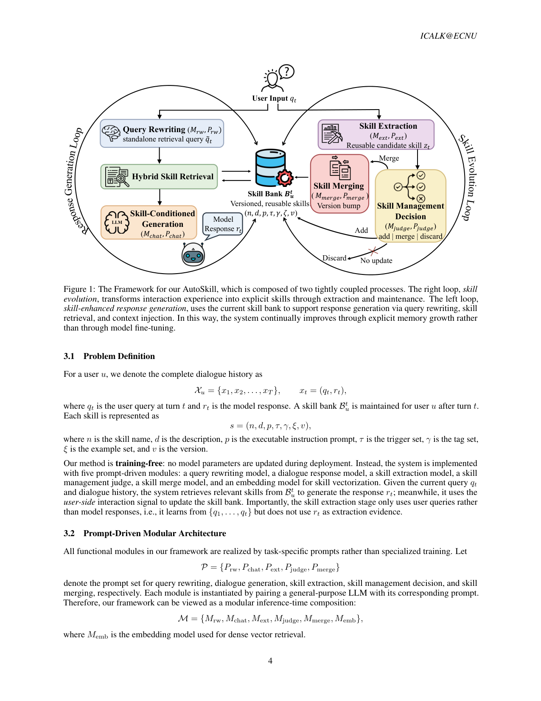
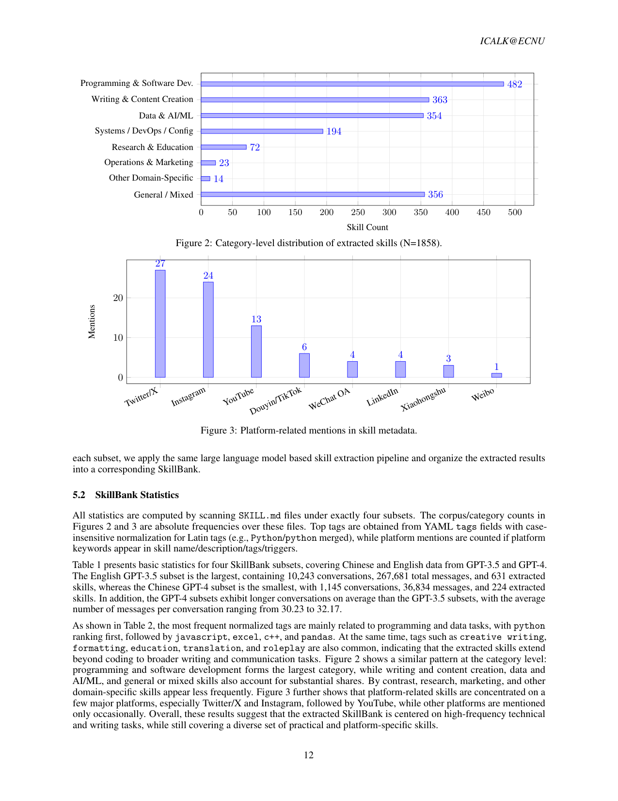

`autoskill | AutoSkill: Experience-Driven Lifelong Learning via Skill Self-Evolution | 华东师大 ECNU-ICALK + 上海 AI Lab(Yutao Yang, Junsong Li, Qianjun Pan… Jie Zhou/Kai Chen 通讯) | 2026-03(arXiv v2 2026-03-05)·Preprint(系统/框架报告)·v2 | 主题线 L3(技能自进化)+L2(记忆/个性化)·相关性 High`

> 一句定位:把用户在多轮对话里**反复重申的稳定偏好/约束/工作流**(别幻觉、按某写作规范、少用术语…),从"每次重说一遍的临时上下文"升级成**可检索、可编辑、带版本号的显式技能卡(SKILL.md)**;一个**完全训练-free、纯 prompt 驱动**的插件层(5–6 个 prompt 模块 + embedding),在线检索注入技能、后台异步抽取/合并/丢弃技能,不动底座参数,目标是"终身个性化 agent / 个人数字分身"。

---

## ══ 第一层:一眼看懂 ══

- 🟦 **TL;DR**:现状痛点——LLM 应用里用户一次次重申同样的偏好(降幻觉、机构写作规范、避免术语、固定工作流),但这些"交互经验"几乎从不被沉淀成可复用知识,于是每开一个新会话都要从头再教一遍。AutoSkill 提出一个**经验驱动的终身学习框架**:两条耦合回路——(1) **技能增强回答**(左环):收到 query→**改写成检索查询**(`Mrw`)→**混合检索**(dense 语义 sim + BM25 词法,加权 + 阈值 η + Top-K)→把命中的技能渲染成上下文注入→**技能条件化生成**回答(`Mchat`);(2) **技能进化**(右环):每轮后**只用用户 query**(不用模型回复,防污染)抽候选技能 `zt`(`Mext`)→检索最相似的已有技能 `s*`→judge 判 **add / merge / discard**(`Mjudge`)→若 merge 则做**带版本号的语义合并**(`Mmerge`,版本号 Bump)。技能统一表示为 `s=(name, desc, prompt, triggers, tags, examples, version)`,存成 `SKILL.md`,向量索引检索。**全程不更新任何模型参数**,在 WildChat-1M 上抽出 4 个 SkillBank 子集(中/英 × GPT-3.5/4),共 ~1858 技能。

- **最巧的一步**:**"技能抽取只用用户 query、不用模型回复 + retrieval-assisted 的 add/merge/discard 维护(只跟最相似的一个邻居比,而非全库)"**。前半句保证学到的是"用户稳定要求"而非"模型自己编的细节"(防自我污染);后半句让维护决策**可扩展**(judge/merge 只看 1 个邻居,不把全库塞进 prompt)且**靠版本合并而非复制**来防技能膨胀。抽掉"只用 query"→学到模型幻觉;抽掉"近邻维护"→要么技能爆炸式重复、要么 judge 需读全库不可扩展。⚠️【推断】这是设计上的"最巧",但本文**无消融实验**证明各组件必要性(见第三层),所以"最巧"是逻辑论证而非实验证据。

---

## ══ 第二层:为什么做 ══

- **研究背景**:LLM agent 从受控 benchmark 走向真实部署,一个反复出现的现象——用户跨会话不断重申稳定偏好与操作要求;记忆增强 agent / 长程对话研究已强调"保存用户特定信息"的重要性(MemoryBank/MemGPT/Mem0/A-MEM 等)。
- **解决的具体痛点**(§1):重复交互经验**极少被转化成可复用能力**——用户习惯和任务期望每个新会话都要从零重建。三类现有方案各有不足:① **参数更新/自进化**(SELF/LLM-self-improve/RISE/UPO)能改行为但**成本高、在频繁细粒度个性化场景难控制**;② **记忆类**(RAG/MemoryBank/Mem0/A-MEM)把过去交互**当"待检索的文本"而非"待操作化的行为"**;③ **agent/技能学习**(ReAct/Toolformer/Voyager/Reflexion)证明可复用策略有价值,但技能**隐式藏在 prompt/轨迹/策略里**,缺统一的检查/编辑/迁移/长期维护机制。
- **作者主张的核心立场**(§1):把重复交互经验**不只当记忆,而当"技能形成的来源"**;不存对话片段/偏好记录,而**抽象出可复用行为并结晶成显式技能 artifact**——因为结构化,技能可被检查/编辑/合并/版本化/跨会话复用。把"积累单元"从原始记忆记录抬升为**显式行为知识**。
- **动机链**:重复经验未沉淀 → 参数法贵且难控 / 记忆法只存文本不操作化 / 技能法隐式不可维护 → 需要一个机制**把经验转成显式、可复用、可维护的技能** → 训练-free 才能低摩擦贴在现有 LLM 栈上 + 纯 prompt 模块才能灵活换模型 → 加版本化 merge 才能"精炼而非复制"。为什么不用更简单的现成法?纯记忆检索(Mem0)无法表达"风格约束/工作流"这类**行为**;参数微调太重且每个用户都要训不现实。
- **与最近邻的 Δ**(§2,作者亲自摆位四线):
  - vs **ELL/StuLife**(经验驱动终身学习 benchmark):同样追求"从真实交互持续积累能力",但 AutoSkill **把能力结晶成显式 SKILL.md + 版本演进**,而非潜在记忆/隐式策略适配 → 可解释、可人工修订。
  - vs **自进化(SELF/RISE/UPO)**:它**不更新参数、不依赖隐式策略漂移**,而是把行为外化成结构化技能并靠显式 revision/merge/version 演进 → 更透明可控,尤其适合"偏好须跨会话稳定"的场景。
  - vs **长期记忆(Mem0/A-MEM/MemInsight)**:它把记忆**从文本记录抬升为行为单元**——对"稳定偏好/风格约束/重复工作流"这类难以用原始文本片段表达的东西更合适。
  - vs **技能学习(Voyager/Reflexion)**:它把技能当**一等公民 artifact**(可抽取/编辑/合并/版本/注入),而非隐式藏在 prompt/轨迹里。关键差异=**显式 artifact + 生命周期管理**。

---

## ══ 第三层:怎么做 + 靠不靠谱 ══

- **方法流水线**(§3,Fig.1,两条耦合回路):
  1. **技能表示**:\(s=(n, d, p, τ, γ, ξ, v)\) = 名/描述/可执行指令 prompt/触发集/标签集/示例集/版本号。物化为 `SKILL.md`(可附 scripts/references/assets)。
  2. **左环·技能增强回答**:① **Query Rewriting**(`Mrw`,Prw):判"延续同任务 or 切话题",把当前输入改写成一条**独立检索 query** \(q̃t\),解析指代、保留任务锚点、暴露格式/风格/领域等检索关键约束。② **Hybrid Retrieval**:对每个技能算 dense \(sim(emb(q̃),emb(s))\) + 词法 `BM25`,各归一到[0,1]后 \(Rel=λd̂+(1-λ)b̂\),按 Rel 排序取 **Top-K 且 ≥阈值 η**,无一达标则不增强直接答。③ **Skill-conditioned Generation**(`Mchat`,Pchat):把命中技能渲染成紧凑上下文 `Ct` 注入,生成 `rt`;系统策略明确"检索到的技能可能不相关,只在直接匹配当前意图时用,且永不向用户提及注入了技能"。
  3. **右环·实时技能进化**:① **Extraction**(`Mext`,Pext):**只在用户 query 窗口** \(Qt={q1..qt}\) 上抽候选 \(zt=(n,d,p,τ,γ,ξ,c)\)(c=置信度);原则——只抽"持久可复用的约束/策略/工作流/模板",不抽一次性请求/通用任务/过期约束/模型臆造细节;去掉 case-specific 实体只留可移植规则。② **Retrieval-Assisted Management**(`Mjudge`,Pjudge):候选**不直接入库**,先按 \(Relm=αd̂+(1-α)b̂\) 检索 Top-M 邻居取**最相似的一个** `s*`,judge 只比"候选 vs 这一个邻居"在四轴(job-to-be-done / 交付物类型 / 硬约束-成功标准 / 工具-工作流)上的异同,输出 **add / merge / discard**(+target_id+reason);有 discard 闸过滤通用/低信号/不可移植/库已覆盖的候选。③ **Versioned Merging**(`Mmerge`,Pmerge):若 merge,做**语义并集而非拼接**(保留原能力身份、只并入可复用非冲突增量、去重、不发明新标准),版本号 \(v(s')=Bump(v(s*))\)。④ 更新规则:add→并入 `zt`;merge→替换 `s*` 为 `s't`;discard→不变。
  4. **训练-free 终身学习**(§3.5):全部增益来自显式技能的构造/检索/精炼,**无任何参数优化**;在线 serving 路径(检索+生成,延迟关键)与后台学习路径(抽取+维护,异步不阻塞用户)分离。
  5. **系统层**(§4):核心 artifact = `SKILL.md`,存本地 SkillBank(`Users/<id>/` 个人 + `Common/` 共享 + `vectors/` 索引缓存),三种接口——**Python SDK**(ingest/search/render_context)、**Web UI**、**OpenAI 兼容反向代理**(`/v1/chat/completions` 等,drop-in;前台检索注入、后台异步进化)。支持离线 bootstrap(导入历史对话/文档/轨迹初始化非空 SkillBank)。

- **逐组件必要性**:⚠️【推断·重要祛魅】**全文没有方法层消融实验**(no ablation table)。各组件(query rewrite / hybrid retrieval / 只用 query 抽取 / add-merge-discard / versioned merge)的"必要性"全靠**逻辑论证 + prompt 设计说明**支撑,而非"去掉它掉多少分"的实验证据。依据:§5 实验部分只做**语料统计 + 案例研究**,无任务性能对比、无 baseline、无消融。这是本文作为"系统报告/框架描述"的根本性质,不是疏漏但须明确标出。

- **关键机制直觉**:技能=带触发条件的"可复用行为配方";左环像"带个性化记忆的客服"——先把用户这句话翻译成检索词、调出最贴合的几张技能卡、照着答;右环像"知识库管理员"——每轮事后看用户这句反复要求里有没有值得沉淀的稳定规则,有就跟最像的旧卡比一比,要么新建、要么并进旧卡升个版本、要么丢弃。版本号是"这张卡被反复精炼了多少次"的可见信号(案例里 `professional_text_rewrite` 已到 v0.1.34=精炼 34 轮)。

- **实验与证据**(§5,**注意:这是"经验分析"而非"性能评测"**):
  - **数据集/设置**:**WildChat-1M**(真实多语 ChatGPT 交互),只留 >8 轮对话,按 语言×模型族 切 4 子集:中/英 × GPT-3.5/GPT-4。对每子集跑同一套 LLM 抽取流水线建 SkillBank。
  - **核心呈现的"结果"=语料/技能规模统计 + 分布**:Table 1(英文 GPT-3.5 最大:10243 对话 / 267681 消息 / 631 技能;中文 GPT-4 最小:1145/36834/224;GPT-4 平均轮数更长 30–32)。Table 2 top 标签以编程/数据为主(python 98、javascript 38、excel 36、c++ 35、pandas 30…),也含 creative writing/formatting/translation/roleplay。Fig.2 类目分布(N=1858:编程软件开发 482 最大,写作 363,数据 AI/ML 354,通用混合 356,系统/DevOps 194,研究教育 72,运营营销 23,其他 14)。Fig.3 平台提及集中在 Twitter/X(27)、Instagram(24)、YouTube(13)。
  - **版本号作为"迭代精炼"的信号**(§5.2):同一技能版本号差异(英文 rewrite v0.1.34 vs 中文心理咨询师 v0.1.0)被用作"versioned maintenance 支持持续精炼而非复制"的**定性证据**。
  - **案例研究**(§5.3):2 张技能卡(中文"顶级心理咨询师"=软性交互行为;英文 `professional_text_rewrite`=刚性任务执行,含强 anti-pattern 约束),论证同一 artifact 格式能同时承载软行为+硬流程、支持多语个性化、显式可编辑透明。
  - **支撑核心主张的关键证据是哪个?**【推断】最硬的是 **Fig.2 类目分布 + Table 1 规模**——证明该流水线**确实能从真实交互大规模抽出多样、覆盖广的技能**(可行性/规模性主张)。但**没有任何实验回答"注入这些技能后回答质量/任务成功率提升了多少"**——这是最核心却**缺席**的证据。依据:全篇无 win-rate / accuracy / human-eval / vs-baseline。
  - **baseline 公平性**:**N/A——本文无 baseline 对比**。
  - **"看着丰富但没答核心问题"的风险**【推断】:大量篇幅在系统架构(SDK/Web UI/proxy/Docker/存储布局)与语料统计,营造"完整可部署系统"印象,但**"技能是否真的让 agent 变好"这个核心因果主张未被实验验证**。版本号高=精炼多次,也只能说明"被反复 merge",不能直接等价于"回答质量提升"。

- **假设与失效边界**:
  - 【原文】抽取**只用用户 query**(显式假设:用户 query 是稳定偏好的主要证据,assistant turn 仅作上下文);只保留 >8 轮对话(短交互不足以稳定归纳技能);训练-free(部署期不更新参数)。
  - 【推断】重度依赖**底座 LLM 本身够强**来执行自然语言技能 prompt(技能是 markdown 指令,弱模型可能执行不动);依赖**抽取/judge/merge 这几个 prompt 模块的判断质量**——judge 只看 1 个最近邻,若检索没召回真正同类的旧技能,会误判 add 造成隐性重复。依据:§3.4 近邻维护只取 arg max 一个 s*。
  - 【推断】**个性化/偏好场景**为主战场(WildChat 是开放对话);在需要"任务执行技能/工具调用技能"的 agentic 场景上**本文未给证据**(虽 abstract 提 tool use,但案例与语料偏写作/对话/代码片段偏好)。依据:§5 数据与案例性质。
  - 【推断】技能"discard 闸 + 版本合并"控膨胀,但**无显式技能淘汰/过期机制**(只有 merge 去重),长期超大规模 SkillBank 的检索质量与冗余如何随时间退化未评。依据:§4.3 lifecycle 只述 add/merge/discard,无 forgetting。

- **祛魅总结**:
  - 真贡献(硬货):① **把"重复交互经验→显式可编辑版本化技能(SKILL.md)"这条范式具体化为一个完整、可部署的训练-free 系统**(SDK+Web+OpenAI 代理+Docker,代码真实开源且工程成熟,STATUS.md 显示已迭代 30+ 轮),这是工程上的实打实贡献;② **"抽取只用 query 防自我污染" + "近邻 add/merge/discard + 版本合并控膨胀"** 是一套清晰、可直接复用的"经验→技能"治理配方;③ 提供了一个**真实大规模语料(WildChat)上技能可被抽出的可行性画像**。
  - 包装/营销成分【推断】:(a) **"lifelong learning / self-evolution" 名号偏重**——实际是"prompt 驱动的显式技能 CRUD + 检索注入",无参数学习、无在线 RL、无消融、无性能验证,严格说是**一个工程系统而非一个被验证的学习方法**;(b) abstract 暗示能提升 agent 能力(reasoning/tool use/decision),但实验只到"能抽出技能 + 案例展示",**未证明下游收益**;(c) "personal digital surrogate"等愿景性表述远超实验所及。依据:全篇无下游性能实验、无消融、无 baseline。**定位应为:一篇高质量的"系统/框架"论文(system paper),而非"方法+评测"论文。**

---

## ══ 结构化抽取 ══

- 🎯 **机制速览 6 轴**:

| 学什么信号 | 改什么 | 何时改 | 免梯度? | 记忆-技能生命周期 | 防遗忘机制 |
|---|---|---|---|---|---|
| **用户交互信号**(仅用户 query 序列作抽取证据,assistant 回复只作上下文;**无环境 reward、无 RL、无人工标注**) | **改技能库(skill bank)= prompt/触发/示例文本 + 版本号**(LLM 文本编辑);**底座模型参数完全不改**;运行期改的是"注入给 LLM 的技能上下文" | **抽取/维护=每轮后(per-turn)异步后台**(与前台 serving 解耦);**检索注入=在线 per-request(test-time)** | **是(全免梯度)**——5–6 个纯 prompt 模块 + embedding;无任何参数优化 | 写入=`Mext` 从用户 query 抽候选→judge add/merge/discard→merge 时语义并集+版本 Bump;检索=hybrid(dense+BM25)Top-K 且\(≥η\);遗忘=**无显式淘汰**(仅 discard 闸 + merge 去重防膨胀);共享=`Common/` 共享技能库 + SKILL.md 标准化表示**跨 agent/用户/任务迁移** | **隔离 + 版本化"refine 而非复制"**:个人技能(`Users/<id>/`)与共享技能(`Common/`)分层隔离;版本合并保留原能力身份、避免重复 artifact;底座冻结天然不遗忘。**无几何共识/merging-into-weights/KL 投影**(因不碰参数) |

- ⑦ **开源代码 + 框架/harness**:**已开源** https://github.com/ECNU-ICALK/AutoSkill(已 clone,184MB,含完整 SDK 源码 + SkillBank artifacts;**未超 500MB 上限,完整克隆成功**)。**框架 = 无外部 RL/训练框架(无 veRL/TRL/OpenRLHF/LLaMA-Factory/swift…),纯自研轻量 SDK**——`pyproject.toml` 的 `dependencies=[]`(零硬依赖,刻意轻量化)。实现要点(已核实仓库源码):`autoskill/` 核心 SDK(client/models/render/skill_provenance/config)、`autoskill/embeddings/`(可插拔 provider:openai/bigmodel/generic/hashing/**none=纯 BM25 回退**)、`autoskill/management/stores/`(**自研 BM25 索引** + 向量存储,默认 `bm25_weight=0.1`)、`AutoSkill4Doc/`(文档抽技能)、`AutoSkill4OpenClaw/`(接入 OpenClaw,JS adapter)、OpenAI 兼容反向代理 + Web UI + Dockerfile/docker-compose。测试齐全(62 Python + 67 JS adapter,STATUS.md)。【原文 §4 + 仓库实测确认】
- 💰 **资源/成本与可扩展性**:**无训练成本**(训练-free,底座不动)。运行成本=每轮若干次 LLM API 调用(rewrite+chat 在前台关键路径;extract+judge+merge 在后台异步,不阻塞用户延迟)+ embedding 调用 + 本地向量/BM25 检索。**正文未给具体 token/算力/延迟数字**(无成本表)。可扩展性卖点:维护决策只比 1 个最近邻(不读全库)、serving/learning 路径分离、本地 SkillBank 可摊销。【原文 §4.4/§4.7;具体数字"原文未说明"】
- 🎯 **对"探索-巩固(TSRD/MTP+OPD)"idea 对标**:**可借组件 + 部分竞品 + 明显缺口**。可借:① **"抽取只用用户 query、不用模型自身输出作证据"防自我污染**——可直接迁到 TSRD 巩固阶段(避免把教师/自身的错误恢复路径当成可复用知识沉淀);② **近邻式 add/merge/discard + 版本化语义合并**是一套现成的"经验→可复用知识库"治理机制,可用于管理"path-recovery 技能/foresight 模式库",版本号天然给"某恢复策略被精炼几次"的可观测信号;③ **serving 与 learning 路径分离 + OpenAI 兼容代理**的工程范式,对把 TSRD 做成"贴在现有模型前的巩固层"有参考价值。竞品面:与 TSRD 都做"经验→技能/自进化",但 AutoSkill 是**纯 prompt 层、训练-free、走个性化偏好**,完全不碰参数与推理路径。缺口(对你最关键):AutoSkill **(a) 不触及模型能力本身演进**(底座冻结);**(b) 无 MTP 式前瞻探测**;**(c) 无任何下游性能/巩固有效性的实验验证**(只有语料统计)——你的 MTP-foresight + OPD 参数蒸馏恰好补"能力内化"与"前瞻探测",且你**必须做下游性能+消融**才能避免落入它"系统完整但因果未验证"的同一短板。反向,它的"显式技能卡 + 版本治理"可作为 TSRD 的**外部可解释巩固层**与 ablation 对照基线(纯 prompt vs 参数蒸馏)。
- 🔭 **开放问题/未来方向**:
  - 【原文】§6 较空泛:主张 AutoSkill 指向"靠外部技能演进而非改参数"的可扩展终身个性化路径,鼓励继续往"个人数字分身"方向走;未列具体技术 open problem。
  - 【推断】(a) **缺失的下游评测**——技能注入对回答质量/任务成功率的因果收益亟需做(win-rate/human-eval/vs-baseline);(b) **技能淘汰/过期机制**(防 SkillBank 长期膨胀、陈旧技能污染检索);(c) **judge 只看单一最近邻**易漏召回造成隐性重复,可升级为多邻居/聚类维护;(d) **抽取/维护模块本身可学习化**(当前全靠固定 prompt + 底座判断);(e) **agentic/工具调用场景**的技能(当前偏对话/写作偏好)。依据:§5 无性能实验、§4.3 lifecycle 无 forgetting、§3.4 单近邻维护、全系统纯 prompt。

- 🖼 **关键图 top-2**:

  
  这是**原文 Figure 1**(方法主图,p4)。左环=Query Rewriting→Hybrid Skill Retrieval→Skill-Conditioned Generation 出回答;右环=Skill Extraction→Skill Management Decision(add/merge/discard)→Skill Merging(版本 Bump),中央是 Skill Bank \(Bᵘₜ\)(版本化可复用技能 \((n,d,p,τ,γ,ζ,v)\))。选它因为一张图说清本文全部核心:**两条耦合回路 + 技能七元组表示 + add/merge/discard 决策 + 版本演进 + 全程不微调底座**,是理解该系统的唯一必读图。

  
  这是**原文 Figure 2 + Figure 3**(经验分析主图,p12)。Figure 2:抽出的 1858 个技能按类目分布(编程软件开发 482 最多,写作 363,数据 AI/ML 354,通用混合 356…);Figure 3:平台相关技能集中在 Twitter/X、Instagram、YouTube。选它因为这是本文**唯一的实证证据形态**——展示该流水线确实能从真实大规模对话里抽出多样、覆盖广的技能(可行性/规模性画像),同时直观暴露本文"只统计能抽出什么、不评测抽出后好不好"的证据性质(理解其作为 system paper 定位的关键)。
