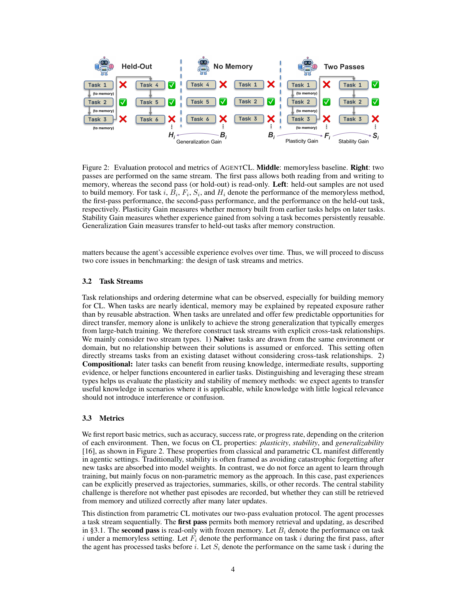
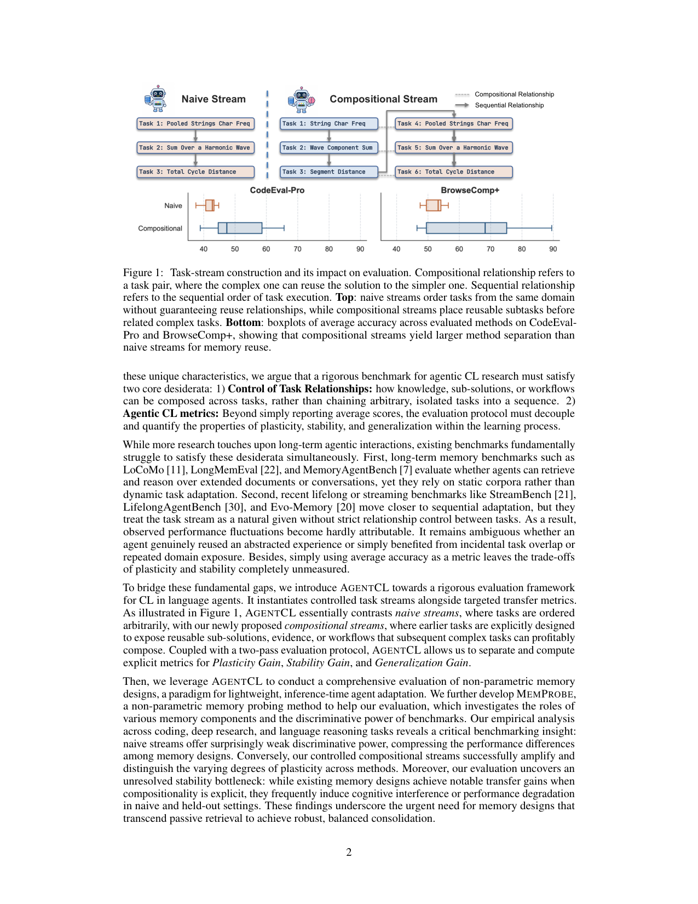

bench_agentcl | AGENTCL: Toward Rigorous Evaluation of Continual Learning in Language Agents | Ohio State (Yu Su/Huan Sun 组) + JHU + Intuit AI Research | 2026-06, arXiv 2606.02461 | 主题线 L7 评测(CL 严格评测 + 非参数记忆诊断)· 相关性 High(评测维度锚 + 直击「记忆设计可塑性 vs 稳定性」) | 配套 benchmark(脚注 1 指向资源)

> [light 档] benchmark 类 → A 栏抽其**评测维度**。核心卖点是「受控组合式任务流 + 迁移增益三指标」,并用它诊断非参数记忆设计。

══ 第一层:一眼看懂 ══
- 🟦 **TL;DR**:【原文 Abstract/§1】这是一套**严格评「语言 Agent 持续学习」的评测框架 AGENTCL**。痛点:现有 benchmark 要么只测「长上下文检索/推理」,要么(近期 lifelong benchmark)用**朴素任务流(naive streams)**——任务间没有受控的复用关系,导致「说不清 agent 到底学到/复用了什么」。AGENTCL 的关键设计:**故意构造「组合式任务流(compositional streams)」**——让前面任务的子解/证据/工作流在后面任务里**确定可复用**,并与「不保证可复用」的朴素流对照。它用这套流去评**非参数记忆设计(non-parametric memory)**,并提出 **MEMPROBE** 探针法(存交互/洞见/技能,在 consolidation 时过滤不可靠经验)来诊断记忆设计选择如何影响 CL。发现:朴素流几乎区分不出不同记忆设计的好坏,而**受控(组合)流能清楚拉开它们的可塑性差距**;朴素流与 held-out 设置常只有微弱增益、甚至暴露「记忆反而带来退化(memory-induced degradation)」。结论:需要更强的、能**平衡可塑性与稳定复用**的记忆设计。
- **最巧的一步**:【推断·依据 Fig.1/Fig.2 + 公式(1)(2)】把任务流设计成**「组合式(前解必可复用)」并配「两遍同流(two-pass)」协议**。抽掉「组合可复用 + 两遍」这一设计,就回到朴素流——记忆好坏被任务难度噪声淹没(论文实测朴素流方法间标准差大但区分度低);正是「确定可复用 + 同流第二遍」让「记忆是否真把经验用上了」变成可干净测量的差值(plasticity gain)。

══ 第二层:为什么需要这评测 ══
- **研究背景**:【原文 §1】语言 Agent 在每个任务上花大量推理时间,但「单次 episode 攒下的经验在下一次往往没被用上」——密集推理**不会自动复利成长期能力**。这激出语言 Agent 的 CL 问题:给一条任务流,agent 能否积累可复用经验、成功迁移到未来环境、并在记忆规模增长时仍保持鲁棒?
- **解决的具体痛点**:【原文 §1】两个评测缺陷:① **长上下文记忆 benchmark**(LoCoMo、LongMemEval、MemoryAgentBench)只测「在长文档/对话上检索+推理」,用**静态语料**而非动态任务适应;② **近期 lifelong/streaming benchmark**(StreamBench、LifelongAgentBench、Evo-Memory)更接近序列适应,但**把任务流当自然给定、不严格控制任务间关系**——导致观测到的性能波动**无法归因**:说不清 agent 是真复用了抽象经验,还是只是碰巧任务重叠/同域重复曝光。此外只报平均准确率,**plasticity 与 stability 的权衡完全没被度量**。
- **相关工作 & 各自不足**:【原文 §1】上述两类已点名。本文提出严格 agentic CL benchmark 须同时满足两条:① **控制任务关系**(知识/子解/工作流如何跨任务组合,而非把任意孤立任务串起来);② **agentic CL 指标**(超越平均分,解耦量化 plasticity/stability/generalization)。现有 benchmark 无法同时满足。
- **动机链(一条逻辑链)**:【推断·依据 §1】要严格测「复用」→ 任务间必须有**确定的可复用关系**(否则增益归因不清)→ 现有流是「自然给定」的朴素流,复用关系不确定 → 故**人为构造组合式流**(前面任务的子解必可被后面复杂任务复用),并与朴素流对照 → 再配「同流跑两遍(two-pass)」协议,把「记忆是否真把经验用上」做成可干净测量的差值 → 由此定义 PG/SG/GG 三指标。为什么不用 LifelongAgentBench?因为它任务流无严格关系控制,plasticity 差异被压缩、测不出记忆设计优劣。
- **与最近邻工作的 Δ**:【推断·依据 §1/Fig.1】与最像的 LifelongAgentBench(同为序列适应、测记忆/回放)相比,关键差异=**显式构造「组合可复用 + 同流两遍」的受控流**,而非朴素串行流。为什么有用?论文实测:组合流上方法间标准差被放大(见第三层数字),朴素流上被压缩——只有受控流能把不同记忆设计的可塑性拉开,这是 LifelongAgentBench 的朴素串行做不到的。

══ 第三层:怎么评 + 关键发现数字 + 局限 ══
- **评测流水线**:【原文 §3/Fig.2】① 构造两类流——Compositional(前任务暴露可复用子解/证据/工作流,放在依赖它的复杂任务之前)vs Naive(同域但不保证复用);② **two-pass 协议**:第一遍边做边攒记忆(read-write),第二遍用冻结记忆复跑同流(read-only),另设 held-out 只读评测;③ 对任务 i 记四个表现:\(B_i\)(memoryless 基线)、\(F_i\)(第一遍)、\(S_i\)(第二遍)、\(H_i\)(held-out);④ 据此算三增益。
- **三指标(逐组件必要性)**:【原文 §4】**PG = F − B**(前序经验是否帮到当前任务=学得进/可塑性);**SG = S − F**(同流第二遍相对第一遍,经流级 consolidation 后记忆是否变成持久可复用=稳定性,负值=被压缩/难检索/被记忆干扰淹没);**GG**(用 H 衡量,记忆是否泛化到完全不同来源、未配对的 held-out 任务)。三者缺一就回到「只报平均分、权衡不可见」。
- **MEMPROBE 探针法**:【原文 §5.2】retrieve→solve→consolidate 循环:解题前检索语义相似的历史 episode 当参考;解后**校验响应**,把可靠经验固化进三类视图——interaction memory(具体轨迹/终答)、insight memory(任务模式/失败模式)、skill memory(过程级抽象/可复用片段);**语法检查器丢无效输出 + LLM judge 过滤不可靠交互历史**后才写入。这一步「consolidation 时过滤」是诊断核心。
- **关键发现 + 具体数字**:【原文 §5.3, Table 2/3/10/11】① **受控流才有区分力**:CodeEval-Pro 上复杂任务准确率的方法间标准差,组合流两遍为 **9.4 / 8.8**,朴素流仅 **3.0 / 1.9**;BrowseComp+ 组合流 **14.9 / 16.0** vs 朴素流 **2.3 / 5.7**;MMLU-Pro(朴素)仅 1.7/1.8——证明「任务关系控制是区分力的关键因子,不是设计细节」。② **朴素流 PG 多为非正**、适合做稳定性测试:朴素 CodeEval-Pro 上 SG 从 −3.5 到 +4.2(有的方法被 consolidation 帮、有的被伤),BrowseComp+ 朴素流 SG 摆幅更大 −11.0 到 +11.0。③ **held-out 泛化差**:120 个 HumanEval-Pro held-out 上,memoryless ReAct 反而最强(72.5),多数记忆方法略低于它(轻微干扰),MEMPROBE 最接近(70.8,因它过滤了无关记忆)——强证据:弱相关任务积累的记忆**不会自动迁移,反而引入 mild interference**。
- **被评基线**:ExpRAG、ReMem、MEMPROBE 等非参数记忆设计 + memoryless ReAct 对照。领域:Coding(CodeEval-Pro/BigCodeBench-Lite-Pro)、Deep Research(BrowseComp+)、Language Understanding/Reasoning(MMLU-Pro)、BabyAI/ScienceWorld。
- **假设与失效边界**:见下方原有「假设」条(只评非参数记忆;任务流需「人为构造可复用关系」,自然任务上复用关系本就不确定,PG/SG 的可识别性会下降)。
- **祛魅总结**:【推断】真贡献=**把「agentic CL 是否真复用了经验」做成可干净归因的受控实验 + PG/SG/GG 三指标 + memory-induced degradation 的实证**(held-out 上 memoryless ReAct 反超),这对「不能囫囵巩固经验」是迄今最干净的反例证据。包装/局限:MEMPROBE 是诊断探针而非要打榜的强方法(作者定位是 probing);整套受控性来自人工构造的组合关系,这既是它的区分力来源、也是其人工性局限;且只覆盖非参数记忆,未触「写回权重」的巩固。

══ 机制速览 6 轴(benchmark → 它在测/支持什么) ══
| 维度 | 内容(benchmark 视角) |
|---|---|
| 学什么信号 | 测 agent 从**前序任务经验(交互/证据/工作流)**复用的能力;MEMPROBE 还显式存「洞见 insights / 技能 skills」 |
| 改什么 | 评测对象是**非参数记忆**(改记忆/经验库,不改参数);MEMPROBE 在 consolidation 时筛经验 |
| 何时改 | 沿任务流**在线累积**;协议含「同一流跑两遍(two-pass)」:第一遍边做边攒记忆,第二遍用记忆复跑 |
| 免梯度? | **是**(评的是非参数记忆设计,免梯度) |
| 记忆-技能生命周期 | 完整诊断:写入(交互/洞见/技能)→ **consolidation 时过滤不可靠经验**(MEMPROBE 的核心动作)→ 检索复用;并把「记忆反而拖累(degradation)」当成可观测失效 |
| 防遗忘机制 | 用 **Stability Gain** 直接度量「第二遍是否还稳得住/不被噪声经验带偏」;主张「可塑性 vs 稳定复用」需平衡 |

══ 抽取的评测维度(A 栏核心) ══
**三个迁移增益指标(对任务 i,B/F/S/H = memoryless / 第一遍 / 第二遍 / held-out 的表现):**
1. **Plasticity Gain(可塑性增益)** PG_i = F_i − B_i:前序经验是否帮到当前任务(学得进)。
2. **Stability Gain(稳定性增益)** SG_i = S_i − F_i:同流第二遍相对第一遍,记忆是否稳定可复用(不退化)。
3. **Generalization Gain(泛化增益)** GG:记忆是否能泛化到**未参与建库的 held-out 任务**(用 H_i 衡量)。
**任务流二分(核心受控变量)**:Compositional(组合可复用)vs Naive(不保证可复用);另有 held-out 设置。
**领域覆盖**:Coding(从 CodeEval-Pro / BigCodeBench-Lite-Pro 构造)、Deep Research(BrowseComp+)、Language Understanding/Reasoning。
**被评的记忆基线**:ExpRAG、ReMem、MEMPROBE(论文报 PG 分别 +17.7 / +13.5 / …,见 Table 10)等非参数记忆设计。
**关键发现**:naive 流区分度差;compositional 流才能拉开 plasticity;held-out/naive 常暴露 memory-induced degradation。

══ 关键图 top-2 ══

这是**原文 Figure 2**(p4)。选它因为它把评测协议讲透:中间是 memoryless 基线、右边「同一流跑两遍」,由此定义 Plasticity/Stability/Generalization 三个增益。这是本 benchmark 最核心的「怎么测」图。

这是**原文 Figure 1**(p2)。选它因为它图解了核心受控变量——「组合关系(compositional)」让前序子解在后续任务确定可复用,与朴素流对照,直观说明为何只有受控流能区分记忆设计优劣。

══ 假设与失效边界(一句) ══
【推断·依据其只评非参数记忆 + 任务流需「人为构造可复用关系」】隐含假设是「CL 能力可在『确定可复用的组合式任务流』上、就非参数记忆设计被干净度量」;失效边界在于**参数级持续学习**(不在评测范围)与**真实开放任务里复用关系本就不确定/难标注**——其优势(受控可复用)同时是其人工性来源,自然任务上 PG/SG 的可识别性会下降。

══ 对"探索-巩固"idea 对标(一句) ══
**强支撑 + 可借组件(指标 + 诊断)**:这是与本 idea 最贴的评测——它的**「Plasticity(学得进)/ Stability(复用稳)/ Generalization(泛化)」三指标**几乎就是 TSRD「探索带来增益、巩固不退化、且能迁移」的现成度量;MEMPROBE 的**「consolidation 时过滤不可靠经验」**与本 idea「巩固前先筛选/蒸馏经验」同构,且其「记忆反而退化(memory-induced degradation)」的发现强化了「不能囫囵巩固」的论点。可直接借作 TSRD 的评测面与对照基线;唯一缺口是它仍停在非参数记忆、未覆盖「写回权重」的巩固。
