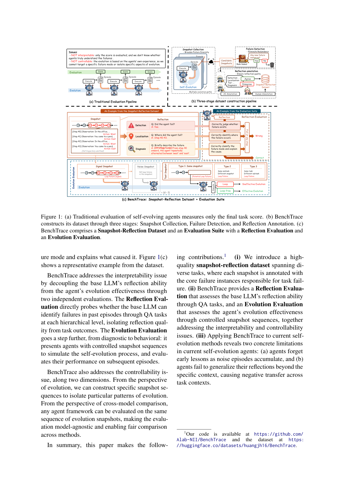
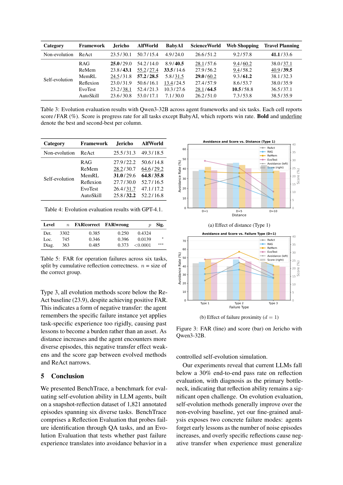

`bench_benchtrace | BenchTrace: A Benchmark for Testing Reflection Ability and Controlled Evolution in LLM Agents | U-Tokyo + Kyoto U + NII(Huang/Cheng/Jiang/Aizawa) | 2026-05·arXiv·2605.29225 | L?(自进化能力评测) · 相关性 High(直接评"反思质量+受控演化",对"探索-巩固"高度对标)`

> light 档(benchmark 类)

══ 第一层:一眼看懂 ══
- 🟦 **TL;DR**:自进化 agent 靠"反思过去失败"变强,但现有评测有两个盲区——**只看任务分**(不知道反思质量到底如何),且**只能用 agent 自己跑出的 episode**(没法定向触发某种特定失败模式)。BenchTrace 解决之:基于 **1,821 条标注 episode 的 snapshot-reflection 数据集**(横跨 6 个任务),拆成两套评测——**Reflection Evaluation**(用定向 QA 探"能否识别失败":检测→定位→诊断三段)+ **Evolution Evaluation**(在受控自进化模拟里测"过去失败经验能否转成回避行为")。提出新指标 **FAR(failure avoidance rate,失败回避率)**。实测 Qwen3-32B 与 GPT-4.1 端到端反思通过率都 <30%,**诊断是主瓶颈**;自进化方法普遍提升 FAR 但**随噪声 episode 累积会遗忘早期教训**,且反思**难泛化**(跨任务上下文出现负迁移)。【原文 Abstract/§1】
- **最巧的一步**:**把"反思"从 base LLM 的执行里解耦,改用 snapshot(轨迹快照)+ 定向 QA 来探针式评测**——给定一个已标注失败的快照,直接问"失败了吗/在哪/为什么",从而把"反思质量"变成可测、可定向、模型无关的量。抽掉"snapshot + 标注"这一步,就退回到只能看最终分、无法定向的老路。【原文 §1, Fig.1(c)】

══ 评测维度(A 栏:抽其评测维度)══
- **数据集规模**:1,821 条标注 episode 的 Snapshot-Reflection Dataset;6 个任务环境 = Jericho(Jer.)、ALFWorld(AW)、BabyAI(BAI)、ScienceWorld(SW)、BabaIsWorld/BWS、GroupTravelPlanning(GTP)。各任务难度 Easy/Med/Hard 不一;平均步数从 6 到 107 不等。【原文 Table 1】
- **Reflection Evaluation 三段维度**(定向 QA):
  1. **Detection(检测)**:agent 是否失败了?(是/否)
  2. **Localization(定位)**:失败发生在哪一步?(如 Step 40–43)
  3. **Diagnosis(诊断)**:失败模式归类 + 解释成因(如 [Strategy/Loop] 在 office↔yard 间来回打转)。
  端到端通过=三段全对;实测两模型均 <30%,诊断为主瓶颈。【原文 Fig.1(c), §5】
- **Evolution Evaluation 三类测试快照**(受控自进化,核心创新):
  · **Type 1**:同一 snapshot 再来(同上下文回避);
  · **Type 2**:**同任务另一 snapshot**(含同类潜在失败)——测同任务泛化;
  · **Type 3**:**另一任务的 snapshot**(含同类潜在失败)——测跨任务泛化/负迁移。
  每类用 signal snapshot(确有该失败)与 noise snapshot(无该失败)区分有效演化 vs 无效演化。【原文 Fig.1(c), Table 1】
- **核心指标**:**FAR**=测试用例中 agent 成功回避目标失败实例的比例;**Score**=跨快照的平均归一化任务进度(传统指标)。【原文 §4.x】
- **关键发现维度**:① 诊断是反思瓶颈;② 噪声 episode 累积→遗忘早期教训;③ 跨任务负迁移(Type 3);④ 相关分析:**只有"完全正确的反思"才与高 FAR 强相关**(部分对没用)。【原文 Abstract/§6】

══ 第二层:为什么需要这个 bench(写透) ══
- **研究背景**:自进化 agent(self-evolving)区别于"部署后静态"的传统 LLM——它**跨 episode 持续从经验/失败中变强**,主流走**非参数(non-parametric)**路线:把失败教训存进外部记忆(Reflexion/ReMem/MemRL)、迭代改写 guiding prompt(EvoTest)、或攒可复用技能 artifact(AutoSkill)。一个自进化 agent 的最终表现取决于两个因子:**①base LLM 反思失败的能力,②演化算法本身的有效性**。【原文 §1, §2.1】
- **它要解决的具体痛点(现有评测的两大盲区,Fig.1a)**:
  · **可解释性盲区(interpretability)**:现有 bench **只测最终任务分是否上升**,无法把"base LLM 反思能力"和"演化算法有效性"两个因子拆开——分涨了不知道是模型真懂了失败,还是算法蒙对了。
  · **可控性盲区(controllability)**:现有评测靠 **agent 自己跑出来的 episode**,它遇到什么失败经验完全不可控,**无法定向隔离某一种失败模式 / 某一个演化侧面**来研究。【原文 §1】
- **相关工作 & 各自不足**:
  · 自进化方法两族:**instance-based**(存 episode 按需检索:RAG 语义检索 / ReMem 元推理 / MemRL 价值检索)与 **abstraction-based**(把失败蒸成 verbal lesson:Reflexion 自批评;EvoTest 同时改记忆+改 prompt;AutoSkill 攒版本化技能)。
  · 现有 bench 两类:**environment-based**(文字游戏 Jericho、家务 ALFWorld、网格 BabyAI、科学实验 ScienceWorld)与 **information-based**(Evo-Memory 的 QA/工具流、MemoryArena 跨 session)。
  · **共同缺陷**:全都用**聚合 outcome 指标**,且**没有"agent 本应从过去失败学到什么"的 ground-truth 标注**,所以无法直接度量反思质量。【原文 §2.1, §2.2】
- **动机链**:现状=自进化看似有效但只看分 → 缺陷=分涨≠真懂失败 + 无法定向触发失败 + 没有反思的 ground truth → 所以必须**造一个带标注的 snapshot-reflection 数据集**,把"反思"从执行里抽出来用定向 QA 探针式量化(解可解释性),并**人工构造受控的 snapshot 序列**来定向触发某失败模式(解可控性)。为什么不沿用旧 bench?因为旧 bench 既无标注、又无法控制 agent 遇到的失败——两个盲区是结构性的,加指标补不上。【原文 §1】
- **与最近邻的 Δ**:相比 Evo-Memory / MemoryArena(同为自进化记忆 bench),BenchTrace 的关键差异是**引入 ground-truth reflection 标注 + signal/noise snapshot 的受控演化模拟 + 新指标 FAR**——前者只能回答"分涨没涨",后者能回答"反思对不对、对的反思有没有转成回避行为、为什么没转成"。这个差异有用,因为它把"自进化为何失败"从黑箱变成可定位(诊断瓶颈 / 遗忘 / 负迁移三类病因可分别测出)。【原文 §1, §4.3】

══ 第三层:怎么评 + 关键发现数字 + 靠不靠谱 ══
- **评测构造流水线(Fig.1b 三阶段)**:① **Snapshot Collection**——多模型×多自进化框架反复刷题,演化卡住时**人在环介入**引导继续,所有 episode 存为候选(这步专门制造"单 agent 自然遇不到的深层失败",Table 6 显示覆盖率比单 agent +13%~+323%);② **Failure Detection**——人工先看小批样本归纳失败模式→写成 rule-based 检测器→过滤候选,**只保留引入新失败实例的**(防同一失败被过度采样);③ **Reflection Annotation**——每个 snapshot 由 **Claude-Sonnet-4.6 + Gemini-2.5-Flash 双 AI 独立标注**(localization 步范围 + diagnosis 失败模式&一句病因 + tier:core/marginal),**所有 core 失败由人类专家裁决冲突**。【原文 §3.2】
- **两套评测怎么咬合**:
  · **Reflection Evaluation(对 base 模型)**:Detection/Localization/Diagnosis 三问**独立评测**,且**给后一级喂 oracle 输入防误差级联**。指标:Det→Accuracy;Loc→Similarity(预测范围准度)+Recall(覆盖 GT,均按 Jaccard 匹配);Diag→Mode-Acc + Token-F1 + LLM-Judge(0/0.5/1)。【原文 §3.3.1】
  · **Evolution Evaluation(对 agent 框架)**:核心设计=一个 **signal snapshot s0(含失败 f0)+ d-1 个 noise snapshot(不含同模式失败)**组成演化序列,test snapshot **截断在 fd 将发生前一步**;两个旋钮:**distance d**(噪声多少→测遗忘)与 **failure proximity Type1/2/3**(同 snapshot/同 subtask 另一 snapshot/同 task 另一 subtask→测泛化)。【原文 §3.3.2】
- **逐组件必要性**:① snapshot 标注——没它 Diagnosis 无 GT,反思质量不可测;② signal/noise 区分——没它无法判定"回避是真学到 f0 还是巧合";③ 截断在 fd 前——没它无法保证 agent 真面对会触发 fd 的环境(无效测试);④ oracle 输入级联隔离——没它三段误差混在一起,定位不到瓶颈。这些是设计约束而非可消融模块,论文以构造正确性论证,非传统 ablation。【原文 §3.3】
- **关键机制 FAR**:**FAR = 测试中 agent 在截断点后成功回避目标失败实例 fd 的比例**。直觉:传统 score 在难任务上几乎不动(Jericho 全方法 score 只跨 2 分),但 FAR 能跨 13 分——因为难任务想涨分要一长串正确操作几乎不可能,而"成功回避一个已见过的失败"本身就是有意义的自进化信号,FAR 正好捕捉 score 漏掉的演化信号。FAR 可靠性经人/LLM 标注验证:**81.8% 准确、Cohen's κ=0.538**。【原文 §3.3.2】
- **实验与证据(支撑核心主张的关键数字)**:
  · 规模:1,821 标注 snapshot,6 任务(Jer./AW/BAI/SW/BWS/GTP),evaluation suite = 4,391 reflection items + 3,564 evolution test cases。【Table 1】
  · **反思瓶颈在诊断**:Det 几乎满分(只 6% 错),但 **Qwen3-32B 与 GPT-4.1 端到端通过率均 <30%**,wrong diagnosis 占错误最大份额;localization 错虽少但更阴险(定位错→诊断错→误导后续)。GPT-4.1 全面优于 Qwen3-32B 但仍 <30%。【Table 2, Fig.2】
  · **演化即遗忘**:Fig.3(a),多数方法 **FAR 在 d=10 显著低于 d=1**;d=1/5 时 EvoTest(检索+改 prompt)最高,但 d=10 时朴素检索失效、**ReMem(选择性巩固记忆)在 Type1 d=10 达最高 36.4%**——说明"有原则的记忆管理"是长距离自进化的关键。【原文 §4.3.2】
  · **跨任务负迁移**:Fig.3(b),score 从 Type1 单调降到 Type3;d=1 Type3 时**所有演化方法 score 都低于 ReAct 基线(23.9)**——记住了具体失败却套得太死,过去教训成了负担。【原文 §4.3.2】
  · **只有完全正确的反思才有用**:Table 5,Det/Loc/Diag 全对组 **FAR 0.485 vs 错组 0.373,p<0.0001**;只对 Det 无预测价值,只对 Loc 反而负相关(定位对但诊断错=误导)。【原文 §4.3.1】
- **baseline 公平性**:被评框架横跨非演化(ReAct)+ 两族自进化(RAG/ReMem/MemRL/Reflexion/EvoTest/AutoSkill),同一受控序列上 model-agnostic 比较,公平。**看着强但没回答核心问题的结果**:Det 接近满分但这是最易的一问,真正瓶颈在 Diag,论文已用 funnel 分析揭穿,没被 Det 高分误导。
- **假设与失效边界**:【原文 Limitations】① **只覆盖 non-parametric 自进化**——SFT/RL 等参数化方法需数千 episode 才见效,与非参数(数十 episode 饱和)scale 不匹配,作者尝试用 BenchTrace 喂参数化方法但 snapshot 太少导致性能退化;② GPT-4.1 因经费只测了 Jericho/AlfWorld 两任务而非全 6 任务;③ 标注 AI+人混合,core 失败有人裁但 marginal 失败仍 AI 生成、易错。【推断】结论(诊断瓶颈/遗忘/负迁移)目前只在 2 模型上验证,换更强模型或更高质量反思后"演化即遗忘"是否仍成立未知;GTP 上反思质量差到自进化负效果,提示结论对任务可反思性敏感。
- **祛魅总结**:真贡献(硬货)=**把"自进化为何失败"从黑箱拆成可定位的三类病因(诊断瓶颈/遗忘/负迁移)+ 可定向触发的受控协议 + FAR 这个能在 score 不动时仍敏感的指标**——这是离"探索-巩固/防遗忘"最近的评测床。包装成分较少;【推断】"snapshot 序列模拟自进化"是对真实在线演化的简化(replay 静态快照≠真实 rollout 中的策略漂移),其结论向真实部署的外推需谨慎,作者已诚实标为 limitation。

══ 🎯 机制速览 6 轴(benchmark→评测对象=自进化 agent)══
| 学什么信号 | 改什么 | 何时改 | 免梯度? | 记忆-技能生命周期 | 防遗忘机制 |
|---|---|---|---|---|---|
| 不适用(评测床);**评测对象学的信号**=自反思(对失败快照的检测/定位/诊断) | 评测对象侧=prompt/外部失败记忆(non-parametric 自进化) | 评测对象侧=per-episode 在线累积(受控模拟里逐 episode 演化) | 评测对象=是(非参数自进化为主) | 评测对象侧:失败教训写入外部记忆→检索回避→**随噪声累积被遗忘**(本 bench 专测此遗忘) | 评测对象=无有效防遗忘(本 bench 揭示其失效:遗忘早期教训+跨任务负迁移) |

══ 🖼 关键图 top-2 ══

*这是原文 Fig.1。(a) 传统自进化评测只测最终分;(b) 三阶段数据集构造(快照采集→规则失败检测→反思标注 AI+人);(c) BenchTrace 双评测=Reflection(检测/定位/诊断)+ Evolution(Type1/2/3 快照,signal vs noise)。选它因为一张图把"两盲区→两评测"的全部设计讲透,是论文骨架。*

*这是原文 Fig.3(含 3(b))。表现了随着 noise episode 累积,score 单调下降、FAR 下滑——即自进化 agent **会遗忘早期教训**的核心实证。选它因为这是本 bench 暴露的最关键"自进化失效"现象,与"巩固/防遗忘"主题正面相关。*

══ 假设与失效边界(一句)══
【推断·依据 §5 仅 2 模型】结论(诊断瓶颈、遗忘、负迁移)目前只在 Qwen3-32B 与 GPT-4.1 上验证,且依赖 1,821 条标注的质量与"规则失败检测+AI/人标注"的一致性——**换更强模型或更高质量反思后,'演化即遗忘'是否仍成立未知**(失效边界);GroupTravelPlanning 因反思质量差甚至出现自进化负效果,提示结论对任务可反思性敏感。

══ 🎯 对"探索-巩固"idea 对标(一句)══
**竞品邻居 + 评测床 + 警示**:BenchTrace 是离"探索-巩固"最近的评测——它专门量化"失败经验能否巩固成回避行为(FAR)"且能定向探"path-recovery 是否被正确诊断(Diagnosis)";其"噪声累积→遗忘早期教训 + 跨任务负迁移"正是 TSRD 巩固阶段必须对抗的失效,可直接拿来检验 TSRD 是否比朴素 non-parametric 自进化更抗遗忘。

──────────
⑦ 开源代码 + 框架/harness:**已开源** 代码 https://github.com/Alab-NII/BenchTrace + 数据集 https://huggingface.co/datasets/huangjh16/BenchTrace(原文脚注 1 明确给出)。数据集+评测套件,被评 baseline 含 ReAct 及多种自进化方法(RAG / Reflexion / EvoTest / ReMem / MemRL / AutoSkill);诊断用 Claude-Sonnet-4.6 做 LLM-as-Judge。被评模型:Qwen3-32B、GPT-4.1。属评测床,无训练 harness。【原文 §1 脚注/§4】
💰 资源/成本:1,821 episode 标注(AI+人双标注)+ 受控演化模拟(每测试快照多次 execute)+ LLM judge,标注与评测成本中等偏高(原文未给数字)。
🔭 开放问题:【原文】如何提升诊断(reflection 主瓶颈);如何防止自进化随噪声遗忘 + 跨任务负迁移;只有完全正确反思才有用→如何保证反思完全正确。【推断】把 FAR 作为"巩固有效性"的训练信号(而非仅评测)是自然延伸。
