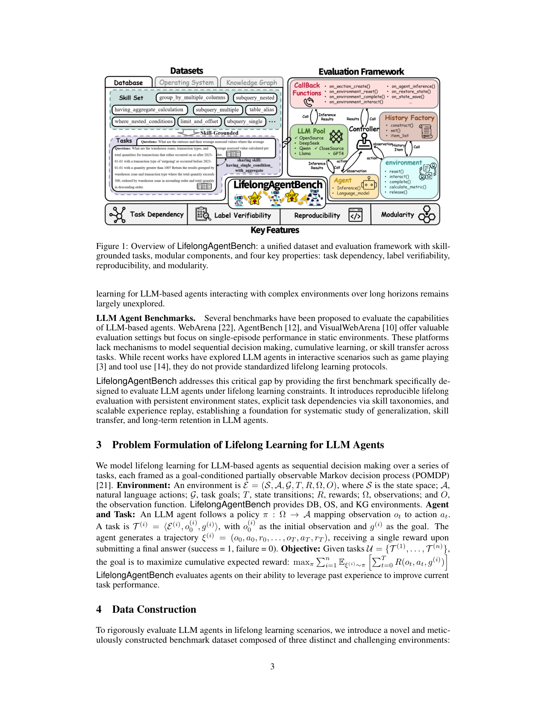
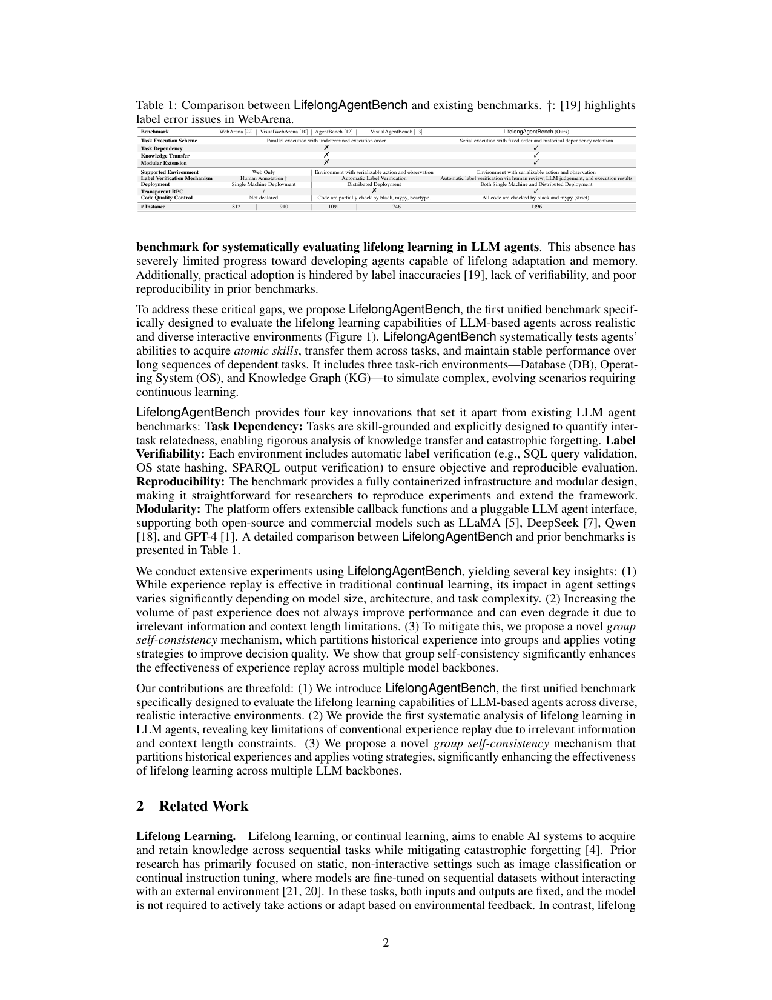

bench_lifelong_agent_bench | LifelongAgentBench: Evaluating LLM Agents as Lifelong Learners | 华南理工(Qianli Ma 组)+ MBZUAI + 中科院 + 华东师大 | 2025-05, arXiv 2505.11942v3 | 主题线 L7 评测(终身学习专项 benchmark)· 相关性 High(评测维度锚 + 与 survey_lifelong 同源) | 有项目页/数据/源码

> [light 档] benchmark 类 → A 栏抽其**评测维度**。与 survey_lifelong 同一团队,可视为该 roadmap 的配套测度工具。

══ 第一层:一眼看懂 ══
- 🟦 **TL;DR**:【原文 Abstract】这是**第一个专门评「LLM Agent 能否终身学习」的统一 benchmark**。痛点:现有 agent benchmark(WebArena/AgentBench 等)把 agent 当**无状态(stateless)系统**——每个任务独立、不要求记忆/积累/迁移,因此根本测不出「越用越强」。LifelongAgentBench 的做法:在三个交互式环境(**数据库 DB / 操作系统 OS / 知识图谱 KG**)里造一批**技能锚定(skill-grounded)、彼此依赖(interdependent)的任务**,串行执行并保留历史依赖,配自动标签校验、可复现、模块化可扩展。它的实验还得到一个反直觉发现:**常规经验回放(experience replay)对 LLM agent 收益有限**(因检索到的经验含无关信息 + 受上下文长度限制);为此提出 **group self-consistency(分组自一致)**机制——把检索到的经验切成小组、各组自一致投票再聚合——显著提升终身学习表现。
- **最巧的一步**:【推断·依据 Table 1 + §数据构造】把任务设计成**「技能锚定 + 任务间依赖 + 串行带历史」**(Table 1:Task Dependency=✓、串行固定序、保留历史依赖)。抽掉「任务依赖/历史保留」这一条,benchmark 就退回成又一个独立任务集、测不出「跨任务知识迁移」;正是这个串行依赖设计,才让「记忆/回放有没有用」成为可被度量的实验变量(并由此得出「replay 收益有限」的发现)。

══ 第二层:为什么需要这评测 ══
- **研究背景**:【原文 §1】研究重心已从「静态模型」转向「与动态环境交互、要靠经验持续变强的 LLM Agent」。但实现 AGI 要的「持续获取/保留/复用知识」(终身学习)被公认是人类级智能的基石,在 agent 研究里却基本未被处理。
- **解决的具体痛点**:【原文 §1/Table 1】两个具体缺陷:① 现有 agent **天生无记忆、无法增量积累知识**,以**无状态(stateless)**方式运行——每个任务独立、不记不迁移;② 现有 benchmark(WebArena/VisualWebArena/AgentBench/VisualAgentBench)都在「静态 agent 范式」下设计——**任务孤立、无任务间依赖、无技能复用**,因此根本测不出知识保留/灾难性遗忘;此外它们还有标签不准(WebArena 被指出有 label error)、缺可验证性、复现性差的工程毛病。
- **相关工作 & 各自不足**:【原文 §2/Table 1】① 传统终身学习——只在静态非交互场景(图像分类、续指令微调)做,输入输出固定、不需主动 take action、不靠环境反馈;② 现有 agent benchmark——并行执行、无序、Web-only、人工标注(易错)。差异轴(Table 1):任务执行模式(并行无序 vs **串行固定序+保留历史依赖**)、Task Dependency、Knowledge Transfer、Modular Extension、标签校验(人工 vs **自动 SQL/OS-hash/SPARQL 校验**)、透明 RPC、代码质量管控(black+mypy strict)、实例数(1396,最大)。
- **动机链(一条逻辑链)**:【推断·依据 §1】要测「越用越强」→ 必须让任务**彼此依赖且串行带历史**(否则没有「过去经验可用」这件事)→ 现有 benchmark 全是独立并行任务,测不出 → 还得能**自动客观校验**(否则长序列上人工标注既贵又不可复现)→ 故造 DB/OS/KG 三个「可序列化 action/observation」环境(正因可序列化才能自动 hash/查询校验)→ 在其上把「记忆/回放有没有用」做成可测的实验变量。为什么不用 WebArena?因为 Web 不可序列化、无法自动校验、且天生无任务依赖。
- **与最近邻工作的 Δ**:【推断·依据 Table 1 + 同团队 survey_lifelong】与最像的 AgentBench(同样多环境交互)相比,关键差异=**任务串行 + 显式技能锚定的任务间依赖 + 自动标签校验**。为什么有用?这一差异把「跨任务知识迁移/遗忘」从「不可观测」变成「可量化的实验变量」,正是本团队 survey_lifelong roadmap 缺的「配套测度工具」。

══ 第三层:怎么评 + 关键发现数字 + 局限 ══
- **评测流水线**:【原文 §6】输入=三环境(DB/OS/KG)的 skill-grounded 串行任务流 → agent 在 baseline(无回放)/ experience replay(检索 1/2/4/8/16 条近期成功轨迹)/ replay+group self-consistency 三种设置下逐任务执行 → 自动校验(SQL 校验 / OS 状态 hash / SPARQL 输出校验)给 0/1 → 主指标 **task success rate**(完成正确动作序列占比);辅以平均输入 token(成本)、不同 backbone、不同动作序列长度。
- **group self-consistency 机制(论文唯一新方法)**:【原文 §6.5/Fig.4】把检索到的历史经验**切成若干小组**,每组各自做一次推理、再用 self-consistency 投票聚合——本质是「分组去噪 + 降单次上下文长度」。逐组件必要性:没它就是 naive replay,大回放量下要么上下文溢出 OOM、要么被无关经验拖累。
- **关键发现 + 具体数字**:【原文 §6.3–§6.5, Table 5/6】① replay 在复杂/长任务上收益最大,Easy 任务几乎无增益(DB Easy ~70% 基本不动),短任务(action length 2–4,Table 5)受益最大;② **回放量超过最优点会退化或 OOM**——「堆更多经验≠更好」;③ group self-consistency 显著改善:DB 上 Llama-3.1-8B 从 0.61(16条不分组)→ **0.75**(16组),Qwen2.5-7B 0.72→0.77;④ **大幅省 token**:KG 上 Llama-3.1-8B 16 条经验从 56,409 token 降到 11,002 token 而精度不降;⑤ 小模型(DeepSeek-R1-Distill 系)受益有限,受模型容量限制。**注意祛魅**:摘要说「conventional experience replay 收益有限」,但正文 §6.3 实测是「replay consistently improves performance,只是大回放量有 trade-off」——更准确的表述是「naive replay 在大规模时因无关信息+上下文限制而边际递减甚至退化,需 group self-consistency 去噪」,而非「replay 整体无效」。
- **实验设置**:【原文 §6】backbone 含 Llama-3.1-8B、Qwen2.5-7B、DeepSeek-R1-Distill-Llama/Qwen-8B/7B 等;经验从「近期成功轨迹」检索;主线测 in-context replay(免梯度),训练式 agent 作可接入项。baseline 公平性:同 backbone 横比不同 replay/分组设置,较干净。
- **假设与失效边界**:见下方原有「假设」条(隐含「终身学习能力可在可序列化、自动校验的 DB/OS/KG 环境里、主要靠 in-context replay 度量」;开放/不可序列化环境与改参数式持续学习两块覆盖不到)。
- **祛魅总结**:【推断】真贡献=**第一个把「跨任务知识迁移/遗忘」做成可量化实验变量的统一 agent 终身学习 benchmark + 工程上可复现/自动校验的基础设施**,且 group self-consistency 的「分组去噪」发现对「经验不能囫囵塞回」有实证支撑。包装/局限:group self-consistency 本身是个简单的投票 trick(作者自己说 future work 要做动态/自适应分组);三环境偏结构化、离真实 web/具身有距离;且主线只在 in-context 层,未测「把经验巩固进权重」的纵向收益。

══ 机制速览 6 轴(benchmark → 它在测/支持什么) ══
| 维度 | 内容(benchmark 视角) |
|---|---|
| 学什么信号 | 测的是 agent 从**过往成功轨迹(经验)**中学习的能力;信号 = 历史经验回放 |
| 改什么 | benchmark 本身不改 agent;它支持的「学习」方式 = 改**记忆/上下文经验**(实验主要测 in-context experience replay,非改参数) |
| 何时改 | 测**在线 per-task 累积**:串行做任务流,每完成一个任务其经验可供后续检索 |
| 免梯度? | 主线**是**(in-context replay + group self-consistency,免梯度);也支持接入需训练的 agent |
| 记忆-技能生命周期 | 核心:经验**写入**(成功轨迹)→**检索**(从近期成功轨迹取)→ group self-consistency **筛选/聚合**;技能在三环境各有 skill set(Table 7),任务按技能分布平衡(Fig.3) |
| 防遗忘机制 | benchmark 用 **knowledge transfer** 维度间接考察「不忘且能迁移」;其发现是 naive replay 不够,需 group self-consistency 去噪 |

══ 抽取的评测维度(A 栏核心) ══
**评测度量**:**任务成功率(task success rate)** = 完成任务的正确动作序列占比;辅以不同 backbone、不同动作序列长度(Table 5:短任务 length 2–4 受益最大)、平均输入 token(Table 6,衡量成本)。
**Benchmark 设计维度(Table 1 与现有对比的差异轴)**:
1. **任务执行模式**:串行、固定序、保留历史依赖(vs WebArena 并行无序)
2. **任务依赖(Task Dependency)**:✓
3. **知识迁移(Knowledge Transfer)**:✓
4. **模块化可扩展(Modular Extension)**:✓
5. **支持环境**:可序列化 action/observation 的环境(DB/OS/KG,vs Web-only)
6. **标签校验机制**:自动标签校验(人审 + LLM 裁判 + 执行结果三重)
7. **部署**:单机 + 分布式;透明 RPC(Fig.8 toolkit)
8. **代码质量管控**:black + mypy(strict);1396 个实例(规模最大)
**三环境**:Database / Operating System / Knowledge Graph,均 skill-grounded(Fig.3 技能分布平衡)。

══ 关键图 top-2 ══

这是**原文 Figure 1**(p3)。选它因为它一图给出 benchmark 全貌:三环境的 skill-grounded 任务 + 串行依赖执行 + 自动校验 + 评测框架,直接说明「终身学习能力」是怎么被设置成可测的。

这是**原文 Table 1**(p2)。选它因为它把本 benchmark 相对 WebArena/AgentBench 等的差异**逐维列清**(任务依赖/知识迁移/模块扩展/标签校验/串行历史),等于一张「终身学习 benchmark 应该具备哪些维度」的清单,对本调研 L7 评测线极有用。

══ 假设与失效边界(一句) ══
【推断·依据其环境均为「可序列化 action/observation」+ 主线测 in-context replay】隐含假设是「终身学习能力可在结构化、可自动校验的环境(DB/OS/KG)里、主要通过上下文经验回放来度量」;失效边界在于**开放/不可序列化环境(如真实 web、长程具身)**与**改参数式持续学习**两块——前者它三环境覆盖不到,后者它只把训练式 agent 作为可接入项而非主测对象。

══ 对"探索-巩固"idea 对标(一句) ══
**竞品 + 可借组件(测度平台)**:作为「测终身学习」的现成平台,它可直接用来评 TSRD —— 串行依赖任务流恰好能检验「path-selection/path-recovery 经验是否跨任务迁移」;其**「naive replay 收益有限、需 group self-consistency 去噪」的发现**是对本 idea 的有力支撑(说明「探索来的经验不能囫囵塞回,需筛选/聚合再用」,正对应「巩固前要蒸馏/选择」);但它停在 in-context 层、未测「把经验巩固进权重」的纵向收益,这正是 TSRD 要补的一段。
