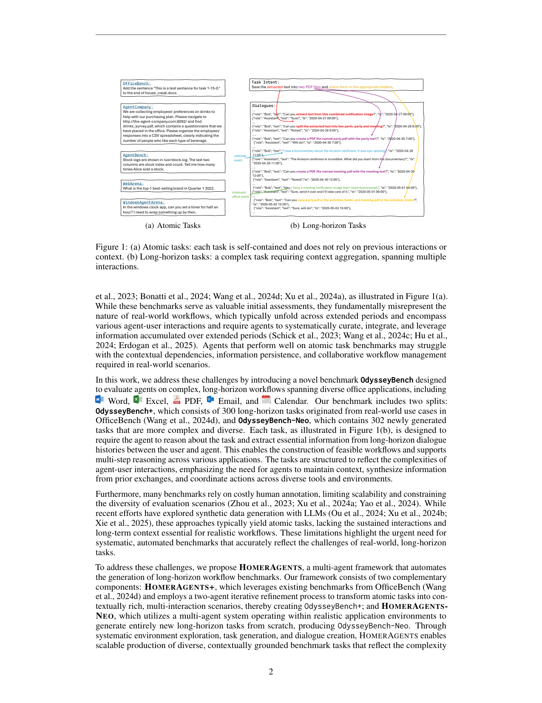
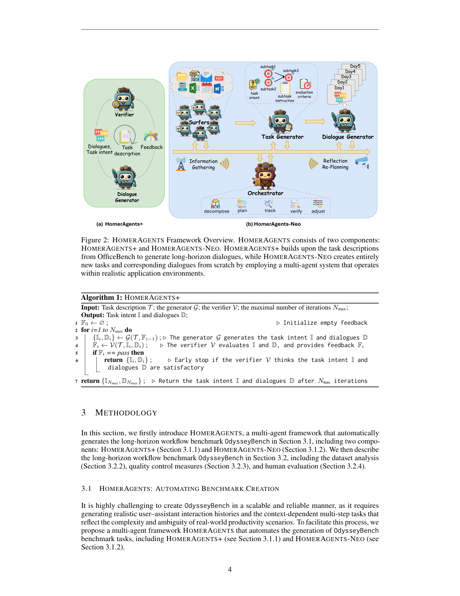

`bench_odysseybench | OdysseyBench: Evaluating LLM Agents on Long-Horizon Complex Office Application Workflows | U-Edinburgh + Microsoft(Wang/Han/Madrigal/Xu/Rühle/Rajmohan) | 2025-08·arXiv·2508.09124 | L?(长程办公工作流评测) · 相关性 Med-High(长程上下文聚合评测床;含 RAG vs long-context 对照,关联记忆机制)`

> light 档(benchmark 类)

══ 第一层:一眼看懂 ══
- 🟦 **TL;DR**:现有 agent 基准大多是"原子任务"(自包含、不依赖前文上下文),无法考察真实办公场景里"跨多次交互、依赖长期上下文"的复杂工作流。OdysseyBench 造了一个**横跨 Word/Excel/PDF/Email/Calendar 五类办公应用的长程工作流基准**,两个互补 split:**OdysseyBench+(300 个真实用例衍生任务)** 与 **OdysseyBench-Neo(302 个新合成复杂任务)**。每个任务要求 agent 从**长程交互历史(含闲聊/无关事件的对话流)中抽取关键信息**并跨应用多步推理。为可扩展造题,提出多智能体框架 **HOMERAGENTS**(系统探索环境→生成任务→合成对话)。前沿模型在该 bench 上仍被显著挑战。【原文 Abstract/§1】
- **最巧的一步**:**把"关键信息打散埋进一长串带闲聊/无关事件的多日对话里"**(Fig.1b)。抽掉"信息分散在长程对话历史"这一设定,任务就退化成原子任务(直接给指令)——正是这一步制造了"上下文聚合 + 长期依赖"的难度,也让它能对照检验 long-context vs RAG 记忆方案。【原文 Fig.1, §4】

══ 评测维度(A 栏:抽其评测维度)══
- **任务规模**:602 任务 = OdysseyBench+(300,真实用例衍生)+ OdysseyBench-Neo(302,合成)。【原文 Abstract】
- **五类办公应用**:Word、Excel、PDF、Email、Calendar(跨应用协同)。【原文 Abstract】
- **核心能力维度**:① **长程上下文聚合**(从多日对话历史 + 闲聊/无关事件中识别 task-relevant 信息);② **跨应用多步推理**;③ **长期上下文依赖 / 多交互协调**(区别于原子任务)。【原文 Abstract/§1, Fig.1】
- **两种评测设定(关键对照,关联记忆机制)**:
  · **Long-context 评测**:把**整段对话历史**喂给 agent;
  · **RAG 评测**:agent 用 embedding 模型从对话历史**检索**相关上下文;又分 (1) raw context 与 (2) summarized context 两种存储形态。
  → 这组对照让本 bench 能直接比较"全量长上下文 vs 检索式记忆"的取舍。【原文 §5】
- **造题/质控维度(HOMERAGENTS)**:多智能体生成 = 系统环境探索 + 任务生成 + 对话合成(generator G + feedback 迭代);质控用**5 个独立 GPT-4.1 agent 做 LLM-as-judge**,按 Completeness(意图+对话能否充分支撑完成)等维度交叉验证,剔除欠定义任务、确认关键信息确实埋在对话里。【原文 §4】
- **统计维度(Fig.3)**:任务所需执行步数分布;涉及的 actions/objects/applications 多样性。

══ 第二层:为什么需要这个 bench(写透) ══
- **研究背景**:LLM agent 正从研究走向真实生产力场景(起草邮件、更新文档、管日历),这些任务**跨多天、含多次 agent-user 交互、要把分散在长期上下文里的信息系统性地整理-整合-利用**。【原文 §1】
- **它要解决的具体痛点**:现有 agent bench(WebArena/AgentBench/WindowsAgentArena/OfficeBench)几乎都是**原子任务(atomic)**——自包含、不依赖前文上下文。在原子任务上分高的 agent,到真实场景里会栽在**上下文依赖、信息持久化、协同工作流管理**上。另一痛点是**造题靠人工标注**,贵且不可扩展、多样性受限;已有 LLM 合成方法又**只能产原子任务**,缺长期上下文。【原文 §1, §2】
- **相关工作 & 各自不足**:① executive-env 评测(WebArena/AgentBench/WindowsArena/OfficeBench)——**只测自包含原子表现,无机制评长期交互**;② 合成造题(Murty/Pahuja/Trabucco 等用 LLM 做 web agent 合成)——**偏 web、交互简单、缺多步推理与大量工具用**;③ 组合原子任务造难题——仍达不到真实长程的上下文聚合难度。【原文 §2】
- **动机链**:现状=agent 落地需长程办公能力但 bench 全是原子任务 → 缺陷=原子任务测不出"从长对话历史聚合关键信息+跨应用多步"的真实能力,且人工造长程题不可扩展 → 所以必须**(a) 造一个长程办公工作流 bench(关键信息埋进多天含闲聊的对话)+ (b) 配一个多智能体自动造题框架 HOMERAGENTS 让它可扩展**。为什么不简单拼原子任务?因为拼接产生不出"信息分散在长对话历史、需主动 curate"的本质难度——这正是 Fig.1b 的设计核心。【原文 §1, §3】
- **与最近邻的 Δ**:相比 OfficeBench(本文 + split 的来源),关键差异=**把 OfficeBench 的原子任务用两 agent(generator G + verifier V)迭代精炼成"信息埋进多天对话"的长程版**,并新造 Neo split。这个差异有用,因为它把"上下文聚合 + 长期依赖"这一真实痛点显式化为可测,且能配套对照 long-context vs RAG 两种记忆方案。【原文 §3.1.1, §4】

══ 第三层:怎么评 + 关键发现数字 + 靠不靠谱 ══
- **造题流水线(HOMERAGENTS 两组件)**:① **HOMERAGENTS+**(产 OdysseyBench+,300 题):从 OfficeBench 任务描述 T 出发,generator G(给 T + 上轮 feedback)产 task intent I + 长程对话 D,verifier V 按 realism/alignment/coherence 评并回 feedback,迭代至 pass 或 Nmax=5。② **HOMERAGENTS-NEO**(产 OdysseyBench-Neo,302 题,基于 Magentic-One):四阶段——Orchestrator 规划 → Surfers 系统探索应用环境收集 context C → Task Generator 产 {描述 T/意图 I/子任务 K/评测准则 E} → Dialogue Generator 产 ≥5 天对话(**故意掺入 chitchat / 无关 office 事件**)。【原文 §3.1, Alg.1/2】
- **两套评测设定(关键对照,关联记忆机制)**:· **Long-context**:整段对话历史喂 agent;· **RAG**:用 embedding(text-embedding-3-large)从历史检索,分 **raw**(session-level / utterance-level)与 **summarized**(session-level / chunk-level)两形态×多粒度。这组对照让 bench 能直接比"全量长上下文 vs 检索式记忆"。【原文 §4】
- **逐组件必要性**:① 信息埋进多天对话+闲聊干扰——没它任务退化成原子任务(直接给指令),失去上下文聚合难度;② generator-verifier 迭代——没它合成质量不可控;③ Surfers 环境探索——没它生成任务脱离真实应用能力(不可解);④ 评测三法(exact/fuzzy/execution match)——单靠 keyword 匹配漏掉"日历冲突"这类需执行验证的输出。论文以构造正确性 + 质控数据论证。【原文 §3.1-3.2】
- **关键机制(质控,防合成噪声)**:用 **o3 双向交叉验证**——同时给(1)完整 T 和(2)只给 I+K 都能解出才算有效任务,确保"对话里确有充分信息"且"intent 恰当抽象不泄题";再用 **5 个独立 GPT-4.1 agent 多数投票做 LLM-as-judge**,评 Completeness(意图+对话能否充分支撑完成)+ Soundness(intent 不泄露 T 的具体信息)。直觉:这把"合成题是否欠定义/泄题"变成可量化的门槛(≥70% pass)。【原文 §3.2.3】
- **实验与证据(支撑核心主张的关键数字)**:
  · 规模:602 任务(+ 300 / Neo 302),按应用数分 Single 153 / Two 166 / Three 283;每题 ≥5 天对话,多数任务需 3-15 执行步。Neo 每对话 token 比 + 多约 49%(5169.9 vs 3468.9)。【Table 1】
  · **前沿模型仍被显著挑战**:long-context 设定下 overall pass rate——o3 在 + 仅 **56.19**、Neo 61.26;GPT-5 在 + 54.00;**3-apps 任务普遍暴跌**(o3 在 + 的 3-apps 仅 30.36 vs 1-apps 72.83;GPT-4.1 3-apps 仅 12.50)——跨多应用协调是最大难点。开源 DeepSeek-R1 在 + 39.33。【Table 4】
  · **人类基线 >90%**(91.43),证明任务可解、连贯,低分是模型能力问题而非题目坏。【Table 3】
  · **long-context vs RAG 关键发现(Table 5/6)**:GPT-4o 在 + 上 **long-context baseline 33.67 普遍优于各 RAG 配置**(raw session top-10 仅 30.33,多数 RAG 配置低于 baseline);Neo 上更明显(baseline 51.99 vs RAG raw-utterance top-5 仅 14.57,需 top-50/915 token 才回到 38.74)——说明**当前检索式压缩在长程办公任务上往往丢关键信息、不如全量长上下文**,是记忆机制设计的重要警示。【原文 §4, Table 5/6】
- **baseline 公平性**:对比覆盖 7 个 proprietary(o3/GPT-5 系)+ 3 个 open-weight,统一 pass rate,公平;long-context vs RAG 同模型(GPT-4o)对照,隔离了记忆形态变量。**看着强但没回答核心问题**:无明显此类问题;Neo split 上分反而比 + 高(o3 61 vs 56),提示合成任务可能略易/分布不同,论文用 + 的真实衍生 split 平衡。
- **假设与失效边界**:【推断·依据 §3.1.3 造题流程】① 隐含假设"GPT-4.1 多 agent + o3 交叉验证能保证合成任务完整性与关键信息可查",但合成对话(尤其 Neo)与真实办公流的分布差异、LLM-judge 自身偏差会引噪声——**合成 split 的难度/排名是否迁移到真实部署未充分验证**;② 造题时 assistant 不真执行只模拟回复(deferred execution),评的是"信息整理+规划"而非真实工具执行鲁棒性;③ RAG 结论基于单 embedding 模型 + GPT-4o,换更强检索器/模型未必成立。
- **祛魅总结**:真贡献(硬货)=**第一个把"长程办公工作流(信息埋进多天含闲聊对话)"做成 602 题可扩展 bench + 可复用的多智能体自动造题框架 HOMERAGENTS + long-context vs RAG 的记忆形态对照**,且人类 >90%、前沿模型 3-apps 暴跌的反差很有说服力。【推断】"自动造题"虽降人工成本,但题目难度/真实性的上限受造题用的 GPT-4.1/o3 能力封顶(人无法被这套生成出更难于其判别力的题),这是合成 bench 的固有软肋;long-context 优于 RAG 的结论对"记忆=压缩检索"路线是一记有价值的反例。

══ 🎯 机制速览 6 轴(benchmark→评测对象=办公 agent)══
| 学什么信号 | 改什么 | 何时改 | 免梯度? | 记忆-技能生命周期 | 防遗忘机制 |
|---|---|---|---|---|---|
| 不适用(评测床);**评测对象**=从长程对话历史聚合信息并跨应用执行的能力 | 不适用(不训练;评测对象侧=long-context vs RAG 记忆) | 不适用(test-time) | 不适用 | 评测对象侧:RAG 设定下"检索 raw/summarized 上下文"即记忆读取(bench 专门对照 long-context vs RAG) | 不适用 |

══ 🖼 关键图 top-2 ══

*这是原文 Fig.1。(a) 原子任务自包含、不依赖前文;(b) 长程任务把子目标(提取文本→拆分→生成两个 PDF→归档)分散在多日对话里,夹杂 chitchat 与无关 office 事件。选它因为它一眼说清"长程 vs 原子"的本质差异——本 bench 的立意所在。*

*这是原文 Fig.2。表现了 HOMERAGENTS 两组件:环境系统探索 + 任务生成/对话合成(generator 接收任务描述与上轮 feedback 迭代)。选它因为可扩展自动造长程工作流题正是本文方法层贡献,使 602 任务规模成为可能。*

══ 假设与失效边界(一句)══
【推断·依据 §4 造题流程】隐含假设"GPT-4.1 多 agent 评判能保证合成任务的完整性与关键信息可查",但合成对话(Neo split)与真实办公流的分布差异、以及 LLM-judge 自身偏差可能引入噪声——**合成 split 上的难度/排名是否迁移到真实部署未充分验证**(失效边界)。

══ 🎯 对"探索-巩固"idea 对标(一句)══
**可借组件 / 评测床**:OdysseyBench 的 long-context vs RAG(raw/summarized) 对照,正好能检验 TSRD 把经验"巩固"成何种记忆形态(全量上下文 vs 压缩检索)在长程办公任务上更省更稳;它本身不训练、与 MTP/OPD 无关,属外部度量与记忆消融平台。

──────────
⑦ 开源代码 + 框架/harness:**已开源** https://github.com/microsoft/OdysseyBench(原文脚注 1 明确给出),含 OdysseyBench + HOMERAGENTS;评测在 Docker 内预装应用、Python 库自动化操作;HOMERAGENTS-Neo 基于 Magentic-One 框架,造题/质控全用 GPT-4.1(交叉验证用 o3);评测用 long-context 与 RAG(embedding=text-embedding-3-large)两套 harness。属评测+造题框架,无模型训练 harness。【原文 §1 脚注/§3.1.3/§4】
💰 资源/成本:602 任务 × 前沿模型评测;造题用多 GPT-4.1 agent 探索+合成+5-judge 验证,RAG 设定需 embedding 模型;长上下文设定 token 成本高(原文未给美元数字)。
🔭 开放问题:【原文】长程复杂办公工作流仍显著挑战 SOTA agent,需更准的真实场景评测。【推断·依据 long-context vs RAG 对照】"全量长上下文 vs 检索式压缩记忆"在长程多应用任务上的最优取舍是开放问题,直接关联记忆/巩固机制设计。
