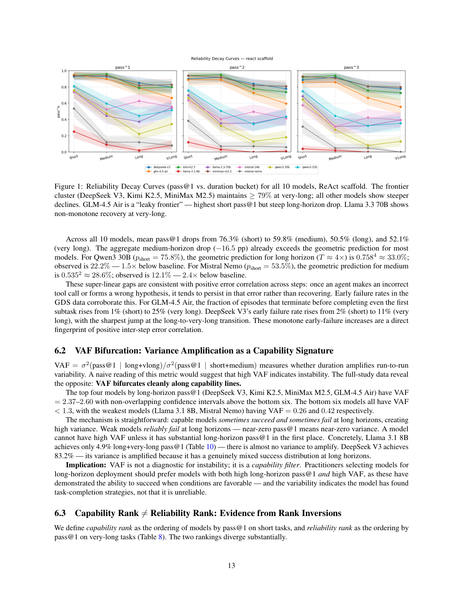
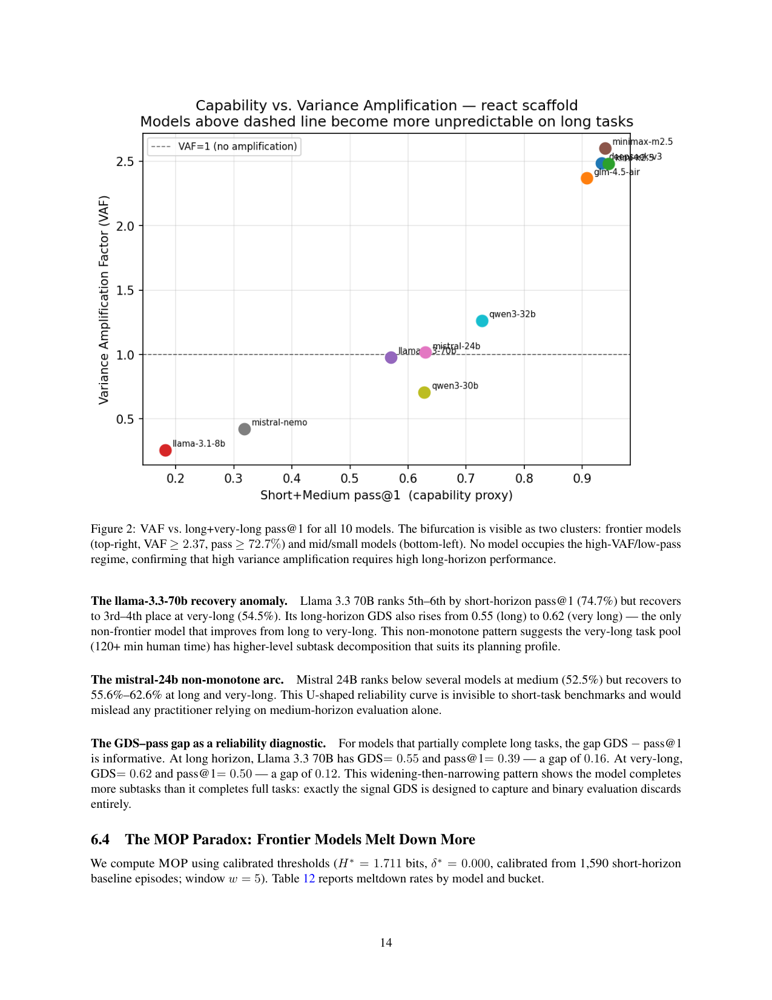

`bench_reliability | Beyond pass@1: A Reliability Science Framework for Long-Horizon LLM Agents | Northern Kentucky University(Khanal/Tao/Zhou) | 2026-04·arXiv·2603.29231 | L?(评测方法/可靠性度量) · 相关性 High(给"巩固是否真稳"提供方差感知度量;含"memory 普遍伤可靠性"关键反例)`

> light 档(benchmark/度量框架类)

══ 第一层:一眼看懂 ══
- 🟦 **TL;DR**:ML 基准只测"能力"(单次 pass@1 能不能做对),但生产部署要的是"可靠性"(反复调用、任务时长各异时**能不能稳定做对**)。本文指出:**随任务时长增长,能力与可靠性会系统性分叉**,而现有基准只报短原子任务的 pass@1,结构性地看不见这种分叉。于是提出**可靠性科学框架,含 4 个度量**,并造了 **396 任务 × 4 时长档 × 3 领域**的基准,在 10 个开源模型 × 23,392 episode(k=3 重复、两种脚手架)上实测。【原文 Abstract/§1】
- **最巧的一步**:**把"任务时长"显式当成自变量**(4 个 duration bucket),而非像 τ-bench/SWE-bench 那样只在固定短任务上测。抽掉"时长作为自变量"这一维,RDC/VAF/MOP 全都失去定义——整个"可靠性随时长衰减"的科学叙事就垮了。【原文 Table 1, §3】

══ 第二层:为什么需要这评测 ══
- **研究背景**:【原文 §1】LLM agent 在生产系统里部署加速,但评测仍困在「不反映实际用法」的范式——主导指标 **pass@1** 只测「单次 best-effort 能不能做对」,这适合测**能力(capability)**;但生产 agent 被调用成千上万次、任务时长各异,真正要紧的是**可靠性(reliability)**:能不能**反复稳定做对**。
- **解决的具体痛点**:【原文 §1】能力 ≠ 可靠性,且**随任务时长增长两者系统性分叉**。证据:τ-bench 里 GPT-4o retail 任务 pass@1=61% 但 pass@8 仅 25%(跑 8 次至少失败一次的概率近 75%)。可现有 benchmark 几乎只评「人几分钟能完成的短原子任务」,而真实任务(重构代码库、研究+综合技术报告、处理互链文档语料)要人几十分钟到数小时——任务越长,agent 累积错误更多、熔断机会更多、中间状态更易损坏。这种「可靠性随复杂度超线性衰减」对只报短任务 pass@1 的 benchmark **结构性不可见**。
- **相关工作 & 各自不足(Table 1)**:【原文 §2】τ-bench(引入 pass^k 但不把时长当自变量、任务短)、ReliabilityBench(最接近,引入三维可靠性面但只 2 模型 + 短程)、METR horizon(测完成时长但不分析方差/重复尝试)、OdysseyBench(部分含时长)、SWE-bench(20+模型但单次尝试、无方差、无部分信用)。**无人同时做到「多模型 × 多时长档 × 方差感知指标」三者**——这是本文填的盲点。
- **动机链(一条逻辑链)**:【推断·依据 §1/Table 1】生产要的是稳定复用而非单次能力 → pass@1 测不出稳定性 → 必须看 pass^k 随时长怎么衰减 → 故把**任务时长显式当自变量**(4 个 duration bucket)、每任务重复 k=3、并设计**方差感知 + 部分信用**指标(RDC/VAF/GDS/MOP)。为什么不沿用 τ-bench?因为它任务短、不把时长当变量,看不见「可靠性随时长崩塌」这条核心曲线。
- **与最近邻工作的 Δ**:【原文 §2】与最像的 ReliabilityBench(也做可靠性面)相比,关键差异=**把任务时长当自变量 + 10 模型 + 部分信用(GDS)**,覆盖到 long/very-long 程。为什么有用?正是「时长作自变量」让 RDC/VAF/MOP 全部可定义、让「衰减按领域分层」「VAF 按能力档二分」这类结论可被观测。

══ 第三层:怎么评 + 关键发现数字 + 局限 ══
- **评测流水线**:【原文 §3/§4/§5】构造 396 任务 = 4 时长档 × 3 领域(每格 33 题)→ 每模型每任务跑 k=3 次、两套脚手架(ReAct + memory-augmented,共用工具集 read_file/write_file/list_directory/run_command/web_search 等)→ 经 OpenRouter 统一 API、共 23,392 episode → 算 RDC/VAF/GDS/MOP 四指标。三领域=**SE(软件工程,读改测 Python 代码库)、WR(Agentic Web Research,多步信息搜集 via web search+URL 抓取)、DP(Doc Processing,文档处理)**〔注:原 light 笔记把第三领域写成「data/DP」并漏写 WR,**应更正为 SE / WR / DP 三域**〕。
- **四指标(逐组件必要性 + 直觉)**:【原文 §3】① **RDC**(Reliability Decay Curve):pass^k 随时长如何衰减;② **VAF**(Variance Amplification Factor):时长如何放大随机失败的跑间方差;③ **GDS**(Graceful Degradation Score):对部分完成长任务给部分分(否则长任务全 0/1 太粗);④ **MOP**(Meltdown Onset Point):用**对工具调用序列的滑窗熵**检测行为崩溃起点。抽掉「时长作自变量」这一维,四个指标全失去定义——整个「可靠性随时长衰减」叙事就垮。
- **五大关键发现 + 具体数字**:【原文 Abstract/§6】(1) **衰减按领域分层**:SE 的 GDS 在全时长范围从 **0.90 → 0.44**,而 DP 几乎平(**0.74 → 0.71**);(2) **VAF 按能力档清晰二分**:前沿 VAF ≥ **2.37**、中档 ≤ **1.26**——反直觉结论:**高方差放大是「能力签名」而非「不稳定签名」**;(3) 能力排名与可靠性排名显著分叉,中/超长程多处名次反转;(4) **MOP 悖论**:前沿模型熔断率最高(达 **19%**),因其追求雄心多步策略;(5) **memory 脚手架普遍损害长程 GDS**(10 模型全负或中性,如 WR 一行 GDS 差 −0.17)——强证据反对「朴素 episodic memory 作可靠性干预」。
- **实验/baseline 公平性**:【原文 §5】10 个开源模型(为成本+可复现,不含 GPT-4o/Claude 3.7 等闭源前沿,作者承认这些「很可能更可靠」);两脚手架同工具集横比,较干净;非 web 任务用本地文件操作消除网络非确定性。
- **假设与失效边界(原文显式 §7.3)**:【原文】① **时长作难度代理不完美**——用「人完成时间」估难度,DP-L 任务人觉得「长」但 agent 4–8 工具调用就搞定(非单调性即此代理的反例);② **基础设施可靠性是新威胁**——3 个免费档模型短任务后耗尽 API 配额、2 个返 HTTP 404,引入系统性选择偏差,作者改用付费多 provider 路由才消除,建议把「completion rate」立为一等校验指标;③ 只 10 开源模型;④ 三域非穷尽(不含具身/工具制造/多智能体);⑤ programmatic 评测可能被 overfit 测试套件钻空;⑥ WR 用 live web,时间上不完全可复现。
- **祛魅总结**:【推断】真贡献=**把可靠性立为与能力并列的一等评测维度 + RDC/VAF/GDS/MOP 四个 pass@1 看不见的指标 + 「memory 普遍伤长程可靠性」「VAF 是能力签名」「MOP 悖论」三个反直觉实证**。包装/局限:GDS 部分信用规则与 MOP 滑窗熵阈值需人工设计,换领域/脚手架后阈值与排名结论可能不迁移;「memory 有害」结论限于其**朴素 episodic memory** 实现(不能推广到所有记忆/巩固机制);未来工作明确提出「用 RDC/VAF/GDS 当训练信号做 reliability-aware training」和「MOP 触发的 context reset」——后者预测能为前沿模型挽回 19% 价值,与「巩固/恢复」议题直接相关。

══ 评测维度(A 栏:抽其评测维度)══
- **任务规模**:396 任务 = 4 时长档 × 3 领域(每格 33 任务);10 个开源模型;2 种脚手架(ReAct + memory-augmented);k=3 重复;共 23,392 episode;经 OpenRouter 统一 API。【原文 §4/§5】
- **三领域**:SE(软件工程)、DP(数据处理/data,文中 DP)、第三领域(programmatic 评测尽量自动化)。【原文 Abstract/§4】
- **四时长档**(duration bucket):medium / long / very-long 等,按任务预计完成时长分桶——核心自变量。【原文 §3/§4】
- **4 个可靠性度量(核心评测维度)**:
  1. **RDC(Reliability Decay Curve)**:pass^k 随任务时长如何衰减(可靠性衰减曲线)。
  2. **VAF(Variance Amplification Factor)**:时长如何放大随机失败模式(跑间方差放大因子)。
  3. **GDS(Graceful Degradation Score)**:对部分完成长任务的 agent 给部分分(优雅降级/部分信用)。
  4. **MOP(Meltdown Onset Point)**:用对工具调用序列的滑窗熵检测"行为崩溃"起点(熔断起点)。【原文 Abstract/§3】
- **对比轴(Table 1)**:是否把"时长"当自变量 × 是否测跑间方差 × 是否给部分信用 —— 本文是首个三者兼备(对比 τ-bench / ReliabilityBench / METR horizon / OdysseyBench / SWE-bench 均缺至少一项)。
- **五大关键发现(评测产出)**:(1) 可靠性衰减按领域分层(SE GDS 0.90→0.44,DP 几乎平 0.74→0.71);(2) **VAF 按能力档清晰二分**(前沿 VAF≥2.37,中档 ≤1.26)——反直觉:高方差放大是**能力签名**而非不稳定签名;(3) 能力排名与可靠性排名显著分叉(中/超长程多处名次反转);(4) **MOP 悖论**——前沿模型熔断率最高(达 19%),因其追求雄心多步策略;(5) **memory 脚手架普遍损害长程 GDS**(10 个模型全为负或中性)——强证据反对"朴素 episodic memory 作可靠性干预"。【原文 Abstract/§6】

══ 🎯 机制速览 6 轴(度量框架→评测对象侧)══
| 学什么信号 | 改什么 | 何时改 | 免梯度? | 记忆-技能生命周期 | 防遗忘机制 |
|---|---|---|---|---|---|
| 不适用(评测框架);**评测对象**=长程 agent 的可靠性(跨重复调用/跨时长的稳定性) | 不适用(不训练;评测对象侧脚手架=ReAct / memory-augmented) | 不适用(test-time 多次重复 k=3) | 不适用 | 评测对象侧:memory 脚手架被实测**普遍伤害长程可靠性**(关键反例) | 不适用 |

══ 🖼 关键图 top-2 ══

*这是原文 Fig.1。表现了 10 个模型在 ReAct 脚手架下 pass@1 随 4 个时长档的衰减曲线——核心论点的实证可视化:短任务高分掩盖了长任务的崩塌。选它因为它直接画出"为什么短任务 pass@1 看不见可靠性问题"。*

*这是原文 Fig.2。表现了 VAF vs 长+超长程 pass@1 散成两簇:前沿模型(高 VAF)与中档模型(低 VAF)清晰分离。选它因为它支撑最反直觉的发现——方差放大不是"不稳定",而是前沿模型追求雄心策略的"能力签名"。*

══ 假设与失效边界(一句)══
【推断·依据 §5 设置】隐含假设"任务时长可被可靠分桶且 programmatic 评测能覆盖三领域";框架仅在 10 个**开源**模型 + 两脚手架上验证,GDS 的部分信用规则与 MOP 的滑窗熵阈值需人工设计——**换领域/换脚手架后阈值与排名结论可能不迁移**(失效边界),且"memory 普遍有害"结论限于其朴素 episodic memory 实现。

══ 🎯 对"探索-巩固"idea 对标(一句)══
**支撑 + 警示**:本文的 RDC/VAF/GDS/MOP 正是衡量"巩固后是否更稳健(而非只是单次更准)"的现成度量,可直接评 TSRD 的 path-recovery 是否降低长程熔断率 MOP;同时它的"memory 脚手架普遍伤长程可靠性"是对"加记忆=更好"的强警示,提示巩固要落到参数/技能而非朴素 episodic 记忆。

──────────
⑦ 开源代码 + 框架/harness:**基准公开释出**(原文 §4 称 "complete benchmark is publicly released");脚手架=ReAct 与 memory-augmented,模型经 OpenRouter 统一 API。具体仓库 URL 原文正文未在前两页给出〔待核 GitHub 链接〕。
💰 资源/成本:23,392 episode × API 调用(10 模型 × 396 任务 × k=3 × 2 脚手架),OpenRouter 计费;长任务延迟高(原文未给美元成本)。
🔭 开放问题:【原文】把可靠性立为与能力并列的一等评测维度;为何前沿模型熔断率反而最高(MOP 悖论)需机制级解释。【推断】如何设计**不损害**长程可靠性的记忆/巩固机制是直接后续(本文证明了朴素记忆有害)。
