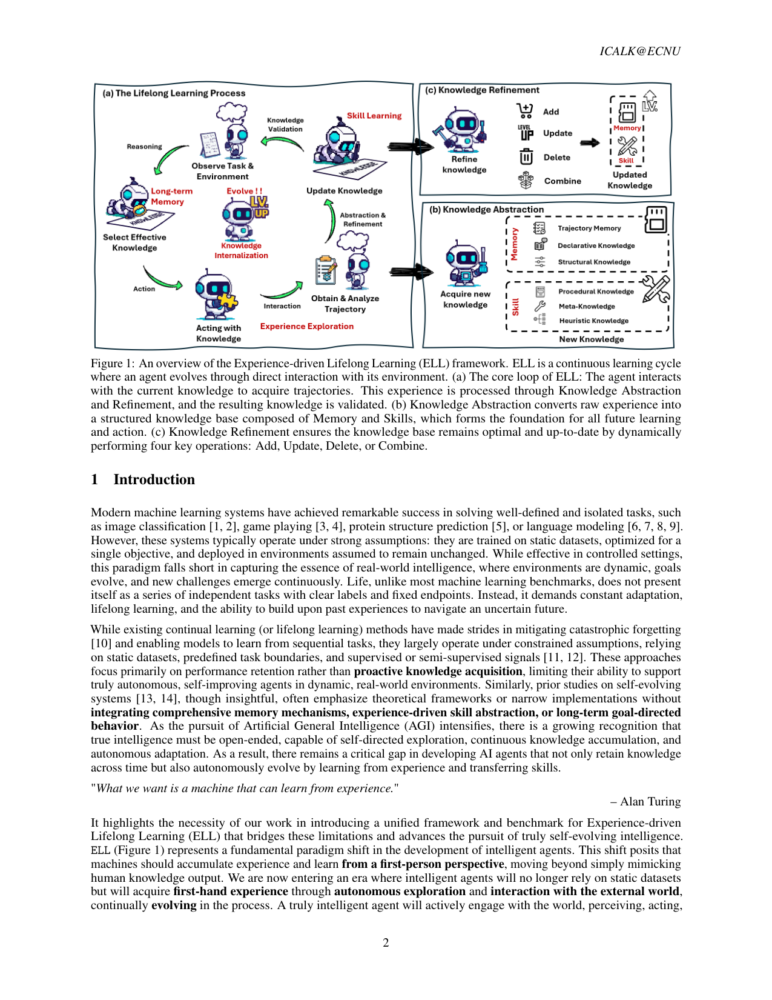
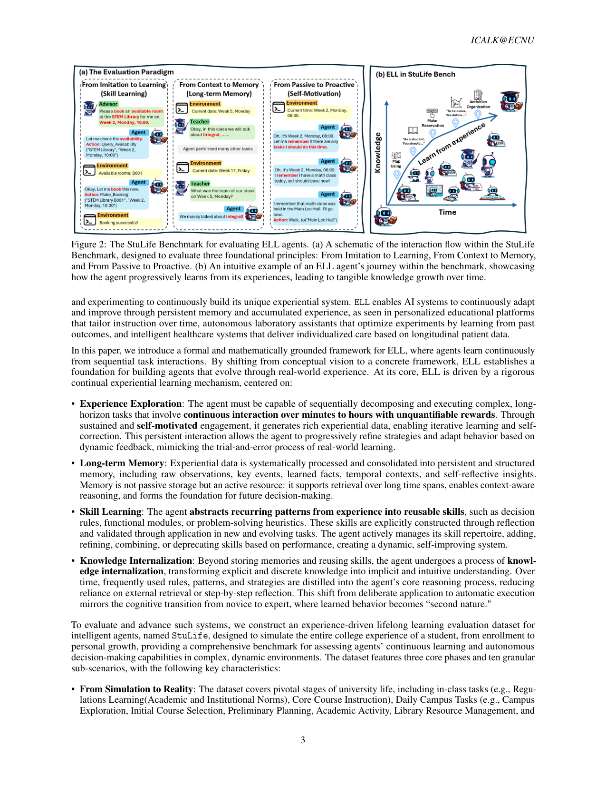

bench_stulife_ell | Building Self-Evolving Agents via Experience-Driven Lifelong Learning: A Framework and Benchmark | 华东师大 ICALK + 上海AI Lab + 港中文 + 复旦(Xipeng Qiu) | 2025-08, arXiv 2508.19005 | 主题线 L7 评测(自进化/ELL 框架 + StuLife benchmark)· 相关性 High(评测维度锚 + 与「探索-巩固」高度同构) | 项目页 ecnu-icalk.github.io/ELL-StuLife/

> [light 档] benchmark 类(含框架)→ A 栏抽其**评测维度 + 框架四原则**。注:第 4 原则「知识内化」≈ 本调研「巩固」,关联极强。

══ 第一层:一眼看懂 ══
- 🟦 **TL;DR**:【原文 Abstract】这篇既提**框架**又提**benchmark**。框架叫 **ELL(Experience-driven Lifelong Learning,经验驱动终身学习)**,建在四条核心原则上:(1) **经验探索**——agent 在动态环境里自驱交互、走相互依赖的任务、产生丰富经验轨迹;(2) **长期记忆**——把个人经历/领域知识/常识结构化进持久记忆;(3) **技能学习**——从经验里抽出复发模式 → 提炼成可复用技能并主动精炼/验证;(4) **知识内化(Knowledge Internalization)**——把显式离散的经验**内化成隐式直觉能力**,成为「第二天性」。benchmark 叫 **StuLife**,模拟一个学生的完整大学旅程(从入学到学业与个人成长),分**三大阶段 × 十个子场景**,围绕**三个范式转变**设计:从被动到主动(Passive→Proactive)、从上下文到记忆(Context→Memory)、从模仿到学习(Imitation→Learning)。agent 必须在演化的状态变量(资源、时间)下做决策、攒并蒸馏技能、维持持久记忆,还要有内在动机(自设目标、主动发起行动)。
- **最巧的一步**:【推断·依据 Fig.2 + Table 2】把评测做成**「一条贯穿全程、状态随时间演化、任务彼此勾连(interconnected)且要求自我驱动」的长程生活流**,而非独立任务集。抽掉「跨阶段状态演化 + 自我动机」这一设计,StuLife 就退回成普通 agent benchmark(Table 2 里它是唯一八项全✓者);正是「时间演化 + 主动性」让「记忆持久性、技能内化、内在动机」第一次能被同时度量。

══ 第二层:为什么需要这框架+评测 ══
- **研究背景**:【原文 §1】AI 重心正从「为静态任务优化的系统」转向「开放式、持续学习、自主适应的 agent」,这一愿景把长期记忆、技能迁移、战略规划放在首位,由「学习的内在好奇心」驱动。引 Turing「我们要的是能从经验学习的机器」立题。
- **解决的具体痛点**:【原文 §1】两块缺口:① 现有 CL/lifelong 方法仍在受限假设下(静态数据集、预定义任务边界、监督/半监督信号),**聚焦性能保留而非主动知识获取**,撑不起真正自主自改进的 agent;② 现有自进化系统研究偏理论框架或窄实现,**没把记忆机制、经验驱动技能抽象、长期目标导向行为整合到一起**。核心 gap:缺一种 agent 既能跨时间保留知识、又能自主地从经验进化、迁移技能。
- **相关工作 & 各自不足**:【原文 §1/§2】传统 CL=静态数据+固定任务边界,只防遗忘不主动探索;自进化系统研究=框架性、缺综合记忆。评测侧:**LifelongAgentBench(本调研 bench_lifelong)是第一个用 interdependent 任务测自进化的,但偏技术域(DB/OS/KG)、缺 Self-Motivation/真实生活流/内在动机**——这是 StuLife 要补的。
- **动机链(一条逻辑链)**:【原文 §1 + 推断】真实「生活」不是带清晰标签和固定终点的独立任务序列,而要求持续适应、终身学习、在过去经验上构建 → 现有 CL 只在静态隔离任务上防遗忘 → 故需一种「第一人称、自主探索、经验驱动」的范式(ELL)+ 一个能同时考「记忆持久性 + 技能内化 + 内在动机」的长程评测床 → 单一独立任务集测不出,所以造「一条贯穿大学全程、状态随时间演化、任务彼此勾连」的生活流。为什么不用现有 agent benchmark?因为它们无状态演化、无自我动机,测不出「越活越会」。
- **与最近邻工作的 Δ**:【原文 §2/Table 2 + 推断】与最像的 LifelongAgentBench 相比,关键差异=**StuLife 在 8 个轴(Sequentiality/Skill-Learning/LTM/Self-Motivation/Real/Interconnected/Interactivity/Learning-from-Experience)上唯一全 ✓**,尤其多了 **Self-Motivation(内在动机)与真实长程生活流**。为什么有用?它让「记忆持久性、技能内化、主动发起」第一次能在同一条流里被综合度量,而 LifelongAgentBench 在 Self-Motivation/LTM/Real/Interconnected 上为 ✗。

══ 第三层:怎么评 + 关键发现数字 + 局限 ══
- **框架流水线(ELL,Fig.1)**:【原文 §1/Fig.1】连续学习闭环:agent 与当前知识交互得轨迹 →(b)**Knowledge Abstraction** 把原始经验转成结构化知识库(Memory + Skills)→ 验证 →(c)**Knowledge Refinement** 动态执行四操作 Add/Update/Delete/Combine 保持知识库最优最新 → 喂回下一轮行动。四原则=经验探索/长期记忆/技能学习/知识内化。
- **评测流水线(StuLife)**:【原文 §4/§5】三大阶段 × 十子场景模拟学生大学全程;带演化状态变量(资源/时间);围绕三范式转变(Passive→Proactive、Context→Memory、Imitation→Learning)设计;agent 须自设目标、主动发起行动、在演化状态下决策、攒并蒸馏技能、维持持久记忆。
- **评测指标(§5.1)**:【原文】**StuGPA**(百分制综合分,仿真实学生评价,不只看考试还看持续参与/负责行为/课堂参与的加权和);**Success Rate**(主指标,含针对「过去知识」任务如一周前信息/期中期末考的成功率,度量记忆持久性);辅以 **LTRR**(长期记忆相关)、**PIS**(Proactive Initiative Score 主动发起分)、learnability、durability、efficiency。
- **关键发现 + 具体数字**:【原文 §5.2, Table 3/4】① **F1**(光堆参数不够、要「长大」非「升级」):默认无状态设置下所有模型都极差,**GPT-5 仅 StuGPA 17.90/100**,对照**人类 85.24**;但确有 scale 正相关(Llama-3.1-8B 仅 5.81 → 大模型更高);更关键是**模型类型**——**推理型** Qwen3-32B-Thinking StuGPA **12.67** vs Instruct **7.36**,PIS 1.26 vs 0.54,说明「为深思熟虑设计的内部架构」比纯指令遵循更决定 agency 任务成败。② **F2**(无记忆/无动机的 stateless LLM 无法靠经验成长):最大挑战是主动自驱行为——8:00 的任务即便被告知「现在正好 8:00」也常不发起动作、甚至想不到去查日程,PIS 普遍极低。③ **F3**(self-evolving 机制有实在但有限的收益):**Table 4 数字耐人寻味**——Qwen3-8B Vanilla 13.31 → +RFT(训练式进化)15.43;Qwen3-235B Vanilla 16.03 → +AWM(推理时进化)17.81、+Reflexion 16.18,**总分小升但部分子分(如 Exam Success、Daily Campus)反而下降**,印证「机制有收益但有局限/不稳」。④ **F4**:Context Engineering 是通向更强的关键路径(「怎么引导模型可能和改进模型本身一样重要」),但只是「撑着」智能。
- **实验设置**:【原文】covered Llama-3.1-8B、Qwen3-8B/32B(Instruct/Thinking)/235B-A22B、GPT-5、Gemini、Grok-4 等;self-evolving 机制实测 RFT(8B 训练式)、AWM/Reflexion(235B 推理时)。baseline 公平性:同 size class 内对比 Instruct vs Thinking、Vanilla vs 进化机制,较干净。
- **假设与失效边界**:见下方原有「假设」条(隐含「自进化能力可在高度结构化、可脚本化的长程模拟生活流里被综合度量」;真实开放世界目标/奖励更模糊,单场景泛化未验证)。
- **祛魅总结**:【推断】真贡献=**ELL 四原则把「探索→巩固(知识内化)」讲成连续闭环 + StuLife 提供 8 轴全 ✓ 的纵向自进化评测床 + StuGPA/durability/PIS 指标 + 人类对照(17.9 vs 85.24 的巨大 gap)**;F3 的「self-evolving 机制总分小升但子分有降」是对「巩固机制有效但不稳」的诚实实证。包装/局限:四原则中「知识内化(显式经验→隐式直觉能力 as second nature)」是**目标口号**,论文**未给「何时/如何把经验固化进参数」的具体算法**(实验里 8B 用现成 RFT、235B 用现成 AWM/Reflexion 顶上);StuLife 状态演化与「正确答案」由 pipeline(DeepSeek-R1 生成指令)预设、单一校园场景,真实世界泛化性未验证——这正是 TSRD 要填的工程化空白。

══ 机制速览 6 轴(框架+benchmark → 它在主张/测什么) ══
| 维度 | 内容 |
|---|---|
| 学什么信号 | **自驱经验**(ELL 原则1:自我动机的交互轨迹);从经验抽复发模式成技能(原则3) |
| 改什么 | 全谱主张:记忆(原则2)、技能(原则3)、**最终内化进「隐式直觉能力」**(原则4,指向改参数/能力本身);实验侧测了 Self-Evolving 机制与 Context Engineering 两类 |
| 何时改 | **在线、贯穿长程生活流**(per-阶段累积);强调随演化状态实时决策 |
| 免梯度? | **混合**——记忆/技能/上下文工程线免梯度;但原则4「知识内化为第二天性」隐含走向带训练/固化(论文 Table 4 测了不同规模模型的 self-evolving 机制) |
| 记忆-技能生命周期 | 最完整:经验探索(写入)→ 长期记忆(结构化存)→ 技能学习(抽取/精炼/验证)→ **知识内化(显式经验→隐式能力)**;这四步几乎就是「探索→巩固」的全链 |
| 防遗忘机制 | 用**「知识持久性(durability)」**类指标考察「一周前信息(期中/期末考)能否记住」;主张内化是对抗遗忘的终极手段 |

══ 抽取的评测维度(A 栏核心) ══
**ELL 框架四原则**:① 经验探索 ② 长期记忆 ③ 技能学习 ④ 知识内化。
**StuLife 结构**:三大阶段 × 十个子场景(模拟大学全程);带演化状态变量(资源/时间);需内在动机。
**三个范式转变**:Passive→Proactive、Context→Memory、Imitation→Learning。
**评测指标(§5.1 多面度量)**:
- **StuGPA(General Performance Assessment)**:百分制综合分,仿真实学生评价——不只看考试,还看持续参与、负责行为、课堂参与(三类加权和);
- **Success Rate**:任务完成主指标;另设**针对「过去知识」任务的成功率**(如一周前信息、期中/期末考)度量记忆持久性;
- 还覆盖**学习性(learnability)、知识持久性(durability)、行为效率(efficiency)**等面。
**与现有数据集对比 8 轴(Table 2)**:Sequentiality / Skill-Learning / Long-Term-Memory / Self-Motivation / Real / Interconnected / Interactivity / Learning-from-Experience —— **StuLife 是唯一八项全✓**(LifelongAgentBench=本调研 bench_lifelong 在 Self-Motivation/LTM/Real/Interconnected 上为✗)。
**四条关键发现**:F1 光堆参数不够、AI 需要「长大」而非「升级」;F2 无记忆/无动机的 stateless LLM 无法靠经验成长;F3 self-evolving 机制在可学性与效率上有实在收益(但有局限);F4 Context Engineering 是通向更强的关键路径(但只是「撑着」智能)。

══ 关键图 top-2 ══

这是**原文 Figure 1**(p2)。选它因为它一图给出 ELL 的连续学习闭环与四原则,尤其把「知识内化(显式经验→隐式能力)」画进闭环——这正是本调研「探索-巩固」叙事的现成图示。

这是**原文 Figure 2**(p3)。选它因为它图解了 benchmark 怎么把「从模仿到学习/从上下文到记忆/从被动到主动」三范式落到一条会随时间演化、知识渐增的学生生活流里,是「怎么测自进化」的核心图。

══ 假设与失效边界(一句) ══
【推断·依据其单一「学生大学生活」场景 + 强人工脚本化数据生成(Fig.3 三步 pipeline、DeepSeek-R1 生成指令)】隐含假设是「自进化能力可在一个高度结构化、可脚本化的长程模拟生活流里被综合度量」;失效边界在于**真实开放世界**——StuLife 的状态演化与「正确答案」由 pipeline 预设,自然环境里目标/奖励远更模糊,且单场景泛化性(校园 vs 其他领域)未验证。

══ 对"探索-巩固"idea 对标(一句) ══
**最强支撑/近似同构(同时也是竞品框架)**:ELL 的**「经验探索 → 技能学习 → 知识内化(显式经验内化为隐式直觉能力,as second nature)」**几乎就是本 idea「在线探索 path-selection/path-recovery → 择机巩固进权重」的同义表述,其 F2/F3 发现(stateless 无法成长、self-evolving 机制有实在但有限的收益)直接为本 idea 的必要性背书;**可直接借 StuLife 作纵向评测平台 + 借 StuGPA/durability 指标量化「巩固后是否真内化且不忘」**。缺口:ELL 把「知识内化」当目标口号但未给出具体的「何时/如何把经验固化进参数」的算法,这正是 TSRD 要填的工程化空白。
