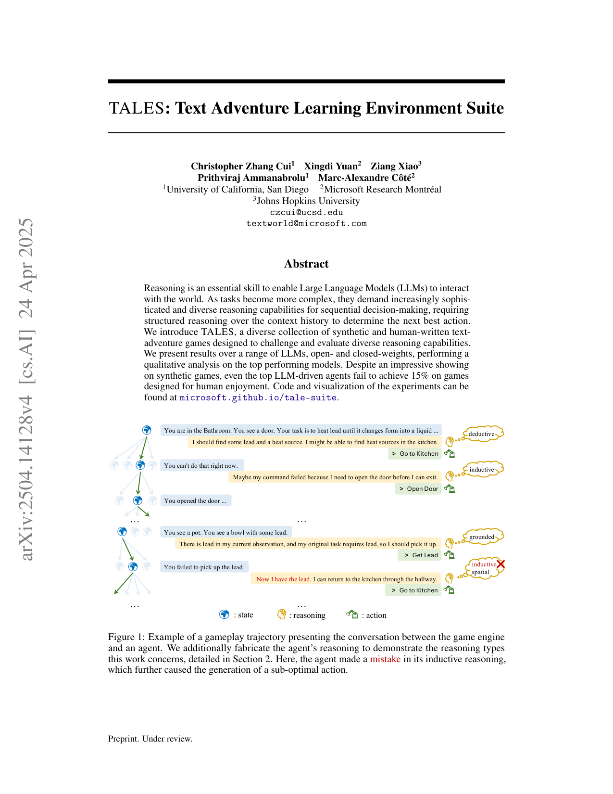
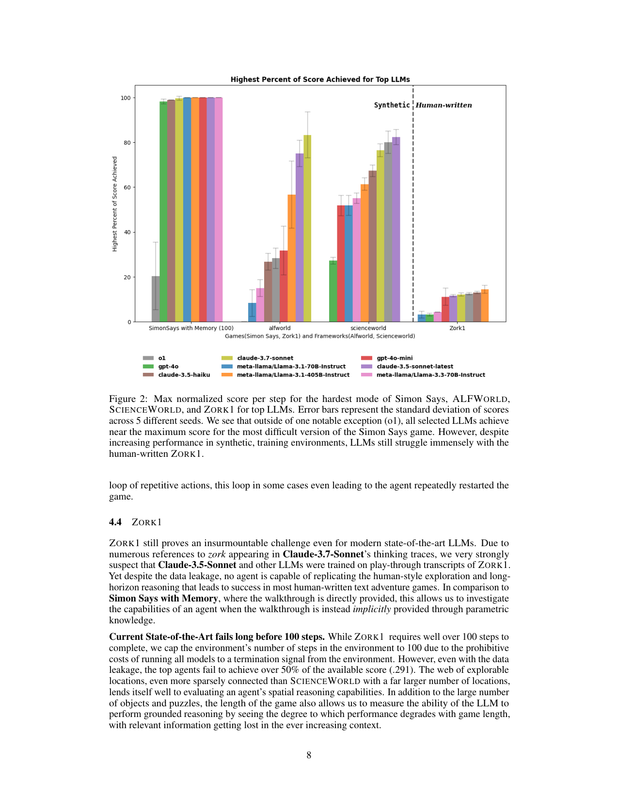

`bench_tales | TALES: Text Adventure Learning Environment Suite | UCSD + Microsoft Research Montréal + JHU(Cui/Yuan/Xiao/Ammanabrolu/Côté) | 2025-04·arXiv v4·2504.14128(项目页 microsoft.github.io/tale-suite,GitHub microsoft/tale-suite) | L?(交互式推理评测基准) · 相关性 Med(长程组合推理评测床;非自进化,作背景/外部度量)`

> light 档(benchmark 类)。注:任务提示原假定"无 arXiv 仅 GitHub";实查到 arXiv 2504.14128,故基于真实 PDF 正文写,图为 PDF 渲染(非 README)。

══ 第一层:一眼看懂 ══
- 🟦 **TL;DR**:推理是 LLM agent 与世界交互的核心技能。TALES 把五个经典文字冒险游戏框架(JERICHO、ALFWORLD、SCIENCEWORLD、TEXTWORLD、TEXTWORLDEXPRESS)**以原始形态统一**进一个评测套件,**只加极少脚手架、不喂专家先验**,从而测 agent 的"基线复合推理能力"。结果很扎心:模型在合成游戏上表现亮眼,但**在为人类娱乐设计的游戏上,顶级 LLM agent 也拿不到 15%**。【原文 Abstract/§1】
- **最巧的一步**:**minimal scaffolding + 保留游戏原始形态(不注入隐式约束、不缩小游戏 scope)**。抽掉"极少脚手架"这一原则,就退回到其他基准"喂大量专家知识把隐式约束显式化"的做法,测出的是"被喂提示后的表现"而非 agent 自身的 baseline 组合推理——TALES 的难度与诊断价值正来自这一克制。【原文 §1】

══ 评测维度(A 栏:抽其评测维度)══
- **规模**:122 个游戏的套件;34 个开/闭源模型,**zero-shot** 设定;每模型多 seed(5 seeds 报标准差)。【原文 §1, §3, Fig.2】
- **五个统一框架**(各自属性差异,Table 1):
  | | TEXTWORLD | TEXTWORLDEXPRESS | ALFWORLD | SCIENCEWORLD | JERICHO |
  |---|---|---|---|---|---|
  | #Games | 10 | 16 | 12 | 30 | 54 |
  | Avg walkthrough 长度 | 13.7 | 33.1 | 5.8 | 41.7 | **87.2** |
  | Synthetic | ✓ | ✓ | ✓ | ✓ | **✗(人类编写)** |
  | Informative feedback | ✓ | ✓ | ✗ | ✓ | ✓ |
  JERICHO(人类娱乐向)最难——顶级 agent <15%。【原文 Table 1】
- **四大核心推理技能维度**(选游戏的准则,agent 须四者皆达非平凡水平才能推进):① **Spatial 空间推理**(导航/物体空间关系);② **Deductive 演绎推理**(依一般原则行动);③ **Inductive 归纳推理**(从交互观察下结论);④ **Grounded 接地推理**(在给定上下文识别相关信息、执行合法动作)。【原文 §1, Fig.1】
- **核心指标**:**max normalized score per step**(每步最大归一化得分;按游戏内置 progress/intermediate reward 归一);跨 5 seed 报均值±标准差;另比较 token usage。【原文 Fig.2, §3】
- **Simon Says 试金石**:最简"照走 walkthrough"的指令跟随任务,作能力门槛;**它的成功强预测复杂环境的进度(Pearson r=0.83)**;推荐:除非 agent 能过到 ALFWORLD 级,否则别上全量 TALES。【原文 §3.1, §3】
- **关键发现维度**:Claude 系总体最佳;所有模型在**信息稀疏散布的极长程上下文**上都吃力(核心共性失败);对比 4 个 reasoning model(top=Claude-3.7-Sonnet)的 score 与 token 消耗。【原文 §3】

══ 第二层:为什么需要这个 bench(写透) ══
- **研究背景**:推理是 LLM agent 与世界交互、做序贯决策的核心技能——最优动作往往依赖前面的选择,而效果可能很久才显现;**接地(grounded)环境**里动作间的因果约束固定不可违背,所以"在长上下文上做结构化思考 + 守约束"对真实落地至关重要。【原文 §1】
- **它要解决的具体痛点**:现有交互式推理 bench 有三个让难度失真的做法——① **只盯单一游戏框架**(覆盖窄);② **灌大量专家知识**把本该 agent 自己发现的隐式约束显式喂进去(测的是"被提示后的表现");③ **缩小游戏 scope** 取得好看结果。这三者都让 bench 测不出 agent **自身的 baseline 复合推理能力**。【原文 §1】
- **相关工作 & 各自不足**:
  · **RL-based 文字游戏 agent**(Narasimhan/Hausknecht/Ammanabrolu 等):靠 action template 压缩语言动作空间 + knowledge graph 做状态跟踪——能学但**严重依赖人工模板与图、不通用**。
  · **LLM-based agent**:Reflexion(反思+episodic memory)、SwiftSage(快慢双思)、ADaPT(按需分解)、LearnAct(把动作写成 python 函数)、世界模型规划等——多数**仍在喂提示/特定框架下评测,或聚焦单环境**。
  · 同期 bench BALROG/AgentBoard/Intelligent-Go-Explore:**注入显著 inductive bias**(把环境关键信息直接告诉 agent)。TALES 刻意反其道。【原文 §5, §4】
- **动机链**:现状=LLM 在合成文字游戏上分很高 → 怀疑=这是被喂提示/缩 scope 撑起来的假象 → 所以必须**把 5 个经典框架以原始(canonical)形态统一 + 极少脚手架 + zero-shot 不喂专家知识**,才能逼出 agent 真实的复合推理 baseline。为什么不直接用现有 bench?因为它们要么单框架、要么注入先验,测不到"无人指导时 agent 自己能走多远"。为什么按 ECBD(evidence-centered benchmark design)框架建?为把"测哪个能力模块(四类推理)→选哪些游戏"的设计决策讲清楚、可复核。【原文 §1, §3】
- **与最近邻的 Δ**:相比 BALROG/AgentBoard(同为 agentic 推理 bench),TALES 的关键差异=**保留游戏原始形态 + minimal scaffolding + 引入 Simon Says 作能力门槛 + 把 JERICHO 这类人类编写游戏纳入**。这个差异有用,因为它直接暴露出"合成游戏强、人类娱乐向游戏 <15%"的能力鸿沟——而注入先验的 bench 会把这个鸿沟掩盖掉。【原文 §1, Table 1】

══ 第三层:怎么评 + 关键发现数字 + 靠不靠谱 ══
- **评测流水线**:① 选游戏(按"四类核心推理须皆达非平凡水平才能推进"的准则,纳入 122 个游戏跨 5 框架)→② 用统一极简 system prompt(只说"读观察、给一个短动作短语、卡住时用 help")zero-shot 驱动 34 个开/闭源模型 →③ 每游戏跑 5 seed(temp=0)、步数上限 100 →④ 用 **max normalized score per step**(按游戏内置 progress/intermediate reward 归一到 0-100)+ token usage 量化 →⑤ 对能过 Simon-Says 最难模式的 9 个模型做 transcript 定性归因。【原文 §3, §4】
- **关键设计 Simon Says(能力门槛/试金石)**:最简的"照走 walkthrough"指令跟随游戏(Simon Says With Memory 开局给一串动作、按序复述,错一步即重置)。直觉:它是 TALES 的"单元测试"——连这都过不了的模型没资格上全量 TALES。实测**它的成功强预测复杂环境进度(Pearson r=0.83)**,故只纳入能在 100 步版拿到 ≥90% 分的模型。【原文 §3.1, §4】
- **逐组件必要性**:① minimal scaffolding——没它就退回"喂提示后表现",测不到 baseline;② 保留原始形态(canonical)——没它(缩 scope)难度与诊断价值丧失;③ Simon Says 门槛——没它会混入根本不会玩的模型、污染对比;④ 5 框架并存——没 JERICHO 这种人类游戏就发现不了能力鸿沟。论文以构造正确性而非传统 ablation 论证。【原文 §3】
- **实验与证据(支撑核心结论的关键数字)**:
  · 框架属性(Table 1):#Games TEXTWORLD 10 / TWX 16 / ALFWORLD 12 / SCIENCEWORLD 30 / JERICHO 54;Avg walkthrough 长度 13.7/33.1/5.8/41.7/**87.2**;只有 JERICHO 是人类编写(✗ synthetic)、ALFWORLD 无 informative feedback(只回 "Nothing happens")。
  · **核心结论——合成强、人类游戏崩**:zero-shot 顶级模型在合成环境拿到 Top Avg score TEXTWORLD 95.5 / TWX 81.6 / ALFWORLD 75.0 / SCIENCEWORLD 82.3,**但 JERICHO 仅 9.5**;reasoning 模型也只到 **13.4**。**即便 ZORK1 极可能被训练数据污染(Claude 思维链里多次出现 zork),顶级 agent 仍拿不到可用分(<50% 可得分,.291)**——数据泄漏也救不了缺推理。【原文 Table 1, §4.4】
  · **共性失败**:所有模型都栽在"信息稀疏散布的极长程上下文"——grounded+inductive 推理是入门壁垒;弱模型常陷入"动作失败后不读反馈→重复动作→打转→甚至反复重启游戏"的 loop;Claude-3.7-Sonnet(最强 reasoning 模型)主要败因=grounded/inductive 失灵(无法从重复失败中抽象出失败模式、基于过时的游戏状态行动)。Claude 系总体最佳。【原文 §4.2-4.5】
- **baseline 公平性**:统一极简 prompt、统一 zero-shot、5 seed、同步 token 对比,公平。**看着强但没回答核心问题的结果**:合成游戏的高分(95.5 等)正是论文要祛魅的——它本身不代表强推理,论文用 JERICHO 的 9.5 戳破,没被合成高分误导。
- **假设与失效边界**:【推断·依据 §3-4 设置】隐含假设"极少脚手架 + 游戏内置 progress 归一分能公平反映 baseline 推理";但 zero-shot+无专家知识对没见过该文字游戏交互格式的模型偏苛刻,且 JERICHO 的 <15% 部分源于 parser/格式问题(ALFWORLD 只回 "Nothing happens" 这种无信息反馈)而非纯推理——**低分不能完全等同"推理弱"**;步数上限 100(JERICHO 100 步内只有 57% 分可得)也压低了上限;Gemini-2.5-pro 部分分数仅单次运行,尚不稳定(原文 Table 1 注明会补)。
- **祛魅总结**:真贡献(硬货)=**用"统一 5 框架 + 极少脚手架 + zero-shot"这套克制设计,定量揭穿了'合成游戏高分'的繁荣假象,并定位四类推理(尤其 grounded+inductive)在长程接地任务上的真实壁垒**,且 Simon Says 这个 r=0.83 的廉价试金石很实用。【推断】"低分=推理弱"的因果链有 parser/格式噪声混入,论文的定性归因部分(把失败归到某类推理)主观性较强、未做可复核的自动标注,这是其证据强度的软肋;但核心鸿沟结论稳健。

══ 🎯 机制速览 6 轴(benchmark→评测对象=推理 agent)══
| 学什么信号 | 改什么 | 何时改 | 免梯度? | 记忆-技能生命周期 | 防遗忘机制 |
|---|---|---|---|---|---|
| 不适用(评测床,zero-shot 不训练);**评测对象**=四类核心推理在长程接地任务的组合 | 不适用(不改参数;极少脚手架) | 不适用(test-time, zero-shot) | 不适用 | 不适用(无记忆/技能机制,刻意 minimal scaffolding) | 不适用 |

══ 🖼 关键图 top-2 ══

*这是原文 Fig.1。表现了 agent 与游戏引擎的一段对话,并人工标注出 spatial/deductive/inductive/grounded 推理类型,演示"单点推理失误如何级联出次优动作"。选它因为它把本 bench 关心的"复合推理技能"具象化,是立意主图。*

*这是原文 Fig.2。表现了 Simon Says/ALFWORLD/SCIENCEWORLD/ZORK1 最难模式下 top LLM 的 max normalized score per step(5 seed 误差棒):除 o1 外多数在 Simon Says 接近满分,但到人类向游戏(ZORK1/Jericho)骤降。选它因为它直接量化"合成 vs 人类娱乐游戏"的能力鸿沟——本文最强结论。*

══ 假设与失效边界(一句)══
【推断·依据 §3 设置】隐含假设"极少脚手架 + 游戏内置 progress 归一分"能公平反映 baseline 推理;但 zero-shot + 无专家知识对没见过该文字游戏交互格式的模型偏苛刻,且 Jericho 的 <15% 部分源于解析器/格式而非纯推理——**低分不能完全等同"推理弱"**(失效边界);部分模型(如 Gemini-2.5-pro)分数仅单次运行,尚不稳定。

══ 🎯 对"探索-巩固"idea 对标(一句)══
**外部度量 / 背景**:TALES 提供"长程、信息稀疏散布、需四类推理组合"的接地评测,正可作 TSRD path-selection/path-recovery 在长程因果依赖下的压力测试床;但它 zero-shot、不含任何记忆或自进化机制,与"探索-巩固/MTP/OPD"无直接方法重叠,定位为背景基准而非竞品。

──────────
⑦ 开源代码 + 框架/harness:**已开源** GitHub microsoft/tale-suite + 项目/可视化页 microsoft.github.io/tale-suite;统一封装 JERICHO/ALFWORLD/SCIENCEWORLD/TEXTWORLD/TEXTWORLDEXPRESS 五框架;评测遵循 ECBD benchmark 设计框架,minimal scaffolding harness。【原文 Abstract/§1】
💰 资源/成本:34 模型 × 122 游戏 × 5 seed 的 zero-shot rollout,长程交互 token 消耗大(原文比较了 reasoning model 的 token usage,但未给总美元成本)。
🔭 开放问题:【原文】所有模型在信息稀疏的极长程上下文上都吃力——长程组合推理是核心待解难题;合成游戏强但人类向游戏 <15% 的鸿沟待弥合。【推断】是否能用记忆/技能巩固缩小该鸿沟,本 bench 未涉,留作外部检验。
