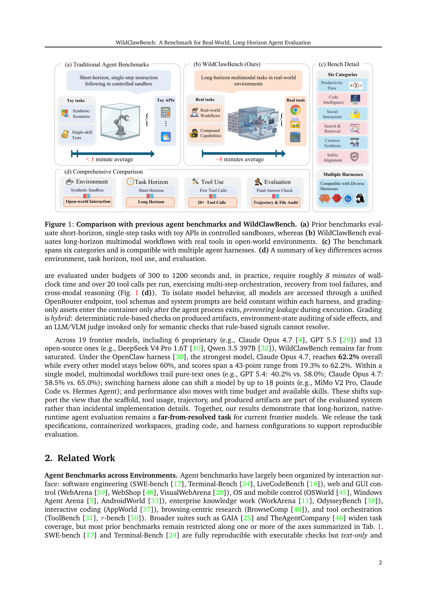
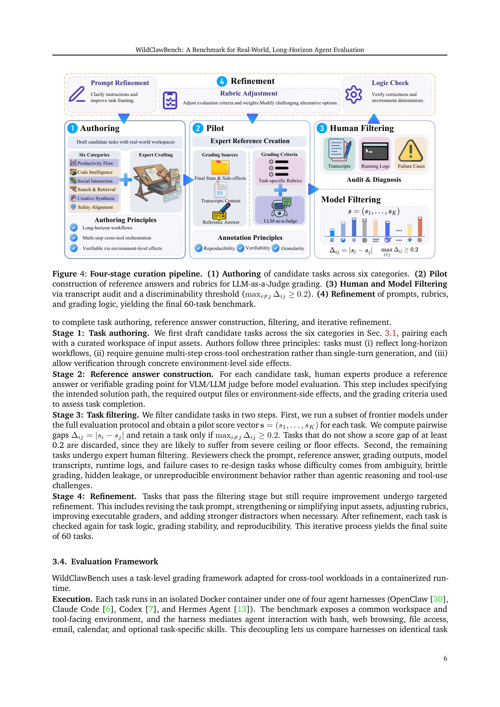

`bench_wildclawbench | WildClawBench: A Benchmark for Real-World, Long-Horizon Agent Evaluation | Shanghai AI Lab + CUHK/Fudan/USTC/SJTU 等(InternLM 系) | 2026-05·arXiv v1·2605.10912 | L?(评测基准线/agent harness 评测) · 相关性 High(对"探索-巩固"提供长程原生运行时评测床)`

> light 档(benchmark 类:头部+TL;DR+评测维度+机制速览+top-2图+假设一句+对标一句)

══ 第一层:一眼看懂 ══
- 🟦 **TL;DR**:现有 agent benchmark 大多是"合成沙盒 + 短任务(<1分钟)+ 玩具 API + 只看最终答案"。WildClawBench 反着来:**60 个人工编写的双语、多模态、长程任务**(平均 8 分钟墙钟、>20 次工具调用),全程跑在**真实 CLI agent harness**(OpenClaw / Claude Code / Codex / Hermes Agent)+ **真实工具**的可复现 Docker 容器里。评分是**混合三件套**:确定性规则检查 + 环境副作用审计(查文件/状态改了没)+ LLM/VLM judge 做语义判定。19 个前沿模型里最强 Claude Opus 4.7 在 OpenClaw 下也只有 62.2%,其余全在 60% 以下;光换 harness 同一模型就能差 18 分。【原文 Abstract/§1】
- **最巧的一步**:**把"评分资产只在 agent 进程退出后才挂进容器"**——这一步保证 grading-only 数据不会在执行中泄漏给 agent(否则 agent 能偷看 ground-truth)。抽掉它,长程真实工具评测的"防泄漏 + 可复现"就垮了。再加"环境状态审计副作用"使评分能抓到 agent 实际怎么用 runtime,而非只看最终答案。【原文 §1, §3】

══ 第二层:为什么需要这评测 ══
- **研究背景**:【原文 §1】LLM/VLM 越来越多地通过 **CLI agent harness**(OpenClaw、Claude Code 等)代用户执行多步动作——规划、调外部工具、维护记忆/状态、按中间结果适应,横跨编码助手、科研工作流、日常电脑操作。能力与部署规模上来后,评测不能只看「终态答案对不对」,还要看「是否通过可靠、可审计、安全的 runtime 交互达成」。
- **解决的具体痛点**:【原文 §1/Fig.1a】现有 benchmark 在「真实部署条件」的四个轴上覆盖不均:① 合成沙盒而非开放世界 runtime;② 短程任务(<1 分钟);③ 几个 mock-service API 调用代替复合真实工具用;④ 只做最终答案检查、无轨迹/产出物级审计。结果:**只测了「最终答案对不对」,没测「runtime 实际怎么被用来产生它」**。
- **相关工作 & 各自不足**:【原文 §1】prior agent benchmark(引 [22,25,46] 等)在上述四轴各缺一截——要么沙盒、要么短程、要么 toy API、要么只看终答。WildClawBench 反着补齐全部四轴(开放世界 × 长程 × 20+真实工具 × 轨迹&文件审计)。
- **动机链(一条逻辑链)**:【推断·依据 §1】agent 实际部署在真实 CLI runtime 里 → 要评的是「在真实 runtime 长程用工具的能力」而非「沙盒短任务答题」→ 故必须跑在真实 harness + 真实工具的可复现容器里 → 但真实工具会产生副作用、且评分资产可能泄漏给 agent → 所以评分须「三件套混合(规则+副作用审计+LLM/VLM judge)」且「评分资产只在 agent 退出后才挂入」。为什么不用 mock API 沙盒?因为那测不出 recovery-from-tool-failure、跨模态编排、真实副作用,而这些正是部署所需。
- **与最近邻工作的 Δ**:【推断·依据 Fig.1d】与最像的「真实工具长程 benchmark」相比,关键差异=**显式把 harness/脚手架当成被评系统的一部分**(兼容 OpenClaw/Claude Code/Codex/Hermes,换 harness 同模型差 18 分),并用「环境状态副作用审计」抓 agent 实际怎么用 runtime。为什么有用?它第一次把「模型 vs 脚手架」的贡献暴露成可观测变量(虽未完全解耦)。

══ 第三层:怎么评 + 关键发现数字 + 局限 ══
- **评测流水线**:【原文 §3.3/Fig.4】四阶段策展:(1) 六类别候选任务人工编写,每个配 agent-facing prompt + 预期行为 + 人读 rubric + workspace 路径 + optional skills;(2) pilot 试跑;(3/4) 验证 + **grading-only 资产仅在 agent 进程退出后挂入容器**(防泄漏)。运行时:模型统一经 OpenRouter 端点,harness 内 tool schema/system prompt 固定,容器装真实 shell/浏览器/文件系统/email/calendar + 任务专属 skills。
- **评分机制(逐组件必要性)**:【原文 §1/§3.4】三层混合——(a) 确定性规则检查(对产出 artifact);(b) **环境状态副作用审计**(查文件/状态改没改);(c) LLM/VLM judge **仅**用于规则无法判定的语义检查。没 (b) 就只能看终态、抓不到 agent 实际操作;没「退出后挂载」防泄漏,grading ground-truth 会被 agent 偷看;(c) 限定语义兜底以控成本/噪声。
- **关键发现 + 具体数字**:【原文 §1/Table(p10)】19 个前沿模型(6 闭源 + 13 开源),OpenClaw 下最强 **Claude Opus 4.7 仅 62.2%**,其余全 <60%,分数跨 43 分(19.3%–62.2%);**多模态工作流落后纯文本**(GPT 5.4:40.2% vs 58.0%;Claude Opus 4.7:58.5% vs 65.0%);**换 harness 同模型差最多 18 分**(MiMo V2 Pro,Claude Code vs Hermes Agent);分数还随时间预算与可用 skills 变化。结论:长程原生 runtime 评测对前沿模型「远未解决」;且这些位移支持「脚手架/工具用法/轨迹/产出物是被评系统的一部分」。
- **任务构成**:60 个人工编写双语任务(26 个原生多模态),六类别对齐 ClawHub 技能 hub;时间预算 300–1200 秒(实测 ~8 分钟/run),>20 工具调用;含 Safety Alignment 类(抵御恶意 skill 注入、拒危险 OS 命令如 rm -rf /、避免静默覆盖文件)。
- **假设与失效边界**:见下方原有「假设」条(隐含「统一端点 + 同 harness 内固定 schema」能把模型与脚手架解耦,但作者自承「换 harness 即差 18 分」——绝对分**不可跨 harness 比较,只在固定 harness 内可比**;60 任务规模偏小、LLM/VLM judge 引语义噪声)。
- **祛魅总结**:【推断】真贡献=**第一个「开放世界 × 长程 × 真实工具 × 副作用审计 × 多 harness」全占的原生 runtime 评测床 + 防泄漏挂载时机这一可信度命门 + 「换 harness 差 18 分」的实证**(把脚手架因素摆上台面)。包装/局限:它本身不训练、不涉及 MTP/OPD,是外部度量工具;harness 因素未标准化使跨系统分数不可比(作者也承认这是待解难题)——属本调研「harness 协同演化」的有力旁证而非竞品。

══ 评测维度(A 栏:benchmark 抽其评测维度)══
- **任务规模**:60 个人工编写任务;双语(中/英);多模态(26 个原生多模态任务);平均 ~8 分钟墙钟、>20 工具调用;时间预算 300–1200 秒。【原文 Abstract/§1】
- **六大主题类别**(对齐 ClawHub 可复用技能 hub):① Productivity Flow(生产力流程)② Code Intelligence(代码智能)③ Social Interaction(社交交互)④ Search & Retrieval(搜索检索)⑤ Creative Synthesis(创意合成)⑥ Safety Alignment(安全对齐)。【原文 §3, Fig.1(c)/Fig.2】
- **harness 维度**(关键创新):兼容多个真实 CLI harness——OpenClaw、Claude Code、Codex、Hermes Agent;明确把"脚手架/工具用法/轨迹/产出物"视为**被评测系统的一部分**而非实现细节(换 harness 同模型可差 18 分)。【原文 §1】
- **评分维度(三层混合)**:(a) 确定性规则检查(对产出 artifact);(b) 环境状态审计(side-effect / 文件审计);(c) LLM/VLM judge 仅用于规则无法判定的语义检查。返回 per-criterion + 聚合 overall 分。【原文 §1, §3】
- **对比轴(Fig.1d)**:环境(合成沙盒 vs 开放世界)× 任务时长(短 vs 长)× 工具用量(少量 vs 20+)× 评估(最终答案 vs 轨迹&文件审计)。
- **关键发现维度**:多模态工作流落后纯文本(GPT5.4 40.2% vs 58.0%);分数随时间预算与可用 skills 变化;失败模式分析(Fig.6,300 次 OpenClaw run × 5 模型)。

══ 🎯 机制速览 6 轴(benchmark→多为"不适用",标注其评测对象)══
| 学什么信号 | 改什么 | 何时改 | 免梯度? | 记忆-技能生命周期 | 防遗忘机制 |
|---|---|---|---|---|---|
| 不适用(评测床,不训练);**评测对象**=agent 在真实 runtime 的长程工具使用与产出 | 不适用(被评 agent 可带 memory/state/skills,但 bench 本身不改参数) | 不适用(test-time 评测,单任务 8 分钟级) | 不适用(纯评测) | 评测对象侧:任务可挂载 optional skills/env vars(对齐 ClawHub 技能 hub);bench 不管理生命周期 | 不适用 |

══ 🖼 关键图 top-2 ══

*这是原文 Fig.1。表现了 WildClawBench 的核心立意:传统基准是"短程单步+玩具API+合成沙盒+只看最终答案",本文是"长程多模态+真实工具+开放世界+轨迹&文件审计",并标出兼容多 harness。选它因为一张图把"为什么需要这个 bench"说透。*

*这是原文 Fig.4。表现了 60 个任务的构造与质控:(1) 六类别候选任务人工编写 →(2) 容器化 workspace 与可执行 grading 函数配对 →(3/4) 验证与 grading-only 资产仅在 agent 退出后挂入。选它因为它揭示"最巧一步"——防泄漏的评分资产挂载时机,是该 bench 可信度的命门。*

══ 假设与失效边界(一句)══
【推断·依据 §1 设置】隐含假设"统一 OpenRouter 端点 + 同 harness 内固定 tool schema/system prompt"能把模型能力与脚手架变量解耦;但作者自己也承认"换 harness 即变 18 分",说明分数高度依赖 harness 选择——**该 bench 的绝对分不可跨 harness 比较,只在固定 harness 内可比**,且 60 任务规模偏小、LLM/VLM judge 引入语义评分噪声(失效边界)。

══ 🎯 对"探索-巩固"idea 对标(一句)══
**可借组件 / 评测床**:WildClawBench 提供"长程(8分钟/20+工具调用)、真实 runtime、带副作用审计"的评测环境,正好能检验 TSRD 的 path-recovery 在真实工具失败时能否恢复——可作为衡量"巩固后是否更稳健/更省工具调用"的 downstream 评测;但它本身不训练、不涉及 MTP/OPD,属外部度量工具而非竞品。

──────────
⑦ 开源代码 + 框架/harness:**已开源** https://github.com/internlm/WildClawBench(任务规范 + 容器化 workspace + grading 代码 + harness 配置)。被评 harness:OpenClaw / Claude Code / Codex / Hermes Agent(模型经统一 OpenRouter 端点)。【原文脚注/Abstract】
💰 资源/成本:每任务 300–1200 秒预算(实测 ~8 分钟),需 Docker 容器 + 真实工具 + LLM/VLM judge API 调用,评测成本与延迟较高(原文未给总 API 成本数字)。
🔭 开放问题:【原文】长程原生运行时评测对前沿模型"远未解决"(最高 62.2%);多模态工作流仍显著落后纯文本。【推断·依据换 harness ±18 分】如何把"脚手架因素"标准化以使跨系统分数可比,是该方向待解难题。
