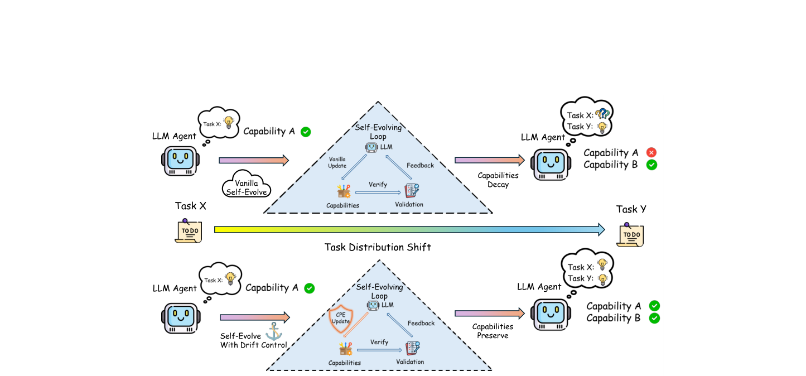
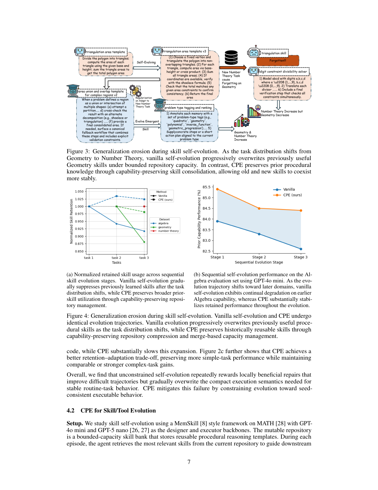

`capability_erosion_cpe | Do Self-Evolving Agents Forget? Capability Degradation and Preservation in Lifelong LLM Agent Adaptation | UIUC(伊利诺伊大学香槟分校,Haohan Wang 组;Ye Yu 一作) | 2026-05 首发·arXiv v1(2026-05-10)·Preprint·cs.AI | 主题线 L?(自进化 agent 的"遗忘/防遗忘=巩固"线 —— 直击"探索-巩固"的稳定性侧)· 相关性 High` 

> 三标注约定：【原文】= 论文明说；【推断】= 我的有据判断(附依据)；【待核】= 拿不准的关键事实。

══ 第一层：一眼看懂 [light] ══

- 🟦 **TL;DR**：现在所有"自进化 agent"框架(改 workflow / 攒技能 / 自训模型 / 累积记忆)都只盯着"新任务上有没有进步",**没人系统问过:学新任务时,以前会的还会不会?** 本文做了这个实验,发现答案是"**经常不会**"——自进化是**非单调(non-monotonic)** 的:适应新任务分布会**渐进式地侵蚀已掌握的旧能力**,而且这在 workflow / skill / model / memory **四条通道上一致出现**。作者把这命名为 **capability erosion(能力侵蚀)**,并给出一个统一的成因解释:四种演化看似异构,本质都是"**反复重写一个可变仓库(mutable repository)以容纳新任务**",每次只为新任务优化的更新都会**破坏性干扰(destructive interference)** 掉旧任务依赖的结构。对策是 **Capability-Preserving Evolution(CPE,能力保持式演化)**:在演化目标里加一个**保持正则项 Ω**,偏向"既学会新任务、又最小破坏旧能力支撑结构"的更新。四通道各自实例化 Ω(workflow 锚行为签名 / skill 合并保护高价值技能 / model 用 EWC-Fisher 正则 / memory evidence-gated 保护),实验都能稳住旧能力且不牺牲新任务(如 workflow:GPT-5.1 下保留的简单任务性能 41.8%→52.8%,同时复杂任务也更强)。【原文 Abstract/§1-4】
- **最巧的一步**：**Proposition 1 的"曲率机制"——把"能力侵蚀"精确地归因到一个二次型 \(½η²·gₜᵀ H_<t gₜ\)**(新任务梯度 \(g_t\) 在旧能力 Hessian \(H_{<t}\) 的正曲率方向上的投影)。抽掉这个机制分析,本文就只是"又一篇报告四个场景都会遗忘"的实证;**正是这一步把四种异构演化(workflow/skill/model/memory)统一到同一个数学根源——"更新方向与旧能力敏感方向的重叠度"**,从而 CPE 的保持正则(用一个度量 \(M_t\) 上控 \(H_{<t}\))才有了统一的理论落点(Prop 2)。这是全文从"现象描述"升级为"机制+药方"的关键。

══ 第二层：为什么做（写透） ══

- **研究背景**：LLM agent 正从"静态手工系统"转向"自进化实体"——能自主优化 reasoning workflow、构建可复用 skill/tool、自训模型参数、累积持久记忆,愿景是"agent 一生持续扩张能力"。【原文§1】
- **解决的具体痛点**:这套愿景隐含一个**几乎没人验证过的假设**——"agent 适应新任务时,会保留它已掌握任务上的能力"。本文实证表明**这个假设在很多情况下不成立**:获得新能力常以**牺牲旧能力**为代价。具体地,capability erosion **不是单一的 held-out 准确率下降**,而是**结构性地分三种模式显现**(§1):
  - **(1) 回溯性能力衰退 Retrospective capability decay**:在新分布上微调后,旧任务性能掉。
  - **(2) 行为策略漂移 Behavioral policy drift**:workflow 越变越长越复杂,塞进无用步骤引入噪声(过度防御化)。
  - **(3) 泛化侵蚀 Generalization erosion**:适应演化后的分布会**收窄有效推理空间**,在 skill/memory 演化中干扰旧能力。
- **统一机制诊断**:四通道看似异构,但**全都在反复重写一个可变仓库**(workflow=可执行策略图/prompt 程序;skill=有界技能库;model=可训练参数;memory=外部记忆库)。每次只为新分布优化的更新 → **破坏性干扰** → 覆盖掉旧任务依赖的内部结构。所以能力侵蚀**不是某个机制的 artifact,而是"无约束持续自我修改"的结构性后果**。【原文§1/§2.1】
- **相关工作 & 各自不足**(§5)：
  - **自进化 agent 线**(ADAS、AFlow、EvoAgentX、EvoFlow、SEW、Voyager、ExpeL、MemSkill、Tool-R0、SkillCraft、STaR、B-STAR、Dynamic Cheatsheet、Evo-Memory…;Gao et al.[本调研锚 survey_self_evolving_agents_asi]/Fang et al.[selfevolve_survey2] 作综述):**全都只用"新任务前向进步"衡量自进化**,从不问"是否保留旧能力"。本文是**第一篇系统研究这个问题**的。
  - **持续学习线**(EWC[Kirkpatrick 2017]、CL survey、PEFT 遗忘分析、机制分析[本调研 mech_analysis_cf 即 ref 23 arXiv:2601.18699]):成熟,但**假设唯一可变组件是权重**。自进化 agent 同时改 workflow/skill/memory/参数 → 各有不同的退化机制,本文把遗忘问题**扩展到多组件设定**。
  - **自进化风险线**(Shao et al.[即本调研 misevolution]记录涌现安全失准;Zhou et al. 关联能力训练与对齐漂移):**关注"安全退化"**;本文动机相同但**聚焦"保留能力退化"**(旧的功能能力丢没丢),与安全侧互补。
  - **与最近邻工作的 Δ**:与 misevolution(Shao et al.)最像(都讲"自进化引入退化"),**关键差异 = 退化的对象**:misevolution 关心**安全对齐/价值层退化**(变得不安全),本文关心**功能能力层退化**(以前会的题不会了)。这差异有用,因为两者机制不同、对策也不同——本文用"曲率/Fisher 重要性正则"这类**连续学习工具**对治,misevolution 用的是 prompt 级安全补丁。【原文§5 "Risks in Self-Evolving Agents"】

══ 第三层：怎么做 + 靠不靠谱 ══

- **方法流水线(理论模板 → 四通道实例化;核心是一个统一目标 + 曲率分析)**：
  1. **统一形式化(§2.1)**：自进化 = 在任务分布序列 \(D_1\dots D_T\) 上的顺序适应。stage t 的 agent 用**能力状态 \(R_t\in\mathcal{R}\)** 表示(可以是 workflow / skill 库 / 参数 / 记忆库)。朴素自进化只优化当前 stage 目标:\(R_naive_t ∈ argmin_R Lₜ(R)\)(Eq.2)。**关键抽象:故意隐藏 \(R_t\) 的具体表示,让四通道共享同一套学习动力学**。
  2. **定义能力侵蚀(§2.2)**：保留的旧分布风险 \(L_<t(R)=Σ_{i<t} αᵢ Lᵢ(R)\)(Eq.3)。若适应当前 \(D_t\) 使 \(L_<t(Rₜ) > L_<t(R_{t-1})\)(Eq.4),即发生能力侵蚀。**根因 = 分布干扰**:当前目标 \(L_t\) 的极小点与旧目标 \(L_{<t}\) 错配时,只优化 \(L_t\) 会把状态推向"增加旧风险"的区域。
  3. **局部曲率机制(§2.3,Prop 1)**：设 \(R_{t-1}\) 对旧分布已局部适应(\(\nabla L_{<t}=0\)),旧能力 Hessian \(H_<t⪰0\),新任务梯度 \(gₜ=∇Lₜ\)。朴素更新 \(R_naive_t=R_{t-1}−η gₜ\) 后,**旧任务损失增量 = \(½η²·gₜᵀ H_<t gₜ + o(η²)\)**。⇒ **只要 \(g_t\) 在 \(H_{<t}\) 的正曲率方向有非零投影,旧能力就退化**——侵蚀**不由更新大小单独决定,而由"新更新方向与旧能力敏感方向的重叠"决定**。
  4. **CPE 目标(§3.1,Eq.5)**：\(R_CPE_t ∈ argmin_R Lₜ(R) + λ Ωₜ(R, R_{t-1})\)。\(\Omega_t\) 衡量"偏离旧能力支撑结构"的程度,λ 控 stability-plasticity 权衡(λ=0 即朴素)。**Ω 不是阻止演化,而是偏向低干扰解**:在所有能改进新分布的更新里,挑最不破坏旧结构的。
  5. **局部遗忘控制(§3.2,Prop 2)**：二次代理下 \(∆_λ=−(Hₜ+λMₜ)⁻¹ gₜ\),在"保持度量 \(M_t\) 上控旧 Hessian"(Assumption 1: \(H_{<t} \preceq c M_t\))下,旧任务退化 \(≤ (c/2λ²)‖gₜ‖²_{Mₜ⁻¹}\)。⇒ **加大 λ 同时抑制旧任务退化 + 限制新任务更新幅度**,即局部 stability-plasticity 权衡。
- **四通道实例化(§3.3 + §4,同一目标、不同 Ω)**：
  - **① Workflow(§4.1)**：\(R_t\)=可执行 workflow。\(\Omega_{wf}\)=**注入从种子 workflow 抽的"锚行为签名"**(核心任务目标 / 输出约束 / 失败规避行为),抑制破坏性重写。框架:**EvoAgentX** on **τ²-Bench**,GPT-5.1 / GPT-5 nano 当 optimizer。证据:Table 1 —— 保留的简单任务 Avg 41.8%→52.8%(GPT-5.1),复杂任务 Avg 23.9%→33.4%(**两头都涨**);Fig 2 —— 朴素演化累积"验证算子/结构绕路"使 workflow 越来越臃肿、过度防御(把略不标准但有效的动作也拒了),CPE 大幅减缓结构膨胀。
  - **② Skill/Tool(§4.2)**：\(R_t\)=有界容量技能库。\(\Omega_{sk}\)=**入库前检查能力签名 + 合并语义相近技能腾容量 + 保护高复用技能不被直接删**。框架:**MemSkill 风格** on **MATH**,GPT-4o mini / GPT-5 nano 当 designer/executor。证据:Table 2(Algebra→Geometry→Number Theory 演化后三域都 CPE 略高);**Fig 4a 朴素演化逐步压制旧域技能使用率,CPE 保持更广的旧技能利用;Fig 4b Algebra 评测集上朴素持续退化,CPE 稳住**。
  - **③ Model(§4.3)**：\(R_t\)=可训练参数(LoRA adapter)。\(\Omega_{md}\)=**EWC 式 Fisher 重要性加权二次罚** \(Ω_md=½Σᵢ Fᵢ(θᵢ−θ_{t-1,i})²\)(Eq.7),罚对旧域重要的参数移动。框架:**STaR 自训** on **MedMCQA**,Qwen3-0.6B / Llama3.2-3B,Anatomy→Biochemistry→Dental 顺序。证据:Table 3 + Fig 5 —— 朴素出现经典灾难遗忘,CPE 在所有域保留更高旧性能(Qwen3-0.6B Anatomy 29.4%→30.5% 等,幅度不大但一致)。
  - **④ Memory(§4.4,细节在 Appendix F)**：\(R_t\)=持久记忆库。\(\Omega_{mem}\)=**evidence-gated preservation**(保护历史可靠记忆、低证据条目仍可改),把平均 retention gap 从 2.3%→0.7%。
- **逐组件必要性**：CPE 在**四通道各做"朴素 vs CPE,同 pipeline/同预算"对照**,Ω 是唯一变量 → 干净隔离了"保持正则"的贡献。**理论侧 Prop 1/2 提供因果机制**(侵蚀来自曲率重叠、CPE 沿低干扰方向更新)。**消融**:λ 是显式 stability-plasticity 旋钮(Eq.5)。【推断:正文未见对 Ω 各子项的细粒度消融(如 workflow 三种锚签名分别去掉),细节可能在附录;依据:正文只报 vanilla-vs-CPE 二元对照。】
- **关键机制直觉**：核心直觉是"**遗忘不是因为'改得太多',而是因为'改在了旧能力的命门方向上'**"。EWC 的 Fisher、workflow 的锚签名、skill 的合并保护、memory 的 evidence-gate,**本质都是同一招的不同实现:先估出'哪些方向/条目对旧能力重要',再在那些方向上加阻力**——这正是 \(H_{<t} \preceq c M_t\) 这个"保持度量上控旧 Hessian"的假设在各通道的具象。
- **实验与证据**：
  - **数据集/环境**:τ²-Bench(workflow,Airline/Retail/Telecom)、MATH(skill,Algebra/Geometry/Number Theory)、MedMCQA(model,Anatomy/Biochemistry/Dental)、记忆 benchmark(Appendix F)。**模型**:GPT-5.1 / GPT-5 nano / GPT-4o mini(闭源 optimizer/executor)、Qwen3-0.6B / Llama3.2-3B(开源,model 通道自训)。
  - **支撑核心主张的关键实验 = 四通道一致的 vanilla<CPE 表**(Table 1-3 + Fig 4/5):Table 1 最亮眼(workflow 保留任务 +11 个点且复杂任务也 +9.5);**Fig 4a 的"旧技能使用率随演化单调下降(vanilla)vs CPE 保持"** 最直观地展示"泛化侵蚀"机制。
  - **baseline 公平吗 / 隐患**【推断】:① **model/skill 通道的绝对增益偏小**(常 ~1-2 个点,如 Table 3 Anatomy 29.4→30.5、Biochemistry 仅 +0.1 on Llama),"consistently improves"成立但**幅度有限**,workflow 通道才是增益主战场;② **各通道用了不同 benchmark + 不同模型规模**(workflow 用 GPT-5.1,model 用 0.6B/3B),"四通道普遍性"是定性成立,但**跨通道不可直接量化比较**;③ 闭源 GPT-5.1/nano 作 optimizer,可复现性依赖 API 版本。④ **CPE 各实例其实是已知技术的迁移**(EWC=2017 经典、skill 合并=常见库管理、workflow 锚签名=prompt 约束),**新意主要在"统一框架+曲率机制解释",而非单个 Ω 的算法创新**。
- **假设与失效边界**：
  - 【原文 Prop 1/2 + Assumption 1】机制分析建立在**局部二次近似 + \(R_{t-1}\) 是旧目标局部极小点 + 保持度量上控旧 Hessian(\(H_{<t}\preceq cM_t\))** 之上;远离极小点 / 强非凸 / 度量与真实 Hessian 错配时,理论保证可能失效【推断,依据 §2.3/§3.2 的局部假设措辞】。
  - 【原文§2.2】当新旧分布"能力支撑重叠"时,干扰可能很弱甚至有益(正迁移);CPE 的收益在**新旧分布结构错配大**时才显著。
  - 【推断】非参数通道(workflow/skill/memory)里,"Hessian/曲率"只是**类比**(这些仓库不是连续可微参数空间),Prop 1/2 严格成立于 model 通道,其余通道是"同构动力学"的**启发式映射**;依据:§2.1 明说"intentionally hides the concrete representation",§3.3 对非参数通道用"capability-aware discrepancy"而非真 Hessian。
  - 【推断】实验为**短序列(3 stage / 3 域)**,长程(几十上百 stage)下 CPE 的累积稳定性、以及"保护太多旧能力→新任务学不动(plasticity 塌缩)"的边界未充分探。
- **祛魅总结**：
  - **真贡献(硬货)**：① **首次系统提出并命名 capability erosion**,并给出"三种显现模式(回溯衰退/策略漂移/泛化侵蚀)"的清晰分类;② **统一干扰视角 + 曲率机制(Prop 1)**——把四种异构演化的遗忘归到同一数学根源(更新方向 × 旧能力曲率重叠),这是真正有迁移价值的理论积木;③ **CPE 作为通用稳定化原则 + 四通道可操作的 Ω 实例**,把"持续学习的防遗忘"完整搬到"多组件自进化 agent"语境;④ 把"自进化"的评价从单维(新任务进步)升级为**双维(plasticity × stability)**。
  - **包装/营销成分**【推断】:① "general principle"框架很漂亮,但**落地的四个 Ω 多是已知技术迁移**(EWC/库合并/prompt 锚),单点创新有限;② model/skill 通道实证增益**偏小**,"consistently improves"在统计上成立但实用意义需更大规模验证;③ 非参数通道借用"Hessian/曲率"语言略有"理论包装"嫌疑(严格只对 model 通道成立)。
  - 作者**较诚实**:把 memory/部分细节诚实地推到附录、明说是 Preprint v1;Related Work 清楚区分了自己与 misevolution(安全侧)/经典 CL(单组件)的边界【推断】。

══ 结构化抽取 ══

- 🎯 **机制速览 6 轴** [light]：

| 学什么信号 | 改什么 | 何时改 | 免梯度? | 记忆-技能生命周期 | 防遗忘机制 |
|---|---|---|---|---|---|
| **环境/任务反馈(各通道:workflow=失败轨迹反馈、skill=失败轨迹聚合、model=STaR 自生成正确 rationale、memory=检索证据);本文额外"学"的是旧能力 Hessian/重要性的代理** | **四通道全覆盖:可执行 workflow(prompt+算子) / 有界技能库 / LoRA 参数 / 持久记忆库** | **顺序/离线批量(stage 级,每个新任务分布一个 stage 重写仓库)** | **混合**:model 通道含梯度(LoRA+EWC);workflow/skill/memory 通道**免梯度**(LLM 重写 / 库合并 / 记忆门控) | **本文核心正是刻画并修复生命周期里的"淘汰"环节**:写入(入库/入参/入记忆)→检索/复用→**淘汰(LFU 驱逐/参数覆盖/记忆驱逐)** —— 朴素淘汰是"破坏性覆盖",CPE 改成"合并/保护/证据门控的非破坏淘汰" | **本文主题=系统化防遗忘**:统一原则 CPE(保持正则 Ω);四实例 = **model: EWC-Fisher 重要性二次罚(KL/Fisher 投影类)** / **skill: 语义合并 + 高价值保护(merging + 隔离)** / **workflow: 锚行为签名约束** / **memory: evidence-gated 保护**。机制根源:沿"旧能力低曲率方向"更新(Prop 2) |

- ⑦ **开源代码 + 框架/harness**：**未开源 / 未找到**——【原文】通篇无代码链接(标注"Preprint",PDF 首页与正文均无 github/anonymous/HF URL;PyMuPDF 解链接仅得 arXiv abs 与参考文献 arXiv 链接)。**实验所用框架(均为他人开源,本文复用):EvoAgentX(workflow,arXiv:2507.03616,即本调研 evoagentx)、MemSkill 风格(skill,arXiv:2602.02474)、STaR 自训(model,arXiv:2203.14465)+ LoRA + EWC(Fisher)、记忆库(Appendix F)**;**无统一自研训练框架**。〔待核:CPE 自身实现是否后续放出,待 P3 用 WebSearch 快照核验;当前按"PDF 没写就不编"——记为未开源。〕
- 💰 **资源/成本与可扩展性**：【原文部分给出】model 通道用 **小模型(Qwen3-0.6B / Llama3.2-3B)+ LoRA** → 算力门槛低;workflow/skill 通道靠 **GPT-5.1/nano/4o-mini API**(optimizer/executor)→ 主要成本是 API 调用;实验为**3-stage 短序列**。【未给精确 GPU 时长 / API 花费 / 延迟】。可扩展性:CPE 是**轻量加项(在已有 pipeline 上 +Ω 正则,不改主干)**,理论上易嵌入任意自进化框架,但长序列/大规模未验。
- 🎯 **对"探索-巩固"idea 对标** [light]：**直接支撑 + 核心可借组件(本项目"巩固"侧的理论骨架,信息量最高的对标之一)**。① **它就是"巩固=防遗忘"的正面答卷**:本项目"探索→巩固"里的"巩固"必须解决的正是 capability erosion,本文给了**统一目标(L+λΩ)+ 机制(曲率重叠)+ 四通道实例**,可直接作为本项目"可学习离线巩固"的稳定性约束模板。② **曲率机制 = 与本调研一贯的"几何/Fisher 投影防遗忘"信号同源**:Prop 1 的 \(gₜᵀH_<t gₜ\) 与 agent_dice/geometry_conflict/fopng_fisher 等"沿旧能力子空间投影"完全同构 —— **本项目做 MTP 引导探索时,可用 H_<t(或其代理)判断"哪些前瞻探索方向会侵蚀旧能力",把巩固约束加在这些方向上**。③ **可借组件**:workflow 的"锚行为签名"(把种子成功行为抽成约束)↔ 本项目可把"已验证的正确路径片段"抽成锚,约束后续 path-recovery 不偏离;skill 的"语义合并替代直接驱逐"↔ MTP 前瞻产物入库时的非破坏巩固策略;memory 的"evidence-gated 保护"↔ 巩固前的"坏经验过滤"闸(与 misevolution 的 reward-hacking 警示互补)。④ **竞品/缺口**:本文是**事后被动正则(每步加 Ω 阻力)**,且**不结合前瞻探测**——本项目的差异点可放在"**用 MTP 前瞻主动预测哪条探索路径会引发侵蚀**(把 H_<t 的被动估计换成前瞻式主动预演)",以及"per-step 而非 per-stage 的细粒度巩固"。
- 🔭 **开放问题/未来方向**：【原文 Conclusion】① 稳定长程自进化需"既获取新能力、又显式保留旧能力"——呼吁把"保持"作为自进化的一等目标;② 把遗忘问题扩展到多组件设定(已做,但更多通道/组合待探)。【推断】③ 长序列(几十上百 stage)下 CPE 的累积稳定性 & plasticity 塌缩边界;④ 非参数通道的"曲率/重要性"严格化(当前是启发式映射);⑤ 自动调 λ(stability-plasticity 自适应);⑥ 与 misevolution(安全侧退化)统一成"自进化退化"的完整理论;⑦ 前瞻式主动防侵蚀(把被动 Ω 换成预测性巩固)。

- 🖼 **关键图 top-2** [light]：

· 这是**原文 Figure 1**(全文统领图,已裁剪)。上行:Task X→Task Y 分布漂移下,**Vanilla Self-Evolve** 经"自进化循环"后 → Capabilities Decay(能力 A 红叉,只剩 B);下行:**Self-Evolve With Drift Control(CPE)** 经同样循环 → Capabilities Preserve(能力 A、B 双绿勾)。选它因为它一张图讲清本文的**核心命题=自进化在分布漂移下会侵蚀旧能力,而加"漂移控制(CPE)"能同时保住新旧能力**——正是"探索-巩固"中"巩固"要达到的目标态。

· 这是**原文 Figure 4**(skill 通道核心证据图)。(a) 归一化的"旧域技能使用率"随顺序演化阶段变化:**Vanilla 单调下滑**(新技能挤占有界库容、旧技能被驱逐),**CPE 维持更高的旧技能利用**;(b) Algebra 评测集性能随演化轨迹:**Vanilla 持续退化,CPE 稳住**。选它因为它**直接、量化地把"泛化侵蚀"这一抽象失效模式可视化**(库容竞争→旧技能被覆盖),并展示 CPE 的"合并保护式巩固"如何让新旧技能共存——对本项目"非破坏式巩固"最有借鉴。
