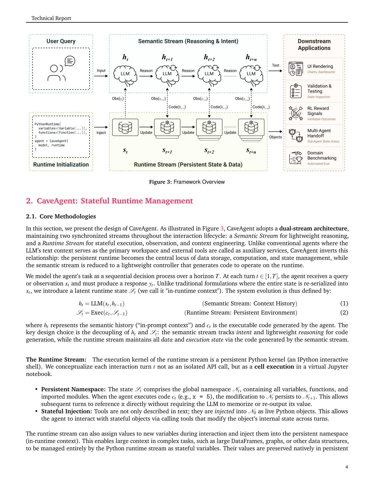
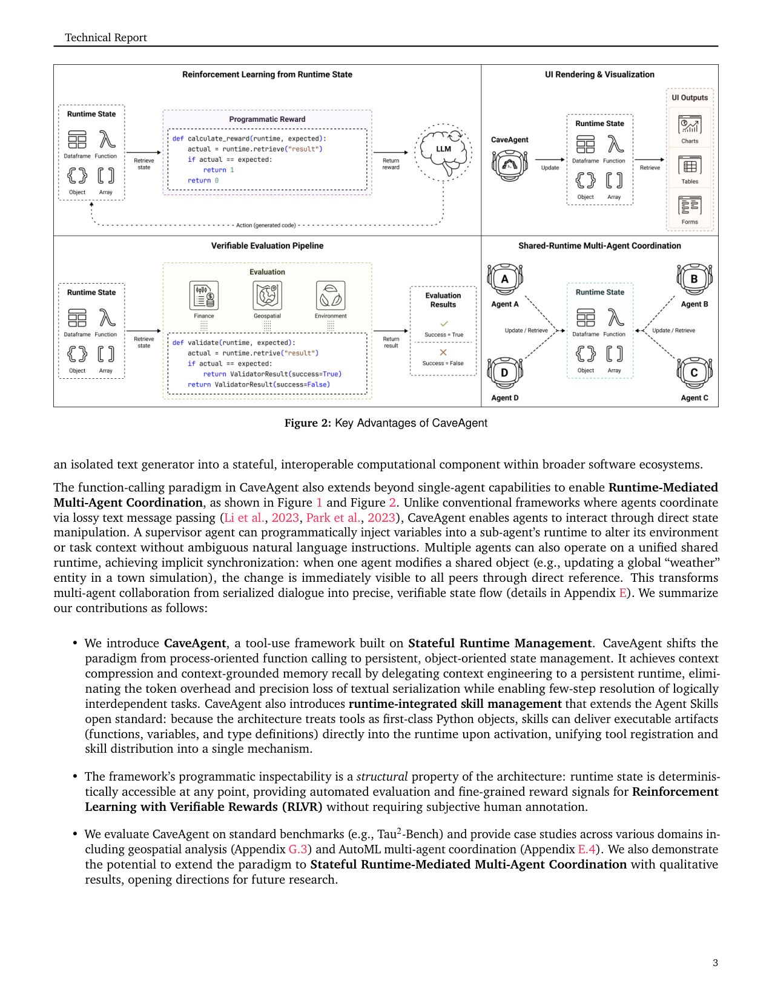

`caveagent | CaveAgent: Transforming LMs into Stateful Runtime Operators | HKGAI/HKUST·HKBU·NUS·NTU 等多校联合(Jun Song/Zhenglin Wan 等) | Tech Report, arXiv 2601.01569v3, 2026-02-19 | 主题线 L?(Agent harness / 状态化运行时 + Skill 管理)· 相关性 中`

> light 档笔记。基于真实 PDF 正文(初次 12.6MB 下载被截断、xref 损坏,已重下 15.2MB 完整版后抽取)。三标注:【原文】【推断】【待核】。

══ 第一层:一眼看懂 [light] ══
- 🟦 **TL;DR**:【原文】现在的 LLM agent 把"文本上下文窗口"当唯一工作台,多轮任务里数据要反复序列化进 prompt → token 爆炸 + 上下文漂移 + 幻觉。CaveAgent 把"LM 当文本生成器"换成"LM 当运行时操作员(Runtime-Operator)":开两条流——**Semantic Stream**(LLM 只做轻量推理、生成代码)和 **Runtime Stream**(一个跨轮持久的 IPython 内核,所有 DataFrame/数据库连接/对象都活在里面)。让"持久运行时"而非"上下文窗口"成为数据与状态的权威存储(state as memory, code as action)。还把社区 Agent Skills 标准从"纯文本 SKILL.md"扩展为"SKILL.md + injection.py"(可往运行时注入可执行函数/变量/类型)。在 Tau2-bench/BFCL 上 6 个 SOTA LM 一致提升:零售任务成功率 +10.5%、总 token -28.4%、数据密集任务 token -59%。
- **最巧的一步**:【推断,依据 §2.1 式(1)(2)】把语义历史 h_t 与运行时状态 S_t **解耦**——\(h_t=LLM(x_t,h_{t-1})\) 只跑意图/代码,\(S_t=Exec(c_t,S_{t-1})\) 维护全部数据;语义流默认对运行时"盲",要看状态必须主动写 `print(df.head())`(Active Attention)。抽掉这个解耦,数据又回流进 prompt,token 压缩与抗漂移收益就垮了。

══ 第二层:为什么做 ══
- **研究背景**:【原文 §1】工具集成推理(TIR)让 LLM agent 多轮调外部工具/API,已铺到科学发现、数学、Web 导航、机器人等域。主流工具调用协议要求模型吐严格 JSON schema(\({"tool":"get_stock","params":{...}}\)),把"模型生成文本"当唯一动作。
- **解决的具体痛点**:【原文 §1】JSON-FC 范式有三大结构性病:① **僵化控制流**——每轮只能发一个(或一批)工具调用、输出序列化回上下文,顺序编排引入大量延迟;② **无状态**——每次调用是孤立事务,跨轮无持久态,中间结果必须序列化成文本回灌,造成 token 膨胀 + 级联错误传播;③ **组合性差**——JSON 只能表达扁平函数签名,无法原生表达 loop/conditional/变量依赖,逼着把多步逻辑摊进易错的多轮对话。即便已有的 code-based tool use(CodeAct 等)也是"过程导向、运行时内化、text-bound":变量只能通过文本 print 出来才能被外部看见,形成"文本化瓶颈(textualization bottleneck)"——结构化对象(大数据集、视频、DB 连接)无法直接进出。
- **相关工作 & 各自不足**:【原文 §1】(a) JSON 函数调用(OpenAI FC):僵化、无状态、组合性差;(b) code-based agent(CodeAct/Wang 2024、Yang 2024):虽用代码解决了控制流与组合,但运行时仍内化、状态 text-bound,跨轮无法无损传递原生对象;(c) 多 agent 框架(CAMEL/Generative Agents):靠有损文本消息传递协调。三者共同缺陷:**始终把 LLM 的上下文窗口当数据/状态的权威存储**。
- **动机链**:【原文 §1】现状=工具调用以文本/上下文为中心 → 缺陷=长程任务里多轮依赖脆弱、上下文漂移、序列化损失与 token 爆炸 → 所以必须把"数据/状态的权威存储"从上下文窗口搬到一个**跨轮持久的 Python 运行时**,让 LLM 退化为只生成代码的轻量操作员(为什么不用更简单做法:纯加大上下文窗口治标不治本——仍有漂移与序列化损失;纯 code-based 但内化运行时仍 text-bound,无法无损传对象/供下游/做可验证 reward)。
- **与最近邻的 Δ**:【推断,依据 §2.1 末段】最近邻是 CodeAct 式 code-based agent。关键 Δ=**把运行时从"内化、单向(只能 print 出文本)"改成"外置、双向接口"**——可往持久命名空间注入活对象、也可把活对象无损取出供 UI/校验/RLVR/多 agent。这个差异有用,因为它一举解决了"对象进出无损 + 跨轮持久 + 运行时态可程序化校验"三件 CodeAct 做不到的事。

══ 第三层:怎么做 + 靠不靠谱 ══
- **方法流水线**:【原文 §2.1】输入 query x_t → ① **Semantic Stream** 由 LLM 读 (x_t,h_{t-1}) 生成轻量推理 + 可执行代码 c_t(式1);② **Runtime Stream** 把每个 turn 当 Jupyter cell 在持久 IPython 内核里执行 \(S_t=Exec(c_t,S_{t-1})\)(式2),变量/函数/导入模块累积进全局命名空间 N_t;③ 工具/技能在 N_0 即以活 Python 对象注入(Stateful Injection),签名/类型/docstring 抽成轻量 "API reference" 进 system prompt,实体对象映进执行引擎命名空间;④ 语义流默认对运行时"盲",要观察须主动 `print(...)`(Active Attention),输出超 L_max 触发 Observation Shaping 返回结构化错误提示用摘要法;⑤ AST 静态分析(ImportRule/FunctionRule/AttributeRule)拦 eval/危险导入,违规返回结构化错误供自纠;⑥ 输出=native Python 对象,可直接绑 UI/跑单测/算 RL reward/传给其他 agent → 输出 y_t。
- **逐组件必要性**(注:本文为 tech report,**无系统性消融表**,各组件必要性靠对照基线 Function Calling 与设计论证支撑【推断】):① **h/S 解耦**——抽掉则数据回流 prompt,token 压缩/抗漂移全垮(全文核心);② **持久命名空间 N_t**——没它就退回无状态、跨轮要重序列化;③ **Active Attention(默认盲)**——没它运行时态会无差别灌进上下文,Context Explosion 复发;④ **Observation Shaping(L_max)**——没它单条大输出即撑爆;⑤ **AST 安全检查**——没它任意代码执行不安全;⑥ **injection.py 技能扩展**——没它技能只能给文本指令、不能交付可执行工件。其中只有"FC vs CaveAgent"这一对照是定量的,**单组件消融原文未做**(标【推断:缺消融】)。
- **关键机制/直觉**:【原文 §2.1】式(1)(2)的精髓不是公式本身,而是"把状态变量 S_t 从 LLM 的概率生成里**拿出来**,交给确定性的 `Exec`"。直觉:LLM 擅长写代码、不擅长当无损数据库;让运行时当数据库、LLM 当操作员,各扬其长。"runtime variables vs files"三点论证(类型保真/零成本同内存检索/会话自动 GC)解释了为何选内存对象而非文件持久。
- **实验与证据**:【原文 §3】基准=**Tau2-bench(Airline/Retail)+ BFCL**,6 个 SOTA LLM(DeepSeek-V3.2 685B、Qwen3-Coder 30B 等),各跑 3 次。核心数字:零售成功率最高 +10.5%(摘要);Token Efficiency Study(§3.3,DeepSeek-V3.2,IoT/finance/e-commerce 三域)**Table 5/6**:Total Tokens 504K vs FC 704K(**-28.4%**)、Total Steps 145 vs 236(**-38.6%**)、Prompt Tokens -32.7%、成功率 94.6%→100%(+5.4pp);数据密集任务 token **-59%**。注意:Completion Tokens 反而 +36.3%(写代码更长),省的是 prompt 端的重复序列化——基线**公平**(同任务同模型对照 FC)。"看着强但没回答核心问题"的点:**多 agent 协调只有定性 case study(Appendix E),无定量**(作者自认)。
- **假设与失效边界**:【原文 Limitations】① 工具须 Python-callable 或手工包成 Python 函数,非 Python 接口(原生二进制/专有 REST API)要手写 wrapper;② 持久运行时内存正比于存储对象复杂度,**超长会话 + 大数据工件下内存管理成问题**(此时文件持久更优,作者承认);③ 部署环境须允许任意代码执行(AST 仅静态拦截);④ 细粒度 stateful 评测基准与多 agent 定量评估均为 future work。【推断】当任务无法代码化、或在禁止代码执行的沙箱外环境时,双流红利失效。
- **祛魅总结**:【推断】真贡献(硬货)=① "运行时态而非上下文窗口当权威存储"的范式倒置,且工程上落地(双流 + IPython 持久内核 + AST 检查 + injection.py 扩展 agentskills.io 标准);② -28.4% token / -38.6% steps 的实测降本是真。包装/略高估处:① "RLVR 结构基础"是**愿景而非已验证结果**(本文不做任何 RL 训练,只论证运行时态可程序化校验);② 多 agent 协调只定性;③ 无单组件消融,各组件必要性偏论证而非实证。整体是一篇扎实的**工程/范式**论文,不是学习方法论文。

══ 机制速览 6 轴 [light] ══
| 维度 | 内容 |
|---|---|
| 学什么信号 | 【原文】无在线学习信号;靠**持久运行时状态 + 执行反馈/AST 静态分析报错**驱动 agent 自纠错。运行时态可被程序化校验,文中称这为"未来 RLVR 的结构基础",但本文未做 RL 训练。 |
| 改什么 | 【原文】改 **harness/运行时架构**(双流 + 持久 Python 命名空间 + Skill 注入),**不改模型参数**,prompt 仅做轻量动态构造("API reference"式工具签名)。 |
| 何时改 | 【原文】test-time / per-turn:每轮把一个 turn 当 Jupyter cell 执行,变量跨轮累积。 |
| 免梯度? | 【原文】是(纯推理期框架,无梯度训练)。 |
| 记忆-技能生命周期 | 【原文】写入=变量/工具/skill 注入持久命名空间 N_t;检索=对变量元数据(名/类型/描述)语义检索按需拉进上下文(progressive disclosure / activate_skill());遗忘=变量随 session 作用域自动 GC;共享=多 agent 间以原生 Python 对象无损传递(§Appendix E)。 |
| 防遗忘机制 | 【原文】不适用(无参数训练→无灾难性遗忘问题);其"防上下文漂移/防信息损失"靠把状态留在运行时而非 prompt(Observation Shaping 限长 L_max + 主动注意)。 |

⑦ **开源代码 + 框架/harness**:【原文】Code: https://github.com/acodercat/cave-agent(p0 明示)。框架=**自研 harness**(双流架构 + IPython 持久内核 + AST 安全检查 + 扩展 agentskills.io 标准的 injection.py);非 veRL/TRL 等训练框架(本文无训练)。〔待核:未 clone 验证仓库内容,按 B 层只记录链接。〕

💰 资源/成本:【原文】主打降本——零售任务 token -28.4%、数据密集任务 -59%;Stateful Mgmt benchmark 中 Total Steps 145 vs FC、Data Query 100% 正确仅 123K tokens(Table 5/6)。算力/延迟:运行时变量"零成本同内存检索"对比文件 I/O 磁盘延迟(§p4)。无训练成本(无梯度)。

🎯 **对"探索-巩固"idea 对标** [light]:【推断】**可借组件 + 弱竞品**——它把"中间结果/技能"作为持久 Python 对象外置(state-as-memory),与"巩固=把探索所得固化进可复用载体"同构,可作为 OPD/MTP 之外的"非参数巩固"对照;但它完全免梯度、不触及模型内部,与本项目"用 MTP 探针 + on-policy 蒸馏改参数"是正交路线,不构成直接竞品。其"运行时态可程序化校验→自动 reward"对 RLVR 数据生成有可借鉴价值。

🖼 **关键图 top-2** [light]:

这是**原文 Figure 3(Framework Overview)**:一眼看清"语义流只走轻量推理与 Code(·)、所有数据/状态沉在 Runtime Stream 的 S_t 链上、并把原生对象直接交给下游应用"的核心机制——选它因为它就是方法主图、最能表现"LM-as-Runtime-Operator"的范式倒置。

这是**原文 Figure 2(Key Advantages)**:对比"传统 agent 经有损文本消息传递" vs "CaveAgent 经共享运行时状态传递",并展示可验证执行/RLVR reward 接口——选它因为它把"持久运行时"如何转化为下游(多agent、可验证奖励)能力讲清楚了。

【假设与失效边界一句】[light]:【推断,依据 §2.1 安全节 + 全文设定】假设任务可被"可执行 Python + 持久内核"承载且环境允许代码执行(AST 静态分析挡 eval/危险导入);当任务无法代码化、运行时状态超内存需 checkpoint、或部署环境禁止任意代码执行时,双流红利与"零成本同内存检索"失效(文中亦承认大规模数据/跨重启场景文件持久更优)。
