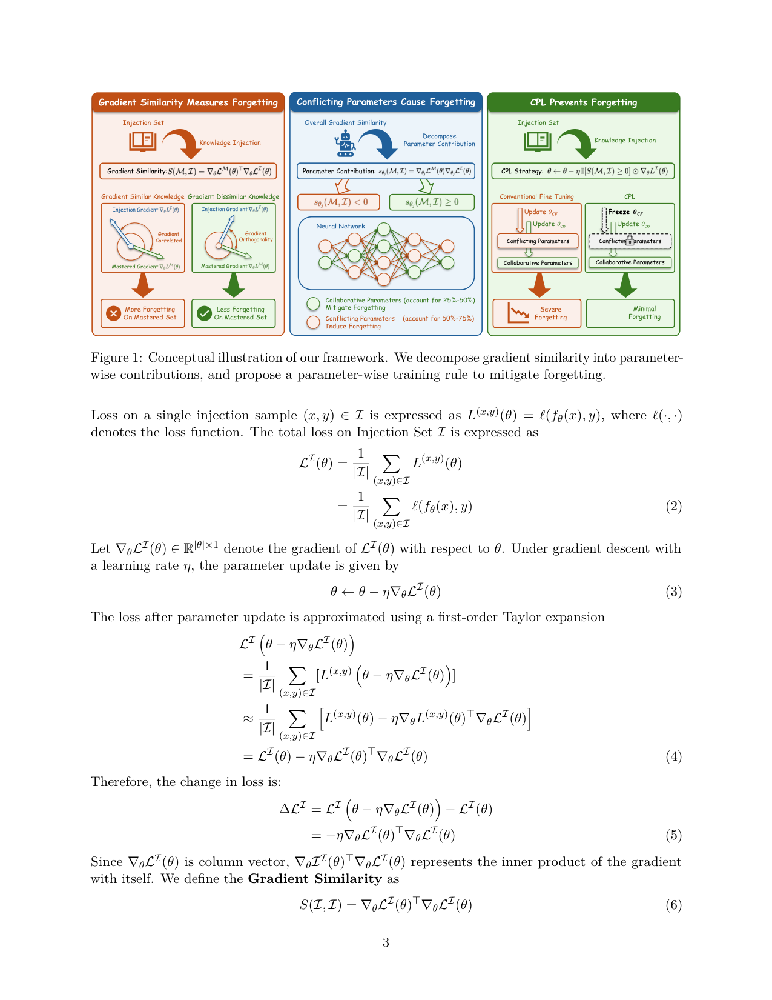
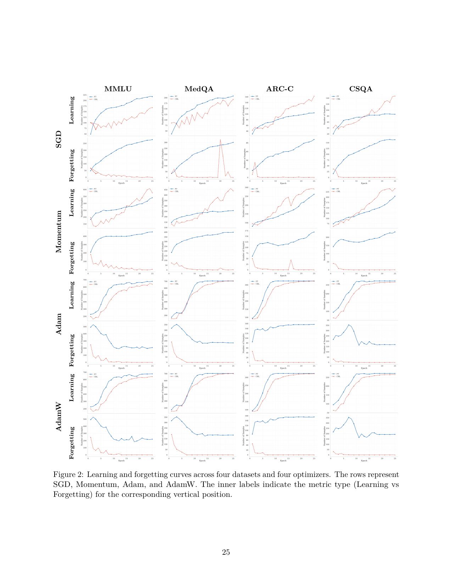

`cnl_gradsim | Collaborative Parameter Learning: Mitigating Forgetting via Parameter-Level Gradient Analysis | 清华大学电子工程系 (Mutian Yang 等;通讯 Jiandong Gao / Ji Wu) + 北大医学技术研究院 + 东北大学 | 2026 arXiv:2601.21577v2(标注 13 May 2026)· 预印本 | L?·"梯度相似度/逐参数冲突防遗忘"主线·高相关(纯参数级训练规则,非 merging)`

> 三标注:【原文】=论文直述;【推断】=有据判断(附依据);【待核】=拿不准的关键事实。
> 注:25 页(正文 11 页 + 附录 A-L)。以下基于已下载真实 PDF 正文。arXiv id=2601.21577(2026-05),时间窗内。本文聚焦"知识注入(knowledge injection)时的灾难性遗忘",不是 agent 主题,但属"防遗忘机制"全景的核心方法论一篇。

══ 第一层:一眼看懂 ══

- 🟦 **TL;DR**:给 LLM 注入新知识(SFT)时会把"已掌握的旧知识"覆盖掉(灾难性遗忘)。已有"梯度类"方法(OGD/A-GEM/GPM)把遗忘看成"新知识梯度 vs 旧知识梯度方向冲突",做法是把更新方向**投影**到与旧梯度正交的子空间(强行不冲突)——但这是**整体向量级**的处理,且"强制正交"太狠、把新知识也学不进去。本文换一个更细的视角:**把梯度相似度拆到每一个参数上**。第 j 个参数的逐参数梯度相似度 \(s_{\theta_j} = \nabla_{\theta_j} L_M \cdot \nabla_{\theta_j} L_I\)(旧集 M 与注入集 I 在该参数上的梯度分量乘积);**\(s_{\theta_j}<0\) 的参数 = 冲突参数(Conflicting,更新它会增大旧集损失→致遗忘,占 50%-75%);\(s_{\theta_j}>0\) = 协作参数(Collaborative,更新它反而降低旧集损失→缓解遗忘,占 25%-50%)**。方法 **CPL(Collaborative Parameter Learning)**极其简单:**冻结冲突参数、只训协作参数**——用一个逐参数符号掩码 \(\mathbb{I}[s_{\theta_j}\geq 0]\) 乘到梯度上(Eq.16:\(\theta\leftarrow\theta-\eta\cdot\mathbb{I}[S(M,I)\geq 0]\odot\nabla L_I\))。结果:当旧集 M 完全可见时**遗忘=0%**,同时比 OGD/A-GEM 多学 20.2%-48.2% 的新题;而且把"高成本向量投影(FP32 存梯度,每 10 亿参数 4GB)"换成"低成本逐元素符号比较(INT8,每 10 亿参数 1GB)",**省约 3GB/B 显存、省 16.5% 时间**。【原文 摘要+§4+§5】

- **最巧的一步**:**把"梯度相似度"从向量内积拆成逐参数贡献之和**(Eq.13:\(S(M,I)=\sum_j s_{\theta_j}\))——抽掉这一步分解,就回到 OGD/A-GEM 那种"整体方向正交投影",既贵又过约束。正是"逐参数有正有负"这个观察,才让"只冻负的、放开正的"成为可能:**协作参数的正向贡献被保留(不像正交投影把它一起砍掉),所以新知识学得更足、旧知识又不掉**。这也是 CPL 既"零遗忘"又"多学"的根因。【原文 §4 Eq.12-13, §5.2】

══ 第二层:为什么做 ══

- **研究背景**:LLM 要持续扩充知识广度 → 知识注入(参数式:instruction tuning 改权重 / 非参数式:RAG 不改权重)。参数式注入会覆盖旧知识 → 灾难性遗忘,严重损害已学知识的保持。【原文 §1, §7.1】

- **解决的具体痛点**:现有缓解遗忘四范式——正则(EWC/MAS 罚改重要参数)、参数隔离(adapter/子集)、回放(混旧数据,有存储/隐私成本)、**梯度类**(把遗忘形式化为"注入 vs 已掌握"的优化级梯度冲突,投影更新方向减干扰)。**梯度类最相关但有两个硬伤**:① 把梯度干扰当成**单一的整体向量级量**,忽略了"到底是所有参数都致遗忘还是只有一部分";② **强制新旧梯度完全正交**,约束过强 → 新知识注入受限(学不进去)。于是核心问题:是不是只有一部分参数致遗忘?能不能只消掉冲突分量、保留协作分量,而不是强制正交?【原文 §1, §7.2】

- **相关工作 & 各自不足**:
  - *正则类*:**EWC**(Fisher 罚重要权重)、**MAS**(记忆感知突触)——保护重要权重,但本文实测它们防遗忘弱(Table 4 仍大量遗忘)。
  - *更新选择/巩固类*:**MOFO**(动量过滤优化器)、**WSC**(Forget forgetting,abundant memory 下的 CL)——在适应时选择/巩固更新。
  - *梯度投影类(最近邻)*:**OGD**(正交梯度下降)、**A-GEM**(高效终身学习)、**GPM**(梯度投影记忆)——全局层面把更新投影到不干扰旧知识的子空间。**不足**:整体向量级 + 强制正交 → 贵(FP32 存正交基)且学不足。
  - **与最近邻 OGD/A-GEM 的 Δ**:① **粒度**——CPL 在**逐参数**判冲突/协作(而非整体方向);② **手段**——CPL 用**符号掩码冻结**(保留协作分量)代替**正交投影**(把协作也砍掉);③ **成本**——符号比较(INT8)代替向量投影(FP32),省 3GB/B + 16.5% 时间。为什么有用——保留协作分量让"零遗忘"和"多学新知识"不再是 trade-off(Table 4:CPL 学 168/193/163/147 题且 0 遗忘,OGD 学 128/142/110/84 题、几乎 0 遗忘但学得明显少)。【原文 §5.2, Table 4/5】

- **动机链**:知识注入致遗忘 → 梯度视角:\(S(M,I)<0\) 时旧集损失上升(Eq.11,一阶泰勒)→ 实测"强负相似度样本最易被遗忘"(Table 1,遗忘集中在"Sim"组)→ 但 S 是整体量,不知是哪些参数 → **拆到逐参数**(Eq.12-13)→ 发现 50-75% 是冲突参数、25-50% 是协作参数,且协作的正贡献抵不过冲突的负贡献(故整体 S 仍负)→ **只冻冲突、训协作** → 一阶下保证旧集损失不增(Eq.17 推导)→ 用符号掩码实现,顺便省掉昂贵的正交投影。为什么不用更简单:纯 FT 大量遗忘;正则(EWC/MAS)防遗忘弱;正交投影贵且过约束。【原文 §2-§5】

══ 第三层:怎么做 + 靠不靠谱 ══

- **方法流水线(CPL,逐参数训练规则)**:
  1. **划分 I / M**:让 LLM 答数据集问题,**答对的进 Mastered Set M(已掌握)、答错的进 Injection Set I(待注入)**——这是个巧妙的"自动划分"(用模型自身能力切分,不需外部标注哪些是旧知识)。【原文 §3.2】
  2. **逐参数梯度相似度**:在 I 上反传得 \(\nabla L_I\)、在 M 上得 \(\nabla L_M\);对每个参数 j 算 \(s_{\theta_j}=\nabla_{\theta_j} L_M\cdot\nabla_{\theta_j} L_I\)(Eq.12)。\(s_{\theta_j}<0\)=冲突参数;\(s_{\theta_j}>0\)=协作参数。【原文 §4 Eq.12】
  3. **符号掩码训练(核心 Eq.16)**:构造逐参数 0/1 指示 \(\mathbb{I}[s_{\theta_j}\geq 0]\),只对协作参数施加注入梯度:\(\theta\leftarrow\theta-\eta\cdot\mathbb{I}[S(M,I)\geq 0]\odot\nabla L_I\)(⊙=Hadamard 积)。冲突参数被冻结。【原文 §5.1 Eq.14-16】
  4. **一阶保证**:更新后旧集损失变化 \(\Delta L_M=-\eta\cdot\sum_j \mathbb{I}(s_{\theta_j}\geq 0)\cdot s_{\theta_j} \leq 0\)(只剩非负的协作项,Eq.17)→ 在一阶近似 + 极小学习率下**保证旧集损失不增**(理论上的"零遗忘"来源)。【原文 §5.1 Eq.17】
  5. **M 不可见时的退化**:理想设定要 M 全可见;现实只可见 M 子集时(§6.3 / 附录 K),CPL 仍比 FT 减遗忘 59.1%-81.7%,且"用可见子集做 CPL"比"用它做 replay"更有效。【原文 §6.3】

- **逐组件必要性(消融/对照)**:
  - **CPL vs FT(Table 3)**:M 全可见时 CPL **所有数据集 0% 遗忘**,FT 遗忘量与新学量相当(如 Qwen1.5B MedQA FT 遗忘 46.5% vs CPL 0%)→ 证明"冻冲突参数"是零遗忘的来源。
  - **CPL vs 7 基线(Table 4,Qwen2.5-1.5B)**:防遗忘 CPL≈OGD/A-GEM(都近 0)但**略优**且学得多;EWC/MAS/MOFO/GPM 防遗忘明显弱。✔与最相关的梯度投影法做了正面对照。
  - **成本(Table 5)**:CPL 16.3GB / 2928s/epoch vs A-GEM 20.6GB / 3508s(↓4.3GB,↓16.5%);GPM 7504s(最慢)。
  - **协作参数是否够用(§5.3 + 附录 G/H)**:Table 6 显示协作参数**任务依赖、动态变化**(训某数据集后它自己的协作参数减少、别的数据集的反而增加),不是固定全局池;附录 G 混合 4 数据集 FT 遗忘 91.7% vs CPL 0%;顺序学 4 数据集 CPL 几乎不忘;附录 H 学习动态显示 CPL 注入速度不比 FT 明显慢 → 协作参数充足。✔对"冻一半参数会不会学不动"这个最大质疑做了正面回应。
  - *缺口*:**未消融"按 \(s_{\theta_j}\) 幅度阈值(而非纯符号)冻结"**、未消融"逐参数 vs 逐层/逐模块"粒度——纯用符号(等价阈值=0)。【推断:依据=Eq.14 指示函数以 0 为界,无阈值扫描】

- **关键机制直觉**:遗忘 = 新旧梯度在某些参数上"打架"(乘积为负,沿注入梯度走会推高旧集损失)。CPL 不去改方向(投影),而是**直接把打架的参数按住不动、只让"新旧一致(乘积为正)"的参数学**——因为在协作参数上,学新知识顺便也降旧集损失(双赢)。符号比较够用是因为"是否打架"只看正负号,不需精确投影,所以 INT8 一个符号位就行 → 省显存/时间。【原文 §4-§5】

- **实验与证据**:
  - 数据集 & 设置:**MMLU / MedQA / ARC-C / CSQA**(主);扩展用 Yahoo Answers/AG News/DBPedia(情感分类)、NumGLUE-cm/ds(开放问答)、C-STANCE(中文多语)、MMBench(多模态)。骨干:**Qwen2.5 1.5B/3B/7B、LLaMA3.2 1B/3B**,多模态用 Qwen2.5-VL 3B。**自动划分 I/M**(答对=M、答错=I);推理 temperature=0,transformers 4.48.0 + torch 2.2.0。【原文 §3.1, 附录 B】
  - **关键发现①(零遗忘,Table 3)**:M 全可见时 CPL 5 个模型 × 4 数据集**全部 0 遗忘**,且学的题数 ≥ FT。
  - **关键发现②(优于梯度投影,Table 4)**:防遗忘≈OGD/A-GEM 但**多学 20.2%-48.2% 新题**(保留协作分量之效)。
  - **关键发现③(成本,Table 5)**:↓4.3GB 显存(1.5B 模型)、↓16.5% 时间 vs A-GEM。
  - **关键发现④(鲁棒性,§6 + 附录)**:跨优化器(SGD/Momentum/Adam/AdamW 均 0 遗忘,附录 I)、跨任务(情感/开放问答/多语/多模态,附录 J)、out-of-set(M 部分可见仍减遗忘 59-82%)、cross-prompt(只注入知识非特定 prompt,在未见 prompt 上仍减遗忘)、混合/顺序多数据集均近 0 遗忘。
  - **baseline 公平性**:同骨干、CPL 与 FT 在"CPL 学题数不少于 FT"前提下比遗忘,7 基线齐全且聚焦最相关的梯度类,较严谨。
  - **看着强但需警惕**:① **"零遗忘"高度依赖"M 完全可见"这个理想设定**——一旦 M 只部分可见(更现实),遗忘就不再是 0(只是比 FT 少 59-82%);这是全文最大的"实验设定光环",作者诚实地在 §6.3 说明了;② **理论保证是"一阶 + 无穷小学习率"**下的,LLM 非凸、实际学习率有限,严格"不增"是近似;③ **需额外算 \(\nabla L_M\)**(每步要在旧集上反传一次),比纯 FT 贵(虽比 OGD/A-GEM 便宜)——作者在 Limitations 承认。【原文 §6.3, Limitations】

- **假设与失效边界**:
  - 【原文·Limitations】① 分析基于**一阶近似**,LLM 非凸,真实遗忘动态可能非线性;② CPL **假设可访问 M**——M 仅部分可见时如何无 M 估计梯度相似度仍是开放问题;③ **计算 \(\nabla L_M\) 有额外成本**,虽比其他梯度法便宜但仍多于纯 FT。
  - 【推断·关键】**"零遗忘"的前提是 M 全量可访问且每步重算 \(\nabla L_M\)**——这在持续学习/隐私场景往往不成立(旧数据可能拿不到);现实退化为"减遗忘 59-82%"。依据=§5.1 Eq.17 需 \(\nabla L_M\) + §6.3 部分可见结果。
  - 【推断】符号掩码以 \(s_{\theta_j}=0\) 为界,**对"弱协作/弱冲突"(接近 0)的参数划分敏感、噪声大**;纯符号无幅度信息,可能误冻"弱冲突但对新知识关键"的参数。依据=Eq.14 硬阈值=0,无平滑。
  - 【推断】协作参数**任务依赖且动态**(Table 6),意味着**多任务/长序列下"哪些是协作参数"会漂移**,长期累积后协作参数是否始终充足、是否会逐渐枯竭,论文只验证到 4 数据集顺序学,**更长序列未测**。依据=§5.3 Table 6 + 附录 G 仅 4 数据集。

- **祛魅总结**:
  - **真贡献(硬货)**:(a)**把梯度相似度分解到逐参数、并实证"冲突参数 50-75% / 协作参数 25-50%"的稳定分布**(Table 2 跨 5 模型 × 4 数据集)——这个"参数级遗忘画像"是清晰的新认识;(b)**用符号掩码冻结冲突参数**,既理论上一阶保证旧集损失不增(Eq.17),又把昂贵的正交投影降为 INT8 符号比较(省 3GB/B + 16.5% 时间),**简单、便宜、有效**;(c)保留协作分量解决了"防遗忘 vs 学新知识"的 trade-off(多学 20-48%);(d)鲁棒性实验面广(优化器/任务/多模态/多语/部分可见/cross-prompt)。
  - **包装/可能高估**:① **"零遗忘"是理想设定(M 全可见)下的结果**,标题/摘要的"negligible forgetting"在现实部分可见时变成"减 59-82%",读者易高估;② 理论"保证"是一阶 + 无穷小 lr 的渐近陈述,非严格全局保证;③ 与 agent_dice/TIES 的"符号共识"和 GCWM 的"几何"相比,CPL 的"符号掩码"机制更朴素——创新在"逐参数分解 + 用符号代替投影"的洞察与工程化,而非全新算法族。【推断:依据=§6.3 + §5.1 一阶假设 + 与同族方法对比】
  - **可能低估/空白**:幅度阈值/粒度未消融;长序列下协作参数枯竭风险未测;无 M 的代理估计是公开难题(作者点到为止)。【推断】

══ 结构化抽取 ══

- 🎯 **机制速览 6 轴**:

| 学什么信号 | 改什么 | 何时改 | 免梯度? | 记忆-技能生命周期 | 防遗忘机制 |
|---|---|---|---|---|---|
| **梯度相似度信号(逐参数)**——旧集 M 与注入集 I 在每个参数上的梯度分量乘积 \(s_{\theta_j}=\nabla_{\theta_j} L_M\cdot\nabla_{\theta_j} L_I\) 的**符号**;负=冲突、正=协作 | **backbone 参数 θ(逐参数)**——只更新"协作参数"(\(s_{\theta_j}>0\)),冻结"冲突参数"(\(s_{\theta_j}<0\));用 0/1 符号掩码 ⊙ 注入梯度。**不改 prompt/记忆/logits、不加模块**(可叠在 LoRA 上,附录 F) | **在线 per-step / 训练期**(每个更新步都重算 \(\nabla L_M\)、\(\nabla L_I\) 定符号掩码再更新);属知识注入(SFT)训练过程内的逐步规则 | **否(核心是梯度训练)**——必须反传算 \(\nabla L_M\) 与 \(\nabla L_I\);但"判冲突/协作"用免梯度的符号比较(INT8),省掉昂贵的 FP32 向量投影 | 无外部记忆/技能库;M(已掌握集)由"模型答对的题"自动构成 → 用于算梯度相似度 → 训练时保护;协作参数集**任务依赖、动态变化**(非固定池);无检索/无跨 agent 共享 | **梯度投影族的"逐参数冻结"变体(参数隔离 + 梯度选择)**:按逐参数梯度相似度**符号冻结冲突参数**(更新选择,保留协作分量);理论上一阶保证旧集损失不增。**用符号掩码代替正交投影**(OGD/A-GEM 的轻量替代)。无回放(理想设定需 M 但不重放)/无 KL/无 merging |

- ⑦ **开源代码 + 框架/harness**:**未找到开源链接**——通读正文 + 附录全文**无任何 github / 代码发布声明**(仅注明用 transformers 4.48.0 + torch 2.2.0 保证可复现,temperature=0)。**故按"未开源/未找到"处理**。【原文 全文检索:0 处 github、无 "code available"/"will release"】无 RLHF 框架(本方法是 SFT 知识注入 + 自定义符号掩码训练规则,无 RL)。

- 💰 **资源/成本与可扩展性**:**核心卖点之一就是省成本**。相对梯度投影法(OGD/A-GEM 需 FP32 存正交基,每 10 亿参数 4GB),CPL 用 INT8 符号向量(每 10 亿参数 1GB),**省约 3GB/B 显存**;Qwen2.5-1.5B 实测峰值 16.3GB(↓4.3GB vs A-GEM),时间 2928s/epoch(↓16.5% vs A-GEM 3508s)。**但仍比纯 FT 贵**:每步需在 M 上额外反传一次算 \(\nabla L_M\)(作者 Limitations 承认)。可扩展性:符号掩码随参数量线性、无额外大矩阵;主要额外成本是"每步算 \(\nabla L_M\)",随 \(|M|\) 与模型规模增长。【原文 §5.1, Table 5, Limitations】

- 🎯 **对"探索-巩固"idea 对标**:**强可借组件 + 强支撑;与 agent_dice 同属"符号级巩固"家族,但作用在训练步内(在线)而非事后 merge**。
  - *可借组件 1(高价值,直接对标项目种子)*:**逐参数梯度相似度符号掩码 = "forward 正常训、backward 只让协作参数流梯度"**——这与项目 reusable_techniques 的"forward-hard/backward-soft 解耦"在结构上高度同构(都是"在反向通道上有选择地放行/拦截梯度,保住已学结构")。**可直接迁移到 OPD 巩固**:在把探索轨迹蒸馏进参数时,用"待蒸馏梯度 vs 已掌握 path-selection 能力梯度"的逐参数符号,只更新协作参数、冻结冲突参数 → **一种在线、per-step、几乎零额外存储的防遗忘巩固规则**(比 GCWM 的 40 分钟/步 merge 便宜得多)。
  - *可借组件 2*:**用"模型答对/答错"自动划分 M/I** —— 对 TSRD"哪些是已掌握路径、哪些是待学路径"的自动界定有借鉴(免人工标注)。
  - *可借组件 3*:**符号比较代替投影(INT8 代替 FP32)** —— 工程上"用最便宜的信号(符号)做选择"的思路,可用于 MTP foresight 探针的轻量化。
  - *支撑面*:它与 agent_dice、geometry_conflict 共同**佐证"遗忘=新旧更新在参数空间的冲突、且可在参数级用几何/符号信号选择性处理"**这一更大论点;三者构成"符号共识(agent_dice,事后merge)→ 几何冲突(GCWM,事后merge)→ 逐参数符号冻结(CPL,训练步内)"的方法谱系,CPL 是**唯一在线、最轻量**的一支。
  - *竞品/区别*:CPL 解决"SFT 知识注入防遗忘",**不做 on-policy 蒸馏、不做 agent、无 MTP 前瞻**;且"零遗忘"依赖 M 全可见(现实退化)。对 mtp_opd,它是**巩固阶段的具体可插训练规则**,但替代不了在线探索-蒸馏环本身。
  - *缺口/警示*:符号掩码以 0 为界、无幅度,对"罕见但关键的恢复方向"(可能是弱冲突参数)有误冻风险——与 agent_dice/GCWM 同类的"少数派/稀有关键方向"问题(项目 survey-grpo-step 的 sparse_critical 关切),CPL 也没专门处理。【推断:依据=Eq.14 硬阈值 + 项目笔记】

- 🔭 **开放问题/未来方向**:
  - 【原文·Limitations】① 超越一阶近似、研究遗忘的非线性动态;② **无 M 访问时如何估计梯度相似度(代理方法)**;③ 更高效的梯度相似度近似(进一步降算 \(\nabla L_M\) 的成本)。
  - 【推断】① 幅度阈值/平滑掩码(而非硬符号)以处理弱冲突参数;② 逐参数 vs 逐层/逐模块粒度的权衡;③ 长序列/大量任务下协作参数是否枯竭;④ 与 RL/on-policy 蒸馏结合(把 CPL 当蒸馏阶段的逐参数门控)。依据=Eq.14 + Table 6 + 方法定位。

- 🖼 **关键图 top-2**:

  
  这是**原文 Figure 1**(概念主图,唯一的方法示意图):分三栏讲清全文逻辑——左"**Gradient Similarity Measures Forgetting**"(注入梯度与已掌握梯度方向相似/相反 → 旧集遗忘多/少);中"**Conflicting Parameters Cause Forgetting**"(把整体梯度相似度分解为逐参数贡献,冲突参数 50-75% 致遗忘、协作参数 25-50% 缓解);右"**CPL Prevents Forgetting**"(常规 FT 更新 \(\theta_{CF}\) 致严重遗忘 vs CPL 冻结 \(\theta_{CF}\)、只更新 \(\theta_{co}\) 致最小遗忘)。选它因为一图同时呈现"诊断(逐参数分解)+ 方法(冻冲突训协作)"的完整故事,是理解 CPL 的钥匙。

  
  这是**原文 Figure 2**(鲁棒性核心证据,附录页):4 列(MMLU/MedQA/ARC-C/CSQA)× 4 优化器行(SGD/Momentum/Adam/AdamW),每格内含"Learning"与"Forgetting"两条曲线随 epoch 的变化——CPL(对比 FT)在所有数据集与所有优化器下**Learning 稳步上升、Forgetting 曲线基本贴地(接近 0)**。选它因为它直观支撑"CPL 跨优化器普适地实现近零遗忘且不牺牲学习速度"这一关键鲁棒性主张(对应附录 I 跨优化器结论),比单个数字表更能说明"零遗忘不是个例"。

──────────
**幂等状态**:本文 analysis 首次产出。机制类型 = **逐参数梯度相似度符号掩码冻结(在线/训练步内防遗忘)**——把梯度相似度拆到每个参数,冻结冲突参数(\(s_{\theta_j}<0\),占50-75%)、只训协作参数(\(s_{\theta_j}>0\)),用 INT8 符号比较代替 FP32 正交投影;一阶下保证旧集损失不增。与 agent_dice/GCWM 同属"参数级冲突处理"家族但**唯一在线、最轻量**。防遗忘靠"按符号冻结致遗忘参数 + 保留协作分量",无回放/无 KL/无 merging。**关键警示**:零遗忘依赖 M 全可见(现实退化为减 59-82%)、需每步额外算 \(\nabla L_M\)。抽到 2 图:是(Figure 1 概念框架 + Figure 2 跨优化器学习/遗忘曲线)。**代码:未找到开源链接(全文无 github/发布声明)**。
