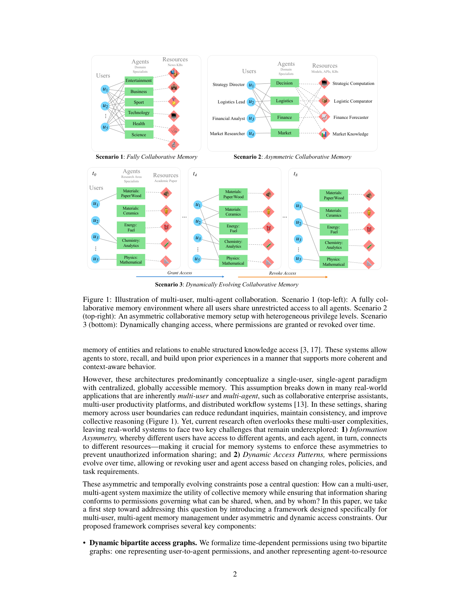
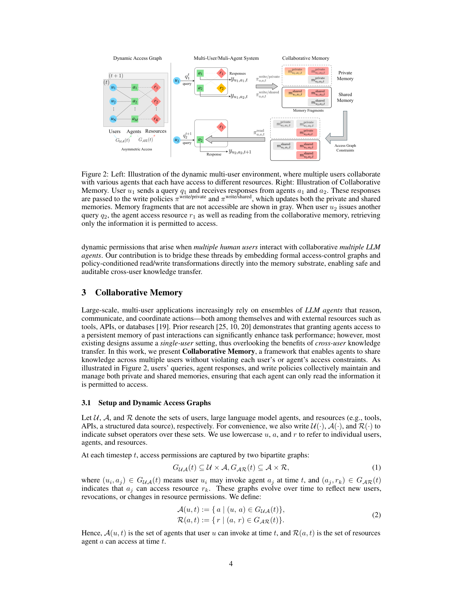

`collaborative_memory | Collaborative Memory: Multi-User Memory Sharing in LLM Agents with Dynamic Access Control | Accenture · Center for Advanced AI (Rezazadeh, Bao 等) | 2025-05·arXiv v1(2505.18279, cs.MA)·Preprint under review | 主题线 L?（多用户/多 agent 共享记忆 + 访问控制 = "记忆作为带权限的共享外部基底"线）· 相关性 Med`

> 三标注约定：【原文】= 论文明说；【推断】= 我的有据判断(附依据)；【待核】= 拿不准的关键事实。

══ 第一层：一眼看懂 [light] ══

- 🟦 **TL;DR**：现有 LLM agent 的长期记忆几乎都假设"**单用户、单 agent、一个全局可见的记忆池**"——可现实里(企业助手/多用户平台)是**多用户 + 多 agent**,而且不同用户能调的 agent、不同 agent 能碰的资源**各不相同、还随时间变**。直接共享记忆会泄密。本文提出 **Collaborative Memory**:把"谁能调谁、谁能访问什么资源"编码成**两张随时间演化的二部图**(user-agent 图、agent-resource 图),记忆分**私有(只本人可见)+ 共享(选择性跨用户)**两层,每条记忆片段都带**不可篡改的来源属性**(贡献 agent / 访问过的资源 / 时间戳);**读策略**按当前权限把记忆投影成"过滤后的视图",**写策略**决定片段存私有还是共享、还能匿名化/脱敏。这样既能跨用户复用知识(减少重复查询、省资源),又**可证明地遵守不对称、时变的权限**且全程可审计。三个场景实验显示:协作记忆在保持准确率(>0.90)的同时,把资源调用最高降 ~61%(50% query 重叠时)。【原文 Abstract/§1/§5】
- **最巧的一步**:**把"访问控制"直接焊进记忆基底**——给每条片段打**provenance(来源:A(m) 贡献 agent 集 + R(m) 访问资源集 + 时间)**,然后用一个**集合包含判据** \(M(u,a,t)={ m | A(m)⊆A(u,t) ∧ R(m)⊆R(a,t) }\)(§3.2 Eq.3)在**读取时动态过滤**出"这个用户经这个 agent 此刻被允许看到的片段"。抽掉"provenance + 二部图约束"这一步,方法就退回成"又一个共享记忆池"、无法做权限隔离;正是这一步让"跨用户共享"和"权限合规"能同时成立(可回溯权限检查 + 可审计)。【原文§3.2】

══ 第二层：为什么做（写透，重点） ══

- **研究背景**:LLM agent 正从"单模型单任务"走向"**专精 agent 编队 + 工具/API/数据库**"的协作体(§1 引"分布式认知"理论:认知不局限于个体,而分布在人、人造物与其交互里;一个"个体 + 共享外部表征"的集体可作为统一认知体)。而**持久记忆**是协作的关键使能器——MemGPT(OS 式虚拟内存抽象扩上下文窗口)、MemTree(层级动态树存抽象摘要)、HippoRAG(海马式知识图 + Personalized PageRank,避灾难遗忘)、GraphRAG(实体-关系图取子图答复杂 query)都证明长期记忆显著提升长程推理。【原文§1/§2】
- **解决的具体痛点**:**现有记忆系统几乎全部默认"单用户、单 agent、一个全局可见记忆池"**(§2 Summary 明说"none accommodates the asymmetric, dynamic permissions"),这在企业协作助手/多用户生产力平台/分布式工作流里**直接崩塌**,暴露两个被忽视的现实约束(§1):**① 信息不对称(Information Asymmetry)**——不同用户能调不同 agent、每个 agent 又连不同资源,记忆系统必须强制这种不对称防止越权泄露;**② 动态访问(Dynamic Access Patterns)**——权限随角色/策略/任务**随时间 grant/revoke**。核心问题(§1 原文设问):"如何在**最大化集体记忆效用**的同时,保证信息共享**遵从'什么能共享、何时、被谁'的权限**?"——直接共享记忆会泄密,完全隔离又浪费(重复 query、重复工具调用)。
- **相关工作 & 各自不足**(§2 三条线):**①单 agent 长期记忆**(MemGPT/MemTree/HippoRAG/GraphRAG)——高效但全假设单用户、全局可见,无权限概念;**②多 agent 协作 + 共享记忆**(AutoGen 脚本化交互图、AgentVerse 群体涌现、MoSA 用 MCTS 融多 LLM 推理轨迹、COPPER 共享 reflector 发反事实奖励解信用分配)——大多**无持久记忆或假设完全共享**;最接近的 **Memory Sharing** 让 agent 异步读写一个公共池,但**仍忽视用户级隐私/访问约束**;**③访问控制模型**(RBAC 角色绑预定义权限、ABAC 用主体/客体/环境属性的逻辑谓词决策)——成熟但**从未与 LLM 记忆的 provenance 存储结合**。
- **动机链**:现状(记忆能提协作但都是单用户全局池)→ 缺陷(企业场景天然多用户+异构+时变权限,直接套用会越权泄露)→ 为什么不用更简单的现成做法?**纯隔离**=零泄露但丢掉跨用户复用收益(重复工具调用浪费算力)、**纯共享**=高效但违规、**单纯套 RBAC/ABAC 在检索后过滤**=无法回溯"这条记忆当初是哪个 agent 用哪个资源造的"(provenance 缺失就无法做"权限被 revoke 后该记忆是否仍可读"的回溯判定)→ 所以必须**把访问控制图 + provenance 焊进记忆基底本身**,用读策略在检索时按当前权限投影成过滤视图、写策略决定存私有/共享并可脱敏。【原文§1 contributions / §3】
- **与最近邻工作的 Δ**:**最像的是 Memory Sharing(单公共池异步读写)**。Δ 在一个关键点:Memory Sharing **没有用户级权限维度**(谁都能读公共池);本文给**每条片段加不可变 provenance(贡献 agent 集 + 访问资源集 + 时间戳)**并用**双二部图(user-agent、agent-resource)的集合包含判据 Eq.3** 在读取时动态裁剪。这差异有用是因为:它让系统对"不对称 + 时变"权限**可证明遵从 + 全程可审计**(权限被 revoke 后,凭 provenance 即可判定该片段对相应用户立即不可读),这是纯公共池做不到的。【推断,依据§2 对 Memory Sharing 的定位 + §3.2 Eq.3】

══ 第三层：怎么做 + 靠不靠谱 ══

- **方法流水线**(§3.3–3.4 + §4,输入 query→输出答案 + 记忆更新):①**Setup**:维护两张随时间演化的二部图 GUA(t)(user→agent 可调)、GAR(t)(agent→resource 可访),据此定义 A(u,t)=用户 u 此刻可调 agent 集、R(a,t)=agent a 此刻可访资源集(Eq.1-2)。②**读(Read)**:用户 u 发 query q→coordinator(gpt-4o)选出与 q 相关的子 agent 集 A(u,t,q),每个 agent 收到 q + **经读策略 πread 过滤后的可达记忆**(由 Eq.3 的 provenance 包含判据 + 余弦相似 Top-k 投影:user 层 top-kuser + cross-user 层 top-kcross)+ 其可访资源,生成响应 yu,a,t。③**聚合**:aggregator(gpt-4o)把各 agent 的 (subquery, response) 合成最终答案。④**写(Write)**:对 yu,a,t 应用两个写策略——πwrite/private 存私有、πwrite/shared 存共享(Eq.4-5),写时可匿名化/脱敏/拦截。⑤**粒度与动态**:读写策略可在 global/per-user/per-agent/per-time 四个 scope 独立调。【原文§3.1-3.4 / §4】
- **逐组件必要性**:**①Provenance(A(m)/R(m)/T(m))**——是 Eq.3 权限判定的唯一依据,**抽掉则退化为无权限公共池**(全文核心,无专门消融,但 Scenario 2/3 的"严格遵从"结果即其功能验证);**②双二部图**——把不对称/时变权限形式化,Scenario 3 的访问矩阵(Fig 6)确认"用户只访问图显式授予的 agent/资源",是其正确性证据;**③双层记忆(private/shared)**——隔离敏感 + 选择性共享,Scenario 1 对比"isolated vs collaborative"即其消融(见下);**④读/写策略分离 + Transformation 写策略**——实验固定用"simple read + transformation write"(§4 Policy Instantiation),但**未消融 simple vs transformation 写策略对准确率/隐私的差异**(标出:这是缺失的消融)。⑤**coordinator/aggregator(两个独立 gpt-4o 模块)**——负责 agent 路由与答案合成,无单独消融。
- **关键机制/公式**:**Eq.3** \(M(u,a,t):={ m | A(m)⊆A(u,t) ∧ R(m)⊆R(a,t) }\) 是全文心脏——直觉:一条记忆 m 当初由哪些 agent 贡献(A(m))、碰过哪些资源(R(m)),只有当**这些 agent 都在用户当前可调集内 且 这些资源都在当前 agent 可访集内**,m 才对"此刻这个 user-agent 对"可见。两个⊆同时成立才放行,等于"记忆的来源权限不能超过当前查询者的权限上界"——这保证了即使跨用户共享,也绝不会让用户经某 agent 看到它本无权看的资源衍生信息。配合 Top-k 余弦相似做相关性截断(检索效率),provenance 做权限门控(合规),两者正交叠加。【原文§3.2 Eq.3 / §4 Memory Retrieval】
- **实验与证据**(§5,三场景递进):**Scenario 1(全协作,MultiHop-RAG:609 篇新闻/六域/2556 多跳问题)**——支撑核心主张的关键实验:collaborative 在**准确率保持 >0.90**(略高于 isolated)的同时,**资源调用 50% 重叠时降 61%、75% 重叠时降 59%**(Fig 3),坐实"跨用户复用省资源且不掉精度";**Scenario 2(不对称,200 合成商业 query/四角色四 agent,只有 Strategy Director 能调全部)**——因开放问题无 ground truth,**只看资源利用**:即便有限跨用户可见性也比完全隔离少调 agent/KB(Fig 4),证明部分共享也省;**Scenario 3(动态,SciQAG,五类五 RAG agent,100 query,权限图 t0→t4 grant 到 25 边、t5→t8 revoke)**——准确率随可用资源升降(强耦合)、**资源查询随时间下降(记忆复用替代重复外查)**,访问矩阵(Fig 6)确认严格遵从权限。**Baseline 公平性**:核心 baseline 是"isolated memory(同系统去掉共享层)",属干净的内部消融,公平;但**无对比其他多用户记忆系统**(Memory Sharing 等未实测对比)。**"看着强但没回答核心问题"的点**:Scenario 2 无准确率(只有资源数),Scenario 1 isolated 与 collaborative 准确率差距其实很小(>0.90 vs 略低),**真正的卖点是"省资源"而非"提准确率"**——准确率叙事偏弱。【原文§5.1-5.3, Fig 3/4/5/6】
- **假设与失效边界**:**①【原文§6】数据假设**——真实多用户协作数据受监管/隐私阻碍,本文**只能用现有 benchmark + 合成 query**(Scenario 2 完全合成、无 ground truth),生态效度存疑;**②【推断】provenance 完整性假设**——Eq.3 的安全性完全依赖 provenance 不可篡改且记录完整,若写入时 provenance 缺漏/被绕过,权限判定即失效(原文设为 immutable 但未讨论攻击面);**③【推断】成员单调假设**——Top-k 余弦检索 + ⊆ 判定下,记忆**只进不出(无遗忘/淘汰)**,长期运行下 Mshared 无界增长会拖慢检索、且过时片段无机制清除(原文未涉记忆老化);**④【推断】LLM 写策略可靠性**——脱敏/匿名化靠 gpt-4o 的 transformation 写策略,LLM 漏脱敏即泄露,无形式化保证(原文称"provable adherence"仅指图约束层,不含 LLM 脱敏质量)。
- **祛魅总结**:**真贡献(硬货)**——【推断】第一个把**细粒度、不对称、时变访问控制**形式化进 LLM 多用户记忆基底,provenance + 双二部图 + Eq.3 的设计干净且可审计,Scenario 3 动态 grant/revoke 的严格遵从是实打实的;"省资源"收益(61%)真实可观。**包装/营销成分**——【推断】① 标题与摘要的"**provable adherence**(可证明遵从)"略夸:可证明的只是**图约束层的集合包含**(Eq.3 确实是确定性判定),但**端到端隐私**还依赖 LLM 脱敏(无证明),读者易误以为整体有形式化安全保证;② "提升准确率"被列为收益之一,但实验显示准确率几乎与 isolated 持平甚至差距微弱,**真正成立的只有"省资源"**;③ 全文定位为"first step / foundational formalization",**确实更像框架/形式化提案而非成熟系统**——无大规模真实数据、无与同类系统对比、记忆无生命周期管理。作者对"形式化贡献"估计准确,对"性能收益"(尤其准确率)有轻微高估。【推断,依据§5 准确率数据 + §6 自述 limitations】

══ 结构化抽取 ══

- 🎯 **机制速览 6 轴** [light]：

| 学什么信号 | 改什么 | 何时改 | 免梯度? | 记忆-技能生命周期 | 防遗忘机制 |
|---|---|---|---|---|---|
| **经验库 / 跨用户交互轨迹**(用户 query + agent 回答被写策略转成 key–value 片段;无 reward、无梯度信号) | **外部记忆**(私有层 Mprivate + 共享层 Mshared;LLM 参数完全冻结,全靠 prompt/检索/写策略调度) | **在线 per-query**(每条 query 读→答→写;权限二部图按离散时间步 t0…t8 演化;test-time 行为,无训练阶段) | **是**(纯免梯度;全部组件=gpt-4o + text-embedding-3-large + OpenAI function-calling,无任何微调) | 写入=写策略把轨迹→带 provenance 的片段、分流到私有/共享(可匿名/脱敏)→检索=读策略按 Eq.3 权限包含判据 + 余弦相似 Top-k(user 层 + cross-user 层)投影成过滤视图→**淘汰/遗忘=无显式机制**(片段持久、provenance 不可变);共享=核心卖点,但**受权限图门控**(权限被 revoke 后该片段对相应用户即不可读) | **不适用**(无参数学习→无灾难性遗忘问题);记忆侧也**无主动遗忘/淘汰**;"安全"靠**权限隔离**(provenance + 二部图)而非几何共识/merging/KL 投影 |

- ⑦ **开源代码 + 框架/harness**：**未找到开源代码**——【原文】全文(含正文 + 参考文献)经 PyMuPDF 全量正则扫描,**唯一 URL 是一条 OpenAI 帮助页链接**(help.openai.com,用于脚注说明 deep-research 延迟),**无 GitHub / 无 anonymous.4open / 无代码声明**。框架/harness:**无训练框架**(纯推理式系统);技术栈=**gpt-4o**(coordinator / 各 domain 专家 agent / 读写记忆变换模块 / 聚合器全部用它)+ **text-embedding-3-large**(向量检索)+ **OpenAI function-calling 接口**(调外部工具/资源,资源暴露为带 JSON schema 的 Python callable)。〔本子代理仅深读抽取,未 clone 核验——因无仓库链接可记〕【原文§4 Implementation Details】

- 🎯 **对"探索-巩固"idea 对标** [light]：**缺口为主 + 可借组件少量**。它**不做参数学习/不做 test-time 自进化/无 reward 信号**,纯属"多用户共享记忆 + 访问控制"的工程框架,与"探索-巩固"(用前瞻探测 + 巩固进策略)**关联弱、属正交方向**;但有一个可借积木:**provenance(来源属性) + 读/写策略分离 + 按权限把记忆投影成"过滤视图"**的设计,对本项目"前瞻探测(MTP)结果该不该写入、何时对谁可见、如何带元数据可回溯"有**记忆治理层面的结构借鉴**(尤其多 agent 协作下"哪条经验来自哪次探索、可信度多高"的可审计性)。竞品价值低(目标域不同)。

- 🖼 **关键图 top-2** [light]：

· 这是**原文 Figure 1**(动机/设定图)。一张图给出三个递进场景:**Scenario 1 全协作**(所有用户无限制共享所有 agent)、**Scenario 2 不对称**(异构权限等级,如只有 Strategy Director 能调所有 agent)、**Scenario 3 动态演化**(权限随时间 t0→t4→t8 被 grant/revoke)。选它因为它一图说清本文要解决的"信息不对称 + 动态访问"两大现实痛点,是理解整篇 motivation 的钥匙。

· 这是**原文 Figure 2**(框架主图/pipeline)。左=动态多用户环境(Users→Agents→Resources 的二部访问图);右=Collaborative Memory 核心流程:用户 u1 发 query→agent a1/a2 回答→**写策略** πwrite/private、πwrite/shared 更新私有与共享记忆(不可访问片段以灰色标出)→用户 u2 发 query 时,agent 同时访问资源 r1 **并按权限从协作记忆中只读取被允许的片段**。选它因为它把"权限门控的读写如何咬合到记忆基底"这一核心机制完整可视化。
