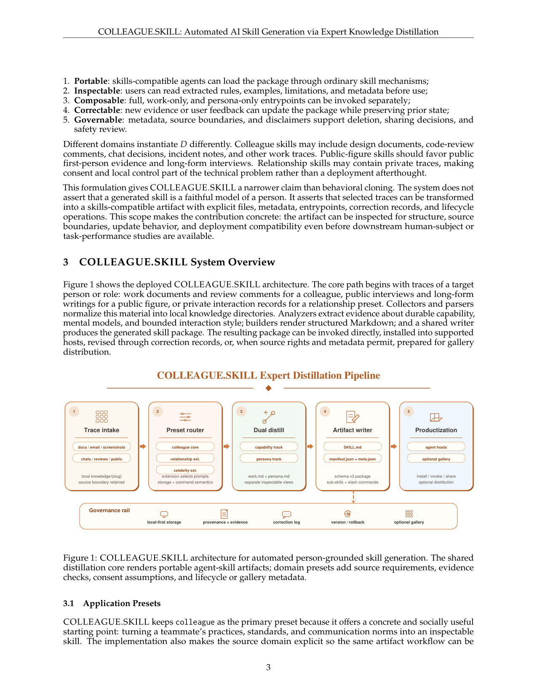
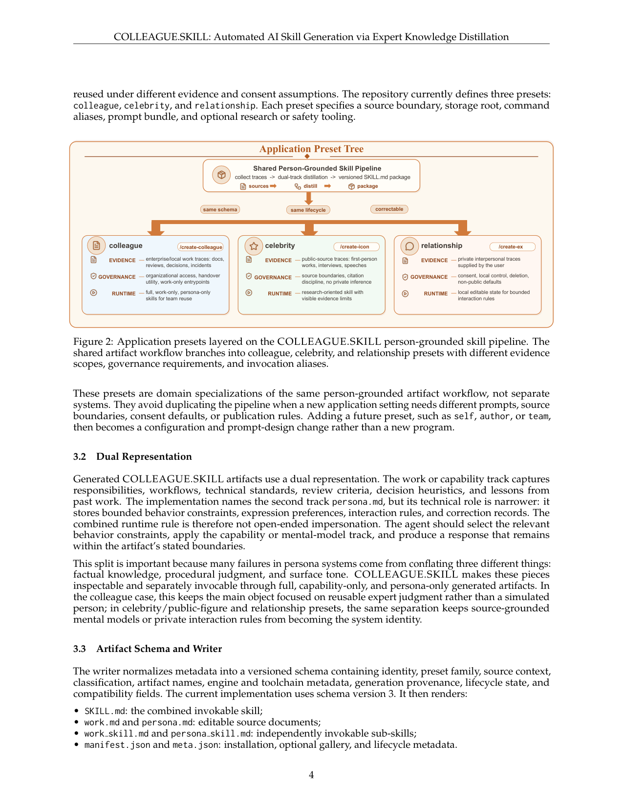

`colleague_skill | COLLEAGUE.SKILL: Automated AI Skill Generation via Expert Knowledge Distillation | 上海人工智能实验室 (Shanghai AI Lab; Tianyi Zhou, Dongrui Liu, Leitao Yuan, Jing Shao, Xia Hu) | 2026-05 · arXiv:2605.31264v1 [cs.AI] · 技术报告/系统 | L3(技能生成)· Med`

> 档位:deep(三层精读 + 完整结构化抽取)。所有内容基于已下载 PDF 正文(12 页)。
> 注:本篇是 system/工程论文,**全文无任何下游任务/性能定量评测**(作者反复显式声明仅做 artifact-level 主张),故第三层"实验与证据"以"作者承认无实验"为核心事实。

══ 第一层:一眼看懂 ══
- 🟦 **TL;DR**:做一套**"把某个人/角色的零散资料 → 自动蒸成一个可装进 Agent 的技能包"**的开源系统。原始痛点很接地气:【原文 §1】同事离职,他的代码评审标准、踩坑经验、沟通习惯就跟着消失了。系统吃进聊天记录、文档、邮件、截图、公开材料,产出一个**带版本的 SKILL.md 技能包**,含两条平行轨道——**capability track(能力轨:做法/心智模型/决策启发式 → work.md)** 和 **bounded behavior track(行为轨:沟通风格/交互规则/纠错记录 → persona.md)**。包可被检视、调用、用自然语言反馈来更新、回滚、跨 host 安装(Claude Code/OpenClaw/Codex/Hermes),并可选地发到 gallery 分发。三个域预设:colleague(同事,主)/celebrity(公众人物)/relationship(关系)。
- **最巧的一步**:把"克隆一个人"这个含糊又危险的目标,**重构成"构造一个有显式边界的技能 artifact"**(§2 problem formulation:S=(A,M,L),五属性 portable/inspectable/composable/correctable/governable)。抽掉这个"artifact 而非人格仿真"的 reframing,整个系统就退化成又一个 persona chatbot——正是它刻意要避免的(§2 明说"narrower claim than behavioral cloning")。**capability/persona 双轨分离**是第二关键:把"事实知识 / 程序判断 / 表面语气"三者拆开可分别调用,避免 persona 系统常见的三者混淆崩坏(§3.2)。

══ 第二层:为什么做(写透) ══
- **研究背景**:【原文 §1】LLM agent 的角色正从"执行孤立指令"转向"承载关于工作/交互该怎么做的可复用 context"。业界已形成一个"外置能力"潮流:tool 连外部动作、skill 打包领域知识/流程/脚本/参考资料按需加载;Anthropic 的 **Agent Skills 标准**把 skill 定义成"以 SKILL.md 为中心的文件夹 + 可选脚本/参考/资产",并用 progressive disclosure(先看元数据、调用时才载详情)。SKILL.md 正在成为 agent 之间可移植的"能力单元"。
- **解决的具体痛点**:【原文 §1+§2】当一个人的能力/交互模式**没被写成说明书**时,该怎么造技能?现实里 person-grounded 知识散落在**异构 trace**:离职同事的评审标准散在代码注释、事故记录、聊天决策里;公众人物的推理风格散在访谈/演讲/文章/公开决策里;关系技能依赖私人交互史(且涉及同意/留存边界)。挑战不只是"检索这些材料",而是**把选定证据蒸成可复用技能包,且其内容/来源/纠错史/使用边界全程可见**。现有 memory/persona 系统只抓碎片、skill 框架只给打包格式,**没有端到端的 trace→可检视可纠错可被 agent 用的技能 的工作流**。
- **相关工作 & 各自不足**:【原文 §7】摆在三条线旁——(1) **Agent skills/可复用能力**(ReAct/Toolformer/Reflexion/Self-Refine/AutoGen + Agent Skills 规范 + Ling et al. 2026 对公开 Claude 技能的数据分析):它们定义"skill 抽象",但不回答"一个人的评审标准/心智模型/沟通约束怎么蒸成可检视可移植技能";(2) **技能库/技能合成**(Voyager 存可执行代码技能、SkillX 把轨迹蒸成分层技能、SkillGen 从成败轨迹合成可审计技能并当干预评估、AutoSkill 从对话抽技能):都是**从 agent 自身轨迹**学,COLLEAGUE.SKILL 反过来**从人类 trace 蒸**,且刻意分离 capability/bounded-behavior + 暴露 correction/rollback + 面向多 host 安装与分发;(3) **记忆/个性化/角色扮演**(RAG、LaMP、PersonaAgent、Character-LLM、RoleLLM、SOTOPIA):它们把表示藏在检索库/context manager/模型行为里,COLLEAGUE.SKILL 故意更窄——**构造显式可审阅的 person-grounded artifact**(规则/约束/心智模型/局限/纠错史全部成文)。
- **动机链**:现状(person-grounded 知识散在异构 trace,且无端到端蒸馏工作流)→ 缺陷(单 prompt 能模仿表面但**让抽出的知识不可问责**:看不到来源、改不了、收不回、装不到别的 host)→ 所以必须把它做成**文件级工作流**(creation/inspection/invocation/correction/rollback/deletion/install/distribution),因为这些操作正是"生成的 person-grounded 技能能被审计/修复/收回/分享"的前提条件(§8 "Why the workflow matters")。为什么不用更简单的现成做法?——【原文 §8】单 prompt 模仿表面语气,但**不让知识 accountable**;hidden memory 把表示藏起来无法检视;两者都做不到"在 work.md/persona.md 文件层检视抽取质量 + 用 manifest 而非临时指令安装 + 用显式元数据治理"。
- **与最近邻工作的 Δ**:最像的是 **AutoSkill / SkillX / SkillGen**(同为"技能合成")。关键差异:它们的技能源是 **agent 自身执行轨迹**,目标是任务性能;COLLEAGUE.SKILL 的源是 **人类异构 trace**,目标是"把一个人的可复用价值做成有边界、可治理的 artifact"。第二个 Δ 是 **capability/persona 双轨显式分离**(别的技能合成多是单一技能体),目的是不让"表面语气"污染"程序判断"。为什么这差异有用?——它把"克隆人"这个有伦理风险的诉求**收窄成可审计的软件对象**,从而把"是否真有用/是否过度依恋/是否编造动机"这些难题留给后续 human-subject 研究,而当下先保证"可被治理"(§9 限制与负责任部署)。

══ 第三层:怎么做 + 靠不靠谱 ══
- **方法流水线**(§3 Fig 1,五阶段):**① Trace intake**(采集器/解析器把 docs/email/screenshots/chats/reviews/public 等异构资料归一到 `local knowledge/{slug}`,保留 source boundary)→ **② Preset router**(colleague core / relationship ext / celebrity ext,扩展决定 prompt bundle + 存储根 + 命令语义)→ **③ Dual distill**(双轨蒸馏:capability track → work.md,persona track → persona.md,两份独立可检视视图)→ **④ Artifact writer**(渲染 schema v3 包:SKILL.md + work.md/persona.md + work_skill.md/persona_skill.md 子技能 + manifest.json + meta.json + slash commands)→ **⑤ Productization**(装 agent host / 可选 gallery 分发);底部贯穿一条 **Governance rail**(local-first 存储 + provenance/evidence + correction log + version/rollback + 可选 gallery)。**演化环**(§4.2 Fig 3):Create→Inspect→Invoke→Correct→Archive→Install/Share,纠错走两类——若关于专家工作则生成 Markdown patch(同名 level-2 标题替换、无匹配则追加);若关于表达/交互行为则生成归一化 correction record `{scene, wrong, correct}`,writer 归档当前版本→打补丁→版本号 +1→重生成所有派生 artifact。
- **逐组件必要性**(本篇**无任何消融实验**,以下必要性为作者论证 + 推断):
  · **artifact reframing(S=(A,M,L) + 五属性)**:【原文 §2】是全系统立足点,没它就退回 persona 仿真。无消融(本就是定义性贡献,非可消融模块)。
  · **capability/persona 双轨分离**:【原文 §3.2】作者论证"persona 系统的失败多来自混淆事实知识/程序判断/表面语气";没它三者会被搅在一个 prompt 里。【推断:无对照实验证明分离真的减少失败,属设计论证】。
  · **Preset router(三域预设)**:【原文 §3.1+§4.3/4.4】让同一骨架在不同 evidence/consent/distribution 约束下复用(加 future preset 只是配置+prompt 改动,非新程序)。必要性是工程复用,非性能。
  · **Governance rail(version/rollback/correction log/local-first)**:【原文 §8】是"可审计可修复可收回"的载体,作者把它当作研究贡献而非工程细节。无消融。
  · **Productization(installer/manifest/gallery)**:【原文 §8 "Productization as a research constraint"】作者主张产品面本身是贡献,因为 person-grounded 技能只有能跨工具/团队/分享面移动才有后果。
- **关键机制/直觉**:核心不是某条公式而是**"把含糊目标形式化成 artifact contract"**。S=(A,M,L) 把"克隆一个人"换成"产出文件集 A + 机器可读元数据 M + 生命周期状态 L";五属性是验收标准。直觉:**一旦目标是"可检视的文件"而非"逼真的人",评估、治理、纠错就都有了落点**(可以读 work.md 看抽取质量、用 manifest 安装、用 meta.json 治理),而"是否逼真"这个无底洞被显式排除在 claim 之外。
- **实验与证据**:**这是本篇最大的诚实点也是最大的空缺**。【原文 §2/§8/§9 多处显式声明】贡献是 artifact-level:定义包格式、实现生成+更新工作流、暴露 correction/rollback、支持多 host、证明同一机制覆盖四类设定(colleague/celebrity/relationship/gallery)。**它明确不主张**生成技能能忠实再现一个人或改善下游工作——这些需 human-subject / task-based 研究(如:colleague 技能能否抓到与源专家相同的评审问题?capability-only 变体是否在去 persona 风险后保住效用?relationship 技能是否诱发过度依恋?)。唯一定量数字是**部署面统计**(§5 Fig 4,2026-05-28 观测):~18.5k GitHub stars、~1.8k forks、104 commits、gallery 215 skills / 55 meta-skills / 165 contributors / >100k 累计 gallery stars——但作者**自己声明**这只表征"分发面/部署面",**不是 adoption quality 或 task impact**(且 gallery star 异步同步、只报数量级)。【推断:故本篇"有效性证据"几乎为零,所有性能层主张都是 future work】。
- **假设与失效边界**:【推断】**隐式假设"人的可复用价值能被有限 trace 充分覆盖、且蒸成静态文本(work.md/persona.md)就够用"**(依据:全系统无性能验证,§2 把贡献缩到"artifact 可构造/可检视");当专家知识高度隐性/情境依赖(只在实时交互中显现、写不进文档)、或 trace 稀疏/带噪时该假设失效。【原文 §9 自承的边界】source matching、task performance、emotional safety、user trust calibration 全部 open;correction 能改进 artifact 但**也可能编入编辑者偏见、或让有争议的 trace 显得比实际更确定**。
- **祛魅总结**:【推断】**真贡献(硬货)**:(1) 把"digital double / 克隆人"这个营销味十足的诉求,**收窄成一个可治理的软件工程对象**——artifact contract + 双轨 + 生命周期 + 多 host installer,这套**外置技能治理工程模板**是扎实可复用的;(2) 罕见地诚实——通篇划清"我只做 artifact、不碰 fidelity"。**包装/需谨慎**:(1) 18.5k stars / 100k gallery stars 是论文里最抓眼的数字,但**与方法有效性无关**,易被误读为"方法被验证有效"——作者虽自我声明,读者仍需警惕;(2) "Expert Knowledge Distillation"标题里的 distillation **是 prompt/检索意义上的"蒸馏"**,无任何模型蒸馏/参数学习,与本调研主轴(参数巩固)无技术交集;(3) 作者**没有低估**——反而克制地把贡献限定得很死,这点值得肯定。

══ 结构化抽取(供全景汇总) ══
- 🎯 **机制速览 6 轴**:
  | 学什么信号 | 改什么 | 何时改 | 免梯度? | 记忆-技能生命周期 | 防遗忘机制 |
  |---|---|---|---|---|---|
  | 人类专家的异构 trace(文档/评审/聊天/邮件/截图/公开材料)+ 用户自然语言反馈/纠错 | **技能包(外置 artifact)**:SKILL.md + work.md/persona.md + manifest/meta.json;**不改模型参数** | 离线生成(一次蒸馏)+ 在线增量(自然语言纠错触发 update,保留 prior state) | **是**(纯 prompt/artifact 工程,无任何权重更新) | 写入(trace→双轨蒸馏→schema v3 包)→ 检索/安装(多 host installer)→ 纠错/版本/回滚(correction log + rollback history)→ 共享(可选 gallery 分发) | **不适用**(无参数训练,故无灾难性遗忘问题);版本化 + rollback 充当"经验不丢失"保障 |

- ⑦ 开源代码 + 框架/harness:**已开源** https://github.com/titanwings/colleague-skill(【原文】摘要+脚注;声称约 18.5k stars、gallery 215 技能/165 贡献者)。harness/框架:**无 RL/训练框架**——自研的"采集器→解析器→分析器→builder→writer"蒸馏流水线 + 多 host 安装器;面向 Claude Code 的 Agent Skills(SKILL.md)标准。
- 💰 资源/成本与可扩展性:**原文未说明**算力/数据/API 成本/延迟数字;亦无下游任务性能评测。可扩展性证据仅为社区分发面(gallery 215 技能、165 贡献者),作者声明这不代表质量。【推断:加新预设是"配置+prompt 改动"而非新程序,故横向扩展成本低】。
- 🎯 **对"探索-巩固"idea 对标**:**缺口/弱关联**。它是"人类专家经验 → 外置技能"的**离线知识蒸馏与治理**,无在线探索、无 reward、无参数巩固;对 TSRD 的价值仅在于"技能包 schema + 版本/回滚/纠错生命周期"这套**外置技能治理工程模板**可借鉴,核心的 path-selection/path-recovery 学习信号它完全不涉及。
- 🔭 开放问题/未来方向:【原文 §8/§9/§10】未来 benchmark 不应测开放式 impersonation,而应测"有边界的包是否保住有用判断、同时让 provenance/consent/失败模式对用户可见";需 human/task 研究衡量(评审命中率、capability-only 是否保效用、relationship 是否诱发依恋、correction 是否改善而不引入回归、celebrity 是否引证而非编造动机);评估协议应在 matched source evidence 下对比 full / capability-only / behavior-only 三变体。【推断】最关键缺口是**完全没有"技能装上后下游任务变好"的证据闭环**。
- 🖼 **关键图 top-2**(保留原选):

这是**原文 Figure 1**(系统主图)。表现核心流水线:① Trace intake(采集异构资料)→ ② Preset router(colleague/celebrity/relationship 选预设)→ ③ **Dual distill(双轨蒸馏:capability + persona)** → ④ Artifact writer(SKILL.md + manifest,schema v3)→ ⑤ Productization(装 host / 可选 gallery),底部贯穿一条 **Governance rail**(本地优先存储 + 溯源 + 纠错日志 + 版本/回滚)。选它因为一图说尽"trace→可治理技能包"的全部精华,且 governance rail 是其相对 persona 系统的差异点。

这是**原文 Figure 2**。表现同一蒸馏流水线如何按 EVIDENCE/GOVERNANCE/RUNTIME 三维分叉成 colleague(企业工作 trace)/celebrity(公开来源)/relationship(私人交互、需 consent+本地控制)三个预设。选它因为它点出该工作的"治理优先"立场——同一技术骨架在不同证据/同意/分发约束下复用,是其把"克隆人"问题做安全化处理的关键设计。
