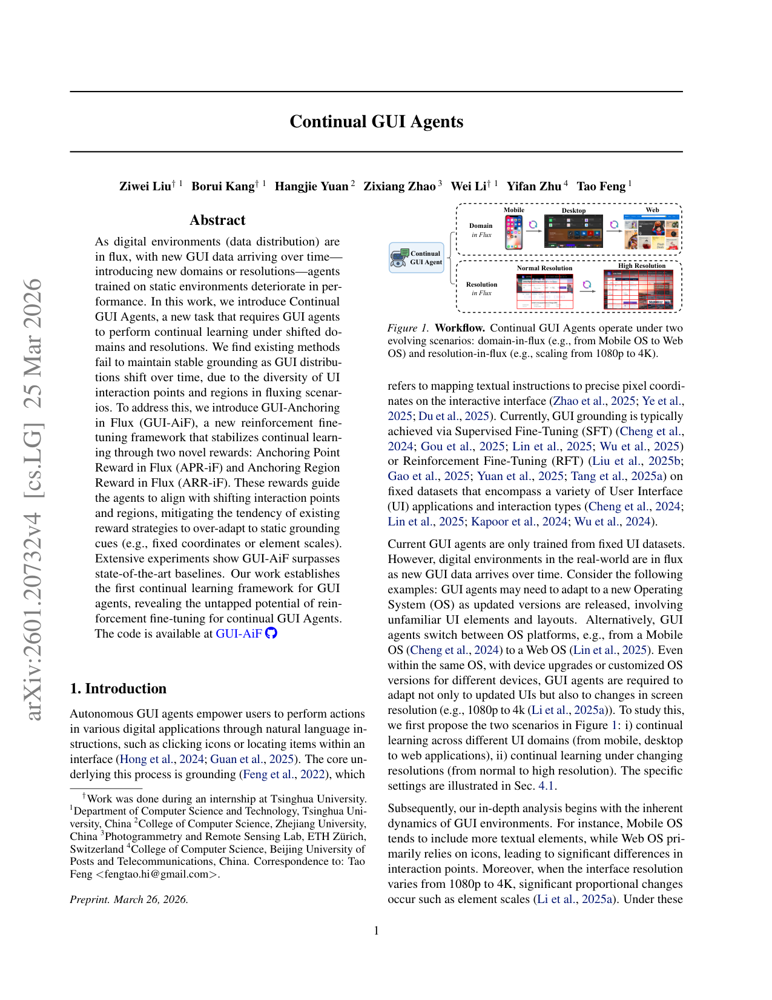
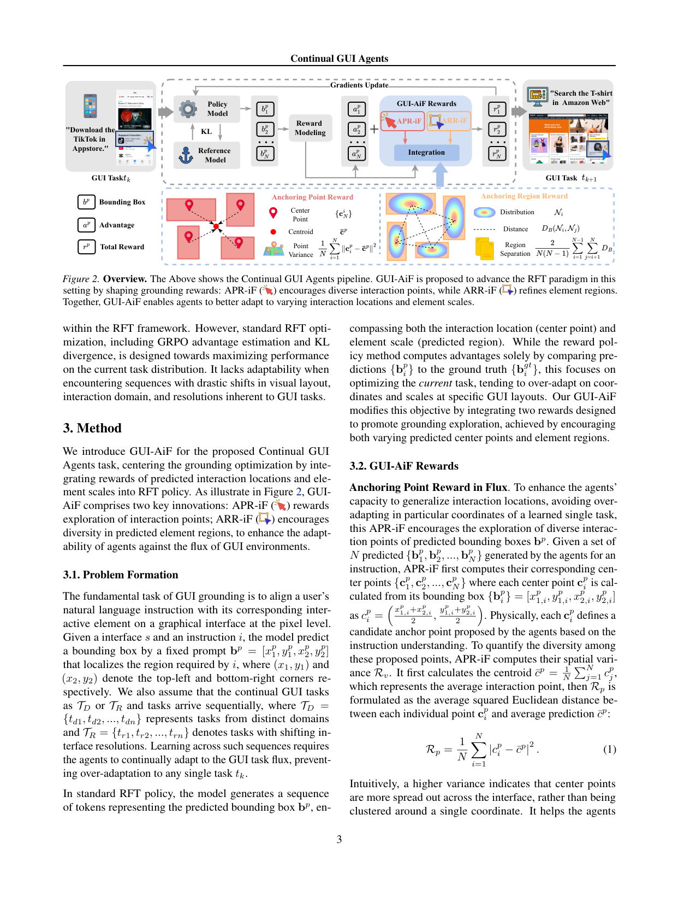

`continual_gui_agents | Continual GUI Agents (GUI-AiF: GUI-Anchoring in Flux) | 清华大学(Ziwei Liu/Borui Kang/Wei Li/Tao Feng 等)+ 浙大/ETH/BUPT | arXiv 2601.20732 v4 2026-03-25 (Preprint) | 主题线 L?(Agent 持续学习 · RFT/RL 防遗忘) · 相关性 High(on-policy/GRPO + 抗遗忘 + agent)`

══ 第一层:一眼看懂 [light] ══
- 🟦 **TL;DR**:GUI agent(看屏幕、按指令点像素)通常在固定 UI 数据上训,但真实环境"在流变"——OS 换代、Mobile→Web 跨平台、1080p→4K 换分辨率,导致 grounding(把指令对到精确像素)失灵。本文首次提出 **Continual GUI Agents** 任务(两类场景:域流变 + 分辨率流变),并提出 **GUI-AiF**:在 **RFT(强化微调,GRPO)** 框架里加两个**塑形奖励**——**APR-iF**(奖励预测交互点的空间多样性=点方差 Rp,别死扣单一坐标)和 **ARR-iF**(奖励预测框的区域分离度=Bhattacharyya 距离,别死扣单一尺度)。核心论点:**RFT 的 on-policy 更新 + KL-到-参考天然抗遗忘**(显式引 Shenfeld "RL's Razor" 类结论),而 SFT 的交叉熵会把模型拽离旧能力。在 ScreenSpot-V1/V2/Pro 上超 SOTA。【原文 Abstract/§1/§3】
- **最巧的一步**:**把"探索多样性"做成奖励,去对冲 GRPO 只顾当前任务正确率(exploitation)的过拟合倾向**。标准 GRPO 优势 At 只比对 ground-truth、驱动模型死磕当前 UI;APR-iF/ARR-iF 作为"counterbalance"重塑优化地形,逼策略既准又泛化,从而保住跨域/跨分辨率的持续学习能力。抽掉这两个 flux 奖励,就退回普通 RFT、对静态线索过拟合(消融 Table 4/5 支撑)。

══ 第二层:为什么做(写透) ══
- **研究背景**【原文 §1/§2.1】:GUI agent 靠自然语言指令在界面上操作,核心是 **grounding**(把指令对到精确像素坐标/区域)。现有 grounding 主流靠 SFT 或 RFT 在**固定 UI 数据集**上训。
- **解决的具体痛点**【原文 §1】:真实数字环境"在流变"——① **域流变**:OS 换代/Mobile→Web 跨平台(Mobile 多文本元素、Web 多图标,交互点分布差异大);② **分辨率流变**:1080p→4K 导致元素尺度成比例变化。静态训练的 agent 在这两类 shift 下 grounding 失灵,无法稳定锚定交互点/元素区域。本文**首次形式化 "Continual GUI Agents" 任务**(两类场景)。
- **相关工作 & 各自不足**【原文 §1/§2.2】:① **SFT grounding**——交叉熵逼模型拟合当前任务标签分布,收敛点可能离旧能力任意远(引 Shenfeld/Guo/Liu),天然不适合动态 GUI;② **标准 RFT/GRPO grounding**(InfiGUI-R1 只用 IoU 奖励、SE-GUI 只用中心点距离奖励、GUI-G2 用高斯建模算密集奖励)——on-policy + KL-到-参考天然少遗忘,但其参数优化**只为"防偏离参考",并不主动应对域/分辨率 shift 带来的交互区域位置+尺度变化**;③ 持续学习经典法——未针对 grounding 的几何特性。空位:在 RFT 框架里,**主动鼓励 grounding 对"交互点/区域"的多样性探索**,以抗 shift。
- **动机链**【原文 §2.2/§3.3,逻辑链】:RFT 的 KL-到-参考已隐式抗遗忘(引 Shenfeld "RL's Razor"、Jin、Lai),但标准 GRPO 优势 At 只比对 ground-truth → 驱动策略 exploitation、死磕当前 UI 布局的固定坐标/尺度 → 一旦域/分辨率 shift,这种过拟合就失灵 → **所以要在 RFT 里加一个"counterbalance"奖励,主动奖励策略探索多样的交互点(APR-iF)和元素区域(ARR-iF)**,重塑优化地形,让策略既准又泛化。为什么不用更简单的现成做法?因为单纯 SFT 会拽离旧能力,单纯标准 RFT 只防漂移不防"对静态线索过拟合"——两者都在 Table 2/3 被验证"无法处理 shift"。
- **与最近邻工作的 Δ**【原文 §4.2 明确对比】:最近邻是 **GUI-G2(Tang 2025,高斯奖励建模,同时算中心点+区域覆盖)**与 SE-GUI/InfiGUI-R1。关键差异:GUI-G2 等的高斯/IoU/距离奖励**都是"逼近单个 ground-truth"的 exploitation 奖励**;GUI-AiF 反其道——奖励**预测之间的多样性**(点方差 Rp、区域 Bhattacharyya 分离 Rr),是 exploration 奖励。Fig 5b/5d 实测两类奖励**呈负相关(r=−0.538/−0.634)**,坐实"探索 vs 利用"是冲突目标。这个差异有用,因为它直接对应"持续学习要保泛化"的需求,实验上让 GUI-G2 baseline 在 M→D→W 上 Avg 从 80.3 升到 83.5(SSv2)。

══ 第三层:怎么做 + 靠不靠谱 ══
- **方法流水线**【原文 §3】:输入=界面 s + 指令 i → 策略模型对每条指令采样 N 个预测 bbox bp →(1)**APR-iF**:取各 bbox 中心点 cp,算质心 c̄p,Rp=各点到质心的平均平方欧氏距离(Eq.1)——点越分散奖励越高 →(2)**ARR-iF**:把每个 bbox 建模为高斯 \(N(μ,Σ)\)(\(μ=\)中心、\(Σ∝\)宽高),算两两 Bhattacharyya 距离 \(D_B\)(Eq.2),\(R_r=\)所有对的平均 \(D_B\)(Eq.3)——区域越分离奖励越高 →(3)**整合** \(R_{AiF}=α·R_p+γ·R_r\)(Eq.4)→(4)**RFT/GRPO**:标准 GRPO 算相对优势 \(A_i\)(Eq.5,组内标准化),综合优势 \(=A_i+R_{AiF}\),目标 \(J(θ)=E[r_t(θ)(A_t+R_{AiF})−β·D_{KL}(π_{ref}‖π_θ)]\)(Eq.6)→ 输出=持续学习后的 grounding 策略。
- **逐组件必要性**【原文 §4.3/§4.4,有多组消融】:① **APR-iF + ARR-iF(两者)**——Table 4:full > 单 APR-iF > 单 ARR-iF,去掉任一都掉点,证明"点多样性"和"区域多样性"都核心;且 **APR-iF 比 ARR-iF 更重要**(Avg 更高),因为域/分辨率 shift 本质是布局变换、元素位置变化更剧烈(§4.3 解释)。② **KL 项**——Table 5:去掉 KL 后持续学习性能普遍下降,证明"光追求多样性会让策略坍缩、覆盖旧知识",KL 提供稳定基座(这是"探索需被 KL 锚定"的直接消融,很关键)。③ **\(α/γ\) 权重**——Fig 3:三基准上 \((α,γ)=(1,1)\) 附近峰值;域场景 \(α\)(点)影响更大、分辨率场景 \(γ\)(区域)影响更大(§4.4),与机制吻合。
- **关键机制/公式直觉**:① \(R_p\)(Eq.1)\(=\)预测中心点的空间方差——方差大=候选锚点铺得开、不死磕单一坐标,逼策略对"交互点可能在哪"保持多样假设。② \(R_r\)(Eq.3)用 Bhattacharyya 距离衡量两个"高斯化 bbox"的分离度——比单纯 IoU 更平滑可微,且同时编码位置(\(μ\))和尺度(\(Σ∝\)宽高),所以能奖励"不同尺度的区域预测",对抗分辨率 shift。③ Eq.6 把 \(R_{AiF}\) 直接加进 GRPO 优势——等于在"答对当前任务"之外再给"答得多样"加分,KL 项 \(β\) 同时把策略钉在参考附近防坍缩。④ 关键张力(Fig 5b/d):\(R_{AiF}\)(泛化)与 RFT 原生奖励(当前任务正确)负相关——所以 \(α/γ\) 是在"准 vs 泛"之间调平衡。
- **实验与证据**【原文 §4,Table 2-5 + Fig 3-6】:数据集=域序列(Widget Captioning 移动→ShowUI-web 桌面/网页)、分辨率序列(ShowUI-web 1080p→OmniACT 1080p~4K);评测 ScreenSpot-V1/V2(域)、ScreenSpot-Pro(6 类高分辨率专业软件,测分辨率);**backbone=Qwen2.5VL-3B**(§4.2,已确认,非未点名);4×A100-80G,1 epoch,lr 1e-6,batch 8,每指令采 4 个预测,KL \(β=0.04\),\(α=15\)/\(γ=0.5\)。**支撑核心主张的关键证据**:(a) Table 2——把 GUI-AiF 加到 GUI-G2 上,SSv2 M→D→W 的 Avg 从 80.3 升到 83.5、SSv1 从 77.1 升到 81.7,且 RFT 全面优于 SFT(SFT 过拟合);(b) Table 3——分辨率场景 N→H,SFT 和 RFT baseline"最终平均准确率完全相同且都低于 GUI-AiF",证明二者都无法天然处理分辨率 shift;(c) Table 5(去 KL 退化)+ Fig 5(两类奖励负相关)直接支撑"KL 锚定 + 探索奖励"的设计逻辑。**baseline 公平性**:统一 Qwen2.5VL-3B、把 InfiGUI-R1 的 IoU + SE-GUI 的距离奖励合成 SE-GUI† 做公平对照,设置一致。**隐患**:① 仅 3B、3 数据集、3 基准,绝对分偏低(SSPro Avg 仅 ~17-19%),作者自承规模受限;② 提升幅度多为几个点、个别 icon 任务波动;③ §4.4 报告 agent 对 text 任务远强于 icon(OCR 偏置),说明 grounding 本身仍弱。
- **假设与失效边界**【原文 Limitations + 推断】:原文自承——仅探索 3B 模型、域/分辨率两类 shift;真实 flux 更多样(布局更新、深色模式、语言本地化)未覆盖。【推断,依据 §2.2/§3:核心收益建立在"RFT 的 KL-到-参考≈抗遗忘"+"奖励为 grounding 几何量身定制"】当任务流变到需**大幅偏离参考策略**才能解(KL 反成枷锁)、或"点/区域多样性"与真实泛化目标脱钩时,机制会失效或反噬;方法专为像素 bbox 几何设计,迁到非空间 agent 任务不平凡。
- **祛魅总结**【推断】:**真贡献(硬货)**=① 首次形式化 Continual GUI Agents 任务(域/分辨率两类 shift)并给基准协议;② 一个干净的"探索奖励对冲 exploitation"机制——APR-iF(点方差)+ ARR-iF(高斯区域 Bhattacharyya 分离),且 Fig 5 实测"探索 vs 利用"负相关、Table 5 实测"KL 锚定不可省",这两个消融让机制叙事站得住;③ 把"RFT/on-policy 的 KL≈隐式抗遗忘"落到真实 agent grounding 的持续学习上,直呼应 RL's Razor 线。**包装/需注意**=方法本质是"GRPO + 两个多样性塑形奖励",相对增量;绝对性能受 3B/数据规模限制偏低,提升多为数点级;**代码仅 "GUI-AiF §" 占位、正文无真实 URL**(未开源/待核)。整体定位:本批 6 篇里**与本课题 MTP+OPD 主轴及"巩固时保留探索熵/路径多样性"最直接相关**的一篇,属强支撑 + 可借组件(双目标"准确优势 + 多样性奖励"结构可迁移)。

══ 机制速览 6 轴 [light] ══
| 维度 | 内容 |
|---|---|
| 学什么信号 | **环境/规则 reward**(grounding 正确率)+ 两个自塑形多样性 reward(APR-iF 点方差、ARR-iF 区域 Bhattacharyya 分离)+ KL-到-参考 |
| 改什么 | **参数**(GRPO 策略梯度更新 grounding 策略) |
| 何时改 | **离线批量 + 顺序任务**(逐任务 RFT;域序列 / 分辨率序列依次训) |
| 免梯度? | **否**(GRPO 在线策略优化,梯度更新) |
| 记忆-技能生命周期 | 无显式经验/技能库;"记忆"=参数本身;靠 on-policy 更新 + KL 把新任务知识软融进策略而不覆盖旧的 |
| 防遗忘机制 | **KL 投影(隐式)**:RFT on-policy 更新本就偏好"离参考策略 KL 最小"的解,与低遗忘强相关(原文 §2.2 明确,引 Shenfeld/Jin 等);多样性奖励防过拟合静态线索,进一步保泛化 |

⑦ **开源代码 + 框架/harness**:原文写 "The code is available at **GUI-AiF §**"——**为脚注符号占位,全文(含参考文献)无真实可点击 URL**(已核查),判定 **未开源 / 待核**。训练范式=**GRPO(RFT)**;**backbone 已确认为 Qwen2.5VL-3B**(原文 §4.2,非未点名)。未提具体 RL 框架名(veRL/TRL 等),推测自研/标准 GRPO 实现【推断,依据其只描述 GRPO 公式未提框架】。
💰 资源/成本:**4×NVIDIA A100-80G,1 epoch,lr 1e-6,global batch 8,每指令采 4 个预测,KL \(β=0.04\),Flash Attention 2 + bf16 + 梯度检查点,奖励权重 \(α=15\)、\(γ=0.5\)**(原文 §4.2)。成本主要在 rollout + 奖励计算。

🎯 **对"探索-巩固"idea 对标** [light]:**强支撑 + 可借组件(高度相关)**。这是把"**on-policy 蒸馏/RL 的 KL-到-参考 = 隐式抗遗忘**"用在真实 agent(GUI grounding)持续学习上的代表作,直接呼应本课题 MTP+OPD 主轴与"RL's Razor"线;其"用塑形奖励鼓励探索多样性来对冲 exploitation 过拟合"可迁移为本课题"在巩固时保留探索熵/路径多样性以防坍缩"的奖励设计;"GRPO 优势(准确)+ 多样性奖励(泛化)"的双目标结构亦是可借积木。属支撑而非竞品(它是 grounding 任务、无显式经验库)。

🖼 **关键图 top-2** [light]:

这是**原文 Figure 1(Workflow)**:展示两类"in flux"场景——域流变(Mobile→Desktop→Web)与分辨率流变(Normal→High Res)。选它因为它一图定义了本文新提出的任务设定与动机(为何静态训练的 agent 会退化),是理解全文的入口。

这是**原文 Figure 2(Overview)**:Policy/Reward/Reference 模型的 RFT 闭环,右侧拆解 APR-iF(中心点/质心/点方差)与 ARR-iF(分布/距离/区域分离)两个奖励。选它因为它是方法主图,直观展示两个 flux 奖励如何插进 GRPO 管线(已核验图内含 Policy/KL/Reference 与两奖励分解,匹配正文)。

══ 假设与失效边界(一句)[light] ══
【推断,依据 §2.2/§3:核心收益建立在"RFT 的 KL-到-参考≈抗遗忘"这一假设,且奖励为 grounding 几何量身定制】当任务流变到需要**与参考策略大幅偏离**才能解(KL 约束反而成枷锁)、或奖励对应的"点/区域多样性"与真实泛化目标脱钩时,该机制会失效或反噬;且方法专为 GUI 像素 grounding 的 bbox 几何设计,迁到非空间/非 grounding 的 agent 任务并不平凡;底座模型与算力细节未充分披露,可复现性待核。
