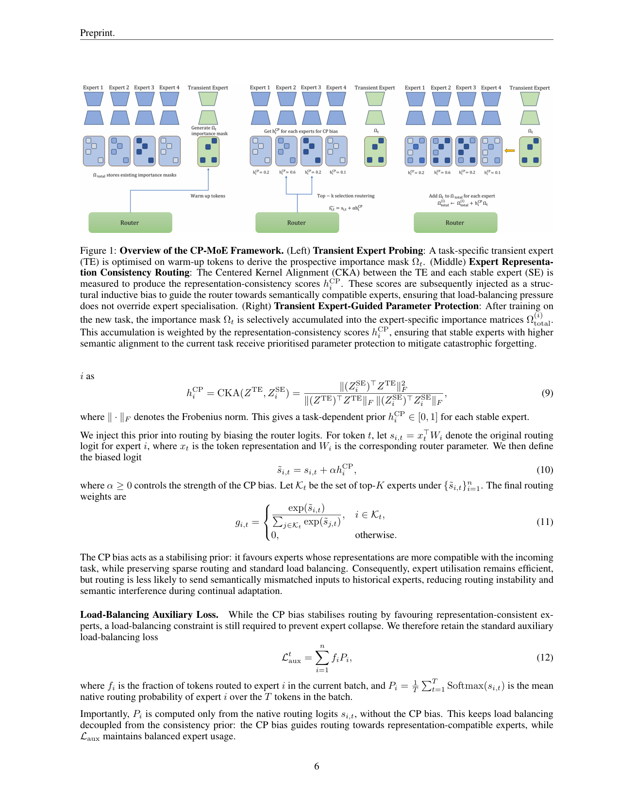
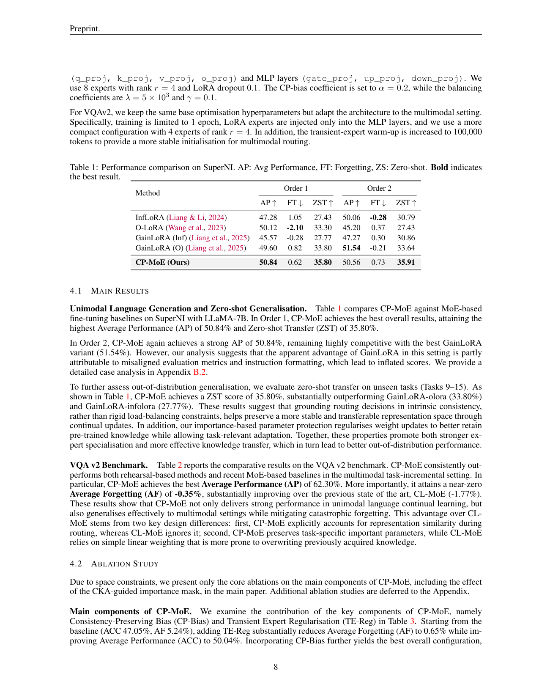

`cp_moe | CP-MoE: Consistency-Preserving Mixture-of-Experts for Continual Learning | UNSW(Univ. of New South Wales, 澳),Yang Liu / Toan Nguyen / Flora D. Salim | arXiv 2605.20247 v1 2026-05-18(Preprint) | 主题线 L?(参数级持续学习 · LoRA-MoE 防遗忘) · 相关性 High(MoE 巩固/路由 + 重要度保护)`

══ 第一层:一眼看懂 [light] ══
- 🟦 **TL;DR**:在 LLM/VLM 上做持续学习,流行用 **LoRA-MoE**(冻主干、加一堆低秩专家)。但现有 MoE-CL 两头不讨好:要么把专家**隔离太死**(学新任务就加新专家并冻死→变静态集成、跨任务不迁移),要么合并太猛(覆盖旧参数→遗忘)。CP-MoE 提出 **"先评估再更新"(assess-then-update)**:每来一个新任务,先用一个**一次性的"瞬态专家"(transient expert)**在小 warm-up 子集上快跑几步,当作**前瞻探针**——① 估出"哪些参数对旧知识重要"(用 path-integral 重要度,Zenke SI 风格),② 用 CKA 算瞬态表征与各稳定专家的兼容度,据此**偏置路由 logit**(把输入导向更兼容的专家)。然后瞬态专家**用完即弃**,只把它得到的重要度掩码迁移到稳定专家上做**选择性正则保护**。在 SuperNI(语言)和 VQA v2(多模态)上取得 SOTA、更强零样本迁移、更低遗忘。【原文 Abstract/§3】
- **最巧的一步**:**"瞬态专家"作为一次性 look-ahead 探针**——它不进最终模型,只用来"预演"这个任务会把参数往哪推、和哪个老专家最像。抽掉它,就同时失去"重要度估计(保护谁)"和"路由兼容度(导向谁)"两个信号,CP-MoE 退回普通 LoRA-MoE。原文 §3.2 把它定位为"在永久固化前评估表征兼容性"的缺失环节。

══ 第二层:为什么做(写透) ══
- **研究背景**【原文 §1】:LLM/VLM 部署在非平稳数据流上需持续学习(CL)却受灾难性遗忘困扰。为高效适配大模型,主流把稀疏 MoE 接进 PEFT——冻主干、加一组可训练 LoRA 专家(LoRA-MoE),靠"分区参数空间 + 输入相关路由"天然减少任务间干扰。
- **解决的具体痛点**【原文 §1/§3.1】:现有 continual LoRA-MoE 有三个具体毛病——① **隔离太死**:常用"learn-and-freeze"(每任务加新 LoRA 专家再冻死)→ 模型变成静态集成、跨任务不迁移、任务一多就不可扩;② **load-balancing 反噬**:MoE 为硬件效率强制专家均匀使用,在 CL 里会逼路由把语义不匹配的输入塞给历史专家(只为均衡),让专用专家被无关更新污染;③ **缺参数保护**:多数 MoE-CL 没有"合并时保护重要历史参数"的机制,容易被覆盖。
- **相关工作 & 各自不足**【原文 §2/§3.1】:① 经典 CL(EWC/SI 正则、回放、扩展)——为小模型/图像设计,在 LLM/VLM 上操作全参数太贵、迁移不自然;② LoRA-per-task + freeze(InfLoRA/O-LoRA)——一堆孤立模块,跨任务不迁移、对未见域泛化差;③ GainLoRA——freeze+外部 gating 选迁移分支,仍泛化差、融合弱;④ MoE-CL(reconstruction selector / dual-router / 一致性蒸馏 / 正交约束 / CL-MoE 动量)——会被"语义漂移模糊专家边界"困扰,**且都缺"永久固化前评估表征兼容性"的环节**——这正是 CP-MoE 要补的空位。
- **动机链**【原文 §1/§3.2】:遗忘根因是"不评估就更新"——要么死隔离(不迁移)、要么猛合并(覆盖)→ **应该"先评估、再更新"(assess-then-update)**:在把新任务知识固化进稳定专家前,先用一个廉价探针预演这个任务 → 探针告诉你两件事:哪些参数对旧知识重要(该保护谁)、新任务表征和哪个老专家最像(该导向谁)→ 据此做"受保护的选择性更新"+"一致性路由偏置"。为什么不用更简单的现成做法?① 不直接在稳定专家上做 look-ahead(要 unroll 路由+专家,既重又引入跨专家干扰);② 不用 MAML 式 look-ahead(要对内循环求导学元初始化,贵且限步数)——所以用"一次性瞬态专家"当隔离探针最划算。
- **与最近邻工作的 Δ**【原文 §3.2/§4 明确对比】:最近邻是 **CL-MoE(Huai 2025,双动量 MoE,VQA SOTA)**与 **GainLoRA(gating 集成)**。关键差异:① 对 CL-MoE——CP-MoE **显式用 CKA 表征相似度引导路由**(CL-MoE 忽略),且**保护任务专属重要参数**(CL-MoE 用简单线性加权易覆盖);② 对 GainLoRA——不靠 freeze+gating,而靠瞬态探针估的"前瞻重要度"做连续保护、且不扩专家;③ 对 MAML look-ahead——瞬态专家不被元优化,只当任务局部探针(Theorem 1 的角色澄清)。这个差异有用,因为它在 VQA v2 把遗忘从 CL-MoE 的 −1.77 压到 −0.35(近零)、在 SuperNI 把零样本迁移从 33.80 提到 35.80。

══ 第三层:怎么做 + 靠不靠谱 ══
- **方法流水线**【原文 §3.2-3.3】:输入=冻结主干 + 固定数量的稳定 LoRA 专家池 + 新任务 Tt。(1)**瞬态探针**:每任务初实例化一个零初始化的瞬态专家 ϕTE,只在 warm-up 子集上跑 S 步梯度(稳定专家全程冻结,Eq.5)→(2)**估前瞻重要度**:用瞬态轨迹按路径积分规则(Zenke SI 风格)累积每参数重要度 ω(Eq.6)、归一化为 Ω(Eq.7);因瞬态与稳定专家共享低秩参数化,Ω 可迁移到稳定专家 →(3)**算表征兼容度**:在同一 warm-up token 上算瞬态专家与每个稳定专家的 CKA 相似度 hCP_i(Eq.9)→(4)**一致性路由偏置**:把 hCP 注入 router logit s̃=s+αhCP(Eq.10/11),把输入导向更兼容的专家;同时保留 load-balancing Laux(但 Laux 只用"无偏置的原生 logit"算,与 CP 偏置解耦,Eq.12)→(5)**受保护更新**:正式训当前任务,重要度按 hCP 加权累积进各稳定专家的 Ω_total(Eq.13),对偏离上一任务快照 (A_old,B_old) 的方向施重要度加权 L2 惩罚(Eq.14);总目标 Ltotal=Ltask+λLreg+γLaux(Eq.15)→ 瞬态专家**用完即弃**。
- **逐组件必要性**【原文 §4.2 Table 3 + Table 6,有消融】:① **TE-Reg(瞬态专家引导的保护)**——从 baseline(ACC 47.05/AF 5.24)加 TE-Reg 后 AF 暴降到 0.65、ACC 升到 50.04,是抗遗忘的主力;② **CP-Bias(一致性路由)**——再加 CP-Bias 得最优(ACC 50.84/AF 0.62),两者互补(一个保护参数、一个稳路由);③ **CKA 重要度调制**——去掉 hCP 改用"对所有专家同强度正则",AF 从 0.62 升到 1.50、ACC 掉 ~1%,证明"按表征对齐度差异化保护"不可省;④ **α(CP 偏置强度)**——Table 6:只有 α→0(等于关掉 CKA 一致性)才严重遗忘,其余配置都稳,说明结构性归纳偏置是主驱动、非靠精调超参。消融较扎实(把 TE-Reg / CP-Bias / CKA mask 三者分别拆开了)。
- **关键机制/公式直觉**:① Eq.6 路径积分重要度——沿瞬态轨迹累积"−梯度×参数位移",位移大且持续被损失驱动的参数=对新任务重要,是 SI 的轨迹版;Eq.7 再用位移平方归一防大步长虚高。② **Theorem 1(及附录证明)**——瞬态专家 S 步更新等于 δS=−qS(Ht)gt,其中 qS(λ)=[1−(1−ηλ)^S]/λ;直觉:这是对一步梯度 gt 做了**谱滤波**,平坦方向(λ 小)被累积更强、高曲率方向被衰减,所以探针抓的是"反复下降下仍有用的多步方向"而非瞬时梯度——这是它比"单步梯度估重要度"更可靠的理论依据。③ Eq.10 的 s̃=s+αhCP——把"和谁表征像"当成路由先验加进 logit,既保稀疏路由又防 load-balancing 把输入乱塞;④ Eq.13 用 hCP 加权累积重要度——越像当前任务的专家受越强保护,无关专家不被过度约束。
- **实验与证据**【原文 §4,Table 1-3/6】:数据集=① SuperNI(单模态语言,Llama-2-7B,8 专家 r=4,α=0.2,λ=5e3,γ=0.1,TE warm-up 10000 token,5 epoch,8 主任务+7 未见任务测 ZST);② VQA v2(多模态,LLaVA-1.5-7B,4 专家,1 epoch,TE warm-up 100000 token,按推理类型切 10 任务);H200 GPU。**支撑核心主张的关键证据**:(a) Table 1 SuperNI——Order1 CP-MoE AP=50.84/ZST=35.80 双第一,ZST 大幅超 GainLoRA-olora(33.80)/infolora(27.77);(b) Table 2 VQA v2——AP=62.30 最高、**AF=−0.35 近零遗忘**(vs 前 SOTA CL-MoE −1.77),是"评估兼容性 + 重要度保护"最硬的证据。**baseline 公平性**:对 VQA v2 明确"在统一实验设置下复现 CL-MoE 等"(Table 2 底部),对 SuperNI 沿用 GainLoRA 协议、两种任务顺序(Order1/2),相对公平;作者还坦诚 Order2 上 AP(50.56)略低于 GainLoRA-O(51.54),并归因于后者"指标/指令格式错配导致虚高"(附录 B.2 案例)——这点是【作者主张,待核】,属对自己劣势的辩护,需谨慎。**隐患**:① SuperNI 只 8 主任务、相对短序列;② 专家池容量固定(不扩),任务数 ≫ 专家数时是否饱和未压力测试;③ Order2 不占优,"对手虚高"的说法未在主表用统一指标重测对手来坐实。
- **假设与失效边界**【推断,依据 §3.2 + Theorem 1 前提】:① 重要度由"warm-up 子集上的瞬态轨迹"外推,**当 warm-up 子集不代表整任务分布**时,前瞻重要度与 CKA 兼容度都会失真 → 保护错参数/导向错专家;② Theorem 1 建立在"warm-up 目标局部二次 + Ht⪰0 + η<2/‖Ht‖"的假设上,非凸/大步长时谱滤波解释不再严格成立;③ 瞬态与稳定专家共享低秩子空间,若该子空间表达力不足,Ω 迁移会有偏;④ 专家池固定容量,长任务流可能饱和。
- **祛魅总结**【推断】:**真贡献(硬货)**=① 一个清晰且可迁移的范式"assess-then-update":用一次性零开销探针在固化前同时产出"保护谁(路径积分重要度)+导向谁(CKA 兼容度)"两个信号;② Theorem 1 给探针"多步谱滤波方向"提供了比"单步梯度"更可信的理论支撑,并清楚划清与 MAML 的界限;③ VQA v2 近零遗忘 + 消融扎实(TE-Reg/CP-Bias/CKA 三拆)。**包装/需注意**=瞬态专家本质是"SI 重要度的轨迹估计 + CKA 路由先验"的组合,组件多为成熟件;Order2 不占优靠"对手虚高"辩护略显牵强;**未开源**(正文与参考文献均无代码链接),复现需自行实现。整体定位:本批 6 篇里**与本课题"探索→巩固"最近邻、设计最完整、消融最到位**的一篇 MoE-CL 工作。

══ 机制速览 6 轴 [light] ══
| 维度 | 内容 |
|---|---|
| 学什么信号 | 任务监督 loss + 瞬态专家轨迹(路径积分重要度 ω)+ CKA 表征兼容度;非 reward |
| 改什么 | **参数**(稳定专家的 LoRA A/B 矩阵)+ **路由**(对 router logit 加 CP 偏置 s̃=s+αh^CP) |
| 何时改 | **离线批量**,但每任务**先 warm-up 探针(在线 look-ahead)再正式训**——两段式 |
| 免梯度? | **否**(瞬态与稳定专家都梯度训练;瞬态专家初始化为零效果) |
| 记忆-技能生命周期 | 写入=知识整合进固定池的稳定专家(不动态扩专家);检索=CP 偏置路由 top-K 选兼容专家;遗忘/淘汰=瞬态专家用后即弃,稳定专家靠重要度连续保护防覆盖;共享=兼容专家承接跨任务迁移 |
| 防遗忘机制 | **正则(重要度加权 L2)为主**:按 CKA 兼容度 h^CP 加权累积重要度 Ω,对偏离旧快照 (A_old,B_old) 的方向施 ⊙² 惩罚;辅以**一致性路由偏置**减少语义错路 + 保留 load-balancing 防专家坍缩 |

⑦ **开源代码 + 框架/harness**:正文(读至 §4 实现细节)**未见 GitHub 链接**,判定 **未开源 / 未找到**〔待核:Preprint 可能后续放出〕。实现=**LoRA-MoE on 冻结 backbone**,backbone 用 **Llama-2-7B(语言)/ LLaVA-1.5-7B(多模态)**,AdamW lr=2e-4 cosine,LoRA 专家插到 q/k/v/o + gate/up/down 全部 dense 层(原文 §4 实现细节)。无显式 RL 框架,推测基于 HF/PEFT 自研【推断,依据其全为 LoRA/MoE 标准件】。
💰 资源/成本:核心省成本点=**瞬态专家只在每任务 warm-up(语言端 10000 tokens)短暂存在、用后丢弃,不留持久开销**;每任务 5 epoch、batch=16(原文 §4)。

🎯 **对"探索-巩固"idea 对标** [light]:**强可借组件(高度契合)**。CP-MoE 的"**一次性探针先预演任务方向→据此决定保护谁、迁移到谁→再正式巩固**"几乎就是"探索→巩固"两阶段的一个具体实现;其"用瞬态轨迹的路径积分估前瞻重要度"可直接迁移为本课题用 **MTP/前瞻探针估"哪些参数/路径关键"** 的信号,"CKA 兼容度偏置路由"也提供了"按表征相似度选择巩固目标"的可迁移积木。是本调研"MoE 巩固 + 重要度保护"线的代表作之一,与本课题最近邻、属支撑而非竞品。

🖼 **关键图 top-2** [light]:

这是**原文 Figure 1**:左=瞬态专家预演(probe);中=用 CKA 兼容度做一致性保护路由偏置;右=重要度加权保护下把知识整合进稳定专家池。选它因为一张图把"瞬态探针→路由偏置→受保护更新"三件套的咬合讲全,是方法主图(已核验图内含 CKA 公式与 transient/stable expert 结构,匹配正文)。

这是**原文 Table 1**(p7,SuperNI):平均性能 AP、遗忘 FT、零样本迁移 ZST 三指标对各 baseline 的对比,是支撑"SOTA + 更强零样本迁移 + 更低遗忘"核心主张的关键定量证据(同页另有 VQA v2 的 Table 2 作多模态佐证)。选它因为它是支撑主张的主结果表。

══ 假设与失效边界(一句)[light] ══
【推断,依据 §3.2:重要度由"warm-up 子集上的瞬态轨迹"外推、且整体绑定 LoRA-MoE 低秩参数化】当 warm-up 子集不代表整任务分布、或瞬态与稳定专家共享的低秩子空间表达力不足时,前瞻重要度与 CKA 兼容度都会失真,导致"保护错参数/导向错专家";且专家池容量固定(不扩专家),任务数远超专家数时仍可能饱和——这些原文未充分压力测试。
