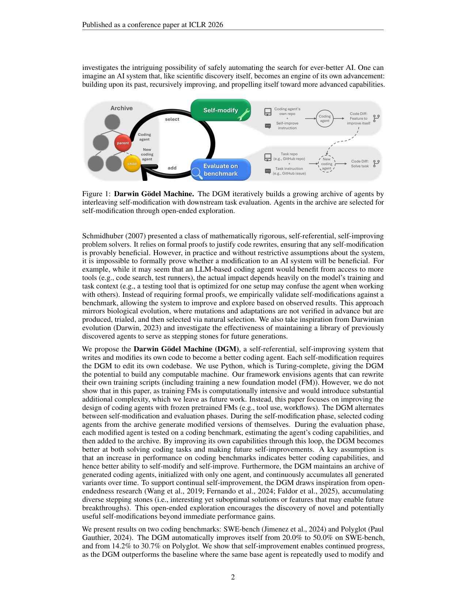
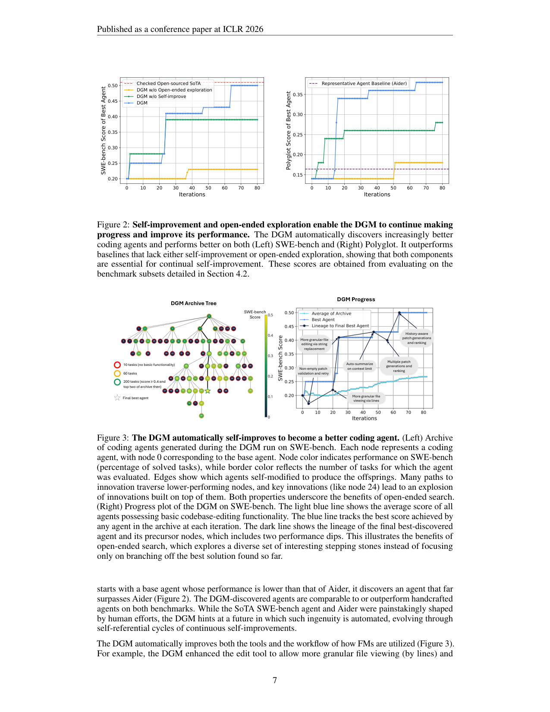

`darwin_godel_machine | Darwin Gödel Machine: Open-Ended Evolution of Self-Improving Agents | UBC + Vector Institute + Sakana AI + CIFAR (Jenny Zhang, Shengran Hu, Cong Lu, Robert Lange, Jeff Clune) | 2025-05 arXiv v1 → 2026-03 v3·ICLR 2026 已录用 | L4 架构进化(自指 meta-agent)+ L3 工具进化·相关性 High(自进化标杆,综述多处引用)`

---

══ 第一层:一眼看懂 [light] ══

- 🟦 **TL;DR**:DGM 是一个**会改自己源代码的编码 Agent**:它不断修改自己的代码(从而**连"改自己代码的能力"也一起变强**),每改一版就在编码 benchmark 上**实测**好不好——不用数学证明(这是它和 Schmidhuber 原版 Gödel Machine 的关键松绑),只用经验验证。受**达尔文进化 + 开放式探索(open-endedness)** 启发,它维护一个**不断长大的 Agent 档案树(archive)**:每轮从档案里**采样一个父代** → 让它自改产出子代 → 实测 → 把"能编译且仍会改代码"的子代加回档案。这样并行探索多条路径,长出一棵"多样且高质量"的 Agent 树。实测 **SWE-bench 20%→50%、Polyglot 14.2%→30.7%**,且显著超过"不自进化"和"不开放探索"的两个 baseline。【原文 Abstract、Fig.1】
- **最巧的一步(抽掉就垮)**:**保留"全档案 + 给每个节点非零采样概率(按性能 × 反比于子代数)"的开放式探索,而不是只在'当前最优'上爬山**。这是 DGM 区别于 SICA/ADAS 的命门(它自己的 ablation:**DGM 50% vs DGM-Greedy 39.7% vs 去掉档案 23%**,Table 1)。抽掉它 → 退化成贪心爬山 → 一次坏自改就堵死后路、陷入局部最优。**正是"允许从任何历史节点(包括暂时差的)分叉"** 让它能① 跨过"欺骗性低谷"(iter 4/56 子代暂时低于父代却后来反超)② 对同一目标尝试多种实现(Appendix G)③ 让某个关键节点(node 24)后来"引爆"一大片后代创新。

---

══ 第二层:为什么做(写透) ══

- **研究背景**:科学进步是**累积、开放式**的——每个突破站在前人肩上(Transformer 也是 RNN/attention 多年积累的产物)。但今天的 AI 被**固定的、人设计的架构**束缚,**不能自主重写自己的源码去自我改进**,每次进步都重度依赖人工,拖慢进展。
- **解决的具体痛点**:**怎样让 AI 安全地、无止境地自我改进,同时越来越擅长解决相关问题?** 两条已有路都不够:
  - **元学习(meta-learning)**:能自动发现新算法,但**只做一阶改进 + 搜索空间得人设计**。
  - **Gödel Machine(Schmidhuber 2007)**:理论上"可证有益地反复自改",但**实践中无法对'一个改动是否净有益'给出形式证明**(例:给编码 agent 加更多工具看似有益,实际效果高度依赖模型训练与任务语境,一个为某 setup 优化的测试工具换个环境反而把 agent 搞糊涂)。
- **相关工作 & 各自不足(§2)**:
  - **开放式(Open-Endedness)**:质量-多样性、内在动机、学习进展框架 → 近年用 FM 当"人类兴趣度代理"生成评估新行为。**但都没闭合"自指自我改进"环**——下游任务变好不会转化为"更强的自改能力"。
  - **元学习 FM Agent**:手工 building blocks(prompt/CoT/self-reflection/multi-agent debate/memory/RAG)受限于设计者巧思;自动法优化 prompt/设计 agentic 模块。**ADAS** = 固定 meta-agent 迭代生成下游 agent。**DGM 的 Δ vs ADAS = 单一系统既解下游任务又改自己代码库,去掉固定手工 meta-agent,实现自指改进**。
  - **自我改进 AI**:从理论(Good 1966、Schmidhuber)到权重参数化自改、自指元训练优化器、自博弈(AlphaZero)。**最近邻 = Robeyns et al. 2025(即本批 SICA!)** + Zelikman 2024b + Yin 2024。**DGM vs 它们的关键差异 = DGM 有"开放式探索环"**:鼓励超越即时性能增益的自改、避免停滞在次优态;而 SICA/Zelikman/Yin 本质是"在最新/最优单点上爬山"。**且 DGM 强调"下游任务变好 = 自改能力变好"两者对齐**(因为自改本身就是编码任务),从而有自加速潜力。
- **动机链(现状→缺陷→所以这样)**:AI 被固定架构束缚、靠人推进 → 想自动化"找更好 AI"的搜索 → 元学习只一阶+空间靠人;Gödel Machine 要证明而不可证 → **所以:① 把"证明有益"松绑成"benchmark 实测有益"(像生物进化:突变不预先验证,产生→试用→自然选择);② 把"单点爬山"松绑成"达尔文式档案进化"(从档案选一个→改→若有趣地新就留)**。"为什么不用更简单的爬山"——因为纯实测易陷局部最优,需要档案 + 开放探索做 stepping stones。

---

══ 第三层:怎么做 + 靠不靠谱 ══

### 方法流水线(Fig.1,两阶段交替 + 档案)
1. **初始化**:档案里只放**一个轻量 base 编码 agent**(冻结 FM + 两个工具:**Bash 工具**执行命令、**edit 工具**看/改目录与整文件;单 prompt 给定目标 repo 位置 + 问题陈述 + 测试框架)。
2. **父代选择(Parent Selection,开放探索的核心,Appendix C.2)**:从档案采样父代,概率 **≈ 正比于性能分 × 反比于"已有(具备改代码功能的)子代数"** → **偏好"高性能但被探索少"的节点**(兼顾 exploitation + exploration);**所有节点保非零概率**(任何通往改进的路都可达,只要算力够)。
3. **自我修改(Self-modify)**:被选父代**读自己的 benchmark 评测日志 → 提议下一个要实现的 feature → 把该提议当问题陈述交给自己执行 → 在自己代码库里实现它 → 产出新 agent**。(注意:"自我改进"被定义为**一个修改自身代码的编码任务**,不含"开放探索过程"本身——后者是固定外壳,DGM 暂不能改,留待 future work。)
4. **评测(Evaluate)+ 入档**:新 agent 在编码 benchmark 上量化评测;**只有"能成功编译 + 仍保留改代码能力"的子代才入档**(否则没法继续自改),其余丢弃。
5. **回到 2 循环**(SWE-bench 跑 80 轮、2 并行;Polyglot 80 轮、4 并行)。**档案里的解可作 stepping stone,在被发现很久之后才促成改进** —— 这正是与 hill-climbing(Robeyns/SICA)的本质区别。
   - 对齐综述锚 \(f(Π,τ,r)=Π′\):DGM 改的是 Π 的 **Γ(workflow)+ W(工具)+ C(prompt)**,**FM 权重 ψ 冻结**(框架设想能改训练脚本/训新 FM,但**本文未做**,因算力 + 复杂度,明列 future work)。

### 关键工程:分级评测(staged evaluation)省算力
- 因全 benchmark 评测太贵:**先 10 题验基本改代码功能 → 过则扩到 50 题 → SWE-bench 若 60 题子集 >40% 且进档案 top-2 则再上 200 题**(更准估真实能力)。用小子集估"大致强弱 + 选 top 候选",对抗 LLM 随机性噪声。**这是"在巩固/晋级前用便宜评测筛探索路径"的范式**,对本项目"巩固前要不要全量验证每条探索路径"直接有用。

### 逐组件必要性 & 消融(本文消融做得扎实,Table 1)
| 方法 | SWE-bench | Polyglot | 说明 |
|---|---|---|---|
| **DGM(完整)** | **50.0%** | **38.0%** | 自进化 + 开放探索 |
| DGM w/o open-ended exploration(只留最新版自改,= 爬山) | 23.0% | 14.0% | **去档案 → 崩**:一次坏自改堵死后续 |
| DGM w/o self-improve(固定 base 当 meta-agent,= ADAS) | 39.0% | 28.0% | 早期有增益但**很快见顶** |
| DGM Greedy(总选最优节点分叉,= Robeyns/SICA 思路) | 39.7% | 30.0% | **次于完整 DGM** → 非零概率全档案探索更优 |
- **结论极清晰**:**开放式探索(档案 + 非零概率采样)是最大功臣**(去掉掉到 23%);自进化其次(去掉到 39%);贪心(只挑最优)也明显不如全档案探索(39.7 vs 50)。**DGM Greedy 这一行 = 对 SICA 路线的直接对照实验**,量化证明"探索多样 stepping stones > 在最优解上爬山"。

### 关键机制/直觉
- **"下游性能 = 自改能力"的对齐假设**:因为"自我改进"被定义成一个编码任务,所以**编码 benchmark 涨 = 改自己代码的能力涨**,这才可能自加速。(这是核心假设,作者明说 "A key assumption is that an increase in performance on coding benchmarks indicates better coding capabilities, and hence better ability to self-modify"——**是假设,非证明**。)
- **stepping stone / 欺骗性地形**:开放探索让 DGM 能从"暂时变差"的节点继续挖(iter 4/56 的 dip),也能对"同一功能"(如更细粒度编辑工具)尝试多种实现挑最优——避免被单一次优实现困住。

### 实验与证据
- **数据集/设置**:**SWE-bench Verified**(人筛可解子集,纯 Python,常需改多文件)+ **Polyglot**(多语言 C++/Rust/Python…,多为单文件从零实现,且**更冷门、不太可能进 FM 训练集**,可与人工精调一年的 **Aider** 对比;DGM 用更严的 **pass@1**,而 Polyglot 榜是 pass@2)。自改用 Claude 3.5 Sonnet(New);评测 SWE-bench 用 Claude 3.5 Sonnet、Polyglot 用 o3-mini。
- **核心结果**:SWE-bench **20%→50%**(逼近"已核实的开源人工 SoTA"虚线);Polyglot 全集 **14.2%→30.7%**(base 起点低于 Aider,但最终**远超 Aider**)。DGM 自动发现的改进 = **更细粒度文件查看(按行)/编辑(字符串替换)、上下文超限自动摘要、多次生成补丁 + 用另一 FM 评审挑最优、history-aware 补丁生成**(Fig.3 右标注)。
- **泛化(Fig.4,支撑"真技能而非过拟合"的关键)**:
  - **跨模型**:SWE-bench 上用 Claude 3.5 跑出的最优 agent,换 **o3-mini**:base 23%→DGM 33%;换 **Claude 3.7 Sonnet**:base 19%→DGM **59%(原文 Fig.4 标 59.0%,正文 59.5%)**。改进**不绑定特定 FM**。
  - **跨 benchmark(零样本)**:SWE-bench 上进化的 agent 在**完全 held-out 的 Polyglot** 拿 28.9%(vs base 14.2%);反向 Polyglot→SWE-bench 24.5%(vs 20%)。**从未见过对方 benchmark → 真 held-out**,支持"通用技能获取而非刷 benchmark 特征"。
  - **跨语言**:只在 Polyglot-Python 上训,迁到其他语言仍可比"全语言训"且远超 base/Aider → 不过拟合单语言。
- **baseline 公平吗 / 看着强但没回答核心问题**:baseline 设计**很到位**(两个消融精准剥离两大组件 + 与人工 SoTA/Aider 同子集对比 + 真 held-out 迁移 + 跨模型)。**保留的疑点**【推断】:① SWE-bench Verified 很可能在 FM 训练集里(作者也承认,故引入更冷门的 Polyglot 对冲)——50% 中有多少是"激发已有知识"vs"真新增能力"难分;② 80 轮、双 benchmark 的**成本极高**(Appendix E.1 有 cost estimate),可扩展性是隐忧;③ "自加速"是**潜力主张**,80 轮内未给出"自改速度随迭代加快"的直接曲线证据。

### 假设与失效边界
- **【原文】**:核心假设 = "benchmark 性能↑ ⇒ 自改能力↑";**FM 权重全程冻结**(改训练脚本/训新 FM 留 future work);**开放探索外壳(档案维护/父代选择)本身 DGM 不可改**(固定,future work);依赖经验验证 → **可能陷局部最优**(用档案缓解但非根除)。
- **【推断】失效边界**(依据 §5 Safety + 冻结 FM + benchmark 驱动):① **目标错位放大**——若 benchmark 没覆盖安全/鲁棒等属性,自改循环会**逐代放大 misalignment**(作者明确警示);② **不可解释性累积**——迭代自改使内部逻辑越来越复杂难懂,妨碍人类监督;③ **能力上限受冻结 FM 限**(与 SICA 的"脚手架饱和"同源:纯改 harness/工具,模型本身不进步,需新知识的任务受限);④ **benchmark 会被学完**(静态评测饱和)。

### 祛魅总结
- **真贡献(硬货)**:① **首个"FM 驱动 + 开放式探索"的自指自我改进系统**,把 Gödel Machine 从"要证明"松绑为"实测验证 + 达尔文档案进化";② **扎实的消融**量化了"开放探索 > 自进化 > 贪心爬山"(Table 1),其中 **DGM Greedy 行直接量化打败了 SICA 式爬山**;③ **强泛化证据**(跨模型/benchmark/语言,含真 held-out),支持"真技能获取";④ **认真的安全实践**(沙箱 + 严格时限 + 可追溯档案谱系 + 限定编码域)+ 提出"自进化可反过来用于提升安全/可解释"(初步做了治幻觉 case study,Appendix H);⑤ 全开源。
- **包装/营销**:① "endless innovation / self-accelerating"措辞宏大,但**自加速未实证、FM 冻结、外壳不可改**,目前仍是"在固定外壳内、冻结模型上,进化 harness/工具"——属综述定义里**强 proto / 接近 strong 但未完全自主**;② SWE-bench 可能进训练集,50% 的"真新增能力"成分存疑(作者用 Polyglot 部分对冲,态度诚实);③ 成本高昂,离"人人可跑的无止境进化"很远。整体**论文严谨、对局限与安全坦诚**,营销成分中等偏低。

---

══ 结构化抽取 ══

- 🎯 **机制速览 6 轴** [light]:
  | 学什么信号 | 改什么 | 何时改 | 免梯度? | 记忆-技能生命周期 | 防遗忘机制 |
  |---|---|---|---|---|---|
  | **外部 reward(编码 benchmark 解题率,分级评测估计)+ 自反思**(父代读自己评测日志提 feature) | **harness/代码库 + 工具 W + workflow Γ + prompt C**;**FM 权重 ψ 冻结**(改训练脚本留 future work) | **离线批量**(inter-task:选父代→自改→评测→入档,80 轮) | **是**(纯 LLM 改代码 + 实测择优,零梯度) | **档案树即记忆**:所有生成的 agent(代码+分数+评测数)写入→**按性能×反比子代数采样检索**→"能编译+保改代码能力"才留(淘汰失格者)→ stepping stone 可延迟数十轮才被复用;技能=自创工具/workflow 持久进子代代码 | **隔离 + 多样性保留(关键!)**:全档案保留(不覆盖旧节点)+ 非零概率采样 = 主动维持多样性,使"暂时差的节点"不被遗忘、可后期反超(Fig.3 的 dip 反超)——**这是"防止过早收敛/遗忘好 stepping stone"的显式机制** |
- ⑦ **开源代码 + 框架/harness**:**开源,自研框架(无第三方训练框架)**。GitHub: `https://github.com/jennyzzt/dgm`(main 分支 + `best_swe_agent` 分支;已 clone `resource/repos/darwin_godel_machine`,64M,完整无 LFS 大文件,**在 500MB 上限内**)。**使用框架 = 自研 Python(DGM 外环 `DGM_outer.py` + `self_improve_step.py` + `coding_agent.py` + `tools/` + `prompts/`)**;LLM 经 **anthropic(+bedrock)/ openai** 直连(**非 veRL/TRL/OpenRLHF**);**Docker 沙箱**做安全隔离(`Dockerfile`);SWE-bench/Polyglot 评测脚手架内置(\(swe_bench/\)、`polyglot/`、`test_swebench.py`)。仓库结构与论文 §3/Appendix C 完全对应。**已完整 clone。**【原文 Abstract + 仓库实测】
- 💰 **资源/成本与可扩展性**:**【原文】**Appendix E.1 有 cost estimate;80 轮 × 双 benchmark × 分级评测(最多 200 题)× 强模型(Claude 3.5/3.7、o3-mini),**成本高**(量级未在正文给出具体美元,但分级评测正是为省算力而设)。**可扩展性瓶颈 = 每代都要跑 benchmark 评测**(故用 10→50→200 分级 + 并行 2~4 路)。【推断】比 SICA(\$7k/15轮)规模更大(80 轮),总成本应显著更高。
- 🎯 **对"探索-巩固"idea 对标** [light]:**最强支撑 + 核心可借组件(本批最相关一篇)**。
  - **支撑**:DGM 用**最干净的消融(Table 1)证明了本项目的核心信念——"保留多样探索路径(档案 + 非零采样)远胜在最优解上贪心巩固(DGM 50% vs Greedy 39.7%)"**。这直接为"探索-巩固"里"为什么不能只沿当前最优路径走、要保留 path 多样性 / path-recovery"提供外部实证。
  - **可借组件**:① **archive + "性能×反比子代数"的父代选择** = 一个现成的"探索-巩固平衡"调度器,可移植到"保留哪些候选推理路径/技能"的决策;② **分级评测(10→50→200)** = "巩固/晋级前用便宜信号筛探索分支"的范式,呼应本项目"MTP 作前瞻探针(便宜预判)再决定是否巩固";③ **欺骗性低谷反超(Fig.3 dip)** = "暂时变差的路径不应被立即丢弃"的直接证据,支撑 path-recovery 的"单点接管/给次优路径复活机会"。
  - **关键缺口(本项目立项点)**:DGM **改 harness/工具、不碰参数、无 token/step 级前瞻**——它的"探索"在**离散的 agent 代码空间**、"巩固"靠**保留代码档案**;本项目要做的是**参数/激活空间的探索-巩固 + MTP 前瞻**,二者正交。DGM 的开放探索是"宏观/慢"(每轮 1 小时改一版),本项目可贡献"微观/快"(per-step 前瞻 + 路径选择)的互补层。**竞品成分低、可借成分高**。
- 🔭 **开放问题/未来方向**:
  - **【原文 §6 + Appendix】**:① **让 DGM 改自己的训练脚本 / 训练新 FM**(把"改 harness"升级为"改权重",本文未做);② **让开放探索外壳本身可被 DGM 修改**(目前档案/父代选择固定);③ 安全:在评测准则里**纳入安全/可解释性**,让自改朝可信方向演化(初步治幻觉 case study);设想**不可修改的"halt 评估部件"** 监管其余可改部分;从一开始织入 Constitutional AI 并解决"如何激励系统保留这些指令"。
  - **【推断】**(依据冻结 FM 上限 + 自加速未证):④ 把"经验验证"从"事后跑全 benchmark"升级为**前瞻预测器**(预判一个自改是否有益)以降成本——与本项目 foresight-probe 同向;⑤ 量化验证"自加速"(自改速度是否随迭代加快)仍是悬而未决的核心问题。
- 🖼 **关键图 top-2** [light]:
  - 
    这是**原文 Figure 1**(p.2)。选它因为它是**方法主图/pipeline**:一图说清"档案 → 选 coding agent → (自改指令 + 自己 repo)产生'改进自己的 code diff' → 新 agent → 在(任务 repo + 任务指令)上产生'解题 code diff' → benchmark 评测 → 加回档案(连父代)"的双 diff、自指闭环。理解 DGM "自改与解题是同一种编码能力"全靠它。
  - 
    这是**原文 Figure 3**(p.7)。选它因为它是**最能表现"开放式探索精华"的核心发现图**:左侧档案树展示进化谱系(node 0=base,node 24 这类关键创新"引爆"大片后代,且**很多通往创新的路径穿过低性能节点**);右侧进步曲线里**最终最优 agent 的谱系经历两次性能 dip 仍最终登顶**——直观证明"保留多样 stepping stone、允许从暂时差的节点分叉"优于"只在当前最优上爬山"。这张图是本项目"探索-巩固/path-recovery"信念最有力的外部图证。

【三标注小结】方法循环/父代选择规则/分级评测/Table 1 消融数字/SWE-bench 20→50/Polyglot 14.2→30.7/跨模型 19→59/held-out 迁移/核心假设/§5 安全/§6 future work 均为**【原文】**(对照 PDF p.1–9 + Appendix A.3/C.2);"SWE-bench 或在训练集致真增能成分存疑、成本可扩展性隐忧、自加速未实证、对探索-巩固是最强支撑+可借 archive/分级评测/dip反超、与本项目正交(参数 vs 代码空间)"为**【推断】**(各附依据);仓库框架(自研 Python+anthropic/openai+Docker 沙箱,非 veRL/TRL)为**仓库实测**;无未核实关键事实。
