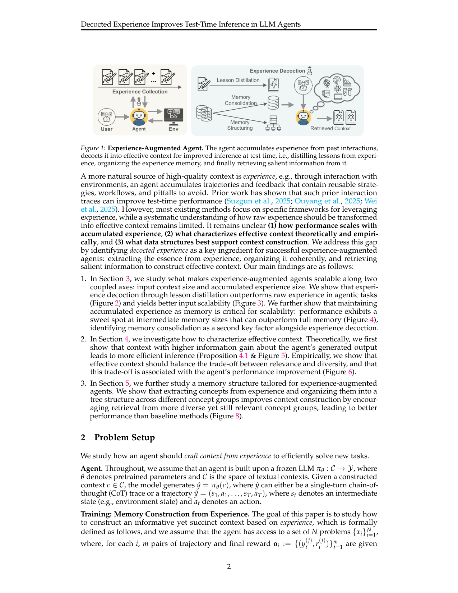
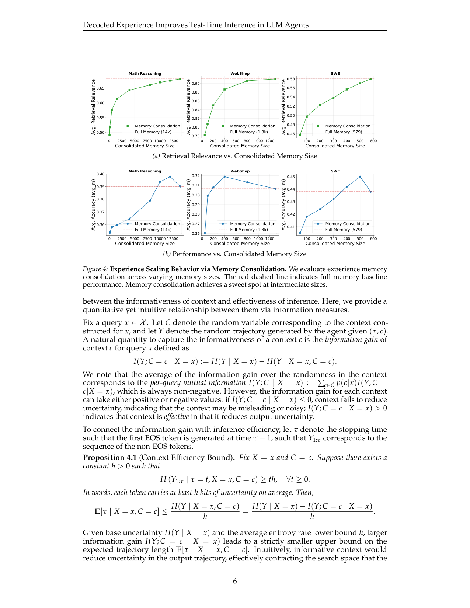

`decocted_exp | Decocted Experience Improves Test-Time Inference in LLM Agents | MIT + Stanford + MIT-IBM Watson AI Lab + UIUC + UCLA；Maohao Shen/Kaiwen Zha/Zexue He 等（通讯 maohao@mit.edu） | 2026-04（arXiv:2604.04373v1，分析/实证论文） | L1 免梯度·test-time context（核心是 L4 经验内化的"如何提炼"+ L 记忆结构） | 相关性 High`

> 【档位】deep（由 light 升级，补全第二层/第三层）。基于真实 PDF 正文（24 页：正文 §1–§6 + 附录 A 相关工作 / B 证明 / C 设置 / D 额外结果）。三标注：【原文】/【推断】（附依据）/【待核】。

---

## ══ 第一层：一眼看懂 ══

- 🟦 **TL;DR**：【原文】不更新权重、靠"喂更好的 context"来提升 LLM agent 的 test-time 表现，但**没人系统回答"原始经验该怎么变成有效 context"**。本文把这件事拆成一条机制——**decocted experience（"熬煮/decoct"经验）**：① **lesson distillation**(把一题的多条轨迹蒸成一条可复用"教训")② **memory consolidation**(k-means 聚类去冗余,选簇心代表)③ **hierarchical concept tree**(把教训按"概念"抽成 Topic∥Problem∥Technique 描述、再递归二分聚类成概念树,检索在叶子层做并让 LLM 重排)。三大实证发现:(a) 智能体任务里**蒸馏教训 > 原始轨迹**(数学题反而原始轨迹略好,因 CoT 已够);(b) 记忆**存在中间"甜点"大小**——适度合并比全量记忆更好(揭示 relevance-diversity 权衡);(c) 信息论上**context 对输出的信息增益越大→推理越短**(Prop 4.1,实测条件熵 vs 输出长度 r=0.91)。在 数学/WebShop/SWE-bench 三类任务、Seed-OSS-36B 上验证。
- **最巧的一步**：【原文+推断】**用"信息增益 I(Y;C=c|X=x)"把'好 context'量化**(Prop 4.1:更高信息增益→更短期望轨迹长度上界),并落成可测代理"**relevance + λ·diversity**"(λ≈0.6 时与性能提升相关性最高)。【推断】抽掉这条"信息增益→效率"的桥,整篇就退化成"试了几种 context 构造都有用"的经验报告——正是这条量化关系把"为什么蒸馏教训/为什么甜点大小/为什么要 diversity"统一解释了(蒸馏=去噪保信息、合并到甜点=保 diversity 不塌成冗余)。【推断依据:§4 信息增益分析是 §3 全部 scaling 现象的统一解释,且 relevance-diversity 是 §5 概念树设计的直接动机】。

---

## ══ 第二层：为什么做 ══

- **研究背景**：【原文】领域大方向已从"优化权重"转向"改进推理时行为"(§1)。其中 **test-time scaling**(更长推理/更多采样/搜索)是公认一条轴。但对复杂推理、尤其 **agentic 任务**(长 horizon、要和工具/环境交互、决策会累积),naive 加 test-time 算力**不够**:扩 interaction 会涨成本、还会把预算浪费在探索次优路径上(§1,引 Shen 2025/Zeng 2025)。本文提出 **context 是与 test-time scaling 互补的另一条 scaling 轴**——不增加输出预算,而是给 agent 喂精心构造的 input(context)来诱导更高效推理。
- **解决的具体痛点**：【原文】"用经验构造 context"直觉上诱人,但**缺系统性研究**三件事(§1-§2):(1) 性能如何随**累积经验量**scale;(2) 什么**理论上/经验上**算"好 context";(3) 什么**数据结构**最支撑 context 构造。最直接的做法(手写 prompt/demonstration)既不可扩展也不可靠——每个新任务都得重设计、且可能**不匹配部署 agent 的真实强弱与失败模式**(§1 末)。现有用经验的方法(ExpeL/Dynamic Cheatsheet/ReasoningBank 等)**各自只给一个具体框架**,缺"原始经验该怎么变成有效 context"的统一理解。
- **相关工作 & 各自不足**：【原文,附录 A】三条线——(a) **Context Engineering**:从手写 few-shot/prompt(Brown/Sahoo)到 CoT(Wei)、到自反思当演化 context(Self-Refine/Reflexion)、到 RAG 注外部知识;不足:RAG 把 context 当"答题证据",但 agentic 里 context 还得**编码可复用策略与可执行 workflow**。(b) **Agent Memory 系统**:MemGPT/MemOS/Mem0/MemTree/MIRIX 等组织+检索过去信息,近期 MemGen/Mem-α/Memory-R1 用 RL 学记忆管理;不足:**多数仍聚焦对话回忆/用户偏好/长上下文 QA**——核心挑战是"记住事实",而非"复用解题策略"。(c) **用经验自改**:ExpeL(测试时抽 insight)、Dynamic Cheatsheet、ReasoningBank(从成败轨迹蒸 reasoning memory)、训练时的 Early Experience/DreamGym/ExRL。**本文的差异**:不提"又一个用经验的框架",而问 **"什么让过去经验对未来推理真正有用"**(§A 原话 "what makes past experience actually useful")。
- **动机链(为什么非这样不可)**：【原文+推断】现状=大家都在"存经验+检索"但不研究"怎么提炼";缺陷=原始轨迹长且噪声大(直接当 context 在长 prompt 下会掉分)、记忆库线性增长(N 大时维护低效、冗余多);所以必须 **decoct(熬煮)经验**=蒸馏(去噪保信息)+ 巩固(聚类去冗余)+ 结构化(概念树促 diversity)。【推断】为什么不直接"全量原始轨迹 top-K 注入"?——§3.1 实测:K 增大时**原始经验方法会掉分**(长 context 噪声误导),而蒸馏教训更省 token 更稳;为什么不"全量记忆"?——§3.2 实测有"甜点",全量无收益甚至不如适度合并。
- **与最近邻(ReasoningBank/Dynamic Cheatsheet)的 Δ**：【原文+推断】ReasoningBank/Dynamic Cheatsheet 都是"从经验抽 insight/lesson 喂回去"的**具体框架**;本文是**它们的'分析/方法论版'**——不提新框架,而是把"经验→有效 context"拆成 lesson distillation / memory consolidation / hierarchical concept tree 三个可测机制,并用**信息增益 I(Y;C|X)** 给"好 context"一个统一定量解释(§4)。【推断】这个差异有用,是因为它把散落各框架里的经验做法**收敛成可迁移的判据**(何时该蒸、库压到多大、检索怎么平衡 relevance/diversity),且给出"该固化什么"的筛选指标——对任何用经验的系统(含权重路线)都适用。

---

## ══ 第三层：怎么做 + 靠不靠谱 ══

- **方法流水线(输入→输出,4 步)**：【原文,Fig.1】frozen LLM π_θ:C→Y,给定 N 个训练问题、每题 m 条(轨迹,reward)对组成经验。
  1. **Experience Collection**:User-Agent-Env 攒轨迹 + 最终 reward(本文全程 self-experience)。
  2. **Lesson Distillation**:把一题的 m 条轨迹由 agent **自己**蒸成一条可复用教训 ℓ_i=π_θ(x_i,o_i)(总结可迁移推理模式),context 变成 Concat(x, {(x_i,ℓ_i)})(§3.1)。
  3. **Memory Consolidation**:每条记忆嵌入 e_i = Normalize((1−α)π_e(x_i)+α·π_e(ℓ_i)),用 **k-means** 分 N′ 簇、每簇取最近簇心的代表,得 ˜M(˜N<N)去冗余(§3.2)。
  4. **Memory Structuring(hierarchical concept tree)**:对每条 (x_i,ℓ_i) 用 LLM 抽**结构化概念** d_i="Topic∥Problem∥Technique"(如"角度追逐∥圆内接四边形求角∥圆周角定理+辅助线"),嵌入后用**递归二分 k-means** 建 L 层树;test 时**叶子层**算 query 与叶心相似度、取 top-n_ℓ 叶合并成候选池、再让 LLM **重排**选最有用的几条拼成 context(coarse-to-fine,§5)。
- **逐组件必要性(及消融/边界)**：【原文】
  - **lesson distillation**:有**条件**必要——§3.1 Fig.2 显示 **agentic 任务(WebShop/SWE)蒸馏>原始**(轨迹含大量环境观测+交互噪声,蒸馏过滤无关、留可迁移决策技巧),但**数学推理原始轨迹略好**(详细 reasoning trace 本身已够指引)。这个"何时该蒸的边界"是本文给出的实用结论。
  - **memory consolidation**:必要且有**甜点**——§3.2 Fig.4:检索相关性随库增大**单调升**(因合并是有损压缩),但任务性能**非单调**:˜N 太小过度压缩掉信息、˜N≈全量无收益,**中间有甜点**(数学全量 14k、WebShop 1.3k、SWE 579,适度合并优于全量)。揭示 **relevance-diversity 权衡**:语义太像反而减少策略多样性、限制泛化。
  - **concept tree**:消融对比 flat lesson memory + 语义检索——§5 Fig.8:概念树**性能更高**且检索覆盖**更多概念组**(mean 1.9 vs 1.4 leaf 覆盖),验证增益来自"更好的 relevance-diversity 平衡"。
  - **信息增益度量**:§4 用两图验证——Fig.5(a) 条件熵 vs 输出长度 **r=0.91**(Prop 4.1 的界 tight 到常数);Fig.5(b) relevant context 信息增益 mean Î=172.2 > random 97.2、在 76% 样本上占优。
- **关键机制/公式直觉**：
  - **信息增益 I(Y;C=c|X=x) = H(Y|x) − H(Y|x,c)**(§4):【原文】度量"给了 context c 后,输出的不确定性降了多少"。**逐 context 可正可负**:≤0 说明 context 没降不确定性(误导/噪声),>0 才有效。这是把"好 context"量化的核心。
  - **Prop 4.1(Context Efficiency Bound)**:E[τ|x,c] ≤ H(Y|x,c)/h = (H(Y|x) − I(Y;C=c|x))/h(τ=轨迹长度,h=每 token 至少 h 比特不确定性):【原文+推断】直觉=**信息增益越大→期望轨迹长度上界越小**。informative context 降输出不确定性=收缩生成时要搜的空间→用更少 token/步数到解。**这条桥是全篇的统一解释**:蒸馏(去噪保信息→提 I)、合并到甜点(保 diversity 不塌成冗余)、concept tree(促 diversity)都是在"提 I"。
- **实验与证据(关键实验+具体数字)**：【原文】base LLM=**Seed-OSS-36B-Instruct**(+ GPT-OSS-20B 验证),embedding=**Qwen3-Embedding-4B**。三任务:**数学推理**(DAPO-Math 建库→AMC/AIME/HMMT/BeyondAIME 评测)、**WebShop**(网购)、**SWE-bench**(改 GitHub issue)。指标:effectiveness=avg_m(多次尝试平均质量)、efficiency=CoT 长度(推理)/交互步数 T(agentic)。**最关键支撑实验**=§4 信息增益分析(Fig.5 的 r=0.91 + 信息增益分布),它把 §3 全部 scaling 现象(蒸馏>原始、甜点、要 diversity)用一条信息论关系统一解释——这是本文从"经验报告"升格为"方法论"的命门。**baseline 是否公平**:【推断】vanilla(无 context)/原始经验/蒸馏教训/flat+语义检索/概念树逐层对比,较公平;但**全程 self-experience + 离线静态库**,未对比"跨 agent 经验"或在线设定。**看着强但没回答核心问题的结果**:【推断】信息增益 I **生成前不可得**(要事后用 Monte Carlo 估条件熵),实用只能用 relevance+diversity 当代理,而代理与性能改进的相关性**只有 r=0.25**(Fig.6a,偏弱)、λ≈0.6 时最高——即"理论度量漂亮但落地代理较松",这是本文最该打折的一处。
- **假设与失效边界**：【原文+推断】① 假设**经验来自自身**(self-experience)、任务有**可验 reward**、**base LLM 足够强**(能自己蒸出好教训);② 失效:**已有强 CoT 的任务(数学)蒸馏反而略逊原始轨迹**(§3.1)、记忆**过度合并掉分**(需调甜点,但最优 ˜N **事前难定**,§5 自陈)、信息增益**生成前不可得**(代理 r=0.25);③ 【原文】**全程离线静态、未解决在线持续学习与防遗忘**——§6 把"闭环持续收集+更新权重"和"持续学习不忘旧能力"明确列为 future work。
- **祛魅总结**：【推断】**真贡献(硬货)**=不是又一个框架,而是**回答"巩固期经验该怎么提炼才有效"的方法论底座**:lesson distillation(含"何时该蒸"的可操作边界)、memory consolidation 甜点(relevance-diversity 权衡的定量答案,补了 JitRL"只增不删"/Training-Free GRPO 的 ADD/DELETE 缺去重保证)、**信息增益作为"好 context"的统一度量**、concept tree coarse-to-fine 检索四件套均可直接借用;r=0.91 的条件熵-长度关系是漂亮的实证。**包装/需打折的**:① **未开源**(正文/附录无代码链接)、**未报 $/GPU 时**(虽把 scaling/成本当一等研究对象,但只报 token/步数曲线、无绝对算力);② 核心理论度量 I **不可在生成前用**,落地代理相关性弱(r=0.25),"什么是好 context"的实操判据其实较模糊;③ "context 是与 test-time scaling 互补的 scaling 轴"是好 framing 但**仍停在 context 层**,作者诚实地把权重固化与防遗忘留作 future work,未过度宣称已解决持续学习。

---

## ══ 结构化抽取 ══

### 🎯 机制速览 6 轴
| 维度 | 内容 |
|---|---|
| **学什么信号** | **自身经验**(轨迹 + 最终 reward,自 self-experience)→ 由 agent 自己**蒸馏成 NL 教训** ℓ_i=π_θ(x_i,o_i);不是环境梯度、不是人类标注 |
| **改什么** | **外部经验记忆/context**(教训库 + 概念树结构)→ 检索后拼进 prompt;**参数 θ 永久冻结**(明确 frozen LLM,π_θ:C→Y);logits/激活不动 |
| **何时改** | **离线批量构建记忆**(训练集上蒸教训→聚类合并→建概念树)→ **test-time 检索注入**;非在线 per-step 更新(作者把"闭环持续收集+更新权重"列为 future work) |
| **免梯度?** | **是**(纯 context engineering;零梯度;论文核心论点就是"context 是与 test-time scaling 互补的另一条免梯度 scaling 轴") |
| **记忆-技能生命周期** | 写入:蒸馏教训入库;**淘汰/合并:有显式 memory consolidation(k-means 选簇心,˜N<N)**——且发现"过度压缩反而掉分"的甜点;**检索:概念树叶子层 top-n 候选 + LLM 重排**(coarse-to-fine,促进 diversity);共享:跨 query 复用,域内组织(WebShop 概念树=8 大类 44 细分) |
| **防遗忘机制** | **隔离式(不动权重→无灾难遗忘)**;无几何/merging-权重/KL。注:这里"consolidation"指**记忆条目聚类去冗余**,不是权重合并;作者把"持续学习不遗忘旧能力"明确列为**尚未解决的 future work** |

### ⑦ 开源代码 + 框架/harness
- 【原文/待核】正文与附录**未给出代码链接/仓库地址**(reproducibility 主要靠附录 C 的 prompt 模板与实现细节)〔待核:arXiv 主页是否附 code——本次仅核 PDF,正文无 link〕。
- 框架/harness:【原文】base LLM=**Seed-OSS-36B-Instruct**(+ GPT-OSS-20B 验证);embedding=**Qwen3-Embedding-4B**;agentic 任务走 action-observation 循环 + 所需工具。**非训练框架**(零梯度)。数据:DAPO-Math(建库)→AMC/AIME/HMMT/BeyondAIME 评测;WebShop;SWE-bench。

### 💰 资源/成本与可扩展性
- 【原文】**显式把成本/scaling 当一等研究对象**:input 轴(K↑→input token↑,原始轨迹在长 context 下会掉分,蒸馏教训更省 token 更稳)、experience 轴(记忆甜点大小:数学全量 14k、WebShop 1.3k、SWE 579,适度合并优于全量)。效率指标:CoT 长度(reasoning)/交互步数 T(agentic)。【推断】可扩展性优于"全量原始轨迹注入";瓶颈在概念树离线构建 + LLM 重排的调用成本。**未报具体 $/GPU 时**。

### 🎯 对"探索-巩固"idea 对标
- **强支撑 + 多个可借组件(免梯度"巩固"的'如何提炼'方法论)**:这篇恰好回答"探索-巩固"里**巩固期最核心的问题——探索产物(轨迹/经验)到底该怎么提炼成有效知识**。
  - **可借组件**:① **lesson distillation**(多轨迹→一条可复用教训)=巩固期"经验压缩"的标准件,且实证"agentic 任务蒸馏>原始、数学题原始略好"给出**何时该蒸的边界**;② **memory consolidation 的甜点 + relevance-diversity 权衡**=巩固期"库治理"的定量指南(对标 JitRL"只增不删"、Training-Free GRPO 的 ADD/DELETE 缺去重保证——这里给了 k-means 甜点这个可操作答案);③ **信息增益 I(Y;C|X) 作为"好 context/好巩固产物"的度量**=可迁移的**评价指标**,直接量化"巩固是否真有用"(I≤0 即 context 有害);④ **概念树 coarse-to-fine 检索**="path-selection 按概念分组检索"的结构原型。
  - **关系定位**【推断】:本质是**离线巩固的"分析/方法论版"**——不提新框架,而是告诉你"巩固该怎么做才有效"。与"探索-巩固若固化进权重"互补:它停在 context 层(作者自承"更新权重"是 future work),但其"信息增益度量 + 甜点 + 蒸馏边界"可直接指导**权重固化前的'该固化什么'筛选**。
- **缺口**【推断】:全程 self-experience + 离线静态库;**无在线持续/无防遗忘**;信息增益度量须事后估(generation 前不可得,只能用 relevance+diversity 代理,r=0.25 相关性偏弱)。

### 🖼 关键图 top-2

- 这是**原文 Figure 1**(方法主图)。左:Experience Collection(User-Agent-Env 攒轨迹+reward);右:**Experience Decoction** 三步——Lesson Distillation → Memory Consolidation → Memory Structuring → Retrieved Context 喂回 agent。**选它**:一图说清"原始经验如何被'熬煮'成有效 context"这一核心机制,是 6 轴(学什么信号/改什么/生命周期)的依据图。

- 这是**原文 Figure 4**(核心发现图)。(a) 检索相关性随记忆增大单调升;(b) **但任务性能呈非单调——存在中间甜点**(˜N 太小过度压缩掉信息、˜N≈全量无收益),红虚线=全量基线。**选它**:直观展示"相关性↑≠性能↑"的 relevance-diversity 权衡,是"巩固期库治理该压到多大"的关键定量证据——对"探索-巩固"的巩固策略最具指导价值。

---

### 假设与失效边界(一句)
- 【原文+推断】假设**经验来自自身且任务有可验 reward、base LLM 足够强**;失效/边界:**数学等已有强 CoT 的任务上蒸馏教训反而略逊原始轨迹**(§3.1)、记忆**过度合并会掉分**(需调甜点)、信息增益**生成前不可得**只能用弱相关(r=0.25)的 relevance+diversity 代理,且**全程离线静态、未解决在线持续学习与防遗忘**(作者自列 future work)。

### 对"探索-巩固"对标(一句)
- **强支撑**:本篇是"探索-巩固"中**巩固期'如何提炼经验'的方法论底座**——lesson distillation(含何时该蒸的边界)、memory consolidation 甜点(relevance-diversity 权衡)、信息增益度量、概念树检索四件套均可直接借用;停在 context 层、不固化进权重,但其"该固化什么"的筛选指标对权重路线同样适用。
