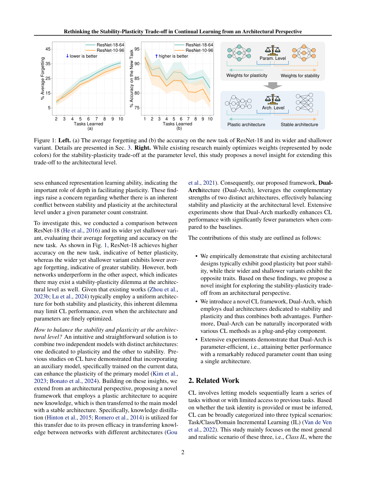
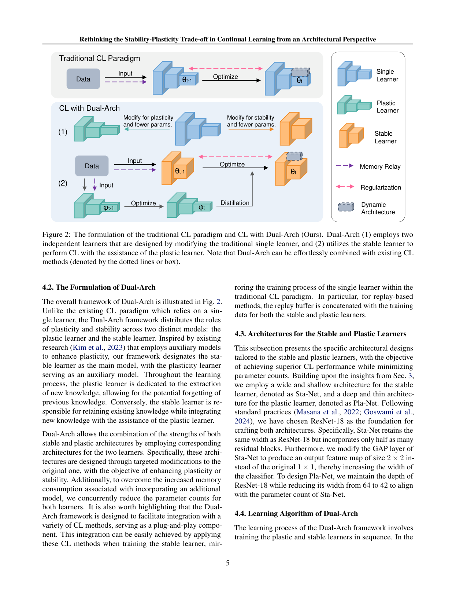

`dual_arch | Rethinking the Stability-Plasticity Trade-off in Continual Learning from an Architectural Perspective (Dual-Arch) | 四川大学 + 浙江大学 + 清华(Aojun Lu, Tao Feng, Yanan Sun 等) | arXiv 2506.03951 v2 2025-06-05 · ICML 2025 (PMLR 267) | 主题线 L?(参数/架构级持续学习 · 防遗忘) · 相关性 Med`

> 说明:本 key 真实 id=2506.03951,是**架构视角的经典 CL**(ResNet 图像增量学习),**非视觉-语言/VLM**,勿与其它"dual/视觉"工作混淆。

══ 第一层:一眼看懂 [light] ══
- 🟦 **TL;DR**:持续学习的稳定-可塑两难,大家都在"参数层"治(改 loss、回放、扩参数空间),却忽略了**网络架构本身**的影响。本文实证发现:**同样参数量下,更深的网络可塑性好(学新任务强),更宽更浅的网络稳定性好(忘得少)**——架构层也存在稳定-可塑两难。于是提出 **Dual-Arch**:用**两个独立小网络**分工——"可塑学习器"(深而窄,负责学新)+ "稳定学习器"(宽而浅,负责记牢),稳定器为主、可塑器为辅(蒸馏/记忆中继)。作为**即插即用**组件接到 iCaRL/DER 等现有 CL 方法上,在 ImageNet100 等图像增量基准上提升性能,同时参数最多省 87%。【原文 Abstract/§3/§4】
- **最巧的一步**:**把"稳定 vs 可塑"从参数层抬到架构层,并用两个形状不同的网络分别承担**。抽掉"两个学习器用不同架构(宽浅 vs 深窄)"这一点、退回"两个学习器同构",就丢掉了本文的核心发现(同构双模型如 MKD/Hare&Tortoise 已存在),提升和省参就消失——架构形状本身才是新变量。

══ 第二层:为什么做(写透) ══
- **研究背景**【原文 §1/§2】:持续学习(CL)要平衡稳定(不忘旧)与可塑(学新),即 stability-plasticity dilemma。主流三派——回放、正则(权重正则如 EWC/SI、函数正则如 iCaRL 蒸馏)、架构扩展(DER/MEMO 给每任务加参数空间)——**几乎都在"参数层"做文章**(改 loss、回放、扩参数),把权衡限制在权重上。
- **解决的具体痛点**【原文 §1/§2.2】:现有 CL 方法即便把参数优化到极致,**整体性能仍被"基础架构本身"卡住上限**(引 Lu 2024 ArchCraft)。先前架构研究(Mirzadeh 2022)只笼统得出"更宽更浅的网络 CL 整体更好(更稳)",却忽略了——表征学习理论又说"更深的网络表达力更强(更可塑)"。这两条线索矛盾,**没人系统问过:固定参数预算下,架构层是否也存在 stability-plasticity 两难?** 这正是本文要填的空白。
- **相关工作 & 各自不足**【原文 §2】:① 学习方法派(回放/正则/架构扩展)——只优化参数,基础架构次优;② 架构派(ArchCraft, Mirzadeh)——只研究"单一架构对 CL 整体性能"的影响,没意识到稳定和可塑对架构形状的偏好是**冲突**的;③ 双学习器派(MKD、Hare&Tortoise,基于互补学习系统 CLS 的 slow/fast learner)——已用两模型分担稳定/可塑,但**两模型用同一架构**,靠 EMA 等整合。本文的空位:架构层两难 + 给两个学习器配**不同形状**的架构。
- **动机链**【原文 §3→§4,实证驱动】:先做对照实验(§3 Table 1):等参数下,ResNet-18(深)在新任务准确率(AAN)高=可塑好但遗忘多;其"宽浅变体"ResNet-10-96 遗忘少=稳定好但 AAN 低 →**坐实架构层也有两难** → 既然一个架构鱼与熊掌不可兼得,**那就用两个形状互补的网络分别专攻**:深窄的 Pla-Net 负责猛学新知识(允许它忘)、宽浅的 Sta-Net 当主模型负责稳态记忆 → 用知识蒸馏把 Pla-Net 学到的新知识转给 Sta-Net(蒸馏擅长跨异构架构传知识)→ 再把两网都瘦身以抵消"多养一个模型"的开销。为什么不用更简单的现成做法?因为单架构(无论深浅)和同构双模型(MKD)都无法同时拿到深网的可塑+宽网的稳定。
- **与最近邻工作的 Δ**【原文 §2.3 明确对比】:最近邻是 **MKD / Hare&Tortoise(同构双学习器,EMA 整合)**和 **ArchCraft(单一 CL-友好架构)**。关键差异:① 对 MKD——本文坚持两个学习器**必须用不同架构形状**(Sta-Net 宽浅 vs Pla-Net 深窄),而非同构 + EMA;② 对 ArchCraft——不是找"一个万能的 CL-友好架构",而是承认"没有单架构能两全",用**双特化架构 + 蒸馏中继**绕过。这个差异有用,因为它把"深→可塑、宽→稳定"这条新发现的架构层先验直接落成了分工设计,实验上既涨点又省参(对 ArchCraft 多数情形更优,Table 2)。

══ 第三层:怎么做 + 靠不靠谱 ══
- **方法流水线**【原文 §4,Algorithm 1】:对每个新任务 k:(1)**先训 Pla-Net(可塑学习器,深窄)**——只用分类损失 LCE=Lplastic 猛学当前任务,不管旧知识(允许遗忘)→(2)**冻结 Pla-Net 当 teacher** →(3)**再训 Sta-Net(稳定学习器,宽浅,主模型)**——用复合损失 Lstable=αLCE+(1−α)LKD+LCL(Eq.3,α=0.5):LCE 学硬标签、LKD(KL 蒸馏 Eq.4)从冻结的 Pla-Net 软标签吸收新知识、LCL 是所选 CL 方法(iCaRL/WA/DER/Foster/MEMO)自带的抗遗忘项 →(4)推理时**只用 Sta-Net**。回放 buffer 同时拼进两学习器的训练数据。
- **逐组件必要性**【原文 §5.3 Table 3,有消融】:① **双网络(vs 单 Sta-Net)**——去掉 Pla-Net 只留 Sta-Net,CIFAR100/10 AIA 从 72.92 掉到 70.29(−2.63),证明可塑学习器不可省;② **架构特化(vs 两网同构)**——Pla+Pla=71.18(−1.74)、Sta+Sta=72.27(−0.65)、**角色互换 Pla(稳)+Sta(塑)=71.24(−1.68)**,全都劣于"Sta 当主+Pla 当辅"的正确配置,证明"宽浅当稳、深窄当塑"的角色绑定才是关键;③ **蒸馏中继**——是 Pla→Sta 传知识的唯一通道,虽未单独 on/off,但若无它 Sta 就拿不到 Pla 的可塑性(逻辑必要)。整体看消融较扎实(Table 3 把"双网络"和"特化"两个变量分别拆开了)。
- **关键机制/公式直觉**:① Eq.3 的 Lstable=αLCE+(1−α)LKD+LCL——直觉是让稳态主干"既听真标签、又抄一份深网学生的软答案、还遵守原 CL 方法的约束",蒸馏在这里**充当"把可塑性注入稳定主干"的管道**,既不让 Sta-Net 自己去激进学习(会破坏稳定),又让它享受 Pla-Net 的可塑成果。② Eq.4 的 KL(P_T‖P_S) 配温度 t——软标签携带类间相似结构,比硬标签更利于跨异构架构传知识。③ Sta-Net 的"2×2 池化代替 GAP"——加宽分类器入口,进一步强化宽网的稳定特性。④ Pla-Net 宽度 64→42——把深网瘦身到与 Sta-Net 参数匹配,保证"双网合计仍比单大网省"。
- **实验与证据**【原文 §5,Table 2-4】:数据集=CIFAR100/10、CIFAR100/20、ImageNet100/10、ImageNet100/20(类增量);backbone=ResNet-18 衍生;CL 方法=iCaRL/WA/DER/Foster/MEMO 五种(覆盖回放/正则/架构三派);2000 exemplar buffer,超参遵循开源库 PyCIL 保公平。**支撑核心主张的关键证据是 Table 2**:把 Dual-Arch 插到 5 个方法上,LA/AIA 几乎全面提升(最大 +10.29 LA / +7.62 AIA,如 MEMO@CIFAR100/20),同时**参数减 ≥33%**,且多数情形优于 ArchCraft(单一友好架构)。§5.4 Fig 3:DER 上 +0.90 AIA 同时省 87% 参数,Foster 上 +1.94 AIA 省 81%。§5.6 Fig 4:单 Pla-Net 遗忘重、单 Sta-Net 新任务弱,Dual-Arch 两头都好(直接证明"组合双优势")。**baseline 公平性**:统一 PyCIL 超参、5 种方法、4 个基准、多 seed(±std),相当严谨。**隐患/代价**:① §5.5 + Table 4——虽然总 FLOPs 更低(496M vs 558M)、推理只用 Sta-Net(255M),但因两网串行训练**训练时间增 1.39-1.77×**,作者承认是局限;② 个别格子提升很小(Foster@ImageNet100/10 仅 +0.36 LA),并非处处大涨;③ WA@CIFAR100/20 的 FAF 反而升(+5.86,遗忘变多),说明"省参+涨准确率"有时以局部遗忘指标变差为代价。
- **假设与失效边界**【原文 Limitations(§5.5 训练时间)+ 推断】:【推断,依据 §3 全部实证在 ResNet/卷积/类增量图像上】"深→可塑、宽→稳定"是 ResNet 图像 CL 的经验规律,是否迁移到 Transformer/LLM 的层数-宽度权衡、以及非类增量(域/指令)CL,原文未验证。在极小参数预算下(Fig 3 最左点)双网都被压得很瘦,可能两头都不够强。原文自承训练时间是硬伤。
- **祛魅总结**【推断】:**真贡献(硬货)**=① 一个干净的实证发现——固定参数下架构层确实存在 stability-plasticity 两难(深↔可塑、宽↔稳定,Table 1);② 据此设计的"双特化架构 + 蒸馏中继"即插件,消融(Table 3)清楚证明"双网络"和"角色-架构绑定"两者都必要;③ 在省参 33-87% 下普遍涨点,工程价值实在。**包装/需注意**=方法本身是"双学习器 + KD"的成熟组合,新意主要在"给两学习器配不同形状"这一点,而非算法机制;训练 1.4-1.8× 变慢、个别遗忘指标变差被相对淡化;结论强绑图像 CL,跨到 LLM 是开放问题。整体定位:一篇**实证扎实、消融到位、结论可迁移为架构层先验**的 ICML 工作,对本课题主要价值是"探索-巩固分工"的架构类比与"深↔可塑/宽↔稳定"先验。

══ 机制速览 6 轴 [light] ══
| 维度 | 内容 |
|---|---|
| 学什么信号 | 任务监督(交叉熵 LCE)+ 现有 CL 方法自带的 LCL(回放/蒸馏等);非 reward |
| 改什么 | **参数 + 架构**(两套网络权重;关键创新在网络的深/宽形状设计) |
| 何时改 | **离线批量**(标准类增量 CL,逐 step 训练) |
| 免梯度? | **否**(常规反向传播训练两个网络) |
| 记忆-技能生命周期 | 写入=可塑器学新知识(允许其遗忘)→ 经蒸馏/记忆中继把知识转给稳定器(主模型)长期保留;回放 buffer 与两器拼接;无技能库语义 |
| 防遗忘机制 | **架构隔离 + 蒸馏(function regularization)+ 回放**混合;稳定器靠"宽浅架构"天生抗遗忘,可塑器牺牲稳定换可塑,二者互补 |

⑦ **开源代码 + 框架/harness**:**开源**,Code: `https://github.com/byyx666/Dual-Arch`(原文摘要明确给出)。框架=经典 CL 代码栈(ResNet + iCaRL/DER 等基线,PyTorch),**非 LLM RL 框架**;Dual-Arch 设计为 plug-in,可挂到已有 CL 方法上。〔未 clone:本任务为 light 档只记链接;且按项目 B 层规则纯方法仓如需深读再 clone〕
💰 资源/成本:核心卖点是**省参**——相比基线参数最多减少 **87%**(两个特化小网络合计仍比单大网省);ImageNet100 切 10 个增量任务、iCaRL 固定 2000 exemplar buffer(原文 §3.1)。

🎯 **对"探索-巩固"idea 对标** [light]:**可借组件 / 类比启发**。Dual-Arch 的"**分工式双学习器:一个专门可塑探索新知、一个专门稳定巩固**"与本课题"探索-巩固"双角色高度同构——尤其"允许可塑器遗忘、由稳定器长期承接"的设计,可类比为 MTP/OPD 中"前瞻探针/快学组件 + 稳态主干"的分工。提供的硬结论(深→可塑、宽→稳定)是一个可迁移的**架构层先验**。但它是图像分类增量学习、参数级,无 agent/在线探索/经验库,故仅作架构启发,非直接竞品。

🖼 **关键图 top-2** [light]:

这是**原文 Figure 1**:左图(a)(b) 对比 ResNet-18 与其"宽浅变体"——宽浅变体遗忘更低(更稳)但新任务准确率更低(可塑差),坐实架构层两难;右图把"稳定-可塑权衡"从参数层(改权重)扩展到架构层(改网络形状)。选它因为它一图说清全文的**核心动机与新视角**。

这是**原文 Figure 2**:对比传统单学习器范式与 Dual-Arch——后者用"可塑学习器(深窄)+ 稳定学习器(宽浅)",可塑器辅助、稳定器为主,经蒸馏/记忆中继协作,且可即插到现有 CL 方法(虚线框)。选它因为它是方法主图,直观展示双网络如何咬合。

══ 假设与失效边界(一句)[light] ══
【推断,依据 §3:结论建立在"固定参数预算 + ResNet 卷积架构 + 类增量图像分类"】"深→可塑、宽→稳定"的规律是在 ResNet/图像 CL 上实证得到的,是否迁移到 Transformer/LLM 的层数-宽度权衡、以及非类增量(领域/指令)CL,原文未验证;且引入两套网络在极小预算下可能两头都不够强(Tab.1 中深窄变体可塑略升但遗忘也略升,边际窗口有限)。
