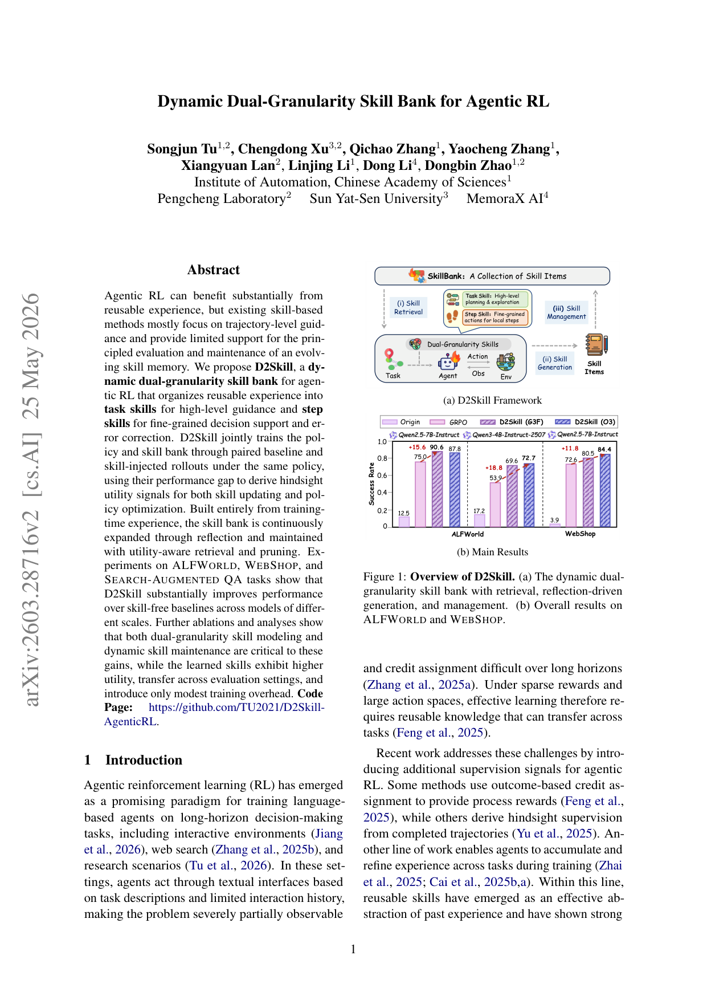
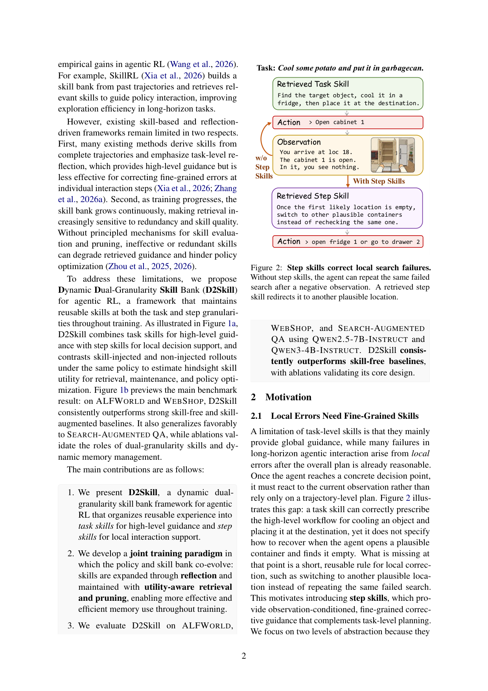

`dual_gran_skillbank | D2Skill: Dynamic Dual-Granularity Skill Bank for Agentic RL | 中科院自动化所 (CASIA) + 鹏城实验室 + 中山大学 + MemoraX AI (Songjun Tu, Chengdong Xu, Qichao Zhang, Dongbin Zhao 等) | 2026-03 · arXiv:2603.28716v2 [cs.AI] | L3(技能+RL)· Med`

> 档位:deep(三层精读 + 完整结构化抽取)。基于 PDF 正文(19 页,主文 + 附录)。

══ 第一层:一眼看懂 ══
- 🟦 **TL;DR**:给 agentic RL 配一个**双粒度技能库**:**task skill(任务级,高层规划/探索指引)** + **step skill(步级,针对单个交互步的细粒度纠错指引)**。痛点【原文 §2.1】:别人的技能多是从完整轨迹抽的**任务级反思**,擅长给整体计划,但**修不了"计划没错、但在某个具体决策点犯的局部错"**(如 Fig 2:打开一个柜子发现空了,没有 step skill 的 agent 会反复搜同一个空柜子;step skill 给一条"首个位置空了就换其他容器别重复搜"的短规则)。D2Skill 用 **paired baseline vs skill-injected rollout(同策略下注入/不注入技能对比)** 的性能差当 **hindsight utility(事后效用)** 信号,同时驱动技能更新和策略优化。技能全来自训练时经验,靠 reflection 持续扩库,用 utility-aware 检索 + 剪枝维护。ALFWorld/WebShop/Search-QA 上稳超 skill-free 与 skill-augmented baseline(ALFWorld +15.6、WebShop +18.8 等)。
- **最巧的一步**:**引入 step skill 这个细粒度层 + 用"注入/不注入同策略对比"算 hindsight utility 同时服务检索/维护/策略三处**(§3.2+Fig 1)。抽掉 step skill,就退回纯 task-level 技能、修不了局部错(消融证明双粒度是涨点关键);抽掉 paired-rollout 的 utility 信号,技能库就没了客观的"该留该删/该给多少奖励"依据。两者咬合是其相对 SkillRL(只 trajectory-level)的核心 Δ。

══ 第二层:为什么做(写透) ══
- **研究背景**:【原文 §1】agentic RL 是训练 language agent 做长程决策(交互环境/web 搜索/research)的有前景范式;这些设定**严重部分可观测**(只能看任务描述 + 有限交互史)、**长程信用分配难**、**稀疏奖励 + 大动作空间**,所以有效学习需要**能跨任务迁移的可复用知识**。可复用 skill 已成为过去经验的有效抽象(如 SkillRL 从轨迹建技能库、检索相关技能指引交互,提升长程探索效率)。
- **解决的具体痛点**:【原文 §1+§2】现有 skill-based / reflection 框架有**两个局限**:(1) **多从完整轨迹抽技能、强调任务级反思**——给高层指引,但**对修单个交互步的细粒度错误无力**(§2.1 Fig 2:task skill 能正确开出"冷却物体并放置"的高层流程,但**不指定"开了一个 plausible 容器发现空了该怎么恢复"**——缺的是一条"换另一个 plausible 位置别重复搜"的短可复用局部纠正规则);(2) **训练中技能库持续增长**,检索越来越对冗余/技能质量敏感——**没有原则化的技能评估和剪枝机制**,无效/冗余技能会拖累检索指引、阻碍策略优化(尤其 SkillRL 这种检索存储记忆但**训练中不显式估其效用**的方法,简单堆更多技能不保证更好指引)。
- **相关工作 & 各自不足**:【原文 §1/§2/§5】(1) **agentic RL 额外监督**:outcome-based credit assignment 给 process reward、从完成轨迹导 hindsight 监督;(2) **跨任务积累/精炼经验**:SkillRL(从过去轨迹建技能库、检索指引)是最近邻——但只 trajectory-level、不估效用;(3) **memory-based agent evolution**(Mem0/SimpleMem/ExpeL 等):积累可复用文本记忆,但 D2Skill 聚焦 **RL-time 技能估值与维护**(via paired skill/base rollout)而非只堆文本记忆;(4) **search-augmented**(Search-R1/ZeroSearch/StepSearch/EvolveR)是 Search-QA 上的对照。
- **动机链**:现状(skill-based agentic RL 用 task-level 技能 + 静态库)→ 缺陷①(task-level 修不了局部决策点的错,§2.1 实证"计划对但开错柜子反复搜")+ 缺陷②(库无限增长、检索对冗余敏感,Fig 3b 实证无管理时检索技能平均效用下降)→ 所以必须(a) 加 **step skill** 这个观察条件化的细粒度纠错层,(b) 做**动态技能管理**(按估计效用排序/保留/剪枝)。为什么不用更简单的现成做法(纯堆技能/SkillRL)?——【原文 Fig 3a/3b 实证】检索技能确有可测收益,但 utility-aware 管理才能随时间保住高质量检索技能;简单堆不保证更好。

══ 第三层:怎么做 + 靠不靠谱 ══
- **方法流水线**(§3 Fig 4,三紧耦合部分):
  · **① RL 训练 + 技能注入(§3.2)**:每个任务 g 采 N 条平行轨迹,**均分为 skill group(N/2,检索技能注入)和 baseline group(N/2,同策略不注入)**。用两组性能差构造 hindsight 信号:**task-level** `∆task_g = ¯Y^skill_g − ¯Y^base_g`,**trajectory-level credit** `ci = Yi − ¯Y^base_g`。每个技能 m 维护一个效用 um(EMA 更新):task skill 用 ∆task_g 更新(同任务组共享)、step skill 用所在轨迹的 ci 更新(不同步检索的 step skill 各自更新)。**hindsight intrinsic reward** `Rint_i = λ(Yi − ¯Y^base_g)`(只给 skill group,鼓励有效用技能);策略用 GRPO-style clipped 目标 + hindsight-augmented advantage(组归一化 `Ai = (˜Ri − mean)/std`,skill group 的 return 加 Rint)。
  · **② reflection 驱动技能生成(§3.3)**:仅当 `¯Y^skill_g < τref`(低性能)触发;采一条失败轨迹 τ−(可选一条成功 τ+),外部 reflector LLM 每组**最多产一个 task skill + 一个 step skill**(step skill 绑定最早失败步 j 的观察 oj)。检索键:task skill 键=g,step skill 键=(g, oj);去重后入库。
  · **③ 技能检索 + 库管理(§3.3)**:**two-stage 检索**——一阶段按 query 与键的 cos 相似度取 top-m 候选(过 τsim 阈值);二阶段用 `score(m)=α·sim + (1−α)(um + η√(log(1+Nr)/(1+nm)))`(语义相似 + UCB 式探索 bonus,鼓励低检索次数技能)排序,取 top-k 注入 context。**utility 剪枝**:每个池有容量 Nmax,超了按 eviction score(同 UCB 式)升序删最低分,**新建技能 Tprot 步内豁免**(留足评估时间)。
- **逐组件必要性(有完整消融 §4.2 Table 3,Qwen3-4B,报 val 最佳成功率)**:
  · **task skills(w/o task skills)**:72.7→**62.7**。
  · **step skills(w/o step skills)**:72.7→**60.2**(双粒度都掉,证明高层指引 + 细粒度支持都重要;作者诚实提醒:w/o step skills 仍低于 SkillRL **不应过度解读**,因 SkillRL 额外用了 held-out 轨迹构的 privileged 技能库,而此消融是 training-only 变体)。
  · **skill management(w/o skill management,关剪枝留全部技能)**:72.7→**57.8**(**掉最多**,凸显动态维护对丢无效技能/保紧凑高效用知识的重要性)。
  · **baseline group(w/o baseline group,只用绝对奖励)**:72.7→**68.8**。
  · **utility retrieval(w/o utility retrieval,只相似度)**:72.7→**64.8**。
  · **utility module(w/o utility module)**:72.7→**62.5**。
  · **skill-free(GRPO)**:53.9。作者结论:**baseline group / utility 估计主要增强 credit assignment 和技能估值(改善优化/检索质量),非直接主因;双粒度 + 动态管理才是主因**。
- **关键机制/公式直觉**:核心是 **hindsight utility = paired-rollout 性能差(Eq 1)**——直觉是"**同一策略下,带技能那半组比不带的那半组多成功多少,就是这批技能的事后效用**";这个差同时三用:(a) 当 intrinsic reward 塑形(`Rint=λ·gap`,推策略用好技能)、(b) 当技能 utility 更新信号(EMA 平滑后用于检索排序)、(c) 当剪枝依据。**为什么 paired 而非绝对**?——同策略对比消掉了任务难度和策略当前水平的混杂,gap 更干净地归因到"技能贡献"。**two-stage 检索的 UCB bonus** 直觉:别只检索最相似的(会困在少数高频技能),给低检索次数技能一个探索加成,让新技能有机会被试。**剪枝豁免 Tprot** 直觉:新技能还没被充分检索评估,别过早删。
- **实验与证据**:三设定——**ALFWorld**(Pick/Clean/Cool/Look/Heat/Pick2)、**WebShop**、**Search-Augmented QA**(NQ/TriviaQA/PopQA/HotpotQA/2Wiki/MuSiQue);base **Qwen2.5-7B-Instruct / Qwen3-4B-Instruct-2507**;reflector 可为 O3/Gemini-3-Flash/Self。**支撑核心主张的关键实验 + 具体数字**:(1) **ALFWorld(Table 1)**:Qwen2.5-7B 下 D2Skill 最强变体 All=**90.6**(Origin 12.5、GRPO 75.0、SkillRL(O3) 89.1);Qwen3-4B 从 GRPO 53.9→D2Skill **72.7**(+18.8);(2) **WebShop**:Qwen2.5-7B success 从 GRPO 72.6→D2Skill **84.4**(+11.8),Origin 仅 3.9;(3) **Search-QA(Table 2)**:Qwen2.5-7B avg 44.9(超 SkillRL 43.1),**多跳 QA(HotpotQA/2Wiki)增益尤明显**——与"step skill 服务局部正确决策序列"的论点一致;(4) **Self 设定(无闭源 reflector)**:仍超 GRPO(ALFWorld 82.8、WebShop 81.3),证明**核心增益不依赖特权闭源监督**;(5) **SFT 初始化**:D2Skill 40 步达 92.2(≈GRPO 120 步),120 步达 95.3,同预算超 GRPO,**提升训练效率**;(6) **可迁移性(Fig 5)**:**评测时即使不给技能库**,D2Skill 训出的策略仍 ≥ GRPO(ALFWorld 72.6 vs GRPO 53.9 的 no-skill;WebShop 73.4 vs 68.0),说明**部分技能增益已内化进策略**;用 Gemini 生成的库评测仍超 no-skill,self 库最有效。**baseline 公平性**:同 base model、∗标注复现自 Feng/Xia;但**作者主动声明 SkillRL 用了 privileged held-out 技能库**,故部分对比 D2Skill 处于劣势设定却仍竞争力强。**值得注意**:ALFWorld 子任务增益不均(Cool/Clean 大,Look/Pick headroom 小),与 task 是否程序性有关。
- **假设与失效边界**:【原文+推断】**核心主张(原文,§2.1+Fig2 实证)"长程失败多来自局部错,需 step-level 细粒度纠错补任务级规划之不足"**。**隐式假设(推断)**:(a) **paired-rollout 的 utility 估计稳**——每任务只 N/2 条 baseline,小 group 下 ¯Y^base 方差可能大,gap 噪声进而影响 utility/reward;(b) **reflection 能生成有用的 step 规则**——依赖 reflector LLM 质量(虽 Self 设定证明不必闭源,但更强 reflector 更好);(c) **step 规则可泛化**——当步级失败高度上下文特异、单条短规则难覆盖时受限。**失效边界**:同策略 paired 对比在策略快速变化时 gap 估计不稳;UCB 探索 + 剪枝的阈值需调。
- **祛魅总结**:【推断】**真贡献(硬货)**:(1) **step skill = 观察条件化的步级局部纠错**——这个细粒度层是真新意,Fig 2 的"反复搜空柜→一条短规则重定向"非常直观,消融(去 step skill 72.7→60.2)证明其价值;(2) **paired-rollout hindsight utility 一信号三用**(reward 塑形 + 技能估值 + 剪枝依据)——干净且统一;(3) **诚实的对照**(主动声明 SkillRL 用 privileged 库、w/o step skills 不应过度解读)、**Self 设定证明不依赖闭源**、**可迁移性证明部分内化**,这些都加分;(4) **开销实测透明**(8×H100:D2Skill 25.6h vs GRPO 20.8h vs SkillRL 49.2h,~1.7× faster than SkillRL)。**包装/营销面**:(1) "+15.6/+18.8"等大增益是**最强变体 vs Origin/特定 baseline**,且子任务不均;(2) **paired rollout 需双份采样**(skill + baseline 各 N/2),虽作者称 modest overhead(靠批量 embedding + 增量编码),但本质上**每组一半样本"浪费"在 baseline 对照上**,是隐性成本;(3) reflector 是外部 LLM(O3/Gemini),Self 设定虽 work 但最强结果仍用闭源 reflector。作者整体**未明显高估**——局限、开销、privileged 设定都明说,是本批里实证最扎实、最诚实的一篇之一。

══ 结构化抽取(供全景汇总) ══
- 🎯 **机制速览 6 轴**:
  | 学什么信号 | 改什么 | 何时改 | 免梯度? | 记忆-技能生命周期 | 防遗忘机制 |
  |---|---|---|---|---|---|
  | 环境 reward + **paired rollout hindsight utility**(skill-injected 减 baseline 的性能差,同策略下)+ reflection 信号 | **双管齐下**:模型参数(策略,GRPO-style)+ 外置双粒度技能库(task/step skill,reflection 生成、utility 剪枝) | **在线、训练中**(技能库与策略 co-evolve;检索→生成→管理三环贯穿训练;reflection 仅低性能时触发) | **混合**(策略侧梯度;技能库侧免梯度的反思生成 + 效用检索/剪枝) | 写入(reflection 生成 task/step skill,绑检索键 g / (g,oj))→ 检索(two-stage:cos 相似度 + UCB 式 utility 探索)→ 维护(**utility-aware pruning** 按 eviction score 删低质,新技能 Tprot 步豁免;防库膨胀使检索退化)→ 喂回策略;**淘汰机制 = 效用剪枝** | **无显式防参数遗忘**;靠效用剪枝防"技能库膨胀→检索噪声→指引退化",属外置记忆质量维护而非参数防遗忘;部分技能增益内化进策略(Fig 5 实证 no-skill 评测仍超 GRPO) |

- ⑦ 开源代码 + 框架/harness:**已开源** https://github.com/TU2021/D2Skill-AgenticRL(【原文】摘要 Code Page)。harness/框架:**GRPO-style agentic RL,自研**(完整 loss 见附录 A.2;对比 vanilla GRPO 基线);base 用 Qwen2.5-7B-Instruct / Qwen3-4B-Instruct-2507;reflector 为外部 LLM(O3/Gemini-3-Flash/Self);检索用 embedding + 增量编码;底层 RL 训练框架(veRL 等)正文未点名〔待核仓库〕。
- 💰 资源/成本与可扩展性:**已量化**——ALFWorld + Qwen3-4B 在 **8×H100 上 D2Skill 25.6 wall-clock 小时**,接近 GRPO(20.8h),远低于 SkillRL(49.2h),实践中比 SkillRL **~1.7× 快**(Fig 6)。低开销主要来自高效检索 pipeline(批量 embedding 查询 + 增量编码,只编新加技能)。**隐性成本**:paired rollout 需双份采样(skill + baseline 各 N/2),一半样本用于对照。【推断:可扩展性主要受 reflector LLM 调用 + 技能库增长后检索成本影响,但剪枝控住了库规模。】
- 🎯 **对"探索-巩固"idea 对标**:**强支撑 + 高可借组件**。**step skill = 步级局部纠错(观察条件化的短规则)** 与 TSRD 的 **path-recovery / 关键步单点接管** 几乎同构——"计划对但某步搜错→给一条局部纠正规则"正是 path-recovery 的具体形态(Fig 2 的"换容器别重复搜"就是一个 path-recovery 规则)。可借三点:(a) **双粒度(task 全局 + step 局部)技能组织**,对应"路径选择(高层)+ 路径恢复(局部)";(b) **paired-rollout hindsight utility** 作为"某条恢复指引是否真有用"的度量(注入/不注入同策略对比);(c) **效用剪枝 + UCB 检索**作为外置脚手架库的质量维护机制。属支撑 + 直接可借组件。
- 🔭 开放问题/未来方向:【原文 + 推断】(原文)更强 reflector 可进一步改善轨迹诊断与技能抽象;【推断】(a) **小 baseline group(N/2)下 utility 估计的方差控制**;(b) **step skill 的泛化边界**——单条观察条件规则在高度特异失败上是否泛化;(c) **把 paired-rollout 对照成本降下来**(目前一半样本用于 baseline);(d) **效用剪枝阈值/容量自适应**;(e) 仅 4B/7B + 三 benchmark,更大模型/更多域待验证。
- 🖼 **关键图 top-2**(保留原选):

这是**原文 Figure 1**(主图,该页含框架 a + 主结果 b)。(a) 双粒度技能库:检索→reflection 生成→管理三环,task skill(高层规划/探索)+ step skill(局部细粒度动作);(b) ALFWorld/WebShop 上 D2Skill 大幅超 Origin/GRPO(如 ALFWorld 12.5→90.6/87.8)。选它因为它一图给出方法骨架 + 双粒度核心概念 + 主结果增益。

这是**原文 Figure 2**(动机/机制图,该页)。一个具体例子:任务"冷却土豆放垃圾桶",检索到的 task skill 给整体流程,但 agent 打开 cabinet 1 发现空了——**无 step skill 时反复搜同一空柜;有 step skill 时被一条"首个位置空了就换其他容器别重复搜"的短规则重定向**。选它因为它最直观地说明"为什么需要 step 粒度",这正是与 TSRD path-recovery 同构的关键示例。
