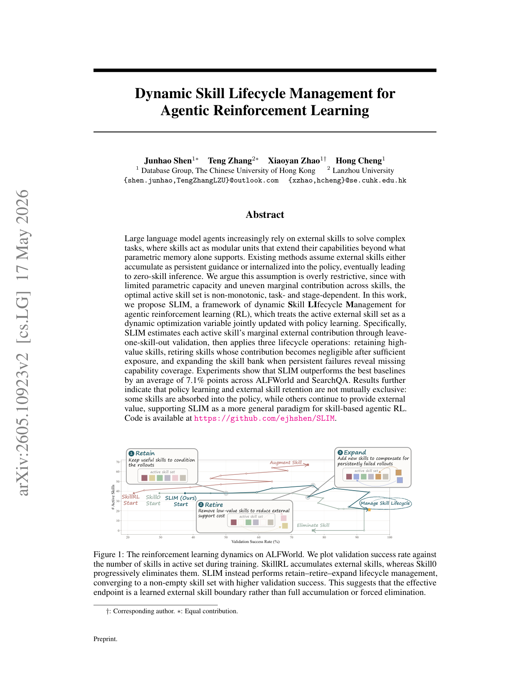

`dyn_skill_lifecycle | SLIM: Dynamic Skill Lifecycle Management for Agentic Reinforcement Learning | CUHK (Database Group; Junhao Shen, Xiaoyan Zhao, Hong Cheng) + 兰州大学 (Teng Zhang) | 2026-05 · arXiv:2605.10923v2 [cs.LG] · Preprint | L3(技能+RL,生命周期)· Med`

> 档位:deep(三层精读 + 完整结构化抽取)。基于 PDF 正文(33 页,主文 + 附录)。**本批最贴"探索-巩固"的一篇。**

══ 第一层:一眼看懂 ══
- 🟦 **TL;DR**:在 agentic RL(GRPO)训练里,**外置技能集到底该一直堆(SkillRL)还是最终清空内化进参数(Skill0)?** 本文 SLIM 说**两个极端都太死**——参数容量有限、各技能边际贡献不均,所以**最优的活跃技能集是非单调、随任务/训练阶段变化的**。SLIM 把"活跃外置技能集"当成与策略**联合优化的动态变量**:用 **leave-one-skill-out 验证**估每个活跃技能的边际外部贡献(MEC),再做三个生命周期操作——**Retain(留高价值技能条件 rollout)/ Retire(某技能充分曝光后贡献变可忽略就退役,省外部支持开销)/ Expand(持续失败暴露能力缺口就扩库)**。ALFWorld + SearchQA 上平均超最强 baseline 7.1 个点;关键发现:**策略学习与外置技能保留不互斥——有些技能被内化进策略,有些继续作为外部价值存在**(收敛到非空技能集,而非全堆或清零)。
- **最巧的一步**:**用 leave-one-skill-out 验证度量"每个技能的边际外部贡献",把它当成 retain/retire/expand 的统一判据**(§3 把训练写成容量约束分配问题 max Perf−Ω(A) s.t. Σm(s)≤Cθ)。抽掉这个"留一技能验证的边际贡献信号",三个生命周期操作就没了客观依据,SLIM 退回成 SkillRL/Skill0 那种"要么单调加、要么单调减"的固定策略——而它的全部新意正是"学出一条**外置能力边界**"。

══ 第二层:为什么做(写透) ══
- **研究背景**:【原文 §1+§2】LLM agent 解多步推理/长程规划/工具使用任务,一个增强途径是给它配**外置技能**(inference-time 插入的模块化程序 artifact,提供可复用解题指引),让 agent 突破参数本身能可靠表达的能力边界。RL 已成为 post-train agent 的关键范式(GRPO 等)。
- **解决的具体痛点**:【原文 §1】现有 skill-based agentic RL 大多走**两条单调路线**:(1) 把技能当**持久增强**,不断扩外置技能库(SkillRL);(2) 把技能当**临时脚手架**,逐步移除直至 **zero-skill inference**,想把好处转进模型参数(Skill0)。两者都隐含假设"活跃技能集应该要么一直长、要么最终消失",**忽略了更一般的问题**:在**有限参数容量** + **各技能边际贡献不均**下,活跃外置技能集到底该怎么演化?这个问题重要,因为:语言模型的参数存储有限(受模型大小/训练预算/记忆-泛化权衡约束),**不是每个有用能力都该硬塞进参数**——外置技能尤其适合保**窄/低频/长尾的程序**(塞参数代价高或没必要);但**留太多活跃技能也不免费**(大技能库引入 routing 噪声、长注入 context 降低技能使用可靠性)。所以核心不是"该堆还是该删",而是**如何确定一个学习中 agent 的外置边界**。
- **相关工作 & 各自不足**:【原文 §2】(1) **LLM agent**(工具/web/computer use/长程):外部 scaffolding 对可靠行为关键,但不研究训练中技能集如何演化;(2) **agentic RL**(GRPO 及变体):提供优化骨架,但**不决定技能该留/删/扩**——SLIM 固定 RL optimizer,专研这个外置能力管理问题;(3) **skill-based agents**(外置技能库 SkillRL、可复用 prompt 模块、蒸馏程序指引):最近邻是 SkillRL(持久增强)、Skill0(清零内化)、EvolveR(决策与技能库 agent 协同进化);SLIM **与它们互补**——把活跃技能集当动态变量,在有限容量下决定何时 retain/retire/expand。
- **动机链**:现状(skill-based agentic RL 要么单调堆 SkillRL、要么单调清 Skill0)→ 缺陷(两极端都忽略"有限参数容量 + 边际贡献不均"这个现实——堆太多有 routing/context 开销,清太狠会挤掉/丢掉长尾外置能力)→ 所以必须把活跃技能集当**可训练的外置能力边界**,逐技能判断"还值不值得留外置"。为什么不用更简单的现成做法?——【原文 §6.2/6.3 实证】(a) GRPO† 朴素注入技能**并非一律有益**(改进 Pick2/Cool 但伤 Look/Pick),证明需按边际效应筛;(b) Skill0 清零后**验证从 92.2% 掉到 76.6%**(强行 zero-skill 移除了有用外部支持),证明"退役 ≠ 成功内化";(c) SkillRL 堆到 73 个技能**最终性能仍低于 SLIM**,证明堆多≠更好。
- **与最近邻工作的 Δ**:最像 **SkillRL(持久增强)** 和 **Skill0(清零内化)**——SLIM 在 §4.3 末把二者证明为**自己的边界特例**:禁用 retirement(At+1⊇At)就退化成 SkillRL,禁用 expansion 且强制 retire 到 At=∅ 就退化成 Skill0。关键 Δ:**SLIM 用 MEC(留一验证)动态决定边界,产出非单调轨迹**(ALFWorld 上 38→46 波动→稳定在 21 个非空技能)。为什么这差异有用?——它正面回答了"何时该把外置脚手架巩固进参数、何时该继续外置、何时该淘汰",且给了可操作判据(边际外部贡献),而两个 baseline 都是拍脑袋的单调策略。

══ 第三层:怎么做 + 靠不靠谱 ══
- **方法流水线**(§4 Fig 2,三组件 + 交替优化):
  · **问题形式化(§3 Eq 2)**:`max_{θ,A,I} E[Perf(x;πθ,A)] − Ω(A)  s.t.  Σ_{s∈I} m(s) ≤ Cθ, A∩I=∅`。A=活跃外置集、I=已内化潜在集、U=非活跃集;m(s)=内化技能 s 的有效参数记忆代价、Cθ=模型有限知识容量、Ω=外部支持代价(黑盒单调集函数,加任一非活跃技能边际代价>0)。Ω 的单调性刻画"多活跃技能=更多 context/routing 开销",有限容量约束阻止"假设所有技能都能塞进参数"。精确在线优化此混合空间不可解,故 SLIM 用三个可解近似:
  · **① 分层技能检索(§4.1)**:把全局技能选择降成任务条件候选选择——general skill 池 + task-specific 池 Sk;对任务 x(类型 k),用 Qwen3-Embedding-0.6B 算 cos 相似度,取 `Qt(x)=TopK(s∈Ak_t: cos(ex,es)≥τemb, K)`(τemb=0.45, K=3);最终条件策略 `πθ(at|ht, Agen_t ∪ Qt(x))`。检索限制在**当前活跃集**内,故生命周期决策直接影响后续 rollout 可见的外置能力。
  · **② 边际外部贡献估计(§4.2,MEC)**:`∆t(s)=Perf(Vt(s);At) − Perf(Vt(s);At\{s})`(Vt(s)=当前活跃集下 rollout 用到 s 的验证任务子集),即**留一技能验证**;用 EMA 平滑 `¯∆t(s)=α∆t(s)+(1−α)¯∆t−1(s)` 降审计噪声。正值=策略仍受益于把该能力留外置,近零/负=可能已被吸收/冗余/有害。强调这是**局部估计**(条件于当前策略/活跃集/routing),非对所有子集的全局归因。
  · **③ 生命周期管理 + 策略优化(§4.3,交替优化)**:每 audit cycle 分两步——**(i) GRPO 策略更新(活跃集固定)**:Ω(At) 为常数,只改策略;**(ii) 技能生命周期管理(策略固定)**:限制为单技能 move(绝对代价差有界),按 ¯∆ 定状态转移规则——**Retain**:`¯∆t(s)≥τkeep`(价值明显>外部代价)→ 留;**Retire**:`¯∆t(s)<τretire 且 累计曝光 ut(s)≥nmin 且 低贡献连续 ℓt(s)≥p`(充分曝光后贡献可忽略才退,保护低频技能不被过早删)→ 删;**Expand**:`Perf(Vt(s);At)<τexpand 且 路由失败数 Nt(s)≥nexpand 且 ¯∆t(s)<τkeep`(当前技能持续覆盖不了其路由任务区)→ 加新技能 snew。τretire≤¯∆<τkeep 时不动(留到后续审计有更强证据)。
  · **实现(§5 Alg 1)**:audit 每 d=10 GRPO 步一次,每次只审计 top-M=4 个最近高路由使用的技能(控审计开销);Expand 用路由失败桶 + Anthropic-style skill-creator workflow 造 standalone task-specific SKILL.md;主 SLIM run **关掉 policy-side KL loss 和 KL-in-reward**;无 cold-start SFT/warmup。
- **逐组件必要性(有完整消融 §6.4 Table 2)**:
  · **Retirement(w/o Retirement)**:ALFWorld 87.5→**73.4**(扩而不删→退化成 SkillRL 式持久增强,堆出 routing/context 开销)。
  · **Expansion(w/o Expansion)**:87.5→**78.9**(不能补缺口)。
  · **MEC 审计 vs Random Audit**:87.5→**68.8**(随机选审计技能,掉最多,证明"按边际贡献选"是关键)。
  · **动态 vs Fixed Active Set Size**:87.5→**75.6**(固定活跃集大小,证明"非单调动态调整"有用)。
  · **分层检索/EMA 平滑**:无单独消融(属工程组件)。
- **关键机制/公式直觉**:核心是 **MEC = 留一技能验证(Eq 4)**——直觉是"**直接做实验问策略:把这个技能从它服务的那些验证任务上拿掉,成功率掉多少?掉得多说明策略还离不开它(留),几乎不掉说明已内化或冗余(可退)**"。这比"看检索相关性"更本质:相关 ≠ 还值得外置(同类任务可能选到不同技能、贡献差异大)。EMA 平滑是为了让单轮审计噪声不至于误删。交替优化的直觉:Eq 2 含连续 θ(梯度可优化)+ 离散 A(需非可微集操作 + 黑盒代价 Ω),所以拆成"固定 A 做 GRPO"和"固定 θ 做单技能 move",每个被接受的 move 都是 bounded-risk 局部更新(附录 Lemma A.7/A.8/A.10 给局部充分条件:必要技能 MEC 高时被保护、退役被阻止)。
- **实验与证据**:**Qwen3-4B**,benchmark **ALFWorld**(Pick/Look/Clean/Heat/Cool/Pick2)+ **SearchQA**(NQ/TriviaQA/PopQA/HotpotQA/2Wiki/MuSiQue/Bamboogle);baseline 覆盖 prompt(Zero/Few-Shot±skill)、agent/memory(ReAct/Reflexion/Mem0/ExpeL)、RL(GRPO±skill/EvolveR/SkillRL†/Skill0)。统一 train/val/test 协议,RL 法无 cold-start。**支撑核心主张的关键实验 + 具体数字(Table 1)**:(1) **ALFWorld**:SLIM† **87.5**,超最强非 SLIM baseline SkillRL† 的 75.0 **+12.5 点**;SLIM(无 skill)72.7 vs SLIM† 87.5 的大 gap 说明 ALFWorld 有些能力**更适合留外置**;增益集中在程序性状态变换任务(Clean 91.4、Cool 88.5,远超 SkillRL†/Skill0);(2) **SearchQA**:SLIM 与 SLIM† **都 41.0**,超最强 baseline Skill0 的 39.3 **+1.7 点**;此处 SLIM 与 SLIM† **几乎无 gap**——说明好处主要进了**训练后的策略**而非最终外部依赖。两个 regime 共同支撑核心主张:**技能-based agentic RL 的终点是任务相关的**(有些域需保留外置程序技能,有些训练后能吸收/丢弃多数外部支持)。**训练动态(Fig 3)**:SkillRL 38→73 单调堆但最终仍低于 SLIM;Skill0 38→0,清零后验证从 92.2%→76.6%;**SLIM 非单调**(38→46 波动→稳定 21),no-skill 性能 29.7%→84.4%(策略确实在学),with-skill 峰值 93.8% 末尾 90.6%——**不拿策略学习换外部依赖**。**baseline 公平性**:同 train/val/test 协议、同 evaluator、RL 法均无 warmup;†=带检索外置技能评测。**值得注意**:SearchQA 上增益仅 +1.7 且广而薄(naive 注入甚至 Zero-Shot†/Few-Shot† 掉到 no-skill 之下),说明 SLIM 的大头优势在 ALFWorld 这种**长程程序性、能力不均覆盖**的域;简单任务(Pick)headroom 有限。
- **假设与失效边界**:【原文+推断】**核心主张(原文,Fig 1/3 实证)**:最优活跃技能集非单调、是 task/stage 相关的学习边界,而非全堆或清零。**隐式假设(推断)**:leave-one-skill-out 的边际贡献估计**足够稳、能驱动正确增删**——原文 §4.2 自己限定:它在"路由到 s 的验证任务反映 rollout 时同样局部行为"时才可靠,是**局部代理而非全局归因**。**失效边界**:(a) **技能间强交互**时留一估计失真(拿掉 s 的损失被其他技能补偿,MEC 低估其价值);(b) **评估预算不足**导致 MEC 噪声大(虽有 EMA + 曝光阈值保护低频技能,但 audit 只看 top-M=4 个,长尾技能可能审计不足);(c) Ω 是黑盒单调假设,真实 routing/context 开销若非单调则代价 bound 失效。
- **祛魅总结**:【推断】**真贡献(硬货)**:(1) **把"外置 vs 内化"这个张力形式化成容量约束分配问题,并给出可操作判据(MEC 留一验证)**——这是对 SkillRL/Skill0 二元对立的一个真正的概念推进,且把二者证明为自己的边界特例,理论上干净;(2) **"非单调能力边界 + 部分内化部分外置"的实证(Fig 3)**很有说服力——no-skill 曲线涨到 84.4% 证明策略在学,同时保留 21 个仍有边际贡献的外置技能;(3) 消融完整(retire/expand/random-audit/fixed-size 四个变体都掉,且 random-audit 掉最多印证 MEC 是核心)。**包装/营销面**:(1) "平均超 7.1 点"被 ALFWorld 的 +12.5 拉动,**SearchQA 仅 +1.7**——增益高度任务依赖,作者其实诚实地把这点当作"核心主张"(终点 task-dependent)而非藏起来;(2) MEC 留一验证**有计算开销**(每个被审计技能要跑额外 rollout 评估),虽用 top-M=4 + d=10 控制,但作者承认这是换"非空紧凑技能集"的代价;(3) 大量理论保证在附录(Lemma A.6–A.10),是**局部充分条件**而非全局最优性,标题"Lifecycle Management"听着系统,实质是一组带阈值的启发式状态转移规则。作者整体**未高估**——任务依赖性、局部估计的可靠条件、审计开销都明说。

══ 结构化抽取(供全景汇总) ══
- 🎯 **机制速览 6 轴**:
  | 学什么信号 | 改什么 | 何时改 | 免梯度? | 记忆-技能生命周期 | 防遗忘机制 |
  |---|---|---|---|---|---|
  | 环境 reward(GRPO 组相对优势)+ **leave-one-skill-out 验证得到的每技能边际外部贡献 MEC**;持续失败信号触发扩库 | **双管齐下**:模型参数(GRPO 训策略)+ **外置活跃技能集 A(动态优化变量,retain/retire/expand)** | **在线、训练中**(每 d=10 步 audit 重估活跃集,与 RL 策略更新交替耦合);技能集随训练非单调演化 | **混合**——策略侧梯度训练(GRPO),技能集侧免梯度的检索/增删管理 | **本文核心即生命周期**:写入/扩库(Expand,失败暴露缺口)→ 分层检索(general + task-specific,active 子集 At)→ **退役(Retire,边际贡献可忽略)/ 内化(absorbed into policy,移入 latent set I)/ 留存(Retain)**;明确区分 active/internalized(I)/inactive(U)三态 | **隔离式 + 容量感知**:有限参数容量 Cθ 约束下,把"该内化的"放参数、"窄/长尾的"留外置(§3 m(s) 内化代价 + Ω 外部支持代价权衡),用外置技能保住长尾能力不被参数学习挤掉(对长尾的隔离保护);退役设曝光阈值 nmin + 低贡献连续 p 防过早删低频技能 |

- ⑦ 开源代码 + 框架/harness:**已开源** https://github.com/ejhshen/SLIM(【原文】摘要明确)。harness/框架:**GRPO**(§3 给出完整 GRPO 目标式,含 clip + KL,但主 run 关掉 KL);基于 **SkillRL 的分层技能库设定**(general + task-specific 池);检索用 Qwen3-Embedding-0.6B;Expand 用 Anthropic-style skill-creator workflow 造 SKILL.md;具体底层 RL 训练框架(veRL 等)正文未点名〔待核仓库确认〕。
- 💰 资源/成本与可扩展性:**部分**——MEC 留一验证需对**每个被审计技能**跑额外 rollout 评估(边际贡献估计有计算开销),用 **audit 每 d=10 步 + 每次只审计 top-M=4 个高路由技能** 控制开销(附录 D 报告 audit overhead);Expand 有 budget B。base model 仅 Qwen3-4B。具体算力/卡时/延迟数主文未给定量(附录 D 有 audit overhead 分析)。【推断:可扩展性瓶颈在 audit 的额外 rollout 成本,随技能库增大而增。】
- 🎯 **对"探索-巩固"idea 对标**:**强支撑(本批最相关)+ 直接竞品视角**。它正面回答了 TSRD 关心的核心张力:**外置脚手架/技能 何时该留作外部、何时该巩固进参数、何时该淘汰**——并给出可操作判据(边际外部贡献 MEC)。"非单调能力边界 + 部分技能被内化、部分继续外置"的实证(Fig 3:no-skill 涨到 84.4% 同时保 21 个外置技能),直接支撑 TSRD"探索(扩)—巩固(内化)—淘汰(退役)"三相循环的合理性。可借:**leave-one-skill-out 边际贡献**作为"某个 scaffold 是否还值得留作外部"的统一度量,可迁移到 MTP/OPD 决定脚手架去留;**"内化代价 m(s) vs 外部支持代价 Ω"的容量约束分配视角**也可直接套用到"path-recovery 脚手架该内化还是外置"。属支撑 + 方法论可借组件(也是最接近"竞品"的一篇,因为它就是在做 TSRD 想做的边界学习)。
- 🔭 开放问题/未来方向:【原文 §6.1 附录 D 提及 + 推断】跨任务泛化、技能库迁移、初始化敏感性、审计开销(附录已部分报告);【推断】最关键缺口:(a) **强技能交互下 MEC 失真**——留一验证假设技能近似可加,扩展到"留多技能/组合归因"是自然下一步;(b) **把 MEC 从离线审计变成在线轻量信号**(降审计 rollout 成本);(c) m(s) 内化代价目前是概念量,**如何实测"某技能内化进参数的真实代价"**未解;(d) 仅 Qwen3-4B + 两 benchmark,更大模型/更多域的边界规律待验证。
- 🖼 **关键图 top-1**(保留原选):

这是**原文 Figure 1**(核心结果+机制图,该页)。横轴训练中活跃技能数、纵轴验证成功率:**SkillRL 一路堆技能(38→73)、Skill0 一路清零(38→0)、SLIM 做 retain–retire–expand 收敛到一个非空技能集(~21)且成功率最高**;右侧三个气泡图解 Retain(留有用技能条件 rollout)/Retire(删低价值省开销)/Expand(失败补缺)。选它因为它一图同时给出**核心论点(非单调边界优于两极端)+ 三个生命周期操作 + 主结果**,是全文精华所在。
*(注:本篇另有 Fig 2 方法总览 + Fig 3 训练动态双曲线,均很有信息量;按 top-2 限额仅保留已有的 Fig 1——它最综合;Fig 3(no-skill 涨到 84.4% 同时保 21 技能)是第二有价值的图,但沿用原有 figs 不新增。)*
