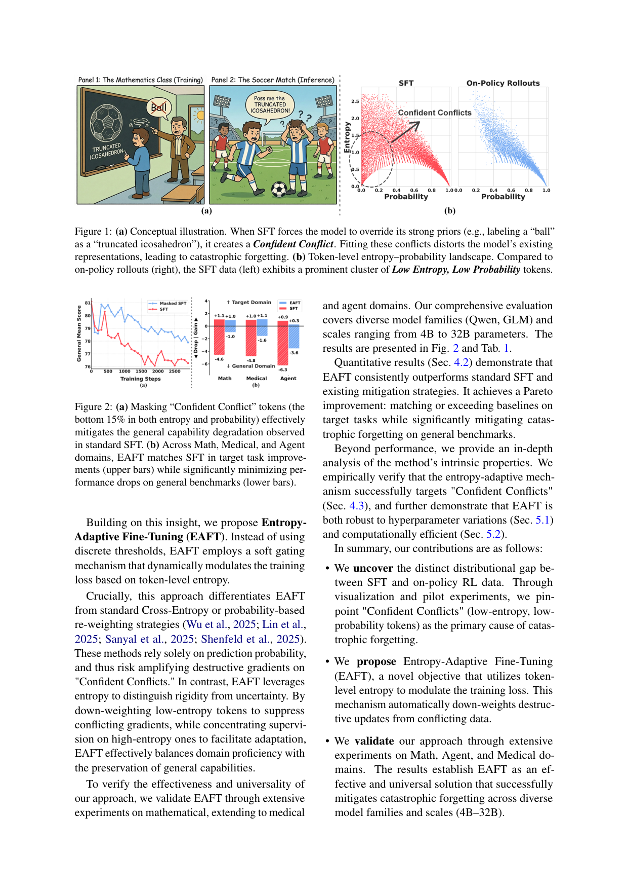
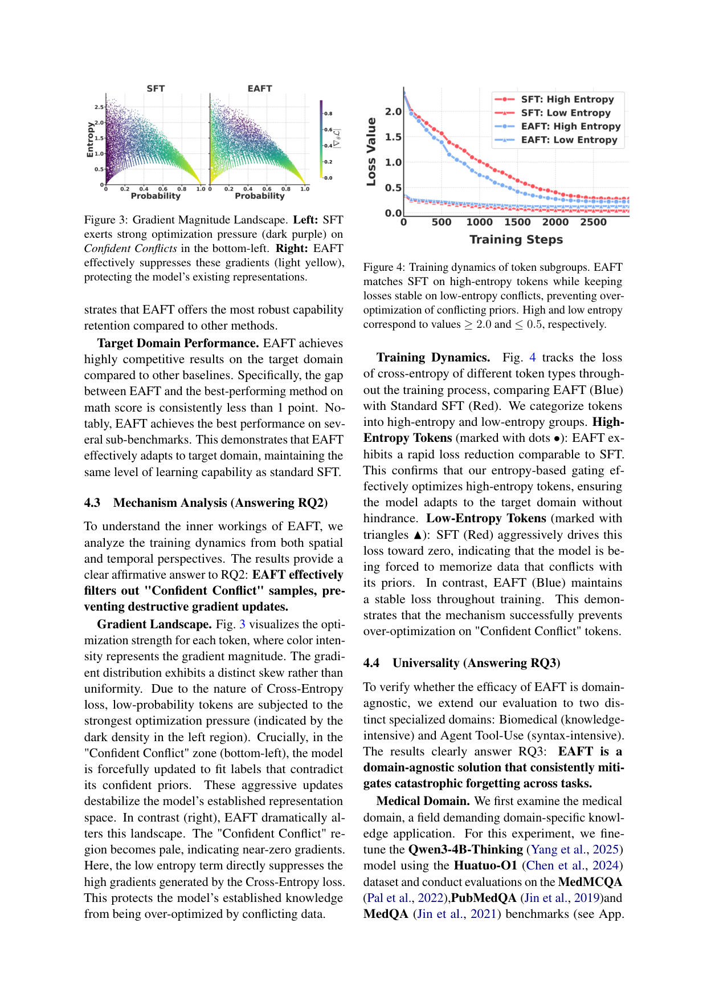

`eaft_confident | Entropy-Adaptive Fine-Tuning: Resolving Confident Conflicts to Mitigate Forgetting (EAFT) | 北京邮电大学 BUPT PRIS-CV + 中关村学院（Muxi Diao / Lele Yang / Wuxuan Gong 等共一,Weiran Xu / Zhanyu Ma 通讯） | 2026-01（arXiv:2601.02151 v1，5 Jan 2026，Preprint） | L5 巩固·token 级熵门控减 SFT 遗忘 | 相关性 High`

> 【档位】deep 全档。基于下载的真实 PDF 正文（17 页,主体 §1–§7 + 附录 A 词云/B–F 数据与实现）。三标注：【原文】直接来自论文 /【推断】我的有据判断（附依据）/【待核】拿不准的关键事实。
> ⚠️ 本篇与 `rls_razor`(Shenfeld 2025)、`retaining_by_doing`(Chen 2025)同属"on-policy 为何少遗忘"母题,但走**token 级数据视角**:它把 RL's Razor 的"分布级 KL"现象,下沉到"哪些 token 在制造破坏性梯度"。两篇均被本文正文显式引用对标,按指令在对标栏写透。

---

## ══ 第一层：一眼看懂 ══

- 🟦 **TL;DR**：【原文】同一个问题:为何 SFT 学新领域(数学/医疗/agent 工具)会砸掉模型的通用能力,而 on-policy RL 不会?本文用**token 级显微镜**给出答案:把每个训练 token 按"模型给真值标签的概率 p_t"和"模型在该位置的预测熵 H_t"画散点(Fig 1b),发现 **on-policy 数据**只落在"高概率(模型答对)"或"高熵(模型在探索)"两区;而 **SFT 数据**多出一簇 **低概率 + 低熵** 的 token——意思是"模型对自己的预测很自信(低熵),却被外部真值逼着学一个相反的标签(低概率)"。作者命名为 **"Confident Conflict(自信冲突)"**。交叉熵在这种 token 上会产生**巨大梯度**(因为要把强先验掰过来),从而覆盖、扭曲基座里的通用表征 → 灾难性遗忘。pilot 实验:只要把"两项排名都在底部 15%"的这些冲突 token 的 loss **mask 掉**,遗忘就几乎消失(Fig 2a)。据此提出 **EAFT**:不用硬阈值,而用**归一化熵当软门控**乘到 CE loss 上(\(L = H̃_t · CE_t\),Eq.2)——熵低(自信冲突)→ 权重趋 0、压住破坏性梯度;熵高(不确定/探索)→ 权重趋 1、保留正常 SFT 学习。在 Qwen/GLM 4B–32B、数学/医疗/agent 三域上,EAFT **目标任务追平 SFT、通用能力掉幅显著更小**(Pareto 占优)。

- **最巧的一步**：【原文】**用"熵"而非"概率"当门控信号**(§2 末、§3.3)。**抽掉它**(改回只看概率,如 DFT/TALR 那样按概率 re-weight)方法就垮:因为**低概率 token 是个混淆量**——它既可能是"epistemic uncertainty(模型确实不确定、该学)",也可能是"Confident Conflict(模型很确定但被逼学相反、该压)";只看概率无法区分,甚至会**放大**冲突 token 的破坏梯度(本文对 DFT 的批评)。**熵恰好能切开这两者**:真不确定 → 高熵;自信冲突 → 低熵。所以"熵作为门控"是把"该学的低概率"和"该压的低概率"分开的唯一信号。为什么是它——【原文 §3.2 理论洞察】CE 在"低熵+低概率"处梯度最大(模型强烈偏好别的 token,要拟合真值需大幅改参),正是这种大更新覆盖了通用表征;熵门控直接把这一区的梯度按熵压下去。【原文 §5.1 实证】所有"熵感知"变体(线性/多项式/sigmoid)都比 SFT 少遗忘,证明增益来自"熵感知"这一机制本身而非具体函数形式;而**硬 mask 虽防遗忘却砸目标任务**(数学 65.6 vs EAFT 69.3)→ 证明软门控(保留而非丢弃冲突 token 的部分信号)才是 Pareto 最优,这正是"最巧一步"成立的边界。

---

## ══ 第二层：为什么做（写透） ══

- **研究背景**：【原文】SFT 是把 LLM 适配到具体领域(数学/工具调用/生物医学)的标准手段,但常伴随**灾难性遗忘 / "对齐税(Alignment Tax)"**——拟合目标分布的同时通用能力显著退化(§1、§2)。与之对照,on-policy RL 能提领域性能又保住基座鲁棒性(引 Chen 2025 / Shenfeld 2025)。这一鲜明反差牵出全文母题问题:**为何 SFT 退化通用能力而 on-policy RL 保住了?**
- **解决的具体痛点**：【原文】① 现有"动态训练"缓解法(TALR 按 token 置信度调学习率、DFT 按预测概率 re-weight、RL's Razor 用 KL 正则约束漂移)**主要靠概率或 KL 当难度/漂移代理**,而**概率是不充分统计量**:同样的低概率,可能是"该学的不确定",也可能是"该压的自信冲突";按概率强行拟合,prior 方法反而**加速遗忘**(§2)。② 缺一个能把"刚性(rigidity,自信冲突)"和"不确定(uncertainty,该学)"分开的信号——这正是本文用熵补的洞。
- **相关工作 & 各自不足**（§2）：
  - **SFT vs RL 的二分**(Chu 2025"SFT memorizes, RL generalizes";Wang 2025;Mukherjee 2025"RL 更新更局部、子空间更小";Razin 2023)——【原文】共识是 RL 更新更局部、targeted;本文进一步追根:SFT 不稳的根因是**无差别地强拟合"confident conflict"**。
  - **灾难性遗忘经典**(EWC/LwF/GEM 约束参数变化)——治标。
  - **token 级动态法**:TALR(Lin 2025,按置信度缩学习率)、DFT(Wu 2025,按概率 re-weight loss)、FLOW(Sanyal 2025)——【原文】都只用概率/KL,无法区分两种低概率 → 本文以**熵作门控**推进。
  - **RL's Razor(Shenfeld 2025)**——【原文】用 KL 散度当正则约束模型对基座的漂移。【推断】本文是其**互补的 token 级视角**:RL's Razor 说"分布级 KL 漂移决定遗忘",EAFT 说"是哪些 token(自信冲突)在贡献这个漂移/破坏梯度",并直接在这些 token 上动手。
- **动机链**：现状(SFT 遗忘、RL 不遗忘)→ 想知道根因 → token 级统计发现 SFT 独有"低熵+低概率"簇(Confident Conflict)→ pilot mask 掉它遗忘几乎消失 → 证明它就是元凶 → 但硬 mask 丢数据、伤目标任务、且阈值敏感 → **改成用熵软门控**(熵低压、熵高留)→ 既压破坏梯度又不丢适应信号(§3)。【推断】"为什么不用更简单的现成做法":更简单的是按概率 re-weight(DFT)或硬 mask,但前者分不开两种低概率、后者砸目标任务(§5.1 实测),逻辑链因此闭合。
- **与最近邻工作的 Δ**：
  - **vs DFT(最近邻,按概率 re-weight)**：DFT 用预测概率调 loss 权重;EAFT 用**熵**。关键 Δ:概率分不开"该学 vs 该压"的低概率 token,EAFT 用熵切开。实测 Table 1:DFT 在 Qwen3-4B 上通用掉 −3.0、目标还掉(数学 63.5),EAFT 通用仅 −1.0 且目标 69.3。
  - **vs RL's Razor(KL 正则,即本文 baseline SFTKL)**：SFTKL 在 loss 里加 KL 约束防漂移;EAFT 不约束全局分布,而**选择性地只压自信冲突 token 的梯度**。【推断】Δ 在粒度:KL 是序列/分布级的整体刹车(可能也压住了该学的更新),熵门控是 token 级的精准刹车(只压冲突点)。Table 1 中 EAFT 通用保留普遍优于 SFTKL。
  - **vs Retaining by Doing(Chen 2025,on-policy 数据视角)**——本文同样引为对标(参考文献在册);【推断】Chen 强调"用 on-policy 数据"减遗忘,EAFT 则在**纯 off-policy SFT 数据上**通过熵门控**模拟**出"只学 on-policy 友好 token"的效果——等于不改数据来源,而是过滤掉 SFT 数据里 on-policy 不会出现的那簇冲突 token。

---

## ══ 第三层：怎么做 + 靠不靠谱 ══

- **方法流水线**（§3,极简,核心是一个 loss 改写）：
  1. **定义两个 token 级量(§3.1)**:概率 \(p_t = P_θ(y_t|x,y<t)\)(模型对真值 token 的信心);预测熵 \(H_t = −Σ_v P_t(v)log P_t(v)\)(模型在该位置对全词表的不确定度)。
  2. **诊断(§3.2)**:对比 SFT 数据 vs 模型自采 rollout 的 \((p_t, H_t)\) 分布(Fig 1b),定位"低熵+低概率"的 Confident Conflict 簇为 SFT 独有。pilot:mask 掉两项底 15% 的 token,遗忘几乎消失(Fig 2a)→ 确认元凶。
  3. **EAFT loss(§3.3,Eq.2)**:\(L_EAFT = −Σ_t H̃_t · log P_θ(y_t|x,y<t)\)——即标准 CE 每个 token 项乘一个**归一化熵门控 \(\tilde{H}_t\)**。
  4. **门控计算(Eq.3)**:\(H̃_t = H_top-K_t / ln(K) ≈ H_top-20_t / 3.0\)——只用 **top-20** token 算熵(LLM 概率质量高度集中在头部,长尾对熵贡献可忽略),除以 \(\ln(20)\approx 3.0\) 归一到 \([0,1]\)。机制自调:\(\tilde{H}\to 0\)(模型固执/低熵)→ 权重塌、屏蔽破坏梯度;\(\tilde{H}\to 1\)(模型不确定/探索)→ 权重满、恢复标准 SFT 学新。
- **逐组件必要性**：
  - **熵门控(核心)**:**有强消融**——§5.1 把门控泛化为 \(f(\tilde{H}_t)\),测线性/多项式(p=2,3)/sigmoid 三类,**全部熵感知变体都胜 SFT**(Fig 5),证明增益来自"熵感知"而非具体函数。必要性证得很扎实。
  - **软门控 vs 硬 mask**:**有消融**——硬 mask(Masked SFT,丢底 15%)虽防遗忘但**目标任务掉到 65.6(EAFT 69.3)**(§5.1),证明冲突 token 含"必要的适应信号",软门控降权而非丢弃才 Pareto 最优。
  - **Top-20 近似**:**有消融**(§5.2 Fig 6)——K=20 时与全词表精确熵的 Pearson=0.999,内存开销 <0.4KB,几乎零额外成本。必要性=效率,验证充分。
  - **归一化因子 ln(K)**:【推断】把熵映到 [0,1] 使门控可解释为"探索程度";正文未单独消融该归一化(但它只是缩放,影响有限)。
- **关键机制/公式（直觉）**：CE 的梯度大小与"模型预测和真值的偏离"正相关;在"低熵+低概率"处,模型把绝大概率压在另一个 token 上、却被要求学真值,偏离最大 → 梯度最大 → 改参最猛 → 覆盖通用表征。熵门控 \(H̃_t · CE_t\) 直觉上是给每个 token 的学习信号配一个"该不该使劲学"的闸:模型越自信(熵越低),越可能是"它本来就懂、别瞎改"或"这是冲突、别硬掰",于是关小闸;模型越懵(熵越高),越是"真该学的新东西",开大闸。Fig 3/4 实证:EAFT 把 Confident Conflict 区的梯度压到近零(Fig 3),且低熵 token 的 loss 全程保持稳定(不被强行拉到 0,Fig 4 三角线),而高熵 token 的 loss 下降速度与 SFT 一样快(Fig 4 圆点线)——即"该学的照学、该压的压住"。
- **实验与证据**（§4–§5）：
  - **数据/设置**:数学训练数据=NuminaMath/BigMathVerified/Nemotron-CrossThink 的 prompt,用 Qwen3-235B-A22B 合成响应,取 19k 正确对;模型 zoo=Qwen3-4B-Instruct / GLM4-9B-0414 / Qwen2.5-32B-Instruct(4B–32B 跨族跨尺度);目标域指标 AIME24/AIME25/GSM8K,通用域 MMLU/IFEval/CLUEWSC;均 3 次独立运行取平均。baseline:SFT、SFTKL(加 KL 约束)、FLOW、DFT、TALR。
  - **支撑核心主张的关键实验**:(a) **Table 1**(主结果)——EAFT 通用域平均掉幅最小:Qwen3-4B −1.0(SFT −4.6)、Qwen2.5-32B −1.1(SFT −3.2)、GLM4-9B −3.9(SFT −6.0),同时数学分与最佳法差距 <1 点。这是 RQ1 的核心证据。(b) **Fig 3 梯度地形 + Fig 4 token 子群动态**——直接可视化"EAFT 压住了 Confident Conflict 的梯度、且只压低熵不碰高熵",是 RQ2 机制证据。(c) **Table 2/3**(医疗 Qwen3-4B-Thinking + agent Qwen3-4B on BFCL)——跨域复现:医疗通用 84.5 vs SFT 81.3、agent 通用 77.5 vs SFT 74.8,且目标任务都在 SFT 1% 内,是 RQ3 普适性证据。(d) **Fig 5 Pareto**——所有熵感知变体占右上前沿、硬 mask 砸目标、SFT 重遗忘,是"软门控必要性"的关键消融。
  - **baseline 公平吗**:【推断】较公平。同数据、同基座、3 seed 平均;baseline 覆盖了"概率派"(DFT/TALR)、"KL 派"(SFTKL)、对齐法(FLOW),正好对应作者要超越的"只用概率/KL"路线;门控函数消融(§5.1)进一步排除"调函数形式凑结果"的质疑。
  - **"看着强但没答核心问题"的隐患**:【推断】(a) EAFT **目标任务不超 SFT**(作者 §7 自承只追平),所以它的卖点是"省遗忘"而非"涨点"——若只看目标域,EAFT 没有优势,这点容易被"Pareto 占优"的措辞淡化;(b) Fig 1 的"分布 gap"是**描述性可视化**,论文没给"Confident Conflict 占比 → 遗忘量"的定量回归(不像 RL's Razor 给了 R²),因果链主要靠 pilot mask 实验支撑而非定量律;(c) 数学响应由 Qwen3-235B 合成,**SFT 标签本身的分布**会影响 confident conflict 多少,换数据源(如人工/弱教师)结论是否稳,未测。
- **假设与失效边界**（作者 §7 明确列出,难得诚实）：
  - 【原文】① **反事实/知识编辑场景失效**:EAFT 假设"模型的高置信先验=值得保留的知识",所以会**压制对先验的覆盖**;但当目标恰恰是"改掉旧信念"(教模型"天是绿的"、纠正过时事实)时,这些必要更新会被 EAFT 当冲突压掉,**有害**。
  - 【原文】② **目标性能权衡**:EAFT 不追求超过 SFT 的目标域峰值,只追平;若唯一目标是把目标任务刷满(不管通用能力),标准 SFT 仍是更优选。
  - 【原文】③ **依赖基座校准质量**:若基座**自信地错(confident hallucination)**,EAFT 会**误把错误行为也保护起来**(因为它低熵)。作者建议未来引入不确定性校准来区分"真知识 vs 自信幻觉"。
  - 【推断】④ 隐式假设:top-20 熵能代表全词表不确定度——对概率高度集中的现代 LLM 成立(Pearson 0.999),但对扁平分布(高温采样/小模型)近似可能退化。
- **祛魅总结**：
  - **真贡献(硬货)**:① **概念诊断**——用 (p,H) 二维 token 统计定位"Confident Conflict(低熵低概率)"为 SFT 遗忘元凶,并用 pilot mask 实验证因果,这是清晰且可验证的洞见;② **方法极简且零成本**——一行 loss 改写(\(H̃_t·CE\))+ top-20 熵(<0.4KB 开销),易复现易部署;③ **熵 vs 概率的论证**——指出"概率是不充分统计量、熵才能区分该学/该压",并用门控函数消融(§5.1)和硬/软 mask 对比把这个论点钉死;④ 跨 4B–32B、三域、两族的广泛验证 + 开源代码,工程可信度高。
  - **包装/可能高估**【推断】:(a) "mitigate forgetting"成立但**不涨目标点**,价值定位是"防遗忘的 SFT 平替",非"更强的 SFT";(b) 因果证据偏定性(pilot mask + 梯度地形图),缺 RL's Razor 那种定量预测律,"Confident Conflict 是 primary driver"的"primary"更多是 pilot 实验的强提示而非量化归因;(c) 熵门控本质是"信任基座先验",在基座本身有偏/幻觉时会**固化错误**(作者自承),所以它隐含"基座足够好"的前提,普适性受此限制。

---

## ══ 结构化抽取 ══

### 🎯 机制速览 6 轴
| 维度 | 内容 |
|---|---|
| **学什么信号** | **外部专家/教师标注(SFT 真值)** + **模型自身的 token 级熵 H_t**(内部信号,当门控);本质=用"模型对自己预测的确定度"决定每个真值 token 该学多狠。无环境 reward |
| **改什么** | **模型参数**(全参微调权重);通过给 CE loss 的每个 token 项乘熵门控,**选择性地调制梯度**(不改 prompt/记忆/数据来源) |
| **何时改** | **离线批量**(标准 SFT 流程,逐 batch);非 test-time、非 per-step。门控在每步前向时按当前熵在线算 |
| **免梯度?** | **否**(仍是梯度更新;创新在"按熵给梯度加门控",压住自信冲突 token 的破坏性梯度) |
| **记忆-技能生命周期** | 不适用(无记忆/技能库);新技能直接内化进权重,生命周期=SFT 写入,但用熵门控**保护**已有通用表征不被覆盖 |
| **防遗忘机制** | **梯度门控/选择性抑制(token 级)**——用归一化熵把"低熵冲突 token"的梯度压到近零,等价于在数据层面过滤掉"on-policy 不会产生"的那簇 token。与 RL's Razor 的"分布级 KL 投影"互补(本文是其 token 级实现视角);非 merging、非参数隔离、非显式 KL 正则(虽与 SFTKL 对标但机制不同) |

### ⑦ 开源代码 + 框架/harness
- 【原文】**代码已开源**:https://github.com/PRIS-CV/EAFT （首页 + 摘要均给出;候选元数据标 ✓ 代码可达)。【待核】本次 P4 仅核 PDF,**未 clone 该仓库**,星标/依赖/是否含完整训练脚本未实地核实〔如需请手动 clone〕。
- 框架/harness：【推断】正文**未点名**训练框架(未说用 LLaMA-Factory/ms-swift/TRL 哪个);EAFT 是一行 loss 改写,可挂在任意 SFT 框架上。评测涉及 AIME/GSM8K/MMLU/IFEval/CLUEWSC/BFCL/MedMCQA 等标准 benchmark。→ 框架记为 **原文未说明(可嵌入任意 SFT 训练框架)**。

### 💰 资源/成本与可扩展性
- 【原文 §5.2】**计算几乎零额外开销**:用 top-20 token 算熵(而非全 |V|>100k),内存开销 <0.4KB,与标准 SFT 无明显差异;Pearson 0.999 保真。
- 【原文】训练数据 19k 数学对;模型 4B/9B/32B。【推断】算力同等于一次标准 SFT(无额外 rollout、无 reward model、无 teacher 推理),是本族里**最轻量**的防遗忘法之一(对比 SDFT 需 2.5× FLOPs / 4× wall-clock)。具体 GPU/卡时正文未给〔待核〕。

### 🎯 对"探索-巩固"idea 对标（重点写透,子代理指令要求）
- **强支撑(巩固期的轻量正则) + 可借的诊断工具**：EAFT 直接服务于用户 idea 的"巩固期如何学新不忘旧",且提供了一个**几乎零成本、可挂在任何 SFT/巩固流程上的防遗忘闸**。
  - **可借组件(直接搬进巩固期)**:① **token 级熵门控 \(H̃_t·CE\)**——idea 巩固期若用 SFT/蒸馏从示范学新技能,可直接乘上这个熵门控,自动压住"自信冲突"token、保护旧能力,实现成本一行 loss;② **(p,H) 二维诊断图**——可作为巩固期的"遗忘风险探针":在固化新知识前,先画训练数据的 (概率,熵) 散点,Confident Conflict 簇越大说明该批数据越易引发遗忘,据此决定门控强度或筛数据;③ **top-20 熵近似**——零成本拿到 token 不确定度,可复用为 idea 里任何"按不确定度调度"的信号源。
  - **与 idea 的"MTP 前瞻探针 + 路径恢复"的结合点**【推断】:EAFT 的熵是**单步**预测熵;idea 的 MTP 能给**前瞻多步**的熵/置信,二者可拼接成"前瞻熵门控"——在巩固时不仅看当前 token 是否自信冲突,还看后续若干 token 的前瞻不确定度,更早识别"该压 vs 该学"。另外 EAFT 的"低熵=该保护"与 idea 的"高熵/低置信=关键步该接管(path-recovery)"恰好**互补对偶**:EAFT 在低熵处刹车护旧,path-recovery 在高熵处介入导新——可统一进同一个"按熵分流"的巩固调度器。〔依据:EAFT 门控与 path-recovery 都以 token 熵为开关、方向相反;此为我的推断,EAFT 本身只做单步熵门控、不涉及 MTP/前瞻〕
  - **与姊妹篇的协同对 idea 的意义**:`rls_razor` 给"巩固要 KL-min"的 why(分布级),`sdft_selfdistill` 给"无 reward 时用自蒸馏造 on-policy 信号"的 how(分布级),`eaft_confident` 给"在纯 SFT 数据上 token 级精准压制冲突梯度"的 how(token 级)——三者构成"探索-巩固"巩固半边从理论到分布级到 token 级的完整工具箱。EAFT 是其中最轻、最易加挂的一件。
  - **缺口(idea 需补、EAFT 未做)**:① EAFT **只有巩固、没有探索**——不产生新数据/不从失败学,纯粹是"给定 SFT 数据时少遗忘地学";idea 的探索期(主动试错、采 on-policy 轨迹)它不碰。② **会固化基座错误**(自信幻觉被当知识保护)——idea 若要"路径恢复/纠错",必须额外区分"真知识 vs 自信幻觉",EAFT 不提供(作者列为 future work),这正是 idea 的"path-recovery"可补的位置:对自信但错误的先验主动接管纠正,而非一律保护。③ **反事实/知识更新失效**——idea 若需让模型改掉过时知识,EAFT 会反向压制,需要一个"何时该护旧 vs 何时该改旧"的上层判别(idea 的探索信号可提供)。
  - **定位**:对 idea 是**巩固期的即插即用轻量正则 + 诊断探针**(非竞品);它把"少遗忘"做到了 token 级且近零成本,但把"探索 / 纠错 / 知识更新判别"留给了 idea。

### 🔭 开放问题 / 未来方向
- 【原文 §7】① 引入**不确定性校准**区分"真知识 vs 自信幻觉",避免 EAFT 保护错误先验;② 处理反事实/知识编辑场景(当前会被错误压制);③（隐含）目标域性能上限——如何在防遗忘的同时也涨目标点。
- 【推断】④ 把单步熵门控扩到**前瞻/多步熵**(与 MTP 结合),更早识别冲突;⑤ 给出"Confident Conflict 占比 → 遗忘量"的定量律(补 RL's Razor 式 R² 证据),把因果从 pilot 提示升级为可预测关系;⑥ 与分布级法(KL 正则/SDFT)组合,token 级 + 分布级双层防遗忘;⑦ 自适应门控强度(按数据的冲突簇大小动态定 K 或缩放因子)。

### 🖼 关键图 top-2

- 这是**原文 Figure 1**(全文立论的诊断图,我渲染了含正文的整页以保留语境)。(a) 概念示意:当 SFT 强迫模型把它强先验认作"球"的东西标成"截角二十面体"时,就制造了一个 Confident Conflict,拟合它会扭曲已有表征→遗忘。(b) token 级 (概率 x, 熵 y) 散点:**SFT 数据(左)** 在左下角有一簇显眼的 **Low-Entropy + Low-Probability** token(红色密集区),而 **on-policy rollouts(右)** 只分布在高概率或高熵区、没有这簇。**选它**:一张图同时定义并可视化了"Confident Conflict"这个全文核心概念,以及"SFT vs on-policy 的数据分布 gap"——是理解 EAFT(以及它如何把 RL's Razor 的分布级现象下沉到 token 级)的最佳入口。

- 这是**原文 Figure 3**(机制证据图)。横纵轴同样是 token 的概率/熵,颜色深浅=梯度幅值。**左(SFT)**:左下"Confident Conflict"区呈深紫(最强优化压力)——模型被猛烈更新去拟合与其自信先验相悖的标签,破坏表征空间。**右(EAFT)**:同一区域变浅黄(近零梯度)——熵门控直接把 CE 在此处的大梯度压住,保护已有知识。**选它**:它把"EAFT 到底改了什么"可视化得一目了然——精准且只在自信冲突区灭活梯度,是 RQ2 机制主张的直接证据,也是对 idea"低熵处刹车护旧"这一可借组件的最佳图解。
