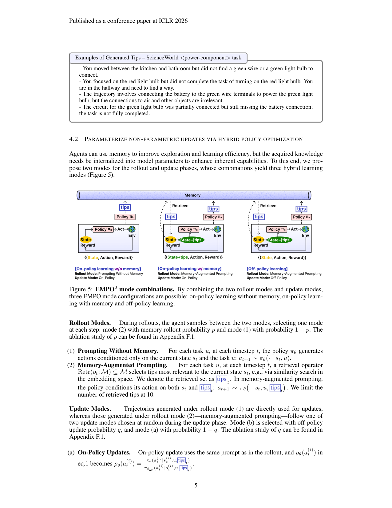
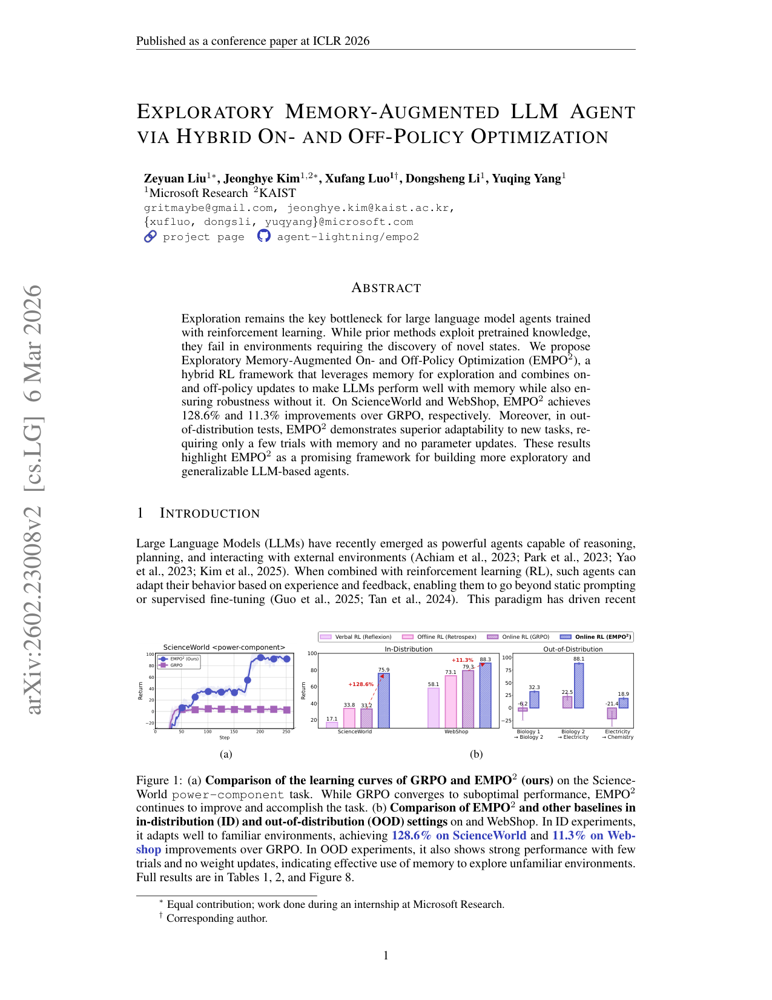

`empo2 | EMPO²: Exploratory Memory-Augmented On- and Off-Policy Optimization | Microsoft Research + KAIST(Zeyuan Liu, Jeonghye Kim 等;Agent-Lightning 谱系) | ICLR 2026(camera-ready);arXiv:2602.23008v2 [cs.LG] 2026-03-06 | 主题线 L?(在线RL+记忆驱动探索→参数内化)·相关性 High`

> deep 档笔记(由 light 升级:保留第一层/6轴/图/对标,补第二+三层)。基于已下载 PDF 正文(`resource/papers/empo2.pdf`,22 页)与渲染图。三标注:【原文】/【推断】/【待核】。

══ 第一层:一眼看懂 ══
- 🟦 **TL;DR**:LLM agent 用 RL 训练时最大瓶颈是"不会探索"——它只会复用预训练里学过的套路,在需要"先找到红灯泡再点亮"这种必须主动搜索新状态的环境里就卡死(GRPO 早早收敛到次优)。EMPO² 让 agent **自己写"反思 tips"存进一个外部记忆库**(像 Reflexion),下一次 rollout 时检索这些 tips 来指导探索;但它不止于此——它把"带 tips 探索出来的好轨迹"通过一种**奖励加权的知识蒸馏**回灌进模型参数,使得**推理时不再需要记忆也能表现好**。一套算法里混了三种更新模式:(1) 无记忆在线、(2) 带记忆在线、(3) 带记忆离线。ScienceWorld +128.6%、WebShop +11.3%(对 GRPO)。【原文 Abstract/Fig1】
- **最巧的一步**:**off-policy 更新模式 (b)**——把"带 tips 采样出的动作"的 log-prob 替换成"**同一策略不看 tips** 时给该动作的 log-prob"(\(ℓ_{\text{no-tips}} = \log π_θ(a|s,u)\)),再按优势加权更新。抽掉它,tips 的好处就只能停留在"推理时必须挂记忆",无法内化进参数→失去"脱离记忆也强"的核心卖点(也就垮回普通 Reflexion+GRPO)。这一步把"教师=挂tips策略、学生=裸策略"的**self-distillation** 显式化了。【原文 §4.2(b)】

══ 第二层:为什么做(写透,重点) ══
- **研究背景**:LLM agent 用 RL(GRPO/PPO 系)在交互环境里自我提升,是当前热点。但领域普遍发现:LLM agent **更擅长"利用"预训练里学过的套路,而非"探索"**——RL 框架本应平衡 explore/exploit,但 LLM-agent 系统大多只在熟悉分布内做有限搜索,一旦任务需要"发现新状态/主动获取新信息"就卡死。【原文 §1】
- **解决的具体痛点**:① **GRPO 早收敛**——§3/Fig3 的"打开红灯泡"案例点破:房间里根本没红灯泡,agent 必须先去别处找,但 GRPO 的 rollout 之间**只传一个 scalar reward、没有任何"为何失败/该换什么动作"的连续性**,于是 agent 一遍遍重复同一失败动作,分数停滞;② **纯记忆法(Reflexion/REMEMBERER)饱和快**——参数固定时靠静态策略采经验,无法捕捉持续提升所需的多样性,适应只是短期的(引 Zhang 2023 自己的结论);③ **warm-start SFT / 用 GPT-4 蒸馏 / 人工启发式** 都依赖外部支持,无支持时泛化差。【原文 §1/§3/§5】
- **相关工作 & 各自不足**(四条线并列):
  · **数据驱动/模仿学习**(Song'24, Qiao'24):靠收集 golden 轨迹,依赖外部数据;
  · **基于世界模型**(Tang'24 WorldCoder, Zhou'24 WALL-E):靠 GPT-4 写代码建模,依赖大闭源模型;
  · **非参数记忆**(Reflexion, REMEMBERER):证明"不更新参数也能提升",但参数固定→不能扩展内在知识、适应短期;
  · **RL for agent**(GRPO, Retrospex 离线 RL, GiGPO):Retrospex 靠大 logged 数据集 + IQL critic 重打分;GiGPO 靠"分组相似观测"做更细信用分配——都未解决"探索不足"这个根。EMPO² 自我定位:**把非参数记忆更新同时灌进 on- 和 off-policy 学习**,既补探索又把收益内化进参数。【原文 §5】
- **动机链**:现状=RL agent 探索差、纯记忆法饱和 → 缺陷=scalar reward 不传递"失败原因",参数固定的记忆法无法持续进化 → 既然 LLM 本身有"总结/反思"能力,**就让策略自己写反思 tips 当探索脚手架**(比 scalar reward 信息量大),先用 tips 把好轨迹采出来 → 但"推理时永远挂记忆"不够泛化 → **所以必须把 tips 的收益蒸馏回裸参数**(off-policy 模式),让推理时丢掉脚手架也强。为什么不用更简单的"Reflexion + 直接 SFT 好轨迹"?因为那是离线 context-distillation(Snell'22),丢了在线 RL 的适应性与优势加权的"只保留有利行为"的选择性。【原文 §4/§5"Learning by KD"段】
- **与最近邻工作的 Δ**:① 最近邻是 **Reflexion**——同样自生成 verbal tips,但 Reflexion 目标是"下一 trial 拿更高 reward(纯推理时用)",EMPO² 的目标是"tips 驱动的探索最终被参数化吸收";关键差异=**多一条 off-policy 蒸馏通道**把 tips 收益沉淀进参数(Δ=从"挂记忆才强"到"内化后裸模也强")。② 与 **context distillation(Snell'22)** 的 Δ:Snell 是离线 SFT 式蒸馏(teacher prompt→student prompt),EMPO² 把蒸馏**嵌进在线 RL**,用优势符号做选择性蒸馏(只蒸正优势)。③ 与 **GiGPO** 的 Δ:GiGPO 靠分组改进信用分配但仍是纯 on-policy 无记忆,EMPO² 在其上叠记忆+off-policy(WebShop 实现就直接 build on GiGPO 代码)。【原文 §4.2/§5】

══ 第三层:怎么做 + 靠不靠谱 ══
- **方法流水线**(Alg.1,输入任务 u → 输出内化后的裸策略 \(πθ\)):
  1. **Rollout 阶段二选一**:每步按概率 p 选"带记忆 prompting"(检索 \(≤10\) 条 tips 拼进 prompt),按 \(1−p\) 选"无记忆 prompting";
  2. **Episode 末写记忆**:episode 终止时,用当前 \(πθ\) + tip-generation prompt 对该轨迹生成反思 tip,append 进 buffer M(tips 由策略自己生,非外部教师);
  3. **Update 阶段对带记忆轨迹二选一**:按 q 选 off-policy、按 \(1−q\) 选 on-policy;
  4. **on-policy (a)**:用与 rollout 相同的带 tips prompt 算重要性比 \(ρθ\);
  5. **off-policy (b)**:把存的 log-prob 从"带 tips"换成"不带 tips"的 \(ℓ_{\text{no-tips}}=\log πθ(a|s,u)\),即"裸策略对该动作有多自然"来加权优势——这就是 reward-guided self-distillation;
  6. **稳定化**:对 \(πθ\) 下概率 \(<δ\) 的 token 屏蔽其优势项(Eq.2 的指示函数);可选 intrinsic reward(新状态 novelty,\(r=1/n\))维持策略熵。【原文 §4.1/§4.2/Alg.1】
- **逐组件必要性 + 消融**:
  · **off-policy 蒸馏 (b)**:核心。Fig9 消融"w/o Off-policy learning"在两个 ScienceWorld 任务上训练曲线明显变差→没它探索收益无法内化、收敛慢且终值低。【原文 §6.3 Fig9】
  · **on-policy with memory (a)**:Fig9 "w/o On-policy learning with memory"也变差→作者解释 on-policy 提供"稳定学习"、off-policy 提供"如有 tips 指引般的推理",二者**互补**(去任一都 suboptimal)。【原文 §6.3】
  · **低概率 token masking**:Fig6 直接证明——不 masking 时 return 曲线崩到 −100 区且梯度/熵/KL 会 NaN,masking 后稳定。必要(引 Yang'25 低概率 token 主导问题)。【原文 §4.2 Fig6】
  · **intrinsic reward**:Fig7 显示加它能维持策略熵(防过早收敛);属增强项,非主结果依赖。【原文 §4.2 Fig7】
  · **rollout 概率 p / off-policy 概率 q**:App F.1 消融——q 取极端值(0.3 或 0.95)都变差:q 太大过度强调蒸馏牺牲训练稳定,q 太小蒸馏不足。【原文 App F.1】
- **关键机制直觉**:off-policy (b) 的精髓——优势 A 已由"带 tips 采的轨迹"的真实环境 return 算出(好轨迹 A>0),但更新时却问"裸策略 \(πθ(a|s,u)\)(没看 tips)给这个动作多大概率",按 A 加权拉高/压低它。直觉=**"老师(挂 tips)示范了好动作,逼学生(裸策略)在不看小抄的情况下也学会给这个好动作高概率"**——正优势强化、负优势抑制,等价于选择性 KD。低概率 token masking 的直觉:重要性比 \(πθ/πθ_{old}\) 在 token 概率极小时分母趋零→比值爆炸→梯度爆;直接屏蔽这些 token 的贡献。【原文 §4.2】
- **实验与证据**:数据集 **ScienceWorld(19 任务,前 5 变体训、20 未见变体测)+ WebShop**,基模 **Qwen2.5-7B-Instruct**,评测的是**去掉记忆后裸模**的表现。核心证据:① Table1 ScienceWorld 平均 return 33.2(GRPO)→75.9(EMPO²),+128.6%,7 个原本负分任务冲到满分 100;② Table2 WebShop score 79.3(GRPO)/86.2(GiGPO w/o std)→88.3(EMPO²),成功率 66.1→76.9;③ Fig1(a) 学习曲线 GRPO 早平台、EMPO² 持续爬升——直接对应"探索更充分"主张;④ Fig8 OOD 三场景"step0 无记忆即比 GRPO 强,加记忆 10 步内 +136%"——对应"内化后可迁移"。**baseline 公平性**:作者把 Retrospex 基模统一成 Qwen2.5-7B 并去掉其人工启发式(原版用 Flan-T5-770M + 人工 heuristic),WebShop 与 GRPO/EMPO² 同超参、Naive/Reflexion/GRPO/GiGPO 分数直接取自 GiGPO 原文——较公平。**潜在水分**:Fig8 OOD 作者自承"preliminary"(只 3 场景、波动大)。【原文 §6.1/§6.2/Table1/2/Fig1/8】
- **假设与失效边界**:【原文】§4.1 明确依赖"基模已具备 summarization/reflection 能力"才能自生成有用 tips。【推断】① 基模太弱→tips 噪声大→蒸馏信号失真;② 环境无法用语言反思刻画(纯连续控制)→tips 机制失效;③ off-policy 本身易塌(Fig6),masking 阈值 δ 是隐式超参,跨任务是否稳健未充分验证;④ 只在 Qwen2.5-7B 单模型、两个文本 embodied 环境验证,泛化到 math/code/多模态是 future work(作者自陈)。
- **祛魅总结**:【推断】**真贡献(硬货)**:把"非参数记忆探索 → off-policy 优势加权 self-distillation 内化进裸参数"做成一个统一在线 RL 算法,并配 low-prob masking 让 off-policy 不崩——这是"探索-巩固"范式一个干净、可复现(verl 实现+开源)的工程化样板,+128.6% 的 ScienceWorld 增益是真大。**包装/可质疑**:① "off-policy 即 reward-guided KD"的解释更像事后诠释(本质是把 IS ratio 的分子分母都用同一 \(πθ\) 在两种 prompt 下重算,数学上是一种带偏的重要性采样,作者也承认需 masking 才稳);② OOD few-shot 结果作者已标 preliminary,不宜过度解读;③ 记忆 buffer 无遗忘/去冗机制,长跑下检索质量/成本是被回避的问题(Conclusion 仅提"更高级检索"为 future)。整体诚实度较高,未明显高估。

══ 第二层/第三层结束;以下为原 light 档保留内容 ══

🎯 **机制速览 6 轴** [light]
| 维度 | 内容 |
|---|---|
| **学什么信号** | 环境 reward(scalar)+ **策略自生成的反思 tips**(自反思,非外部教师);可选 intrinsic reward 促探索(Fig7/Fig11)【原文】 |
| **改什么** | **参数**(GRPO 策略梯度,verl 实现)+ **外部记忆**(tip buffer M,检索 top-10)——双更新【原文 §4】 |
| **何时改** | 训练期在线:rollout→episode 结束写 tip→update;参数 per-batch 更新,记忆 per-episode 写入。**推理时不再需要记忆/不更新参数**(已内化)【原文 §4.1/Fig8】 |
| **免梯度?** | **混合**——记忆侧免梯度(写/检索 tip),参数侧需梯度(GRPO + 含 off-policy 重要性采样)【原文】 |
| **记忆-技能生命周期** | 写入:episode 末由 \(π_θ\) 生成 tip 入 M;检索:嵌入相似度取 \(≤10\) 条;**淘汰/共享:原文未明确说明遗忘策略**(buffer 持续累积)【原文/待核】 |
| **防遗忘机制** | 训练稳定性侧:**低概率 token masking**(\(\text{prob}<δ\) 屏蔽优势项,防 off-policy 梯度爆炸/NaN)+ KL 正则向 \(π_{ref}\);无显式持续学习抗遗忘组件(本文非 CL 设定)【原文 §4.2 Fig6】 |

🖼 **关键图 top-2** [light]

这是**原文 Figure 5**:两种 rollout 模式(无记忆 / 带记忆)× 两种 update 模式(on-policy 保留 tips / off-policy 去掉 tips)组合出三种学习模式。选它因为这是全方法的"咬合图"——一眼看清"记忆如何 scaffold 探索、又如何被蒸馏回参数",正是论文最巧那一步的可视化。【原文图5】

这是**原文 Figure 1**:(a) ScienceWorld 学习曲线 GRPO 早收敛、EMPO² 持续爬升;(b) ID 下对 GRPO +128.6%/+11.3%,OOD 下"几次试错+无权重更新"即强。选它因为它同时证明了"探索更充分"(曲线)与"内化后可泛化迁移"(OOD)两个核心主张。【原文图1】

══ 假设与失效边界(一句)══
- 【推断】核心假设是"基模型已具备可靠的总结/反思能力来自生成有用 tips"(§4.1 明说依赖预训练的 summarization/reflection 能力);若基模太弱(tips 噪声大)或环境无法用语言反思刻画,蒸馏信号失真、off-policy 易塌(原文已观察到需 masking 才不 NaN),方法收益预计大幅缩水——依据:§4.1 的能力前提 + §4.2 Fig6 的不稳定现象。

🎯 **对"探索-巩固"idea 对标**(一句)[light]
- **强支撑 + 可借组件**:这正是"探索(非参数记忆/tips scaffold)→ 巩固(蒸馏回参数,推理时丢掉脚手架)"范式的近邻样板;其 **off-policy "去 tips 重算 log-prob = reward 加权 self-distillation"** 可直接迁移到本项目"教师脚手架推理蒸馏(TSRD)"——把 MTP/教师提示当 rollout 期脚手架、用同款重要性采样把好处沉淀进裸策略,且其 **low-prob token masking** 是稳定此类 forward-硬/backward-软式混合更新的现成积木。

⑦ **开源代码 + 框架**:项目页/仓 **agent-lightning/empo2**(微软 Agent-Lightning 项目下,GitHub: github.com/microsoft/agent-lightning 系列;论文首页标注 "project page agent-lightning/empo2")【原文 p1】。**框架:verl**(Sheng et al. 2024;EMPO² 实现明示 "based on verl");baseline 侧用 **LLaMA-Factory** 做 SFT(Retrospex)。〔待核:具体子仓路径/可达性需 clone 核验,本 light 档未 clone〕
💰 资源/成本:基模 Qwen2.5-7B-Instruct;Fig12/Fig13 给出"每步 rollout 各组件耗时分解"与 time-performance 曲线(带记忆有额外反思/检索开销)【原文 p22】;具体 GPU 数原文未在正文显著标注〔待核〕。
🔭 开放问题:【原文】把非参数记忆的收益更彻底地编码进参数、减少对外部记忆的依赖(作者明确视此为通向更泛化智能的方向);【推断】tip 库的遗忘/去冗与规模膨胀控制本文未解,长跑下检索质量与成本是隐忧。
