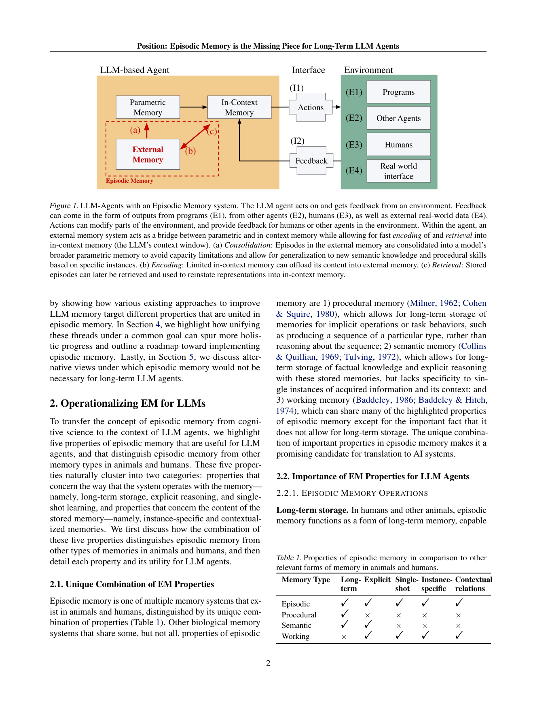
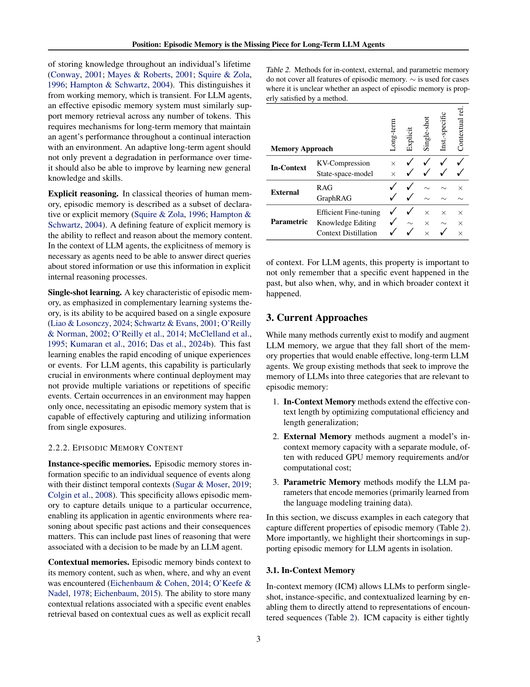

`episodic_position | Position: Episodic Memory is the Missing Piece for Long-Term LLM Agents | Max Planck Institute for Software Systems(Mariya Toneva 组) · UT Austin · EarthDynamics.ai | 2025-02·arXiv v1(2502.06975, cs.AI)·Position Paper(under review，ICML 2025 投稿格式) | 主题线 L?（理论/立场：用情景记忆 + CLS 快慢学习统一长期 agent 记忆）· 相关性 High（对"探索-巩固"提供理论骨架）`

> 三标注约定：【原文】= 论文明说；【推断】= 我的有据判断(附依据)；【待核】= 拿不准的关键事实。

══ 第一层：一眼看懂 [light] ══

- 🟦 **TL;DR**:这是一篇**立场/路线图论文(position paper),不含新方法、不含实验、不含代码**。核心主张:LLM 正从"文本补全工具"变成"在动态环境里长期行动的 agent",但要支撑"几十年、4000 万行代码的 Linux 维护"那种长期任务,需要"**每来一个新 token 计算成本恒定 + 性能随时间稳定或变好**"——现有方法都做不到。作者借鉴生物学的**情景记忆(episodic memory, EM)**:一种支持"单次曝光就能学(single-shot)"的记忆系统。论文把 EM 操作化为**五条关键属性**——①长期存储 ②显式推理 ③单次学习 ④实例特定(instance-specific)⑤上下文绑定(when/where/why/whom);并指出现有三类方法(**In-Context 记忆 / External 外部记忆 / Parametric 参数记忆**)各只覆盖五属性的一部分(Table 2),彼此割裂。论文主张**以"情景记忆"作为统一框架**,把三类方法整合起来,并基于**互补学习系统理论(CLS)**——情景记忆是"快学习系统",随时间**巩固(consolidate)进"慢学习"的参数记忆**——给出一张总架构图(Fig 1)+ 四大研究方向(编码/检索/巩固/基准)+ 六个研究问题(RQ)的路线图。【原文 Abstract/§1/§2/§4】
- **最巧的一步(对一篇 position 而言=最核心的统一视角)**:**把"长期 agent 记忆"这个碎片化问题,用"情景记忆五属性 + CLS 快慢双系统"重新框定为一个统一目标**(§4)。关键洞察是 Fig 1 那三个箭头:**(a) Consolidation 外部记忆→参数记忆(快学→慢学,获得泛化与恒定成本)、(b) Encoding 上下文→外部记忆、(c) Retrieval 外部记忆→上下文**。抽掉"五属性必须被同一个系统联合满足"这一论点,文章就退回成"又一篇记忆方法综述";正是"用 EM 的独特属性组合(Table 1:唯有 EM 同时具备长期+显式+单次+实例特定+上下文,procedural/semantic/working 各缺一些)当筛子"使它能论证"现有方法都不够、需要统一"。【原文§2.1 Table 1 / §4 Fig 1】

══ 第二层：为什么做（写透，重点） ══

> 注：本文是 **position/roadmap 论文，无新方法、无实验、无代码**。以下"为什么做"= 它**论证"为什么该把情景记忆当统一目标"的逻辑链**(而非某个方法的 motivation)。

- **研究背景**：LLM 正从"文本补全引擎"演化为**能在复杂动态环境里采取有意义行动的 agent**(自主科研助手、个性化客服、交互式辅导等)。要在长时间尺度的动态交互里运作，agent 不只要记住"发生了什么"，还要记住 **when/how/why/whom**——这种"事件 + 动机 + 结果"的丰富痕迹是上下文敏感行为的基础(§1)。本文站在"**长期 agent 记忆的统一理论框架**"这条线，借认知科学的**情景记忆(episodic memory, EM)**与**互补学习系统理论(CLS)**重新框定问题。【原文§1】
- **解决的具体痛点(本文要论证的核心缺口)**：现有方法**没有一个能"在长时间尺度上、以恒定每-token 成本、不降性能地维持相关的上下文化信息"**(§1 原文明列两条核心刚需：**constant computational cost per new token** + **stable or improving performance over time**)。用一个极端例子点明痛点(§1)：一个要长期协助维护 **Linux(跨数十年、4000 万行代码、海量历史 issue/comment/feature request)** 的 agent，必须持续整合并推理一个巨大且不断演化的历史上下文——现有任何单一方法都撑不住。**更具体的痛点**(§3 + Table 2)：三类现有记忆方法**各自只覆盖 EM 五属性的一部分、且彼此割裂**——In-Context(KV 压缩/SSM)缺"长期存储"(×Long-term)、External(RAG/GraphRAG)缺"上下文关系/实例特异性"(×Contextual、∼Inst.-specific)、Parametric(高效微调/知识编辑/上下文蒸馏)缺"单次学习 + 实例特异 + 上下文"(×Single-shot、×/∼Inst.-specific、×Contextual)。
- **相关工作 & 各自不足**(§2.1 + §3，本文的"相关工作"就是它的核心论据)：**①生物记忆类型对比(Table 1)**——EM 独特之处是**同时具备 长期+显式+单次+实例特异+上下文 五属性**；Procedural(只长期、隐式)、Semantic(长期+显式但无单次/实例特异/上下文)、Working(有显式/单次/实例特异/上下文但**不长期**)各缺若干。**②三类 LLM 记忆方法的短板(Table 2)**：(a) **In-Context**(扩窗/稀疏化/量化/分页缓存/SSM/线性注意力)——支持单次、实例特异、上下文，但**KV cache 随历史无限增长不可持续，或 SSM 等恒定成本却难处理持续扩张的历史，且 KV 优化丢弃旧上下文会造成不可逆信息丢失**；(b) **External**(slot-based 记忆、分布式记忆、RAG/GraphRAG、存历史 IO/CoT/三元组)——有长期+显式，但**普遍缺"记忆间关系 + 获取时的上下文细节"、很少评测单次学习、且几乎没人做"从实例泛化并回写参数记忆"(Fig 1a)**；(c) **Parametric**(LoRA 等高效微调、ROME/MEMIT/MELO/WISE 知识编辑、上下文蒸馏)——有长期+(部分)显式，**模仿了"单次学习+长期保留"，但微调需数据集→无单次学习能力、知识编辑作用于"无上下文的事实"→无法上下文化、且 sequential editing 会灾难遗忘/缺泛化**。结论(§3)：**孤立来看，没有任何一类方法能支撑长期 agent。**
- **动机链(论证链)**：现状(扩窗/外部记忆/参数更新各有进展)→ 缺陷(三类方法只覆盖 EM 五属性的子集、割裂、无法既恒定成本又不降性能地长期保留上下文)→ 为什么不用更简单的现成做法？(§5 直接反驳三种"无需 EM"的替代观点)：**(i) "扩 in-context 就够"**——"无限上下文"需预知相关信息的最大时间跨度，超长跨度要么**算力爆炸、要么压缩丢关键细节**；**(ii) "上下文化的外部记忆(KG/RAG)就够"**——纯外部记忆**仍有高存储成本、需遗忘机制**，且缺丰富上下文关系；**(iii) 二者都不能让 agent 随时间慢慢变好**→ 所以必须用 **EM 框架**：把三类记忆统一起来，**周期性把外部记忆巩固进高容量参数记忆(Fig 1 arrow a)**，既防外部记忆溢出、又让 agent"在遗忘之前从过去学习、慢慢改进"。底层理论依据=**CLS：EM 是快学习系统(存单次实例)，随时间巩固进慢学习系统(存稳定耐久知识)**(§4)。【原文§3-§5】
- **与最近邻工作的 Δ**：**最近邻是已有的"长期 agent 记忆综述/单类记忆增强方法"**(扩窗、RAG、知识编辑各条线)。Δ 在一个关键点：本文**不提出新方法，而是用"EM 五属性 + CLS 快慢双系统"当统一筛子**，论证"现有方法都只覆盖部分属性、必须被同一个系统联合满足"，并把**"巩固进参数(external→parametric, arrow a)"明确列为现有工作普遍缺失、却最关键的一环**(§3 反复强调"lack of proposals to generalize information from these instances and update parametric memory")。这差异有用：它把碎片化的记忆研究**重新组织成一张有明确缺口(consolidation)和路线图(4 方向/6 RQ)的统一蓝图**，为"长期自进化 agent"提供了 design checklist 和研究议程，而非又一个增量方法。【推断，依据§3 对各方法短板的定位 + §4 统一框架】

══ 第三层：怎么做 + 靠不靠谱 ══

> 注：position 论文无"方法流水线/消融/实验数字"。本层按规范精神改写为：**它倡议的目标架构如何咬合 + 论证结构 + 证据基础(它有/没有什么) + 失效边界 + 祛魅**，并显式标注"无实证"。

- **倡议的目标架构(§4 Fig 1，不是已实现的 pipeline，而是路线图蓝图)**：Agent 内三类记忆通过三条路径协同——**(b) Encoding 编码**：有限的 in-context 记忆把内容卸载进 external(情景)记忆；**(c) Retrieval 检索**：存储的情景被取回、重新注入 in-context 记忆；**(a) Consolidation 巩固(核心缺口)**：external 记忆里的情景被**巩固进模型的参数记忆**，以避开容量上限、获得对新语义知识/程序技能的泛化。环境提供四类反馈源：E1 程序输出 / E2 其他 agent / E3 人类 / E4 真实世界数据。**整套的"输入→输出"**=环境反馈 → 单次编码进外部记忆 → 按需检索回上下文 → 周期性巩固进参数 → 行动改变环境并反馈，闭环。【原文§4 Fig 1】
- **逐组件(此处=四研究方向 + 六 RQ)的必要性与"是否已解决"**(§4，全部是 open 问题，无证明)：**①Encoding(RQ1 如何把 in-context 信息存进长期外部库 / RQ2 如何把连续输入切成离散情景、何时存)**——必要(arrow b)；现状：LLM 已能像人一样把文本切成有意义事件、按"模型 surprise"捆绑相关段可改善长期建模(引 Behrouz/Fountas 2024)，但**何时/如何切段仍 open**；**②Retrieval(RQ3 如何选相关情景重注入上下文做显式推理 / RQ4 如何用长上下文能力加速外部记忆检索优化)**——必要(arrow c)；候选机制=RAG 式前置 token / memory token / 改内部表示，但**未定论**；**③Consolidation(RQ5 如何周期性把外部记忆巩固进基座参数而不遗忘旧知识)**——**全文最核心、也最未解的一环(arrow a)**；候选=上下文蒸馏 / 参数知识编辑 / 局部化微调；**open 问题：何时巩固、如何把众多情景实例压成更抽象的参数知识、同时保留旧知识与技能**；**④Benchmarks(RQ6 需要什么新基准评测 EM)**——必要；倡议测"长延迟后对上下文化事件的回忆(when/where/how)"、实例特异的时序记忆(引 Pink 2024)、以及"任务性能随经验编码/检索/巩固而提升"。**关键事实**：这六个 RQ **全是"呼吁去研究"，本文不提供任何一个的解法或实验**——这是 position 论文的本分，但也意味着**所有机制主张都未被验证**。【原文§4.1-4.4】
- **关键机制/论点的直觉**：**①五属性当"筛子"(Table 1)**——直觉：用 EM"唯一同时具备五属性"这一独特组合，去逐一检验现有方法缺哪条属性(Table 2)，从而论证"都不够、需统一"；这是全文论证的**逻辑支点**(抽掉它，文章就退回成普通综述)。**②CLS 快慢双系统**——直觉：快系统(情景记忆)负责"一次就记住具体实例"，慢系统(参数记忆)负责"把反复出现的规律沉淀成稳定泛化知识"；二者通过"巩固"衔接，既能即时适应、又能长期泛化且成本恒定——这正是"恒定每-token 成本 + 性能不降反升"两条刚需的生物学解。**③arrow (a) Consolidation 是文眼**——直觉：只检索(arrow c)外部记忆，库会无限膨胀且每次都要显式检索；把高频经验巩固进参数后，**无需检索即可用、且容量不爆**，这是区别于"纯外部记忆"路线的关键主张。【原文§2.1/§4】
- **"实验与证据"(position 论文=它的证据基础是什么)**：**本文无任何实验/数据集/数字**。它的"证据"全是**文献综合 + 认知科学类比**：(a) **Table 1**(EM vs procedural/semantic/working 的五属性对比)——来自认知科学经典文献，是定性断言；(b) **Table 2**(三类 LLM 记忆方法对五属性的覆盖矩阵，用 ✓/×/∼)——是作者对现有工作的**主观归类判断**(∼表示"不清楚是否满足")，**非实测**；(c) 大量引用(扩窗/RAG/知识编辑/上下文蒸馏)用于支撑"各方法各缺一块"的论断。**"看着强但没回答核心问题"的点**：① **核心主张"EM 能统一并解决长期 agent 问题"完全没有实证**——没有任何一个原型系统证明"五属性联合满足 + 巩固进参数"真能带来"恒定成本 + 性能提升"；② Table 2 的 ✓/×/∼ 判定**带主观性**(尤其 ∼ 大量出现)，可被质疑;③ 它**没有回答自己提出的 RQ5(如何巩固又不遗忘)**——而这恰是整个框架成立的关键技术前提，被留作 open 问题。【原文 Table 1/2 + §4 全为 open RQ】
- **假设与失效边界**：**①【原文§5 自承的反方观点即其失效边界】**——若"扩 in-context 就够"或"上下文化外部记忆就够"成立，则 EM 框架非必需；作者的反驳(无限上下文需预知时间跨度/外部记忆仍有存储与遗忘成本)是**论证性的、非实证的**，故"EM 必要性"本身是一个**有争议的立场**而非已证结论；**②【推断】CLS 类比的可迁移性是隐含假设**——把生物海马-皮层快慢系统直接映射到"外部库→参数"未必成立(神经网络的"巩固"机制与生物巩固是否同构，无定论)；**③【原文§4.3 明列】RQ5 的灾难性遗忘是未解前提**——"如何巩固进参数而不遗忘旧知识"被列为 open，意味着**整个框架的可行性悬于一个尚未解决的技术难题**；**④【推断】五属性"必须由同一系统联合满足"是规范性主张**——也可能"分而治之(不同子系统各管一部分)"就够，本文未排除这种可能(只论证了现有方法割裂的弊端，未证明"必须统一在一个 EM 系统里")。
- **祛魅总结**：**真贡献(硬货)**——【推断】① **把碎片化的"长期 agent 记忆"研究，用"EM 五属性 + CLS 快慢双系统"这一清晰、可操作的框架重新组织**，给出 design checklist(五属性) + 研究议程(4 方向/6 RQ)，**论证质量高、文献梳理扎实**(Table 2 的覆盖矩阵是有用的速查表)；② **明确点出"巩固进参数(arrow a)"是现有工作普遍缺失、却对'恒定成本+性能提升'最关键的一环**——这个"缺口诊断"本身有价值，直接对应"探索-巩固"中"巩固进权重"那步；③ 把"灾难性遗忘"作为核心挑战(RQ5)显式提出。**包装/营销成分(position 论文的固有局限)**——【推断】① 标题"**Episodic Memory is the Missing Piece**"是**强断言但零实证**——它论证的是"现有方法各缺一块、EM 能当统一视角"，**远未证明 EM 真是"那块拼图"或真能解决问题**；② **CLS/EM 的生物学类比是修辞性框架**——给"把经验巩固进参数"穿了认知科学外衣，但**是否真能照搬生物机制完全未验证**；③ Table 2 的属性覆盖判定带主观性(大量 ∼)，结论的"客观性"有保留；④ 全文最关键的技术前提(RQ5 巩固不遗忘)**被自己留作 open**，即"地基"未夯实。**定位**：作为 position 论文，它的价值在**论证 motivation 的权威引用 + 统一框架/checklist**，而非可验证的结论或可借的技术积木；读者应把它当"研究议程与缺口诊断"，而非"已被支持的科学发现"。作者对"框架的组织价值"估计准确，对"EM 必要性"这一立场则**不可避免地高估了确定性**(立场论文的本质如此)。【推断，依据§5 反方观点 + §4 全为 open RQ + 标题断言 vs 零实证】

══ 结构化抽取 ══

- 🎯 **机制速览 6 轴** [light]（注:本文是 position/roadmap,以下为它**倡议的目标框架**而非已实现机制；【推断】标注依据 §4 路线图）：

| 学什么信号 | 改什么 | 何时改 | 免梯度? | 记忆-技能生命周期 | 防遗忘机制 |
|---|---|---|---|---|---|
| **环境反馈 + 单次经验**(程序输出 E1 / 其他 agent E2 / 人类 E3 / 真实世界数据 E4;倡议"single-shot 即学",信号类型不限)【原文 Fig1】 | **倡议三者协同改**:in-context 记忆(上下文窗口)+ external 记忆(情景库)+ **parametric 记忆(参数,经巩固更新)**——这是 position 的核心:**不止改外部记忆,要把经验巩固进权重**【原文§4】 | **倡议混合**:在线 single-shot 编码(快系统)+ **周期性离线巩固进参数(慢系统)**(RQ5:何时巩固/如何不灾难遗忘)【原文§4.3】 | **混合(倡议)**:external/in-context 部分免梯度;**parametric consolidation 部分需要梯度/参数更新**(提到 context distillation、efficient fine-tuning、knowledge editing 作候选)——故整体非纯免梯度【推断,依据 §3.3 + §4.3 把 parametric 列为必需一环】 | 倡议完整生命周期:编码(in-context→external,arrow b)→检索(external→in-context,arrow c)→**巩固(external→parametric,arrow a)**→(隐含淘汰:容量约束下需取舍);共享=多 agent 环境(E2)隐含,但非重点 | **明确点名灾难性遗忘为核心挑战(RQ5)**:倡议借 CLS 的"慢学习巩固"思路缓解;具体机制未定(留作 open RQ);本文**不提供**几何共识/merging/KL 投影等具体方案——是"呼吁去研究"而非"已解决" |

- ⑦ **开源代码 + 框架/harness**：**无代码(N/A)**——【原文】这是一篇 position/roadmap 论文,**不含实现、不含实验**,全文(14 页)扫描**无 GitHub / 无任何代码或数据链接**。框架/harness:**不适用**(无系统实现)。〔本子代理仅深读抽取;position 论文本无代码可 clone,符合预期〕

- 🎯 **对"探索-巩固"idea 对标** [light]：**最强支撑(理论骨架级)**。这篇几乎是本项目"探索-巩固"思想的**理论母本**:① 它把 **CLS 快慢双系统(快学习的情景记忆 → 巩固进慢学习的参数记忆)**明确立为长期 agent 的统一目标——正对应"探索(快速试)→巩固(沉淀进策略权重)";② Fig 1 的 **arrow (a) Consolidation:external→parametric** 就是本项目"把探测/经验巩固进模型参数"那一步的高层蓝图;③ **RQ5"何时巩固、如何巩固又不灾难遗忘"** 直接是本项目要解决的核心技术问题;④ **五属性(尤其 single-shot 单次学 + instance-specific 实例特定)**为"前瞻探测(MTP)得到的单次关键经验如何被快速编码、保留其具体上下文"提供了属性清单。缺口/定位:它**只给路线图不给方法**(无算法、无实验、无代码)——所以对本项目的价值是**论证 motivation 的权威引用 + 设计 checklist(五属性 + 四方向 + 六 RQ)**,而非可借的具体技术积木。竞品=无(立场论文,非方法竞品)。

- 🖼 **关键图 top-2** [light]：

· 这是**原文 Figure 1**(全文唯一图,也是统一框架主图)。Agent 内三类记忆:**Parametric Memory ↔ In-Context Memory ↔ External(Episodic) Memory**,三条关键路径——**(a) Consolidation 外部→参数**(把情景巩固进参数记忆,获泛化 + 避免容量上限)、**(b) Encoding 上下文→外部**(把上下文卸载进外部库)、**(c) Retrieval 外部→上下文**(取回情景重置进上下文);右侧 Environment 给出四类反馈源(E1 程序 / E2 其他 agent / E3 人类 / E4 真实世界)。选它因为它一图凝练全文统一主张,且 **arrow (a) 正是"探索-巩固"中"巩固进权重"那步的最简蓝图**,对本项目 motivation 最有引用价值。

· 这是**原文 Table 2 所在页**(核心论证表,渲染整页呈现)。矩阵列出 In-Context(KV-Compression / SSM)、External(RAG / GraphRAG)、Parametric(Efficient Fine-tuning / Knowledge Editing / Context Distillation)各方法对五属性(长期/显式/单次/实例特定/上下文)的覆盖(✓/×/∼)。选它因为它是全文论点的"证据核心":直观显示**没有任何单类方法同时满足五属性**(如 RAG 长期✓但上下文关系×、Fine-tuning 长期✓但单次×实例特定×),从而坐实"需要以情景记忆统一三者"的立场。(注:同页底部另含 Table 1 EM vs procedural/semantic/working 的属性对比,亦为关键论据。)
