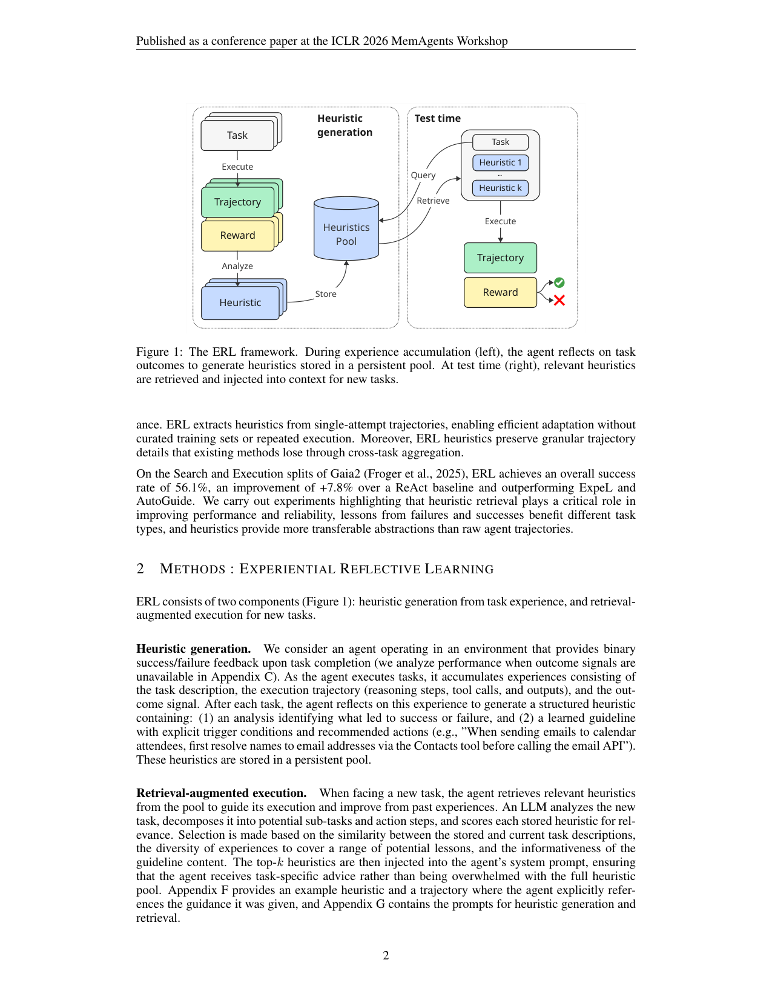
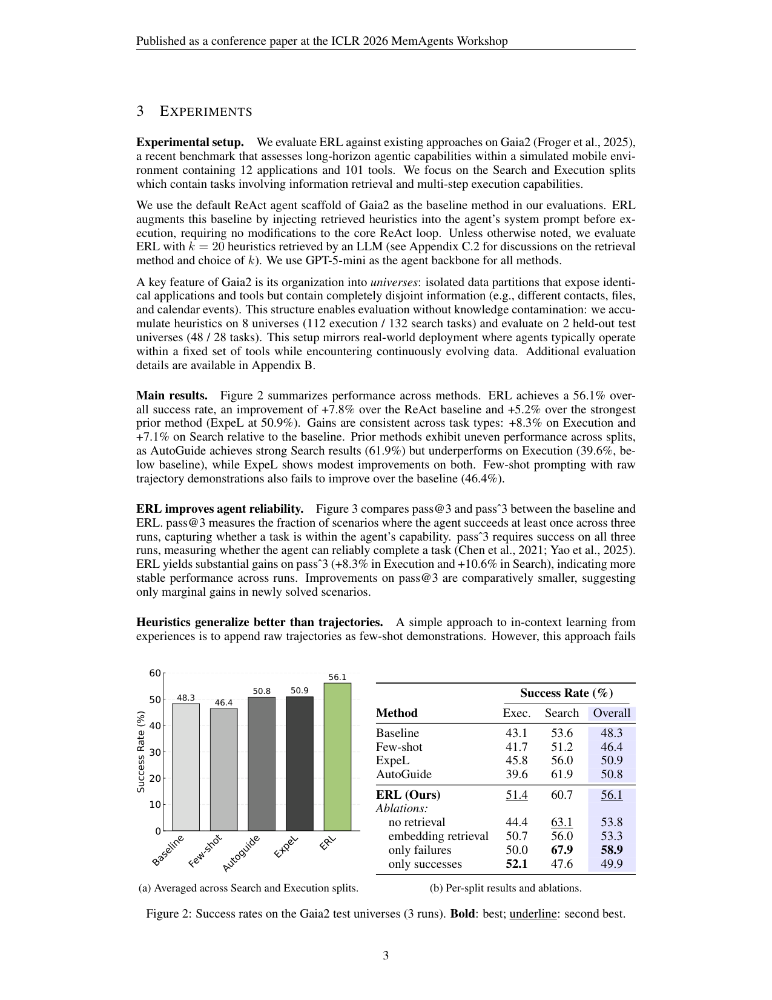

`erl | Experiential Reflective Learning for Self-Improving LLM Agents | Illuin Technology（France；与 CentraleSupélec MICS 联合 LIAGORA LabCom；Allard, Teinturier, Xing, Viaud） | 2026-03（arXiv v2, 2603.24639, cs.LG；ICLR 2026 MemAgents Workshop 论文） | 主题线 L1 经验复用·反思蒸馏 + L2 启发式记忆·相关性 High`

> 三标注：【原文】=论文直述；【推断】=本人有据判断（附依据）；【待核】=拿不准关键事实。
> 核验：基于真实下载 PDF 正文（pdftotext -layout 全文 14 页，含正文 §1–4 + 附录 A–G 全部 prompt/示例/算法）；非 WebFetch 摘要。

══ 第一层：一眼看懂 [light] ══

- 🟦 **TL;DR**：让 LLM Agent 在新环境里"越用越熟"，但**不微调权重、也不靠多次重试**。做法极简两步：① **反思生成启发式（heuristic）**——每做完一个任务（拿到成功/失败的二值反馈），让 agent 对自己的轨迹做"事后复盘"，产出一条带【触发条件 + 推荐动作】的结构化经验（如"给日历参会者发邮件前，先用 Contacts 工具把人名解析成邮箱再调 email API"），存进一个持久 heuristic 池；② **检索增强执行**——遇到新任务时，让 LLM 给池里每条启发式按相关性打分、取 **top-k 注入 system prompt** 指导执行。在 Gaia2 长程 agent 基准上，比 ReAct 基线 **+7.8%（56.1% vs 48.3%）**，且**主要提升的是"可靠性"（pass^3）**而非新解出的任务。【原文 Abstract/§2/§3】

- **最巧的一步**：**从"单次尝试(single-attempt)"轨迹就提炼可迁移启发式**（§2 Heuristic generation + §1）。抽掉这一步（即退回 ExpeL/AutoGuide 那种"每个任务要反复重试 rollout 凑成功/失败对比对"），方法在真实部署里就不可用——因为现实中任务往往**不能重试**。为什么是它：这正是 ERL 相对最近邻方法的**唯一关键差异**——把"学习"从"需要多次 rollout 的对比学习"降到"一次执行 + 一次反思"，使经验积累**廉价、可持续、贴合真实部署**。【原文 §1 末段对比 ExpeL/AutoGuide "require multiple rollouts per task...breaks down in practical deployment"】

══ 第二层：为什么做（写透） ══

- **研究背景**：LLM agent 大量用于多步规划/推理/工具调用，但**换到带陌生工具与领域惯例的新环境就抓瞎**，且每个新任务都"从零开始"、不利用过往经验。微调能适配但**贵、闭源模型不可行、不支持持续学习**，于是转向**无参数更新的经验记忆系统**。【原文 §1】
- **解决的具体痛点**：
  - **ExpeL（Zhao 2024）**：用 Reflexion 反复重试每个任务直到成功来对比成败、抽 insight，但**把所有 insight 不分相关性地拼进每个测试 prompt**——随经验累积**扩展性差**（prompt 越来越长）。【原文 §1】
  - **AutoGuide（Fu 2024）**：离线对比成败轨迹造 context-aware guideline，但**每个 agent turn 都做 context 识别 + guideline 检索**（开销大），且当前状态匹配不上任何 stored context 时**没指导可给**。【原文 §1】
  - **两者共同硬伤**：都**要求每任务多次 rollout** 来构造对比轨迹对——这在"任务不能重试"的真实部署中**直接失效**。【原文 §1】
  - **few-shot 原始轨迹**：直接把原始轨迹当 few-shot demo，**反而掉点(-1.9%)**——原始轨迹缺乏可操作的提炼洞见、且吃 context。【原文 §3】
- **相关工作 & 各自不足**：摆在"无参数经验学习/记忆"这条线旁——ExpeL（全量拼接）、AutoGuide（每 turn 检索+无兜底）、Reflexion（口头 RL 但需重试）、ReasoningBank/Memp/Flex（同期自进化记忆）。它们差在：要么**不做选择性检索**（全塞），要么**检索粒度/开销不当**，要么**依赖重试**，要么**跨任务聚合丢失轨迹细节**。【原文 §1/§3】
- **动机链**：要在新环境自我改进 → 微调贵且闭源不可行 → 转无参数经验记忆 → 但现有经验法要么全量拼接(不扩展)、要么每 turn 检索(开销大)、要么依赖重试(不现实) → 所以需要**①从单次尝试就能提炼经验 + ②任务级选择性检索（而非全量/每 turn）+ ③保留轨迹细节的"启发式"抽象**。为什么不用更简单做法：实验证明 **few-shot 原始轨迹无效（-1.9%）、全量塞启发式非单调（40-60 条达峰后下滑）、embedding 检索弱于 LLM 检索**——三个朴素替代都被否掉，正当化了"反思成启发式 + LLM 选择性检索"。【原文 §1/§3/§4 Fig4】
- **与最近邻工作的 Δ**：
  - vs **ExpeL**（最像）：ExpeL 要 Reflexion 重试 + 全量拼 insight；ERL **单次尝试反思 + top-k 选择性检索**。差异关键点=去掉重试依赖 + 加选择性检索。结果 ERL 56.1% > ExpeL 50.9%。【原文 §1/§3】
  - vs **AutoGuide**：AutoGuide 每 turn 检索且无兜底；ERL **任务级一次性检索**（注入 system prompt，不改 ReAct 循环），开销低且总有指导。AutoGuide 在 Search 强(61.9%)但 Execution 崩(39.6%<基线)，ERL 两 split 都涨。【原文 §3】
  - vs **few-shot 原始轨迹**：ERL 用**蒸馏后的启发式**而非原始轨迹——"启发式比原始轨迹更可迁移"是论文核心实证之一（控 token 预算后仍胜，Search +23.8%@40 scenarios）。【原文 §3/附录 C.1】

══ 第三层：怎么做 + 靠不靠谱 ══

- **方法流水线（§2 + Figure 1，两组件）**：
  1. **经验积累（左）**：agent 在提供**二值成功/失败反馈**的环境执行任务 → 累积 (任务描述, 执行轨迹[推理+工具调用+输出], 结果信号)。【原文 §2】
  2. **反思生成启发式**：每任务后做"Post-Mortem 分析"，产出结构化 heuristic = **(1) Analysis（定位成功/失败的 breakpoint/winning-move）+ (2) Learned Guideline（显式 Trigger 触发条件 + Action 推荐动作）**，存进**持久 heuristic 池**。生成 prompt 见附录 Fig8（失败→定位断点+导出纠错规则；成功→识别制胜招+导出最佳实践）。【原文 §2 + 附录 G Fig8】
  3. **检索（test time，右）**：新任务来 → LLM **把任务分解成子任务/动作步** → 对池中每条启发式按 **(a)任务描述相似度 +(b)经验多样性 +(c)guideline 信息量** 打分（0-100）→ 取 **top-k（默认 k=20）**。【原文 §2 + 附录 G Fig9】
  4. **增强执行**：top-k 启发式注入 agent 的 **system prompt**，**不改 Gaia2 默认 ReAct 循环**，agent 据此执行。【原文 §3】
  5. （可选迭代）**Iterative ERL**（附录 E Alg1）：分批处理，每批先从当前池检索再执行再回填新启发式——形成累积学习；但实测**源任务涨、测试泛化反降(-5.4%)**。【原文 附录 E Table5】
- **逐组件必要性（消融充分）**：
  - **选择性检索**：去掉检索(no retrieval)=全量塞 → 掉到 49.9% 总体（且 Search 仅 47.6%）；LLM 检索 56.1% > embedding 检索 53.3% > 最佳随机 53.8%。**没它**则被海量启发式淹没。【原文 §3 Fig2b/Fig4 + 附录 C.2 Table3，有消融】
  - **启发式 vs 原始轨迹**：原始轨迹 few-shot 掉点(-1.9%)，启发式胜；控 token 预算后仍胜（Exec +5.5%、Search +23.8%）。**证明"蒸馏成启发式"是必要抽象**。【原文 §3 + 附录 C.1 Fig5，有消融】
  - **k 的选择**：随机选启发式呈**非单调**——40-60 条达峰后下滑；LLM 检索 k=20 最佳。**说明质 > 量**。【原文 §3 Fig4 + 附录 C.2，有消融】
  - **失败 vs 成功启发式**：**失败启发式利好 Search（+14.3%，靠负约束剪掉无效策略）；成功启发式利好 Execution（+9.0%，靠强化已验证动作序列）**；仅失败检索总体最高(58.9%)但牺牲 Execution；实际部署任务分布未知→两者都留更稳妥。【原文 §3 + Table2b/Fig2b，有消融】
  - **reward 信号必要性**：无环境验证 reward、让 agent 自评结果时，**自评只 70% 准、ERL 掉到 51.2%(-4.8%)**，但**仍超基线 48.3%**——说明 ERL 对不完美 reward 有韧性，但准确反馈仍重要。【原文 附录 C.2，有消融】
- **关键机制/公式（直觉）**：**全程无训练、无梯度、无公式**——核心机制是"**结构化反思把一次经历压成带触发条件的 if-then 规则**"+"**LLM 当 reranker 做语义+错误模式双重相关性筛选**"。直觉上比 embedding 检索强的原因：embedding 只匹配"任务/工具相似"（如日历任务召回所有日历场景），**但不会优先匹配"相似错误模式"**；LLM ranker 能读懂 guideline 内容里讲的是哪类 error，从而选到真正能防错的经验（附录 C.2 明述）。附录 Fig7 给了一个生动证据：从"重排日历事件忘删原事件"的失败学到"先建新事件再删原事件"的安全规程，agent 在一个**结构相似但不同（替换事件而非重排）**的新任务上**主动复用该规则**。【原文 §3 / 附录 C.2 / 附录 F Fig7】
- **实验与证据**：
  - 主基准 **Gaia2**（Froger 2025，ARE 平台上的模拟移动环境，12 app / 101 工具）的 **Search + Execution** split。巧妙利用 Gaia2 的 **universe（隔离数据分区，同工具但数据完全不相交）**：在 **8 个 universe 累积启发式（112 exec / 132 search 任务），在 2 个 held-out universe（48/28 任务）评测** → **无知识污染**，且贴合"工具固定、数据持续演化"的真实部署。backbone = **GPT-5-mini**（检索用 GPT-5.2）。【原文 §3 / 附录 B Table2】
  - **支撑核心主张的关键实验**：① **Fig2** ERL 56.1% 总体 vs ReAct 48.3%（+7.8%）vs ExpeL 50.9% vs AutoGuide 50.8%，两 split 都涨（Exec +8.3%、Search +7.1%）。② **Fig3** ERL 主要提升 **pass^3（全 3 次都成功，Exec +8.3%、Search +10.6%）**，pass@3（至少 1 次成功）提升小 → **核心价值是可靠性/一致性而非扩能力边界**。③ 跨基准佐证：**τ²-bench**（Airline/Retail/Telecom 客服）总体 0.380 vs 0.367，Airline/Retail 涨且 pass^3 涨、Telecom 跌（附录 A Table1）。【原文 §3 Fig2/Fig3 + 附录 A】
  - **baseline 公平性**【推断+原文】：所有方法**同用 GPT-5-mini 同 ReAct scaffold**，ExpeL/AutoGuide 按原实现复现（附录 B 给了 Reflexion 3 次重试、L=3、Qwen3-Embedding 等细节）——**对比相当公平**。一个细节【待核】：ERL 的**检索 ranker 用 GPT-5.2**（比 agent backbone GPT-5-mini 更强，Table2），而 ExpeL/AutoGuide 的检索/选择用 GPT-5-mini——检索器能力不完全对齐，ERL 的检索优势可能部分来自更强 ranker。【依据=附录 B Table2 模型分配表，generation 用 5-mini 但 retrieval 用 5.2】
  - **"看着强但需注意"的点**【推断】：(a) 这是**Workshop 短文**，主基准只有 Gaia2 两 split + 2 个测试 universe（48+28=76 任务），样本量小、方差未充分报告。(b) **Telecom 上 pass^3 掉到 0**，暴露 dual-control/组合任务上启发式匹配失效（附录 A）。【依据=附录 A Table1 Telecom 列】
- **假设与失效边界**：
  - 【原文】**需二值 reward 信号**：无 reward 时靠自评（70% 准）、性能下滑（附录 C.2）。
  - 【原文】**固定工具集 + 演化数据**假设：universe 设计假定工具不变、只数据变；跨工具集迁移未测。【原文 §3】
  - 【原文】**dual-control / 组合任务失效**：Telecom（用户也有工具、随机 persona、可变设备态 + 子任务组合爆炸）上 ERL 反伤——启发式难匹配特定子任务组合、且捕捉不了用户协调策略（附录 A）。
  - 【原文】**iterative 变体泛化更差**：被引导轨迹产生的启发式更窄、更不可迁移，且 agent 遇到的失败模式变少→错过新任务会触发的"naive 错误"（附录 E）。
  - 【推断】**池规模扩展性未解**：作者自承未来要解"冲突 guideline + 维持检索质量 + 池扩大"；当前 k≤20 且 LLM ranker 在 k>20 时低效（附录 C.2），大池下检索质量存疑。【依据=§4 + 附录 C.2/G 提"two-stage embedding+LLM rerank" 留待 future】
- **祛魅总结**：
  - **真贡献（硬货）**：① **单次尝试反思**这一点是真正的实用性突破——把经验学习从"需重试"解放到"一次执行即可"，对不可重试的真实 agent 部署很有意义。② **干净的对照实验**揭示三条可复用规律：启发式 > 原始轨迹（即便控 token）、LLM 检索 > embedding/随机、失败启发式利好 Search / 成功启发式利好 Execution。③ **pass^3 视角**——明确区分"扩能力(pass@3)"与"提可靠性(pass^3)"，并指出 ERL 主要贡献后者，诚实且有洞察。④ **无知识污染的 universe 评测设计**值得借鉴。⑤ 附录给全 prompt/算法/示例，可复现性叙述好。
  - **包装/营销成分**【推断】：(a) 方法**技术上极朴素**（反思 prompt + LLM rerank + 注入 system prompt），新颖性主要在"single-attempt + 选择性检索"的组合定位，而非机制创新。(b) "+7.8%" 的绝对增益**主要体现在 pass^3（可靠性）**，pass@3 提升很小——标题"self-improving"中的"improve"更偏"更稳"而非"更强"，作者已诚实点明但摘要读者易高估。(c) **未开源代码**（见⑦），可复现性靠附录 prompt 自行重建。(d) ranker 用更强的 GPT-5.2 可能稀释了"方法本身"的功劳。整体**贡献真实但属增量**，定位清晰、实验诚实，是一篇"小而扎实"的 workshop 工作。【依据=Fig3 pass^3 vs pass@3 + 附录 B 模型表 + 全文无代码链接】

══ 结构化抽取 ══

- 🎯 **机制速览 6 轴** [light]：

| 学什么信号 | 改什么 | 何时改 | 免梯度? | 记忆-技能生命周期 | 防遗忘机制 |
|---|---|---|---|---|---|
| **自反思 + 环境 reward**（二值成功/失败 → 事后复盘）;无人类标注、无参数梯度信号 | **记忆（heuristic 池）+ prompt**（top-k 启发式注入 system prompt）;**模型权重完全不动、ReAct 循环不改** | 经验积累=per-episode（每任务后反思生成1条）;检索=per-task（新任务开始时一次，注入 system prompt，非每 turn）;iterative 变体=分批在线 | **是（完全免梯度/无训练）** | 写入=每任务反思生成结构化启发式(Analysis+Trigger+Action)→检索=**LLM ranker 按 相似度/多样性/信息量 打分取 top-k**（默认 k=20，优于 embedding/随机）→**淘汰/遗忘=无显式机制**（持久池只增，作者列"冲突 guideline/池扩展"为 future work）→共享=池可跨 universe/任务复用 | **隔离式**（知识在外部启发式池、权重冻结故底层不遗忘）;无几何/KL/merging;**池层无淘汰**，长期有冲突/膨胀风险（原文未解）;iterative 变体反而因"失败模式变窄"损害泛化 |

- ⑦ **开源代码 + 框架/harness**：**未开源 / 未找到**——全文（含附录 A–G + 致谢 + 参考文献）**无任何 github/gitlab/项目主页/"code available"/"reproducibility" 声明**（已全文 grep 确认零命中）。【已核：grep github|gitlab|code available|open-source|reproduce|huggingface 全文 0 匹配】
  - **使用框架/harness（明确）**：**无训练框架**（纯 prompt/检索，零参数更新，故不涉及 veRL/TRL/OpenRLHF/LLaMA-Factory 等）。运行平台 = **ARE（Agents Research Environments, Froger 2025）** 的 Gaia2 默认 **ReAct scaffold**;backbone agent = **GPT-5-mini（gpt-5-mini-2025-08-07，官方 OpenAI API + flex processing）**;启发式生成 = GPT-5-mini;**启发式检索 ranker = GPT-5.2（gpt-5.2-2025-12-11）**;embedding 检索基线 = **Qwen3-Embedding-0.6B**;评测 judge = GPT-5-mini。【原文 §3 / 附录 B Table2 / 附录 D Table4】
  - 可复现性：靠附录 G 的**完整生成/检索 prompt（Fig8/Fig9）**与附录 E 的 **Iterative ERL 伪代码（Alg1）**可自行重建。【原文 附录 E/G】

- 💰 **资源/成本与可扩展性**【原文 附录 D Table4】：**无 GPU 训练成本**（纯推理）。一次完整 Gaia2 测试集评测：基线 scenario rollout 输入 103.8M token(82% cached)/输出 4.3M/约 \$15.27；ERL 总计 **输入 200.5M token(85% cached)/输出 4.3M/约 \$21.40**。开销来源：**每 turn 把 20 条启发式(~20k token)拼到 12k token 的基础 system prompt**，使 rollout 输入 token **近翻倍(+85%)**;但靠 **prompt caching（ERL 缓存比 88% > 基线 82%）**，rollout 单项成本只 +15%;**含启发式生成(\$2.42)+检索(\$1.38)，总 API 成本 +40%**。turns/scenario 基本不变(16.6→17.6)。延迟未测（多一次检索 LLM 调用，对数十轮的长任务边际、对短任务可能不可忽略）。可扩展性瓶颈：启发式表征不够紧凑 + 大池下 LLM ranker(k>20)低效 + 无淘汰机制。

- 🎯 **对"探索-巩固"idea 对标** [light]：**强支撑 + 可借组件**。
  - **强支撑**：① ERL 的"**从单次尝试反思出带触发条件的可迁移规则**"几乎是 TSRD"path-recovery/path-selection 教学信号"的纯文本、免训练版——证明"把一次经历蒸成 if-then 规则"是有效的可迁移抽象。② "**失败启发式 vs 成功启发式各利好不同任务类型**"（失败→剪枝无效策略/Search，成功→强化已验证序列/Execution）直接呼应项目"既存成功路径(巩固)又存失败(path-recovery)"的双轨设计，且给出了**何时用哪种**的实证。③ "**启发式 > 原始轨迹（即便控 token）**"支持"巩固时蒸馏成精炼信号而非堆原始轨迹"。④ "**质 > 量、选择性检索关键、全塞会非单调下滑**"与项目"只巩固关键步/关键路径"同构。
  - **可借组件**：① **结构化反思 prompt（Analysis: breakpoint/winning-move + Guideline: Trigger/Action，附录 Fig8）** 可直接作为"把教师/自身轨迹转成可注入脚手架"的模板。② **LLM-as-reranker 按 相似度+错误模式+信息量 三准则选 top-k** 可迁移为"为当前题选最相关历史推理路径"的检索器（比 embedding 强）。③ **pass^3 可靠性指标** 是评估"巩固是否真的让模型更稳"的好度量。④ **universe 式无污染评测** 设计可借。
  - **可作对照基线**：ERL（纯启发式记忆、零训练）= "不蒸馏进权重、只靠文本启发式" 的极简对照，可量化 OPD/蒸馏相对它的增量。
  - **缺口/与 idea 的张力**：ERL **无主动探索（被动消费已发生轨迹）、无 MTP foresight 探测、无池淘汰/巩固、依赖二值 reward、不蒸进权重、iterative 变体泛化反降**——正是探索-巩固 idea 要补的空白（主动 foresight 探索 + 选择性巩固进参数 + 防遗忘）。其"被引导轨迹更不可迁移"的发现，也对"在线引导式探索"提了警示。【推断：基于 §1/附录 E 自述】

- 🔭 **开放问题/未来方向**：
  - 【原文 §4/附录 C.2/D/G】① 用**合成任务生成 bootstrap 启发式积累**;② 解决**池扩展挑战**（冲突 guideline 消解、维持检索质量）;③ 更**紧凑的启发式表征**以降成本;④ 检索做**两阶段**（embedding 粗召 + LLM rerank）以处理大池;⑤ 捕捉 **dual-control 下的用户协调策略**（Telecom 失效方向，附录 A）。
  - 【推断】① 引入**主动探索/重试预算**在"单次尝试"与"对比学习"间折中;② 把启发式**蒸馏进权重**以摆脱长 prompt 成本;③ 给池加**遗忘/置信度衰减**。【依据=附录 D 成本 +40% + §4 池扩展未解 + iterative 泛化降】

- 🖼 **关键图 top-2** [light]：

  
  · 这是**原文 Figure 1**：左=**经验积累**（Task→Execute→Trajectory→Reward→Analyze→生成 Heuristic→存入 Heuristics Pool），右=**test time**（新 Task→Query→从池 Retrieve→top-k 启发式→注入后 Execute→Trajectory→Reward）。选它因为一图说清"单次执行→反思成启发式→选择性检索注入"的全部机制，是方法精华。【原文 Figure 1】

  
  · 这是**原文 Figure 2**：(a) 柱状图——ERL 56.1% 显著高于 Baseline 48.3 / Few-shot 46.4 / AutoGuide 50.8 / ExpeL 50.9;(b) 分 split(Exec/Search)结果 + 关键消融（no retrieval 49.9、embedding retrieval 53.8、only failures 58.9、only successes 49.9 等）。选它因为它一图给齐"超越所有先前经验学习法 + 检索必要性 + 失败/成功启发式的 split 偏好"三大核心证据。【原文 Figure 2】
