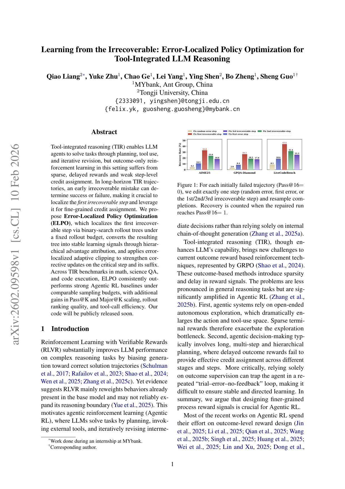
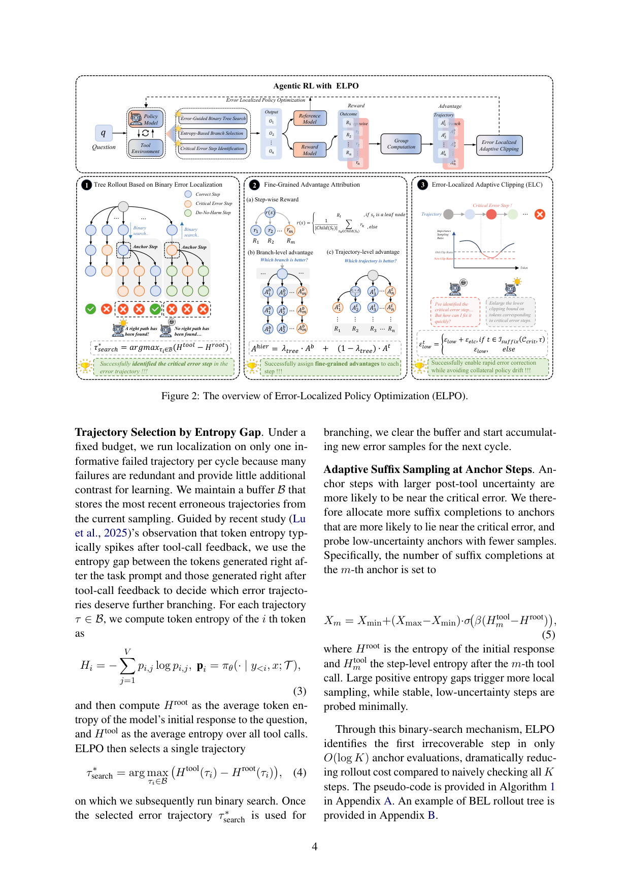

`error_localized_irrecoverable | Learning from the Irrecoverable: Error-Localized Policy Optimization for Tool-Integrated LLM Reasoning (ELPO) | MYbank·蚂蚁集团 + 同济大学 | 2026-02 arXiv v1(2602.09598) · 预印本 | 主题线 L?·高相关(Agentic RL / 关键步定位)`

> 一句话定位:在工具集成推理(TIR)的 Agentic RL 里，**用二分搜索 rollout 树定位"第一个不可恢复(irrecoverable)的错误步"**，再据此做层级化优势归因 + 对该步及其后缀放松裁剪下界，从而把稀疏终局 reward 变成精准的步级 credit。**与 SCoRe / AgentDebug 同属"定位关键错误步→定向优化"家族**，但定位手段(二分搜索 + 熵引导)和优化手段(自适应 clipping)是其独特点。

══ 第一层：一眼看懂 [light] ══
- 🟦 **TL;DR**：LLM agent 边推理边调用工具(代码/搜索),只在最后给一个"对/错"reward。问题:一条长轨迹里到底哪一步把全局带沟里了?稀疏终局 reward 把功劳/罪责均摊到所有步,credit 模糊。论文先做了个关键实验(图1):对一条失败轨迹,只**修一步再重采样**——修"第一个不可恢复步"能让恢复率飙到 32.8%/26.5%/43.6%(AIME25/GPQA/LCB),而修"随机错误步"只有 4.2%/2.8%/8.5%。所以"是不是第一个不可恢复步"是个极强的判别信号。ELPO 把它落进 RL:① **BEL**:对失败轨迹反复取中间步当 anchor、固定前缀重采后缀——后缀能成功则前缀可恢复(往后找)、否则不可恢复(往前找),二分搜索只用 **O(log K)** 次探测就定位首个不可恢复步(而非逐步试);② **层级优势归因**:用这棵树同时算 branch-level(同前缀下兄弟分支谁好)和 trajectory-level(整条轨迹排名)优势,加权合并;③ **ELC(误差定位自适应裁剪)**:对关键错误步及其后缀**放松 GRPO 的下裁剪界**,让"惩罚错误后缀"的负向更新更强。
- **最巧的一步**:**BEL 二分搜索定位"首个不可恢复步"且预算守恒**。抽掉它,优势归因就退化成 TreeGRPO 式随机分支(论文的 "ELPO w/o BEL" 消融),ranking 质量明显下降(图3);ELC 也没了作用对象。它的精髓是**在固定 rollout 预算 N=16 内**,靠"复用预算 + 熵引导分配"把昂贵的"逐步试恢复性"压成对数次探测——既拿到 SCoRe 那样的"关键步"信号,又不超采样预算(这是它相对 SCoRe 老师纠错的差异:无需更强老师,纯靠学生自采样 + 二分)。

══ 第二层：为什么做（写透） ══
- **研究背景**:RLVR 提升推理,但有证据(Yue 2025)显示它主要**重加权 base model 已有行为**、未必扩展推理边界 → 转向 Agentic RL(规划+工具+迭代修正)。TIR 增强能力但给 outcome-based RL(以 GRPO 为代表)带来新挑战(§1)。
- **解决的具体痛点**:
  1. **稀疏 + 延迟 reward,且在 Agentic RL 被放大**:工具使 action/工具空间巨大,稀疏终局 reward 加剧探索瓶颈;长程多阶段规划下,延迟 reward 无法跨步做 credit assignment(§1)。
  2. **"trial–error–no-feedback"死循环**:只靠 outcome 监督,agent 在试错中得不到中间反馈,学习不稳不定向(§1)。
  3. **现有方法的盲点**:多数 Agentic RL 仍在做**outcome-level reward 设计**;少数做 process reward 的(GiGPO/Tree-GRPO/SPA-RL)**也没显式定位"首个不可恢复步"**——即使有 step-aware 启发式或 tree advantage,credit 仍摊到很多 non-causal 步,agent 拿不到"轨迹在哪儿首次变不可恢复"的直接信号(§2.2、§3 末)。
- **相关工作 & 不足**:
  - *Tool-Star/Search-R1/ToRL*:outcome-based Agentic RL,证明可验证终局监督能激发工具使用,但**纯 outcome 驱动**。
  - *Tree-GRPO(Ji 2025)*:随机扩展构 rollout 树做细粒度优势,但**随机分支对初始轨迹质量敏感**。
  - *ARPO/AEPO(Lu 2025/Dong 2025)*:熵引导扩展、同预算下更多样采样——ELPO 借用了"工具反馈后 token 熵会 spike"这个观察,但把它用于**选哪条失败轨迹做二分**和**给哪个 anchor 多分配后缀**。
- **动机链**:稀疏终局 reward → credit 摊到所有步、定位不到致命步 → 实验发现"修首个不可恢复步"恢复率远高于修随机错(图1)→ 所以应**显式定位首个不可恢复步并据此定向更新** → 但两难题:(a) 预算瓶颈(不能逐步穷举恢复性)→ 用**二分 O(log K)**;(b) 怎么把定位变成稳定信号 → **层级优势(branch+trajectory)** + **ELC 自适应裁剪**。为什么不用更简单的随机树(Tree-GRPO)?消融(图3)显示去掉 BEL 的随机分支 ranking 质量更差。
- **与最近邻的 Δ**:
  - vs **Tree-GRPO**:同是树 rollout,但 ELPO 的分支由**二分搜索 + 熵引导**驱动、瞄准"首个不可恢复步",而非随机扩展 → ranking 质量更高(图3:ELPO > ELPO w/o BEL > AEPO)。
  - vs **SCoRe(from_correction_to_mastery)**:SCoRe 用**更强老师**找首错并改写;ELPO **无老师**,纯靠学生自采样后缀的成败做二分判定"不可恢复性",并用 ELC 直接在 GRPO 裁剪上动手术。定位语义也不同:SCoRe="首个偏离老师的步",ELPO="首个不可恢复步(修了也救不回的最早点)"。
  - vs **ARPO/AEPO**:借其熵观察但目标不同(它们求多样采样,ELPO 求定位致命步)。

══ 第三层：怎么做 + 靠不靠谱 ══
- **方法流水线(Figure 2,三大设计)**:
  1. **BEL 二分树 rollout(§4.1, Algorithm 1)**:
     - *选轨迹(熵 gap)*:维护失败轨迹 buffer B;按 **Htool−Hroot**(工具反馈后平均熵 − 初始响应平均熵)最大者选**一条**最有信息的失败轨迹做二分(因为很多失败冗余)。用完清空 buffer。
     - *二分定位*:对选中轨迹,取中间步为 anchor、固定前缀、采 Xm 条后缀;任一后缀成功→前缀可恢复(L=m+1,往后半段)、否则不可恢复(R=m,往前半段);收敛到单步即首个不可恢复步 tcrit。
     - *自适应后缀采样*:anchor 处后缀数 Xm = Xmin+(Xmax−Xmin)·σ(β(Htool_m−Hroot))——熵 gap 大(更可能靠近致命步)就多采,稳定低熵步少采。
     - *预算守恒*:**全部 rollout(整条轨迹 + 各 anchor 后缀分支)都计入固定 Ntotal=16**,BEL 只是在"整轨迹"与"前缀后缀分支"之间重分配,**不增采样**;所有 baseline(含树类)同 Ntotal 下比。
  2. **层级优势归因(§4.2)**:
     - *step-wise reward*:树节点递归回传——叶=终局 reward,内部=子节点 reward 均值(Eq.6)。
     - *branch-level*:同一父节点下,对子分支的 r(c) 组内归一(Eq.7)→ 恰在"动作发散的决策点"给局部 credit。
     - *trajectory-level*:对整条 rollout 的终局 reward 组内归一(Eq.8),内部节点取经过它的所有轨迹优势均值(Eq.9)→ 长线性段上的稳定全局信号。
     - *合并*:Ahier = λtree·Ab + (1−λtree)·At(Eq.10,λtree=0.5)。λ=0 退回普通 group RL,λ=1 纯局部分支。
  3. **ELC 误差定位自适应裁剪(§4.3)**:把 GRPO 下裁剪界 1−εlow 换成 token 相关的 1−ε^t_low:**仅对 tcrit 及其后缀 token** 把下界放大(εlow+εelc)。直觉(A<0 时):放低 1−ε^t_low 让更小的比率 ρ<1 仍不被裁剪 → 放大对"错误后缀 token"的负向更新、更狠地惩罚;A>0 时上界不变,所以**主要是压制错误后缀、不放大正向更新**。
  4. **训练目标(§4.4)**:GRPO 目标里把 group 优势换成 Ahier、下裁剪界换成 1−ε^t_low(Eq.12),其余(feedback-token masking 等)不变。
- **逐组件必要性(消融)**:
  - **BEL**:图3 直接消融 "ELPO w/o BEL"(改 TreeGRPO 式随机选分支前缀)→ ranking 的 pairwise accuracy / Kendall τ 明显低于完整 ELPO → BEL 对"信息性兄弟分支比较"贡献关键。
  - **层级优势 / ELC 的单独消融**:论文正文称放在 **Appendix F(component ablations)**,主文未展开数字【待核:本次只读到正文+部分附录(到 Appendix D),F 的具体数字未见,需查附录 F】。
  - λtree、εelc 等敏感性:Appendix G(未展开)。超参表(表2):Ntotal=16, Bmax=3, Xmin=1, Xmax=3, β=5, λtree=0.5, εlow=0.2, εhigh=0.315, εelc=0.115。
- **关键机制/公式直觉**:
  - *为什么二分能定位"首个不可恢复步"*:恢复性沿轨迹是**单调的**(越往后前缀越接近终点、越可能不可恢复)——这个隐含单调假设让二分成立,把 O(K) 探测降到 O(log K)。
  - *为什么 branch+trajectory 双粒度*:branch-level 在决策点给"锐"的局部信号但可能噪;trajectory-level 给"钝但稳"的全局信号;合并兼顾定位性与一致性。
  - *ELC 为何只动下界*:负优势(惩罚错误)时放松下界=允许更激进的下压;保持上界=不滥发正向奖励,避免 collateral policy drift(图2 文字"do-no-harm")。
- **实验与证据**:
  - 数据集:数学(MATH、GSM8K、MATH500、AIME2024、AIME2025)、科学 QA(GPQA-Diamond)、代码(LiveCodeBench-v6)。
  - 设置:**VERL 框架**实现,feedback-token masking(梯度只算 agent 生成 token);backbone=Qwen2.5-7B-Instruct / Qwen3-4B-Instruct-2507。先在 Open-AgentRL-SFT-3K 冷启 SFT 5 epoch,再在 Open-AgentRL-30K RL 1 epoch;GRPO KL 系数=0(求稳);total batch 128 / PPO mini-batch 16 / 最大上下文 20K token;**每输入 rollout 预算 Ntotal=16(所有方法同口径,树类每次分支也计入)**;**8×A100**。
  - **支撑核心主张的关键证据**:
    - *动机实验(图1)*:同改一步,修首个不可恢复步的恢复率(AIME25 32.8 / GPQA 26.5 / LCB 43.6)**远超**修随机错(4.2 / 2.8 / 8.5)或修首个错误步(23.6 / 18.5 / 31.4)——这是全文立论的实证基石,且区分了"首个错误步"≠"首个不可恢复步"。
    - *主结果(表1)*:Qwen2.5-7B 上 ELPO 平均 **60.7**,比最强 Agentic RL baseline **DemyAgent(59.4) +1.3**、比 GRPO(51.2)+9.5;Qwen3-4B 上 ELPO **72.6**,比 DemyAgent-4B(71.9)+0.7。文中称分别 +2.2% / +1.0%(相对 DemyAgent 的口径)。
    - *ranking 质量(图3)*:在分支前缀处,ELPO 对 sibling 分支的排序与 Mean@32 参考最一致(pairwise acc / Kendall τ 最高),ELPO w/o BEL 次之、AEPO 最差 → 直接验证"BEL + branch-level 优势"提升了局部判别力。
    - 另有 Pass@K/Major@K(Appendix D,大 K 时 Major@K 提升最明显)、tool-call 效率等辅助证据。
  - baseline 公平性:**口径很严**——所有方法同 Ntotal=16、树类每次分支计入预算,backbone/数据/SFT 冷启统一。但⚠️ **相对最强 baseline 的绝对增益偏小**(7B +1.3、4B +0.7),且科学 QA(GPQA)上 ELPO-7B 52.7 反**略低于** ARPO/AEPO(53.0)、代码 LCB 19.7 仅微弱领先——**增益主要来自数学**,整体提升温和。
  - "看着强但没回答核心问题"?图1 强有力,但⚠️ 图1 是"oracle 式"分析(已知答案才能判定首个不可恢复步并人工修);**训练中 BEL 靠有限后缀采样近似定位**,二者有 gap(作者在 Limitations 承认低成功率/高随机域可能误判)。即"理想信号很强"与"近似定位后的端到端增益温和"之间有落差。
- **假设与失效边界**:
  - 【原文 Limitations】首个不可恢复步是**在固定预算/当前策略/解码配置下、有限后缀采样**的经验结果——低成功率或高随机域里,罕见成功/假阴性会给二分引入偏差/方差,且定位步会随策略/预算漂移;评测集中在**较确定性工具环境**(代码/计算/闭式 QA),未测开域 web 搜索/GUI 等噪声更大的工具;**只针对单一最早关键步**,无法覆盖"多个交互错误/渐进式误差累积"。
  - 【推断】二分定位依赖"恢复性沿轨迹单调"的隐含假设;若中段可恢复、后段又可恢复但中间不可恢复(非单调),二分会错。依据=Algorithm 1 的二分逻辑要求单调可恢复性。
  - 【推断】ELC 的 εelc=0.115 等是固定超参,跨任务最优值未必稳定(故有 Appendix G 敏感性分析)。
- **祛魅总结**:
  - 真贡献(硬货):**(1) 实证区分"首个错误步"与"首个不可恢复步"并证明后者是更强的可恢复性判别信号(图1)**;**(2) 固定预算内 O(log K) 二分 + 熵引导的低成本定位(BEL)**;**(3) 把定位信号转成 branch+trajectory 层级优势 + 误差定位自适应裁剪(ELC)** 这套即插 GRPO 的步级 credit 方案。机制设计精巧、预算守恒论证扎实。
  - 包装/营销成分【推断】:① 图1 的强对比是"oracle 信号上限",端到端主结果增益其实温和(+1.3/+0.7),标题"Learning from the Irrecoverable"略大于实测净收益;② 层级优势 + 自适应裁剪都是在 GRPO/DAPO 既有件上的组合改造,单看创新度中等,**核心新意在 BEL 定位**;③ 主文把层级优势/ELC 的单独消融、敏感性都丢进附录,正文只展示了 BEL 的 ranking 消融——读者难判断 ELC 净贡献多大(需查 Appendix F);④ 代码"will be publicly released soon"——**截至本版未开源**。

══ 结构化抽取 ══
- 🎯 **机制速览 6 轴** [light]：

| 轴 | 取值 |
|---|---|
| 学什么信号 | **环境 reward(可验证终局)** 经树回传成 step-wise reward + **二分定位的"首个不可恢复步"** 作为定向信号;token 熵作为定位/采样的引导信号 |
| 改什么 | **参数(策略模型主干权重，GRPO 更新)**;不改 prompt/记忆/技能;ELC 改的是**裁剪超参(对关键步后缀 token 放松下界)**而非新增模块 |
| 何时改 | **离线批量 RL**(冷启 SFT 5ep → RL 1ep);定位/优势计算发生在每次 rollout(per-prompt 的树),但参数更新是标准批量 RL,非 test-time/per-step |
| 免梯度? | **否**(标准 GRPO 策略梯度;BEL/优势归因是免梯度的信号构造,但目的服务于梯度更新) |
| 记忆-技能生命周期 | 不适用(无外置记忆/技能库;失败轨迹 buffer B 是**临时的**——每轮选一条做二分后即清空,不长期保留不检索) |
| 防遗忘机制 | **不适用/未涉及**(单策略 RL,无多任务/持续学习,未讨论灾难遗忘;无 merging/KL 投影/几何共识) |

- ⑦ **开源代码 + 框架/harness**:**尚未开源**(摘要&正文 "Our code will be publicly released soon",截至 v1 无链接)。**训练框架明确 = VERL**(`https://github.com/volcengine/verl`,§5.3 + 脚注3),带 feedback-token masking;RL 算法=GRPO 变体(KL=0)。数据集为公开 HF 资源:Open-AgentRL-SFT-3K / Open-AgentRL-30K(Gen-Verse),benchmark 工具环境=代码解释器/计算/搜索。
- 💰 **资源/成本与可扩展性**:**8×A100**;total batch 128 / PPO mini-batch 16 / 上下文 20K;每输入 rollout 预算 **Ntotal=16(关键卖点:BEL 在此固定预算内重分配,不增采样)**。冷启 SFT 5 epoch + RL 仅 1 epoch。二分定位 O(log K) 探测显著低于逐步穷举(O(K))。验证到 4B/7B 规模。
- 🎯 **对"探索-巩固"idea 对标** [light]：**支撑 + 可借组件(偏"探索/credit 定位"一侧)**。
  - *支撑*:与 TSRD"切关键步(高熵/低置信)而非换行""path-recovery 单点接管"**强呼应**——ELPO 正是用熵 gap 选步、二分定位"首个不可恢复步"作为单点 credit 锚,且实证(图1)证明"修这一步"恢复率最高,为"单点接管"提供了 RL 侧的量化依据。
  - *可借组件*:(1) **二分搜索 + 后缀重采定位"首个不可恢复步"**(O(log K),无需老师)——可作 TSRD path-recovery 切点的自动定位器,替代/补充 MTP 前瞻探针;(2) **固定 rollout 预算内重分配**的工程范式(降成本);(3) **ELC:对关键步后缀放松裁剪下界**——一种"在关键步加大学习信号"的轻量手术,可迁移到 OPD 的关键步加权;(4) **branch-level 组内归一**给决策点局部 credit,可与 GRPO/step 切分(用户已调研 108 篇的那条线)拼接。
  - *竞品维度*:与 **SCoRe** / **AgentDebug(2509.25370)** 同属"关键错误步定位→定向优化"家族;ELPO 的差异化在"无老师 + 二分定位不可恢复步 + 裁剪手术",可在 survey 同节三者并置(老师纠错 / 二分自定位 / 调试式定位)。
  - *缺口*:无前瞻(MTP)视角,定位靠"事后采样恢复性",非"提前预测哪步会塌";单点、非多点/渐进误差;无记忆/巩固(纯 RL,不内化经验到记忆/技能)。
- 🔭 **开放问题/未来方向**:
  - 【原文 Limitations 隐含】更鲁棒的"首个不可恢复步"定位(低成功率/高随机域抗偏差);扩到噪声更大的开域 web/GUI 工具;从单一最早步扩到**多关键步/渐进误差**的联合定位与优化。
  - 【推断】把 BEL 的"事后采样定位"替换/融合"前瞻探针(如 MTP/熵峰预测)"以降探测成本并提前定位;研究恢复性非单调时的定位策略;把 ELC 思想推广到正向关键步(目前只压制错误后缀)。
- 🖼 **关键图 top-2** [light]：

· 这是含**原文 Figure 1(动机实验)** 的首页:对失败轨迹只改一步再重采,"修第一个不可恢复步"恢复率(32.8/26.5/43.6)远高于"修随机错"(4.2/2.8/8.5)或"修第一个错误步"(23.6/18.5/31.4)。选它因为这张图是全文立论的实证基石,直接证明"首个不可恢复步"是高判别信号、且把它与"首个错误步"区分开。

· 这是**原文 Figure 2(方法主图)**:三大设计连成一条线——① 二分树 rollout 定位关键错误步;② 树上做 branch-level + trajectory-level 层级优势归因;③ 对关键步后缀做误差定位自适应裁剪(ELC)。选它因为它一图说清 ELPO 如何把"定位→归因→裁剪"咬合成即插 GRPO 的步级 credit 流水线。

──────────
【三标注小结】方法/公式/超参/数据集/主结果数字均【原文】可锚定(§4.1-4.4、Eq.1-12、表1-2、图1-3、Alg.1);"恢复性单调假设""增益主要来自数学""图1 是 oracle 上限、端到端增益温和""营销成分"等判断标【推断】并附依据;**层级优势/ELC 单独消融数字标【待核】**(在 Appendix F,本次只读到 Appendix D,未见具体数字)。开源状态经正文核实=**尚未开源**(non-fabricated,确属 "soon");训练框架 VERL 由 §5.3+脚注明确给出。
