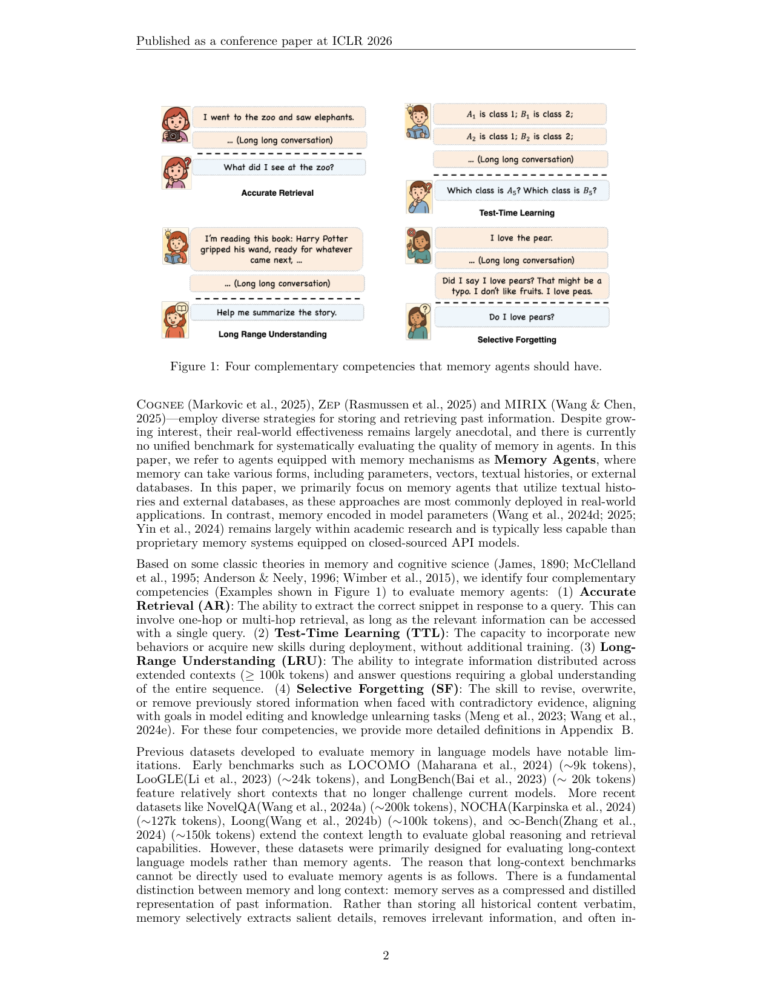
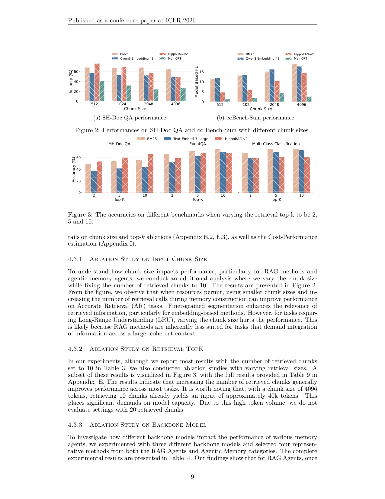

`evaluating_memory | Evaluating Memory in LLM Agents via Incremental Multi-Turn Interactions (MemoryAgentBench) | UC San Diego (Yuanzhe Hu, Yu Wang, Julian McAuley) | 2026-03 v3 · ICLR 2026 · arXiv 2507.05257 | 主题线 L1 评测/benchmark(记忆) · 相关性 High`

══ 第一层:一眼看懂 [light] ══
- 🟦 TL;DR:现有 agent benchmark 只考"推理/规划/执行",几乎不考"记忆"。本文从认知科学出发,把记忆 agent 该有的能力拆成**四项**——精确检索(AR)、测试时学习(TTL)、长程理解(LRU)、选择性遗忘(SF),把一批长上下文/对话数据集**改造成"逐轮增量喂入"的多轮交互格式**,合成 MemoryAgentBench,统一评测从纯长上下文模型、各类 RAG、到商用 agentic memory(Mem0/Cognee/Zep/MIRIX/MemGPT)的一大票方法。结论:没有任何一类方法四项全能。
- 最巧的一步:**把静态长文档 QA "切成增量多轮喂入"**这个改造动作。抽掉它,benchmark 就退回普通长上下文 QA,无法模拟 agent "边交互边累积、再更新/遗忘"的真实记忆动态——四项能力(尤其 TTL 测试时学习、SF 选择性遗忘)就无从考。

══ 第二层:为什么做(写透,重点) ══
- **研究背景**:LLM agent 已从"概念验证聊天机器人"走向能写软件(OpenHands)、控浏览器、跨模态推理的端到端系统,在 GAIA / SWE-Bench 等 agentic benchmark 上刷 SOTA(§1)。但这些评测**几乎只考 reasoning(规划/工具/代码合成)**,把同样重要的 memorization(抽象/存储/更新/检索)留作"largely under-explored"。与此同时,记忆中心架构(从参数记忆 MemoryLLM/M+,到商用 token 级记忆 MemGPT/Mem0/Cognee/Zep/MIRIX)井喷,但"它们到底强不强,基本只有 anecdotal 证据,没有统一基准"。
- **解决的具体痛点**(越具体越好):① **无统一记忆基准**——现有评测要么是短上下文(LOCOMO ~9k / LooGLE ~24k / LongBench ~20k,已不挑战当代模型),要么是为长上下文 LLM 设计的静态 book-QA(NovelQA/NOCHA/∞-Bench),整块喂入,**不反映 agent "增量多轮、边吸收边巩固"的本质**。② **没有任何基准同时覆盖四项能力**(Table 1):MemoryBank 只覆盖 AR+TTL;LOCOMO/PerLTQA/LongMemEval 基本只 AR;StoryBench 只 AR+LRU;**SF(选择性遗忘)从未被系统考过**。③ LongMemEval 虽用合成多会话对话(可 session-by-session 注入),但"话题多样性有限、交互不真实",代表性差。
- **作者点破的"memory ≠ long-context"关键区分**(§1):记忆是**对过往信息的压缩与蒸馏表示**——不逐字存全文,而是选择性抽取要点、删无关、并融入由旧经验推出的新推断。因此 agent 是"piece by piece 增量处理、随时间抽象巩固、从累积历史学新规则"——整块喂入的数据集**原理上不适用**于评测记忆 agent。这是把"长上下文基准"和"记忆基准"拆开的逻辑根。
- **相关工作 & 各自不足**(§2,摆三条线旁):①**长上下文基准**(LongBench/∞-Bench/RULER/NoLiMa)——只测"一次性读海量文本",不反映增量多轮;②**RAG 基准**(KILT/BEIR/RAGBench/RAGTruth/FRAMES)——假设知识库静态或缓变、交互短命,强调检索精度与 grounding,**忽视持续更新与选择性遗忘**;③**记忆 agent 基准**(LOCOMO/LongMemEval/RealTalk/StoryBench)——或太短或合成感强,且**评测范围不足以覆盖四能力**。
- **动机链**:agent 评测重 reasoning 轻 memory → 记忆架构涌现但无统一标尺、效果停留在 anecdotal → 现有数据集要么短、要么静态整块喂、且无一覆盖四能力(尤其 SF 空白)→ 而 memory 与 long-context 有本质差异(压缩蒸馏 vs 原文堆叠),必须用"增量多轮喂入"的协议才能逼真测出"边交互边累积/更新/遗忘"→ 所以必须造一个**把长上下文数据改造成增量多轮、且系统覆盖 AR/TTL/LRU/SF 四能力**的统一基准 MemoryAgentBench。为什么不直接复用现成长上下文基准?因为整块输入无法触发 agent 的记忆机制(写入→更新→检索),更测不到 TTL/SF。
- **与最近邻 LongMemEval 的 Δ**:LongMemEval 也做"可 session 增量注入的合成对话",但本文差异在三点——① **不止用合成对话,而是系统化改造一大批真实长上下文数据集 + 新造 EventQA/FactConsolidation**,话题多样性更高;② **唯一同时覆盖四能力**(LongMemEval 仅 AR);③ 提供**跨三类 agent(LCA/RAG/AM)统一协议**的横向评测床。这差异有用,因为它把"记忆质量"从单点(检索)扩成可正交诊断的四维度,尤其首次把 SF 摆上台面。

══ 第三层:怎么做 + 靠不靠谱 ══
- **方法流水线(数据改造→协议→评测)**:①**定义四能力**(基于记忆/认知科学经典:James 1890、McClelland 1995 互补学习系统、Anderson&Neely 1996 检索抑制):AR 精确检索(单/多跳,单查询可达)、TTL 测试时学习(部署期不再训练而获得新行为/技能)、LRU 长程理解(整合≥100k token 的全局信息)、SF 选择性遗忘(遇矛盾证据时修订/覆盖/删除旧信息,对接 model editing/unlearning)。②**改造数据**:把长上下文数据集**切成时序对话 chunk** c1…cn 逐块喂入,每块前缀"请记住,我稍后提问"的记忆指令;新造两个数据集——**EventQA**(全自动 pipeline,读小说后从候选里选正确事件,reasoning 式 NIAH)补 AR;**FactConsolidation**(用 MQUAKE 反事实编辑对,把"真事实→改写矛盾事实"按序排,拼成 6K/32K/64K/262K 长上下文)补 SF。③**统一交互协议**:所有 chunk 包成 User-Assistant 对话以显式触发记忆机制;SF 任务加显式 guardrail("事实按序号索引,序号越大越新,冲突时取最新")。④**三类被测 agent**:Long-Context(FIFO 维护上下文 buffer,满则逐出最早)、RAG(Simple BM25 / Embedding / Structure-Augmented 三档)、Agentic Memory(MemGPT/MIRIX 等带迭代 reasoning 循环)。⑤**统一打分**:四类各取指标(Accuracy/Recall@5/F1),GPT-4o-mini 为默认 backbone,跨方法同模板 prompt 保公平。
- **逐组件必要性**:① **增量喂入协议**——没它整个 benchmark 退化成普通长上下文 QA,TTL/SF 无从测(这是"最巧一步");② **FactConsolidation 数据集**——是 SF 能被首次量化的载体,没它就回到"无人测遗忘"现状;§4.3.4 用 o4-mini 在 6K 版上拿 100%(SH)/80%(MH)**验证了数据集本身可解**(不是题目坏),证明 32K 上的崩盘是模型能力而非数据噪声——这是关键的"数据合法性"消融;③ **跨三类 agent 横评 + backbone 消融**——证明结论不是单一实现的偶然。
- **关键机制/直觉**:本文不训练,核心"机制"是**评测协议设计**。最有信息量的直觉是"AR 与 LRU 此消彼长":RAG 擅长 AR(只需捞出关键片段),但天然不擅 LRU(只取 top-k 必丢全局);长上下文模型反之擅 LRU/TTL(能 in-context 学分类、能整篇理解)但无法主动遗忘。SF 的 guardrail 设计("越新序号越大、冲突取最新")是为了把"遗忘"从模糊概念变成可判定任务。
- **实验与证据(关键数字,§4.2 Table 3)**【原文】:总分前二是**长上下文 Claude-3.7-Sonnet 49.6 / GPT-4o 48.8**;RAG/商用记忆普遍 18–42。分项支撑三大主张:① **RAG 擅 AR**——多数 RAG 在 AR 类超过 backbone GPT-4o-mini(如 HippoRAG-v2 AR Avg 65.1 vs BM25 60.5,均高于纯 backbone);② **长上下文擅 TTL/LRU**——长上下文模型在 TTL(MCC 多到 80–89)与 LRU 全面领先,RAG 在 LRU 几乎崩(GraphRAG ∞Bench-Sum 仅 0.4);③ **所有方法 SF 多跳 ≤7%**,全军覆没,单跳仅长上下文模型勉强(GPT-4o FC-SH 60.0)。**关键消融**:Fig2 显示 AR 任务用更小 chunk(512)+更多检索更好、但 LRU 任务变 chunk 反而掉(印证 RAG 不适合需全局整合的任务);Fig3 显示增大 top-k 普遍提升;Table 4 backbone 消融揭示"RAG 一旦 backbone 够强就不再是瓶颈(GPT-4o-mini→4.1-mini 仅微升),但 Agentic Memory(MIRIX)换强 backbone 大涨 +9.7 平均"——暗示 agentic memory 的天花板更依赖底模。
- **baseline 公平吗 / 有没有"看着强但没回答核心"**:同类用同模板 prompt、商用记忆统一 chunk=4096(为控 API 成本,§4.1),基本公平。"看着强"的隐患:Table 3 总分榜首是长上下文模型,但这部分**得益于其超长窗口直接装下输入**,本质是"用算力换记忆",并未真正回答"如何压缩-巩固记忆"——这点作者其实自知(§1 已区分 memory≠long-context),但榜单读者易误读成"长上下文=最好记忆方案"。
- **假设与失效边界**【推断,除标注外】:核心假设"四能力可正交拆分、且把长文档切增量多轮能保真模拟 agent 记忆动态"。失效边界——① TTL/SF 多为**合成改造数据**(意图分类、FactConsolidation 多跳反事实),真实多轮对话里四能力可能耦合;② 本文**主聚焦文本/向量/图记忆,参数化记忆基本未覆盖**【原文§1 明示"参数记忆仍属学术、能力弱于商用 API 记忆",故略】,对"参数侧巩固/遗忘"无评测力;③ 作者自陈【原文§5 Conclusion】因预算只测了代表性子集,覆盖面有限。
- **祛魅总结**:**真贡献(硬货)**——(a) 把"记忆质量"操作化为 AR/TTL/LRU/SF 四正交维度,且**首次系统化测 SF**;(b) "增量多轮喂入"协议 + 两个新数据集(EventQA 全自动 pipeline、FactConsolidation 反事实长上下文)是可复用的工程资产;(c) 三个清晰可迁移的实证结论(RAG↔AR、长上下文↔TTL/LRU、人人栽 SF)。**包装/营销成分**——"四能力源自认知科学"是合理框架但并非强理论保证(正交性未经实证检验,属【推断】);总分榜单容易让人高估长上下文模型(其优势主要来自窗口大小而非记忆机制本身)。作者整体**诚实**(主动声明预算限制、参数记忆未覆盖、用 o4-mini 反验数据可解性),没有过度宣称自己方法更强(本就是纯评测论文)。

🎯 **机制速览 6 轴** [light]\(注:本文是**评测论文**,自身不训练/不进化;6 轴描述的是它"测什么/把被测系统看成什么")
| 维度 | 内容 |
|---|---|
| 学什么信号 | 不适用(评测论文);被测系统的信号=用户多轮输入文本 / 历史交互 |
| 改什么 | 评测对象=外部记忆(文本历史 + 向量库 + 图/树结构),少量也含参数记忆但本文聚焦非参数 |
| 何时改 | 被测设定=**在线 per-turn 增量写入/检索**(incremental multi-turn) |
| 免梯度? | 是(被测主流为 RAG / agentic memory,免训练;TTL 明确定义为"部署时不再训练") |
| 记忆-技能生命周期 | 覆盖**写入→检索→更新→遗忘**全环;SF 专测"用新证据覆盖/删除旧记忆" |
| 防遗忘机制 | 不适用(评测);反而把"选择性遗忘 SF"当作正面**待考能力**,发现所有方法多跳 SF≤7% 几乎全崩 |

- 🎯 **对"探索-巩固"idea 对标** [light]:**缺口/测量工具**。它给"巩固(consolidation)"提供了可量化标尺——TTL 测"能否在部署时把交互转成新技能/行为"、SF 测"能否用新经验覆盖旧的"。结论"长上下文擅长 TTL/LRU、RAG 擅长 AR、人人都栽在 SF"正好暴露:纯检索式巩固学不到全局,纯长上下文又无法主动遗忘——支撑"探索后需显式巩固+选择性淘汰"的论点,可直接拿作评测床。

- 假设与失效边界(一句)【推断】:核心假设是"四项能力可正交拆分、且把长文档切成增量多轮能保真地模拟 agent 记忆动态";失效边界——TTL/SF 多为合成改造数据(意图分类、FactConsolidation 多跳),真实多轮对话里能力可能耦合,且本文主聚焦文本/向量/图记忆,**参数化记忆基本未覆盖**(原文明示"参数记忆仍属学术、能力弱于商用 API 记忆"),故对"参数侧巩固/遗忘"无评测力。

🖼 **关键图 top-2** [light]

· 这是**原文 Figure 1**:用四个对话小场景分别图解 Accurate Retrieval、Test-Time Learning、Long-Range Understanding、Selective Forgetting。选它因为这"四能力拆分"就是全文骨架与最大概念贡献,一图看懂本文怎么定义"记忆"。

· 这是**原文 Figure 2(上)+ Figure 3(下)同页**:Fig2 显示 RAG 性能随 chunk size 大幅波动(SH-Doc QA / ∞Bench-Sum);Fig3 显示随检索 top-k 变化。选它因为这是支撑"RAG 仅擅长 AR、对超参极敏感、无法整体理解"主结论的核心消融证据。
· 主结果数字(Table 3,§4.2)【原文】:总分(Overall)长上下文 Claude-3.7-Sonnet 49.6 / GPT-4o 48.8 居前;RAG/商用记忆普遍 18–42;**所有方法在多跳 Selective Forgetting 上 ≤7%**,几乎全崩——本文最强 takeaway。

⑦ 开源代码 + 框架/harness:**已开源**(原文首页超链已核出明文)——代码 **https://github.com/HUST-AI-HYZ/MemoryAgentBench**,数据集 **https://huggingface.co/datasets/ai-hyz/MemoryAgentBench**(代码 MIT、数据 CC BY 4.0,见 §Ethics/Reproducibility)。属**评测框架/数据集**,非训练框架(无 veRL/TRL 类);backbone 默认 GPT-4o-mini,Embedding 用 Qwen3-Embedding-4B / text-embedding-3-small/large + Contriever,结构化 RAG 用 RAPTOR/GraphRAG/HippoRAG-v2/MemoRAG,商用记忆 Mem0/Cognee/Zep/MemGPT/MIRIX。本笔记未 clone(纯评测仓,B 层只记录)。
