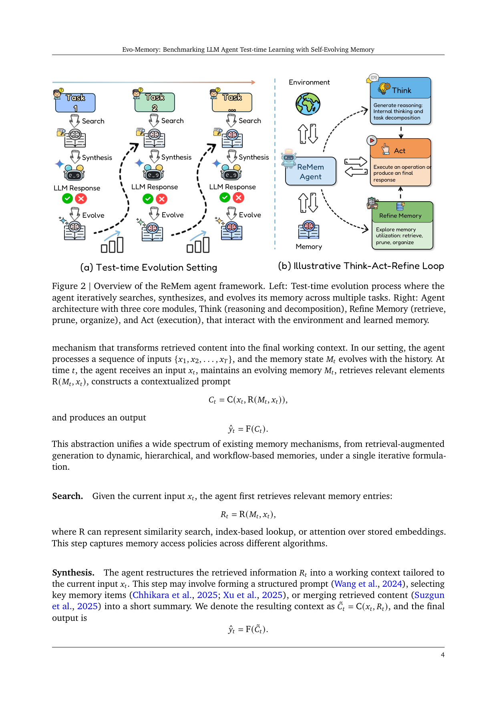
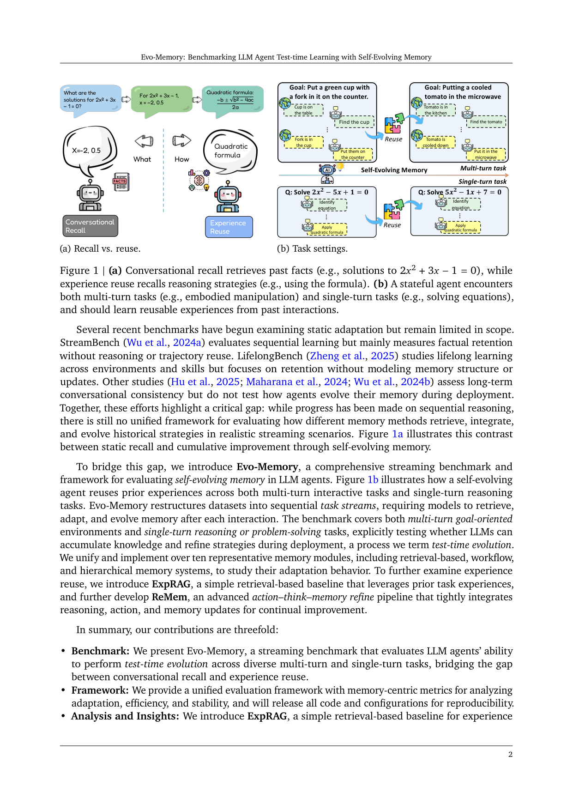

`evo_memory | Evo-Memory: Benchmarking LLM Agent Test-time Learning with Self-Evolving Memory | Google DeepMind + UIUC（Tianxin Wei 等，通讯 twei10@illinois.edu） | 2026-05（arXiv:2511.20857v2, 2026-05-18；早于本调研窗内的近作） | 主题线 L?（记忆/test-time 学习 benchmark + 方法）·相关性 High`

> 三标注约定：【原文】=论文直述；【推断】=有据判断（附依据）；【待核】=拿不准的关键事实。

══ 第一层：一眼看懂 [light] ══

- 🟦 **TL;DR**：现在评 LLM "记忆" 的 benchmark 大多只测「能不能记住对话里说过的事实」（conversational recall），却不测「能不能把做过的题/任务的经验抽象成策略、复用到后面的新任务上」（experience reuse）。本文把一堆静态数据集（数学/QA/具身环境）重排成**流式任务序列**，要求 agent 每做完一题就**检索→综合→进化**自己的记忆，从而衡量 test-time 自进化能力。同时给两个方法：ExpRAG（把过去经验当 few-shot 检索回来的简单基线）和 **ReMem**（在 ReAct 的 Think/Act 之外加一个 **Refine（记忆精炼）** 动作，让 agent 在解题中主动评估/剪枝/重组自己的记忆）。【原文 Abstract/§1/§3】
- **最巧的一步**：把"记忆操作"提升为 agent 决策环里的**第三类一等动作 Refine**（与 Think、Act 平级，可在一步内多次穿插），而不是把记忆当被动 context。抽掉 Refine，ReMem 就退化回 ReAct+检索；论文多轮/含失败经验实验里 ReMem 的优势正来自这个主动精炼（见 Table 1/3）。【原文 §3.3 + Table 1】【推断：依据是消融性质的对照——去掉 Refine 即为 ExpRAG/ReAct 档位，差距明显】

══ 第二层：为什么做（写透） ══

- **研究背景**：LLM 已从聊天机器人变成能写代码、操作浏览器、多步问答的 agent，但"记忆"这一让模型跨交互保持状态、积累经验、随时间改进策略的能力仍被忽视。现有记忆系统多是**被动存储**（压缩/索引/检索对话历史），只复用静态上下文，不从经验中学习去改进未来推理/决策。【原文 §1】
- **解决的具体痛点**：现有评测"测能不能回忆过去 context，却几乎不测能不能复用经验"——"agents remember what was said but not what was learned"。没有经验复用，模型会反复重解同类问题。【原文 §1，这句"remember what was said but not what was learned"是其核心 pitch】
- **相关工作 & 各自不足**：
  - StreamBench（顺序学习）→ 主要测事实保持，不含推理/轨迹复用；
  - LifelongBench（跨环境技能终身学习）→ 重保持，不建模记忆结构/更新；
  - 长期对话一致性类（Hu 2025；Maharana 2024）→ 不测部署中记忆如何进化。
  - 自进化记忆方法侧（Mem0、Zep、Dynamic Cheatsheet、AWM、MemOS、A-mem 等）→ 各有 read/write/索引机制，但**没有统一的评测设定与框架**来衡量"跨任务复用、适应、进化"。【原文 §1、§2.2】
- **动机链**：现状=记忆当被动检索 → 缺陷=测了 recall 测不到 reuse、且各方法无统一对比 → 所以必须把静态数据集**重排成流式序列**并强制"每步检索-综合-进化"，才能公平、统一地暴露"自进化"能力。为什么不用更简单做法（如直接看长对话一致性）？因为那只测保持，无法体现"earlier task 的策略迁移到 later task"。【原文 §1/§3】
- **与最近邻工作的 Δ**：最像 Dynamic Cheatsheet（DC，把经验合成进一个可复用 cheatsheet）与 AWM（workflow 记忆）。Δ：本文不是再提一个记忆模块，而是 ① 提供**统一 streaming benchmark + search-predict-evolve 协议**把十余种记忆模块放进同一笼子对比；② 方法上把记忆精炼显式做成**决策动作**（ReMem），而非离线合成。【原文 §1/§3.3/§4.1.2】

══ 第三层：怎么做 + 靠不靠谱 ══

- **方法流水线（统一抽象，§3.1）**：agent = 四元组 (F 基座LLM, U 更新管线, R 检索, C 上下文构造)。每步 t：
  1. **Search**：`R_t = R(M_t, x_t)`（相似度/索引/attention 检索相关记忆）；
  2. **Synthesis**：把 `R_t` 重组为工作上下文 `C̃_t = C(x_t, R_t)`（结构化 prompt / 选关键条目 / 合并摘要），输出 `ŷ_t = F(C̃_t)`；
  3. **Evolve**：构造新记忆条目 `m_t = h(x_t, ŷ_t, f_t)`（含反馈 `f_t`，如是否完成），更新 `M_{t+1}=U(M_t, m_t)`（append / 摘要压缩 / 替换）。
  - **Dataset Preparation**：把静态数据集变成序列 τ={(x_1,y_1)…(x_T,y_T)}，前面任务为后面提供信息/策略，产出预测轨迹链。【原文 §3.1】
- **两个实例化方法**：
  - **ExpRAG（§3.2）**：每条记忆是结构化经验文本 `m_i=S(x_i, ŷ_i, f_i)`；步 t 检索 Top-k 相似经验做 ICL，`ŷ_t=F(x_t, R_t)`，再 append。= 一次性经验复用，无迭代推理/自适应精炼。
  - **ReMem（§3.3）**：在每步内，状态 `s_t^n=(x_t, M_t, o_t^{1:n-1})`，动作空间 `a_t^n ∈ {Think, Act, Refine}`，构成一个 MDP；一步内可多轮 Think/Refine，选到 Act 即终止该步。Think=内部推理/任务分解；Act=对环境执行或产出可见响应；**Refine=对记忆做 meta-reasoning：利用有用经验、剪枝噪声、重组 M_t**。本质是把 ReAct 的动作空间扩出一个"记忆推理"维度。
- **逐组件必要性**：
  - Search/Synthesis/Evolve 三件套是所有记忆 agent 的公共骨架，用于统一对比（"isolate the effects of memory design"）。【原文 §4.1.2】
  - Refine：核心新增。RQ4（Table 3）显示**当成功+失败经验都塞进记忆**时，naive 累积会因噪声退化，而 ReMem 靠主动精炼保持稳健（Claude/Gemini 双底座均最佳）。这间接证明 Refine 的必要性，但**论文没有把"去掉 Refine 但保留 Think/Act"作为单独消融行**——它用 ExpRAG/ReAct 作为没有 Refine 的对照。【原文 §4.2.4/Table 3】【推断：因此 Refine 的净贡献只能从 ReMem vs ExpRAG 的差额近似读出，非严格单因子消融】
- **关键机制直觉**：把"要不要改记忆、怎么改"交给 LLM 在解题循环里**即时**决定（而非固定 append/替换策略），使记忆成为与推理实时互动的自适应组件。直觉：长程任务里，"哪些过去经验此刻有用 / 哪些是噪声该删"本身就是个需要推理的判断，固定规则做不好。【原文 §3.3】
- **实验与证据（§4）**：
  - 底座：Gemini-2.5（Flash/Flash-Lite/Pro）+ Claude（3.5-Haiku/3.7-Sonnet）。【原文 §4.1.2】
  - 数据集：单轮——MMLU-Pro、GPQA-Diamond、AIME-24、AIME-25、ToolBench；多轮具身——AlfWorld、BabyAI、ScienceWorld、PDDL。【原文 §4.1.1】
  - 对比方法：ReAct、A-mem、SelfRAG、MemOS、Mem0、LangMem、Dynamic Cheatsheet(Cu/RS)、AWM、ExpRecent、ExpRAG、ReMem。【原文 §4.1.2】
  - **支撑核心主张的关键实验**：多轮表（Table 1b）——Claude-3.7-Sonnet 上 ReMem 在 AlfWorld 达 **0.92/0.96 (S/P)**、ScienceWorld 0.62/0.89，平均 **0.78/0.91**，显著高于 ReAct(0.57/0.79)、Mem0(0.50/0.75)、AWM(0.49/0.74)。这是全文最强证据：长程具身任务上自进化记忆的增益最大。【原文 §4.2.1/Table 1b】
  - RQ2（Fig 3）：ReMem 增益与"数据集内任务相似度"强相关（Gemini r=0.717，Claude r=0.563）——结构重复的任务（PDDL/AlfWorld）增益大，分散任务（AIME-25/GPQA）增益小。【原文 §4.2.2】
  - RQ2 效率（Fig 4）：ReMem 步数最少（AlfWorld 22.6→11.5 步）。【原文 §4.2.2】
  - RQ3（Table 2）：Easy→Hard / Hard→Easy 两个方向 ReMem 都稳，且"难任务的成功经验更可迁移"。【原文 §4.2.3】
  - **公平性**：所有方法跑同一 search-predict-evolve 协议、同 prompt 模板，较公平。【原文 §4.1.2】
  - "看着强但没完全回答核心问题"的点：单轮 reasoning（AIME/GPQA）增益**温和甚至互有胜负**（如 Gemini Flash 上 ReMem 在 AIME-24=0.60 但 ToolBench API 0.85/0.71 vs ExpRAG 0.87/0.73），说明"经验复用"对**结构高度重复**的任务才显著，对一次性难推理题帮助有限。【原文 §4.2.1/Table 1a】【推断】
- **假设与失效边界**：
  - 【原文】反馈 `f_t` 取"正确性信号"——即评测时**可拿到 correctness 作为 feedback**，这在真实部署常不可得（属隐式强假设）。【原文 §4.1.1 "Feedback f_t is considered the correctness signal"】
  - 【推断】增益依赖"任务流内有结构相似的可迁移经验"（RQ2 已证相关性），故对**高度异质/低相似**的任务流，自进化记忆收益会塌缩。依据：Fig 3 的相关性曲线与 AIME/GPQA 上的温和增益。
  - 【推断】ReMem 让 LLM 自行剪枝/重组记忆，依赖底座的 meta-reasoning 能力；弱底座可能精炼出错。论文自己说"Smaller models benefit most"是指**相对提升**大，但绝对值仍受限。【原文 §4.2.1 末句】
- **祛魅总结**：
  - 真贡献（硬货）：① 一个把"recall vs reuse"讲清楚、并用 streaming 协议**统一对比 10+ 记忆模块**的 benchmark/框架（含 memory-centric 指标：adaptation/efficiency/stability）；② ReMem 把记忆操作做成决策动作这一干净的范式扩展；③ 失败经验鲁棒性（RQ4）这个有价值的发现。
  - 包装/可能高估：【推断】"new standard for adaptive, self-improving LLM agents" 偏营销；ReMem 相对 ExpRAG 在**单轮**任务上常只是平手甚至略低，真正拉开差距集中在**多轮具身**。把它当"通用自进化"读会高估。依据：Table 1a 单轮多处 ReMem≈或<ExpRAG。
  - 【推断】"will release all code"——截至本 PDF（§"Contribution"/附录 A.7 提到"released under permissive open-source license upon ..."）**未在正文给出可点开的仓库 URL**，需另行核实是否已放出（见下方 ⑦/三标注）。

══ 结构化抽取 ══

- 🎯 **机制速览 6 轴** [light]：
  | 学什么信号 | 改什么 | 何时改 | 免梯度? | 记忆-技能生命周期 | 防遗忘机制 |
  |---|---|---|---|---|---|
  | 经验库（自身过去交互轨迹 x,ŷ,f）+ 环境正确性反馈 f_t【原文 §3.1/§4.1.1】 | **记忆/上下文**（外部 memory store + 工作 context），**不改参数**【原文 §3】 | **在线 per-step**（每做完一题即 evolve；ReMem 一步内还可多次 Refine）【原文 §3.1/§3.3】 | **是**（纯 prompt/检索/文本记忆，全程 frozen LLM，无梯度）【推断：全文方法均为 in-context，无任何参数更新描述】 | 写入：Evolve 把 (x,ŷ,f) 入库；检索：Top-k 相似；遗忘/淘汰：ReMem 的 Refine 主动剪枝噪声/重组（bounded store 也可替换）；共享：未涉及多 agent 共享【原文 §3.1/§3.3】 | **隔离/选择性精炼**：Refine 主动剔噪 + 失败经验过滤（RQ4 证稳健）；无几何共识/merging/KL 投影类参数级防遗忘（因不动参数）【原文 §4.2.4】 |
- ⑦ **开源代码 + 框架/harness**：论文【原文】声称将释出全部代码与配置（§Contribution "will release all code"；附录提到 permissive open-source license）。**正文未给出可点开的 GitHub URL**。【待核：仓库是否已公开、地址为何——需另行 WebSearch 核实，勿编造】。框架/harness：**无显式 RL 训练框架**；评测以 Gemini/Claude API + 自研 search-predict-evolve 评测管线为主，集成多种现成记忆库（Mem0/A-mem/MemOS/LangMem/DC/AWM 等）。【原文 §4.1.2】
- 💰 **资源/成本与可扩展性**：【原文】附录提到整体实验"cost was on the order of tens of thousands of US dollars"（数万美元级 API 开销）。延迟方面 ReMem 反而**减少步数**（AlfWorld 22.6→11.5），但一步内多轮 Think/Refine 会增加每步 token；ExpRAG/ExpRecent 更轻量却仍有竞争力。【原文 §4.2.2/附录】
- 🎯 **对"探索-巩固"idea 对标** [light]：**可借组件 + 部分竞品**。可借：①"recall vs reuse"的区分 + streaming 评测协议，可直接用来检验 MTP/OPD 学到的是"复用策略"还是"死记"；② Refine 作为显式"巩固"动作的范式，与"探索得到轨迹→巩固进记忆"高度同构（其 Refine≈巩固、Think/Act≈探索）。竞品角度：它是**纯 in-context、免训练**路线，与你"改参数式巩固（OPD/蒸馏）"形成对照基线——可用作"不动参数也能 test-time 进化"的强 baseline 来反衬参数级巩固的必要性。【推断：依据是其 search-predict-evolve 与"探索-巩固"循环结构一一对应】
- 🔭 **开放问题/未来方向**：
  - 【原文】failure-aware memory evolution（如何更好利用失败经验）；记忆的稳定性与程序性复用仍 fragile（§5 Conclusion）。
  - 【推断】把"correctness feedback"换成无监督/自评信号以贴近真实部署；对低相似任务流的记忆迁移；把 in-context Refine 与参数级巩固（蒸馏/RL）结合形成混合记忆。依据：其强假设（拿得到 correctness）与 RQ2 相似度依赖。
- 🖼 **关键图 top-2** [light]：
  · 
    这是**原文 Figure 2**（渲染自 p4）。左半=test-time evolution 设定：多任务上循环 Search→Synthesis→Evolve；右半=ReMem agent 的三模块 Think / Refine Memory / Act 如何与 Environment、Memory 交互。选它因为它一图说清全文方法骨架与"记忆精炼作为一等动作"这一最巧设计。
  · 
    这是**原文 Figure 1**（渲染自 p2，与正文密排在同页）。(a) 对比 conversational recall（记住 2x²+3x−1 的解）vs experience reuse（记住"用求根公式"这一策略）；(b) 展示同一 stateful agent 既要做多轮具身任务又要做单轮推理题，应从过去交互学到可复用经验。选它因为它把全文最核心的"记什么"区分（事实 vs 策略）讲得最直观，是理解整篇定位的钥匙。
