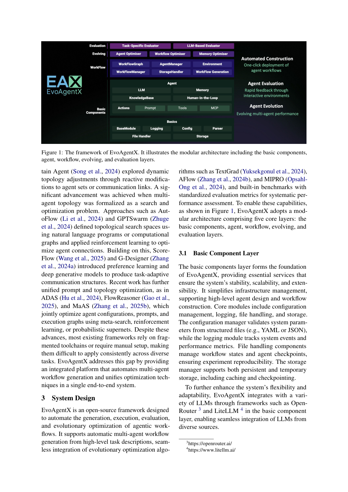
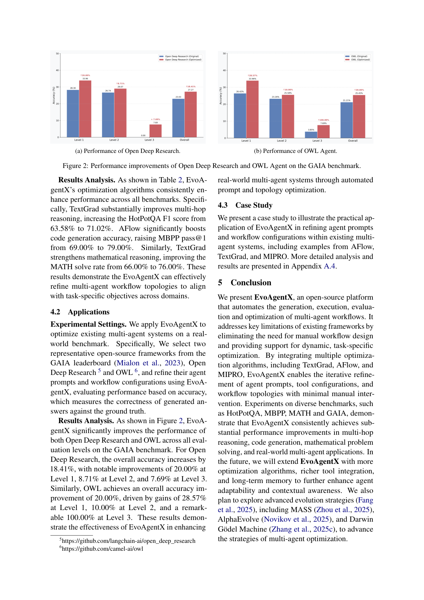

`evoagentx | EvoAgentX: An Automated Framework for Evolving Agentic Workflows | MBZUAI + U. Aberdeen + U. Glasgow (Yingxu Wang, Siwei Liu, Jinyuan Fang, Zaiqiao Meng) | 2025-07 arXiv v1 → 2025-09 v2(demo/system track)| L4 架构进化(MAS workflow)+ L2 prompt/工具进化·相关性 High(平台型,本调研可借组件)`

---

══ 第一层:一眼看懂 [light] ══

- 🟦 **TL;DR**:这是一个**开源平台**(不是一个新算法),专门解决"多 Agent 系统(MAS)搭起来全靠手工配、配完不会自己变强"两件事。你只给一句**高层目标描述**,它就自动**生成**一个多 Agent 工作流(谁干啥、怎么连),然后在"演化层(evolving layer)"里**把三个现成的优化算法(TextGrad / AFlow / MIPRO)塞进同一套框架**,迭代地改 agent 的 **prompt、工具配置、工作流拓扑**,用内置 benchmark 自动评测打分、反馈再改。它把"造 MAS → 跑 → 评 → 进化优化"做成一条端到端流水线。【原文 Abstract、§3、Fig.1】
- **最巧的一步(抽掉就垮)**:**把"workflow 表示成有向图 \(W=(V,E)\) + 把异构优化器统一成 \(X(t+1)=O(X(t), E)\) 同一接口"**。所有优化器(TextGrad 改 prompt、AFlow 改拓扑、MIPRO 调指令/示例)都被抽象成"读评测反馈 E、输出新一代配置"的算子 O,作用在 prompt / θ / 图结构 / 记忆四个对象上(公式 3–6)。抽掉这个统一抽象,EvoAgentX 就退回成"把几个互不兼容的优化脚本拼在一起",失去"在同一平台上一致地应用/比较"的核心卖点(§2.2 痛点正是"fragmented toolchains")。

---

══ 第二层:为什么做(写透) ══

- **研究背景**:MAS(多个分工 LLM Agent 协作解复杂任务)很火,已用于多跳 QA、软件工程自动化、代码生成、数学解题、对话(§1)。CrewAI / CAMEL-AI / LangGraph 等通用框架让你能定义 Agent 角色和交互,但**全是手工配置或规则编排**。
- **解决的两个具体痛点**(§1–§2):
  1. **构建靠手工**:定义 Agent 角色、任务分解策略、交互、执行流程,全要人写——可扩展性差,换任务/换域就得重配。
  2. **配完不会进化**:真实任务(多跳 QA、软件 debug)输入会变、中间结果会变、复杂度会涨,但**多数 MAS 框架没有动态 workflow 进化/优化机制**;而像 DSPy、TextGrad 这类优化方法**彼此割裂、没整合进统一平台**,实践者难以一致地应用与横向比较。
- **相关工作 & 各自不足(§2)**:① 通用 MAS 框架(CAMEL/CrewAI/LangGraph/AgentScope/MetaGPT)= 手工/规则编排;② MAS 优化谱系:prompt 优化(DSPy、TextGrad)→ 动态拓扑(DyLAN、Captain Agent 的反应式改连接)→ 把拓扑形式化为**搜索/优化问题**(AutoFlow、GPTSwarm 用 NL-program/计算图 + RL 优化连接)→ 偏好学习/生成式拓扑(ScoreFlow、G-Designer)→ **联合优化 prompt+拓扑**(ADAS 元搜索、FlowReasoner RL、MaAS 概率超网)。**它们的共同短板 = 工具链碎片化 / 需手工 setup,跨任务难一致复用**。EvoAgentX 的定位 = **把"自动生成 MAS"+"统一多种优化算法"做进一个端到端系统**(填工程整合的缺口,而非提出新优化算法)。
- **动机链(现状→缺陷→所以这样)**:MAS 强但手工搭 + 静态 → 需要"自动生成 + 自动进化" → 已有优化算法各自为政、接口不一 → **所以做一个分五层的模块化平台,用统一的优化器接口把 TextGrad/AFlow/MIPRO 收编进"演化层"**,让 workflow 能基于评测反馈迭代自改。"为什么不直接用 DSPy/TextGrad"——因为它们只解决 prompt 一环、且不互通,无法覆盖"生成→执行→评测→拓扑/工具/记忆联合进化"的全链路。
- **与最近邻工作的 Δ**:与 **AFlow/ADAS/MaAS**(都做 workflow/拓扑自动优化)最像;**关键差异 = 它不发明新优化算法,而是做"承载多算法的统一平台 + 自动工作流生成 + 内置 benchmark/评测层"**。即 AFlow 等是"一种进化策略",EvoAgentX 是"能插进多种进化策略并统一评测的容器"。这差异有用在于:研究者可在同一框架下公平对比不同优化器、复用 benchmark,工程上降低 MAS 落地门槛。【推断:依据 §2.2 "addresses this gap by providing an integrated platform that ... unifies optimization techniques in a single end-to-end system"】

---

══ 第三层:怎么做 + 靠不靠谱 ══

### 方法流水线(五层模块化架构,Fig.1)——输入"高层目标" → 输出"持续优化的 MAS"
1. **Basic Component Layer(基础层)**:配置管理(YAML/JSON 校验)、日志、文件/状态处理、存储(缓存+checkpoint,保证可复现);通过 **OpenRouter / LiteLLM** 接入各家 LLM。这是"水电煤"。
2. **Agent Layer(Agent 层)**:每个 Agent 形式化为 \(a_i = ⟨LLM_i, Mem_i, {Act_i^(j)}⟩\)(公式1)——一个 LLM + 记忆模块 + 一组动作(每个动作 = prompt 模板 + 输入输出格式 + 可选工具集成)。
3. **Workflow Layer(工作流层)**:工作流建模为**有向图 \(W=(V,E)\)**(公式2)。节点 = WorkFlowNode(任务 + 输入输出 + 关联 Agent + 状态 PENDING/RUNNING/COMPLETED/FAILED),节点可装"一组 Agent(运行时动态选最优动作)"或"ActionGraph(显式操作序列)";边 = 任务依赖/执行序/优先级权重。提供两种:**WorkFlowGraph**(灵活,自定义节点/边/条件分支/并行)与 **SequentialWorkFlowGraph**(简化,自动按 I/O 依赖推图,免手工连)。
4. **Evolving Layer(演化层,核心)**:三个优化器,统一"读反馈 E → 出下一代"接口:
   - **Agent optimizer**:\((Prompt^(t+1), θ^(t+1)) = O_agent(Prompt^(t), θ^(t), E)\)(公式3),用 **TextGrad + MIPRO** 改 prompt 模板/工具配置/动作策略(梯度式 prompt 调优 + ICL + 偏好引导精炼)。
   - **Workflow optimizer**:\(W^(t+1) = O_workflow(W^(t), E)\)(公式4),用 **SEW + AFlow** 重排节点、改依赖、探索替代执行策略(受任务性能信号 + 收敛准则指引)。
   - **Memory optimizer**:\(M_i^(t+1) = O_memory(M_i^(t), E)\)(公式5),目标做选择性保留/动态剪枝/优先级检索——**原文明示"remains under active development"(还在开发中)**。
5. **Evaluation Layer(评测层)**:\(P = T(W, D)\)(公式6),两种评测器——**task-specific evaluator**(对 ground-truth 算 F1/pass@1/solve rate,内置 HotPotQA/MBPP/MATH 等)+ **LLM-based evaluator**(LLM 做定性/一致性/动态准则评判)。
   - **整条闭环 = 目标描述→自动生成 W→执行→评测层出 E→演化层据 E 改 prompt/拓扑/(记忆)→再评**,这正是综述锚里 \(f(Π,τ,r)=Π′\) 的工程落地:**改的是 \(Π\) 的 \(Γ\)(拓扑)/\(C\)(prompt+memory)/\(W\)(工具配置),不改 \(ψ\)(LLM 权重)**。
- **逐组件必要性 & 消融**:本文是 **demo/system 论文,无消融实验**。各层"必要性"靠架构论证而非 ablation 证明。Memory optimizer **自承未完成**,因此"记忆进化"这一支在本版本里基本是占位。【推断:论文未给任何去层/去优化器的对照,无法证明每层不可或缺,标出】

### 关键机制/直觉
- 统一算子 `O(X(t), E)` 的精髓 = **把"prompt 优化 / 拓扑优化 / 记忆优化"都看成"在各自配置空间里、以评测反馈为梯度信号的迭代下降"**。TextGrad 把自然语言反馈当"文本梯度"反传改 prompt;AFlow 把拓扑当可搜索结构;MIPRO 联合优化指令与少样本示例。EvoAgentX 的价值是让它们共享同一"评测反馈 E"与同一"迭代外壳"。
- **注意:LLM 本身是冻结的**——所有"进化"发生在 prompt/工具/图结构层(免梯度,gradient-free at model level),靠外部评测分数驱动。这决定了它属于综述里的 **Architecture 进化 + Context(prompt)进化**,而非 Model(参数)进化。

### 实验与证据
- **数据集/设置**:Evolution Algorithms 实验在 **HotPotQA(F1)、MBPP(pass@1)、MATH(solve%)**;Applications 在 **GAIA** 上优化两个现成开源 MAS(Open Deep Research、OWL)。内置 benchmark 还含 NQ/GSM8K/HumanEval/LiveCodeBench(Table 1)。
- **支撑核心主张的关键数字(Table 2,vs "Original" 未优化基线)**:
  - HotPotQA F1:63.58 → **71.02**(TextGrad,+7.44)
  - MBPP pass@1:69.00 → **79.00**(AFlow,+10.00)
  - MATH solve:66.00 → **76.00**(TextGrad,+10.00)
  - GAIA(Fig.2):Open Deep Research 总体 +18.41%(L1 +20 / L2 +8.71 / L3 +7.69);OWL 总体 +20.00%(L1 +28.57 / L2 +10 / **L3 +100.00%**)。
- **baseline 公平吗 / 看着强但没回答核心问题**:【推断,依据 Table 2 只对比"Original vs 单个优化器"】(1)**baseline 偏弱**——只跟"未优化的初始 workflow"比,**没跟"手工精调的强 MAS"或"另一平台跑同一优化器"对比**,因此**无法证明"统一平台"本身带来的增益**(增益主要来自被收编的 TextGrad/AFlow 算法,而非 EvoAgentX 的整合);(2)GAIA L3 "+100%" 是**小样本基数效应**(L3 题量极少,从极低基线翻倍),不宜过度解读;(3)三个 benchmark 上**不同优化器各自最优**(QA/MATH 靠 TextGrad、Code 靠 AFlow),恰说明"没有单一最优优化器",反衬平台"可切换"的价值——但这是定性卖点,非定量证明。

### 假设与失效边界
- **【原文】**:Memory optimizer 仍在开发(§3.4);未来才计划接入 MASS/AlphaEvolve/DGM 等更强进化策略(§5 Conclusion)。
- **【推断】**(依据:全程不改 LLM 权重 + 评测靠 ground-truth/LLM judge):**失效边界 = ①无 ground-truth 或 LLM-judge 不可靠的开放任务上,评测反馈 E 噪声大,优化会跑偏;②因不碰参数,能力上限受限于"prompt/拓扑可达的改进",对需要新知识/新技能内化的任务无能为力;③优化每代都要执行整个 workflow 评测,计算成本随候选数线性增长(综述锚也点名这是 workflow 进化的核心成本痛点)。**

### 祛魅总结
- **真贡献(硬货)**:① 一个**工程完整、模块清晰的开源 MAS 平台**(五层 + 统一优化器接口 + 内置 benchmark/双评测器 + checkpoint 可复现),把碎片化的 prompt/拓扑优化收编到一处;② 自动从高层目标生成 workflow(SequentialWorkFlowGraph 免手工连图);③ 实测在 3 个 benchmark + GAIA 上,套用现成优化器即获一致提升。
- **包装/营销**:① "evolving / self-evolving ecosystem" 的措辞略大——**本版本的"进化"= prompt+拓扑的离线优化循环,记忆进化未完成、模型参数完全不动,属综述定义里的 proto/弱自进化(改 Context+Architecture,不改 Model)**;② 性能增益的功劳主要归底层算法(TextGrad/AFlow),论文未隔离"平台整合本身"的贡献;③ demo paper 体量(正文 6 页),深度有限。作者对"自动生成质量""优化器间公平比较"等**未做系统评估,有高估平台独立贡献之嫌**【推断】。

---

══ 结构化抽取 ══

- 🎯 **机制速览 6 轴** [light]:
  | 学什么信号 | 改什么 | 何时改 | 免梯度? | 记忆-技能生命周期 | 防遗忘机制 |
  |---|---|---|---|---|---|
  | **环境/任务 reward**(benchmark 指标 F1/pass@1/solve)+ **LLM-judge 文本评测**(评测层 E) | **prompt + 工具配置 + workflow 拓扑 \(Γ\)**(+ 记忆 \(M\),未完成);**不改 LLM 参数 \(ψ\)** | **离线批量**(每代跑完整评测→更新→再跑,inter-task 的优化循环) | **是**(LLM 冻结;优化全在 prompt/图/配置层) | 记忆支:selective retention / dynamic pruning / priority retrieval(公式5)——**但 active development,未实装** | **无**(纯优化循环,不涉及参数遗忘;拓扑/prompt 迭代靠评测分择优,无显式防遗忘机制) |

- ⑦ **开源代码 + 框架/harness**:**开源,且本身就是一个框架/平台**。GitHub: `https://github.com/EvoAgentX/EvoAgentX`(MIT,活跃多分支)。**使用框架 = 自研平台(EvoAgentX 本身)**,非建于 veRL/TRL/OpenRLHF 之上;LLM 接入走 **LiteLLM + OpenRouter**;**演化层收编的优化器(已 clone 仓库 `resource/repos/evoagentx` 证实,30M)**:`textgrad_optimizer.py / aflow_optimizer.py / mipro_optimizer.py / sew_optimizer.py / evoprompt_optimizer.py / map_elites_optimizer.py`(比论文正文多出 SEW/EvoPrompt/MAP-Elites 三个)。仓库结构含 `agents/ workflow/ optimizers/ evaluators/ memory/ rag/ tools/ benchmark/`,与论文五层对应。**已完整 clone(30M,远低于 500MB 上限,无 LFS 大文件)。**【原文 §3 + 仓库实测】
- 💰 **资源/成本与可扩展性**:原文未给具体算力/成本数字。【推断,依据机制】成本主要在**评测**:每代优化需对候选 workflow 跑整套 benchmark 执行(LLM 调用),候选数 × 执行长度决定 API 成本;无 GPU 训练成本(不调参)。可扩展性:模块化 + LiteLLM 多模型接入利于横向扩,但 workflow 评测开销是瓶颈(综述锚提到 Agentic Predictor 类轻量预测器是缓解方向,本文未用)。
- 🎯 **对"探索-巩固"idea 对标** [light]:**可借组件 / 弱竞品(系统层面)**。它给"探索"提供了**现成的 workflow 搜索 + 多优化器统一接口 + 内置评测闭环**,可作本项目做"路径探索"实验的脚手架(尤其 AFlow/SEW 的拓扑搜索)。但它**与本项目核心(MTP foresight-probe、path-selection+path-recovery、参数级巩固)正交**:EvoAgentX 不碰模型参数、无 token/step 级前瞻、无防遗忘巩固——**正是它缺的"巩固"侧**给本调研留了对比位:"在 prompt/拓扑层做进化(EvoAgentX)" vs "在参数/激活层做探索-巩固(本项目)"。**可借的积木**:统一 `O(X,E)` 算子接口 + checkpoint 可复现机制。
- 🔭 **开放问题/未来方向**:
  - **【原文 §5】**:① 接入更多优化算法;② 更丰富工具集成;③ **加长期记忆**以增强适应性与上下文感知(memory optimizer 完工);④ 探索更高级进化策略 **MASS / AlphaEvolve / Darwin Gödel Machine**(明确点名 DGM,与本批另一篇呼应)。
  - **【推断】**(依据:评测成本瓶颈 + 不碰参数):⑤ 需要**廉价的 workflow 性能预测器**降低每代评测成本;⑥ 把"prompt/拓扑进化"与"模型参数进化"结合(目前完全分离)是显然缺口,也是与本项目结合点。
- 🖼 **关键图 top-2** [light]:
  - 
    这是**原文 Figure 1**(p.3)。选它因为它是**全文方法主图/pipeline**:一张图展示五层如何咬合——底层基础设施→Agent 层→Workflow 层(有向图)→**Evolving 层(三优化器闭环)**→Evaluation 层,直观呈现"目标→生成→执行→评测→进化"的端到端回路,是理解平台结构的唯一入口。
  - 
    这是**原文 Figure 2**(p.6)。选它因为它是**最能支撑"对真实系统有效"主张的核心结果图**:展示把 EvoAgentX 套到两个真实开源 MAS(Open Deep Research / OWL)上、在 GAIA L1/L2/L3 各级的 accuracy 提升(总体 +18~20%)。它比 Table 2 的合成基准更有说服力,也暴露了 L3 "+100%" 的小样本基数问题(祛魅点)。

【三标注小结】方法五层/公式/Table 2 数字/GAIA 增益/memory optimizer 未完成/未来点名 DGM 均为**【原文】**;"baseline 偏弱、平台独立贡献未隔离""失效边界(无 GT 跑偏/不碰参数上限/评测成本)""属 proto 弱自进化""可借 \(O(X,E)\) 接口"为**【推断】**(各附依据);仓库框架与优化器清单为**仓库实测**;无未核实关键事实。
