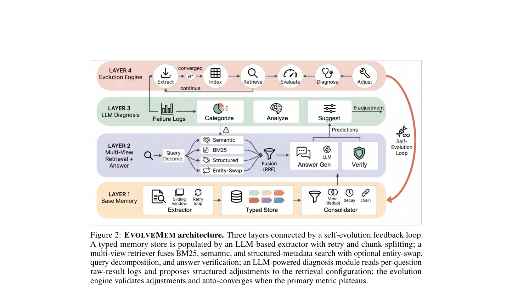
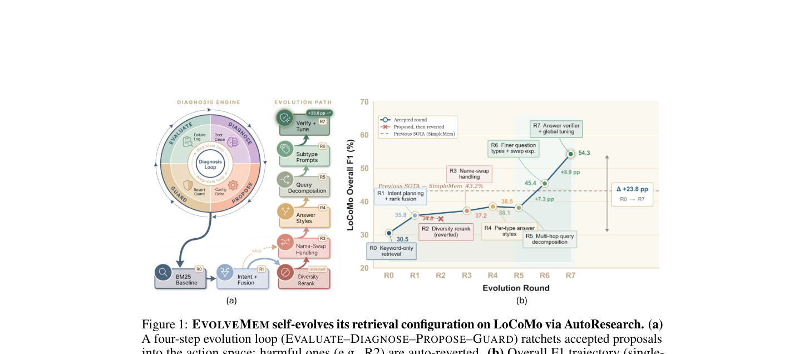

`evolvemem | EVOLVEMEM: Self-Evolving Memory Architecture via AutoResearch for LLM Agents | UNC-Chapel Hill · UC Berkeley · UCSC（Huaxiu Yao 组，aiming-lab/SimpleMem 谱系）| 2026-05·arXiv preprint v1·cs.LG | 主题线 L?（自进化记忆/检索基础设施 = "记忆系统结构自演化"线）· 相关性 High`

> 三标注约定：【原文】= 论文明说；【推断】= 我的有据判断(附依据)；【待核】= 拿不准的关键事实。

══ 第一层：一眼看懂 [light] ══

- 🟦 **TL;DR**：现有 agent 记忆系统只让"存的内容"随时间长大，但"怎么检索"那套配置（打分函数、融合权重、上下文预算、答案生成风格）从部署起就冻死不动。EVOLVEMEM 把整套**检索配置暴露成一个结构化"动作空间"**，再让一个 LLM 诊断模块去读每道题的失败日志、判断根因、提出针对性的配置改动；一个带护栏的"元分析器"把改动应用上去（变差就自动回滚、停滞就随机扰动探索）。这样系统就**自己对自己的检索架构做一轮轮"自动科研"**（observe→hypothesize→experiment→validate），从一个只有 BM25 的最弱基线出发，自动演化出有效检索策略。LoCoMo 上 F1 从 30.5% 涨到 54.3%（相对最强 baseline +25.7%），且演化出的配置能**正迁移**到另一个 benchmark（MemBench）。【原文 Abstract/§1】
- **最巧的一步**：把"检索配置"当成一等优化目标 + **诊断 rubric 用"失败模式"而非"具体 benchmark"措辞**（§3.3）。正因为 rubric 是按失败模式写的，诊断 LLM 可以**提出原动作空间里根本没有的全新维度**（self-expanding，如 entity-swap/query-decomposition/answer-verification），无需改 rubric。抽掉"诊断读失败日志"这一步，整个方法就退化成在固定动作空间里随机搜索——消融里"换成随机搜索 −9.63 F1"正好证明这一步是核心(Table 6)。

══ 第二层：为什么做（写透） ══

- **研究背景**：长期记忆是跨多会话 LLM agent 的地基（个人助理记几个月偏好、coding agent 跟踪项目决策）。近期记忆架构沿两条线推进——记忆**组织**（MemGPT 分层、Mem0/A-MEM 用知识图谱/关联网、SimpleMem 压缩成检索友好单元）与记忆**维护**(MemoryBank 遗忘曲线剪枝、各类去重合并)。【原文§1/§2】
- **解决的具体痛点**：所有这些系统共享一个被忽视的假设——**内容在演化，检索基础设施冻结**。当存储从几十条长到几百条异构记录，为小库标定的检索策略变得次优；而且不同题型本质需要不同检索策略（事实查找要精确关键词、时序推理要时间过滤、多跳要 query 分解、对抗性"换名"题要忽略人名只看语义内容）。一套冻结配置不可能同时最优服务所有需求。【原文§1/§3.2】
- **相关工作 & 各自不足**：
  - **自适应检索**(Self-RAG/CRAG/FLARE/Adaptive-RAG)：只自适应"何时/检索什么"或后处理过滤，**不调检索参数本身**(打分权重/融合模式/上下文预算)在部署生命周期内的取值。
  - **LLM 数据库调优 / RL 索引优化**(SIGMOD'25 等)：证明检索参数可从负载统计自动优化，但不是面向 agent 记忆的题型自适应。
  - **自改进 agent / AutoResearch**：Voyager(技能库)、ExpeL(经验洞察)、EvolveR(经验生命周期)、SkillRL(递归技能增强)、MemRL(episodic 记忆上 runtime RL)、**Memory-R1**[36]/**Agentic Memory(AgeMem)**[37]\(对记忆操作用 RL/GRPO)、MemEvolve(联合演化 agent 知识与记忆架构)。EVOLVEMEM 自称是首个把 AutoResearch 范式用到"**系统自身的检索基础设施**"这个研究对象上的工作。【原文§2，Table 1】
- **动机链**：内容会长大 → 但检索配置冻结 + 题型异构 → 单一冻结配置必然次优 → 需要系统**自主**观察自己的失败、假设根因、试改配置、只保留变好的 → 但标准超参搜索(grid/Bayesian)不适用(空间混合连续+离散、每个配置要跑一整遍评估、且**无法发明新维度**) → 所以用 **LLM 诊断模块**读失败日志做有信息的提议，并用元分析器加护栏验证。【原文§1/§3.3】
- **与最近邻工作的 Δ**：与 Memory-R1[36]/AgeMem[37] 这类"用 RL 学记忆操作"最像，但**关键差异**：它们优化的是**行为策略/存储内容/记忆操作**，EVOLVEMEM 把**检索机制本身**当研究对象，且**免梯度**(无 RL 训练、纯 LLM 诊断 + 离线评估循环)。这差异有用是因为：免梯度 → 可在部署系统上离线演化、还能自扩动作空间(发明新检索维度)，这是参数化 RL 难做的。【推断：依据 §2 对 Memory-R1/AgeMem 的归类("optimize behavioral policies or stored content") + EVOLVEMEM 全程无梯度训练描述】

══ 第三层：怎么做 + 靠不靠谱 ══

- **方法流水线（4 层 + 闭环，对应 Fig 2）**：
  1. **结构化记忆库(§3.1)**：每条记忆是元组 \(m=(c, e, τ, μ)\)——内容 c、稠密 embedding e、六类记忆类型 τ(episodic/semantic/preference/project-state/working-summary/procedural)、元数据 μ(importance/confidence/entity-reinforcement/抽取实体/topics/时间戳)。抽取用滑窗 + backbone LLM，配三道抽取护栏(失败重试、超长切子窗、覆盖验证器对参考关键词触发重抽)。巩固三遍：Jaccard>0.80 去重(留高 importance)、importance 线性衰减(0.05/天，地板 0.15)、实体强化(共现 +0.05，上限 0.30)。
  2. **检索层=可演化动作空间(§3.2)**：三视图独立出候选——lexical(BM25)、semantic(稠密 cosine)、structured-metadata(按实体/地点/人名过滤)；融合模式 \(\in\{\text{SUM, WEIGHTED-SUM, RRF}\}\)；最终排序 \(s = s_fuse + γ·importance + γ_r·recency + entity-reinforce\)(Eq.1)。两个可选 query 增强：**对抗 entity-swap**(剥离人名重搜再并集)、**query 分解**(LLM 拆多跳成单跳子查询再 RRF 合并)。答案生成可配风格(concise/explanatory/verifying/inferential) + 可选二次 verifier。**全配置** \(Θ = ⟨k_sem, k_kw, k_str, B_ctx, mode, {w_v}, σ, {θ_c}⟩\)(Eq.2)，每维都 clamp 到安全区间，且支持 per-category 覆盖。
  3. **自演化引擎(§3.3)**：目标 = 最大化 Q 上平均 score(F1)(Eq.3)。每轮写 per-question 原始日志(question/pred/gt/score/retrieved sources → \(raw_results.jsonl\))；诊断 LLM 用"失败模式 rubric"(错检实体/上下文不足/时序混淆…)输出结构化提议 Δ。**更新规则三分支**(Eq.4)：变差\(>\tau_{rev}\) → 回滚到 best-so-far；连续两轮几乎不变 → 加随机扰动探索；否则 → clamp 应用提议。若诊断发现记忆覆盖缺失 → 触发针对性重抽(Eq.15，闭合"评估→抽取"回路)。改进\(<\epsilon\)(0.5pp) 或到 \(R_{max}\) 即停。
- **逐组件必要性（消融 Table 6，全是从 full 系统移除后重跑演化）**：
  - **抽取质量控制(三护栏) −23.22 F1**——单项最致命，几乎砍半抽取产量，饿死检索器 → 抽取质量是一切下游改进的地基。
  - **semantic 检索 −10.32** > **BM25 −6.87** > **structured −2.33**，三视图都正贡献。
  - **LLM 诊断 vs 随机搜索 −9.63**——证明"读失败日志"提供了真信号(关键消融)。
  - 三个诊断发现的新维度(entity-swap/query-decomp/answer-verify)合计 −7.77，证明超出初始动作空间的价值。
  - 全关 baseline 30.50 → full 54.30(−23.80)，无单一组件主导(drop 跨一个数量级)。**消融做得相当扎实**。
- **关键机制直觉**：核心不是某个公式，而是"**把超参调优问题转成 LLM 读日志的诊断-提议问题**"。直觉：grid/Bayes 只能在你预先定义的网格里挪，而 LLM 读到"Cat.5 全是换名题、retrieved 全是错人"这种语义模式后，能**提议一个网格里不存在的操作**(剥离人名)。护栏(回滚/探索/clamp)则把"LLM 提议可能瞎搞"的风险兜住。
- **实验与证据**：
  - **数据集**：LoCoMo(10 对话/1986 QA，5 类：single-hop/temporal/multi-hop/open-domain/adversarial name-swap)；MemBench(7 LowLevel 类，评 28 样本=7×2×2)。【原文§4.1】
  - 两个 backbone(GPT-4o / GPT-5.1)。LoCoMo GPT-4o overall F1 0.543 vs SimpleMem 0.432(+25.7% rel)，最大涨幅在 temporal(+63.4%)/single-hop(+68.7%)；GPT-5.1 +36.8%。MemBench overall 67.9%/71.4%(+18.9%/+11.0% rel)。**支撑核心主张的关键实验 = Table 4 自演化轨迹**(R0 30.5%→R7 54.3%，逐轮记录诊断提议，R2 展示 revert 护栏回滚)。【原文 Table 2/3/4】
  - **跨 benchmark 迁移(Table 5)**：C_L(只在 LoCoMo 演化) zero-shot 到 MemBench 拿 0.543；C_LM(从 LoCoMo 继续在 MemBench 演化) MemBench 79.2% > 从头 C_M 67.9%(+16.6% rel)，且 LoCoMo 反升 0.543→0.593——**正迁移而非灾难性遗忘**，支撑"学到的是通用检索原则"主张。
  - **baseline 公平吗**：baseline 是公开记忆系统(Mem0/A-MEM/MemGPT/SimpleMem 等)，同 backbone 比，较公平【推断：依据 Table 2/3 同 backbone 列】。
  - **"看着强但没回答核心问题"的隐患**【推断】：MembBench 只评了 28 个样本(7×2×2)，统计力很弱；overall 差异可能受小样本噪声影响——这是该论文证据链最薄的一环【待核：作者未报置信区间】。
- **假设与失效边界**：
  - 【原文】Robustness(尤其 POST_PROCESSING)是最弱维度，失败定位到"相关记忆根本不在库里"——**检索级调整无法解决的覆盖缺失**(§4.2)。
  - 【原文】演化是**离线**的(需要带 ground-truth 的评估集 Q 跑多轮)——§2/Table 1 把它标为 "O.E. offline evaluation"。
  - 【推断】依赖一个足够强的诊断 LLM(用 GPT-4o/5.1 当诊断器)——弱 backbone 下诊断质量未验证；依据：全实验用大模型当诊断器，无小模型对照。
  - 【推断】"自扩维度"上限受 RetrievalConfig schema(Table 7)的可表达范围约束——诊断 LLM 只能在"可被解析成配置项"的空间里发明维度，不能改检索代码逻辑本身。依据：动作空间是结构化 config dict + clamp。
- **祛魅总结**：
  - **真贡献(硬货)**：① 把检索基础设施做成可演化动作空间 + 免梯度 LLM 诊断闭环这套**工程范式**确实新且有效，消融扎实；② "正迁移"实验(Table 5)是亮点，比单 benchmark 刷分有说服力。
  - **包装/营销成分**【推断】："AutoResearch"这个词被反复强调(observe-hypothesize-experiment-validate)，但本质是**带护栏的 LLM-guided 超参/配置搜索 + 触发式重抽**；"自主科研"的修辞略高于其技术实质(它不产生新假设的科学知识，只在固定 schema 里搜配置)。依据：§3.3 更新规则就是 revert/explore/apply 三分支，是受控搜索。
  - 作者**可能低估**了 MemBench 小样本带来的不确定性【推断，见上】。

══ 结构化抽取 ══

- 🎯 **机制速览 6 轴** [light]：

| 学什么信号 | 改什么 | 何时改 | 免梯度? | 记忆-技能生命周期 | 防遗忘机制 |
|---|---|---|---|---|---|
| 环境 reward(评估集 F1/EM) + LLM 自诊断(读 per-question 失败日志的根因) | **检索配置/harness**(打分权重、融合模式、上下文预算、答案风格、是否开 entity-swap/分解/verify) + 间接触发记忆库**内容**重抽 | **离线批量**(每轮跑完整评估集 Q 后演化，≤7 轮，收敛即停)；非 per-step | **是**(纯 LLM 诊断 + 受控搜索，无任何梯度/RL 训练) | 写入(滑窗抽取+三护栏)→检索(三视图融合)→遗忘(importance 线性衰减+地板)/淘汰(Jaccard>0.8 去重)/强化(实体共现+0.05)；技能=演化出的"检索维度"被 ratchet 进动作空间 | **几何共识式的"护栏"**：revert-on-regression(变差回滚 best-so-far)+ explore-on-stagnation(扰动)+ 跨 benchmark 正迁移(非灾难遗忘)；记忆层另有 importance 地板防有用记忆消失 |

- ⑦ **开源代码 + 框架/harness**：【原文】`https://github.com/aiming-lab/SimpleMem`(代码托管在 SimpleMem 仓内，EVOLVEMEM 是其 AutoResearch 演化版)。**框架=无 RL 训练框架/自研**——存储用 SQLite/FTS5，embedding 用 `BAAI/bge-base-en-v1.5`(768 维)，检索/演化全自研；不涉及 veRL/TRL/OpenRLHF 等(因为整套是免梯度 LLM 诊断循环，不训练参数)。【原文§4.1 Implementation】〔注：本子代理仅做深读抽取，未执行 clone 核验仓库可达性/框架文件——按 deep 档要求标注代码链接,clone 核验留 P3/主控〕
- 💰 **资源/成本与可扩展性**：【原文未给精确数字】演化 ≤7 轮、MembBench 仅评 28 样本、LoCoMo 1986 QA；每轮需一次完整评估遍历 + 诊断 LLM 调用 + 答案生成(可选二次 verify)。【推断】主成本是"每轮跑全评估集 × API 调用"——对大评估集会贵(每配置一遍 forward)；用 GPT-4o/5.1 当诊断器与答案生成器，API 成本是主项。附录 D.3 有 efficiency analysis(本次未读附录细节)〔待核〕。
- 🎯 **对"探索-巩固"idea 对标** [light]：**可借组件 + 部分竞品**。可借：① "revert-on-regression / explore-on-stagnation"这套**护栏式更新规则**可直接迁移到"巩固阶段如何安全接受/回滚一次参数或策略更新"——与本项目 forward-hard/backward-soft 的"有界更新"哲学同构【推断】；② "诊断 LLM 读失败日志→提议结构化改动"是一种**自反思信号生成器**，可作为探索阶段"在哪一步该接管/改路径"的根因定位模块。竞品向：它把"自演化"落在**检索 harness**而非**模型推理路径**上，与本项目"教 path-selection/path-recovery、改模型本身"是不同层面；缺口：它**免梯度、不碰模型参数**，无法回答"如何把演化出的策略蒸馏进模型权重"——正是本项目(MTP+OPD)要补的位。
- 🔭 **开放问题/未来方向**：【原文】把这套 AutoResearch 自演化扩到**动态场景**(在线流式)与**多模态**(§5；其 follow-up Omni-SimpleMem[12] 即多模态方向)。【推断】① 把离线演化做成**真在线/test-time** 的(现在依赖带 GT 的评估集，真部署无 GT 怎么诊断？)；② 诊断器换成**小模型**或可训练诊断头以降本；③ 把"演化出的检索策略"**蒸馏/固化进模型参数**(目前是外置 config，每次部署都要重演化或迁移 config)。

- 🖼 **关键图 top-2** [light]：

· 这是**原文 Figure 2**(架构主图)。表现了完整 pipeline 的"咬合"：LAYER 1 Base Memory(extractor→typed store→consolidate) → LAYER 2 多视图检索&答案(BM25/Semantic/Structured 融合→Answer Gen→Verify) → LAYER 3 LLM 诊断(读 Failure Logs→Categorize→Analyze→Suggest) → LAYER 4 演化引擎(Evaluate/Diagnose/Propose/Adjust)，右侧红色反馈箭头闭合"自演化回路"。选它因为它一张图把"内容层 + 检索层 + 诊断层 + 演化层"四级共演化的核心思想讲透——这是论文最精华的结构。

· 这是**原文 Figure 1**。左(a)是四步演化闭环 EVALUATE→DIAGNOSE→PROPOSE→GUARD，把被接受的提议 ratchet 进动作空间、有害提议(如 R2)自动回滚；右(b)是单 backbone GPT-4o 的 F1 轨迹 30.5%(baseline)→54.3%(R7)。选它因为它用最直观的方式证明"自主演化真的单调爬升 + 护栏会回滚坏改动"这一核心实证主张，对应正文 Table 4 轨迹。
