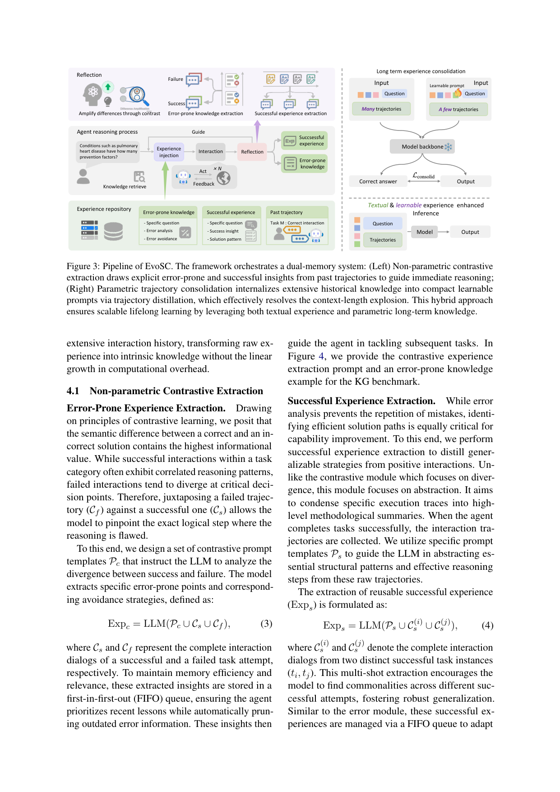
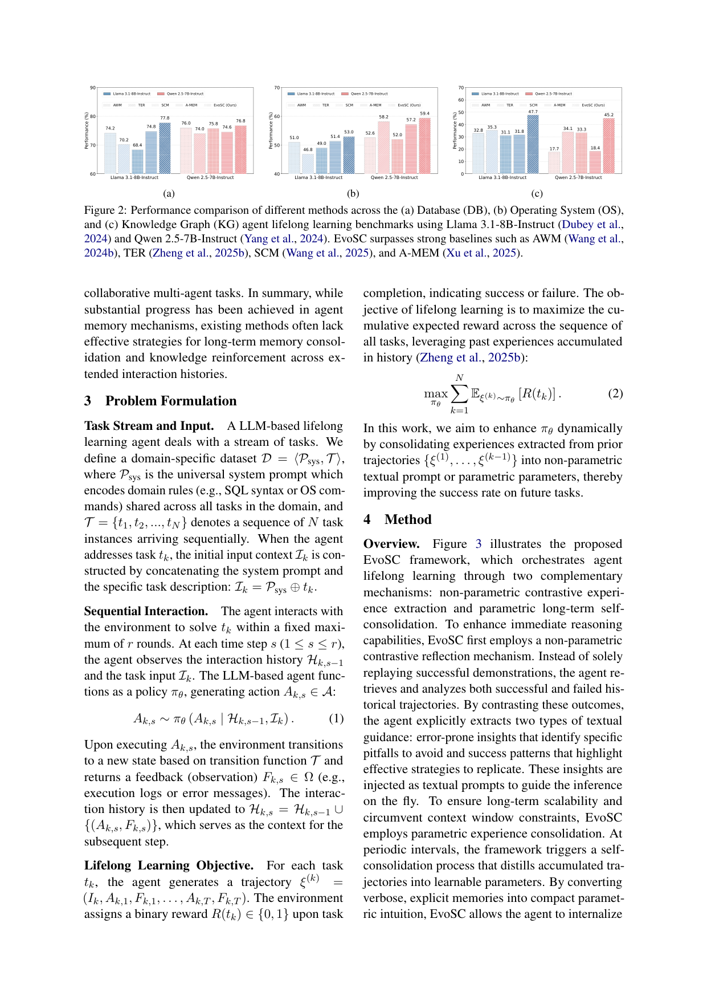

`evosc | Self-Consolidation for Self-Evolving Agents (EvoSC) | UCAS-Terminus AI Lab · HKISI-CAS · NJUST(Fei Zhu/Ling Shao 系) | 2026-02 arXiv v1 (2602.01966) · 预印本 | 主题线 L?·中-高相关`

> 一句话定位:把"成功+失败对比反思"得到的文本经验，进一步**蒸馏进一组可学习 prompt token(参数化记忆)**，让 agent 在 test-time 终身学习而不撑爆上下文窗。**这是少数把"非参记忆→参数记忆"做成 teacher-student 蒸馏的 agent 自进化工作**，与本调研"探索-巩固"中"巩固=参数化内化"一格高度契合。

══ 第一层：一眼看懂 [light] ══
- 🟦 **TL;DR**：LLM agent 终身做一串任务时，过去主流做法是"把成功轨迹检索回来当 few-shot"。两个毛病:(1) 只学成功、不学失败，反复踩同一个坑;(2) 轨迹越攒越多，塞不进上下文窗(论文里直接 OOM)。EvoSC 干两件事——① **对比反思**:把一条失败轨迹和一条成功轨迹摆一起，让 LLM 说清"错在哪一步、怎么避开"(error-prone insight)+"成功的套路"(success pattern)，做成文本经验；② **自巩固(self-consolidation)**:把"很多条历史轨迹"的推理逻辑，用 teacher-student 方式压进**长度=20 的可学习 prompt token Pθ**里(teacher 看 20 条轨迹给出"专家动作"，student 只看 8 条轨迹+Pθ 去逐 token 复现 teacher，CE 损失训练 Pθ)。推理时把 Pθ(隐式直觉)+ 文本经验(显式)拼一起喂模型。
- **最巧的一步**:**参数化轨迹巩固(PTC, §4.2)**。抽掉它，方法就退化成"又一个成功/失败文本回放"——而文本回放在 Exp 一多就 OOM(表1/表2 里 baselines 在 Exp=16/32 全线 OOM)。PTC 把"读了多少历史"和"占多少 token"解耦:无论历史多长，上下文长度恒定(论文称 "constant and efficient context length")。这是它相对 AWM/TER/A-MEM 唯一的硬性结构优势。【原文 §5.2 "Overcoming Context Limitations"】

══ 第二层：为什么做（写透） ══
- **研究背景**:LLM agent 多数是"任务隔离(task-isolation)"的无状态系统，每个 session 结束就重置，不会像人一样从经验里累积。终身学习/test-time 进化是把 static agent 变 adaptive agent 的核心能力(§1, §2.1)。
- **解决的具体痛点**(论文反复强调两条):
  1. **只学成功、不学失败**:AWM/TER/"Learning on the job" 这类只回放成功轨迹，失败里"在哪个决策点跑偏"的高价值信息被丢掉，导致重复踩坑(§1)。
  2. **上下文窗硬约束 + 噪声**:历史越攒越多，检索/回放只能截断或启发式选子集 → 丢跨任务依赖;塞太多 demo 又引入上下文噪声(cite Lost-in-the-Middle/RULER)，稀释注意力、反而掉点(§1、§2)。
- **相关工作 & 不足**:
  - *Agent 终身学习*:AWM(从过去抽可复用 workflow)、TER(直接存历史交互 example 建 memory repo)——**都只在文本/非参层面、且偏成功**(§2.1)。
  - *Agent 记忆*:MemoryBank、A-MEM(动态互联记忆网络)、SCM(agent+stream+controller 处理超长输入)——**缺"长期记忆巩固/知识强化"机制**(§2.2 末句明说 "lack effective strategies for long-term memory consolidation")。
- **动机链**:现状(检索成功轨迹当 demo)→ 缺陷1(漏掉失败的教学价值)+ 缺陷2(文本回放线性膨胀→OOM+噪声)→ 所以必须(a)对比成功/失败抽显式经验 (b)把海量历史**内化进参数**而不是继续塞 token。为什么不用更简单做法(只做 RAG/只做 SFT)?RAG 撑爆窗口且引噪;全量 SFT agent 轨迹昂贵且会灾难遗忘——它选了"轻量 prompt-tuning 式蒸馏"作折中。
- **与最近邻的 Δ**:最像 **TER(LifelongAgentBench 那篇的方法)** 和 **AWM**。关键差异:TER/AWM 经验全在上下文(非参)、Exp 多就 OOM;EvoSC 多出 **PTC 把经验搬进参数 Pθ**——这一个差异既解决 OOM(表1/2 里 EvoSC 在 Exp=32 仍能跑、baselines OOM)，又能"持续吃更多历史还涨点"(KG 上 Qwen +10.6%)。与 A-MEM 的 Δ:A-MEM 仍是结构化非参记忆网络，无参数内化。

══ 第三层：怎么做 + 靠不靠谱 ══
- **方法流水线**(Algorithm 1 推理工作流):
  1. **检索**:从成功库 Rsucc 取 top-K 最近成功对话 Crec_succ。
  2. **对比抽取(§4.1)**:Expc = LLM(Pc ∪ Crec_succ ∪ Cfail) 抽 error-prone insight;Exps = LLM(Ps ∪ Crec_succ) 抽 success pattern。两者各进一个 **FIFO 队列**(Qerr/Qsucc)——只留近期教训、自动淘汰旧错误。
  3. **参数巩固(§4.2，离线/周期性触发)**:对每条成功轨迹的每一步 s，teacher 用"多轨迹 Emany(20 条)+ 当前历史"生成专家动作 A*_{k,s}(Eq.5);student 用"少轨迹 Efew(8 条)+ 可学习 Pθ + 历史"复现 \hat{A}(Eq.6);损失 = 跨所有 round/token 的 CE，让 student(只靠 Pθ+少量轨迹)对齐 teacher(靠多轨迹)的逐 token 输出(§4.2 末公式)。**只训 Pθ(20 token)，backbone 冻结**【推断:正文称 "compact learnable parameters / learnable prompt"，未提改主干权重，判定为软提示微调；依据=Eq.6 仅 Pθ 为可学习量】。
  4. **增强推理(§4.3)**:最终输入 Ik = Pθ ⊕ Psys ⊕ Expc ⊕ Exps ⊕ Cs ⊕ tk(参数直觉 + 显式文本经验同时注入)。
  5. **更新仓库**:任务成功则全对话入 Rsucc、Exps 进 Qsucc;失败则 Expc 进 Qerr。
- **逐组件必要性(消融 表3 + 图6)**:
  - **EE(error-prone)**:去掉则无法识别/规避反复逻辑坑;DB 上 EE 单独已不错但 +SE 更好。
  - **SE(successful)**:去掉则学不到高效解题套路。EE+SE 优于任一单独(表3:Llama-DB EE+SE 平均 65.2 vs 单 EE 61.7 / 单 SE 62.2)。
  - **PTC(参数巩固)**:**最关键且唯一解决长程瓶颈**——去掉它在长程任务(KG)掉点最猛，且必然受 OOM 限制(图6:KG 上 EE+SE 在 Exp=16 直接 OOM=空白，+PTC 才能跑到 42.7/45.2)。三组件齐备 = 最优。✅ 消融充分。
  - ⚠️ 一处**不一致**:表3 Llama-DB，EE+SE(65.2)略高于 EE+SE+PTC(65.1)——即 DB(短程,3 round)上 PTC 没正收益、甚至 -0.1;PTC 的价值主要体现在**长程**(OS/KG)。论文未单独讨论这一逆转【推断:DB 任务短、历史本就塞得下，参数化内化的收益被信息损失抵消】。
- **关键机制直觉**:
  - *对比反思*为何有效:作者借对比学习直觉——"正确解之间相关、错误解在关键决策点发散"，把一对成败摆一起最能定位"恰好错在哪一步"(§4.1)。本质是让 LLM 自己做 credit assignment 的文本版。
  - *PTC 为何能压缩*:teacher 多看 12 条轨迹的"额外信息"被逼着塞进 20 个 token 的隐空间，等价于把"显式逐步推敲"蒸馏成"参数化直觉"(intuition-like)。直觉上类似 prompt-tuning/soft-prompt 把任务知识压进少量 embedding。
- **实验与证据**:
  - 数据集:**LifelongAgentBench**(Zheng 2025b)——DB(500 任务,3 round)、OS(500,5 round)、KG(396,15 round);backbone = Llama-3.1-8B-Instruct / Qwen-2.5-7B-Instruct;指标=任务成功率;3 seed 取平均;2×A40(48G)。
  - 支撑核心主张的关键实验:**表1/表2 随 Exp 增长的曲线**。EvoSC 平均增益:DB Llama +6.7、OS Qwen +4.4、**KG Llama +5.7 / KG Qwen +10.6**(KG 是长程、最能体现 PTC)。**最有说服力的一点**:Exp=16/32 时 baselines 普遍 OOM，EvoSC 仍能跑且继续涨——这是结构性优势而非调参。图5(DB,window=100)显示累计正确数曲线更陡更持续(Ours 各窗口 68/70/65/72/81 vs TER 48/27/50/41/46)。
  - baseline 公平性:同 backbone、同 round 上限、同 Exp 设置，比较 AWM/TER/SCM/A-MEM,**口径基本公平**。但⚠️ **EvoSC 的 teacher 用了 20 条轨迹、student 用 8 条**——在"Exp=32"这一列，EvoSC 实际是"12 条内化进 Pθ + 20 条上下文"，与 baseline"32 条全上下文"的算力/信息口径**不完全等价**;且 baseline OOM 时 EvoSC 因 token 恒定不 OOM，这既是优势也意味着"Exp=32 那一格"不是同等输入下的横比。
  - "看着强但没回答核心问题"的结果:OS 上增益较小(Llama Avg +1.7、Qwen +4.4)，DB Qwen 仅 +0.7——短程任务上参数化巩固优势不明显，**论文主卖点其实集中在长程(KG)**。
- **假设与失效边界**:
  - 【原文·§7 Limitations】检索机制偏简单，约束了推理上限;实验只到 7B/8B，未验证 70B+ 与更多架构的可扩展性(作者自陈这是首要 future work)。
  - 【推断】PTC 周期性触发需要"足量成功轨迹"做 teacher 监督——**冷启动/低成功率域**(KG Exp=0 时 Llama 仅 32.1%)，可巩固的成功轨迹稀少，参数化收益受限。依据:Eq.5 的 teacher 监督来自成功轨迹集 E。
  - 【推断】Pθ 是**domain-specific** 训练的(系统 prompt 编码 domain 规则)，跨域迁移能力未测;FIFO 队列会丢掉"久远但仍有用"的罕见错误教训。依据:§3 定义 D=⟨Psys,T⟩ 为 domain-specific，§4.1 明说 FIFO "automatically pruning outdated error"。
- **祛魅总结**:
  - 真贡献(硬货):**把 agent 终身经验做成"非参文本 + 参数 soft-prompt"双层，并用 teacher(多轨迹)→student(少轨迹+Pθ)的逐 token CE 蒸馏实现参数化内化**;以及"对比成败"而非"只回放成功"。前者是结构创新(恒定上下文长度)、后者是实用增量。
  - 包装/营销成分【推断】:① 反复类比"人类认知巩固(cite Nature Human Behaviour)"是修辞，方法本质就是 soft-prompt 蒸馏 + 文本反思，无神经科学机制对应;② "self-evolving / lifelong"标签下，**主干参数从不更新**——进化只发生在 20 个 prompt token 和两个 FIFO 文本队列里，"进化"幅度有限;③ Algorithm 1 文末把框架名笔误写成 "REC framework"(正文别处都叫 EvoSC)，且摘要/结论有重复病句("a dual-stage... a dual-stage agent evolution paradigm")——**写作完成度偏低**，提示这是早期预印本。

══ 结构化抽取 ══
- 🎯 **机制速览 6 轴** [light]：

| 轴 | 取值 |
|---|---|
| 学什么信号 | **环境 reward(二元成功/失败)** 触发轨迹归类 + **自反思**(LLM 对比成败抽 insight);teacher 动作作为蒸馏目标 |
| 改什么 | **参数(仅 20-token 可学习 prompt Pθ，主干冻结)** + **记忆(两个 FIFO 文本经验队列)**;不改主干权重、不改 harness |
| 何时改 | **混合**:文本经验=在线 per-episode(每完成一任务即抽 Expc/Exps 入队);参数 Pθ=**周期性/离线批量**("at periodic intervals" 触发 self-consolidation) |
| 免梯度? | **混合**:文本反思+检索=免梯度;PTC=**需梯度**(对 Pθ 做 token-level CE 反传) |
| 记忆-技能生命周期 | 写入(成功→Rsucc/Qsucc，失败→Qerr)→检索(top-K 最近)→**遗忘(FIFO 淘汰旧条目)**→巩固(成功轨迹周期性蒸馏进 Pθ);无跨 agent 共享 |
| 防遗忘机制 | **隔离式**(经验在外置队列/Pθ 中，主干不动→无主干灾难遗忘);**但 FIFO 本身会主动遗忘旧文本经验**;无几何共识/merging/KL 投影 |

- ⑦ **开源代码 + 框架/harness**:**未找到开源代码**。正文/摘要/脚注均未给 GitHub 链接，无 reproducibility 声明。训练框架未点名(只说 soft-prompt + token-level CE，2×A40);评测 harness 复用 **LifelongAgentBench**(Zheng 2025b 的现成 benchmark/环境)。【推断:实现极可能是自研脚本 + HF Transformers，依据=无框架声明且方法为标准 soft-prompt 训练】
- 💰 **资源/成本与可扩展性**:训练仅 2×NVIDIA A40(48G);只训 20 个 prompt token → 参数开销极小。最大卖点是**推理期上下文长度恒定**(不随历史线性增长)，因此避免 baselines 的 OOM。成本来源:周期性 PTC 需 teacher LLM 对多轨迹做前向(Eq.5)生成监督信号;对比抽取每任务额外 2 次 LLM 调用。仅验证到 7B/8B 规模(§7)。
- 🎯 **对"探索-巩固"idea 对标** [light]：**强支撑 + 可借组件**。
  - *支撑*:它正是"探索(agent 自己跑成败轨迹)→巩固(把经验内化进参数)"的一个完整实例，且明确把"巩固=参数化内化"与"非参文本"分层——与用户 TSRD/MTP-OPD 里"巩固阶段"的设计同构。
  - *可借组件*:(1) **teacher(信息多)→student(信息少+可学习载体)的逐 token CE 蒸馏**，可直接迁移成"MTP foresight 多步信息→当前策略 soft-prompt/logits"的内化器;(2) **对比成败抽 credit** 可作为 path-recovery 的"错在哪一步"文本先验;(3) FIFO 经验队列作为轻量记忆基线。
  - *竞品维度*:作为"agent 自进化"它和本调研其它记忆/技能类工作并列;但其参数化内化路线相对独特(多数同期工作停在非参文本记忆)。
  - *缺口*:无几何/merging 防遗忘(主干靠"不动"来免遗忘，等于回避问题);跨域/规模化未验证;PTC 与"探索"是离线解耦的，非在线 per-step 内化。
- 🔭 **开放问题/未来方向**:
  - 【原文 §7】更强的经验检索机制;扩到 70B+ 与更多 LLM 架构以释放参数化巩固潜力。
  - 【推断】把 PTC 从"离线周期"改为"在线增量内化"(每 episode 微调 Pθ)、解决 Pθ 自身的可塑性-稳定性权衡;让 Pθ 跨域共享/组合;失败轨迹也参与参数化(目前只成功轨迹做 teacher 监督)。
- 🖼 **关键图 top-2** [light]：

· 这是**原文 Figure 3(方法主图)**。左半=非参对比抽取(从成败轨迹抽 error-prone/successful 文本经验注入推理)，右半=参数轨迹巩固(many trajectories→learnable prompt→model)。选它因为它一图说清 EvoSC 的"显式文本+隐式参数"双层结构，正是本文最核心的机制咬合。

· 这是**原文 Figure 2(主结果柱状图)**，DB/OS/KG 三域、两 backbone 下 EvoSC(Ours) vs AWM/TER/SCM/A-MEM。选它因为它直观给出"EvoSC 在三域均超强 baseline、尤其 KG 长程涨幅最大"的核心证据——支撑 PTC 在长程任务上的关键价值。

──────────
【三标注小结】本笔记事实(数据集名/数字/公式/组件)均【原文】可锚定(§4.1-4.3、表1-3、图2/3/5/6);"主干冻结""DB 上 PTC 逆转""营销成分""自研实现"等判断标【推断】并附依据;无未解关键事实需【待核】。开源代码经正文核查为**未找到**(非编造,确属缺失)。
