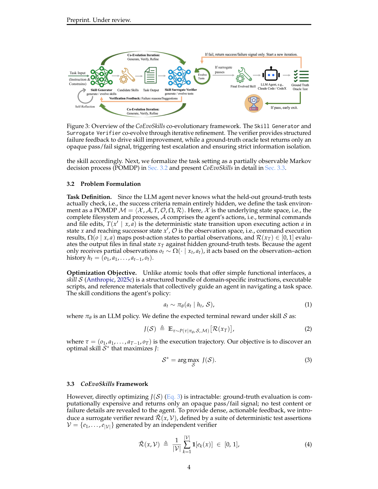
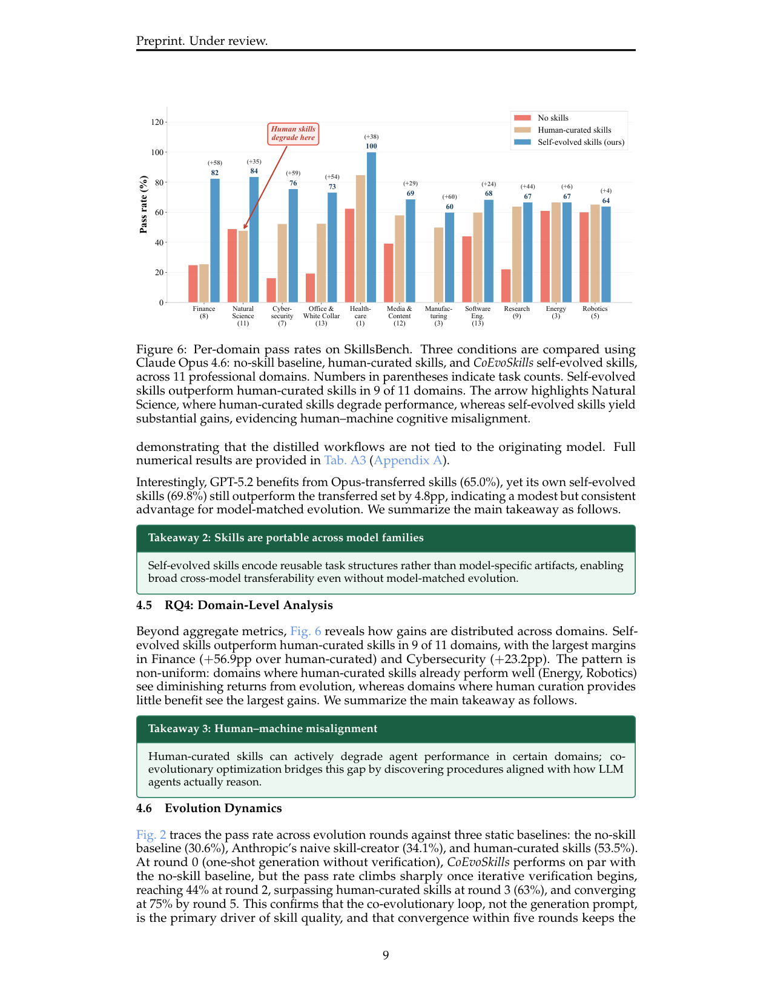

`evoskills_coevo | CoEvoSkills: Self-Evolving Agent Skills via Co-Evolutionary Verification | UIC + MBZUAI + McGill + Columbia + 浙大 + UBC(Hanrong Zhang, Yankai Chen, Philip S. Yu, Xiaoxiao Li 等) | 2026-04(arXiv v2, 2026-04-12) · Preprint(Under review) · v2 | 主题线 L?(技能自生成/演进 · 协同验证 self-evolving skills)·相关性 High`

> 一句定位:让 agent **自己生成"多文件 skill 包"(Anthropic 式 skill:工作流指令 + 可执行脚本 + 领域引用,而非单函数 tool)**——但一次性生成多文件包不可靠、真实世界又没有 ground-truth 反馈。CoEvoSkills 用**两个信息隔离的 LLM 协同进化**解决:Skill Generator 迭代生成/精化技能,Surrogate Verifier(独立 session、看不到 generator 的代码/推理,只看任务指令 + 输出文件)**自己合成测试断言**给出稠密的"逐断言失败诊断";一个 GT oracle 在干净环境重跑、**只回一个不透明 pass/fail bit**(不泄露测试内容,防过拟合),pass/fail 触发 verifier"升级测试"。5 轮内技能质量超人工。

---

## ══ 第一层:一眼看懂 ══

- 🟦 **TL;DR**:Anthropic 提出"skill"——比 tool 复杂得多的**多文件结构化包**(SKILL.md 工作流 + 脚本 + 领域参考)。但现在 skill 几乎全靠人手写:费力、不可扩、质量无保证,SkillsBench 上甚至有领域(如 Natural Science)装了人工 skill **反而掉点**(作者归因为"人机认知错位":人类直觉的工作流不匹配 LLM 实际怎么处理上下文/推理/执行)。现有"自演进 tool"的方法又只会一次性生成简单单函数,搞不定多文件包;有些还重度依赖 ground-truth 监督。CoEvoSkills 的做法:① **Skill Generator** 维护一个持久对话上下文(初始=任务指令 I + 一个领域无关的 meta-skill「skill-creator」),每轮读当前技能 + 累积的验证反馈,产出改进版技能并执行得输出文件;② **Surrogate Verifier**——一个**完全独立的 LLM session**,只看任务指令 I 和输出文件 x(看不到 generator 的代码/推理/技能内容,防确认偏误),据此**合成一套确定性测试断言 V**,算 proxy reward R̃=通过断言比例,并在失败时给**逐断言结果 + 根因分析 + 可执行修改建议**;③ 当 R̃=1(代理测试全过)才调 **GT oracle** 在全新环境 E′ 重跑,**只返回不透明的 pass/fail**(不给测试内容);若 oracle 仍失败,verifier 被迫"升级测试"(更多样/更难),generator 继续改。两者交替 generate–verify–refine。SkillsBench(87 任务/约 20 域,确定性 verifier)上:Claude Opus 4.6 + Claude Code 达 **71.1% pass rate(+40.5pp vs 无技能,+17.6pp vs 人工技能)**;Opus 学的技能迁到 6 个别家模型全涨 +36~44pp。

- **最巧的一步**:**"信息隔离的 surrogate verifier 自合成测试 + GT oracle 只给不透明 1-bit 触发 test escalation"** 这套**双反馈+信息隔离**抽掉就垮。① 去掉 surrogate verifier(只靠 oracle 的 pass/fail 演进)→ 71.1%**暴跌到 41.1%(−30pp)**(消融 Table B1)——因为没有逐断言诊断,generator 无法做"定向修复",只能瞎演进。② oracle 只给 1-bit 而非测试内容,是**防 generator 过拟合 held-out 测试**的关键设计;verifier 与 generator 信息隔离,是**防自我验证确认偏误**的关键。三者合起来才让"无 GT 反馈下的自演进"既稠密可用又不作弊。

---

## ══ 第二层:为什么做 ══

- **研究背景**:LLM agent 在推理/规划/工具调用上进步快,但**专业开放式任务**(复杂软件修复、多步科学分析、企业数据管道编排)远非孤立工具调用能解——要跨多步多 artifact 编排连贯过程(分解目标、协调工具、从失败恢复、校验中间输出),且长程、指令与脚本紧耦合、环境反馈稀疏/延迟。Anthropic 因此提出 **agent skill**:结构化的工作流指令 + 可执行脚本 + 领域参考包。SkillsBench 证明好 skill 能在广泛专业域显著超越"裸工具访问"。
- **解决的具体痛点**(§1):① skill 几乎全靠**人手写**——费力、难扩、无质量保证;② **人机认知错位**(Fig.6 实证):人工 skill 在某些域(Natural Science)**反而降性能**,因为人类设计的工作流/抽象不匹配 LLM 实际怎么处理上下文与执行;③ 现有"自演进 tool"方法有**根本性 tool–skill gap**:它们生来为**一次性生成简单自包含函数**,搞不定协调多文件(工作流+脚本+参考)的 skill 包;④ 部分工作(EvoSkill,Alzubi 2026)**重度依赖 ground-truth 监督做失败诊断**,真实世界拿不到这种信号时不适用。
- **相关工作 & 不足**(§2):
  - **SAGE**(Wang 2025,本调研 sage_skilllib):用 skill-integrated reward 训 agent,但产出仍是**单文件程序函数**,非多文件包。
  - **SkillRL**(Xia 2026):RL 把轨迹蒸馏进层次技能库,但**靠 teacher-guided 蒸馏 + 产 prompt 级启发式**,非可执行 artifact。
  - **AutoSkill**(Yang 2026)/ **AutoRefine**(Qiu 2026):抽可复用知识为 **prompt 模板**,非可执行包。
  - **SEAgent**(Sun 2025):把能力**内化进模型权重** → 不可检视、不可迁移;且依赖 GT 信号。
  - 共同缺口:① 多数自演进只产单 tool/函数 API/prompt 启发式,**无人能构造完整多文件 skill 包结构**;② 部分重度依赖 GT 失败诊断。CoEvoSkills 同时解决:迭代生成/演进**结构化多文件包** + 用**信息隔离的 surrogate verification** 提供结构化失败诊断,**不依赖 GT 信号**。
- **动机链**:专业任务需多文件 skill → 但一次性生成多文件包不可靠(覆盖缺口+逻辑错)→ 需迭代精化 → 但真实世界无 GT 反馈、oracle 只给 pass/fail → 稠密反馈从哪来?→ 引入 **surrogate verifier 自合成测试当 proxy reward** 提供逐断言诊断 → 但 proxy 必须忠实逼近隐藏的 GT(耦合优化问题)→ 用 **GT oracle 的不透明 1-bit 触发 verifier 升级测试**,且**信息隔离防过拟合/确认偏误** → 两者协同进化。为什么不用更简单的现成法?自演进 tool 法搞不定多文件包;依赖 GT 的失败诊断现实拿不到;纯自我验证有确认偏误。
- **与最近邻的 Δ**:
  - vs **EvoSkill(Alzubi 2026,本调研姊妹工作 skillgrad/相关)**:EvoSkill **重度依赖 GT 监督做失败诊断**;CoEvoSkills 用**信息隔离 surrogate verifier 自合成测试**替代 GT 诊断,**无 GT 依赖**。这是最关键 Δ。
  - vs **SEAgent**:SEAgent 内化进权重(黑箱不可迁);CoEvoSkills 产**可检视、可跨模型迁移的文本 skill 包**。
  - vs **SAGE / SkillRL**:它们产单文件函数 / prompt 启发式;CoEvoSkills 产**结构化多文件 skill 包**。

---

## ══ 第三层:怎么做 + 靠不靠谱 ══

- **方法流水线**(§3,Fig.3,Algorithm 1):
  1. **POMDP 形式化(§3.2)**:M=⟨X,A,T,O,Ω,R⟩,X=完整文件系统+进程,A=终端命令+文件编辑,R(x_T)∈[0,1] 用**隐藏 GT 测试**评最终输出文件。agent 只收部分观察(命令执行结果),按 observation-action 历史 h_t 行动。skill S **条件化策略** a_t∼π_θ(a_t|h_t,S);目标 S*=argmax_S J(S),J(S)=E[R(x_T)]。
  2. **难点**:直接优化 J(S) 不可行——GT 评估昂贵且只回不透明 pass/fail,不泄露测试内容/失败细节。
  3. **代理 reward(Eq.4)**:引入 surrogate verifier reward R̃(x,V)=(1/|V|)·Σ 1[e_k(x)]\(通过断言比例),V={e₁…e_|V|}=独立 verifier 生成的确定性断言集。但 surrogate 只在它忠实逼近隐藏 R 时有用 → 耦合优化:技能要最大化 proxy,proxy 又须对齐隐藏 GT。
  4. **交替优化(Eq.5–6)**:**Skill refinement** S^(i+1)←argmax_S R̃(Φ(S,E),V^(j))(固定 verifier 测试套件下,用 LLM 迭代采样近似 argmax);**Test escalation** 仅当"surrogate 全过但 oracle 失败"(R̃=1 ∧ R<1)触发,verifier **无 GT 测试内容访问**地独立强化测试。
  5. **Skill Generator(§3.3)**:持久上下文 C^(0)=(I, S_meta),S_meta=领域无关 meta-skill(教怎么造 skill,即 Anthropic skill-creator)。每轮 S^(i+1)∼π_θ(·|S^(i), C^(i+1)),C^(i+1)=C^(i)⊕F^(i,j)(把 verifier 的失败诊断 F=失败用例+根因+可执行修改建议追加进上下文)。执行 x^(i)=Φ(S^(i),E)。
  6. **Surrogate Verifier(§3.3)**:**完全独立 LLM session π_θ^V**,只观测 I 和输出文件 x^(i),**对 generator 的推理/代码/技能内容全盲** → 条件独立、不继承 generator 偏误。生成确定性断言套件,失败时给结构化诊断 F;迭代精化 V^(j+1)∼π_θ^V(·|I, x^(i), V^(j))。
  7. **协同进化(Alg.1)**:R̃<1 → 锁定 V、用 F 驱动技能修订;R̃=1 但 oracle 失败 → **只回不透明 1-bit**(防过拟合 held-out 测试),verifier 据更新的技能+输出**升级测试套件**(更多样/全面/难);R=1 → 早停;R>R_best → 存最佳快照。预算 N=5 oracle 干预、M=15 surrogate 重试、上下文占用上限 β=0.7(超则 break 防溢出)。
  8. **额外护栏(附录 E)**:**强制 progress checklist**(环境发现/技能创建/自反思/任务执行/总结全标完才允许升级到 oracle)——防"未走完完整演进流程就消耗 oracle"(Table E1 Round 2 surrogate 全过但 checklist 未完,不进 oracle)。

- **逐组件必要性(消融 Table B1,Opus 4.6 + Claude Code,单 run)**:
  - **去 surrogate verifier**(只靠 oracle 1-bit 演进 5 轮):71.1→**41.1(−30.0pp)** → **稠密逐断言诊断是核心**,没它无法定向修复。
  - **去 evolution**(只给背景上下文文档、不演进):71.1→48.6(−22.5pp,仍 +18 vs 无技能)→ 非结构化知识不够,**结构化打包+迭代演进**才行。
  - **无技能**:30.6(−40.5pp)。三档消融证据链完整(但 ablation 行因算力是单 run,std 未报)。

- **关键机制直觉**:把"自演进无 GT 反馈"做成**红蓝对抗 + 信息隔离的协同进化**。Generator=蓝队写技能,Verifier=红队**自己出考题**(合成测试)逐条挑错给改法;但红队也可能出错/出偏的题,于是请一个权威裁判(GT oracle)**只判过没过、不给答案**——红队全过却被裁判判挂时,说明红队的题不够狠,被迫加难。信息隔离=红队看不到蓝队的解题过程,只看交付物,既防串通(确认偏误)又防蓝队照着红队的题作弊。

- **实验与证据**(§4):
  - 数据集/设置:**SkillsBench**(Li 2026b,87 任务、约 20 专业域、每任务确定性 verifier、二值 pass/fail;**唯一专为评 agent skill 而建的基准**)。主指标 pass rate(reward=1.0 即全测试过的任务占比)。演进 backbone:**Claude Opus 4.6 + GPT-5.2**;surrogate verifier 用同 backbone;GT oracle agent harness:Opus 4.6→Claude Code,GPT-5.2→Codex。预算 K=5 oracle / M=15 surrogate;演进 timeout 5×(≈3000s/任务),评估 7200s/任务。主对比 5 run 报均值±std(ablation 单 run)。
  - **支撑核心主张的关键实验**:
    - ① **主对比 Fig.4(Opus 4.6 + Claude Code)**:CoEvoSkills **71.1%**;人工技能 53.5%;Anthropic skill-creator 仅 34.1%(几乎=无技能);**SkillsBench 自生成 32.0%、CoT-guided 自生成 30.7%**(都≈无技能 30.6%)。→ **增益来自迭代验证循环、不是 skill-creation prompt 本身**(无论生成策略如何,无协同验证都不够)。
    - ② **演进动态 Fig.2**:round0(一次性无验证)≈无技能;round2 升到 44%,**round3(63%)超人工技能**,round5 收敛 75%。每任务平均 4.1 验证 cycle / 2.4 evolution iter 收敛(附录 C),约 40% iter 仅由 surrogate 解决、不消耗 oracle → 5 轮收敛使成本可控。
    - ③ **跨模型迁移 Fig.5/Table A3**:Opus 学的技能迁到 GPT-5.2(+35.4)、Sonnet 4.5(+43.1)、Haiku 4.5(+44.1)、Qwen3-Coder-480B(+42.4)、DeepSeek V3-671B(+35.8)、Mistral Large 3-675B(+38.2),**全 +36~44pp** → 技能编码**可复用任务结构而非模型特定 artifact**。但 GPT-5.2 自演进(69.8)仍比迁移来的 Opus 技能(65.0)高 4.8pp → model-matched 演进有小幅一致优势。
    - ④ **逐域 Fig.6(核心发现)**:自演进技能在 **11 域中 9 域超人工**;最大差距 Finance(+56.9pp vs 人工)、Cybersecurity(+23.2pp);**Natural Science 人工技能反而掉点、自演进却大涨** → 实证"人机认知错位",这是全文最有辨识度的发现。
    - ⑤ **案例(附录 E,系外行星凌日周期)**:4 版演进(BLS→优化 BLS→中值滤波→**TLS+两阶段精化+别名校验**),GT 75%→75%→100%。**诚实揭示 surrogate-GT gap**:Round3 surrogate 15/15 全过但 oracle 仅 3/4(surrogate 用 1% 容差,oracle 要 5 位小数精确);Round5 surrogate 自己的 BLS 估 3.24158 vs agent TLS 3.24156,把 0.00002 天差判为失败——**说明 surrogate 既无法复现 oracle 精度、也无法区分"自身估计误差 vs agent 误差",GT oracle 作为权威裁判不可替代**。
  - **baseline 公平性**:同指令格式、同基准、5 run;baseline 含 Anthropic 官方 skill-creator(人交互步换成自主等价)+ SkillsBench 自生成 + CoT 自生成 + 人工技能,**覆盖全面**。
  - **"看着强但没答核心问题"风险**【推断】:(a) **只在 SkillsBench 单一基准**评估(作者自陈"唯一专为 skill 建的基准"),外部有效性受限;(b) **ablation 是单 run**(算力),−30pp 这种大效应虽可信但缺方差;(c) 10/87 任务始终未解(聚集在高 iter),即**难任务上演进会耗尽预算不收敛**(附录 C 诚实标注);(d) surrogate verifier 用**同 backbone**,信息隔离靠"独立 session + 只看输出"实现,但同模型可能仍有共享归纳偏置(论文论证 conditional independence,但未做"换不同模型当 verifier"的对照)。依据:§4.1 单基准、Table B1 单 run、附录 C 10 失败任务、Table A1 verifier 同 backbone。

- **假设与失效边界**:
  - 【原文】附录 C:高 iter(≥5 cycle)任务聚集失败——**难任务上演进耗尽 N=5/M=15 预算不收敛**。
  - 【原文】附录 E:**surrogate 无法复现 GT 的精确要求**(如 5 位小数),也**无法区分自身估计误差 vs agent 误差** → GT oracle 不可被 surrogate 替代;surrogate-GT gap 是结构性局限。
  - 【原文】Eq.4 注:surrogate 只在忠实逼近隐藏 R 时有用(耦合优化的内在脆弱性)。
  - 【推断】依赖**强 backbone**(Opus 4.6 / GPT-5.2)同时当 generator + verifier;弱模型可能既写不好多文件包也合成不出有效测试(迁移实验里弱模型如 Mistral 用迁移技能也只到 43.1%,虽 +38.2 但绝对值低)。依据:Fig.5 弱模型绝对 pass rate 偏低。
  - 【推断】SkillsBench 任务都配**确定性 verifier**(可二值判定),CoEvoSkills 的 surrogate"合成确定性断言"范式**天然适配可程序化验证的任务**;开放式/主观任务(无法写断言)上 surrogate verifier 失效。依据:§4.1 强调确定性 verifier。

- **祛魅总结**:
  - 真贡献(硬货):① **首个能让 agent 自生成/演进"结构化多文件 skill 包"**(相对只产单函数/prompt 的自演进法是实质前进);② **信息隔离的 co-evolutionary verification**——surrogate verifier 自合成测试给稠密诊断 + GT oracle 只给不透明 1-bit 触发 test escalation,**在无 GT 反馈下既稠密又防过拟合/确认偏误**,消融 −30pp 证明其核心性;③ **实证"人机认知错位"**(Fig.6 Natural Science 人工技能掉点而自演进涨)——一个有辨识度、对"该不该人工写 skill"有指导意义的发现;④ **跨 5 厂 6 模型 +36~44pp 迁移**证明技能编码可复用任务结构;⑤ **附录 E 诚实剖析 surrogate-GT gap**,科学态度好。
  - 包装/营销成分【推断】:(a) "co-evolutionary"听着对称,但**verifier 不优化技能性能、只优化"测试覆盖/难度"**,本质是"自动课程/对抗测试生成"而非两个能力体对等共进;(b) 单基准(SkillsBench)+ ablation 单 run,泛化与统计稳健性证据偏薄;(c) "self-evolving"由**冻结 LLM 按 prompt 迭代改文件 + meta-skill 引导**,非端到端学习,不动权重;(d) 模型名(Opus 4.6/GPT-5.2/Qwen3-Coder-480B 等)疑似化名/未来命名,版本待核。依据:Eq.5–6 verifier 目标是测试、§4.1 单基准、Table A1 全冻结 LLM。

---

## ══ 结构化抽取 ══

- 🎯 **机制速览 6 轴**:

| 学什么信号 | 改什么 | 何时改 | 免梯度? | 记忆-技能生命周期 | 防遗忘机制 |
|---|---|---|---|---|---|
| **Surrogate verifier 自合成测试的逐断言失败诊断**(根因+可执行修改建议,稠密)+ **GT oracle 的不透明 pass/fail 1-bit**(稀疏、权威、触发 test escalation);proxy reward R̃=断言通过率 | **改 skill 包(多文件:SKILL.md 工作流 + 可执行脚本 + 领域参考,LLM 文本/代码编辑)** + verifier 侧测试套件 V(协同进化);**base LLM 权重不改** | **离线批量·迭代演进**:每任务 generate–verify–refine 循环,平均 4.1 验证 cycle / 2.4 oracle 轮收敛(预算 N=5/M=15);部署 test-time 直接装好技能、不再演进 | **完全免梯度**——generator/verifier/oracle 均冻结 LLM 经 prompt 调用;"优化"=LLM 迭代采样近似 argmax | 写入=generator 据诊断迭代精化技能包;检索=部署时把演进好的 skill 包装入 agent(预装,非动态检索库);淘汰=保留最佳 oracle 快照(R>R_best 才更新 S*)+ 失败回退;共享=技能包**跨 5 厂 6 模型迁移**(可检视、可移植) | **GT oracle 快照(存最佳 S*)+ surrogate 接住回归**(附录 E Round5 surrogate catches regression)+ **成功测试约束**;**信息隔离**(verifier 不继承 generator 偏误)防自验证退化;base LLM 冻结天然不遗忘 |

- ⑦ **开源代码 + 框架/harness**:**项目页公开** https://zhang-henry.github.io/CoEvoSkills/(首页脚注给出;arXiv abstract 标注开源框架)。**框架 = 无外部 RL/训练框架**(不训练权重,纯冻结 LLM + prompt + 多文件编辑 + 自动测试合成);属**自研 co-evolutionary orchestration harness**——核心是 Skill Generator session + 信息隔离 Surrogate Verifier session + GT oracle 重执行 + progress checklist 编排器。**执行 harness(oracle 评估时按模型配)**:Claude Code(Opus 4.6 / Sonnet 4.5)、Codex(GPT-5.2)、**Terminus-2**(Haiku 4.5 / Qwen3-Coder / DeepSeek V3 / Mistral Large 3)。meta-skill=Anthropic skill-creator。〔仓库/项目页内部实现细节待核——本分析基于 PDF 正文+附录;**未 clone 验证**,P3.5 已标 has_code,具体代码结构以项目页/仓库为准〕

- 💰 **资源/成本与可扩展性**:**演进成本=训练时 LLM API + 沙箱执行**——每任务平均 4.1 验证 cycle、2.4 oracle 轮;timeout 5×(≈3000s/任务)、4 并行 worker;5 轮内收敛使成本"可控"(作者用语)。约 40% iter 仅 surrogate 解决、不消耗昂贵 oracle → surrogate 吸收大部分迭代成本。评估 7200s/任务、10 并行。**部署成本≈0 额外**:演进好的 skill 包预装进 agent,推理只多读技能文件。无 GPU/具体 token 数(全 API)。【原文 Table A1 / 附录 C】

- 🎯 **对"探索-巩固(TSRD / MTP+OPD)"idea 对标**:**可借组件 + 部分竞品 + 关键缺口**。可借:① **信息隔离的 surrogate verifier 自合成测试**——在缺 GT 反馈时提供稠密诊断,可迁到 TSRD"path-recovery 是否成功"难以直接判定时,用一个隔离的 verifier 合成"恢复是否到位"的检查断言,给稠密信号驱动巩固;② **"稠密 proxy(逐断言)+ 稀疏权威 1-bit(防过拟合)"双反馈**结构,正对你"探索时要稠密塑形、巩固时要权威不作弊"的张力——oracle 只给 1-bit 防过拟合 held-out 的设计尤其可借;③ **test escalation(自动课程/对抗测试加难)** 思想可迁到"逐步加难的 path-recovery 挑战";④ **progress checklist 护栏**(走完完整流程才消耗昂贵评估)是省算力的工程技巧;⑤ **最佳快照回退 + surrogate 接住回归**是现成防遗忘机制。竞品/缺口:CoEvoSkills 与 TSRD 都做"自演进 + 防退化",但 CoEvoSkills **零参数学习、产可检视外部技能包、依赖可程序化验证的任务**;TSRD 走**推理路径层 + MTP 前瞻 + OPD 参数蒸馏**。**关键缺口**:① CoEvoSkills 明确批评 SEAgent"内化进权重→不可检视/迁移"——而**你的 OPD 正是要内化进权重**,二者哲学相反,可作对照论证(你需回答"内化后如何保可检视/可迁移");② CoEvoSkills 无前瞻、无细粒度 path-selection——MTP-foresight 补此格;③ 其 surrogate-GT gap(附录 E)提示:**proxy 信号永远无法完全替代权威评估**,对你设计"探索阶段的代理 reward"是重要警示。

- 🔭 **开放问题/未来方向**:
  - 【原文】Conclusion:扩展到 **multi-model skill evolution**(多模型协同演进技能)。
  - 【推断】(a) 突破单基准(SkillsBench)→ 更多样/开放式任务,尤其**无确定性 verifier 的主观任务**上 surrogate 如何工作;(b) **缩小 surrogate-GT gap**(附录 E 的精度/估计误差问题);(c) 用**异构模型当 verifier**(当前同 backbone)进一步去偏;(d) 难任务上**预算自适应**(当前固定 N=5/M=15,10 任务耗尽不收敛);(e) ablation 补多 run 方差。依据:§4.1 单基准、附录 E gap、Table A1 同 backbone、附录 C 失败聚集。

- 🖼 **关键图 top-2**:

  
  这是**原文 Figure 3(方法主图/框架总览)**:左为 Task Input(指令+约束);中上 **Skill Generator**(读当前技能+累积反馈→产改进技能→执行得输出,带 Self-Reflection);中下 **Surrogate Verifier**(独立 session,只看指令+输出文件,合成测试断言、算 proxy reward、出结构化失败诊断回灌 generator);右为 **Ground-Truth Oracle Test**(干净环境独立重跑,"if surrogate passes"才触发,**只返回不透明 pass/fail**,据此 test escalation 并保证严格信息隔离)。选它因为一图说清本文最核心机制——**两个信息隔离 LLM 的 generate-verify-refine 协同进化 + 稠密诊断/稀疏权威双反馈**,以及"oracle 只给 1-bit 防过拟合"的关键设计。

  
  这是**原文 Figure 6(逐域分析/核心发现图)**:在 11 个专业域上对比三条件(无技能/人工技能/CoEvoSkills 自演进),括号内为任务数。自演进在 9/11 域超人工,Finance/Cybersecurity 差距最大;**箭头特别标出 Natural Science——人工技能在此降性能,而自演进技能大幅提升**。选它因为它把本文最有辨识度的论断"human–machine cognitive misalignment(人类直觉工作流不匹配 LLM 实际推理方式)"可视化成一眼可见的证据,直接支撑"agent 能造出比人更好的技能"这一 Takeaway。
