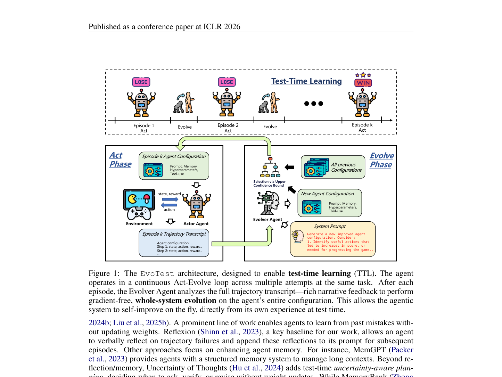
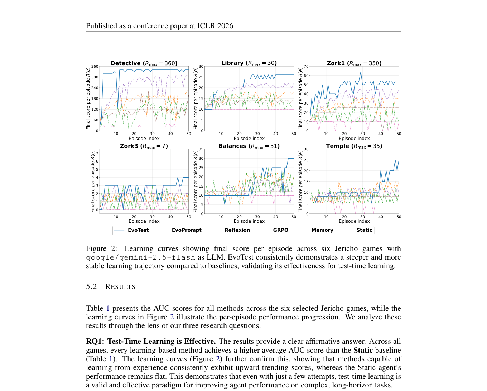

`evotest | EvoTest: Evolutionary Test-Time Learning for Self-Improving Agentic Systems | National University of Singapore + Microsoft Research（Yufei He / Bryan Hooi 组；与 JitRL 同谱系，含 Yibo Li/Tri Cao 共同作者） | ICLR 2026（arXiv:2510.13220 v2，2026-04-17 更新；v1 2025-10） | L1 免梯度·test-time 学习 + L6 harness 整体演化（触 L7 评测：自带 J-TTL benchmark） | 相关性 High（PLAN 七大种子之一）`

> 【档位】deep 全档。基于真实 PDF 正文（37 页：正文 §1–§6 + 附录 A–N）。三标注：【原文】/【推断】（附依据）/【待核】。

---

## ══ 第一层：一眼看懂 ══

- 🟦 **TL;DR**：【原文】当前 AI agent 部署后策略固定，像"聪明但没头脑的实习生"——同一个任务反复犯同样的错、不会临场变好。作者先造了个 benchmark **J-TTL**（Jericho 文字冒险游戏，让 agent 把**同一个游戏连打 K 个回合**，看它能不能一回合比一回合强）。然后提出 **EvoTest**：不微调、不动梯度，而是**每打完一回合就把整套 agent 系统"进化"一次**。具体由两个角色协作——**Actor Agent**(用固定配置玩一整局)和 **Evolver Agent**(读完整对局 transcript,提出一份改进后的新配置)。新配置同时**重写 prompt + 更新记忆(记成功/失败的 state-action)+ 调超参(温度/探索强度)+ 改工具使用规则**。在 J-TTL 上,EvoTest 全面超过反思/记忆/prompt 进化/在线微调,且是**唯一能通关两个游戏(Detective、Library)的方法**(所有 baseline 一个都没通关)。
- **最巧的一步**：【原文】**把"学习信号"从稀疏标量 reward 换成"整段对局 transcript 的叙事反馈",再用 LLM(Evolver)对它做语义级信用分配,一次性产出对 prompt/memory/超参/工具 四个轴的结构化编辑**——即 §5.3 说的"credit assignment via narrative analysis 而非 backpropagation"。**抽掉它就垮**:消融 Table 5 把 Evolver 的精细分析 prompt 换成"简单 mutation"(只说"分析轨迹生成更好 prompt"),Detective AUC 从 **0.94 暴跌到 0.65**(≈普通 EvoPrompt 水平)——证明增益**不是来自"演化 prompt"本身,而是来自 Evolver 对 transcript 的深度因果分析**。【推断】这是它区别于所有 prompt-only 进化法(EvoPrompt/Promptbreeder)的命门:把"读懂一局故事里哪步导致成败"这件难事交给强 LLM 做。

---

## ══ 第二层：为什么做（写透） ══

- **研究背景**：【原文】真正自主的 agent 需要人类那种"边做边学"的能力——试一次、反思成败、改策略、再试;但多数 agent 部署即定型(§1)。领域虽认识到这问题,却**缺一个专门测"会话内快速自我改进"的标准化 testbed**(§1)。
- **解决的具体痛点**：【原文 §1 用 Detective 游戏的"导航死循环"具体拆解为什么现有范式都不行】——agent 反复发无效指令 `GO WEST`(游戏回 "You can't go that way"):① **Static** 无学习机制,每局重犯;② **SFT(online)** 这种失败局里**没有好数据可学**,陷入"需要数据才能改进、但改进不了才生不出数据"的死锁;③ **RL(online)** 无效动作 reward=0,稀疏环境里这是弱信号,**单步噪声更新不足以纠偏(信用分配失败)**;④ **Reflexion** 改 prompt 但不改核心决策逻辑/工具用法;⑤ 高级**记忆系统**(MemGPT 类)能回忆信息但不教 agent "怎么换个方式行动"。两端——反思/记忆只动单一通道,RL/微调又太慢太吃数据,都不适合 test-time。
- **相关工作 & 各自不足**（§2）：
  - **从静态到 test-time 学习**:Reflexion(口头反思塞 prompt)、MemGPT/MemoryBank(管长上下文)、Uncertainty of Thoughts(不确定性感知规划)——都**不动权重但只动单轴**。
  - **自进化 agentic 系统**:prompt 自动优化 APE/OPRO、梯度启发 TextGrad、演化式 AlphaEvolve/Promptbreeder/EvoPrompt(维护 prompt 种群做变异/交叉)——【原文】**EvoTest 把"prompt 进化"推广到"整系统进化"**(prompt+memory+超参+工具),能做 prompt 编辑够不着的整体适应(如调探索强度)。EvoAgent/MASS 共享"统一优化"愿景。
- **动机链**：现状(agent 不会临场学)→ 缺测试床 → **先造 J-TTL** 暴露"单轴适应(反思/记忆/prompt)有性能天花板、RL 在稀疏奖励 + 极度数据稀缺下信用分配失败"→ 所以需要**(a) 用富信息的 transcript 替代稀疏 reward 做信用分配,(b) 整系统多轴同时进化,(c) 免梯度以满足 test-time 的速度/数据效率**→ 两角色 Actor/Evolver 解耦 + UCB 选配置。
- **与最近邻的 Δ**：
  - **vs EvoPrompt/Promptbreeder(最近邻,纯 prompt 进化)**:【原文】EvoTest 进化**四元组 χ=(prompt, memory, 超参, 工具)** 而非只 prompt;且 Evolver 做的是 transcript 级因果分析而非通用变异(Table 5 证明这是核心)。
  - **vs Reflexion**:Reflexion 只往 prompt 追加反思文本;EvoTest 还改记忆结构、温度、工具调用时机,是"多面手术"。
  - **vs JitRL(同组,互为 baseline)**:【推断】JitRL 在**输出分布层(logit)**做最小可证明干预、O(1) per-step;EvoTest 在**整 agent 配置层**做粗粒度、per-episode 的结构化重写——EvoTest 改的"面"更大(连工具/超参都动)、但更重(每回合一次 Evolver LLM 调用)、无理论最优性保证。两者是同一谱系的两个粒度极端。

---

## ══ 第三层：怎么做 + 靠不靠谱 ══

- **方法流水线**（§4，配 Figure 1，Act-Evolve 双角色循环）：
  1. **agent 配置 χ=(p, M, h, u)**（§4.1，可进化的"整系统"）：
     - **p 策略 prompt**：高层策略/启发式/护栏；
     - **M 部署期记忆**：结构化可查库——**success memory**（`(state hash, action)->score delta`，记导致加分的 state-action）+ **failure memory**（记停滞/负面模式,如某地点的重复动作循环）;
     - **h 超参**：温度、探索强度、停止准则;
     - **u 工具使用例程**：两类——*Memory Interaction Logic*(决策前查 M,命中 success 就把"被验证有效的动作"作为强提示注入 prompt) + *State Abstraction Logic*(**可进化的 Python 函数 state extractor**,把冗长 game history 解析成简短里程碑串如 "Milestone: Found the map.",每步注入,省得 LLM 重读全史)。
  2. **Actor Agent**：拿固定 χ^(e) 玩完整一局,输出轨迹 τ^(e) 和回报 R^(e)。
  3. **Evolver Agent**(由强 LLM o3 驱动):读 transcript τ^(e) + 父配置 χ^(e),做**整系统进化**,生成一组候选子配置,演化算子四种——**Prompt Mutation**(改写 p,加有效策略/禁失败模式)、**Memory Update**(程序化解析 transcript 填 success/failure 表)、**Hyperparameter Tuning**(如发现卡循环就调高温度)、**Tool-Use Refinement**(改查记忆的时机/强度)。
  4. **UCB 配置选择**（§4.3，Eq.5）：从{父配置}∪{子配置}里按 \(μ̂(χ) + β·sqrt(logN/(1+n(χ)))\) 选下一局用的单一配置——**性能项**复用好配置 + **探索 bonus**给试得少的新变异;关键作用是**稳定性安全网**:若新子配置初试侥幸高分后续拉胯,其 μ̂ 下降,UCB 自然"回退"到久经考验的父配置,防止走上坏的进化路径(贪心选择则会被一次幸运高分骗住)。
- **逐组件必要性（消融极充分，Table 3/4/5/6 + Figure 3）**：
  - **w/o Prompt**：掉最多（Detective 0.94→0.52）→ 进化高层策略是主驱动。
  - **w/o UCB**：AUC 掉(0.94→0.68),且 Figure 3 揭示**不稳定**——贪心选择会因 over-commit 高风险变异而灾难性掉分;UCB 提供回退安全网。
  - **w/o Memory / w/o Hyperpara / w/o Tool-Use**：分别小幅掉(0.94→0.82/0.89/0.91)→ 各有边际贡献,记忆 > 超参 > 工具。
  - **Evolver LLM 质量**(Table 4):o3(0.94) > r1(0.90) > qwen3-32b(0.82) > qwen3-8b(0.68) >> Static(0.21)——**性能随 Evolver 推理力单调上升,但即便 qwen3-8b 也远超 Static**(框架本身有效,强 Evolver 是放大器)。
  - **结构化 vs 简单 mutation**(Table 5):0.94 vs 0.65 → Evolver 的精细分析是核心(见"最巧一步")。
- **关键机制/直觉**：把"梯度反传分配信用"换成"LLM 读故事分配信用"——Evolver 像个赛后教练,看完录像指出"你在这卡了循环、那一步加分是因为先 examine 了物体",然后同时改战术板(prompt)、笔记(memory)、打法激进度(温度)、看笔记的习惯(工具)。UCB 是"别 all-in 一个新战术,留着老战术兜底"。
- **实验与证据**（§5）：
  - **设置**：Actor 用 gemini-2.5-flash(G)/claude-4-sonnet(C);Evolver 用 **o3**;微调 baseline(SFT/GRPO)在 qwen3-32b。6 个 Jericho 游戏,K 回合,指标 **AUC**(归一化:Σ R^(e)/(K·Rmax),0–1)+ 学习曲线。
  - **支撑核心主张的关键实验**：**Table 1**——EvoTest 六游戏全 SOTA,平均 AUC **0.47/0.50**,vs 次优 EvoPrompt 0.34/0.36(**+38%**)、vs GRPO(online) 0.30(**+57%**);**唯一通关 Detective+Library**。**Figure 2** 学习曲线显示更陡更稳。
  - **RQ3 关键对比(免梯度 vs RL)**:EvoTest 0.47/0.50 >> GRPO(online) 0.30——作者归因于**用 transcript 叙事反馈做信用分配**比稀疏标量 reward 数据效率高得多(一局复杂成败,RL 只得一个噪声标量,EvoTest 能语义解析出因果链)。
  - **公平性补强(很诚实)**:Table 6 **统一 Actor 为 qwen3-32b**——EvoTest(Actor+Evolver 都 qwen3-32b)0.35 仍 > GRPO 0.31;再换强 Evolver(o3)升到 0.40。这回应了"是不是靠更强模型赢"的质疑:同 Actor 下仍赢,但**强 Evolver 确实是重要增益来源**。
  - **效率**(Table 2):EvoTest 每次更新一次 LLM 调用、20–30 秒;SFT/GRPO 在 4×H100 上 5–10 分钟——**免梯度法在 test-time 速度上碾压**。
  - **"看着强但没答核心问题"的隐患**【推断】:(a) Zork1/Temple 上 EvoTest 绝对 AUC 仍很低(0.14/0.31),即**最难的长程游戏远未解决**,头条"全面 SOTA"在这些游戏上只是"矮子里拔将军";(b) 整套系统**重度依赖一个非常强的 Evolver(o3)**,Table 4 显示换弱 Evolver 收益骤降——真正的"智能"很大程度在 Evolver 而非 Actor。
- **假设与失效边界**：
  - 【原文】环境是**可重置到同一初始状态**的同一游戏(§3,s_0=s_init 对所有回合)——【推断】这是 J-TTL 的设计前提,保证"提升只来自学习";但现实任务往往不可逐字重置、不重复,EvoTest 的"同任务多回合进化"范式**在不可重复任务上不直接适用**。
  - 【原文+推断】依赖 transcript 是**人类可读的叙事**(Jericho 文字游戏天然如此)——Evolver 靠语义分析 transcript;若环境反馈非自然语言(如纯数值/图像状态),Evolver 的信用分配能力会打折。
  - 【原文】**强依赖 Evolver LLM 能力**(Table 4),弱 Evolver 收益骤降——非"免费的午餐",Evolver 本身要烧强模型推理。
  - 【推断】配置进化是**粗粒度、不可证明最优**(对比 JitRL 的闭式解);UCB 在 K 较小(论文 K≈50)时探索-利用平衡靠 β 调,长程下行为未充分验证。
- **祛魅总结**：
  - **真贡献(硬货)**:① **J-TTL benchmark**——填补"会话内 test-time 学习"标准测试床空白,本身是可复用资产;② "**whole-system evolution**"——首个把 prompt+memory+超参+工具**联合进化**的免梯度框架,且消融(Table 3/5)干净地证明"多轴 + Evolver 深度分析"缺一不可;③ "credit assignment via narrative analysis"这一视角(用 transcript 替代稀疏 reward)概念上有启发,数据效率论证(vs GRPO)扎实;④ UCB 安全网设计解决了演化不稳定这一实际痛点(Figure 3)。
  - **包装/可能高估**【推断】:(a) "self-improving without gradients"成立,但**智能主要集中在外置 Evolver(o3)**,Actor 几乎没变强——更像"用强模型在线优化弱模型的脚手架配置",而非 Actor 本身的自进化;(b) "全面 SOTA"在最难游戏(Zork1 0.14)上几乎无意义,长程任务远未解决;(c) 每回合一次强 LLM 调用做整系统重写,**回合数一多 Evolver 成本累积**(Table 2 只算单次,未算整 session 总成本)。

---

## ══ 结构化抽取 ══

### 🎯 机制速览 6 轴
| 维度 | 内容 |
|---|---|
| **学什么信号** | **整段对局 transcript(叙事反馈)**——Evolver LLM 对其做**语义级信用分配**(找成败因果链),而非稀疏标量 reward;辅以 success/failure state-action 记录 |
| **改什么** | **整套 agent 配置 χ=(prompt p, 记忆 M, 超参 h, 工具例程 u)** 全部可改——**多轴联合**:重写 prompt + 填记忆 + 调温度/探索 + 改工具(含一个可进化的 Python state-extractor 函数);**LLM 参数冻结、不动 logits** |
| **何时改** | **在线 per-episode**(每打完一回合,Evolver 进化一次配置,UCB 选下一回合用哪个)——回合间更新,非 per-step 也非离线批量 |
| **免梯度?** | **是**(无微调、无梯度;backbone 固定;学习=一次 Evolver LLM 调用做结构化配置编辑) |
| **记忆-技能生命周期** | 写入:Evolver 程序化解析 transcript,把加分 state-action 入 success 表、停滞模式入 failure 表;检索:决策前 Memory Interaction Logic 查库,命中则把有效动作作强提示注入 prompt;遗忘/淘汰:**无显式遗忘**(记忆累积);共享:配置作为整体被 UCB 选择继承(子配置继承父记忆) |
| **防遗忘机制** | **隔离式(不动权重→无灾难性遗忘)** + **UCB 回退安全网**(新坏配置 μ̂ 下降→自动退回久经考验的父配置,防演化走偏/灾难性掉分,Figure 3)——这是它独有的"配置层防退化"机制 |

### ⑦ 开源代码 + 框架/harness
- 【原文】代码:**https://github.com/yf-he/EvoTest**(脚注 1 + Reproducibility Statement 均给出,含 EvoTest 框架 + J-TTL benchmark + 所有 baseline 实现)。
- 框架/harness:【原文+推断】**自研 agent harness**(Actor/Evolver 双角色 + UCB 配置管理 + 可进化 Python state-extractor);环境=Jericho(github.com/Microsoft/jericho)。**非训练框架**;微调 baseline(SFT/GRPO)另在 qwen3-32b 上跑(需 4×H100)。LLM 走 API:Actor=gemini-2.5-flash/claude-4-sonnet,Evolver=o3。**本次未 clone**(P4 仅核 PDF;实现细节见 repo 与 Appendix C/H/J)。〔待核:仓库实际依赖/完整度——未访问〕

### 💰 资源/成本与可扩展性
- 【原文】Table 2:EvoTest 单次回合间更新 = **1 次 LLM 调用、20–30 秒**;对照 SFT/GRPO(online)在 **4×H100 上 5–10 分钟**。
- 【推断】主要成本=每回合一次**强 Evolver(o3)**调用读全 transcript(token 量大),整 session(K≈50)累积成本论文未汇总〔待核〕;无 GPU 训练需求。可扩展瓶颈:Evolver 必须强、transcript 须可读、任务须可重复。

### 🎯 对"探索-巩固"idea 对标
- **可借组件(主要) + 部分竞品**:
  - **强可借组件**:① **UCB 配置选择 + 父配置回退安全网**——直接可作"探索期"的探索-利用调度与防退化机制(对应用户 idea 的"在线探索"如何不发散);② **success/failure 双记忆 + state-action 信用记录**可作经验载体;③ "**credit assignment via narrative analysis**"(用富文本反馈替代稀疏 reward)这一思想,可指导"探索期如何从一次 episode 提炼高质量信号";④ 可进化的 **state-extractor(状态抽象函数)** 与 JitRL 的结构化状态、用户 idea 的状态表示同源。
  - **与"探索-巩固"的关系**【推断】:EvoTest 是**纯探索式的整系统在线适应**,**完全没有"巩固进权重"那一半**——所有改进停在"配置(prompt/memory/超参/工具)"层,backbone 永远不变。与 JitRL(logit 层)、Training-Free GRPO(经验库层)并列为"免梯度探索"的三种粒度,但 EvoTest 粒度最粗(连 harness 都动)。
  - **缺口/对标价值**:对"探索-巩固"若主张"离线几何共识把探索成果固化进参数",EvoTest 提供了一个**强力的"纯配置进化、不碰参数"对照基线**——必须正面回答"为什么要固化进权重,而不像 EvoTest 一样把一切留在可进化配置里"(权重固化的代价是遗忘风险 + 训练成本,收益是推理时零额外开销 + 知识真正内化)。EvoTest 同时证明了"多轴联合进化 > 单轴",提示"探索-巩固"若只调 logit 单轴可能有天花板。

### 🔭 开放问题 / 未来方向
- 【原文】§6 结尾:为**极长程任务(extremely long-horizon)**构建自进化 agent。
- 【推断】① **不可重复/不可重置任务**下的 test-time 学习(脱离 J-TTL 的"同游戏重打"假设)。② **降低对强 Evolver 的依赖**:弱 Evolver 也能做好信用分配。③ **Actor 本体的进化**:目前 Actor 不变强,如何把配置层的进化成果固化为 Actor 能力(与"探索-巩固"巩固期的结合点)。④ 整 session 的 Evolver 成本控制 + 配置记忆的遗忘/容量治理(当前只增不删)。⑤ 最难长程游戏(Zork1 等)AUC 仍极低,核心难题未破。

### 🖼 关键图 top-2

- 这是**原文 Figure 1**(方法主图/架构)。上方:agent 在同一任务上反复 Act→Evolve→Act 循环(Test-Time Learning);下方两角色——左 **Actor Agent** 用固定配置玩出 Episode k 轨迹,右 **Evolver Agent** 读完整 transcript + 旧配置,生成 **New Agent Configuration**(Prompt/Memory/Hyperparameters/Tool-use),再经 **UCB Selection** 从所有历史配置里选下一局用的。**选它**:一图说清"整系统进化 + 两角色解耦 + UCB 选择"三大支柱,是抽取 6 轴(改什么/何时改/生命周期/防遗忘)的唯一依据图。

- 这是**原文 Figure 2**(核心结果图)。6 个游戏(Detective/Library/Zork1/Zork3/Balances/Temple)各一张"每回合最终分 R(e) vs 回合序号"曲线,EvoTest(最上方曲线)相对 EvoPrompt/Reflexion/GRPO/Memory/Static **学习曲线更陡、收敛更稳**。**选它**:直观呈现"test-time 多回合内确实越打越强"这一核心主张,也暴露失效边界——Zork1/Zork3 等最难游戏所有方法都贴近底部(头条 SOTA 在难游戏上有限),是判断方法真实边界的关键证据图。
