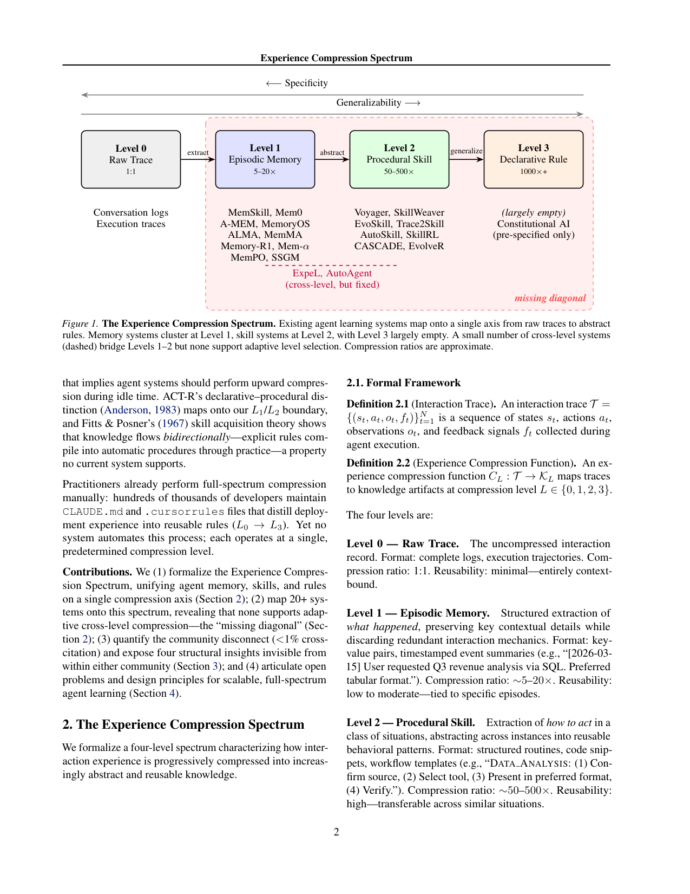

`exp_compress_spectrum | Experience Compression Spectrum: Unifying Memory, Skills, and Rules in LLM Agents | AWS Generative AI Innovation Center + HSBC Technology Center China (Xing Zhang, Guanghui Wang, Yanwei Cui, Wei Qiu, Ziyuan Li, Bing Zhu, Peiyang He) | 2026-04 · arXiv:2604.15877v1 [cs.AI] · Position/综述 | L3,L2,L7(技能/记忆/规则统一)· Med`

> 档位:deep(三层精读 + 完整结构化抽取)。基于 PDF 正文(8 页)。**这是 position/框架论文,无方法实现、无本文自身实验**(作者自承"conceptual rather than empirically validated");第三层"实验与证据"以"作者承认无实证 + 借来的跨级证据 Table 1"为核心事实。

══ 第一层:一眼看懂 ══
- 🟦 **TL;DR**:提一个**统一视角**——agent 的**记忆 / 技能 / 规则**其实是"把交互经验压缩成可复用知识"这同一件事在**不同压缩率**上的三个点,串成一条**经验压缩谱(Experience Compression Spectrum)**:Level0 原始 trace(1:1)→ Level1 情景记忆(5–20×)→ Level2 程序性技能(50–500×)→ Level3 声明性规则(1000×+)。压得越狠越通用、越省 context/检索/算力,但越缺具体可执行性。论文做了个扎心的发现【原文 §1】:**memory 社区和 skill 社区在解同一个问题,却几乎不互引(1136 篇引文跨社区引用率 <1%)**。把 20+ 系统映到谱上发现**每个系统都固定在某一压缩档,没有一个支持自适应跨档压缩**——这个空白叫 **"missing diagonal(缺失的对角线)"**。还指出:评测方法与压缩档强耦合、可迁移性随压缩升高但牺牲特异性、知识生命周期管理被普遍忽视。
- **最巧的一步**:**用单一"压缩率"轴把记忆/技能/规则三个割裂社区统一**(§2 形式化:经验压缩函数 \(C_L:T\to K_L,\ L\in\{0,1,2,3\}\))。抽掉这条压缩轴,论文就只剩"两社区不互引"的吐槽,失去解释力;正是这条轴让"missing diagonal(无系统能自适应选档/跨档压缩)"这个 gap 变得可见且可命名——这是它最核心的概念贡献。

══ 第二层:为什么做(写透) ══
- **研究背景**:【原文 §1】LLM agent 从单 session demo 走向持久长程多 session 部署,**累积海量交互经验**——一个每天处理上千任务的 agent 产出的 trace 很快撑爆任何实际 context window 或检索预算,**高效经验管理成了一阶可扩展性挑战**。两个研究社区各自应对:**agent memory 社区**(MemGPT/Mem0/MemoryOS…)做经验知识的抽取与检索;**agent skill 社区**(Voyager/SkillWeaver/EvoSkill…)做从执行 trace 发现/复用程序能力。
- **解决的具体痛点**:【原文 §1】尽管在解**同一个根本问题**(从交互经验抽可复用知识),这两个社区**惊人地脱节**——1136 篇引文跨社区引用率 **<1%**(memory 引 skill 0.7%=4/566,skill 引 memory 1.2%=7/570;两篇 skill survey 零引 memory,仅一篇 memory survey 引了 skill 且只引 Voyager)。这个割裂反映**一个概念缺口**,限制了可扩展 agent 系统的设计。更具体的工程痛点:**L1-only 系统在 scale 上撑不住**——每天累积上千条情景记忆,存储/检索成本线性增长,几周内耗尽检索预算、无关条目稀释有用知识。
- **相关工作 & 各自不足(本篇即"对相关工作的统一再框定")**:【原文 §2.3 Table 2】把 20+ 系统映到谱上——**L1 聚 10 个**(Mem0/A-MEM/MemoryOS/Memory-R1/Mem-α/MemPO/ALMA/MemMA/SSGM/MemSkill,机制从 LLM 抽取到 RL 优化记忆操作不等,但都输出结构化情景记录);**L2 聚 8 个**(Voyager/SkillWeaver/EvoSkill/CASCADE/AutoSkill/Trace2Skill/SkillRL/EvolveR);**cross-level L1↔L2 仅 2 个**(ExpeL/AutoAgent,但用预定档、无自适应选择,是"双速系统而非连续谱");**L3 几乎空**(Constitutional AI 用预设规则、reward shaping 是人设计的,**无系统从 agent 经验自动抽规则**)。各自不足:**每个系统输出格式 a priori 固定在一档**,且**两社区独立重复解同样的子问题**(增长知识库上的检索、矛盾条目检测、过时识别、下游效用评估)却不共享方案。
- **动机链**:现状(memory 与 skill 两社区各自繁荣,但几乎不互引、各固定在一压缩档)→ 缺陷(① 看不到二者是同一压缩操作的不同档 → 重复造轮子;② L1-only 在 scale 上必然爆,无系统自适应向上压缩)→ 所以必须**用一条压缩轴统一三者**,把"该把经验压到哪一档"变成可研究的 meta 问题(missing diagonal)。为什么不用更简单的现成做法(各社区继续各做各的)?——【原文 §3.1】真实部署**两者都需要**(只抽 workflow 忘了用户偏好不完整;只记 context 不巩固复发模式会撑爆检索预算);**专业化不足以解决共享子问题**,统一架构(level-specific compressor 共享 retrieval/conflict/lifecycle 基础设施)能避免跨社区冗余工程。
- **与最近邻工作的 Δ**:最像的是**各类 skill/memory survey**(同为综述梳理)。关键 Δ:别的 survey 在**各自社区内**做 taxonomy,本文用**单一压缩率轴跨社区统一**,从而让两个原本看不见的东西可见——(1) **跨社区 <1% 互引的量化脱节**;(2) **missing diagonal(无自适应跨档)**。为什么这差异有用?——它不只是描述性分类,还**生成可证伪的预测**(§3.4 testable predictions:L2 跨域迁移应胜 L1 检索;L1+L2 多级库应胜单档且 gap 随部署时长扩大;迁移-特异性曲线应是凹的、L2 是甜点;L3 规则当约束比当指令更有用),这把它从"taxonomy"提升为"design tool"。

══ 第三层:怎么做 + 靠不靠谱 ══
- **方法流水线**:**本篇无方法实现**——它是 position 论文,产出是"框架 + 分析 + 开放问题 + 设计原则",不产出系统。其"流水线"是概念性的:**① 形式化压缩谱(§2.1)**:Interaction Trace \(T={(st,at,ot,ft)}\) → 经验压缩函数 \(CL:T→KL\),\(L\in\{0,1,2,3\}\)(L0 原始 1:1 / L1 情景记忆 5–20× / L2 程序技能 50–500× / L3 声明规则 1000×+);**强调不是顺序 pipeline**——系统可 L0→L3 直压,也可同时维护多档,谱描述的是 output space 而非处理顺序。**② 映射 20+ 系统(§2.3 Table 2)**:发现都固定在一档 → **③ 命名 missing diagonal(§2.4)**:缺三种能力——自适应选档、向上 promote(many memories→one skill→one rule)、向下 demote(规则太抽象时退回)。**④ 四个结构洞察(§3)** + **⑤ 三个开放问题 + 三条设计原则(§4)**。
- **逐组件必要性**:不适用(无组件/无消融)。但**核心概念的必要性**可论证:**压缩轴**是统一的支点(没它无法跨社区比较);**missing diagonal** 是诊断结论;**四洞察**(专业化不足/评测档耦合/迁移随压缩升/生命周期被忽视)各自有"借来的证据"支撑(见下)。
- **关键机制/直觉**:核心"机制"是**用一个标量(压缩率)给异构知识形式排序**。直觉:**记忆=低压(保具体)、技能=中压(抽程序)、规则=高压(留原则),压得越狠越通用越省 token 但越难直接执行**——于是"巩固"在此被重新定义为"沿谱向上压缩",而"该压到哪档"是个 **meta-learning / value-of-information 问题**(KL 提供多少未来效用 vs 计算+维护它的成本)。认知科学类比给直觉背书:**CLS 理论**(海马快编码情景→新皮层慢巩固)暗示 agent 应在 **idle-time 做向上压缩**;**ACT-R** 的声明-程序区分对应 L1/L2 边界;**Fitts&Posner** 技能习得显示知识双向流动(显式规则经练习编译成自动程序)——后者**无现有系统支持**。
- **实验与证据**:**本篇无自身实验**(作者 §限制明说"conceptual rather than empirically validated, awaits experimental confirmation")。证据全是**从他人 benchmark 聚合的"跨级表现"(Table 1)**,且作者诚实标注**跨行不可直接比、方向一致而已**:**SkillRL** L2 vs L1 检索 ALFWorld **+68.5pp**;**Trace2Skill** L2 vs 人写技能 SpreadsheetBench **+21.5pp**、vs 无技能 **+42.1pp**;**SkillsBench** curated L2 vs 无 **+16.2pp** 但 **self-gen L2 vs 无 +0.0pp**(关键:**压缩档本身不够,压缩过程的保真度才决定 artifact 有用还是只是 compact noise**);**EvoSkill** L2 vs 无 BrowseComp +5.3%;**RuleShaping** L3 约束 vs 0-shot SWE-bench **+7–14pp**(且**正向指令反而伤害**——L3 压缩须保 shaping 信号而非 prescriptive 指令)。迁移证据(§3.3):L1 跨模型迁(MemSkill LLaMA→Qwen)、L2 跨任务迁(EvoSkill SealQA→BrowseComp +5.3%)、L2 跨模型尺寸迁(Trace2Skill 35B→122B +57.7pp)。**最大诚实点**:作者明说**"holding source experience constant 只变压缩档的受控实验从未做过"**,现有证据只是 consistent。**典型"看着有证据但没回答核心问题"**:Table 1 的数字都来自不同研究/不同 benchmark,**无法证明"全谱自适应系统真比固定档好"**——这正是它留给未来的 testable prediction。
- **假设与失效边界**:【原文+推断】**核心主张(原文)"记忆/技能/规则是同一压缩操作的不同档,应有支持自适应跨档压缩的全谱系统"**。**隐式假设(推断)**:**压缩率是刻画这三者的充分主轴**——这是个有洞察但简化的框架,压缩率单轴可能掩盖"记忆 vs 规则在检索/触发/可执行性上的质性差异"(论文 §3.2 自己也提到评测与档强耦合、§限制承认"四个离散档是简化抽象,实践中压缩可能连续,EvolveR 横跨 L2/L3")。**失效边界(原文 §限制)**:(a) 仅 scaffold-level,training-time 方法(RLHF/Constitutional AI)互补但 out of scope;(b) **框架本身未经实证验证**——作为设计工具的效用待实验确认;(c) 是 Q1 2026 快照,领域变化快;(d) 仅文本 agent(虽自然延伸到多模态)。**最根本**:全文无实证验证"全谱系统真能更好",属概念倡议而非已验证结论。
- **祛魅总结**:【推断】**真贡献(硬货)**:(1) **压缩轴 + missing diagonal** 是个真正有解释力的 reframe——把"记忆 vs 技能"的社区之争化解为"同一压缩操作的不同档",并指出"自适应选档"这个**没人做的 meta 问题**,有命名价值;(2) **<1% 跨社区互引的量化**很有冲击力,是扎实的 citation analysis;(3) **testable predictions(§3.4)**让它超越纯 taxonomy——给出可证伪的设计假设;(4) **SkillsBench 那条洞察被点透**(self-gen L2 +0.0pp:压缩档不够,保真度才关键)——这是从谱视角才看得清的"compression fidelity > compression level"。**包装/营销面**:(1) **全文零自身实验**,所有"证据"是借来的且跨行不可比,作者虽诚实声明,但读者易把 Table 1 当成"谱被验证";(2) **认知科学类比(CLS/ACT-R/Fitts&Posner)是 suggestive 而非 load-bearing**——用来给"向上压缩/双向流动"打气,但不构成论证;(3) "missing diagonal"等命名很 catchy,但**本质是把已知现象(各系统固定档)起了个名**,概念贡献>技术贡献;(4) 大量"a diagonal system might comprise…"是**设想而非实现**(§4 末用 MemSkill/EvoSkill/AutoSkill 当假想积木)。作者整体**未高估**——反复声明 conceptual/未验证、四档是简化、受控实验没做,是一篇克制且自知的 position paper。

══ 结构化抽取(供全景汇总) ══
- 🎯 **机制速览 6 轴**:
  | 学什么信号 | 改什么 | 何时改 | 免梯度? | 记忆-技能生命周期 | 防遗忘机制 |
  |---|---|---|---|---|---|
  | **不适用**(position 论文,不提出学习方法);分析对象是各系统"从交互 trace 抽知识"的产物 | **元层面**:对"记忆/技能/规则"统一为外置知识 artifact 的不同压缩档;不涉及具体改参数/prompt(明确 scope 在 scaffold 层、training-time 方法 out of scope) | 提倡 **idle-time upward compression**(借 CLS 理论:闲时把低档知识向上压缩,类比睡眠中海马-新皮层巩固),但无实现;指出现有系统全在 ingestion 时同步压缩 | **不适用**(无方法);讨论对象均为免梯度的 scaffold-level 系统 | **核心议题之一**:指出"知识生命周期管理被普遍忽视"(§3.4);谱本身即"经验→记忆→技能→规则"的压缩演进轴;主张需支持跨档/双向流动(规则可编译回程序)+ 每个 artifact 带 metadata(provenance/confidence/usage/last-validation)做原则化维护,但无系统实现 | **不适用**;借 CLS(海马快编码→新皮层巩固)、ACT-R(声明/程序)、Fitts&Posner(规则练成自动程序、双向流动)作认知科学类比 |

- ⑦ 开源代码 + 框架/harness:**无**(position/综述论文,无系统、无代码;§1 明确不提出方法,LLM 仅用于润色文字、所有 intellectual 贡献为作者)。harness/框架:**不适用**。
- 💰 资源/成本与可扩展性:**论文核心论据即"成本"**——L1-only agent 每天千条 episode×500 token ≈ 500K token 知识库,每次决策都要索引检索;压到 L2 技能 ≈5K、L3 规则 ≈500 token,**100–1000× 存储/检索开销缩减**(跨每天数千次决策复利),故"向上压缩"对规模化部署**不是可选而是必需**(§2.2)。具体压缩比来自引用系统实测(Mem0 ~15× at L1:26000→1800 token;Trace2Skill ~100–500× at L2:200 任务经 128 并行 sub-agent 蒸成紧凑技能目录)。
- 🎯 **对"探索-巩固"idea 对标**:**强支撑(顶层框架)**。它给 TSRD 提供一张**外置知识的"压缩-抽象坐标系"**:把"记忆(具体经验)→技能(可复用程序)→规则(抽象原则)"看成同一巩固过程的不同抽象档,"巩固"在此即"沿谱向上压缩"。三点直接呼应:(a) **idle-time upward compression** 与"探索后离线巩固"同构(借 CLS 睡眠巩固);(b) **missing diagonal / 缺乏自适应选档** 正是 TSRD 可切入的开放问题——按任务/经验的价值与通用性**自适应决定压到哪一档**;(c) **"compression fidelity > compression level"(SkillsBench self-gen +0.0pp)** 提醒 TSRD:光把经验压成技能不够,**压缩过程的保真度(蒸馏质量)才决定有用还是 compact noise**——这对"path-recovery 脚手架蒸馏"是直接警示。属支撑 + 选题定位工具(非可直接借的算法组件,因无实现)。
- 🔭 开放问题/未来方向:【原文 §4,三大最紧迫】**Problem1 自适应选档**(设计 meta-controller 给新 trace T 定最优档 L*,需 value-of-information 框架;关键张力:联合优化 meta-controller + compressor 还是固定 meta 只优 compressor——引 Nie et al. 2026 暗示固定 meta 更实用);**Problem2 跨档一致性**(同一行为的 L1 记忆与 L3 规则矛盾时如何检测/消解,类比数据库归一化但知识是语义非关系);**Problem3 原则化生命周期**(借软件工程:版本控制/依赖追踪/弃用协议/冲突解决,"minimum plasticity"原则——证据足够才 promote)。**三条设计原则**:level-agnostic 压缩核(借 DSPy 思路)、双向 promote/demote、连续 lifecycle governance。**其他方向**:reward-free 压缩(扩 STaR/ReST)、跨域迁移协议(L2 技能能否 warm-start 另一部署)、多模态扩展。【推断】对 TSRD 最关键缺口:**把"自适应选档"做成可学习的巩固控制器**(决定某段探索经验该留作记忆/压成技能/抽成规则)。
- 🖼 **关键图 top-1**(保留原选):

这是**原文 Figure 1**(核心框架图,该页)。表现单一轴从 Level0 原始 trace → L1 情景记忆(5–20×,MemSkill/Mem0/A-MEM/Memory-R1…)→ L2 程序技能(50–500×,Voyager/SkillWeaver/EvoSkill/SkillRL/EvolveR…)→ L3 声明规则(1000×+,largely empty / Constitutional AI 仅预设),箭头标 extract/abstract/generalize,下方 Generalizability↔Specificity 权衡;虚线标少数跨 L1–L2 但仍固定档的系统(ExpeL/AutoAgent),中间标注 **missing diagonal**。选它因为它一图说尽全文:三社区统一在一条压缩轴上 + 谁聚在哪档 + 自适应跨档的空白在哪。
*(注:本篇为 position 论文、仅此一张概念主图最具代表性;其余为系统映射表 Table 2 与跨级证据表 Table 1,未另取图。)*
