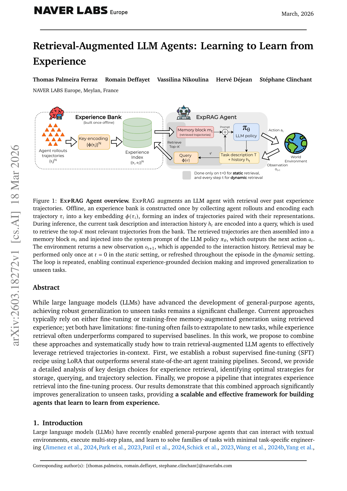
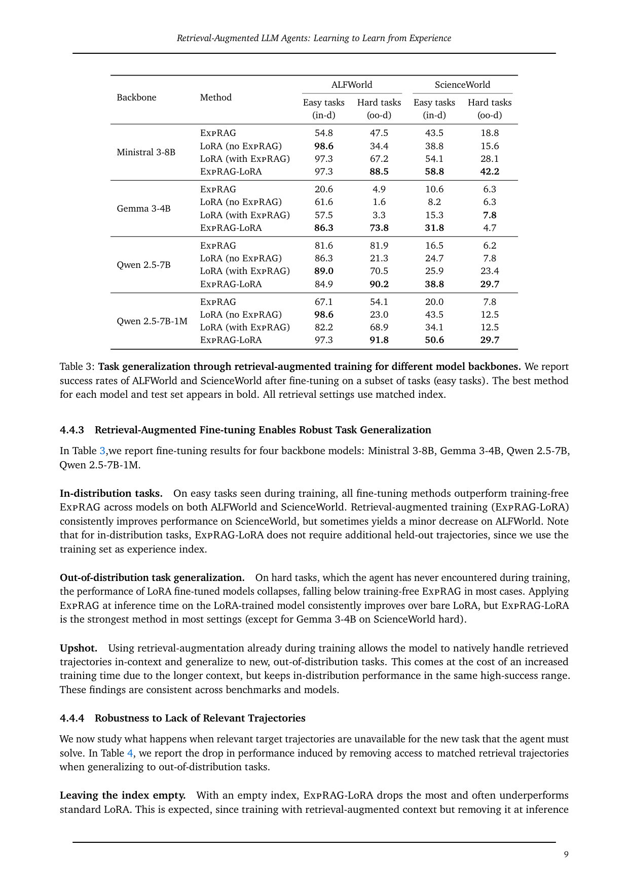

`exprag | Retrieval-Augmented LLM Agents: Learning to Learn from Experience | NAVER LABS Europe（Meylan, France；Ferraz, Deffayet, Nikoulina, Déjean, Clinchant，IR/RAG 谱系） | 2026-03（arXiv v1, 2603.18272, cs.AI, 预印本） | 主题线 L1 经验复用·检索 + L4 PEFT 训练·相关性 High`

> 三标注：【原文】=论文直述；【推断】=本人有据判断（附依据）；【待核】=拿不准关键事实。
> 核验：基于真实下载 PDF 正文（pdftotext -layout 全文 31 页，含正文 §1–5 + 附录 A–F）；非 WebFetch 摘要。

══ 第一层：一眼看懂 [light] ══

- 🟦 **TL;DR**：要让中小开源 LLM Agent 在"同一环境内的没见过的新任务"上也能做对，本文不搞花哨记忆架构，而是做两件朴素的事：① 把过去的整条交互轨迹（observation/action 序列）存成一个**只读的经验库**，做任务时**检索 top-K 条相关轨迹塞进 system prompt**（这套叫 **ExpRAG**，纯推理期、不训）；② 进一步把"带检索轨迹的上下文"也用进 **LoRA 微调**（叫 **ExpRAG-LoRA**），让模型在训练时就学会"如何利用检索来的经验"，而不是死记训练答案。结果：普通 LoRA 在没见过的 hard 任务上**崩盘**，而 ExpRAG-LoRA 能稳住、显著泛化。核心立场是"先建强 baseline 再谈复杂架构"。【原文 Abstract/§1/§5】

- **最巧的一步**：把检索经验**从"只在推理期用"前移到"训练期也用"**（ExpRAG-LoRA，§4.4）。抽掉这一步（即只在 inference 加检索、训练仍是普通 LoRA），模型在 OOD hard 任务上就会塌（Table 3：LoRA hard 任务远低于训练-free ExpRAG）。为什么是它：只有在训练时就喂检索上下文，模型才会**学会"读检索、用检索"这个技能本身（learn to learn）**，而非把训练任务的答案背进 LoRA 权重——这正是论文标题"learning to learn from experience"的兑现点，也是它区别于一切"纯推理期 RAG"工作的关键差异。【原文 §4.4.3 Table 3】

══ 第二层：为什么做（写透） ══

- **研究背景**：LLM Agent 能多步决策、解一族任务；提升手段有 prompting/reflection 与 PEFT 微调。但"真正有用的 agent 应能做环境内**没见过的**任务"——而现有两条路各有硬伤。【原文 §1】
- **解决的具体痛点**：
  - **微调（SFT/LoRA）**：in-domain 强，但**外推到新任务常失败**（分布漂移 + 序列决策的误差累积），hard 任务上直接崩。【原文 §1/§2 / §4.4.3】
  - **训练-free 记忆增强检索经验**：常**打不过监督 baseline**；且很多复杂"自进化记忆系统"其实**还不如一个简单的轨迹检索**（Table 1：复杂 Mem0/A-MEM/Reflexion ≤ 简单 ExpRAG baseline 83.6%）。【原文 §1 Table1a】
  - 一个被忽视的痛点：领域里 **fine-tuned 模型性能在不同论文间差异极大**，缺乏可靠强 baseline，导致"复杂方法看着有用"其实只是 baseline 太弱。【原文 §1 贡献①】
- **相关工作 & 不足**：
  - **LLM agent 训练**（FireAct/Agent-FLAN/ETO/SFT+ReAct/RL 系）：SFT/行为克隆 in-domain 好但泛化差；RL/偏好更新更强但贵。本文发现**简单 PEFT 已能超复杂方法**，于是转向正交方向=经验检索。【原文 §2 LLM-based agents】
  - **经典 RAG**（REALM/RAG/RETRO/Atlas/RAFT）：检索的是**文档（语义记忆）**用于 QA。本文借"检索即上下文"视角，但**把语义记忆换成 episodic 记忆**——检索的是**过去交互轨迹**来指导动作选择。【原文 §2 RAG】
  - **Agent 记忆系统**（MemGPT/Reflexion/A-MEM/Memento）：都有显式写入/压缩/反思/读写控制器。本文**反其道**：不提新记忆控制器、不在线更新、不反思——**记忆刻意做成"固定、只读的整轨迹库"**。最近邻是 Wei et al.(2025)（同期、造了 ExpRAG 一词），但那篇用强闭源模型比"纯推理检索 vs 自进化读写记忆"；本文**研究弱开源模型 + 检索期 vs 训练期两种用法**。【原文 §2 Memory for agents / Position】
- **动机链**：要泛化到环境内新任务 → 纯微调会 OOD 崩、纯检索打不过监督 → 那就**两者结合**；但先要有诚实强 baseline（否则比不出名堂）→ 于是先造 LoRA baseline（Table1b 94.1%，超 ETO/SAND/规则专家）+ ExpRAG baseline → 再系统消融"经验怎么存/怎么查/查多少/何时查"（§4.3）→ 最后把检索**注入训练**（ExpRAG-LoRA），让模型学会用检索 → OOD 泛化稳住。为什么不用更简单做法：实验证明只在推理期加检索（LoRA+ExpRAG）虽比裸 LoRA 好，但**训练期也加（ExpRAG-LoRA）在多数 OOD 设定下最强**（§4.4.3），所以必须把检索前移到训练。【原文 §1/§3/§4.4】
- **与最近邻工作的 Δ**：
  - vs **Wei et al.(2025)（同期 ExpRAG 命名者）**：那篇用**强闭源模型**比"推理检索 vs 自进化读写记忆"；本文用**弱开源模型 + 把检索引入 fine-tuning**，并明确区分"检索增益 vs 参数更新增益"。差异关键点 = 研究"训练期检索"这一未被系统研究的维度。【原文 §2 Position】
  - vs **Memento（本批 memento.md）**：Memento 学一个**可微检索策略（soft Q-learning）**且冻结 LLM；ExpRAG**不学检索器（用固定 Qwen3-Embedding 余弦/点积 top-K），却去微调 LLM 本体（LoRA）**——两者在"训哪一侧"上正好相反，互为对照。【原文 §2 列 Memento 为对比；推断：训练对象互补】
  - vs **标准 LoRA**：唯一差别=训练上下文里**多了检索来的经验块**，使模型学会"读经验"；这一个改动把 OOD hard 从崩盘救回（Table 3）。【原文 §4.4.3】

══ 第三层：怎么做 + 靠不靠谱 ══

- **方法流水线（§3 + Figure 1）**：
  1. **离线建经验库（once）**：收集 agent rollouts → 每条轨迹 τ 用编码器 \(φ(τ)\) 编成 key embedding → 形成索引 \({(τ_i, e_i)}\)。轨迹存为**原始 chat 格式**（observation→user turn，action→assistant turn），不过滤不聚合。【原文 §3 Indexing】
  2. **构造 query 检索**：决策步 t 用当前 context（task 描述 + 历史 h_t）编成 query → 点积最近邻取 **top-K** 轨迹。两种模式：**static**（只在 t=0 查一次，用 task 描述当 query/key）/ **dynamic**（每步重查，用部分轨迹当 query、全轨迹当 key，但要清 KV cache 重编码）。【原文 §3 + Fig1】
  3. **经验条件生成**：检索到的轨迹拼成 **memory block**（模板区分"successful/unsuccessful trajectories"）插进 system prompt → LLM policy π 在 memory + 对话历史上**自回归产出动作**。【原文 §3 + 附录 B.3】
  4. **（核心）训练期注入 = ExpRAG-LoRA**：把同一套检索 memory block 也加到**每条训练上下文**里做 LoRA SFT（仅在 assistant token 上算 CE 损失），让模型学会"靠检索轨迹解题"而非背训练目标。【原文 §4.4.2】
  5. 评测时在 easy（训练见过=in-distribution）与 hard（held-out=OOD）两子集上分别报成功率，隔离泛化能力。【原文 §4.1/§4.4.2】
- **逐组件必要性（消融充分，§4.3 Table2 / §4.4 Table3/4）**：
  - **检索本身**：开检索 vs No-RAG，ALFWorld 4.48%→64.18%、ScienceWorld 10.40%→35.24%（Ministral-3-8B）——**没它**几乎做不动。【原文 §4.3.1 Table2，有消融】
  - **top-K**：K 增大总体变好但有"context rot"——ALFWorld 41→64(K=1→4)单调升，ScienceWorld 早饱和(26.6→34.7→35.2)、mismatched index 下大 K 反而掉。默认取 **K=2**（成本/收益折中）。**长上下文模型(Qwen2.5-7B-1M)受益于更大 K**。【原文 §4.3.1，有消融】
  - **static vs dynamic 检索**：dynamic 仅在 index 匹配时有用，mismatched 时更不稳（"context churn"：旧动作还在 prompt 但支撑它的轨迹被换掉）。主实验默认 **static**。【原文 §4.3.1，有消融】
  - **index 组成**：mismatched（hard 任务用 easy index）变差，但仍有跨拆分增益（hard 常由 easy 子任务组成）。【原文 §4.3.1，有消融】
  - **训练期检索（ExpRAG-LoRA）**：in-distribution 与裸 LoRA 同档高位；**OOD hard 上裸 LoRA 崩、ExpRAG-LoRA 多数最强**（Table 3）。**没它**则 OOD 塌。【原文 §4.4.3 Table3，有消融】
  - **无相关轨迹时的鲁棒性**：空 index 时 ExpRAG-LoRA 掉最多（训练有检索、推理抽走=分布漂移）；保留训练 index（mismatched）比空 index 好——建议"宁可用训练经验也别完全没经验"。【原文 §4.4.4 Table4，有消融】
- **关键机制/公式（直觉）**：核心没有花哨公式——检索是**点积最近邻 top-K**，生成是标准自回归 \(π(·|m_t, c(τ)_{≤t})\)，训练是**只在 assistant token 上的 CE**。最"机制性"的洞见是**多轮 chat 序列化优于逐步序列化**：把整条轨迹当一个多轮对话编码，可**跨轮复用 KV-cache**，训练快很多且性能相当（§3）。以及一个**反直觉训练动力学**：OOD 成功率常在 validation loss 已上升（常被当过拟合）之后**继续涨**，最佳 OOD checkpoint 常落在 50 epoch（远超常规 early-stop）——作者类比 **grokking / 延迟泛化**，但明确声明**只给经验观察、不claim 机制解释**。【原文 §3 / §4.4.1】
- **实验与证据**：
  - 环境：**ALFWorld**（家居操作，二值成功；6 task-types）、**ScienceWorld**（小学科学课程，dense \(score∈[-1,1]\)，转二值；10 topics）。把每环境 task 组切成 **easy（训练）/ hard（held-out OOD）**。backbone：**Ministral-3-8B / Gemma-3-4B / Qwen2.5-7B / Qwen2.5-7B-1M**（均 instruction-tuned）。检索器 = **Qwen3-Embedding-0.6B（固定，不调）**。【原文 §4.1/§4.2/附录B】
  - **支撑核心主张的关键实验**：① **Table 3** 四 backbone × 两环境，ExpRAG-LoRA 在 OOD hard 上多数最强、裸 LoRA 崩（如 Qwen2.5-7B ALFWorld hard：LoRA 4.9 → ExpRAG-LoRA 90.2；ScienceWorld hard 同样大幅领先）。② **Table 2** 检索从 No-RAG 大幅提升（ALFWorld +60 点）。③ **Table 1b** LoRA baseline 94.1% 超 ETO/SAND/规则专家——立"先建强 baseline"。④ **Table 4** 无相关轨迹时的退化诊断。【原文 Table1/2/3/4】
  - **baseline 公平性**【原文已声明 + 推断】：Table 1 是**跨论文聚合比较**，作者**明确标注"应定性解读"**（不同 setup），很诚实；本文自做的 Table 2/3/4 是同 backbone 同 setup 的受控对比，公平性好。一个"看着强但需注意"的点【推断】：所有经验库都用**脚本专家轨迹（环境内置策略）**而非真实 LLM 自产轨迹，作者也承认其失败模式**不反映 LLM agent 真实错误**——故"检索对真实自产错误的迁移"未被验证。【依据=§5.1 Limitations 明述】
- **假设与失效边界**：
  - 【原文】**经验来源理想化**：index 用脚本专家轨迹（含失败但非 LLM 自产），是受控简化；现实噪声轨迹下未验证（§5.1）。
  - 【原文】**强依赖轨迹覆盖度**：task-relevant 轨迹缺失时 OOD 泛化"sharply degrade"（§4.4.4/§5.1）。
  - 【原文】**固定只读记忆**：无 consolidation/写入/淘汰，长程可扩展性留待 future work（§5.1）。
  - 【推断】**"环境内泛化"而非跨环境**：所有 hard 任务仍在同一环境、动力学固定，只是动作序列不同；跨环境/跨域迁移不在范围。【依据=§3 "within the same environment" + easy/hard 同环境切分】
  - 【推断】**上下文容量是上限**：大 K 收益受 backbone 上下文处理能力限制（1M 模型才吃得下更多经验），弱上下文模型大 K 反伤。【依据=§4.3.1 + Qwen-1M 对比】
- **祛魅总结**：
  - **真贡献（硬货）**：① **诚实的强 baseline**（LoRA 94.1% + ExpRAG 83.6%），实证"很多复杂自进化记忆 ≤ 简单轨迹检索"，对整个 agent-memory 领域是有价值的**降温/校准**信号。② **ExpRAG-LoRA**：把检索引入训练这一未被系统研究的维度，干净证明"训练期用检索 → learn to learn → OOD 不崩"。③ **工程 insight**：多轮 chat 序列化(KV-cache 复用)更快、static 比 dynamic 稳、K=2 性价比、长训练带来延迟泛化——都是可直接复用的实操经验。④ 完整公开超参/数据切分（附录 B 全给）。
  - **包装/营销成分**【推断】：(a) 方法本身**极其朴素**（固定检索 + LoRA），论文的"价值"主要在实证与校准而非技术新颖性——作者其实坦然承认"不提新记忆架构"（§2 Position），这是诚实而非缺点。(b) "learning to learn from experience"标题略大于内容：本质是"训练时也喂检索上下文"，并非元学习意义的 learn-to-learn。(c) grokking 类比是**贴标签式**联想，作者自己声明不claim 机制，读者勿过度解读。整体**低估包装、贡献真实**，是一篇"反潮流建 baseline"的扎实工作。【依据=§2 Position 自述 + §4.4.1 免责声明】

══ 结构化抽取 ══

- 🎯 **机制速览 6 轴** [light]：

| 学什么信号 | 改什么 | 何时改 | 免梯度? | 记忆-技能生命周期 | 防遗忘机制 |
|---|---|---|---|---|---|
| 经验库（过去整条轨迹，含成功/失败标注）;监督信号=专家轨迹的 next-token（CE）;无环境 reward/无自反思 | 两种：① **prompt/记忆**（推理期 ExpRAG，检索轨迹注入 system prompt，LLM 不变）;② **参数**（ExpRAG-LoRA，低秩适配器 q/k/v/output_proj，rank8） | ExpRAG=test-time per-step（dynamic）或 per-episode（static）;ExpRAG-LoRA=离线批量训练（\(≤50\) epoch） | **混合**：纯 ExpRAG 免梯度;ExpRAG-LoRA 有梯度但**仅 LoRA 适配器**（base 冻结） | 写入=**离线一次性建库、之后只读**（无在线写）→检索=Qwen3-Embedding 点积 top-K（static/dynamic）→**淘汰/遗忘=无**（固定库，作者明列为 future work）→共享=经验可来自他 agent/专家 demo | **隔离式**（知识在外部只读库，base 冻结故底层不遗忘）;ExpRAG-LoRA 侧无显式防遗忘，但"训练期带检索"被论证为**抗 OOD 崩塌**的功能性替代;无几何/KL/merging 【原文 §5.1 承认无 consolidation】 |

- ⑦ **开源代码 + 框架/harness**：**未找到本作的开源代码仓库**——全文（含附录 A–F）**无 github/项目主页/"code available"声明**；仅给出所用**现成 HF 模型**链接（检索器 `Qwen/Qwen3-Embedding-0.6B`，四个 backbone 的官方 checkpoint）与库主页（sbert.net）。【原文 附录 B.1/B.5，已全文核查 grep 仅命中 huggingface 模型链接】〔代码可用性=未开源/未找到，需 P3 仓库核查环节确认是否后续放出〕【待核：是否有未在 PDF 写出的仓库】
  - **使用框架/harness（明确）**：训练 = **TorchTune**（Meta PyTorch finetuning 库，LoRA SFT，仅 assistant token CE）;推理 = **HuggingFace Transformers**（作者称更高效）;嵌入 = **Sentence-Transformers**;环境 = **ALFWorld / ScienceWorld** 官方 env。**未用 veRL/TRL/OpenRLHF/LLaMA-Factory**（非 RL 训练，纯监督 LoRA）。【原文 §4.2/附录 B.4】

- 💰 **资源/成本与可扩展性**【原文 §4.2/附录 B.4/B.6 + §4.3.1/附录F】：训练**单张 80GB NVIDIA A100** 即可（LoRA rank8/alpha16/dropout0.1，PagedAdamW8bit，lr 5e-5 constant，bf16，greedy 解码，seed 2025）。主实验训练预算：ALFWorld 9 epoch / ScienceWorld 29 epoch（但 OOD 最佳常在更长，最多测到 50 epoch）。**推理成本随 top-K 近线性增长**（故默认 K=2 而非 4 以省 prompt 长度/延迟，详见附录 F）。dynamic 检索更贵（每步清 KV-cache 重编码）。可扩展性瓶颈：固定库随任务增多会膨胀（无淘汰）+ 上下文长度限制。

- 🎯 **对"探索-巩固"idea 对标** [light]：**强支撑 + 可借组件 + 可作对照基线**。
  - **强支撑**：本文核心结论"**训练期就把检索经验喂进去，模型才学会用经验、OOD 才不崩**"，直接支持 TSRD"巩固阶段要把教师脚手架/历史路径在训练时显式注入"的思路——证明"推理期才用"远不如"训练期一起用"。
  - **可借组件**：① **ExpRAG-LoRA 配方**（检索 memory block 注入训练上下文 + 仅 assistant token CE）可直接迁移为"把教师示范/MTP-foresight 探针结果注入 OPD 训练上下文"。② **多轮 chat 序列化 + KV-cache 复用** 是降低长轨迹/长脚手架训练成本的实操积木。③ **memory block 区分 successful/unsuccessful** 与项目"既存成功路径也存失败以供 path-recovery"同构。④ **延迟泛化(grokking)观察**提示"巩固训练别过早 early-stop"。⑤ Table1 的降温信号支持"先比简单 baseline 再上复杂蒸馏"。
  - **可作对照基线**：纯 ExpRAG（固定检索、不学检索器、不动 base）= "只靠外部经验、零参数学习"的极简对照，可量化"探索-巩固蒸馏相对纯检索多带来多少"。
  - **缺口/与 idea 的张力**：ExpRAG 记忆**固定只读、无主动探索、无 MTP foresight、无淘汰/巩固机制**——正是探索-巩固 idea 要补的空白（主动探索产生轨迹 + 选择性巩固 + 防遗忘）。其经验来自**脚本专家**而非 agent 自产，也与"自进化"路线相反。【推断：基于 §5.1 自承 + 方法定位】

- 🔭 **开放问题/未来方向**：
  - 【原文 §5.1】① 在**更噪声的记忆源**（LLM 自产、质量不一的 rollouts）下评测鲁棒性;② 探索**自进化设定**（agent 反复尝试相关任务、在线从自己的成败中 in-context 学）;③ 更有原则的**数据收集/记忆构造/检索策略**;④ 引入**读写记忆 + consolidation**（摘要/抽象/选择性保留）提升可扩展与长程适应;⑤ 对延迟泛化做**因果/机制分析**（§4.4.1 留作 future work）。
  - 【推断】把固定检索器换成**可学检索策略**（与 Memento 的 soft-Q 检索结合），并研究跨环境迁移。【依据=本文固定 Qwen-Embedding 不调 + 仅环境内泛化】

- 🖼 **关键图 top-2** [light]：

  
  · 这是**原文 Figure 1**：完整 pipeline——**离线**建 Experience Bank（agent rollouts → key encoding \(φ(τ)\) → 轨迹索引），**在线**用 task 描述+历史编 query → 检索 top-K 轨迹 → 拼成 memory block 注入 LLM policy 的 system prompt → 输出动作 a_t → 环境返回 observation；右下注明 **static（t=0 查一次）vs dynamic（每步重查）**。选它因为一图说清"只读经验库 + 检索注入上下文"的全部机制，是方法精华。【原文 Figure 1】

  
  · 这是**原文 Table 3**（关键表）：四 backbone × {ALFWorld, ScienceWorld} × Easy(in-distribution)/Hard(OOD)，对比 ExpRAG / LoRA(no ExpRAG) / LoRA(with ExpRAG) / **ExpRAG-LoRA**。选它因为它是全文最 load-bearing 的证据——直观展示"**裸 LoRA 在 hard(OOD) 任务上崩盘、而 ExpRAG-LoRA 稳住并多数最强**"，正是论文"learn to learn from experience"主张的兑现。【原文 Table 3】
